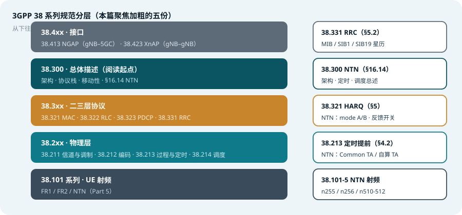

## 本篇要解决什么

打开 3GPP 官网，5G NR 相关的规范编号从 38.101 排到 38.5xx，第一反应往往是「该读哪份、从哪读起」。本篇给一张<strong>规范地图</strong>：先看 38 系列的分层分工，再逐张讲清与本站专题关系最紧密的五份规范——每份给出「管什么、关键章节、什么时候翻它、官方链接」。

对照：所有 38 系列规范都在 3GPP 官网可查（Portal → Specifications），正式文本由 ETSI 发布 PDF。
相关：[5G NTN](5g-ntn.html)、[随机接入](random-access.html)、[NR RRC 与 RRC Reconfiguration](nr-rrc-reconfiguration.html)、[5G SIBs](5g-sibs.html)。

*图 1：38 系列按「UE 射频 → 物理层 → MAC/RLC/PDCP → RRC → 总体架构 → 接口」分层，本篇聚焦其中五份*

---

## 总览：38 系列的分层分工

| 系列 | 领域 | 代表规范 |
| --- | --- | --- |
| 38.101 系列 | UE 射频（含 NTN 的 Part 5） | 38.101-1 FR1、38.101-2 FR2、38.101-5 NTN |
| 38.2xx | 物理层 | 38.211 物理信道与调制、38.212 编码、38.213 物理层过程、38.214 调度 |
| 38.3xx | 二三层协议 | 38.321 MAC、38.322 RLC、38.323 PDCP、38.331 RRC |
| 38.4xx | 接口 | 38.413 NGAP（gNB–5GC）、38.423 XnAP（gNB–gNB） |
| 38.300 | 总体描述 | 整个 NR 的「目录页」，一切阅读的起点 |

> **阅读建议**：从 38.300 读起建立全景，再按问题域下钻——定时/过程问题查 38.213，重传与定时器查 38.321，系统消息与 RRC 配置查 38.331，频段与射频指标查 38.101 系列。

---

## TS 38.300：NR 总体描述（Stage 2）

- **管什么**：整个 NR 的总体架构与功能描述——网络架构（gNB/ng-eNB、CU/DU）、协议栈、连接态/空闲态/非激活态、移动性、以及各类特性总述
- **关键章节**：§5 无线协议架构；§9 移动性；§16 各类特性专题（其中 **§16.14 NTN**：总体架构、定时与调度、HARQ 增强、三类 service link）
- **什么时候翻它**：想了解「某个功能整体上是怎么设计的」；NTN 相关结论的第一出处
- **官方链接**：[3GPP 规范页 38.300](https://www.3gpp.org/dynareport/38300.htm)

本站对应：[5G NTN：非地面网络](5g-ntn.html)、[5G NR 无线接入架构速览](5g-nr-architecture.html)。

---

## TS 38.213：物理层过程（控制面）

- **管什么**：UE 侧物理层「过程与定时」——什么时候收、什么时候发、提前多少
- **关键章节**：§4.2 定时提前（\(N_{TA}\)、\(N_{TA,offset}\)，NTN 的 Common TA / UE 自算 TA 也落在这里）；§4 SSB/PRACH 时频位置（Case A–E）；§8–10 随机接入、HARQ 定时、CSI 触发时序
- **什么时候翻它**：排「时间对不上」类问题——TA、k2、k1、RAR 窗口、HARQ RTT 时序
- **官方链接**：[3GPP 规范页 38.213](https://www.3gpp.org/dynareport/38213.htm)

本站对应：[5G 帧结构与 SS/PBCH Block](frame-structure-ssb.html)、[SSB 的几种 Case](ssb-cases-positions.html)、[NR Power Control](nr-power-control.html)、[随机接入](random-access.html)。

---

## TS 38.321：MAC 层

- **管什么**：MAC 子层——HARQ 实体与进程、BSR/PHR 上报、DRX、随机接入的 MAC 侧行为、各类 MAC CE
- **关键章节**：§4 结构与定时器；§5.1 HARQ（NTN 的 mode A/B、反馈使能开关落在这里）；§5.4.3 HARQ mode 配置；§5.7 NTN 相关增强；§6 MAC CE 格式
- **什么时候翻它**：查「重传怎么转、定时器多长、反馈等不等」——NTN 下 HARQ 反馈禁用、进程数扩展的规范依据
- **官方链接**：[3GPP 规范页 38.321](https://www.3gpp.org/dynareport/38321.htm)

本站对应：[随机接入](random-access.html)（RAR/竞争解决的 MAC 行为）、[5G NTN](5g-ntn.html)（HARQ 增强表）。

---

## TS 38.331：RRC 层

- **管什么**：RRC 协议——MIB/SIB 系统消息、连接建立/重建、测量与移动性的 RRC 信令、全部 AS 层配置参数（IE 树）
- **关键章节**：§5.2 系统消息（MIB、SIB1、SI 调度；NTN 的 **SIB19** 星历与 Common TA 在此定义）；§5.3 连接控制；§5.5 测量（measConfig、事件 A1–A6）；§6 消息与 IE 定义
- **什么时候翻它**：查「某个配置参数叫什么、在哪个消息里、取值范围多少」——做参数核查与信令分析的日常工具书
- **官方链接**：[3GPP 规范页 38.331](https://www.3gpp.org/dynareport/38331.htm)

本站对应：[NR RRC 与 RRC Reconfiguration](nr-rrc-reconfiguration.html)、[5G SIBs：系统消息](5g-sibs.html)、[CORESET 与 Search Space](coreset-search-space.html)。

---

## TS 38.101-5：UE 射频要求（NTN 部分）

- **管什么**：38.101 系列是 UE 射频指标族——Part 1 管 FR1、Part 2 管 FR2，**Part 5 专门管 NTN**：NTN 频段（n255/n256/n510/n511/n512）、发射功率等级、接收灵敏度、信道带宽等，面向「Satellite Access Node」场景
- **关键章节**：§5 工作频段与信道安排；§6 发射特性；§7 接收特性
- **什么时候翻它**：做 NTN 终端能力/频段合规判断时——「这个频段 UE 支不支持、最大发多少功率」
- **官方链接**：[3GPP 规范页 38.101-5](https://www.3gpp.org/dynareport/38101-5.htm)

本站对应：[5G NTN](5g-ntn.html)（NTN 频段表）。

---

## 一句话总结与自测

> **38.300 讲「是什么」，38.2xx 讲「物理层怎么算」，38.3xx 讲「协议怎么转」，38.101 讲「终端做得到吗」。**

1. 排查「RAR 窗口起点异常」应该查哪几份规范的哪些章节？
2. NTN 的 Common TA 与 \(K_{offset}\) 分别定义在哪份规范？SIB19 呢？
3. 38.300 与 38.213 的关系是什么？为什么说前者是「目录页」？

---

## 延伸阅读

- [3GPP Portal：规范检索入口](https://portal.3gpp.org/desktopmodules/Specifications/SpecificationList.aspx)——按编号/关键词查所有规范与版本
- [ETSI 发布的 3GPP 正式 PDF](https://www.etsi.org/standards-search)——免费下载各版本全文
- [ShareTechnote NTN 笔记](https://sharetechnote.com/html/NTN/NTN_TA.html)——工程视角的图解补充
