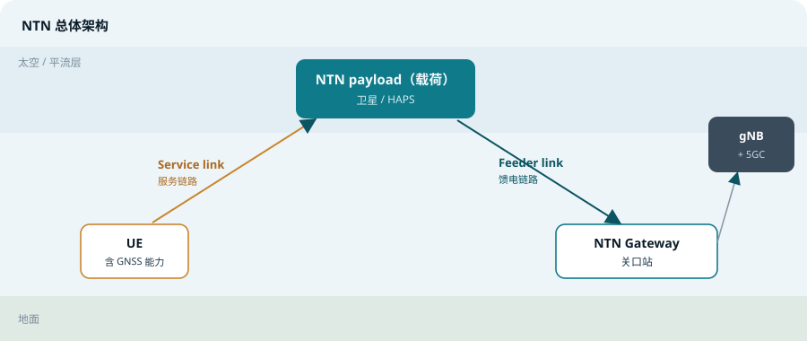
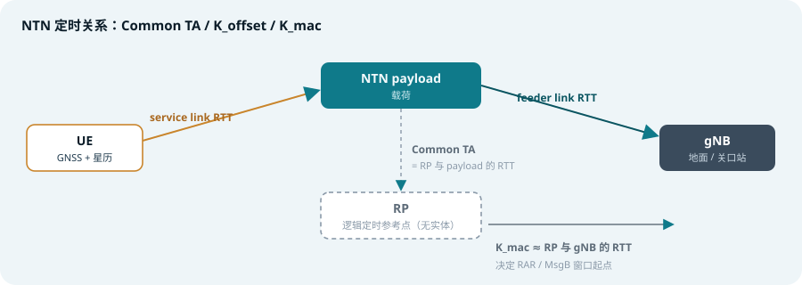
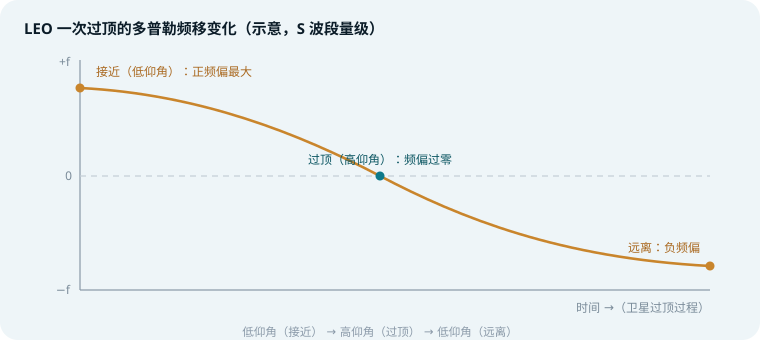

## 本篇要解决什么

地面蜂窝网络的假设是「基站离你不远」。NTN（Non-Terrestrial Network，非地面网络）把这个假设彻底推翻：基站可能在天上 600 km，也可能在 35786 km 之外。距离一变，**时延**与**多普勒**这两个物理量就放大到地面网络的千倍量级，3GPP 为地面场景写下的定时器、反馈回路、测量门限几乎全部失效。

所以 NTN 的本质不是「新空口」，而是 **NR 既有机制在极端时延与频偏下的重新参数化**——波形、调制、编码、numerology 都没有变，变的是「什么时候发、什么时候等、以什么频率发」。

> **一条主线**：NTN 的所有关键增强，都是为了回答同一个问题——当往返时延达到几十甚至几百毫秒时，UE 与网络如何依然保持时间与频率上的对齐。

对照：**TS 38.300**（NTN 总体与定时调度）、**38.213**（定时提前）、**38.321**（MAC/HARQ）、**38.331**（SIB19 星历）。
相关：[3GPP 规范地图](3gpp-spec-map.html)、[5G 帧结构与 SS/PBCH Block](frame-structure-ssb.html)、[随机接入](random-access.html)、[小区搜索](cell-search.html)、[DCI 与 UCI](dci-uci.html)、[NR Power Control](nr-power-control.html)。

---

## 一、为什么需要 NTN

地面网络的经济性决定了它只能覆盖「有人、有需求、有回传」的区域。全球仍有大量陆地面积、几乎全部海洋、以及全部空域处于蜂窝覆盖之外。NTN 要补的正是这三块：

- **覆盖补盲**：沙漠、山区、远洋、极地等回传成本过高的区域
- **应急通信**：地震、洪水导致地面基础设施损毁时，卫星链路是唯一可用的通道
- **行业与移动平台**：海事、航空、铁路、能源管线巡检等天然跨区域的业务
- **空天地一体化**：6G 愿景中，地面、低空、卫星将共用一套核心网与协议体系

从运营商视角看，NTN 的战略价值在于把「覆盖」从成本项变成可选能力：不必为每个盲区单独建站，而是用卫星波束一次性覆盖。

---

## 二、NTN 体系构成

TS 38.300 第 16.14 节给出了 NTN 的整体框架，核心由四部分组成：

- **NTN payload（载荷）**：卫星或高空平台上的通信载荷
- **NTN Gateway（网关）**：连接载荷与地面网络的关口站
- **Service link（服务链路）**：UE 与载荷之间的无线链路
- **Feeder link（馈电链路）**：载荷与网关之间的无线链路

载荷可以做两件事之一：**透明转发**（transparent，俗称 bent-pipe，只做放大与变频，gNB 留在地面）或**再生转发**（regenerative，gNB 或 DU 上星，在轨完成解调译码）。

一个网关可以服务多个载荷，一个载荷也可以由多个网关服务——这种多对多关系是卫星切换与馈电链路冗余的基础。

*图 1：UE 经 service link 上行至载荷，再经 feeder link 回传网关并接入 gNB / 5GC（对应 TS 38.300 Figure 16.14.1-1）*

---

## 三、轨道类型：一切参数的源头

轨道高度是决定 NTN 设计的第一性因素。它同时决定了时延、多普勒、可视时长与覆盖形态，而这些量又反过来决定定时补偿的粒度、HARQ 能否工作。

| 类型 | 典型高度 | 单向时延量级 | RTT 量级 | 多普勒 | 可视时长 |
| --- | --- | --- | --- | --- | --- |
| LEO（低轨） | 500 ~ 1200 km | 约 2 ~ 4 ms | 约 6 ~ 30 ms | 大，可达数十 kHz，且快速变化 | 几分钟 |
| MEO（中轨） | 约 8000 ~ 20000 km | 数十 ms | 百 ms 量级 | 中等 | 数十分钟 ~ 数小时 |
| GEO（静止轨道） | 约 35786 km | 约 120 ms | 约 240 ms 以上 | 几乎为零（轨道运动引起） | 持续可见 |
| HAPS（高空平台） | 约 20 km | 远小于 1 ms | 亚毫秒 | 小 | 准静止 |

**读表要点**：LEO 与 GEO 的难点完全不同——LEO 是「时延中等但变化剧烈」，GEO 是「时延巨大但极稳定」。同一套 3GPP 机制要覆盖两者，就必须把可配置的自由度做大。这也是为什么 NTN 增强几乎全是「把常量变成可配置量」。

> **记忆**：LEO 怕「变」，GEO 怕「大」。前者靠高频次自算补偿，后者靠禁用反馈 + 拉长定时器。

---

## 四、时延带来的根本性冲击

地面 NR 的许多机制暗含了「RTT 只有几毫秒」的假设。这些机制在 NTN 下会直接崩溃：

- **HARQ 停等协议**：发送后要等 ACK/NACK 才能发下一个，等待时间等于一个 HARQ RTT。GEO 下单向 120 ms，吞吐会塌陷
- **TA 生效时间**：地面 TA 命令在几毫秒内生效即可；NTN 下命令需要飞行一个单程时延才到 UE，时序完全不同
- **RAR / MsgB 窗口**：随机接入响应窗口起点必须后移，否则 UE 会在响应到达前就超时
- **RLC / PDCP 定时器与 RLF**：重传定时器、链路失败检测门限都按地面 RTT 标定，需整体拉伸
- **SPS / CG 与 CSI 反馈**：调度与反馈之间的时间关系被拉长，\(K_{offset}\) 用来显式补上这段空白

所以 NTN 增强可以概括为一句话：**凡是「等多久」「什么时候生效」的地方，都需要重新给一个可配置的偏移量。**

---

## 五、定时关系与同步机制（核心）

### 1. 时间同步参考点 RP

TS 38.300 定义**上行时间同步参考点**（uplink time synchronization reference point, RP）：在该点上，上下行帧定时彼此对齐，相差一个 \(N_{TA,offset}\)（定义见 TS 38.213 4.2 节）。

关键理解：**RP 是一个定时定义，不是一台设备。** 没有设备安装在 RP 处，没有任何东西从 RP 发射。规范甚至不会告诉 UE「RP 在哪里」——SIB19 里没有它的位置字段。UE 拿到的只是 `ta-Common`，也就是 RP 与载荷之间的往返时延。

> 可以类比矢量网络分析仪的**校准参考面**：参考面可以位于一根电缆的正中间，那里没有连接器、没有器件、没有任何可指认的对象，但此后所有测量都以它为基准。RP 就是把这一思想用在定时上。

这样做的好处是：同一套定时方程，既能描述「透明转发 + 地面 gNB」，也能描述「再生转发 + 星上 gNB」，无需为每种架构单独写规范。

### 2. 三个关键定时量

| 量 | 定义 | 作用 |
| --- | --- | --- |
| Common TA | 等于 RP 与 NTN payload 之间的 RTT | 网络广播的公共定时偏移，覆盖馈电链路部分 |
| \(K_{offset}\) | 配置的调度偏移，需 ≥ service link RTT + Common TA | 给 UE 留出「收到下行 → 发出上行」的处理时间，如 DCI 授权到 PUSCH、授权到 CSI |
| \(K_{mac}\) | 约等于 RP 与 gNB 之间的 RTT | 推迟 PDSCH 上 MAC CE 命令指示的下行配置生效时刻；确定 Msg1/MsgA 之后 RAR 窗口 / MsgB 窗口的起点；参与 UE-gNB RTT 估计 |

用文字串起来：**Common TA 补偿「网络侧」的公共时延，\(K_{offset}\) 补偿「UE 侧」的处理与传播时间，\(K_{mac}\) 补偿「gNB 与参考点之间」的时延。**

*图 2：Common TA 覆盖 RP 与载荷之间，\(K_{mac}\) 覆盖 RP 与 gNB 之间，\(K_{offset}\) 补足 UE 处理与 service link 传播时间（对应 TS 38.300 Figure 16.14.2.1-1）*

### 3. 总定时提前

NTN 的定时提前被拆成四部分：网络广播的公共分量，加上 UE 自算的分量。总形式为：

\[ T_{TA}=\left(N_{TA}+N_{TA,offset}+N_{TA,adj}^{common}+N_{TA,adj}^{UE}\right)\cdot T_c \]

其中 \(N_{TA}\) 来自网络下发的 TA 命令，\(N_{TA,offset}\) 是频段相关的固定偏移，\(N_{TA,adj}^{common}\) 对应广播的 Common TA，\(N_{TA,adj}^{UE}\) 则由 UE 自己根据 GNSS 位置与广播星历计算得出。

这是 NTN 与传统蜂窝最本质的**反转**：地面网络里，网络测量定时并命令 UE 如何调整；NTN 里，UE 必须自己算出该提前多少——因为一个 RTT 太长，等网络指示再调整根本来不及。

> **GNSS 依赖**：Rel-17 支持 NTN 的 UE 被定义为 GNSS-capable。工程实践中，没有定位能力就无法算出自己的 TA，因此「GNSS 定位」实际上构成了 NTN 接入的前置条件。

### 4. 星历与 SIB19

UE 要自算 TA 与时频补偿，就必须知道卫星在哪儿、往哪儿去。这些信息由 SIB19 承载，包括：

- **星历（ephemeris）**：卫星轨道参数，用于推算任意时刻的位置与速度
- **Common TA 参数**（`ta-Common` 及相关漂移量）：RP 与载荷之间的往返时延及其变化趋势
- **参考位置与服务小区信息**：辅助 UE 判断自身与波束覆盖的关系

UE 在连接 NTN 小区之前，必须同时具备**有效 GNSS 位置**与**有效星历 + Common TA**。缺一不可。

---

## 六、频率预补偿与多普勒

多普勒频移由卫星与终端之间的相对速度决定。LEO 卫星相对地面速度可达约 7.5 km/s，在典型 5G 频点上产生的频偏可达**数十 kHz**，并且随卫星过顶而快速变化。

*图 3：LEO 一次过顶的多普勒变化——接近时为正频偏，过顶时过零，远离时为负频偏；幅度随载波频率线性放大*

### LEO 与 GEO 的不同策略

| 维度 | LEO | GEO |
| --- | --- | --- |
| 频偏来源 | 以轨道运动为主 | 以振荡器漂移、位置保持为主，轨道运动贡献几乎为零 |
| 变化速率 | 秒级剧烈变化 | 小时级缓慢变化 |
| 补偿方式 | UE 基于 GNSS + 星历持续自算并预补偿 | 近似静态校正即可，一次校正长时间有效 |
| 主要风险 | 更新间隔内的预测误差、星上机动导致预测失效 | 硬件漂移、站控调整 |

**预补偿的含义**：UE 在**发射前**就调整自己的发射频率，使得信号到达卫星时刚好落在目标频点上。如果 UE 不补偿，上行将偏离卫星接收机窗口，轻则解调性能下降，重则完全无法解调，还会造成载波间干扰。

> 规范明确要求 UE 在发射侧做预补偿，但**没有规定**在两次更新之间如何预测频偏、以及卫星机动或偏离预测轨道时如何处理——这些留给实现，也是 NTN 终端厂家差异化最大的地方之一。

> **一个实践提醒**：只在 GEO 条件下验证过的系统，可能在实验室里看起来非常稳定，一旦跑 LEO 就会因为频率环境每秒都在变而失效。

---

## 七、链路预算与信道挑战

空口距离从几百米变成几百甚至数万公里，信号功率按平方反比衰减，同时还要穿过大气层：

- **自由空间路径损耗**：随距离平方增长，对小功率终端的上行尤为严苛
- **大气与电离层闪烁**：电离层与对流层的不均匀性导致信号强度与相位不规则波动
- **降雨衰减**：Ku / Ka 等较高频段在雨、雾、云条件下损耗明显
- **动态遮挡**：卫星快速移动使建筑物、树木、地形造成的遮挡随时变化
- **空间天气**：太阳活动等外部因素也会影响链路稳定性

因此 NTN 的链路预算必须同时考虑**更高的天线增益与更灵敏的接收机**，并依赖鲁棒的波束管理与快速重连机制。

---

## 八、HARQ 与定时器增强

这是 NTN 增强中最「工程化」也最关键的一块。网络可以按 HARQ 进程配置不同策略（见 TS 38.300 16.14.2.1、TS 38.321）：

| 机制 | 配置粒度 | 解决问题 | 适配轨道 |
| --- | --- | --- | --- |
| 下行 HARQ 反馈禁用 | 每 HARQ 进程 | 无需等待 ACK/NACK，回溯到 RLC ARQ 重传 | GEO（等反馈毫无意义） |
| 上行 HARQ mode A | 每 HARQ 进程 | 需等待一个 HARQ RTT 才能重用该进程 | GEO / 时延较大场景 |
| 上行 HARQ mode B | 每 HARQ 进程 | 允许在一个 HARQ RTT 内提前调度同一进程，保持流水线满载 | LEO |
| HARQ 进程数扩展 | 小区 / UE 级 | 16 → 32，让更多事务同时在途，掩盖 RTT 空白 | LEO |
| 定时器拉伸 | MAC / RLC / PDCP | 重传、确认、链路失败检测门限按真实 RTT 重新标定 | 全部 |

> **一致性约束**：对于 SPS 配置使用的 HARQ 进程，网络实现需保证反馈开关一致（要么全开、要么全关）；对于 CG 配置使用的 HARQ 进程，需保证 HARQ mode 一致（要么全 A、要么全 B）。

思路很清晰：**GEO 选「不等」，LEO 选「多开几路并行」。**

---

## 九、移动性与服务链路形态

NTN 支持三类 service link（见 TS 38.300）：

| 类型 | 覆盖特征 | 典型来源 |
| --- | --- | --- |
| Earth-fixed（地对固定） | 波束持续覆盖同一地理区域 | GSO 卫星，波束指向固定 |
| Quasi-Earth-fixed（准地对固定） | 一段时间覆盖某区域，另一段时间覆盖另一区域 | NGSO 卫星 + 可转向波束 |
| Earth-moving（地对移动） | 覆盖区随卫星运动在地表滑移 | NGSO 卫星 + 固定/不可转向波束 |

落到实现上：**GSO 提供 Earth-fixed，NGSO 既可提供 Quasi-Earth-fixed，也可提供 Earth-moving。**

*图 4：三类 service link 的覆盖形态——波束在地面上的「静止 / 分时切换 / 持续滑移」*

### 移动性要点

- **卫星切换**：LEO 可视时间只有几分钟，必须支持从一个卫星快速切换到下一个，且尽量不中断业务
- **星间链路与再生载荷**：星上 gNB 可原生支持星间链路、星间移动性与存储转发（store-and-forward）
- **测量与重选的差异**：由于小区相对地面在移动，测量与重选需要考虑时间与位置的辅助信息，UE 需要基于星历预判何时该切
- **准地对固定与地对移动的取舍**：前者对地面用户更友好（小区相对稳定），后者实现更简单但移动性管理更复杂

---

## 十、随机接入流程的差异

NTN 的随机接入在时序上与非地面场景强相关，几处关键差异：

1. **窗口起点后移**：Msg1 / MsgA 发送后，RAR 窗口或 MsgB 窗口的起始时刻由 \(K_{mac}\) 决定，确保响应到达前 UE 不会提前超时
2. **GNSS 先决**：UE 在发起接入前需具备有效 GNSS 位置与星历，否则无法完成上行定时与频率预补偿
3. **preamble 与资源选择**：需要结合卫星波束的时频特性选择，避免在切换边界产生冲突
4. **竞争解决与重传**：相关定时器按 NTN RTT 拉伸

细节可对照[随机接入](random-access.html)与[小区搜索](cell-search.html)专题，NTN 只是把其中的时间常量换成了与轨道几何相关的动态量。

---

## 十一、NTN 频段

| 频段号 | 频率归属 | 方向 | 说明 |
| --- | --- | --- | --- |
| n255 | FR1，约 1.6 GHz（L 波段） | 上行 / 下行 | 路径损耗与雨衰相对友好，适合低轨 |
| n256 | FR1，约 2 GHz（S 波段） | 上行 / 下行 | Rel-17 典型 NTN 频段 |
| n510 | FR2，Ku 波段 | 上行 / 下行 | 面向宽带业务 |
| n511 | FR2，Ku 波段 | 上行 / 下行 | 扩展 Ku 使用 |
| n512 | FR2，Ka 波段 | 上行 / 下行 | 更高带宽，但雨衰更明显 |

频段越低，自由空间损耗与雨衰越小、终端天线越容易做；频段越高，可用带宽越大。这是 NTN 系统设计中最典型的取舍之一。Rel-19 进一步为 Ku / Ka 补充了面向 VSAT、机载海事、应急保障等场景的频段定义。

---

## 十二、Rel-17 / 18 / 19 演进脉络

| 版本 | 核心贡献 | 关键点 |
| --- | --- | --- |
| Rel-17 | NTN 基础规范，奠基 | 仅支持透明转发（bent-pipe）；引入 Common TA、\(K_{offset}\)、\(K_{mac}\)；HARQ 反馈禁用与进程扩展；三类 service link；定时器拉伸 |
| Rel-18 | 覆盖增强与移动性增强 | 更完善的移动性管理、上行覆盖增强、网络验证与省电协同 |
| Rel-19 | 再生载荷上星 | 选择**完整再生 gNB** 上星（而非拆出 DU）；原生支持星间链路、星间移动性、存储转发；缩短每个流程的往返 |

Rel-19 的取舍很值得玩味：3GPP 讨论约一年后（决议落在 2023 年 12 月），最终选择把**完整的 gNB** 放到星上，而不是只放 DU。理由是全功能 gNB 能原生支持星间链路与星间移动性，并且让每个流程的 RTT 不再包含馈电链路那一大段。这背后的工程问题其实是：**当前传链路本身就是馈电链路时，你该在哪里切开 RAN？**

---

## 十三、一句话总结与自测

> **NTN 没有改变 NR 的波形、调制与编码，改变的是 NR 对「时间」和「频率」的假设。**

1. 为什么 NR 的 HARQ 机制在 GEO 场景下会直接失效？Rel-17 给出了哪两种应对思路，各自适配哪种轨道？
2. Common TA、\(K_{offset}\)、\(K_{mac}\) 三者分别补偿哪一段时延？为什么 \(K_{offset}\) 的下界是 service link RTT 与 Common TA 之和？
3. RP 为什么被设计成「逻辑点」而不是具体设备？这样设计对透明转发和再生转发两种架构有什么好处？
4. LEO 与 GEO 的多普勒特性差异极大，两者的频率补偿策略为什么不能互换？
5. NTN 中 UE 必须具备 GNSS 能力，本质原因是什么？如果 UE 无法定位会怎样？

### 延伸阅读

以下规范的定位与关键章节，见本站 [3GPP 规范地图](3gpp-spec-map.html)：

- [TS 38.300 §16.14](3gpp-spec-map.html#ts-38300)——NTN 总体描述、定时与调度（本节多数结论的规范出处），[官方页面](https://www.3gpp.org/dynareport/38300.htm)
- [TS 38.213 §4.2](3gpp-spec-map.html#ts-38213)——定时提前与 \(N_{TA,offset}\) 的定义，[官方页面](https://www.3gpp.org/dynareport/38213.htm)
- [TS 38.321](3gpp-spec-map.html#ts-38321)——MAC 层 HARQ 模式与定时器行为，[官方页面](https://www.3gpp.org/dynareport/38321.htm)
- [TS 38.331](3gpp-spec-map.html#ts-38331)——SIB19、`ta-Common`、星历等 RRC 参数，[官方页面](https://www.3gpp.org/dynareport/38331.htm)
- [TS 38.101-5](3gpp-spec-map.html#ts-38101-5)——NTN 频段与 UE 射频要求（Satellite Access Node），[官方页面](https://www.3gpp.org/dynareport/38101-5.htm)
