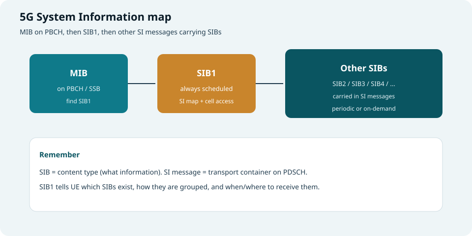
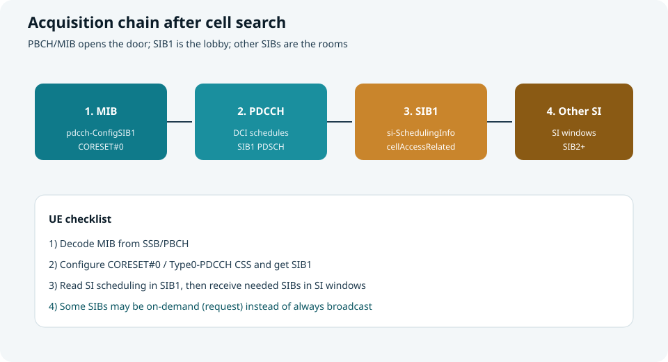
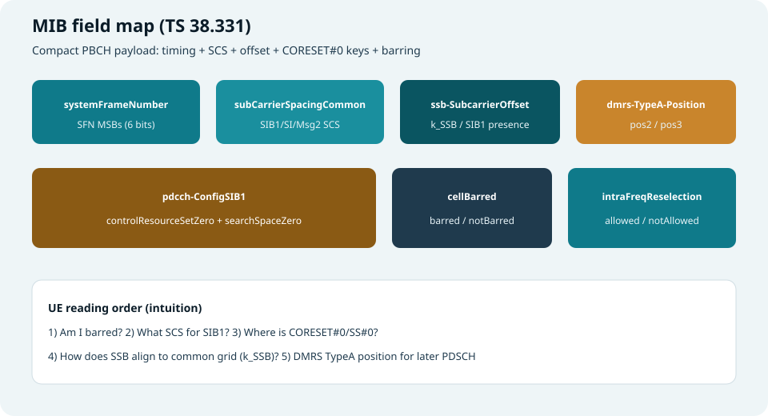
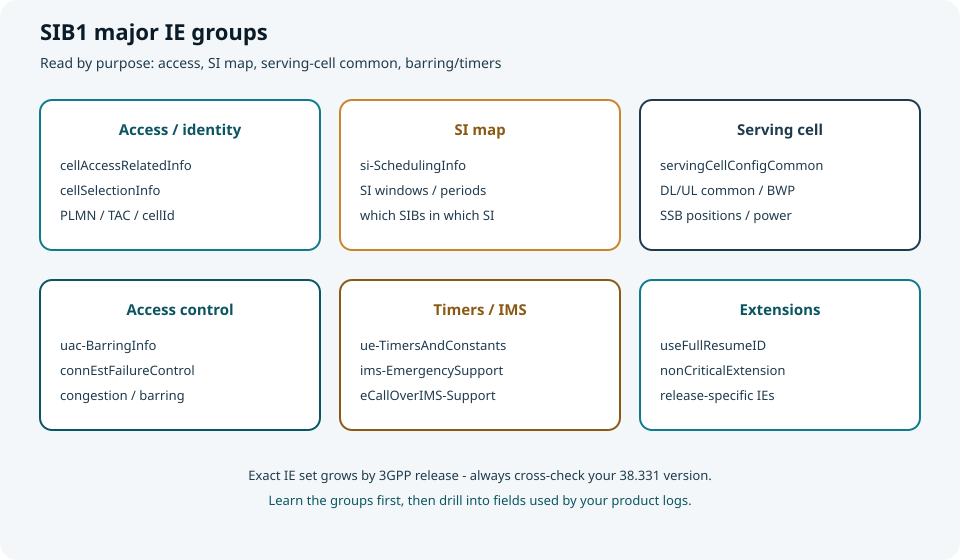
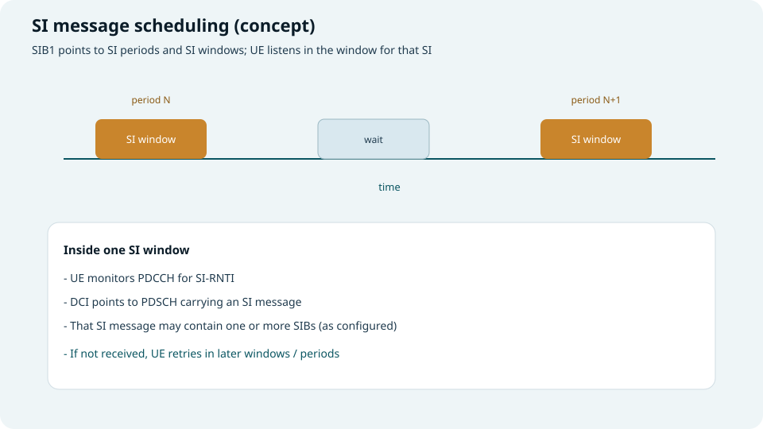
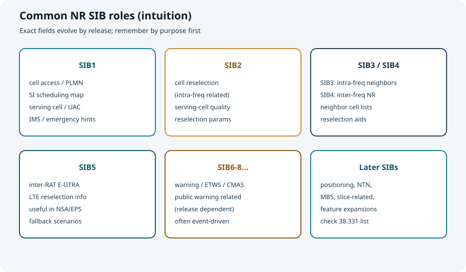

## 本篇要解决什么

小区搜索让 UE **同步上小区**；接下来还要读懂网络广播的 **系统消息（System Information）**，才能判断能否驻留、如何重选、如何接入。

本专题聚焦 **5G NR 的 SIBs**：它们是什么、如何调度、SIB1 为什么特殊、常见 SIB 各自管什么。

对照：**TS 38.331**（RRC），并衔接 [小区搜索](cell-search.html)。



*图：MIB → SIB1 → 其他 SIB（装在 SI message 里）*

---

## 先分清三个名字

| 名称 | 是什么 | 在哪看到 |
| --- | --- | --- |
| **MIB** | Master Information Block | SSB/PBCH 上广播 |
| **SIB** | System Information Block（一类内容） | 多数经 PDSCH 的 SI 消息携带 |
| **SI message** | 传输容器 | 可打包一个或多个 SIB |

> **SIB 是内容类型；SI message 是运输车。**  
> 别把“收到某个 SI”直接等同于“只含一个 SIB”。

---

## 获取链条：从 MIB 到其他 SIB



*图：搜网之后的系统消息获取链*

---

## MIB 消息详解（字段级）

MIB 在 **PBCH** 上广播，ASN.1 体量很小，但几乎每比特都服务于“**能不能待、怎么找 SIB1**”。



*图：MIB 关键字段一览*

### 结构示意（对照 TS 38.331）

```text
MIB ::= SEQUENCE {
  systemFrameNumber          BIT STRING (SIZE (6)),
  subCarrierSpacingCommon    ENUMERATED {scs15or60, scs30or120},
  ssb-SubcarrierOffset       INTEGER (0..15),
  dmrs-TypeA-Position        ENUMERATED {pos2, pos3},
  pdcch-ConfigSIB1           PDCCH-ConfigSIB1,
  cellBarred                 ENUMERATED {barred, notBarred},
  intraFreqReselection       ENUMERATED {allowed, notAllowed},
  spare                      BIT STRING (SIZE (1))
}

PDCCH-ConfigSIB1 ::= SEQUENCE {
  controlResourceSetZero     INTEGER (0..15),
  searchSpaceZero            INTEGER (0..15)
}
```

### 逐字段含义与作用

| 字段 | 取值直觉 | 含义 | UE 用它做什么 |
| --- | --- | --- | --- |
| **systemFrameNumber** | 6 bit | 10 bit SFN 的 **高 6 位（MSB）**；低 4 位在 PBCH 传输块侧携带（见 38.212） | 拼出完整 SFN，建立帧定时 |
| **subCarrierSpacingCommon** | `scs15or60` / `scs30or120` | 公共信道子载波间隔语义依赖 FR：FR1 上常对应 15/30 kHz；FR2 上常对应 60/120 kHz（共享频谱等场景另有规则） | 确定 **SIB1、广播 SI、Msg2/4/MsgB、寻呼** 等所用 SCS |
| **ssb-SubcarrierOffset** | 0…15 | 即常见的 **k_SSB** 相关指示：SSB 相对公共资源块栅格的子载波偏移；也可指示 **本 SSB 是否携带/关联 SIB1 路径** | 对齐 SSB 与 Point A/公共栅格；判断是否继续按 CORESET#0 收 SIB1（过大时可表示“此处无 SIB1”一类语义，见 38.213） |
| **dmrs-TypeA-Position** | `pos2` / `pos3` | Type A DMRS 的第一个符号位置 | 后续 PDSCH（含 SIB1）时域资源解释、DMRS 假设 |
| **pdcch-ConfigSIB1** | 见下表 | 指向 **CORESET#0 + SearchSpace#0** 的查表索引 | **打开收 SIB1 的门**（Type0-PDCCH） |
| **cellBarred** | `barred` / `notBarred` | 小区是否禁止驻留（38.304） | `barred` 则通常不能选此小区驻留 |
| **intraFreqReselection** | `allowed` / `notAllowed` | 最高排名小区被禁止时，是否允许同频其它小区重选 | 控制“同频还能不能换小区” |
| **spare** | 1 bit | 预留 | 忽略 |

### `pdcch-ConfigSIB1` 子字段

| 子字段 | 范围 | 含义 | 作用 |
| --- | --- | --- | --- |
| **controlResourceSetZero** | 0…15 | CORESET#0 配置索引 | 查 **TS 38.213** 表，得到 CORESET#0 的频域资源、符号数、复用图案等 |
| **searchSpaceZero** | 0…15 | SearchSpace#0 配置索引 | 查表得到 Type0-PDCCH 的监听时机（相对 SSB/帧的 slot/符号关系） |

> 实践口诀：**MIB 里 8 bit（两个 4 bit 索引）= 收 SIB1 的时频“地址簿”。**

### 示例：一次解码后的 MIB（示意日志）

```text
MIB {
  systemFrameNumber        = '110111'B   -- 与 PBCH LSB 拼出完整 SFN
  subCarrierSpacingCommon  = scs15or60   -- 若在 FR1，常表示 15 kHz
  ssb-SubcarrierOffset     = 8           -- k_SSB 相关
  dmrs-TypeA-Position      = pos2
  pdcch-ConfigSIB1 {
    controlResourceSetZero = 0           -- 查 38.213 CORESET#0 表
    searchSpaceZero        = 0           -- 查 Type0-PDCCH 监听时机表
  }
  cellBarred               = notBarred
  intraFreqReselection     = notAllowed
  spare                    = '0'B
}
```

**读法：** 小区未禁止 → 用索引 0/0 配 CORESET#0 与 SS#0 → 在对应监控时机用 SI-RNTI（SIB1 场景）找调度 SIB1 的 DCI → 解 PDSCH 得 SIB1。

---

## SIB1 消息详解（字段组 + 关键字段）

SIB1 比 MIB 大得多，建议按 **IE 组**阅读，再下钻字段。字段集合随 **3GPP Release** 扩展，以下按“主干必懂”整理。



*图：先按组理解 SIB1，再对照日志里的具体 IE*

### SIB1 顶层结构（示意）

```text
SIB1 ::= SEQUENCE {
  cellSelectionInfo              OPTIONAL,
  cellAccessRelatedInfo          CellAccessRelatedInfo,
  connEstFailureControl          OPTIONAL,
  si-SchedulingInfo              OPTIONAL,
  servingCellConfigCommon        OPTIONAL,
  ims-EmergencySupport           OPTIONAL,
  eCallOverIMS-Support           OPTIONAL,
  ue-TimersAndConstants          OPTIONAL,
  uac-BarringInfo                OPTIONAL,
  useFullResumeID                OPTIONAL,
  lateNonCriticalExtension       OPTIONAL,
  nonCriticalExtension           OPTIONAL
}
```

---

### A. 小区选择：`cellSelectionInfo`

| 字段 | 含义 | 作用 |
| --- | --- | --- |
| **q-RxLevMin** | 最小接收电平门限（相关单位见 38.304/38.331） | 小区选择：电平是否够“听得见” |
| **q-QualMin** | 最小质量门限（可选） | 质量是否达标 |
| **q-RxLevMinSUL** 等 | SUL 相关门限（若配置） | 补充上行/SUL 场景选择条件 |

> 作用一句话：回答“**这个小区值不值得选进来**”（与测量量比较）。

---

### B. 接入与身份：`cellAccessRelatedInfo`

这是驻留判断的核心身份区，常见嵌套包括：

| 字段/结构 | 含义 | 作用 |
| --- | --- | --- |
| **plmn-IdentityList** / **PLMN-IdentityInfoList** | 本小区支持的 PLMN 列表及相关信息 | UE 判断是否属于自己的网络 |
| **trackingAreaCode (TAC)** | 跟踪区码 | 注册/位置更新、寻呼域相关 |
| **cellIdentity** | 小区标识 | 唯一标识服务小区（与 gNB/小区规划相关） |
| **cellReservedForOperatorUse** | 是否保留给运营商用途 | 影响普通用户是否可选/可驻 |
| **ranac** 等 | RAN 区域相关（若出现） | 部分移动性/策略场景使用 |

> 作用一句话：回答“**这是谁的网、哪个区、哪个小区、我能不能进**”。

---

### C. SI 地图：`si-SchedulingInfo`（枢纽中的枢纽）

| 字段/结构 | 含义 | 作用 |
| --- | --- | --- |
| **schedulingInfoList** | 每个 SI message 的调度条目列表 | 告诉 UE：有哪些 SI、各含哪些 SIB |
| **si-WindowLength** | SI 窗长度 | UE 在多长窗内监听该 SI |
| **si-Periodicity**（在条目中） | 该 SI 的周期 | 多久来一次机会 |
| **sib-MappingInfo** | SI 内携带的 SIB 类型映射 | 知道“这趟车装了哪些 SIB” |
| **si-RequestConfig** 等 | on-demand SI 请求相关配置（可选） | 支持按需拉 SI，降广播开销 |
| **systemInformationAreaID** 等 | SI 区域标识（可选） | 多小区共享同一 SI 区域时的优化线索 |

> 作用一句话：SIB1 发给 UE 的 **系统消息目录 + 时刻表**。

**条目读法示例（概念）：**

```text
SI#1 : periodicity = rf16,  contains {SIB2, SIB3}
SI#2 : periodicity = rf32,  contains {SIB4}
SI#3 : on-demand,           contains {SIB5}
```

UE：需要重选参数 → 按 SI#1 的窗去听；需要异频邻区 → 听 SI#2；SIB5 可能要请求。

---

### D. 服务小区公共配置：`servingCellConfigCommon`

为后续监听/测量/接入提供“公共底座”，常见包括：

| 字段/结构 | 含义 | 作用 |
| --- | --- | --- |
| **downlinkConfigCommon** | 下行公共配置（频率、BWP 公共部分等） | 定下行工作带宽与公共参数 |
| **uplinkConfigCommon** | 上行公共配置（含初始 UL BWP、RACH 相关公共部分等） | 为随机接入与上行发送做准备 |
| **ssb-PositionsInBurst** | 半帧内实际发送的 SSB 位置图 | 与波束/测量时机相关 |
| **ssb-PeriodicityServingCell** | 服务小区 SSB 周期 | 知道多久扫一次 SSB |
| **ss-PBCH-BlockPower** | SSB 功率参考 | 辅助测量换算/开环估计等 |
| **tdd-UL-DL-ConfigurationCommon** | TDD 公共配比（若 TDD） | 知道上下行时隙图案 |

> 作用一句话：从“能解 SIB1”推进到“**知道这个小区公共空口长什么样**”。

---

### E. 接入控制与失败控制

| 字段/结构 | 含义 | 作用 |
| --- | --- | --- |
| **uac-BarringInfo** | 统一接入控制（UAC）相关禁止/放行信息 | 拥塞时按接入类别限制接入 |
| **connEstFailureControl** | 连接建立失败控制相关参数 | 失败后回退/等待策略，避免反复冲击 |

---

### F. 定时器与业务能力提示

| 字段/结构 | 含义 | 作用 |
| --- | --- | --- |
| **ue-TimersAndConstants** | UE 侧定时器与常量 | 规范 RRC/接入相关等待与重试节奏 |
| **ims-EmergencySupport** | 是否支持 IMS 紧急业务相关指示 | 紧急呼叫路径判断 |
| **eCallOverIMS-Support** | 是否支持 IMS 车载紧急呼叫相关 | 特定终端/业务场景 |
| **useFullResumeID** | Resume 标识长度相关偏好/指示 | 连接恢复流程相关 |

---

### 示例：SIB1 日志怎么读（浓缩）

```text
SIB1 {
  cellAccessRelatedInfo {
    plmn-IdentityList = { PLMN-A, PLMN-B }
    trackingAreaCode  = ...
    cellIdentity      = ...
  }
  cellSelectionInfo {
    q-RxLevMin = ...
  }
  si-SchedulingInfo {
    si-WindowLength = ...
    schedulingInfoList = {
      { period=rf16, sibs={SIB2,SIB3} },
      { period=rf32, sibs={SIB4} }
    }
  }
  servingCellConfigCommon {
    downlinkConfigCommon = {...}
    uplinkConfigCommon   = {...}
    ssb-PositionsInBurst = {...}
  }
  uac-BarringInfo = {...}          -- optional
}
```

**读法顺序建议：**  
身份/是否可进 → 选择门限 → SI 时刻表 → 公共配置 → 禁止/定时器。

---

## SI 调度窗（怎么按时收其他 SIB）

承接 SIB1 的 `si-SchedulingInfo`：UE 按地图在对应 **SI window** 内用 **SI-RNTI** 听 PDCCH，再解 PDSCH 得到 SI message。



*图：按周期出现 SI window；窗内盲检 SI-RNTI*

要点：

1. **SIB1** 给出各 SI 的周期、窗长、SIB 映射（及可选 on-demand 配置）。  
2. UE 在窗内监控，收到则停止；未收到可在后续窗/周期重试。  
3. 部分 SIB 可配置为 **on-demand**（按需请求），不一定持续广播——省空口开销。

---

## 常见 NR SIB 用途（按功能记）

字段细节以当前实现的 **38.331** 为准；学习时先记“职责分工”：



*图：用用途记忆 SIB，而不是死背字段名*

| SIB | 用途直觉 |
| --- | --- |
| **SIB1** | 接入/驻留关键 + **SI 地图**（上文已字段展开） |
| **SIB2** | 服务小区重选相关参数（同频重选基础） |
| **SIB3** | 同频邻区信息 |
| **SIB4** | 异频 NR 邻区/重选信息 |
| **SIB5** | 异系统（如 E-UTRA/LTE）重选相关 |
| **SIB6–SIB8 等** | 公共预警等（ETWS/CMAS 一类，版本相关） |
| **后续 SIB** | 定位、NTN、MBS、切片扩展等（随 Release 增加） |

> LTE 与 NR 的 SIB 编号**不完全一一对应**，不要把 LTE 经验硬套编号。

这与 [小区搜索](cell-search.html) 的收尾一致：搜网成功 ≠ 已具备完整驻留信息；**至少还要 SIB1**。

---

## 和 MIB 的分工对比

| | MIB | SIB1 | 其他 SIB |
| --- | --- | --- | --- |
| 承载 | PBCH | PDSCH（专用调度） | SI message / PDSCH |
| 是否几乎总要 | 是（搜网路径） | 是（驻留路径） | 按需/按配置 |
| 核心价值 | 打开找 SIB1 的门 | 打开整张 SI 地图 | 补齐重选/邻区/预警等 |

---

## 学习路线图

```text
Cell Search (PSS/SSS/PBCH)
        ↓
       MIB
        ↓
   CORESET#0 → SIB1
        ↓
 si-SchedulingInfo / SI windows
        ↓
  需要的 SIB2 / SIB3 / SIB4 / ...
        ↓
  小区选择/重选/接入准备
```

---

## 快速自测

1. SIB 和 SI message 有何不同？  
2. MIB 里哪两个索引直接决定怎么找 SIB1？  
3. `cellBarred` 与 `intraFreqReselection` 分别管什么？  
4. SIB1 的 `si-SchedulingInfo` 为什么被称为“地图”？  
5. 读完 MIB 但没读 SIB1，还缺什么？

> 一句话：**MIB 开门找 SIB1；SIB1 发地图；其他 SIB 按地图在 SI 窗里取。**

## 相关专题

- [小区搜索](cell-search.html)
- [帧结构与 SS/PBCH Block](frame-structure-ssb.html)
- [SSB Cases](ssb-cases-positions.html)
