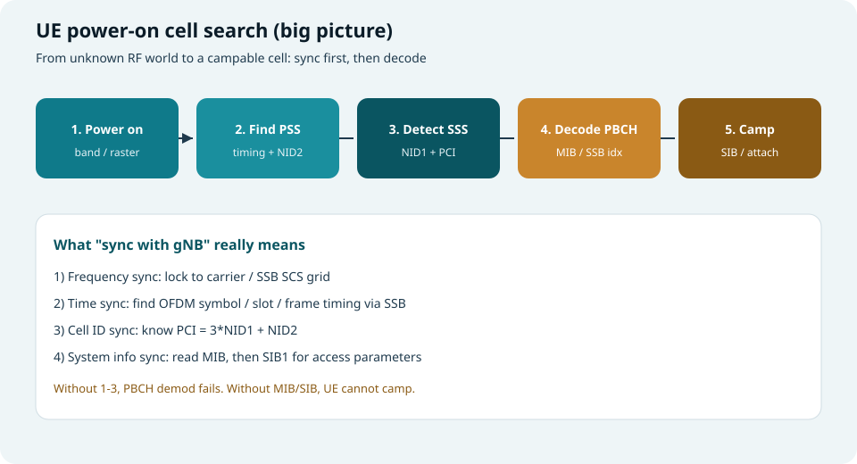
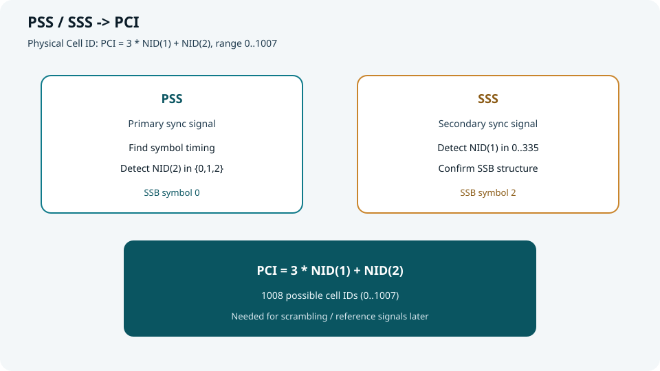
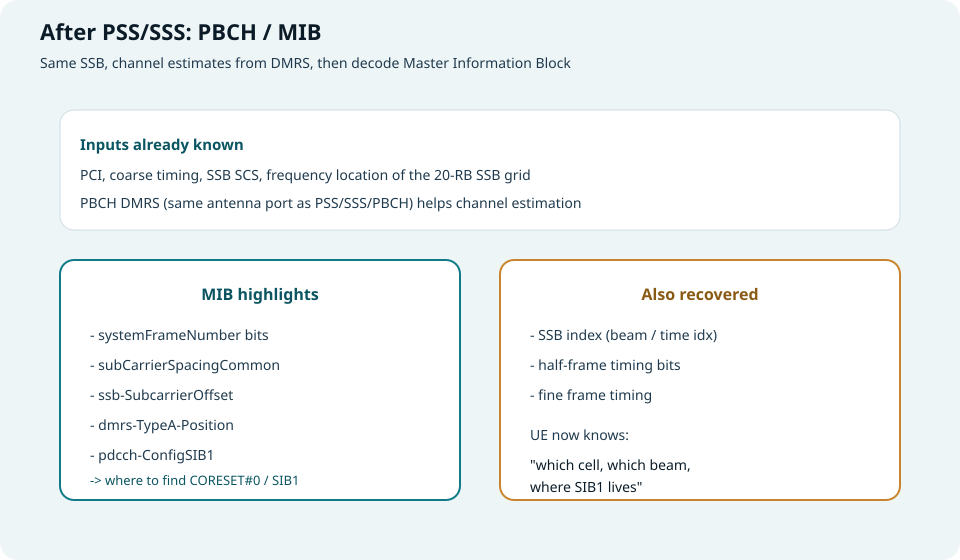
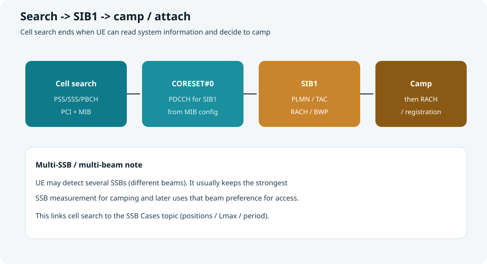

## 本篇要解决什么

UE 刚开机时，**不知道小区在哪个频点、帧从哪里开始、PCI 是多少**。  
**小区搜索（Cell Search）** 就是把这些未知量变成已知量，并与 gNB **取得同步**，最终能读系统消息、准备驻留/接入。

对照：**TS 38.213 §4.1 Cell search**，并衔接本站已有的 [SSB 结构](frame-structure-ssb.html) 与 [SSB Cases](ssb-cases-positions.html)。



*图：开机 → 找 PSS → 解 SSS → 解 PBCH → 读 SIB / 驻留*

---

## “与基站同步”到底同步了什么

| 同步类型 | UE 要锁定的内容 | 主要靠什么 |
| --- | --- | --- |
| **频率同步** | 载波中心、SSB 子载波栅格 | 本振校准 + PSS/SSS 相关峰 |
| **时间同步** | OFDM 符号界、时隙/半帧/帧定时 | PSS 定时 + SSB 索引/半帧指示 |
| **小区身份** | PCI（0…1007） | PSS 的 NID⁽²⁾ + SSS 的 NID⁽¹⁾ |
| **系统配置入口** | 如何找 SIB1 | PBCH 中的 MIB（尤其 `pdcch-ConfigSIB1`） |

> 没有前三步，PBCH 解不出来；没有 MIB/SIB，只能“听到同步信号”，还不能真正驻留。

---

## 第 0 步：开机与频点搜索

1. UE 根据能力/USIM/历史信息，确定要扫的 **频段（band）**。  
2. 在频段内按 **同步栅格（sync raster）** 尝试可能的 SSB 中心频点。  
3. 对每个候选频点，尝试规范允许的 **SSB SCS**（如 FR1 常见 15/30 kHz）。

这一步是“在地图上找可能有灯塔的坐标”；真正看见灯塔靠后面的 PSS。

---

## 第 1 步：检测 PSS —— 拿到定时与 NID⁽²⁾

PSS（Primary Synchronization Signal）在 SSB 的 **符号 0**。

UE 用本地生成的 3 种 PSS 序列（对应 NID⁽²⁾ = 0/1/2）做相关：

| 检测结果 | 含义 |
| --- | --- |
| 相关峰位置 | **符号定时**（SSB 从哪里开始） |
| 哪个序列峰最大 | **NID⁽²⁾ ∈ {0,1,2}** |
| 峰所在频域位置 | SSB 的 20 RB 栅格落点（粗定频） |

成功后，UE 已经“抓住”一个 SSB 时间窗，并知道 PCI 公式里的低 2 位信息（NID⁽²⁾）。

---

## 第 2 步：检测 SSS —— 拿到 NID⁽¹⁾ 与完整 PCI

SSS 在 SSB 的 **符号 2**，与 PSS 有固定相对位置。

在已知定时与 NID⁽²⁾ 后，UE 检测 SSS，得到 **NID⁽¹⁾（0…335）**，于是：

**PCI = 3 · NID⁽¹⁾ + NID⁽²⁾**（共 1008 个）



*图：PSS 给 NID2 + 定时；SSS 给 NID1；合成 PCI*

PCI 后续用于：

- 参考信号 / 加扰初始化相关计算  
- 区分邻区  
- PBCH DMRS 等处理的输入之一  

---

## 第 3 步：解调 PBCH —— 读 MIB，完善帧定时

同一 SSB 内还有 PBCH 与 PBCH DM-RS（与 PSS/SSS **同天线端口**，可借用信道估计）。

### MIB 里对搜网最关键的字段（直觉）

| 字段（概念） | 作用 |
| --- | --- |
| SFN 相关比特 | 拼出系统帧号信息 |
| `subCarrierSpacingCommon` | 后续公共信道 SCS 线索 |
| `ssb-SubcarrierOffset` | SSB 相对公共栅格的偏移 |
| `pdcch-ConfigSIB1` | **指示 CORESET#0 / 搜索空间，从而找到 SIB1** |
| `dmrs-TypeA-Position` | Type A DMRS 位置相关 |

同时，结合 PBCH 载荷与时域候选，UE 恢复：

- **SSB index**（对应波束/半帧内时间位置）  
- **半帧指示** 等，把定时从“符号级”推进到“帧级”



*图：PSS/SSS 之后解码 MIB，获得找 SIB1 的入口*

---

## 第 4 步：读 SIB1 —— 从“同步上”到“能驻留”

MIB 并不包含完整驻留信息。UE 还要：

1. 按 `pdcch-ConfigSIB1` 配置 **CORESET#0**  
2. 盲检 PDCCH，拿到调度 SIB1 的 DCI  
3. 解 PDSCH 得到 **SIB1**

SIB1 通常进一步给出：

- PLMN / TAC 等归属信息  
- 公共 BWP、RACH 资源等接入参数  
- 是否允许驻留等策略信息  



*图：Cell search → CORESET#0 → SIB1 → Camp / 后续 RACH*

通过小区选择准则后，UE 进入 **Idle 驻留**；需要业务时再发起 **RACH / 注册**。

---

## 多 SSB / 多波束时 UE 怎么选

在 [SSB Cases](ssb-cases-positions.html) 中，半帧内可有多个候选 SSB（不同波束）。

小区搜索阶段 UE 往往会：

1. 测到多个 SSB（不同 index）  
2. **保留最强的测量结果**（RSRP 等）  
3. 以该 SSB 对应波束作为后续接入的空间偏好  

因此：**搜网质量 ≈ 同步质量 + 所选波束质量**。

---

## 端到端流程清单（建议背诵）

```text
开机
  → 选 band / sync raster / SSB SCS
  → 相关检测 PSS：符号定时 + NID(2)
  → 检测 SSS：NID(1) → PCI
  → 解 PBCH：MIB + SSB index / 帧定时
  → 配 CORESET#0，收 SIB1
  → 小区选择 / 驻留
  →（需要时）RACH 与注册
```

---

## 和本站专题的衔接

| 专题 | 本篇用到的点 |
| --- | --- |
| [帧结构与 SS/PBCH Block](frame-structure-ssb.html) | SSB 内 PSS/SSS/PBCH 时频位置 |
| [SSB Cases](ssb-cases-positions.html) | 半帧候选落点、个数、周期、波束 |

---

## 快速自测

1. 只有 PSS、没有 SSS，UE 缺什么？  
2. PCI 公式是什么？PSS/SSS 各贡献哪部分？  
3. MIB 为什么关键？它直接给了驻留所需的全部信息吗？  
4. “同步成功”和“可以发起 RACH”中间还差哪几步？

> 一句话：**小区搜索 = 用 SSB 把频率、时间、PCI 锁定，再用 MIB/SIB1 打开进入网络的门。**
