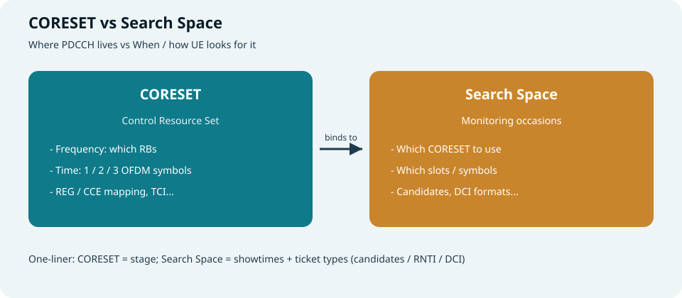
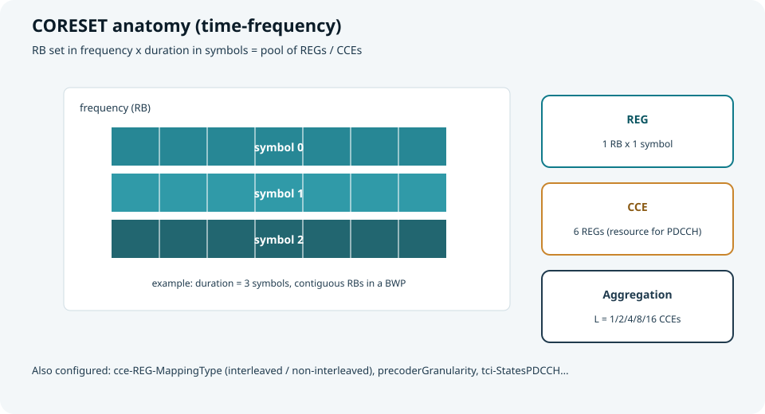
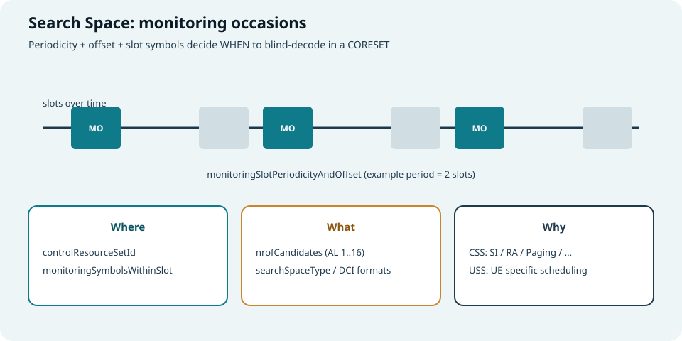
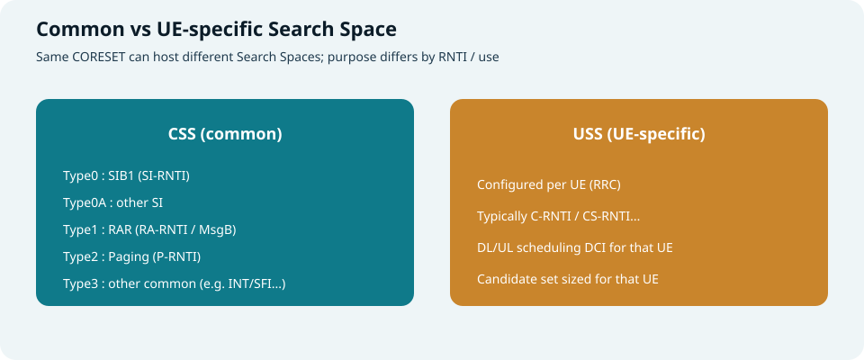
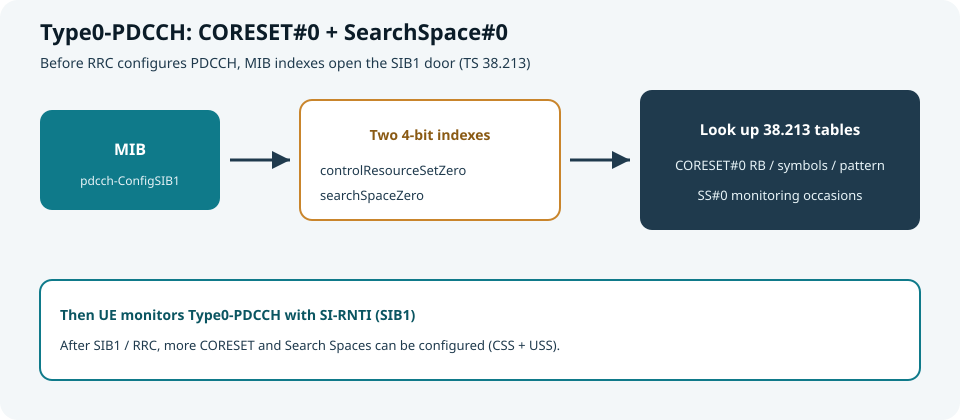
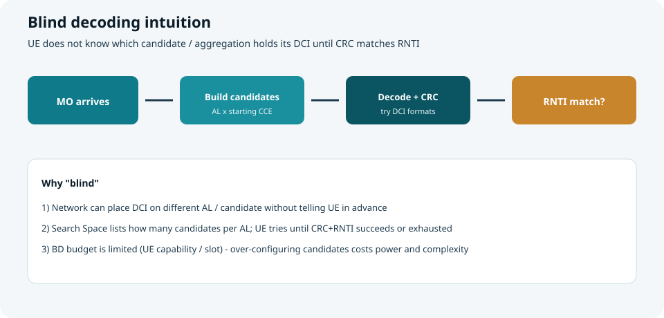

## 本篇要解决什么

UE 已经能同步 SSB、读出 MIB，甚至知道「要去收 SIB1 / 等调度」。  
真正卡脖子的一步往往是：**PDCCH 在哪？何时听？听哪些候选？**

答案就在两套配置里：

| 概念 | 一句话 |
| --- | --- |
| **CORESET** | PDCCH **能占用的时频资源集合**（舞台） |
| **Search Space** | UE **何时、按什么规则在该舞台上盲检**（场次 + 票种） |

对照：**TS 38.211 / 38.213 / 38.331**。  
前置：[小区搜索](cell-search.html)、[5G SIBs](5g-sibs.html)（尤其 MIB 的 `pdcch-ConfigSIB1`）。



*图：CORESET 定“在哪”；Search Space 定“何时、怎么找”*

---

## 先建立直觉：从调度到盲检

```text
gNB 要调度 UE / 广播 SI
        ↓
在某个 CORESET 的某些 CCE 上放 PDCCH（DCI）
        ↓
UE 按 Search Space 的监控时机（MO）去听
        ↓
对每个 PDCCH candidate 做盲检（CRC + RNTI）
        ↓
命中 → 解出 DCI → 再解 PDSCH / 发 PUSCH / 做其它指示
```

> UE **事先不知道** DCI 落在哪个聚合等级、哪个候选上，所以叫 **盲检测（blind decoding）**。

---

## CORESET：控制资源集合

**Control Resource Set** = 一段专门给 **PDCCH** 用的时频资源池。



*图：频域 RB 集合 × 时域 1～3 个符号 → REG / CCE 池*

### 基本积木

| 名称 | 定义（直觉） | 作用 |
| --- | --- | --- |
| **REG** | 1 个 RB × 1 个 OFDM 符号 | CORESET 的最小“砖块” |
| **CCE** | 通常 **6 个 REG** | PDCCH 资源分配单位 |
| **聚合等级 AL (L)** | L = 1 / 2 / 4 / 8 / 16 | 一个 PDCCH 占用 **L 个 CCE**（链路越差常越大） |
| **PDCCH candidate** | 某 AL 下、从某起始 CCE 起的一组 CCE | UE 一次盲检尝试的对象 |

### 常见配置字段（RRC：`ControlResourceSet`）

| 字段 | 含义 | 作用 |
| --- | --- | --- |
| **controlResourceSetId** | CORESET 编号（0 预留给 Type0 相关特殊用途） | Search Space 通过 ID 绑定到此资源 |
| **frequencyDomainResources** | 位图：本 BWP 内哪些 **6-RB 组**属于该 CORESET | 定频域占用 |
| **duration** | 1 / 2 / 3 个符号 | 定时域跨度（常靠 slot 起始） |
| **cce-REG-MappingType** | `interleaved` / `nonInterleaved` | CCE→REG 映射是否交织（频域分集 vs 连续） |
| **reg-BundleSize** / **interleaverSize** / **shiftIndex** | 交织相关参数（交织模式时） | 决定 REG bundle 如何铺开 |
| **precoderGranularity** | 预编码粒度 | 影响信道估计/假设（与 DMRS 相关） |
| **tci-StatesPDCCH-ToAddList** 等 | PDCCH 的 TCI / QCL 假设 | 波束/参考信号对齐（尤其 FR2） |
| **pdcch-DMRS-ScramblingID** | PDCCH DMRS 加扰相关 | 解调参考与小区/配置对齐 |

> 口诀：**CORESET 回答“PDCCH 允许出现在哪块时频地皮上”。**

### 交织 vs 非交织（读配置时的决策感）

| 映射 | 直觉 | 典型动机 |
| --- | --- | --- |
| **non-interleaved** | CCE 对应的 REG 更“连在一起” | 实现简单、局部频域 |
| **interleaved** | REG 在频域更分散 | 频域分集，抗窄带干扰/衰落 |

---

## Search Space：搜索空间

Search Space **不单独提供新地皮**，而是声明：

1. 绑到哪个 **CORESET**  
2. **哪些 slot / 哪些符号**要监控（Monitoring Occasion）  
3. 每个 AL 有多少 **candidate**  
4. 期望的 **用途 / DCI 形态**（CSS/USS、格式集合）



*图：周期与偏移决定 MO；MO 上再按候选盲检*

### 常见配置字段（RRC：`SearchSpace`）

| 字段 | 含义 | 作用 |
| --- | --- | --- |
| **searchSpaceId** | 搜索空间编号（0 常关联 Type0 / SS#0 场景） | 标识这条监听规则 |
| **controlResourceSetId** | 绑定的 CORESET | **把“何时听”接到“听哪里”** |
| **monitoringSlotPeriodicityAndOffset** | 周期 + 偏移 | 哪些 slot 是监听日 |
| **duration**（监听持续） | 连续监听多少个 slot（可选语义） | 一次“监听窗口”拉多长 |
| **monitoringSymbolsWithinSlot** | slot 内从哪些符号开始监听 | 与 CORESET duration 一起定时域落点 |
| **nrofCandidates** | 各 AL 的候选个数 | 决定盲检次数上限（与复杂度强相关） |
| **searchSpaceType** | `common` / `ue-Specific` | CSS 还是 USS，以及携带的 DCI 格式集合 |

### CSS vs USS



*图：CSS 服务广播/公共过程；USS 服务该 UE 的调度*

| 类型 | 典型 RNTI / 用途 | 何时出现 |
| --- | --- | --- |
| **Type0-PDCCH CSS** | SI-RNTI → **SIB1** | 搜网后最早一批（由 MIB 索引定） |
| **Type0A** | 其它 SI | SIB1 之后按 SI 窗 |
| **Type1** | RA-RNTI / MsgB-RNTI 等 → RAR | 随机接入 |
| **Type2** | P-RNTI → 寻呼 | 空闲/非激活寻呼 |
| **Type3** | 其它公共（如部分指示类，视配置） | 连接态公共 |
| **USS** | C-RNTI / CS-RNTI… → 专属调度 | RRC 配置后 |

> 同一 CORESET 可被多个 Search Space 引用；差别在 **时机、候选、RNTI/用途**。

---

## CORESET#0 与 SearchSpace#0（Type0-PDCCH）

这是本站前几篇的“门闩”：  
**MIB → `pdcch-ConfigSIB1` → 查 38.213 表 → CORESET#0 + SS#0 → 收 SIB1。**



*图：两个 4 bit 索引打开 Type0-PDCCH*

| MIB 字段 | 查什么 | 得到什么 |
| --- | --- | --- |
| **controlResourceSetZero** (0…15) | 38.213 CORESET#0 表（依赖 SCS、频段等） | RB 数、符号数、与 SSB 的复用图案、相对频域位置等 |
| **searchSpaceZero** (0…15) | Type0-PDCCH 监听时机表 | 相对 SSB / 帧的 slot、符号等 MO 关系 |

细节回顾见 [5G SIBs · MIB](5g-sibs.html)。

**读日志时：**

```text
MIB.pdcch-ConfigSIB1 {
  controlResourceSetZero = i
  searchSpaceZero        = j
}
→ 查表得到 CORESET#0 时频布局
→ 查表得到 SS#0 的 MO
→ 在 MO 上用 SI-RNTI 盲检 Type0-PDCCH
→ DCI 指示 SIB1 的 PDSCH
```

> 注意：CORESET#0 的配置方式是 **查表**，不是普通 `ControlResourceSet` IE 那套位图；但 **“舞台 + 场次”** 的分工完全一样。

---

## 盲检：UE 实际在算什么



*图：MO → 候选 → 译码 CRC → RNTI 是否匹配*

### 一次 MO 内的典型循环

1. 根据 Search Space + CORESET，列出本 slot 的 **PDCCH candidates**（按 AL、起始 CCE）。  
2. 对每个 candidate、允许的 **DCI format** 做信道估计与译码。  
3. CRC 用目标 **RNTI** 解扰/校验：通过 → 接受该 DCI；失败 → 试下一个。  
4. 候选耗尽仍无命中 → 本 MO 无该用途调度（对 UE 而言“没听到”）。

### 为什么配置要克制

- 候选数 ↑ → 盲检次数 ↑ → **功耗 / 实现复杂度 / 时延** ↑  
- 规范与 UE 能力对每 slot 盲检次数、CCE 数有预算约束  
- 工程上常在 **覆盖（多用高 AL）** 与 **开销（少候选）** 之间折中

---

## 和 BWP、波束的关系（点到为止）

| 关联 | 直觉 |
| --- | --- |
| **BWP** | CORESET 定义在某个下行 BWP 的频域位图上；切 BWP 往往伴随 PDCCH 配置切换 |
| **TCI / QCL** | CORESET 可关联 TCI state，告诉 UE 用哪套空间/时频 QCL 假设解 PDCCH |
| **SSB** | Type0 场景下，CORESET#0 与 SSB 的复用图案、相对位置由查表给出（衔接搜网） |

资源栅格与天线端口背景可参考 [Antenna Port / QCL / Resource Grid](antenna-port-qcl-resource-grid.html)。

---

## 配置读法示例（示意）

```text
ControlResourceSet {
  controlResourceSetId     = 1
  frequencyDomainResources = '11110000...'B   -- which 6-RB groups
  duration                 = 2                -- 2 symbols
  cce-REG-MappingType      = nonInterleaved
}

SearchSpace {
  searchSpaceId            = 2
  controlResourceSetId     = 1                -- bind CORESET 1
  monitoringSlotPeriodicityAndOffset = { periodicity=sl1, offset=0 }
  monitoringSymbolsWithinSlot        = '100000...'B  -- start at symbol 0
  nrofCandidates = { aggregationLevel1=0, aggregationLevel2=2,
                     aggregationLevel4=2, aggregationLevel8=1, ... }
  searchSpaceType = ue-Specific { dci-Formats = formats0-1-And-1-1 }
}
```

**读法：** 每个 slot 符号 0 起，在 CORESET#1 的 2 符号资源上，对 AL=2/4/8 的若干候选盲检 Format 0_1/1_1（典型 USS 调度）。

---

## 和前几篇的衔接

```text
Cell Search → MIB
              ↓
     CORESET#0 + SS#0  (Type0-PDCCH)
              ↓
            SIB1
              ↓
   更多 CSS（SI / Paging / RA...）
              ↓
   RRC 配置 CORESET + USS（连接态调度）
```

| 专题 | 本篇补上的缺口 |
| --- | --- |
| [小区搜索](cell-search.html) | 同步之后如何开 PDCCH 门 |
| [5G SIBs](5g-sibs.html) | `pdcch-ConfigSIB1` 两个索引的物理含义 |
| 本篇 | CORESET / Search Space / 候选 / 盲检的一般模型 |

---

## 快速自测

1. CORESET 与 Search Space 谁管“地皮”、谁管“场次”？  
2. REG、CCE、聚合等级、candidate 四者关系？  
3. 为什么 Type0 要靠 MIB 两个索引查表，而不是直接下发完整 CORESET IE？  
4. CSS 与 USS 在用途上差在哪？  
5. 盲检“盲”在何处？候选配太多会有什么代价？

> 一句话：**CORESET 铺舞台，Search Space 排场次，UE 在候选上盲检直到 RNTI 对上。**

## 相关专题

- [小区搜索](cell-search.html)
- [5G SIBs](5g-sibs.html)
- [帧结构与 SS/PBCH Block](frame-structure-ssb.html)
- [Antenna Port / QCL / Resource Grid](antenna-port-qcl-resource-grid.html)
