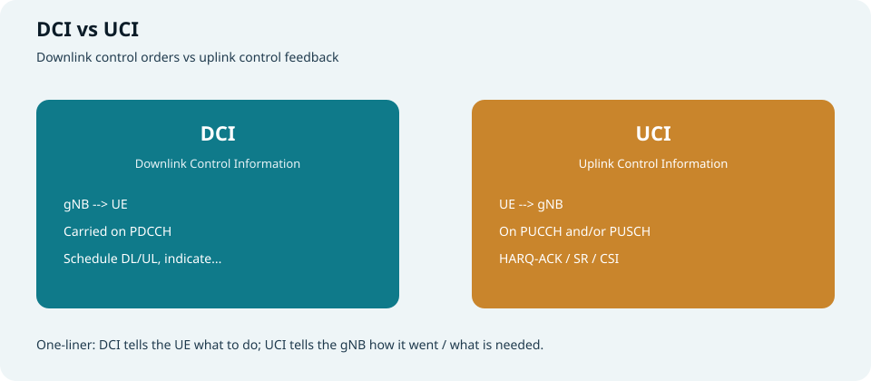
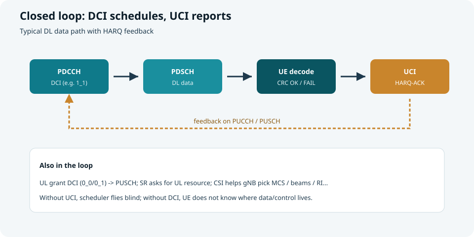
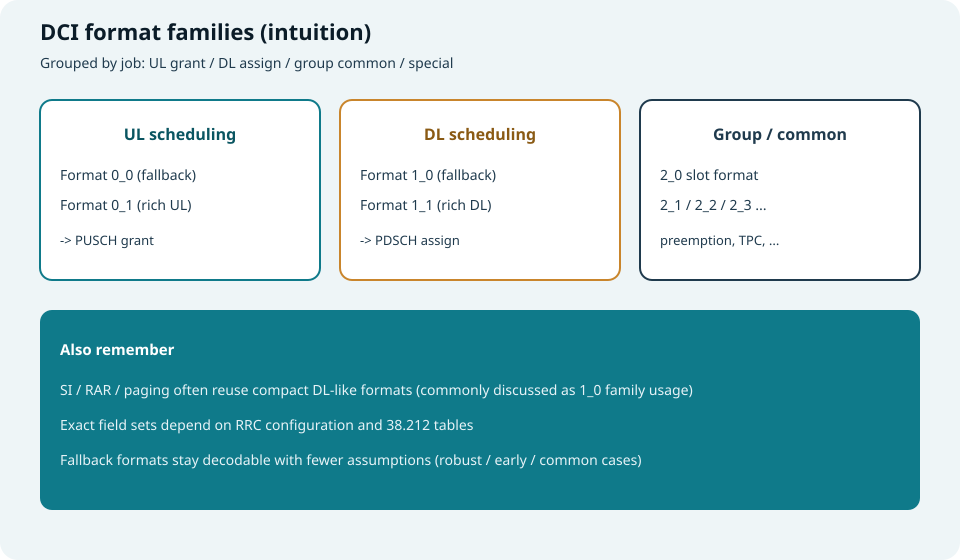
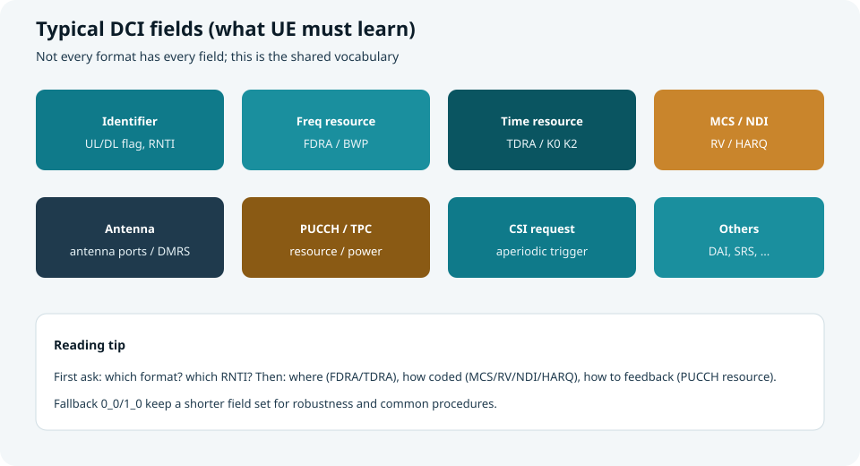
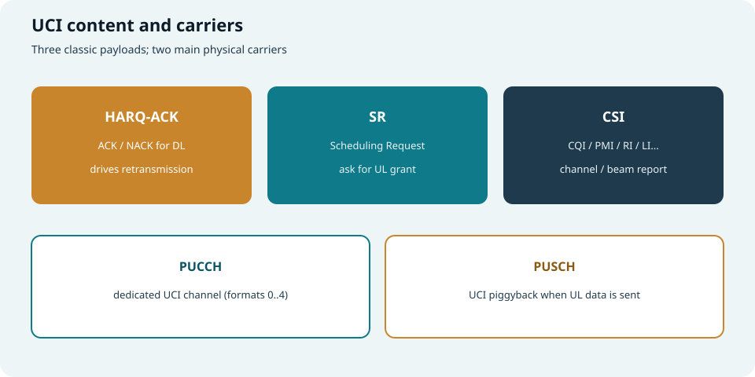
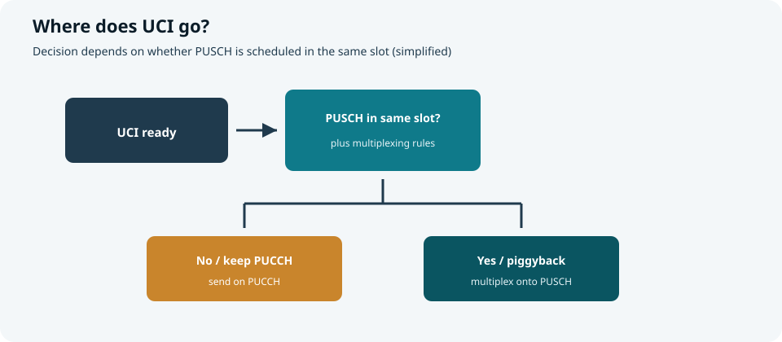

## 本篇要解决什么

上一篇讲了 UE **如何找到 PDCCH**（[CORESET 与 Search Space](coreset-search-space.html)）。  
本篇回答：找到之后，**PDCCH 里装的是什么？UE 又用什么回给基站？**

| 名称 | 全称 | 方向 | 载体 |
| --- | --- | --- | --- |
| **DCI** | Downlink Control Information | gNB → UE | **PDCCH** |
| **UCI** | Uplink Control Information | UE → gNB | **PUCCH** 和/或 **PUSCH** |

对照：**TS 38.212**（编码与字段）、**38.213**（过程）、**38.331**（配置）。



*图：DCI 下指令；UCI 上回执 / 请求 / 信道报告*

---

## 一张图看懂闭环



*图：DCI 调度 PDSCH → UE 解调 → UCI 回 HARQ-ACK*

典型下行数据回合：

1. gNB 在 PDCCH 发 **DCI**（如 Format 1_1）  
2. UE 按 DCI 指示收 **PDSCH**  
3. UE 在约定时机回 **HARQ-ACK/NACK（UCI）**  
4. gNB 决定新传或重传

上行数据则常见：

1. UE 发 **SR（UCI）** 要资源，或 gNB 主动给 UL grant  
2. gNB 发 **DCI Format 0_x** 调度 **PUSCH**  
3. UE 发数据；若同 slot 还需反馈，可能把 UCI **复用到 PUSCH**

> 没有 DCI，UE 不知道“在哪收/发、用什么码率”；没有 UCI，基站很难闭环做 HARQ、链路自适应与资源分配。

---

## DCI：下行控制信息

### 按“干什么”记格式家族



*图：先按用途分家，再下钻字段*

| 家族 | 常见格式 | 干什么 |
| --- | --- | --- |
| **UL 调度** | **0_0**（fallback）、**0_1**（能力更全） | 给 **PUSCH** 授权 |
| **DL 调度** | **1_0**（fallback）、**1_1**（能力更全） | 给 **PDSCH** 分配 |
| **组公共 / 指示** | **2_0 / 2_1 / 2_2 / 2_3…** | 时隙格式、抢占指示、TPC、SRS 等（随版本扩展） |
| **公共过程** | 常借 **1_0 一类紧凑形态** | SI / RAR / Paging 等（配合不同 RNTI） |

**Fallback（0_0 / 1_0）** 字段更“瘦”、假设更少：早期接入、公共过程、鲁棒调度更常用。  
**0_1 / 1_1** 能表达更多：多层 MIMO、更细 BWP/资源指示、更多可选 IE——但依赖 RRC 配置与 UE 能力。

### 关键字段词汇表（跨格式）



*图：读 DCI 时共用的“词汇”*

| 字段直觉 | 含义 | UE 用它做什么 |
| --- | --- | --- |
| **Identifier / 格式区分** | 区分 UL/DL 等同尺寸格式等 | 决定按哪套字段解析 |
| **RNTI（CRC 侧）** | 把 DCI“签”给谁/哪类用途 | SI-RNTI、C-RNTI、P-RNTI、RA-RNTI… |
| **FDRA** | 频域资源分配 | 知道占用哪些 RB / RBG |
| **TDRA** | 时域资源分配（常查表） | 起止符号、时隙偏移（K0/K2 等） |
| **BWP indicator** | 目标带宽部分 | 是否要切 BWP |
| **MCS** | 调制编码方案 | 定码率/调制阶数 |
| **NDI** | 新数据指示 | 区分新传 vs 同进程重传 |
| **RV** | 冗余版本 | HARQ 软合并用哪版 |
| **HARQ process number** | HARQ 进程号 | 对应哪条软缓冲 |
| **Antenna ports / DMRS** | 端口与 DMRS 相关 | 解参考信号与层映射 |
| **PUCCH resource / TPC** | 反馈资源与功率控制 | 决定 ACK 发哪、功率怎么调 |
| **CSI request** | 非周期 CSI 触发 | 要不要马上报信道状态 |
| **DAI 等** | 下行分配索引等 | 多码字/多 PDSCH 时对齐 ACK 码本 |

> 口诀：**谁的（RNTI）→ 干什么（格式）→ 在哪（FD/TD）→ 怎么传（MCS/RV/NDI/HARQ）→ 怎么回（PUCCH/TPC）。**

### 示例：读一条 DL DCI（示意）

```text
DCI Format 1_1 (CRC scrambled with C-RNTI)
  FDRA        = ...     -- which RBs for PDSCH
  TDRA        = row k   -- look up start symbol / length / K0
  MCS         = 17
  NDI         = 1       -- new transport block
  RV          = 0
  HARQ process = 3
  PUCCH resource indicator = ...
  TPC         = ...
```

**读法：** 这是给我的新传；按表 k 的时频位置用 MCS17 收 PDSCH；收完后在指示的 PUCCH 资源上回报进程 3 的 ACK/NACK。

### 示例：读一条 UL DCI（示意）

```text
DCI Format 0_1 (C-RNTI)
  FDRA / TDRA = ...     -- PUSCH time-frequency
  MCS / NDI / RV / HARQ = ...
  CSI request = trigger aperiodic CSI (optional)
```

**读法：** 在指定资源发 PUSCH；若 CSI request 置位，还可能要在 PUSCH 上捎带 CSI。

---

## UCI：上行控制信息

### 三类内容



*图：HARQ-ACK、SR、CSI*

| UCI 类型 | 含义 | 作用 |
| --- | --- | --- |
| **HARQ-ACK** | 对下行传输块（等）的 ACK/NACK | 驱动重传与吞吐量 |
| **SR** | Scheduling Request | 告诉 gNB：我有上行数据，请给 grant |
| **CSI** | 信道状态信息（CQI/PMI/RI/LI、波束相关报告等） | 链路自适应、MIMO/波束决策 |

它们可以单独出现，也可能在同一上报时机 **复用/拼接**（具体规则见 38.213，取决于比特数、优先级、是否与 PUSCH 冲突等）。

### 承载：PUCCH 还是 PUSCH？



*图：有无同 slot PUSCH，决定常走 PUCCH 还是 piggyback*

| 载体 | 角色 |
| --- | --- |
| **PUCCH** | 专用上行控制信道；Format 0～4 覆盖不同比特量与波形需求 |
| **PUSCH** | 已有上行数据调度时，常把 UCI **复用进 PUSCH**（piggyback），避免两路冲突 |

简化决策感：

- 只要控制、没有 UL-SCH → 多走 **PUCCH**  
- 同 slot 已有 **PUSCH** → 按复用规则把 UCI 放进 PUSCH（或按规范丢弃/优先某一类，视场景）

### PUCCH 格式直觉（记用途即可）

| Format | 直觉 |
| --- | --- |
| **0** | 短、少比特（如 1～2 bit ACK / SR），序列类 |
| **1** | 稍长的少比特，可多符号 |
| **2** | 中等比特量 CSI/ACK，频域码分等 |
| **3 / 4** | 更大载荷 CSI 等（4 可多用户码分） |

具体资源由 RRC 配置的 PUCCH-Config + DCI 中的 **PUCCH resource indicator** 等共同决定。

### CSI 再拆一层

| 触发方式 | 直觉 |
| --- | --- |
| **周期 CSI** | RRC 配好周期与资源，UE 按时报 |
| **半持续** | 激活后按半持续资源报 |
| **非周期** | 常由 DCI 的 **CSI request** 触发，多走 PUSCH |

报告内容可包括：宽带/子带 CQI、PMI、RI、CRI（波束）、LI 等——配置在 CSI-ReportConfig。

---

## DCI 与 UCI 如何咬合（对照表）

| 场景 | 下行侧（DCI） | 上行侧（UCI） |
| --- | --- | --- |
| 下数据 | Format **1_0 / 1_1** 指 PDSCH | **HARQ-ACK** 回传 |
| 上数据 | Format **0_0 / 0_1** 指 PUSCH | 可能先有 **SR**；数据在 PUSCH |
| 要信道信息 | DCI 触发 **CSI request**，或 RRC 周期配置 | **CSI** 上报 |
| 广播 / 寻呼 / RAR | 公共 RNTI + 紧凑 DCI | 通常无“对该 DCI 的 UCI”，后续过程另说 |

---

## 和前几篇的衔接

```text
CORESET + Search Space
        ↓ 盲检出 PDCCH
       DCI
   ┌────┴────┐
PDSCH/PUSCH 指示     其它指示（SFI/TPC/...）
        ↓
   业务与过程执行
        ↓
      UCI（ACK / SR / CSI）
        ↓
   gNB 调度下一轮 DCI
```

| 专题 | 本篇补上的缺口 |
| --- | --- |
| [CORESET 与 Search Space](coreset-search-space.html) | 找到 PDCCH 之后，载荷是 DCI |
| [5G SIBs](5g-sibs.html) | SI 调度也是一类“公共 DCI → PDSCH” |
| 本篇 | DCI 格式/字段与 UCI 三类反馈的闭环 |

---

## 快速自测

1. DCI 与 UCI 的方向、主要物理信道各是什么？  
2. 为什么需要 fallback 格式 0_0 / 1_0？  
3. FDRA、TDRA、MCS、NDI、RV、HARQ process 各自回答什么问题？  
4. HARQ-ACK、SR、CSI 分别服务调度器的哪类决策？  
5. 什么情况下 UCI 更可能走 PUSCH 而不是 PUCCH？

> 一句话：**DCI 是基站的调度指令；UCI 是终端的回执、要号与信道报告——二者构成 5G 空口控制闭环。**

## 相关专题

- [CORESET 与 Search Space](coreset-search-space.html)
- [5G SIBs](5g-sibs.html)
- [小区搜索](cell-search.html)
- [Antenna Port / QCL / Resource Grid](antenna-port-qcl-resource-grid.html)
