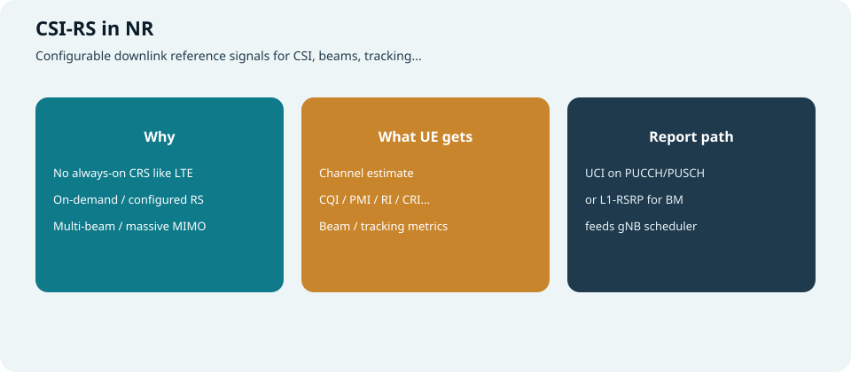
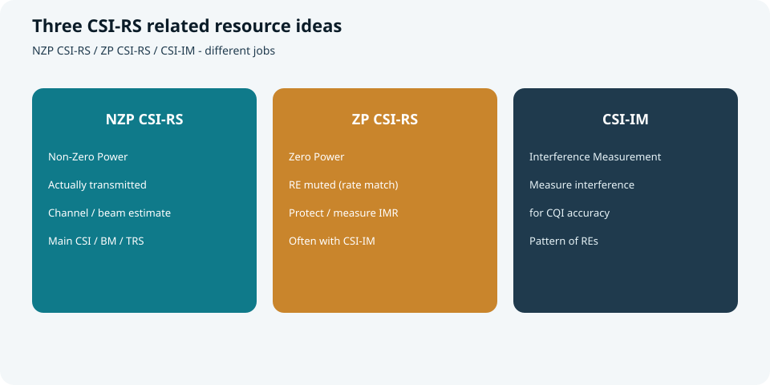
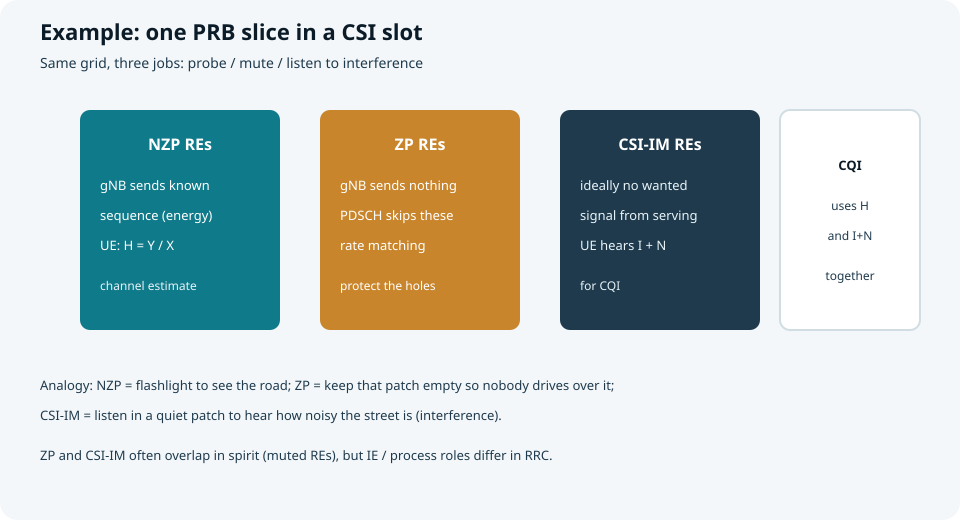
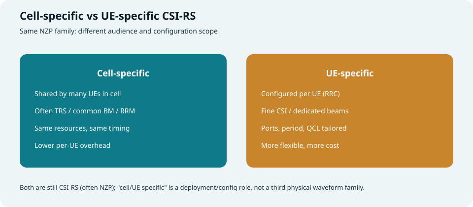
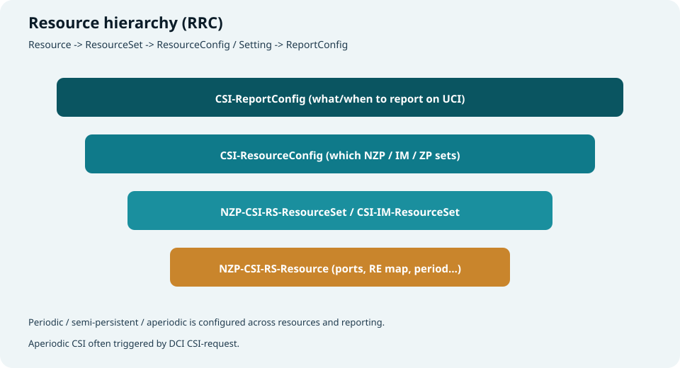
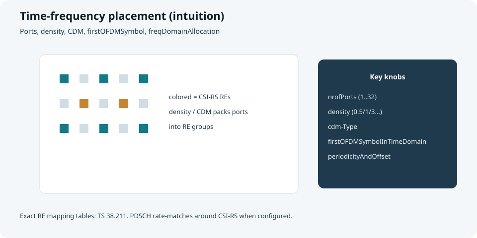
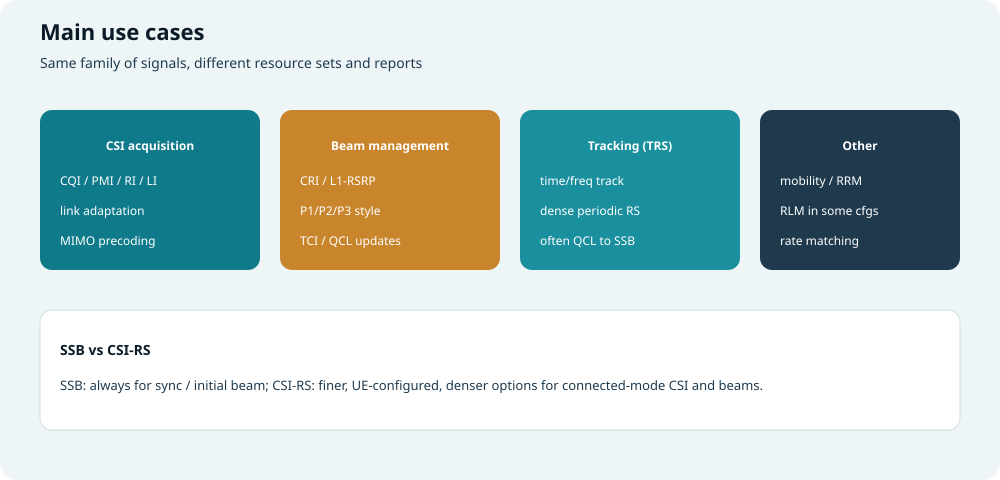
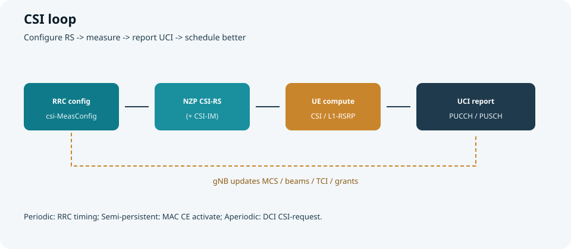

## 本篇要解决什么

NR 下行没有像 LTE 那样“永远开着”的小区公共 CRS。  
连接态要做链路自适应、MIMO 预编码、波束管理，主要靠可配置的：

**CSI-RS（Channel State Information Reference Signal）**

本篇讲清：它是什么、NZP/ZP/CSI-IM 如何分工、cell-specific 与 UE-specific 的差别、资源怎么配、占怎样的时频、服务哪些过程，以及如何变成 UCI 上报。

对照：**TS 38.211**（信号与映射）、**38.214**（CSI 过程）、**38.331**（`csi-MeasConfig` 等）。  
相关：[DCI 与 UCI](dci-uci.html)、[PUCCH 与 PUSCH](pucch-pusch.html)、[Antenna Port / QCL](antenna-port-qcl-resource-grid.html)、[NR RRC Reconfiguration](nr-rrc-reconfiguration.html)、[SSB](frame-structure-ssb.html)。



*图：可配置参考信号 → UE 估信道/波束 → UCI 喂给调度器*

---

## 为什么需要 CSI-RS

| 背景 | 含义 |
| --- | --- |
| **去 CRS 化** | 减少常开参考信号开销，频谱更干净、更灵活 |
| **Massive MIMO / 多波束** | 需要按 UE、按波束配置不同 RS |
| **连接态精细 CSI** | SSB 主要用于同步与粗波束；精细 CQI/PMI/RI 更依赖 CSI-RS |
| **干扰感知** | 配合 **CSI-IM** 估干扰，CQI 更准 |

> 口诀：**SSB 负责“找得见、对得上”；CSI-RS 负责“传得好、波束准”。**

---

## 三类相关资源：NZP / ZP / CSI-IM（详解）

名字都带 “CSI-RS / CSI”，但 **干活完全不同**：一个是“探照灯”，一个是“挖坑绕行”，一个是“侧耳听噪声”。



*图：真正发射的 NZP；打洞的 ZP；测干扰的 CSI-IM*

| 类型 | 全称直觉 | gNB 是否发射 | UE 做什么 |
| --- | --- | --- | --- |
| **NZP CSI-RS** | Non-Zero-Power | **发射**已知序列 | 估信道 / 波束 / 跟踪 |
| **ZP CSI-RS** | Zero-Power | **不发**（RE 静音） | PDSCH **速率匹配绕开**；保证相关 RE 干净 |
| **CSI-IM** | Interference Measurement | 服务小区在这些 RE 上通常**不发有用信号** | 测 **干扰 + 噪声**，服务 CQI |



*图：同一资源栅格上三种角色；CQI 同时用到信道与干扰*

### 1) NZP CSI-RS —— “打开探照灯看路”

**本质：** gNB 在约定 RE 上发出 **已知序列**（功率非零）。  
UE 收到 \(Y\)，已知 \(X\)，近似 \(H \approx Y/X\)（再做滤波、多端口联合等）。

**用来干什么：**

- 算 **CQI / PMI / RI**（链路自适应、MIMO）  
- 波束管理里的 **CRI / L1-RSRP**  
- **TRS**（一类密的周期 NZP）做时频跟踪  

**小例子 A（单端口 CSI）：**

1. RRC 给 UE 配一条周期 NZP：每 20 ms、某几个 RE、1 port  
2. 到点 gNB 发该序列  
3. UE 估信道质量 → 得出 CQI → 经 PUCCH 上报  
4. gNB 下次给该 UE 的 PDSCH 选用更合适的 MCS  

**小例子 B（多端口 PMI）：**

1. 配 4/8/32 ports 的 NZP  
2. UE 估多端口信道，对照码本选 PMI/RI  
3. 网络按 PMI 做下行预编码  

> 没有 NZP，UE 很难知道“这条空口现在能扛多高阶调制、几层”。

### 2) ZP CSI-RS —— “把地挖空，数据车绕行”

**本质：** 配置指出一批 RE **功率为零（静音）**。  
gNB **不在这些 RE 发 PDSCH**；UE 做 PDSCH 映射时 **速率匹配绕开**（当作不可用 RE）。

**用来干什么：**

- 为 NZP / CSI-IM / 邻区图案等留出 **干净空洞**  
- 避免“数据踩在测量 RE 上”，污染测量或互相干扰  
- 多小区协调时，形成可预期的静音图案（实现相关）

**小例子 C（保护测量空洞）：**

1. 网络在某符号的若干 RE 上配 **ZP**  
2. 同一批或相关 RE 用于 CSI-IM / 其它测量目的  
3. 若该 slot 还调度了 PDSCH，DCI/配置会让 UE **跳过这些 RE 映射数据**  
4. 结果：数据不踩坑，测量 RE 更干净  

> 把 ZP 理解成地图上的“施工围挡”：不是另发一种波形，而是 **禁止占用**。

### 3) CSI-IM —— “在安静角落听街上有多吵”

**本质：** 给 UE 一组 RE，让它在这上面估计 **干扰 + 噪声功率**（I+N）。  
服务小区通常保证这些 RE **没有自己的有用发射**（与 ZP 静音思想一致），于是 UE 听到的主要是邻区干扰与热噪。

**用来干什么：**

- 和 NZP 估出的信道合在一起，算更真实的 **SINR → CQI**  
- 若只用 NZP、不测干扰，CQI 容易过于乐观（只看到“路多宽”，没看到“车多堵”）

**小例子 D（NZP + CSI-IM 出 CQI）：**

1. **NZP**：测出有用信道 \(H\)（信号有多强、空间结构如何）  
2. **CSI-IM**：测出 \(I+N\)（干扰底噪）  
3. UE 综合得到可支持的 MCS 建议 → **CQI**  
4. 邻区突然变强时，CSI-IM 先变差，CQI 下降，调度降阶，掉包更少  

### 三者如何配合（一张表记住）

| 问题 | 主要靠谁 |
| --- | --- |
| 信道长什么样、能用几层？ | **NZP** |
| 这些 RE 上别发 PDSCH？ | **ZP** |
| 现在干扰有多大？ | **CSI-IM** |
| 最终 CQI 准不准？ | **NZP + CSI-IM**（再加滤波/配置） |

**生活类比（辅记）：**

| 角色 | 类比 |
| --- | --- |
| NZP | 打开手电筒看路面（主动照明） |
| ZP | 在路上画出禁行格子，卡车（PDSCH）必须绕开 |
| CSI-IM | 把手电筒关掉，在格子里听环境噪声有多大 |

> 注意：ZP 与 CSI-IM 都常涉及“静音 RE”，但 **RRC IE 与过程角色不同**——ZP 偏 **资源占用/速率匹配声明**；CSI-IM 偏 **干扰测量资源配置**。实现上图案可能对齐，读日志时仍要分开看。

---

## Cell-specific 与 UE-specific CSI-RS

工程讨论里常把 CSI-RS 再按 **服务对象** 分成两类（配置角色，不是 38.211 里另两套波形）：



*图：小区共享 vs 按 UE 定制——同属 CSI-RS 家族*

### 含义

| 类型 | 含义直觉 | 典型落点 |
| --- | --- | --- |
| **Cell-specific CSI-RS** | 面向 **小区内多数/全部 UE 共享** 的一套（或少量）资源 | **TRS**、公共波束管理、部分 RRM/共享测量 |
| **UE-specific CSI-RS** | 经 RRC **按 UE 单独配置**，资源/端口/周期/QCL 可不同 | 精细 **CSI（CQI/PMI/RI）**、专用波束、非周期 CSI |

> NR 规范侧更多是“可配置 NZP/ZP/IM + 报告配置”；**cell/UE specific** 是理解和规划时的常用分类：  
> **共享锚点 vs 人均定制探针**。

### 区别

| 维度 | Cell-specific | UE-specific |
| --- | --- | --- |
| **受众** | 多 UE 共用 | 单个（或极少）UE |
| **配置方式** | 小区级策略，UE 侧看到相同或高度相似资源 | `csi-MeasConfig` 等按 UE 下发，差异大 |
| **开销** | 一份资源服务多人，空口更省 | 灵活但占用更多 RE/调度复杂度 |
| **波束** | 偏宽波束/公共方向，或 TRS 跟踪锚 | 可对准该 UE 的窄波束 |
| **报告** | 可能报 L1-RSRP/跟踪相关；或多人测同一资源 | 常绑该 UE 的 CSI-ReportConfig（含 aperiodic） |
| **典型例子** | 周期 TRS；小区公共 CSI-RS 做粗 CSI/BM | 32-port 周期 CSI；DCI 触发的非周期 CSI-RS |

### 联系

1. **物理上往往都是 NZP CSI-RS**（ZP/IM 也可按小区策略或按 UE 测量配置出现）。  
2. **同一 UE 通常两者都用**：  
   - Cell-specific / TRS：保持同步与公共参考  
   - UE-specific：把 MCS、层数、专用波束做细  
3. **QCL 常把它们串起来**：UE-specific CSI-RS 可 QCL 到 SSB 或 cell-specific/TRS，复用空间/时频大尺度特性。  
4. **与 SSB 对照**：SSB 更偏“小区永远存在的同步锚”；cell-specific CSI-RS 是连接态可配的“小区共享参考”；UE-specific 则是“人均仪表”。

### 小例子 E（两者一起工作）

```text
小区配置周期 TRS（cell-specific 角色）
        ↓
UE 用 TRS 做时频跟踪，并作 QCL 参考
        ↓
再给该 UE 配专属 NZP CSI-RS + CSI-IM + ReportConfig（UE-specific）
        ↓
UE 上报精细 CQI/PMI；调度只服务该 UE 的链路自适应
```

**选型直觉：**

- 要 **省开销、全小区对齐** → 偏 cell-specific  
- 要 **峰值吞吐、专属波束、按需 CSI** → 偏 UE-specific  
- 实际网络：**共享锚点 + 按需专用** 叠用，而不是二选一  

---

## 资源层次（RRC 怎么配）

配置多在 **`csi-MeasConfig`**（常经 [RRCReconfiguration](nr-rrc-reconfiguration.html) 下发）。



*图：Resource → Set → ResourceConfig → ReportConfig*

| 层级 | 典型 IE | 含义 |
| --- | --- | --- |
| **Resource** | `NZP-CSI-RS-Resource` | 一条具体 RS：端口数、RE 图、周期/偏移、加扰 ID、QCL 等 |
| **ResourceSet** | `NZP-CSI-RS-ResourceSet` | 一组 resource（波束扫时可一组多个） |
| **ResourceConfig** | `CSI-ResourceConfig` | 指定用哪些 NZP/IM/ZP set，绑到 BWP，并标明周期性质 |
| **ReportConfig** | `CSI-ReportConfig` | **报什么**（CQI/PMI/RI/CRI/L1-RSRP…）、**何时报**、码本、带宽等 |

另外还有：

| IE 直觉 | 作用 |
| --- | --- |
| **CSI-AperiodicTriggerState** | 非周期触发状态 ↔ DCI `CSI-request` 码点 |
| **CSI-SemiPersistentOnPUSCH-TriggerState** 等 | 半持续激活相关 |
| **TRS 相关配置** | 跟踪参考（见用途节） |

---

## 时频结构与关键参数



*图：CSI-RS 占用部分 RE；密度与 CDM 决定端口如何塞进资源*

对照 **38.211**：不同端口数、密度、CDM 类型对应不同 RE 图案表。

| 参数 | 含义 | 作用 |
| --- | --- | --- |
| **nrofPorts** | 天线端口数（如 1,2,4,…,32） | 决定可支持的空间维度 / PMI 能力 |
| **density** | 频域密度（如 0.5 / 1 / 3） | RE 疏密；跟踪类常更密 |
| **cdm-Type** | 码分复用类型（noCDM / fd-CDM2 / cdm4/cdm8…） | 多端口共享 RE 的正交方式 |
| **firstOFDMSymbolInTimeDomain** | 时域起始符号 | CSI-RS 落在 slot 的哪些符号 |
| **freqDomainAllocation** | 频域位置比特图 | 落在哪些 PRB/RE 组 |
| **periodicityAndOffset** | 周期与 slot 偏移 | 周期 CSI-RS 何时出现 |
| **scramblingID** | 加扰标识 | 序列生成，避免混淆 |
| **powerControlOffset** 等 | 相对 PDSCH 的功率偏移 | 测量解释与功率设定 |
| **qcl-InfoPeriodicCSI-RS** 等 | QCL / TCI 关联 | 与 SSB 或其它 RS 准共址（见 QCL 专题） |

**与 PDSCH 的关系：**  
配置了 CSI-RS（尤其 ZP / 冲突 RE）时，PDSCH 按规则 **速率匹配**，不在这些 RE 上映射数据。

---

## 主要用途



*图：CSI 获取、波束管理、跟踪及其它*

### 1) CSI 获取（链路自适应 / MIMO）

UE 基于 NZP（+IM）计算并上报，例如：

| 上报量 | 含义 | 网络用来 |
| --- | --- | --- |
| **CQI** | 信道质量指示 | 选 MCS |
| **PMI** | 预编码矩阵指示 | 下行预编码 |
| **RI** | 秩指示 | 层数 |
| **LI** | 层指示等 | 进一步空间指示 |
| **CRI** | CSI-RS Resource Indicator | 选哪条 CSI-RS（常对应波束/资源） |

这些内容进入 **UCI**，经 PUCCH 或 PUSCH 上报（见 [DCI 与 UCI](dci-uci.html)、[PUCCH 与 PUSCH](pucch-pusch.html)）。

### 2) 波束管理（Beam Management）

- 一组 NZP CSI-RS resource 可对应不同下行波束  
- UE 上报 **L1-RSRP / CRI** 等，帮助 gNB 选波束  
- 结果常体现为 **TCI state** 更新，影响 PDCCH/PDSCH 的 QCL 假设  

相对 SSB：SSB 波束更“粗、公共”；CSI-RS 波束更“细、可按 UE/过程配置”。

### 3) 跟踪参考信号（TRS）

- 实质是一类 **周期性、较密的 NZP CSI-RS 配置**（常称 TRS）  
- 用于精细 **时频跟踪**（同步保持）  
- 常与 SSB **QCL**，在连接态作为跟踪锚点之一  

### 4) 其它

| 用途 | 说明 |
| --- | --- |
| **RRM / 移动性** | 部分场景用 CSI-RS 做测量（相对 SSB 测量是补充） |
| **RLM** | 部分配置下可用于无线链路监测相关 |
| **速率匹配** | ZP CSI-RS 明确“空洞”，保护测量或邻区图案 |

---

## 周期 / 半持续 / 非周期



*图：RRC 配置 → 发/测 CSI-RS → 算 CSI → UCI 上报 → 调度优化*

| 类型 | 资源与上报如何出现 | 触发 |
| --- | --- | --- |
| **Periodic** | RRC 配好周期与偏移，到点就测/报 | 时间驱动 |
| **Semi-Persistent** | RRC 配资源，**MAC CE** 激活/去激活 | 激活后按半持续规则 |
| **Aperiodic** | 资源与报告预先配置，**DCI CSI-request** 触发 | 调度器按需拉 CSI |

非周期常见路径：DCI（常在 UL grant 或专用指示中）→ UE 测指定 resource → 在 **PUSCH** 上捎带 CSI。

---

## 关键配置字段速查（读日志）

### `NZP-CSI-RS-Resource`（示意）

| 字段 | 含义 |
| --- | --- |
| **nzp-CSI-RS-ResourceId** | 资源 ID |
| **resourceMapping** | 端口、密度、CDM、时频位置 |
| **powerControlOffset / powerControlOffsetSS** | 功率偏移 |
| **scramblingID** | 加扰 |
| **periodicityAndOffset** | 周期类资源的时域图案 |
| **qcl-InfoPeriodicCSI-RS** | 周期资源的 QCL 信息 |

### `CSI-ReportConfig`（示意）

| 字段 | 含义 |
| --- | --- |
| **reportConfigId** | 报告配置 ID |
| **resourcesForChannelMeasurement** | 信道测量用哪个 ResourceConfig |
| **csi-IM-ResourcesForInterference** | 干扰测量资源（可选） |
| **reportConfigType** | periodic / semiPersistent* / aperiodic |
| **reportQuantity** | 报 cri-RI-PMI-CQI、ssb-Index-RSRP、cri-RSRP… |
| **reportFreqConfiguration** | 宽带/子带 |
| **codebookConfig** | Type I/II 等码本 |
| **periodicityAndOffset** / **pucch-CSI-ResourceList** | 周期上报时机与 PUCCH 资源 |

---

## 和 SSB、DMRS 怎么分工

| 信号 | 主要角色 |
| --- | --- |
| **SSB** | 同步、PCI、MIB、初始波束、空闲态测量 |
| **CSI-RS** | 连接态 CSI、精细波束、TRS 跟踪、部分 RRM |
| **PDSCH/PDCCH DMRS** | **解调当前信道**用的专用参考，不是给 CSI 上报主路径 |

CSI-RS 估的是“调度可用的空间/质量信息”；DMRS 估的是“这一次传输怎么解”。

---

## 端到端故事（浓缩）

```text
1) RRCReconfiguration 下发 csi-MeasConfig
   - NZP resources / sets
   - CSI-IM / ZP（按需）
   - CSI-ReportConfig
2) gNB 按配置发送 NZP CSI-RS（周期）或等待激活/DCI 触发
3) UE 测量信道（+干扰）
4) 按 ReportConfig 生成 CQI/PMI/RI/CRI/L1-RSRP...
5) UCI：PUCCH 或 PUSCH（含 aperiodic / piggyback）
6) gNB 更新 MCS、层数、预编码、TCI/波束，改善后续 PDSCH
```

---

## 快速自测

1. NR 为何不像 LTE 依赖常开 CRS？CSI-RS 补上了什么？  
2. 用例子说明 NZP、ZP、CSI-IM 各干什么？CQI 为什么常常两者（NZP+IM）都要？  
3. Cell-specific 与 UE-specific CSI-RS 的区别与联系？TRS 更偏哪一类？  
4. Resource / Set / ResourceConfig / ReportConfig 各管什么？  
5. `nrofPorts`、`density`、`cdm-Type` 影响什么？  
6. CSI 获取、波束管理、TRS 三类用途如何区分？  
7. 周期 / 半持续 / 非周期分别靠什么触发？

> 一句话：**CSI-RS 是 NR 连接态的“可配置探针”——测信道、管波束、助跟踪；测完经 UCI 回告，调度才能又快又准。**

## 相关专题

- [DCI 与 UCI](dci-uci.html)
- [PUCCH 与 PUSCH](pucch-pusch.html)
- [Antenna Port / QCL / Resource Grid](antenna-port-qcl-resource-grid.html)
- [NR RRC 与 RRCReconfiguration](nr-rrc-reconfiguration.html)
- [帧结构与 SS/PBCH Block](frame-structure-ssb.html)
- [Massive MIMO 与波束赋形](massive-mimo-beamforming.html)
