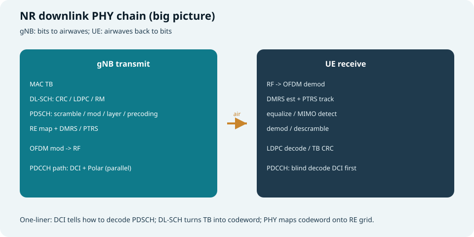
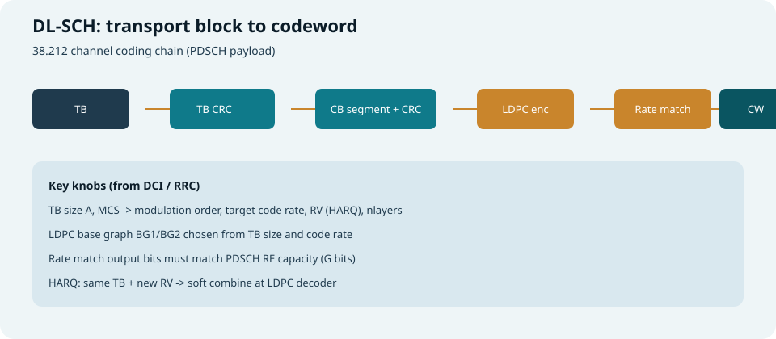
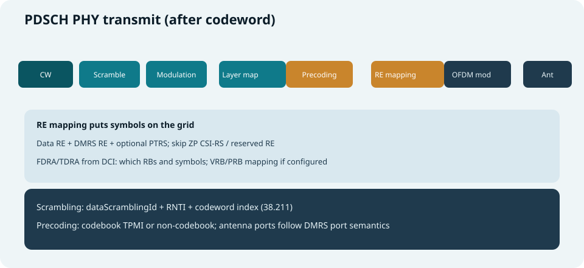
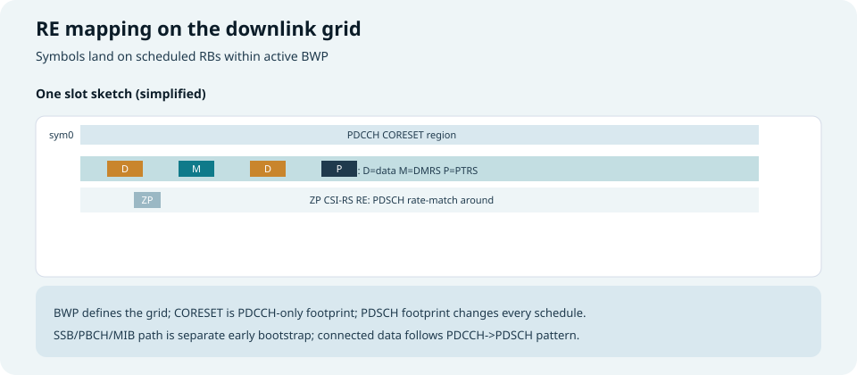
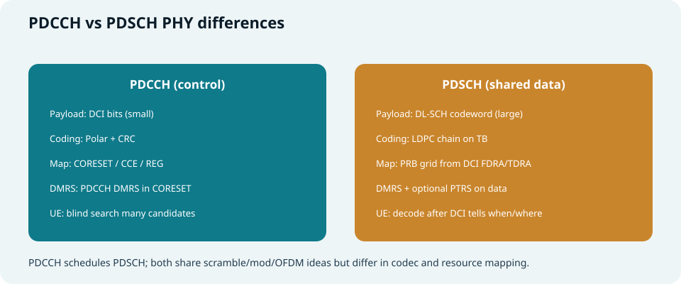
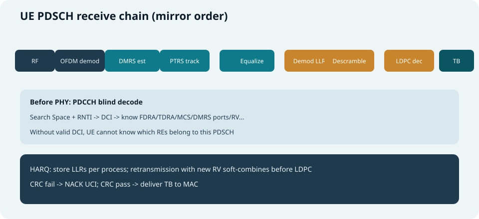

## 本篇要解决什么

「下行传一包数据」在空口里不是魔法，而是一条 **比特 → 符号 → RE 栅格 → 天线 → 反向还原** 的链条。

### 给初学者的比喻

| 比喻 | 对应 NR 下行 |
| --- | --- |
| 快递 **包裹** | MAC 的 **TB（Transport Block）** |
| 装箱单 + 防伪码 | **CRC**（校验能不能完整还原） |
| 压缩包 + 纠错冗余 | **LDPC 编码**（路上坏了还能修） |
| 按车厢容量裁剪/填充 | **速率匹配**（比特数必须等于空口能装的 \(G\)） |
| 加密打乱图案 | **加扰** |
| 把 0/1 变成星座点 | **调制**（QPSK、16-QAM…） |
| 多车道并行 | **层映射 / MIMO** |
| 地图上的格子编号 | **RE 映射**（哪个时频点放哪个符号） |
| 上路前的最后打包 | **OFDM**（变成真正无线电波形） |

本篇按 **gNB 发射** 与 **UE 接收** 两条线，把 NR 下行物理层 **每个环节** 串起来，重点落在连接态最常见的：

- **PDCCH + DCI**（控制：告诉你「去哪收、怎么收」）  
- **DL-SCH + PDSCH**（共享数据：真正载荷）  

对照：**TS 38.211**（信号/映射/OFDM）、**38.212**（信道编码/DCI）、**38.213/38.214**（过程与调度）。  
相关：[PDCCH 与 PDSCH](pdcch-pdsch.html)、[NR DMRS](nr-dmrs.html)、[NR PTRS](nr-ptrs.html)、[DCI 与 UCI](dci-uci.html)、[CORESET 与 Search Space](coreset-search-space.html)、[天线端口与 QCL](antenna-port-qcl-resource-grid.html)。



*图：gNB 把 TB 编成波形；UE 先解 DCI，再按同一套参数解 PDSCH*

---

## 先建立三层视角

| 层 | 本篇关心什么 | 典型对象 |
| --- | --- | --- |
| **MAC** | 给 PHY 一块 **TB（Transport Block）** | 用户数据、部分系统消息载荷 |
| **信道编码（38.212）** | TB → **码字（Codeword）** | DL-SCH：LDPC；PDCCH：Polar |
| **物理信道（38.211）** | 码字/控制比特 → **RE 上的符号** | PDSCH、PDCCH、PBCH… |

> 口诀：**MAC 出 TB；DL-SCH 出码字；PDSCH 把码字钉到栅格上。**

### 三层怎么叠在一起（数字例子）

假设手机正在刷网页，MAC 要发 **一块 800 比特** 的用户数据：

```text
第 1 层 MAC
  TB = 800 bit 用户比特（还没纠错、还没映射到空口）

第 2 层 DL-SCH（38.212）
  800 bit + TB CRC → 分段（本例只需 1 个码块）
  → LDPC 编码（比特变多，加了冗余）
  → 速率匹配（按本次 PDSCH 能装的 G 比特，打孔或重复）
  → 得到码字 E（比如 G = 12 000 bit）

第 3 层 PDSCH PHY（38.211）
  12 000 bit 加扰 → 16-QAM（每符号 4 bit）→ 3 000 个符号
  → 分到 2 个层 → 预编码到天线端口
  → 映射到 DCI 指定的 RB/符号 上的数据 RE
  → OFDM → 天线发射
```

**UE 做的事就是上面三步倒着走**，且 **必须先知道 DCI**（从 PDCCH 来），否则不知道 12 000 是不是对的 \(G\)、不知道去哪个 RB 收。

### NR 与 LTE 的一个关键差异

很多「以前固定或隐式」的传输参数，在 NR 里大量由 **RRC + DCI 显式配置**：

| 以前直觉 | NR 里常见做法 |
| --- | --- |
| CRS 固定占频 | 无 CRS；靠 DMRS + 可选 CSI-RS |
| 下行调度参数部分隐含 | **FDRA/TDRA/MCS/端口** 多在 DCI 里 |
| 监听位置相对固定 | **CORESET + Search Space** 可配多套 |

排障时要 **同时看 DCI 字段与 RRC 半静态项**，不能只看 RSRP。

---

## 端到端故事（用户数据 PDSCH）

### 总流程（先记大图）

```text
gNB MAC: TB
    -> DL-SCH: CRC / 分段 / LDPC / 速率匹配 / 拼接 -> 码字 E
    -> PDSCH PHY: 加扰 / 调制 / 层映射 / 预编码 / RE 映射(+DMRS/PTRS) / OFDM
    -> 天线发射

UE: 射频接收 -> OFDM 解调 -> 资源栅格
    -> (已用 PDCCH 解出 DCI，知道何时何地何格式)
    -> DMRS 信道估计 + PTRS 相位跟踪
    -> 均衡 / MIMO 检测 -> 软比特 LLR
    -> 解扰 -> LDPC 译码链 -> TB CRC
    -> CRC 通过则上交 MAC；失败则 HARQ NACK
```

**PDCCH 在这条链上的位置：** 在解 PDSCH **之前**，UE 必须先 **盲检 PDCCH → 得到 DCI**。没有 DCI，就不知道 FDRA/TDRA、MCS、层数、DMRS 端口、RV 等——等于 **有货但不知道去哪个仓库取**。

### 一个时隙里的「电影分镜」（连接态 C-RNTI）

下面是一个 **教学用** 的简化时间线（真实实现可跨 slot、K0/K1 等见 DCI）：

| 顺序 | 谁 | 发生什么 | 初学者要记住 |
| --- | --- | --- | --- |
| ① | UE | 在 USS 上盲检 PDCCH（C-RNTI） | 控制先来 |
| ② | gNB | PDCCH 上发 DCI 1_1：「slot n，符号 2–13，RB 20–39，MCS=20，2 层，RV=0」 | DCI = 菜谱 |
| ③ | UE | CRC+RNTI 匹配 → 解析 DCI 字段 | 确认是给自己的单 |
| ④ | gNB | 同一 slot（或 DCI 指示的偏移）在 RB 20–39 发 PDSCH | 数据跟上 |
| ⑤ | UE | 按 DCI 提取 RE → 估信道 → 译码 → TB CRC | 还原包裹 |
| ⑥ | UE | CRC 通过 → ACK；失败 → NACK + 等 HARQ 重传 | 闭环 |

```text
时间轴（一个 slot，示意）

符号:  0    1    2    3    4 ... 12   13
       |----+----+----+----+----+----|
PDCCH:      [CORESET 可能占 1~3 符号]
PDSCH:            [======== 数据区 ========]
DMRS:                  ^              ^
                       TypeA          附加(若配)
```

---

## 环节 1：从 MAC 到码字 —— DL-SCH（PDSCH 载荷）



*图：TB 经过 CRC、码块分割、LDPC、速率匹配，变成码字*

**DL-SCH** 是 **PDSCH 承载的传输信道**——你可以把它理解成：**专门把 TB 变成「能塞进 PDSCH 的比特流」的编码车间**。车间在 38.212 里定义；PDSCH 在 38.211 里定义 **怎么把这些比特变成波形**。

下面按车间流水线 **逐步展开**，每步都配 **直觉 + 小例子**。

---

### 1.1 TB CRC 附加 —— 「整包防伪标签」

**做什么：** 在 MAC 给的 TB 末尾附加 **CRC 校验比特**（DL-SCH 用 CRC-24A 等，规范有表）。

**为什么：** UE 译码结束后要判断：**这一整块 TB 是不是完整、没被译码器「幻觉」出来**。就像下载完文件看 checksum。

**例子：**

```text
MAC 给 PHY：TB，A = 800 bit（纯用户数据）

DL-SCH 第 1 步：
  B = A + CRC = 800 + 24 = 824 bit

UE 最后一步：
  译码得到 800 bit → 算 CRC → 与附带 CRC 比对
  一致 → 交给 MAC；不一致 → 认为本包失败（常触发 NACK）
```

**初学者易错点：** TB CRC 是 **整包** 的；后面码块上还有 **CB CRC**（下一节），两层校验作用对象不同。

---

### 1.2 码块分割 + CB CRC —— 「大包裹拆箱」

**做什么：** 若 TB（含 TB CRC）太大，切成多个 **code block（码块）**；每个码块再附加 **CB CRC**，再各自进 LDPC。

**为什么：** LDPC 编码器一次「吃不下」任意长度；规范规定最大码块尺寸，超过必须切。

**直觉门限（记方向即可，精确查 38.212）：**

| 情况 | 典型处理 |
| --- | --- |
| 小 TB（常见网页小包） | **1 个码块** 就够 |
| 大 TB（高速率大 TBS） | 切成 **多个码块**，并行编码后再拼接 |

**例子：**

```text
B = 824 bit（上节的小包）→ 只需 1 个 CB，记 CB0

若 B = 20 000 bit（大文件块）：
  可能切成 CB0、CB1、CB2 …
  每个 CB 末尾各加 CB CRC
  LDPC 对每个 CB 单独编码
  最后把各 CB 的编码输出按顺序拼成码字
```

**比喻：** 20 米长的货物不能整根塞进 LDPC 机器，先锯成几段，每段贴小标签（CB CRC），分别加工，最后按顺序焊回去。

---

### 1.3 LDPC 编码 —— 「故意多带冗余，路上坏了能修」

**做什么：** 对每个码块选 **Base Graph 1 或 2（BG1/BG2）**，做 LDPC 信道编码，输出 **带大量冗余** 的比特序列。

**为什么：** 无线信道会噪声、衰落、干扰；冗余让 UE **软译码** 时能把错比特纠正回来。

| Base Graph | 直觉适用 |
| --- | --- |
| **BG1** | 较大码块、较高码率场景更常见 |
| **BG2** | 较小码块 |

**例子（数量级直觉，非规范精确值）：**

```text
CB0 输入：约 900 bit（含 CB CRC）
LDPC 编码后：可能变成约 5 000 bit（具体由码率 R 决定）

码率 R 直觉：
  R = 信息比特 / 编码后比特
  R 越低 → 冗余越多 → 越抗噪，但同样 RE 能传的「新信息」越少
  MCS 表里的码率与 R 联动
```

**和 MCS 的关系：** DCI 里的 **MCS index** 通过 38.214 表映射到 **调制阶数 \(Q_m\)** 和 **目标码率 \(R\)**；编码链按这个 \(R\) 决定 LDPC 后比特规模，再进入速率匹配。

---

### 1.4 速率匹配（Rate Matching）—— 「必须刚好装满车厢」

**做什么：** 对 LDPC 输出做 **打孔（丢弃部分比特）或重复（同一比特发多次）**，使 **每个码块（或整码字）输出比特数精确等于** 本次 PDSCH 能承载的 **\(G\)**。

**为什么：** 空口资源是固定的——本次调度了多少 **数据 RE**、用什么 **调制**、多少 **层**，能装的比特数 \(G\) 就算死了。编码器输出若比 \(G\) 多，必须裁；若少，必须垫（重复）。**差 1 bit 都会导致 UE 译码链错位。**

#### \(G\) 怎么来（初学者版公式）

记：

- \(N_{RE}^{data}\)：本次 PDSCH 调度区域内，**可用于数据的 RE 个数**（已扣除 DMRS、PTRS、ZP CSI-RS 等）  
- \(Q_m\)：调制阶数（QPSK=2，16-QAM=4，64-QAM=6…）  
- \(N_{layer}\)：层数  

则（单码字场景直觉）：

\[
G \approx N_{RE}^{data} \times Q_m \times N_{layer}
\]

**数字例子：**

```text
调度：20 PRB，符号 2~13（共 12 个符号），Mapping Type A
DMRS 占掉部分 RE 后，约有 N_RE_data ≈ 2 400 个数据 RE（示意）

MCS 指示：16-QAM → Qm = 4
DCI 指示：2 层 → N_layer = 2

G ≈ 2400 × 4 × 2 = 19 200 bit

速率匹配必须输出 E = 19 200 bit（单码字时 E 就是 G）
再交给 PDSCH 做加扰、调制…
```

#### RV（冗余版本）与 HARQ

**RV** 决定 **从 LDPC 环形缓冲区里「取哪一段」比特** 去做打孔/重复图案——同一 TB 重传时常换 RV，让 UE 收到 **不同位置的冗余**，便于 **软合并**。

```text
第 1 次传（新传）：RV = 0
UE CRC 失败 → NACK

第 2 次传（重传，同一 HARQ 进程）：
  可能 RV = 2，RB/MCS 也可能变
  UE 把两次的软比特 LLR 相加/合并
  再 LDPC 译码 → 往往就能过 CRC
```

**比喻：** 第一次只发了「说明书第 1 章」；重传发「第 3 章」；UE 把两章拼起来读完整本书。

---

### 1.5 码块拼接 —— 「出厂成品：码字」

**做什么：** 多个码块经速率匹配后的比特 **按顺序拼接**，得到 **码字**（记比特数 \(E\)，单码字时 \(E=G\)）。

**交给谁：** PDSCH 物理层第一步 **加扰** 的输入。

**小例子：**

```text
仅 1 个 CB → 码字就是该 CB 速率匹配后的 E bit

2 个 CB → 码字 = RM(CB0) 拼接 RM(CB1)
```

---

### 1.6 环节 1 小结：关键参数从哪来

| 参数 | 典型来源 | 影响什么 |
| --- | --- | --- |
| **TB 大小 \(A\)** | MAC 调度器 | 要不要分段、选 BG |
| **MCS / \(Q_m\)** | DCI | 每 RE 几个比特、\(G\) 大小 |
| **层数 \(N_{layer}\)** | DCI + UE 能力 | \(G\) 与 MIMO 检测 |
| **码率 / TBS** | DCI + 38.214 表 | LDPC 与 RM |
| **RV** | DCI | HARQ 重传取比特图案 |
| **\(N_{RE}^{data}\) → \(G\)** | FDRA/TDRA + DMRS/PTRS 占用 | **RM 输出必须对齐** |

**排障口诀：** CRC 经常失败时，先分清：

1. **信道估计/DMRS 错** → 软比特就错了，译码救不回来  
2. **TBS 与 \(G\) 算错** → 速率匹配长度错位，译码器从第一步就乱  

---

## 环节 2：PDSCH 物理层发射（gNB）



*图：码字之后才是「物理信道」处理*

从本节开始，输入已经是 **速率匹配后的比特流**；输出是 **天线上的 OFDM 波形**。每一步都可 **在 UE 侧镜像逆操作**。

---

### 2.1 加扰（Scrambling）—— 「按用户/小区专属规则打乱 0/1」

**做什么：** 用 **Gold 序列** 与比特流 **异或（XOR）**。

**为什么：**

| 目的 | 说明 |
| --- | --- |
| 随机化 | 避免长串 0/1 造成频谱尖峰、同步问题 |
| 区分用户 | 不同 **RNTI**、不同 **\(N_{ID}\)** → 不同序列 → 解扰不对就译码失败 |
| 小区间隔离 | 同频多小区时降低互相「误解」概率 |

**初始化（直觉，精确见 38.211）：** 与 **小区 ID**、**RNTI**、**码字索引 \(q\)** 等有关。UE 必须用 **与 gNB 相同的初始化** 才能解扰。

**例子：**

```text
某 UE 的 C-RNTI = 0x4601
码字索引 q = 0（第一个码字）

gNB：bit_out = bit_in XOR Gold(初始化参数)
UE： bit_in = bit_out XOR Gold(同一初始化)   // XOR 两次还原

若 UE 用错 RNTI 盲检（误以为是别人的包）：
  解扰后比特流像随机噪声 → LDPC 几乎必失败
```

---

### 2.2 调制（Modulation）—— 「把比特变成星座点」

**做什么：** 把比特流按 **\(Q_m\)** 分组，每组映射为一个 **复数符号**（星座点）。

| 调制 | \(Q_m\) | 每符号比特数 | 直觉 |
| --- | --- | --- | --- |
| QPSK | 2 | 2 | 4 个点，最抗噪，低速/边缘 |
| 16-QAM | 4 | 4 | 16 个点，中等速率 |
| 64-QAM | 6 | 6 | 64 个点，较好信道 |
| 256-QAM | 8 | 8 | 256 个点，很近/很好信道 |

**例子（16-QAM）：**

```text
比特流片段：... 01 10 11 00 ...
按 Qm=4 分组：(0110) (1100) ...
每组对应星座上一个点，例如 (0110)→符号 s1，(1100)→符号 s2

若本次 G = 12 000 bit，Qm = 4
→ 调制后约 3 000 个复数符号
```

**MCS 从哪来：** DCI 的 **MCS index** → 查 38.214 表 → 得到 \(Q_m\) 与码率。**离基站远时调度器会选低 MCS（如 QPSK）**，不是「协议规定远就用 QPSK」，而是 **链路自适应** 的结果。

---

### 2.3 层映射（Layer mapping）—— 「符号分到几条逻辑车道」

**做什么：** 把调制符号分配到 **\(N_{layer}\)** 条 **层（layer）** 上。层是 **逻辑流**，还不是天线。

**单码字多流（最常见教学场景）：**

```text
1 个码字，N_layer = 2

调制符号序列：s0, s1, s2, s3, s4, s5 ...
层映射（示意）：
  层 0：s0, s2, s4 ...
  层 1：s1, s3, s5 ...

两条车道并行传输，提高频谱效率
```

**层数从哪来：** DCI **天线端口/层数相关字段** + UE 能力（最多支持几层）。**UE 不支持 4 层时，gNB 不能强行调度 4 层。**

**初学者必记：** **层 ≠ 天线**。2 层可以对应 2 根天线端口，也可以经预编码映射到更多物理天线（波束）。

---

### 2.4 预编码（Precoding）—— 「逻辑车道开到哪几根天线端口」

**做什么：** 把各层符号通过 **预编码矩阵 \(W\)** 映射到 **天线端口** 上的符号。

**两种常见模式：**

| 模式 | 谁决定 \(W\) | 典型场景 |
| --- | --- | --- |
| **Codebook** | DCI 里的 **TPMI** 从码本选 \(W\) | 常见 FR1 商用 |
| **Non-codebook** | 更依赖 CSI-RS/SRS 测量 | 部分增强场景 |

**直觉例子（2 层 → 2 端口）：**

```text
层 0 符号 x0，层 1 符号 x1

端口 0 发射：w00·x0 + w01·x1
端口 1 发射：w10·x0 + w11·x1

W = [w00 w01; w10 w11] 由 TPMI 查表得到
```

**和 DMRS 的关系：** 数据与 **DMRS** 应走 **同一套端口/预编码假设**。UE 用 DMRS 估的是 **等效信道 \(H_{\text{eff}}\)**（含预编码），若 DCI 端口指示错了，估计全错 → 解调全错。

详见 [NR DMRS](nr-dmrs.html)、[NR CSI-RS](nr-csi-rs.html)。

---

### 2.5 RE 映射（Resource element mapping）—— 「在栅格上钉钉子」



*图：PDCCH 占 CORESET；PDSCH 占调度 RB；DMRS/PTRS/ZP 穿插其中*

**做什么：** 把各天线端口上的符号，按规则放到 **资源栅格** 的 **RE（Resource Element）** 上——每个 RE 是 **1 个子载波 × 1 个 OFDM 符号**。

#### 栅格上有什么

| 内容 | 说明 | 初学者 |
| --- | --- | --- |
| **数据 RE** | 承载 PDSCH 调制符号 | 「货」 |
| **DMRS RE** | 嵌在 PDSCH 区域内的导频 | 「路标」，不占用户数据 |
| **PTRS RE**（可选） | 相位跟踪 | 高速/高阶时补相位 |
| **不映射** | ZP CSI-RS、CORESET 外、未调度 RB… | 「别人地盘不能踩」 |

#### 时频位置谁决定 —— DCI 四大件

| DCI 字段 | 管什么 | 例子 |
| --- | --- | --- |
| **FDRA**（频域资源分配） | 哪些 **RB** | Type1：从 RB 20 起连续 20 个 RB |
| **TDRA**（时域资源分配） | 哪些 **符号** | SLIV：从 symbol 2 起长度 12 |
| **VRB-to-PRB** | 虚拟 RB 到物理 RB | 部分 BWP 配置下需要 |
| **BWP indicator** | 在哪个 **下行 BWP** 内解释上述 | 先选对「地图册」 |

**FDRA 例子（Type 1，连续分配）：**

```text
BWP 内共 100 PRB
DCI：起始 RB = 20，长度 = 20
→ PDSCH 占用 PRB 20, 21, …, 39
```

**TDRA 例子（SLIV）：**

```text
一个 slot 有 14 个符号（常规 CP，30 kHz）
DCI 指示：起始符号 2，长度 12
→ 占用 symbol 2, 3, …, 13
（symbol 0/1 可能给 PDCCH 或其它信号）
```

#### PHY 侧速率匹配（绕开占用 RE）

若配置了 **ZP CSI-RS**（零功率 CSI-RS），PDSCH **不能** 把数据映射到那些 RE 上——相当于 **打孔**。这与 38.212 的比特速率匹配是两层概念：

```text
38.212 速率匹配：比特数对齐 G
38.211 RE 映射：符号别踩 ZP/DMRS/CORESET RE
```

**ZP 例子：** 某 4 个 RE 被标为 ZP CSI-RS → gNB 不发 PDSCH 数据；UE 也不在那些 RE 上收 PDSCH 数据；**\(N_{RE}^{data}\) 统计时要扣除**。

---

### 2.6 OFDM 调制与发射 —— 「变成真正的无线电波形」

**做什么：** 对每个天线端口上、每个 OFDM 符号：

1. 把 **频域 RE 上的复数符号** 放到子载波上（未用子载波为 0）  
2. **IFFT** 变时域  
3. 加 **循环前缀 CP**  
4. 串接各符号 → 该端口时域波形  
5. 多端口、多天线 **同时发射**

**Numerology（子载波间隔 SCS）例子：**

| SCS | 典型场景 | 直觉 |
| --- | --- | --- |
| 15 kHz | LTE 兼容、部分 FR1 | 符号较长，适合低频 |
| 30 kHz | FR1 常见 | 每 slot 14 符号 |
| 120 kHz | FR2 | 符号短，适合毫米波 |

```text
30 kHz SCS，100 MHz 带宽
→ 约 273 个 PRB（具体与 BWP 配置有关）
→ 一个 slot 时长约 0.5 ms
→ UE 每 0.5 ms 可能收到一次 PDCCH+PDSCH 调度机会（视配置）
```

**波束：** 数字预编码 + 模拟波束赋形决定 **往哪个方向辐射**。FR2 常显式波束管理；FR1 也常做波束但未必每次 DCI 都写「波束 ID」（可能由 TCI/QCL 隐含）。

---

## 环节 3：PDCCH 物理层（与 PDSCH 并行的一条链）



*图：控制信道用 Polar、映射到 CORESET；数据信道用 LDPC、映射到调度 PRB*

PDCCH 不承载用户 TB，而是承载 **DCI**——**每次 PDSCH 的「导航仪」**。它与 PDSCH **同时规划、同时发射**，但走 **另一套编码与映射规则**。

### 3.1 PDCCH 与 PDSCH 本质对照

| 维度 | **PDCCH** | **PDSCH** |
| --- | --- | --- |
| 载荷 | **DCI**（几十比特级） | **DL-SCH 码字**（可达数千比特） |
| 编码 | **Polar** + CRC | **LDPC** 链 |
| 映射单位 | **CORESET → REG → CCE** | **PRB / RE 栅格** |
| DMRS | PDCCH DMRS | PDSCH DMRS |
| PTRS | 通常无 | 可选 |
| UE 行为 | **盲检** 多个候选 | 按 DCI **确定** 监听/解码 |

**为什么 PDCCH 用 Polar、PDSCH 用 LDPC？**

```text
DCI 很短（~50 bit 量级）→ 适合 Polar（短块高效）
用户 TB 很长 → 适合 LDPC（长块、可并行译码）
```

---

### 3.2 PDCCH 发射链逐步（结合例子）

```text
DCI 比特 → CRC（+ RNTI 掩码语义）→ Polar 编码 → 速率匹配
    → 加扰 → QPSK（几乎固定）→ 层/端口映射
    → 映射到 CORESET 的 REG/CCE → OFDM → 天线
```

#### 步骤 A：DCI 是什么（内容例子）

连接态下行调度常用 **DCI format 1_1**（字段多少随配置裁剪）。**教学抽象** 一批字段：

| 字段（示意） | 告诉 UE 什么 |
| --- | --- |
| 频域资源 | PDSCH 哪些 RB |
| 时域资源 | PDSCH 哪些 symbol / K0 |
| MCS | 调制与码率 |
| RV + HARQ process ID | 新传还是重传、软合并哪个进程 |
| 天线端口 / TPMI | 几层、预编码 |
| NDI | 新数据还是重传（与 HARQ 配合） |

**例子：** 「C-RNTI 0x4601 的 UE，请在 slot 5 的 symbol 2–13、PRB 20–39，用 MCS 20、2 层、RV0 收 PDSCH。」

#### 步骤 B：CRC + RNTI

DCI 比特加 CRC 后，会用 **RNTI** 做掩码处理——UE 盲检时用 **同一 RNTI** 试，CRC 通过才认为 **「是发给我的 / 这类用途」**。

```text
SI-RNTI   → 收 SIB
RA-RNTI   → 收 RAR
C-RNTI    → 收用户数据
P-RNTI    → 寻呼
```

#### 步骤 C：Polar 编码与速率匹配

Polar 把短 DCI 编成更长比特流，再 **速率匹配** 到 **聚合等级 AL 决定的 CCE 容量**。

#### 步骤 D：映射到 CORESET

| 概念 | 直觉 |
| --- | --- |
| **CORESET** | PDCCH 允许出现的 **时频区域**（地皮） |
| **REG** | 1 RB × 1 symbol 的砖 |
| **CCE** | 通常 6 个 REG 组成，**分配单位** |
| **聚合等级 AL** | 一个 PDCCH 占 **L 个 CCE**（L=1,2,4,8,16） |

**例子：**

```text
CORESET#1：频域占 BWP 内 RB 0–47，时域 2 个符号
一个 PDCCH 候选：AL = 8 → 占 8 个 CCE
信道差时 gNB 常用更大 AL → 更多 RE 承载相同 DCI → 更可靠，但 CCE 开销大
```

#### 步骤 E：UE 盲检（接收侧核心）

UE **不知道** 本次 DCI 落在哪个候选上，只能在 **Search Space** 规定的 **时刻 + 候选列表** 上逐个试：

```text
监听时机：slot n，符号 0~1（由 Search Space 定）
候选 1：AL=8，起始 CCE=0  → 解一遍，CRC 失败
候选 2：AL=8，起始 CCE=8  → 解一遍，CRC 通过 + RNTI 匹配 → 成功，得到 DCI
```

深挖：[CORESET 与 Search Space](coreset-search-space.html)、[PDCCH 与 PDSCH](pdcch-pdsch.html)。

---

## 环节 4：UE 接收 PDSCH（与发射镜像）



*图：先 DCI，再 OFDM → 估计 → 均衡 → 软解调 → 译码*

**前提：** UE 已通过 PDCCH 拿到 **本包 DCI**。下面按 **收端流水线** 展开。

---

### 4.1 射频与 OFDM 解调 —— 「从电磁波回到栅格」

**做什么：**

```text
天线接收电磁波
  → 低噪声放大、下变频（RF）
  → ADC 数字化
  → 对每个 OFDM 符号：去 CP → FFT
  → 得到「资源栅格」：每个 RX 天线一份复数矩阵 [子载波 × 符号]
```

**定时同步：**

| 阶段 | 靠什么 |
| --- | --- |
| 初始 / 空闲 | **PSS/SSS**（小区搜索） |
| 连接态 | **DMRS** 细调跟踪；SSB 周期校准 |

**例子：** 2 根 RX 天线 → FFT 后得到 **2 份栅格**；后续 MIMO 检测同时用两份。

---

### 4.2 信道估计（DMRS）—— 「先认识路，再走数据」

**做什么：** 在 **DCI+RRC 指定的 PDSCH 区域** 内，找到 **DMRS RE** 上的接收符号，与本地已知 DMRS 序列对比，估计 **等效信道 \(H\)**。

**为什么先 DMRS：** 数据 RE 上的符号是 **未知的**；DMRS 是 **已知的**，才能估信道。

**例子（单流直觉）：**

```text
某 DMRS RE 上：
  接收 y = H · d_dmrs + 噪声
  本地已知 d_dmrs
  → 估 H ≈ y / d_dmrs（实际用多 RE 平均/插值）

再在相邻数据 RE 上插值 H，用于均衡数据符号
```

**配置从哪来：** RRC `pdsch-Config`（Type1/2、附加位置…）+ DCI **天线端口** 字段。错配时 **H 估错** → 后面全错。

**QCL/TCI：** 大尺度参数（如多普勒、时延扩展）可跟 SSB/CSI-RS **准共址**，减少重新学习成本。见 [QCL 专题](antenna-port-qcl-resource-grid.html)。

---

### 4.3 相位跟踪（PTRS，可选）—— 「DMRS 之间相位变了怎么办」

**问题：** DMRS 每隔若干符号才出现一次；高阶调制或 **相位噪声大（FR2）** 时，中间符号的 **公共相位** 可能旋转。

**做什么：** 在 **PTRS RE** 上估相位误差，补偿后再解调。

```text
无 PTRS：主要靠 DMRS 插值相位 → 高速/高频可能不够
有 PTRS：在数据符号之间补「相位锚点」
```

详见 [NR PTRS](nr-ptrs.html)。

---

### 4.4 均衡与 MIMO 检测 —— 「从多天线混叠里拆回各层」

**单流（1 层）：**

```text
数据 RE 接收 y，信道 H（从 DMRS 来）
均衡（ZF/MMSE）：x̂ = W · y
得到数据符号估计 x̂
```

**多流（2 层 + 2 RX 例子）：**

```text
y = H · [x0; x1] + n   （向量形式）

检测器（MMSE/ML 等）同时估 x0, x1
输出：各层符号估计 → 送入软解调
```

**输出：** 不仅是硬比特，而是 **软信息 LLR**（每个比特「有多像 0 / 有多像 1」），供 LDPC **软译码**。

---

### 4.5 解调、解扰、译码 —— 「软比特一路逆流而上」

与发射 **逐步逆序**：

| 步骤 | 做什么 | 例子/注意 |
| --- | --- | --- |
| **软解调** | 符号 → 每比特 LLR | 16-QAM 每符号 4 个 LLR |
| **解扰** | LLR 按相同 Gold 规则 **解扰**（符号翻转等价） | RNTI 错则此处就废 |
| **解速率匹配** | 按 **RV** 把 LLR **填回** LDPC 解码器输入结构 | 重传时与历史 LLR **合并** |
| **LDPC 译码** | 迭代译码，纠正错误比特 | 软合并是 HARQ 核心 |
| **码块级联 + CB CRC** | 多块则逐块校验、拼接 | 任一块 CB CRC 失败 → 整包失败 |
| **TB CRC** | 对整 TB 校验 | 通过 → 上交 MAC |

**HARQ 软合并例子：**

```text
第 1 次传 RV0：某比特 LLR = +0.3（略像 1）
第 2 次传 RV2：同一比特 LLR = +0.5
合并：+0.8 → 更确信是 1 → LDPC 更容易成功
```

---

### 4.6 闭环反馈 —— 「告诉基站：这包行不行」

| 结果 | UE 动作 | gNB 动作 |
| --- | --- | --- |
| TB CRC **通过** | **HARQ-ACK**（PUCCH 或 PUSCH UCI） | 该 HARQ 进程可发新 TB |
| TB CRC **失败** | **HARQ-NACK** | 同一进程 **重传**（常换 RV） |

**时间关系（直觉）：** DCI 里常有 **K1**——PDSCH 在 slot n，ACK 在 slot n+K1 的 PUCCH 上回。

见 [DCI 与 UCI](dci-uci.html)、[PUCCH 与 PUSCH](pucch-pusch.html)。

---

## 环节 5：资源与配置从哪来 —— 「完整菜谱」拼装实例

### 5.1 两层配置：RRC 定舞台，DCI 定场次

```text
RRC（半静态，几天/几秒才变一次）
  BWP, CORESET, SearchSpace, pdsch-Config, dmrs-Type, PTRS...
        +
DCI（动态，每个调度时刻）
  FDRA, TDRA, MCS, RV, HARQ PID, antenna ports, TPMI...
        =>
本次下行传输的「完整菜谱」
```

| 你想调什么 | 常见旋钮位置 |
| --- | --- |
| 在哪听 PDCCH | CORESET、Search Space、RNTI |
| PDSCH 占哪块时频 | DCI：FDRA、TDRA |
| 传多快、多稳 | DCI：MCS、层数、码率 |
| DMRS 怎么嵌 | RRC `pdsch-Config` + DCI 端口 |
| 有没有 PTRS | RRC `phaseTrackingRS` + MCS/BW 门限 |

[RRC Reconfiguration](nr-rrc-reconfiguration.html) 专题里有 `pdsch-Config` / `pdcch-Config` 在配置树中的位置。

### 5.2 端到端数字实例（把全文串起来）

**场景：** FR1 n78，UE 已连接，C-RNTI 业务下载。

**RRC 已配好（半静态）：**

```text
下行 BWP：100 MHz，30 kHz SCS，起始 CRB 0，共 273 PRB
CORESET#1 + USS：监听 slot 内 symbol 0~1
pdsch-Config：DMRS Type1，TypeA position=2，附加位置=1
```

**某次调度 DCI（动态）：**

```text
RNTI：C-RNTI
FDRA：PRB 40~59（20 PRB）
TDRA：symbol 2~13
MCS：22 → 64-QAM，码率约 0.6（查表）
层数：2
RV：0（新传）
HARQ process ID：3
天线端口：2 层，TPMI=5
```

**gNB 侧计算（直觉）：**

```text
1. MAC 给 TB，A ≈ 15 000 bit
2. DL-SCH：CRC → 1~2 CB → LDPC → RM → E = G bit
   G 由 20 PRB × 12 sym × 每 RE 扣 DMRS 后 × Qm=6 × 2 层 算出
3. PDSCH：加扰 → 64-QAM → 2 层 → TPMI 预编码
4. 映射到 PRB 40~59、sym 2~13；DMRS 在 sym 2 与 sym 11（附加）
5. OFDM → 发射
```

**UE 侧：**

```text
1. symbol 0~1 盲检 PDCCH → DCI 命中
2. 按 DCI 在 PRB 40~59、sym 2~13 收 PDSCH
3. DMRS 估 H → 均衡 → LLR → 解扰 → LDPC → TB CRC 通过
4. slot n+4（例）PUCCH 上 ACK
```

**若第 3 步 CRC 失败：** 同一 HARQ 进程 3、换 RV=2 重传；UE 软合并后再译码。

---

## 特殊下行物理信道（与主链条的关系）

| 信道 | 与「主链条」关系 | 初学者记 |
| --- | --- | --- |
| **PBCH + MIB** | 独立短链；SSB 内固定图案；MIB 里有 `pdcch-ConfigSIB1` | 开机第一步，不是 C-RNTI 用户链 |
| **PDSCH 传 SIB1/SI** | 仍是 **PDCCH(SI-RNTI) → PDSCH** | 公共配置，非用户数据 |
| **PDSCH 传 RAR/Msg4** | **RA-RNTI / TC-RNTI** 的 PDCCH → PDSCH | 接入阶段 |
| **CSI-RS** | 非 PDSCH 数据链；但 **ZP 打孔** 与 **QCL** 影响 PDSCH | 测量用，不是本次 TB 载荷 |

开机搜网主线见 [UE 开机搜网全流程](ue-boot-network-search.html)。

---

## gNB 侧 vs UE 侧对照表

| 环节 | gNB（发） | UE（收） |
| --- | --- | --- |
| 信源 | MAC TB / DCI 生成 | 解析 DCI / 恢复 TB |
| 信道编码 | LDPC / Polar | LDPC / Polar 译码 |
| 加扰 | 加扰 | 解扰 |
| 调制 | 符号映射 | 软解调 LLR |
| MIMO | 层映射 + 预编码 | 检测 + 层解映射 |
| 参考信号 | 发 DMRS/PTRS | 估信道 / 相位跟踪 |
| 映射 | RE/CCE 映射 | 按 DCI 提取 RE |
| 波形 | OFDM 调制 | OFDM 解调 |
| 校验 | （发端已知码流） | TB CRC / DCI CRC |

---

## 排障抓手（按环节定位）

| 现象 | 优先怀疑环节 | 怎么验证（直觉） |
| --- | --- | --- |
| 完全收不到数据 | PDCCH 盲检失败 | 有无 DCI CRC 通过日志；CORESET/SS/RNTI |
| 有 DCI 无 PDSCH | FDRA/TDRA/BWP 解错 | 对比 DCI 字段与频谱仪/栅格占用 |
| CRC 高但 RSRP 好 | DMRS 端口/Type/QCL 错 | 换固定 MCS/1 层对比 |
| 仅边缘/高速差 | 缺附加 DMRS；PTRS 未生效 | 看 `dmrs-AdditionalPosition`、PTRS 配置 |
| 重传永远失败 | HARQ PID/RV 错；未软合并 | 看重传是否同 PID、RV 序列 |
| 吞吐低 | MCS/层数保守；AL 过大 | 调度器统计 vs 信道质量 |

---

## 快速自测（含参考答案要点）

1. **DL-SCH 与 PDSCH 各负责哪一段？**  
   → DL-SCH：TB→码字（38.212）；PDSCH：码字→波形（38.211）。

2. **为什么 RM 输出必须等于 \(G\)？**  
   → UE 按固定 \(G\) 解速率匹配；长度错一位，译码输入错位。

3. **层、端口、DMRS 端口如何串起来？**  
   → 层映射分车道；预编码映射到天线端口；DMRS 与数据同端口假设，用于估 \(H_{\text{eff}}\)。

4. **PDCCH 与 PDSCH 编码有何不同？**  
   → Polar 短 DCI vs LDPC 长 TB；映射 CORESET/CCE vs 动态 PRB。

5. **为什么必须先解 DCI？**  
   → FDRA/TDRA/MCS/RV/端口等全在 DCI，没有就无法算 \(G\) 和提取 RE。

6. **HARQ 在 PHY 哪两步？**  
   → 解速率匹配时的 **LLR 软合并**；DCI 的 **RV/PID/NDI** 指示。

7. **ZP CSI-RS 如何影响 PDSCH？**  
   → 数据不映射到 ZP RE；\(N_{RE}^{data}\) 减少 → \(G\) 变小。

8. **PTRS 在收链的位置？**  
   → DMRS 信道估计 **之后**、均衡/软解调 **之前**（相位补偿）。

---

## 一句话

**NR 下行物理层 = PDCCH 用 Polar 把 DCI 钉在 CORESET 上指路；DL-SCH 用 LDPC 把 TB 编成码字；PDSCH 把码字加扰调制后映射到调度 RE（含 DMRS/PTRS）并经 OFDM 发射；UE 按 DCI 参数原路返回，译码通过才把 TB 交给 MAC。**

### 站内延伸

- [PDCCH 与 PDSCH](pdcch-pdsch.html)  
- [NR DMRS](nr-dmrs.html)  
- [NR PTRS](nr-ptrs.html)  
- [DCI 与 UCI](dci-uci.html)  
- [CORESET 与 Search Space](coreset-search-space.html)  

---

## 延伸阅读（推荐学习站）

对照图示与字段级细节：

- [ShareTechnote — 5G PDSCH](https://sharetechnote.com/html/5G/5G_PDSCH.html)  
- [ShareTechnote — NR Channel Mapping](http://sharetechnote.com/html/5G/5G_ChannelMapping.html)  

建议阅读顺序：本篇建立链条与例子 → ShareTechnote 核对每层参数表 → 回到 38.211/38.212 查精确公式与边界。
