## 本篇要解决什么

调度告诉 UE「在哪些 RB 上收/发数据」之后，还要回答：

**用哪套参考信号，把这一次传输解出来？**

答案就是 **DMRS（Demodulation Reference Signal，解调参考信号）**。

本篇讲清：DMRS 是什么、和 CSI-RS 差在哪、**PDSCH/PUSCH 二维时频里如何嵌入 DMRS**、Type1/Type2 图案、附加位置，以及 MIB/RRC/DCI 配置链。

对照：**TS 38.211**（映射）、**38.214**（过程）、**38.212/38.213**（DCI 指示相关）。  
相关：[PDCCH 与 PDSCH](pdcch-pdsch.html)、[PUCCH 与 PUSCH](pucch-pusch.html)、[NR CSI-RS](nr-csi-rs.html)、[Antenna Port / QCL](antenna-port-qcl-resource-grid.html)、[5G SIBs](5g-sibs.html)（MIB `dmrs-TypeA-Position`）。

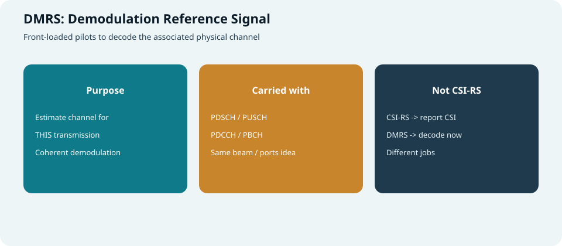

*图：DMRS 服务于“这一次”相干解调，不是给 CSI 上报用的主探针*

---

## DMRS 是什么

| 要点 | 说明 |
| --- | --- |
| **角色** | 与数据/控制 **同传** 的已知导频，供接收机估 **等效信道** 后做相干解调 |
| **绑定关系** | 与对应物理信道共享类似的端口/预编码假设（“跟数据走同一条路”） |
| **设计倾向** | **前置（front-loaded）**：尽早出现，便于低时延早解码 |
| **可扩展** | 可加 **additional DMRS**，对抗高速/长时隙信道变化 |

> 口诀：**CSI-RS 帮你选路（调度/波束/MCS）；DMRS 帮你开车（解这一包）。**

---

## DMRS vs CSI-RS（务必分清）

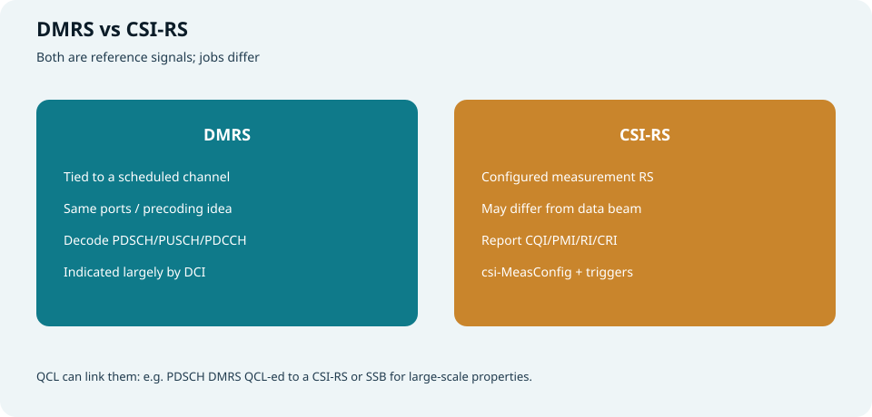

*图：解调 vs 测量上报——都是参考信号，任务不同*

| 维度 | **DMRS** | **CSI-RS** |
| --- | --- | --- |
| 目的 | **解调当前信道** | **测量并上报 CSI / 波束** |
| 出现时机 | 随 PDSCH/PUSCH/PDCCH… 调度出现 | 按 `csi-MeasConfig` 周期/半持续/非周期 |
| 与数据关系 | 通常与数据 **同波束/同预编码语义** | 可以独立配置，未必等于本次数据波束 |
| 输出 | 信道估计 → 解 TB / DCI | CQI/PMI/RI/CRI/L1-RSRP… → UCI |
| 指示 | RRC 半静态 + **DCI 天线端口等** | RRC + MAC CE / DCI CSI-request |

二者可通过 **QCL/TCI** 关联：例如 PDSCH DMRS 与某 CSI-RS/SSB 准共址，复用大尺度信道特性（见 [QCL 专题](antenna-port-qcl-resource-grid.html)）。

---

## DMRS 出现在哪些信道

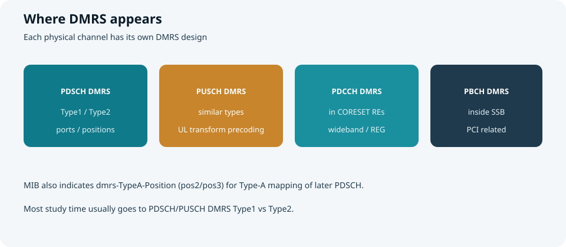

*图：PDSCH / PUSCH / PDCCH / PBCH 各有一套 DMRS*

| 信道 | DMRS 作用 | 学习重点 |
| --- | --- | --- |
| **PDSCH** | 解下行共享数据 | Type1/2、附加位置、端口、CDM |
| **PUSCH** | 解上行共享数据 | 类 Type1/2；还可叠加 **变换预编码** 场景差异 |
| **PDCCH** | 解 DCI | 落在 CORESET 的 DMRS RE；与 TCI 相关 |
| **PBCH** | 解 MIB | SSB 内 DMRS，与 PCI 等相关 |

---

## PDSCH / PUSCH 与 DMRS：二维时频关系

核心关系一句话：

> **PDSCH/PUSCH 是一整块被调度的时频“地皮”；DMRS 是嵌在这块地皮里的导频钉子。**  
> 钉子占掉的 RE **不再承载 TB 数据**；接收端先钉（估信道），再解周围的数据砖。

### 二维表格怎么读

把 **1 个 PRB × 1 个 slot** 画成格子：

- **横轴**：OFDM 符号 0…13  
- **纵轴**：子载波 0…11（一个 PRB）  
- **青色**：数据 RE（PDSCH 或 PUSCH 的 UL-SCH）  
- **橙色 D**：DMRS 导频 RE  
- **深色 R**：DMRS 符号上因 CDM 组“无数据”而 **保留、不映射业务数据** 的 RE（示例里 `NumCDMGroupsWithoutData=2` 的直觉）

示例参数（与常见 toolbox 演示一致，便于对照）：

```text
MappingType = A
SymbolAllocation = [0, 14]          # 整 slot
DMRSConfigurationType = 1           # Type1 comb
DMRSTypeAPosition = 3               # DMRS 在 symbol 3
DMRSAdditionalPosition = 0          # 不再追加其它 DMRS 符号
NumCDMGroupsWithoutData = 2
NumLayers = 4                       # 对应 port 1000..1003 一类示意
```

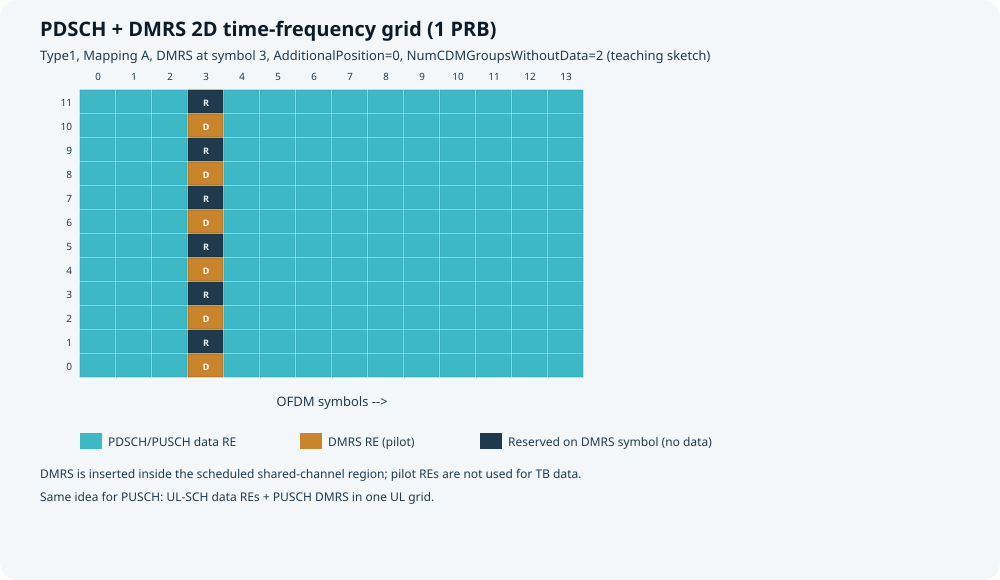

*图：整片是共享信道调度区域；symbol 3 插入 Type1 DMRS（及 reserved RE）*

### 多端口时：同一 slot，不同 port 的 DMRS 格子

4 层时，可看成 4 张叠在同一时频框架上的“端口视图”（与 MATLAB 分 port 作图同类）：

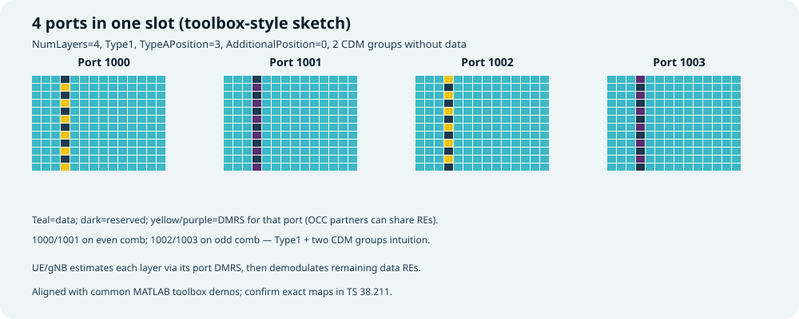

*图：都在 symbol 3 列上出现导频；偶/奇梳齿区分 CDM 组，颜色区分同组内端口（OCC）*

对照参考（toolbox 原图风格）：

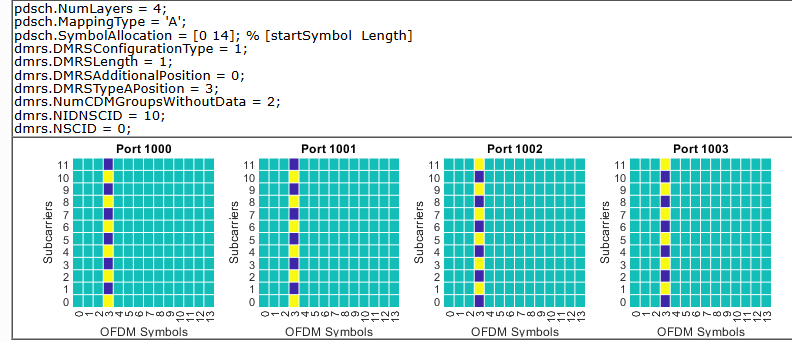

*图：Port 1000–1003；青绿色为数据，黄/紫列为 DMRS（配置同 Type1 + TypeA pos=3）*

### 关系说明（PDSCH 与 PUSCH 通用）

| 问题 | 答案 |
| --- | --- |
| DMRS 在信道外面吗？ | **不在。** 它在 PDSCH/PUSCH **调度到的 RB/符号内部**。 |
| 数据会不会写在 DMRS RE 上？ | **不会。** 速率匹配/映射会 **避开** 导频（及 without-data 的保留 RE）。 |
| 先干什么？ | 接收端用 DMRS 估 **本层/本端口等效信道**，再解数据 RE。 |
| PDSCH vs PUSCH | **同构关系**：一个服务下行 TB，一个服务上行 TB；图案由各自 `dmrs-Type`/DCI 端口决定。 |
| 和 CORESET/PDCCH DMRS？ | PDCCH DMRS 在 **CORESET** 里解 DCI；PDSCH DMRS 在 **数据地皮** 里解 TB——层次不同。 |

**接收流水（共享信道）：**

```text
调度到的时频网格
   ├── DMRS RE  → 信道估计（按 port/layer）
   ├── reserved → 不承载 TB
   └── data RE  → 均衡 + 解调 + 解码 → TB
```

> 开销直觉：DMRS（+ reserved）越多，数据 RE 越少，但高速/多层时估计更稳——这就是 `AdditionalPosition`、双符号、CDM groups without data 等旋钮存在的理由。

下文继续把 **Type1/Type2 图案** 与 **附加位置** 拆开看。

---

## PDSCH / PUSCH DMRS：Type 1 vs Type 2

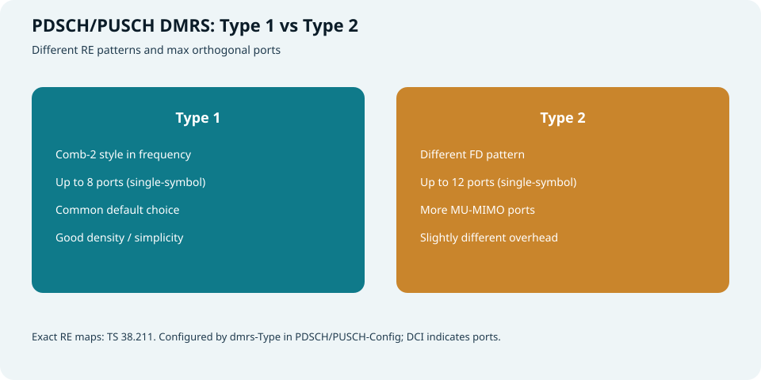

*图：频域图案不同，可支持的正交端口数不同*

### 一眼看清：二维时频里的 Type1 / Type2

和上一节相同的读法——**整张是 PDSCH/PUSCH 调度地皮**，差别只在 **DMRS 那一列怎么“钉钉子”**：

- **横轴**：OFDM 符号 0…13  
- **纵轴**：1 个 PRB 的 12 子载波  
- **青色**：数据 RE  
- **D**：该 Type 图案下的 DMRS RE  
- **R**（Type1 示意）：DMRS 符号上 reserved、不映射数据的 RE  

示例仍取：`AdditionalPosition=0`，DMRS 只出现在 **symbol 3** 一列，便于和前面的二维关系图直接对照。

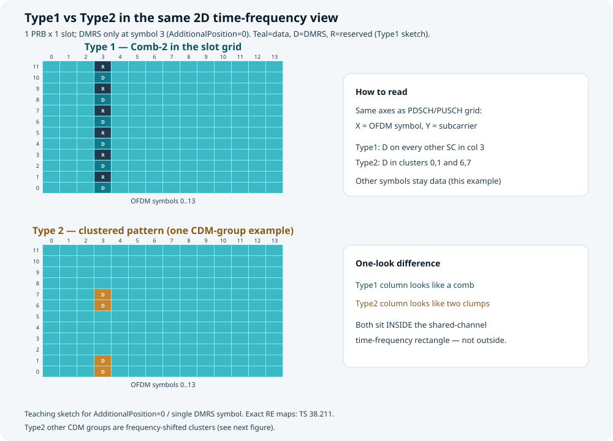

*图：同一张 PRB×slot 表上对比——Type1 在 symbol 3 呈梳状；Type2 在 symbol 3 呈两簇*

| | **Type 1** | **Type 2** |
| --- | --- | --- |
| **在二维表上的观感** | symbol 3 列里 **隔一个子载波一个 D**（Comb-2） | symbol 3 列里 **两两成簇**（示例 0,1 与 6,7） |
| **每 PRB 该图案 RE 数** | 典型 **6** 个 | 每 CDM 组图案典型 **4** 个 |
| **单符号最大正交端口（典型）** | 约 **8** | 约 **12** |
| **选型直觉** | 默认、实现常见 | **MU-MIMO 要更多端口** 时更有利 |
| **配置** | `dmrs-Type = type1` | `dmrs-Type = type2` |

> 精确映射以 **TS 38.211** 为准；上图是教学示意。关键是：两种 Type **都嵌在同一块共享信道时频矩形里**，不是另画一张“体外”资源。

### Type 2 为何能撑更多端口？

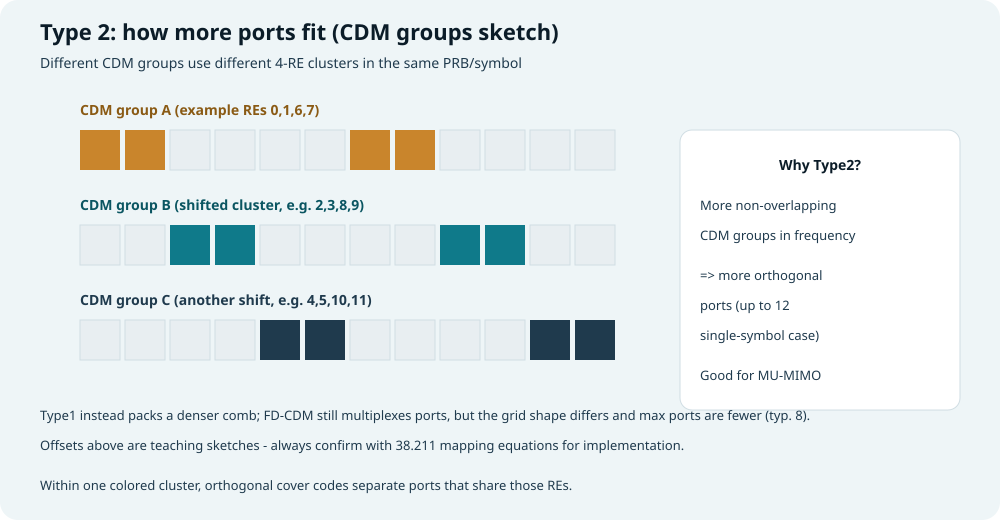

*图：不同 CDM 组占用错开的 4-RE 簇，再在簇内用正交码分端口*

读法：

1. **不同 CDM group** → 频域上用 **不同的 4-RE 簇**（互相错开）  
2. **同一簇内** → 多个端口靠 **正交覆盖码（OCC）** 共享这些 RE  
3. 错开的组更多 → 正交端口预算更大（所以 Type2 常提到最高约 12 port）

Type1 则是 **梳齿更密** 的结构 + FD-CDM；端口也能码分，但网格形状不同，单符号端口上限通常低于 Type2。

### 和小例子对照

在 **symbol 3 那一列**（其它列为数据）竖着读子载波：

```text
k:  0 1 2 3 4 5 6 7 8 9 10 11
Type1: D R D R D R D R D R D  R     ← 梳状（D 与 reserved 交错示意）
Type2: D D . . . . D D . . .  .     ← 两簇（一组 CDM 示例）
```

放回二维表就是：**整列钉在 slot 里的第 3 个符号上**，与上一节 PDSCH+DMRS 总图同一坐标系。

**工程选择：**

- 一般业务、实现简单 → **Type1**  
- 小区要硬上更多正交 DMRS 端口做 MU → 倾向 **Type2**（并配合双符号等）  
- 无论哪种，**具体用哪几个端口** 仍由 **DCI antenna port 表** 当面指定  

双符号 DMRS 可在时域再扩一维，进一步增加端口/鲁棒性（开销更大）。

---

## 时域：前置 DMRS + 附加位置

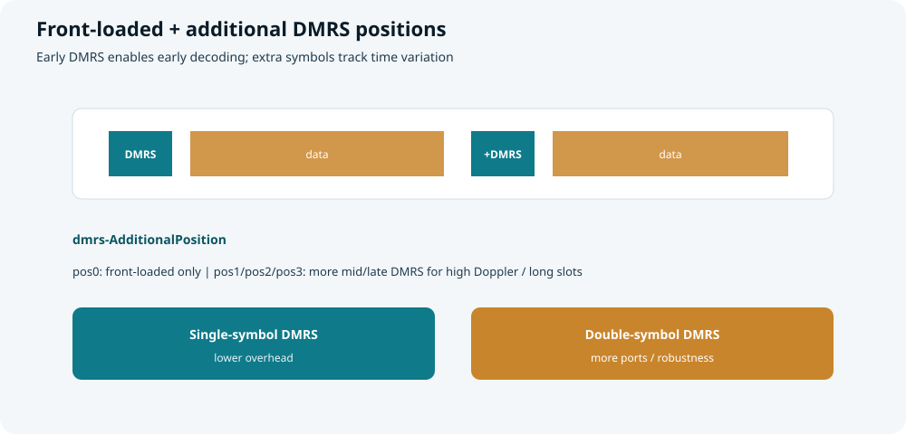

*图：靠前的 DMRS 利于早解；中间再插 DMRS 跟踪时变*

### Front-loaded（前置）

- DMRS 尽量靠近调度时隙 **靠前的符号**  
- UE 可尽早估信道，开始解 PDSCH → **低时延**  
- 与 NR “自包含 / 快速 ACK” 设计相契合  

### `dmrs-AdditionalPosition`

| 取值直觉 | 含义 |
| --- | --- |
| **pos0** | 主要靠前置 DMRS |
| **pos1 / pos2 / pos3** | 在更靠后的符号再加 1～多个 DMRS |

**何时加更多：**

- 高多普勒（高速移动）  
- 很长的 PDSCH 时长  
- 信道在一个 slot 内变化明显  

代价：导频 RE ↑ → 数据 RE ↓ → 吞吐开销 ↑。

### 单符号 vs 双符号

| | **Single-symbol** | **Double-symbol** |
| --- | --- | --- |
| 结构 | 一个时域符号承载该次 DMRS 图案 | 连续两个符号 |
| 优点 | 开销较小 | 更多端口 / 更好估计 |
| 代价 | 端口能力较弱一些 | 开销更大 |

由 RRC（如 `maxLength`）等约束，DCI 在允许集合内选具体端口配置。

### 与 MIB 的衔接：`dmrs-TypeA-Position`

MIB 中的 **`dmrs-TypeA-Position` = pos2 / pos3**：

- 指示 **Type A** 映射下，PDSCH DMRS 的第一个符号位置相关语义  
- 在 UE 尚未拿到完整专用配置、解 SIB1 等早期 PDSCH 时尤其关键  
- 详见 [5G SIBs · MIB](5g-sibs.html)

另有 **Type A / Type B** 时域映射分类：与 PDSCH 起始符号、时长分配方式相关（TDRA 表）；Type B 更偏“灵活起始的短 PDSCH”。

---

## 端口、CDM 与加扰（组成直觉）

| 概念 | 含义 | 作用 |
| --- | --- | --- |
| **Antenna port** | DMRS 端口编号 | 区分层 / 用户正交导频 |
| **CDM group** | 码分复用组 | 同组端口共享 RE、靠正交码分离 |
| **n_SCID / scrambling** | 加扰身份 | 降低小区间/用户间导频干扰 |
| **PTRS**（相关） | 相位跟踪参考 | 高阶调制 / FR2 相位噪声；常与 DMRS 端口关联配置 |

DCI 的 **antenna port(s)** 字段（再配合 RRC 表格）告诉 UE：

- 用哪些 DMRS 端口  
- 几个 CDM group 有数据  
- 是否双符号等  

读日志顺序：`dmrs-Type` → `additionalPosition` → DCI ports 行 → 实际 RE。

---

## 配置链：MIB → RRC → DCI

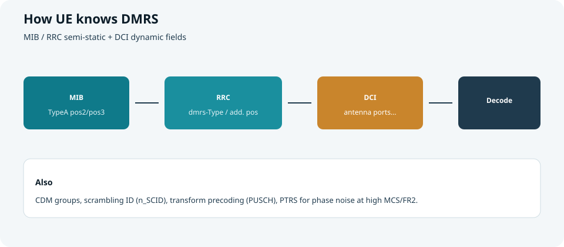

*图：半静态定框架，DCI 定这一次用哪几个端口*

| 层级 | 配什么 |
| --- | --- |
| **MIB** | `dmrs-TypeA-Position`（早期 Type A） |
| **RRC**（`pdsch-Config` / `pusch-Config`） | `dmrs-Type`、`dmrs-AdditionalPosition`、`maxLength`、加扰 ID 池、PTRS 相关等 |
| **DCI** | 天线端口表项、有时与 PTRS、速率匹配交互 |
| **TCI / QCL** | DMRS 的大尺度假设跟谁（SSB / CSI-RS） |

PUSCH 若启用 **transform precoding（DFT-s-OFDM）**，DMRS 结构与 CP-OFDM 情形有差异（规范分情形描述）——排障时先看有没有变换预编码。

---

## PDCCH DMRS / PBCH DMRS（简表）

### PDCCH DMRS

| 要点 | 说明 |
| --- | --- |
| 位置 | CORESET 内固定比例的 RE（与 REG 结构绑定） |
| 作用 | 解 DCI 前的信道估计 |
| 配置感 | 与 CORESET 的 `precoderGranularity`、TCI 强相关 |
| 详见 | [CORESET 与 Search Space](coreset-search-space.html)、[PDCCH 与 PDSCH](pdcch-pdsch.html) |

### PBCH DMRS

| 要点 | 说明 |
| --- | --- |
| 位置 | SSB 的 PBCH 符号内 |
| 作用 | 解 MIB |
| 序列 | 与 **PCI**、SSB 索引等相关 |
| 详见 | [帧结构与 SSB](frame-structure-ssb.html)、[小区搜索](cell-search.html) |

---

## 小例子（串起来）

**例 1：普通下行数据**

```text
RRC: dmrs-Type = Type1, additionalPosition = pos1
DCI: 调度 PDSCH + antenna ports = 两层对应端口
UE: 在前置与附加符号上收 DMRS → 估 H → 解两层 PDSCH → 回 ACK
```

**例 2：高速移动**

```text
信道时变快 → 把 additionalPosition 提到 pos2/pos3
导频更密 → 估计更跟得上 → 开销换可靠性
```

**例 3：和 CSI-RS 分工**

```text
周期 CSI-RS → UE 报 PMI/CQI（选预编码与 MCS 策略）
某 TTI 的 PDSCH DMRS → 按实际预编码估信道并解调
两者 QCL 到同一 SSB/CSI-RS 时，可少估大尺度参数
```

---

## 排障抓手

| 现象 | 可检查 |
| --- | --- |
| PDCCH 盲检差 | CORESET TCI、PDCCH DMRS 假设 |
| PDSCH CRC 常失败但控制还行 | DMRS type/端口解错、附加位置与高速不匹配、QCL 错 |
| 高速场景差 | `dmrs-AdditionalPosition` 是否过稀 |
| MU-MIMO 端口不够 | 是否该用 Type2 / 双符号 |
| 早期 SIB1 解不出 | MIB `dmrs-TypeA-Position` 与实际是否一致 |

---

## 快速自测

1. DMRS 与 CSI-RS 目的有何不同？能否互相替代？  
2. 在一张 PRB×slot 二维表上，数据 RE、DMRS RE、reserved RE 各表示什么？  
3. Type1 与 Type2 在一个 PRB 里的 RE 图案一眼差在哪？谁更利于更多正交端口？  
4. `dmrs-AdditionalPosition` 解决什么问题？代价是什么？  
5. MIB 的 `dmrs-TypeA-Position` 影响哪类早期接收？  
6. DCI 的 antenna ports 字段在 DMRS 语境下告诉 UE 什么？  
7. PDSCH DMRS 与 PUSCH DMRS 关系为何说是“同构”？和 PDCCH DMRS 差在哪一层？

> 一句话：**DMRS 是跟数据绑在一起的解调导频——Type 定图案，位置定能否跟上时变，端口由 DCI 点名；CSI-RS 则负责更早的测量与上报。**

## 相关专题

- [PDCCH 与 PDSCH](pdcch-pdsch.html)
- [PUCCH 与 PUSCH](pucch-pusch.html)
- [NR CSI-RS](nr-csi-rs.html)
- [Antenna Port / QCL / Resource Grid](antenna-port-qcl-resource-grid.html)
- [CORESET 与 Search Space](coreset-search-space.html)
- [5G SIBs](5g-sibs.html)
- [小区搜索](cell-search.html)
