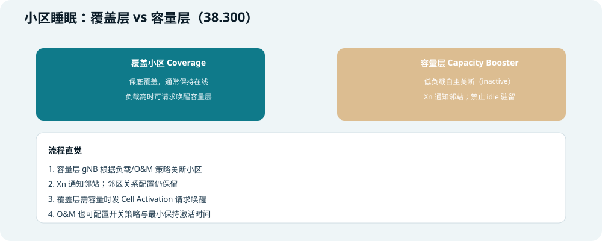
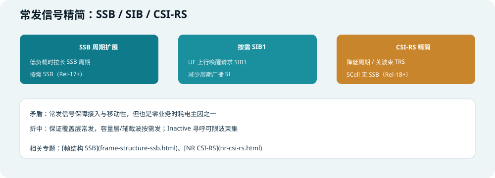
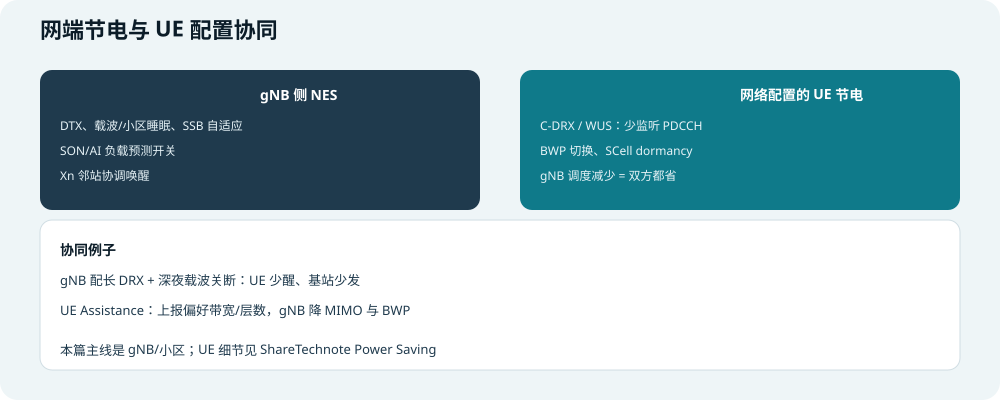

## 本篇要解决什么

5G 基站（**gNB**）的电费与碳排，是运营商 OPEX 里很大一块。NR 容量更大、频段更宽、天线更多，**空口没业务时也不能像关灯一样全停**——还要保同步、接入、寻呼、移动性。

本篇聚焦 **网络侧（小区 / 基站）节电功能**：gNB 在 **低负载或无业务** 时如何 **少发射、少开通道、关载波、睡小区**，以及和 **UE 节电配置** 如何配合。

对照：**TS 38.300** 第 15.4 节（系统内节能）、**38.331**（DRX/BWP 等）、厂商 **SON/AI 节能** 实践。  
相关：[NR Power Control](nr-power-control.html)（功率与路损）、[帧结构 SSB](frame-structure-ssb.html)、[NR CSI-RS](nr-csi-rs.html)、[NR RRC Reconfiguration](nr-rrc-reconfiguration.html)、[5G NR 架构](5g-nr-architecture.html)。

> 说明：**UE 终端省电**（DRX、BWP、WUS 等）本篇会讲 **网络如何配置与协同**；UE 侧机制细节另见延伸阅读 [ShareTechnote — Power Saving](https://sharetechnote.com/html/5G/5G_PowerSaving.html)。


*图：电耗从哪来、NES 从哪省*

---

## 先建立两个视角

### 谁在省电

| 视角 | 本篇重点 | 典型手段 |
| --- | --- | --- |
| **gNB / 小区（网络侧）** | **本篇主线** | DTX、载波关断、小区睡眠、SSB 精简 |
| **UE（终端侧）** | 网络 **配置** 与协同 | C-DRX、BWP、SCell dormancy、WUS |

两边 **不是一回事**：gNB 关载波是 **少发电**；UE DRX 是 **少收/少监听**——但 **gNB 配长 DRX、少调度**，基站侧也会 **少发 PDCCH/PDSCH**，形成 **双赢**。

### 节电 vs 体验

| 省得猛 | 可能代价 |
| --- | --- |
| 深睡小区 | 唤醒时延、突发吞吐爬坡慢 |
| 拉长 SSB 周期 | 搜网/重选稍慢 |
| 关辅载波 | 峰值速率下降 |
| 减 MIMO 层数 | 边缘频效下降 |

运营策略要在 **节能 KPI** 与 **覆盖、时延、投诉** 之间折中，常靠 **SON 策略 + 分时段**（如凌晨激进、白天保守）。

---

## 节电手段按时间尺度


*图：符号 → 时隙 → 载波 → 小区，越深睡省电越多、唤醒越慢*

| 尺度 | 名称（业界常用） | 做什么 | 唤醒速度 |
| --- | --- | --- | --- |
| **符号** | 符号关断、微睡眠 | 无数据符号不发射 | 极快 |
| **时隙** | Cell DTX | 无调度时隙不发射业务波 | 快 |
| **载波** | 载波关断、SCell dormancy | 关 CA 辅载波 / SCell | 中等 |
| **通道** | 通道/MIMO 关断 | 关部分天线链、降层数 | 中等 |
| **小区** | 小区睡眠 / 深度睡眠 | 整小区 inactive | 较慢，需 Xn 协调 |

**睡眠分级（工程模型直觉）：**

```text
微睡眠 micro sleep  → 符号级间隙，几乎即时恢复
轻睡眠 light sleep  → 关部分 RF/通道，毫秒~几十毫秒级恢复
深睡眠 deep sleep   → 小区/载波整段关，恢复最慢，省电最多
```

---

## 功能 1：符号关断与 Cell DTX


*图：有调度才发；灰符号为关断*

### 符号关断（Symbol Shutdown）

**做什么：** 在某个 OFDM **符号** 上没有要发的 PDSCH/PDCCH（及可关的业务波）时，**不驱动功放** 发该符号。

**例子：** 某 slot 只在 symbol 2–8 有下行调度，其余符号可关断 → PA 只在有业务的符号工作。

### Cell DTX（小区不连续发射）

**做什么：** 在 **连续多个时隙无下行调度** 时，gNB **整体进入发射静默**（仍可能保留必须的常发/监听）。

**与 UE DTX 区别：** UE DTX 是终端不发上行；**Cell DTX** 是 **基站侧** 下行不连续发射。

### 限制（为何不能一直睡）

| 仍可能占用空口/射频 | 原因 |
| --- | --- |
| **SSB** | UE 同步、小区选择 |
| **寻呼 PDCCH** | Idle/Inactive UE |
| **PRACH 监听** | 随机接入 |
| **周期 CSI-RS/TRS** | 已连接 UE 测量 |
| **SI 广播** | SIB1 等系统消息 |

> 零业务时 gNB 仍耗电，很大一部分是 **「为了让人能随时接入」的常发信号」**——后续 SSB/SIB 按需化就是在啃这块。

---

## 功能 2：通道关断与载波关断


*图：减天线 / 关辅载波*

### 通道关断 / MIMO 睡眠

**做什么：** 降低 **同时激活的发射通道数** 或 **MIMO 层数**。

| 场景 | 例子 |
| --- | --- |
| 低负载 | 64T 阵列只用 16T 发射 |
| 近点用户 | 2 层 MIMO 足够，关多余通道 |
| 波束场景 | 关未用波束对应的面板 |

**省电原理：** 功放与数传链路与 **激活通道数** 强相关；少通道 = 少耗电。

### 载波关断（Carrier Shutdown）

**做什么：** 在 **载波聚合（CA）** 或多载波部署中，**关掉非锚定载波**，只留 **主载波（PCell/锚定载波）** 保底。

**例子：**

```text
白天：n78 + n41 双载波 CA，满流量
凌晨 2 点：业务 < 阈值
  → gNB 关 n41 辅载波 RF 与基带
  → 只留 n78 单载波
早高峰前：SON 预测或覆盖层请求 → 提前唤醒 n41
```

### SCell Dormancy（与 CA 相关）

**做什么（网络配置 UE）：** 辅小区 **SCell** 进入 **休眠**——UE **不监听** 该 SCell 上 PDCCH（测量可能仍进行）。gNB 对应 **少发辅载波业务**，并常配合 **载波关断**。

---

## 功能 3：小区睡眠（Cell Sleep）— 3GPP 系统内节能



*图：覆盖层保底 + 容量层可关；38.300 15.4.2.1*

**TS 38.300** 定义了 **系统内节能（Intra-system Energy Saving）** 的典型场景：

### 覆盖层 vs 容量层

| 角色 | 直觉 | 节电行为 |
| --- | --- | --- |
| **Coverage（覆盖小区）** | 大宏站、保底覆盖 | 通常 **保持激活** |
| **Capacity Booster（容量层）** | 补盲、吸峰 | 低负载可 **自主关断（inactive）** |

### 关断时发生什么

1. **拥有容量层的 gNB** 根据 **负载** 或 **O&M 策略** 决定 cell switch-off  
2. 通过 **Xn** 通知邻站：某小区进入 inactive  
3. **邻区关系等配置仍保留**（不是删站）  
4. 关断期间可 **禁止 Idle UE 驻留** 该小区，**禁止切入 HO** 到该小区  
5. **覆盖层** 若需容量，通过 **Cell Activation** 流程请求唤醒  
6. **O&M** 也可直接开关，并配置 **最小保持激活时间** 等策略  

**初学者故事：**

```text
写字楼楼顶有一个「容量小站」专门吸峰
半夜没人 → 小站自动睡眠
楼下宏站（覆盖层）继续保底 4G/5G 覆盖
早上 7 点流量预测到要涨 → 宏站通过 Xn 喊小站醒来
或 O&M 定时 6:30 预唤醒
```

### 载波关断 vs 小区睡眠

| | 载波关断 | 小区睡眠 |
| --- | --- | --- |
| 粒度 | 多载波中的一条 | 整个小区/扇区 |
| 典型场景 | CA 辅载波 | 异站容量层 |
| 恢复 | 相对快 | 可能更慢（深睡） |

---

## 功能 4：常发信号精简（SSB / SIB / CSI-RS）



*图：降低「永远在线」广播的开销*

### SSB 周期与按需 SSB

| 手段 | 说明 |
| --- | --- |
| **拉长 SSB 周期** | 低负载时 20 ms → 80/160 ms（在规范允许范围内） |
| **按需 SSB（On-demand SSB）** | Rel-17+：辅载波/部分场景 **非常驻 SSB**，需要时再发 |
| **SSB 波束关断** | 多波束场景下关掉 **无业务波束** 的 SSB |

### 按需 SIB1 / SI

**问题：** 周期 **SIB1** 广播耗电，但凌晨几乎无新 UE 接入。

**方向（Rel-18/19 等）：** UE 用 **上行唤醒信号** 请求 SIB1；gNB **按需发 SI**，减少周期空发。

### CSI-RS / TRS 精简

- 降低 **CSI-RS 测量** 周期或关 **非必要波束** 的 TRS  
- **ZP/NZP** 配置与业务负载联动（见 [NR CSI-RS](nr-csi-rs.html)）  
- **SCell 无常驻 SSB**（Rel-18+）进一步省辅载波同步开销  

### Inactive 寻呼优化（网络侧）

规范允许 gNB 对 **部分 Inactive UE** 只在 **有限 SSB 波束集** 上寻呼；失败再扩展波束重发——**减少多波束全网寻呼** 的发射次数。

---

## 功能 5：BWP 与下行功率（与节电相关）

| 手段 | 网络侧效果 |
| --- | --- |
| **窄 BWP 调度** | 同时间只激活部分带宽 → 基带与 RF 省电 |
| **BWP 切换** | 无大业务时切 **小 BWP**（UE 也省，见 Power Saving） |
| **下行功率 / EPRE 下调** | 近点、低负载时降低发射功率（与 [功率控制](nr-power-control.html) 下行规划相关） |

---

## 网端与 UE 协同节电



*图：NES + DRX/BWP 双向减负*

### 网络给 UE 配的节电（间接帮 gNB 省电）

| 配置 | gNB 侧收益 |
| --- | --- |
| **C-DRX** | UE 在 Sleep 期 **不监听 PDCCH** → 可不发下行调度 |
| **WUS（Wake-up Signal）** | 无数据时 UE 连 DRX On 也不醒 → 更少无效 PDCCH |
| **SCell dormancy / Dormant BWP** | 辅载波、辅 BWP 静默 |
| **PDCCH skipping / 监测适配** | 减少 CORESET 盲检次数（Rel-16+） |

### UE Assistance Information（UE 帮网络决策）

UE 可上报 **偏好 DRX 周期、最大带宽、最大层数、最小 K0/K2** 等 → gNB **降 MIMO、缩 BWP、拉长调度间隔** → **双方省电**。

### SON / AI 节能（运维层）

| 输入 | 输出 |
| --- | --- |
| 历史流量、话务预测 | 何时载波关断、何时预唤醒 |
| 邻区负载 | 是否 Cell Activation |
| KPI 门限 | 节能 vs 掉话/时延折中 |

业界实践常报 **10%–30%** 量级节能（与组网、策略相关），**AI 预测** 可减少「关早了/醒晚了」。

---

## 端到端例子：商圈宏站 + 室分容量层

```text
【组网】
  宏站 gNB-A：n78 覆盖层（Coverage）
  室分 gNB-B：n78 容量层（Capacity Booster），与 A 有 Xn

【凌晨 1:00 低负载】
  B 站：载波/小区睡眠，Xn 通知 A
  A 站：符号关断 + Cell DTX 活跃；SSB 周期拉长
  辅载波 n41（若有）关断

【凌晨 连接态用户极少】
  剩余用户：长 DRX；gNB 几乎无 PDSCH
  常发：SSB + 必要寻呼 + PRACH 监听

【早 7:00 预测流量上升】
  A 向 B 发 Cell Activation
  B 唤醒 → 恢复 CA / 全 MIMO
  8:00 前完成，避免早高峰掉速

【用户感知】
  深夜刷视频：单载波够用，略降峰值但省电
  早高峰：容量层已醒，体验与平时一致
```

---

## 功能对照总表

| 功能 | 粒度 | 主要省电点 | 规范/来源 |
| --- | --- | --- | --- |
| 符号关断 | 符号 | PA 不工作符号 | 厂商 NES |
| Cell DTX | 时隙 | 无调度不发波 | NES / Rel-18 WI |
| 通道/MIMO 关断 | 天线/层 | 少通道少功放 | 厂商 NES |
| 载波关断 | 载波 | 关辅载波 RF | LTE 继承 + NR CA |
| SCell dormancy | SCell | UE 不监辅载波 PDCCH | 38.331 Rel-16 |
| 小区睡眠 | 小区 | 容量层 inactive | 38.300 15.4.2.1 |
| SSB/SIB 自适应 | 广播 | 减常发 | Rel-17/18/19 |
| C-DRX / WUS | UE 配置 | 少无效调度 | 38.331 / 38.213 |
| BWP 缩小 | 带宽 | 基带与 RF | 38.331 |

---

## 排障与投诉抓手

| 现象 | 可能原因 |
| --- | --- |
| 凌晨速率骤降 | 载波关断未预唤醒 |
| 早高峰初期慢 | Cell Activation 太晚 |
| 边缘用户掉话 | 容量层睡了只剩远点单站 |
| 切换失败增多 | 目标小区 inactive 未唤醒 |
| 新 UE 搜网慢 | SSB 周期过长 / 按需 SSB 配置不当 |
| 节能 KPI 好但投诉多 | 策略过激，需调门限或分场景 |

---

## 快速自测

1. gNB 节电与 UE DRX 分别主要省哪一侧的电？  
2. 符号关断与小区睡眠的粒度有何不同？  
3. 38.300 里 Coverage 与 Capacity Booster 在节能里各扮演什么角色？  
4. Cell Activation 通过什么接口在站间协调？  
5. 为何零业务时 gNB 仍耗电？  
6. 载波关断与 SCell dormancy 如何配合？  
7. 按需 SSB/SIB1 想解决什么问题？  
8. 深睡眠相比微睡眠的权衡是什么？

---

## 一句话

**NR 基站节电 = 在保覆盖与接入的前提下，按负载从符号到小区逐级「少发、少通道、关载波、睡容量层」，并用 Xn/O&M/SON 协调唤醒；与 UE DRX/BWP 协同，让空口在没业务时尽量安静。**

### 站内延伸

- [帧结构 SSB](frame-structure-ssb.html)  
- [NR CSI-RS](nr-csi-rs.html)  
- [NR RRC Reconfiguration](nr-rrc-reconfiguration.html)  
- [5G NR 架构](5g-nr-architecture.html)  

---

## 延伸阅读

- [ShareTechnote — 5G Power Saving](https://sharetechnote.com/html/5G/5G_PowerSaving.html)（UE 侧机制与 RRC 参数）  
- TS 38.300 **15.4** — Network Energy Savings for NR  
- TS 38.864 — BS power consumption model（睡眠状态与相对功耗）

建议阅读顺序：本篇建立 gNB 侧地图 → Power Saving 专题看 UE 协同 → 38.300 15.4 查小区睡眠流程。
