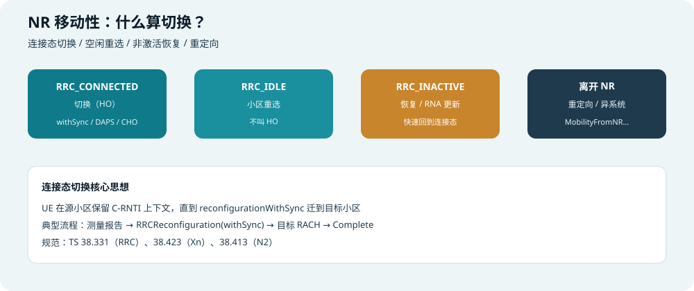
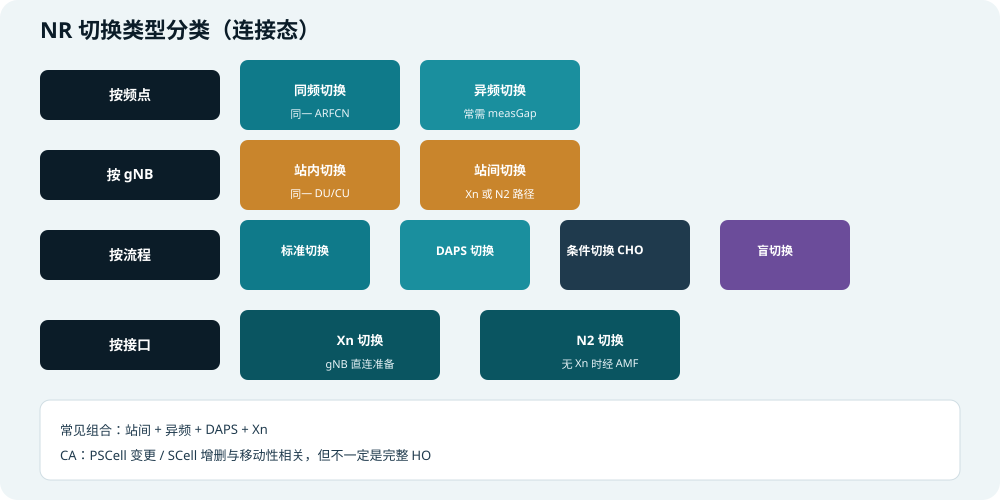
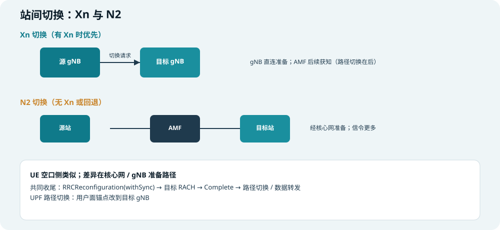
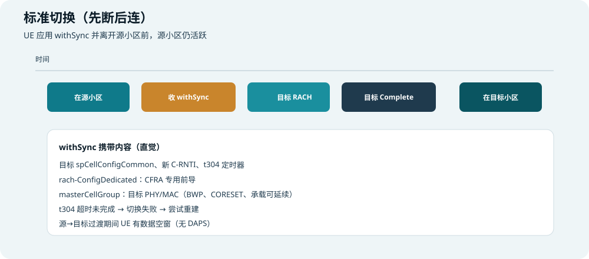
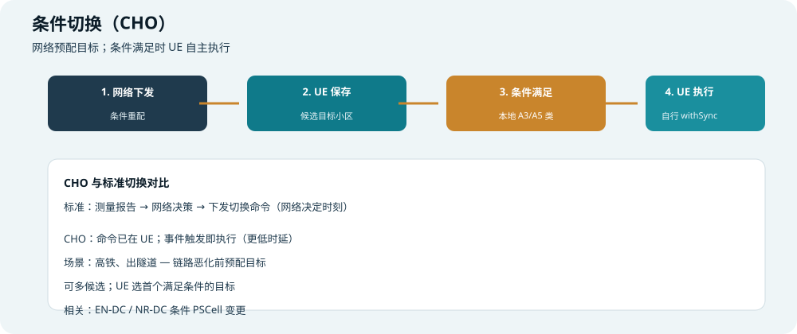
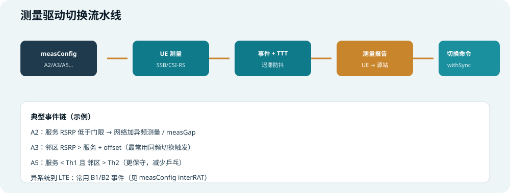
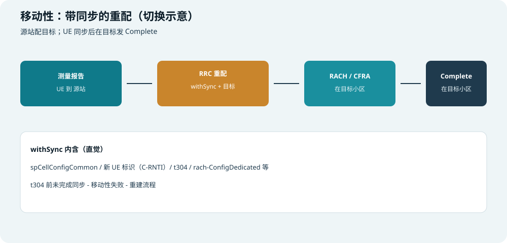
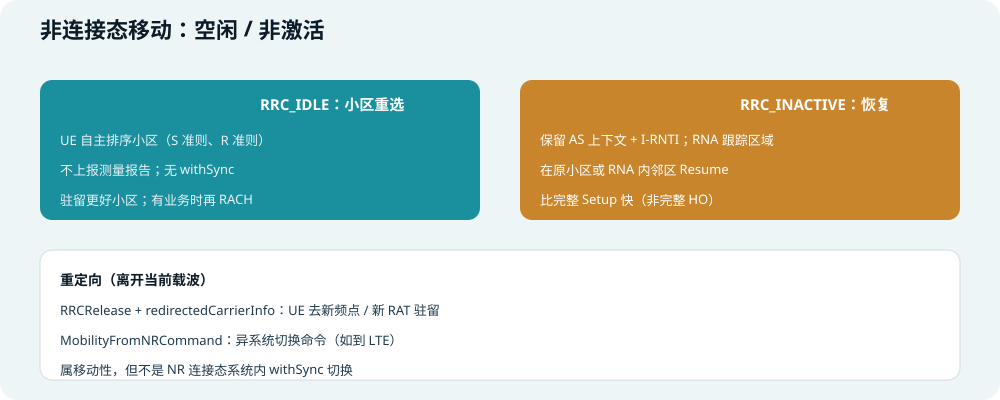
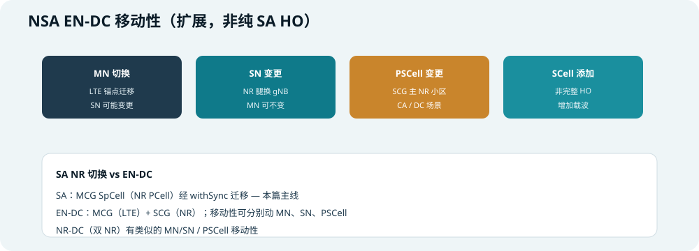
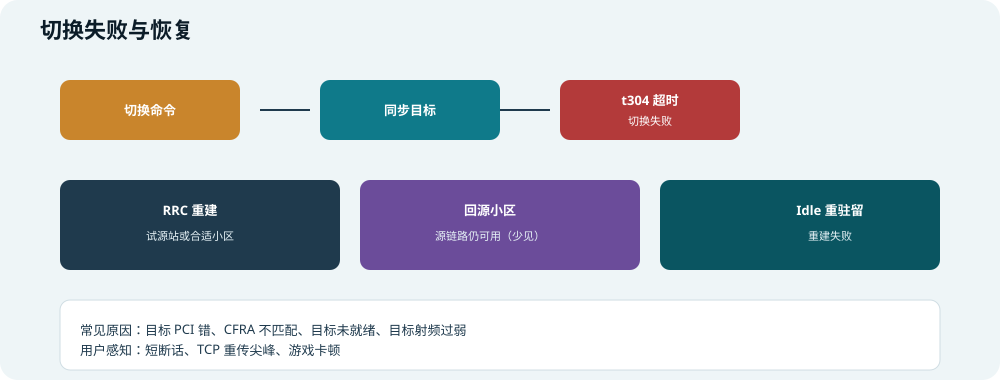

## 本篇要解决什么

「切换」在 NR 里不是单一流程，而是一族 **移动性（Mobility）** 机制的总称。

初学者常把下面几件事混成一锅：

| 你可能听到的词 | 是不是「连接态切换 HO」 |
| --- | --- |
| 小区 **重选**（Idle 换驻留小区） | **不是** —— UE 自主，无 withSync |
| **Resume**（Inactive 快速恢复） | **不是完整 HO** —— 保留上下文，走 Resume 流程 |
| **RRCReconfiguration + withSync** | **是** —— 经典 NR 连接态切换 |
| **DAPS / CHO** | **是 HO 的增强变体** |
| **重定向 / 异系统** | **移动性相关**，但不一定是 NR 内 HO |

本篇按 **类型 → 触发 → 消息流 → 例子 → 排障** 把 NR 切换讲透。

对照：**TS 38.331**（RRC 过程）、**38.423**（Xn）、**38.413**（N2/NG）、**38.300**（总览）。  
相关：[NR RRC Reconfiguration](nr-rrc-reconfiguration.html)、[随机接入](random-access.html)、[UE 开机搜网](ue-boot-network-search.html)、[NSA 与 SA](nsa-vs-sa.html)、[5G NR 架构](5g-nr-architecture.html)。



*图：连接态切换 vs 空闲重选 vs 非激活恢复 vs 离开 NR*

---

## 先建立坐标：什么叫「切换」

### 连接态切换的核心特征

在 **RRC_CONNECTED** 下，NR **切换** 通常意味着：

1. UE 已有 **C-RNTI** 与完整 AS 上下文（SRB/DRB、BWP、测量…）  
2. 网络下发 **RRCReconfiguration**，其中含 **`reconfigurationWithSync`**  
3. UE **同步到目标小区**（常伴随 **RACH**，优选 **CFRA 专用前导**）  
4. 在 **目标小区** 发 **RRCReconfigurationComplete**  
5. 用户面路径在核心网侧 **切换到目标 gNB**（Path Switch）

> 口诀：**切换 = 带着上下文换小区，不是从零 RRC Setup。**

### 与「重选」「Resume」对比

| 机制 | RRC 状态 | 谁决策 | 典型消息 | 比喻 |
| --- | --- | --- | --- | --- |
| **小区重选** | Idle（或部分场景） | **UE 自主** | 无 RRC HO 消息 | 路人自己挑更亮的店 |
| **RRC Resume** | Inactive → Connected | UE 发起，网络确认 | `RRCResumeRequest` / `RRCResume` | 会员卡还在，快速进门 |
| **切换** | Connected → Connected | **网络**（常基于测量） | `RRCReconfiguration(withSync)` | 服务员带你换到 VIP 桌，菜谱一起搬 |
| **RRC Setup** | Idle → Connected | UE 发起 | `RRCSetupRequest` / `RRCSetup` | 新客办会员卡 |

---

## 切换类型全景图



*图：按频点、gNB、流程、核心网接口四个维度分类（可组合）*

下面逐项展开。

---

## 类型 1：同频切换 vs 异频切换

### 1.1 同频切换

| 维度 | 说明 |
| --- | --- |
| **定义** | 源小区与目标小区在 **同一 NR 载波频率（同一 ARFCN）** |
| **测量** | 通常测 **SSB**（同频邻区 PCI 不同） |
| **典型事件** | **A3**（邻区比服务小区好出一个 offset） |
| **measGap** | 一般 **不需要**（同频可在业务间隙测邻区） |
| **例子** | 同一宏站两个扇区（PCI 101 → PCI 102），或室分多小区同频 |

**初学者例子：**

```text
你在 n78 3.5 GHz 上网，服务 PCI=101，RSRP=-95 dBm
邻区 PCI=102 同频，RSRP=-88 dBm
A3 配置：邻区 > 服务 + 3 dB，TTT=320 ms
→ 条件持续满足 → 测量报告
→ 网络下发 HO 到 PCI 102
```

### 1.2 异频切换

| 维度 | 说明 |
| --- | --- |
| **定义** | 源与目标 **ARFCN 不同**（如 n78 → n41，或同 band 不同载波） |
| **测量** | 需配置 **异频 measObject**；常测目标频点 SSB |
| **measGap** | 往往要开 **Gap**，在业务子帧里 **留空洞** 去测别的频点 |
| **典型事件链** | 常先 **A2**（服务变差）→ 开异频测量 → **A3/A5** 选目标 |
| **例子** | 5G 多层网：宏站 n78 覆盖边缘切到 n41 补盲 |

**初学者例子：**

```text
服务 n78 RSRP 跌到 -110 dBm（A2 触发）
网络下发异频 measObject（n41 频点列表）+ measGap
UE 在 Gap 里测 n41 邻区，发现 PCI=205 够好（A3/A5）
→ 测量报告 → 切换到 n41 PCI 205
```

**工程直觉：** 异频 HO **更慢、更耗测量开销**，但 **组网更灵活**（多频协同）。

---

## 类型 2：站内切换 vs 站间切换

### 2.1 站内切换

| 维度 | 说明 |
| --- | --- |
| **定义** | 源与目标在同一 **gNB**（或同一 CU 下的不同小区） |
| **核心网** | 常 **不涉及** gNB 变更，AMF/UPF 路径可能不变 |
| **准备** | gNB 内部协调，无 Xn/N2 腿（或极简） |
| **空口** | UE 仍走 **withSync + RACH + Complete** |
| **例子** | 同一基站 3 个扇区间切换 |

**用户感知：** 通常 **最快、最稳** 的一类 HO。

### 2.2 站间切换

| 维度 | 说明 |
| --- | --- |
| **定义** | 源 **gNB-A** → 目标 **gNB-B** |
| **核心网** | 需 **AMF** 参与；用户面 **Path Switch** 到目标 gNB |
| **数据转发** | 源 gNB 可 **临时转发** 下行数据到目标（减少丢包） |
| **空口** | UE 侧流程与站内 HO **看起来类似** |
| **例子** | 开车过区，从「朝阳区 gNB」切到「海淀区 gNB」 |

---

## 类型 3：Xn 切换 vs N2 切换（站间时走哪条路）



*图：gNB 直连准备 vs 经 AMF 准备；UE 空口侧相似*

| 路径 | 何时用 | 直觉 |
| --- | --- | --- |
| **Xn HO** | 源与目标 gNB 有 **Xn 接口** | gNB 之间直接 **Handover Request/ACK**，AMF 后续获知；信令路径短 |
| **N2 HO（NG HO）** | **无 Xn** 或策略选 N2 | 源 gNB → **AMF** → 目标 gNB 准备；信令多一跳 |

**对 UE 来说：** 两种路径下，空口通常都是 **RRCReconfiguration(withSync)**，差异主要在 **核心网与 gNB 的准备时序**。

**端到端步骤（简化）：**

```text
1. 源 gNB 决定 HO，向目标 gNB 准备（Xn 或 N2）
2. 目标 gNB 分配资源（C-RNTI、前导等）
3. 源 gNB 向 UE 发 RRCReconfiguration(withSync)
4. UE 在目标小区 RACH（CFRA）+ Complete
5. 目标 gNB 通知核心网 Path Switch
6. 源 gNB 释放 UE 上下文，停止转发
```

见 [5G NR 架构](5g-nr-architecture.html) 中 Xn/N2 角色。

---

## 类型 4：标准切换 vs DAPS vs 条件切换（CHO）

### 4.1 标准切换（先断后连）



*图：收到 withSync 后离开源小区，再在目标接入*

| 阶段 | UE 做什么 |
| --- | --- |
| HO 前 | 只在 **源小区** 收发 |
| 收到 withSync | 应用目标配置，**停止**用源配置收发 |
| RACH 目标 | 在目标小区接入（**t304** 计时开始） |
| Complete | 切换成功，仅在 **目标** 工作 |

**数据面影响：** 源→目标之间存在 **短间隙**（无下行缓存时可能 **TCP 抖一下**）。

**CFRA 例子：** withSync 里 `rach-ConfigDedicated` 给出 **专用前导 #5** → UE 不用竞争随机前导，加快接入。见 [随机接入](random-access.html) HO 小节。

### 4.2 DAPS 切换（双激活协议栈）


*图：源栈与目标栈短时间并行*

| 维度 | 说明 |
| --- | --- |
| **全称** | 双激活协议栈切换 |
| **核心** | UE **同时维持** 源与目标两套协议栈一段时间 |
| **目的** | **减少 HO 期间数据中断**，利于语音、URLLC |
| **能力** | 需 UE 支持 **daps-HO**；RF 可能需双收或严格 Gap 规则 |
| **结束** | 目标稳定后 **释放源栈** |

**比喻：** 标准 HO 是「先退房再入住」；DAPS 是「新房钥匙已拿，旧房还能住几天直到搬完」。

**例子：** VoNR 通话中跨站 HO，DAPS 可降低 **单通/静音 200 ms** 类问题（具体取决于实现与组网）。

### 4.3 条件切换（CHO）



*图：先下发候选目标，条件满足时 UE 自主执行*

| 维度 | 说明 |
| --- | --- |
| **与标准 HO 差异** | **HO 命令提前到 UE**；执行时刻由 **本地条件** 触发 |
| **配置** | `conditionalReconfiguration`：含候选目标 + 触发条件（类 A3/A5） |
| **执行** | 条件满足 → UE **自行** 执行 withSync，无需再等网络即时下发 |
| **优势** | **更低 HO 时延**；适合 **高速移动、链路即将恶化** 场景 |
| **多候选** | 可配置多个目标小区，**先满足条件的先切** |

**例子（高铁）：**

```text
列车接近隧道口，源小区信号将跌
网络提前下发 CHO：目标 PCI=303，条件 A3（相对服务 +2 dB）
列车尚未掉话时条件已满足 → UE 立即执行 HO 进隧道外目标小区
而不等测量报告往返 + 网络再发切换命令
```

**相关：** 条件 **PSCell 变更**（EN-DC / NR-DC）思路类似，见下文 EN-DC 小节。

### 4.4 盲切换

| 维度 | 说明 |
| --- | --- |
| **定义** | 网络 **不依赖** 本次测量报告，直接发 withSync |
| **场景** | 网络侧已知目标（如 ANR 已录入）、紧急负载均衡、测试 |
| **风险** | 目标质量未由 UE 实时确认，需网络规划保障 |

---

## 测量驱动切换：从事件到命令



*图：测量配置 → 测量 → 事件 → 测量报告 → 切换命令*

### 三步配置（复习）

```text
measObject   = 测谁（频点、SSB、邻区列表）
reportConfig = 何时报（A1–A6、B1/B2、周期…）
measId       = 把 object 与 report 绑成一条任务
```

事件 **A1–A6** 字段级细节见 [NR RRC Reconfiguration](nr-rrc-reconfiguration.html) 专章；此处只列 **与 HO 最相关的组合**。

### 常用事件链（带例子）

| 策略 | 事件链 | 直觉 |
| --- | --- | --- |
| **同频经典** | A3 直接触发 | 邻区明显好于服务就报 |
| **异频保守** | A2 → 开 Gap → A5 | 服务够差 **且** 邻区够好才切 |
| **服务恢复** | A1 | 关闭多余异频测量，省电 |
| **异系统到 LTE** | B1 / B2 | 测 E-UTRA 频点，触发 IRAT HO 或重定向 |

**A3 数值例子（RSRP，单位 dBm）：**

```text
服务 RSRP M_p = -95
邻区 RSRP M_n = -90
a3-Offset = 3 dB, hysteresis = 1 dB

进入 A3 直觉：M_n > M_p + Off + Hys
即 -90 > -95 + 3 + 1 → -90 > -97 → 成立
→ 持续 timeToTrigger（如 320 ms）→ 上报
```

### 从测量报告到 withSync



*图：测量报告 → withSync → RACH → Complete*

| 步骤 | 内容 |
| --- | --- |
| 1 | UE 发 **测量报告**（含 measId、服务/邻区结果） |
| 2 | 源 gNB 选目标，核心网/gNB 间准备 |
| 3 | **RRCReconfiguration** + **reconfigurationWithSync** |
| 4 | UE **RACH** 目标（CFRA 优先） |
| 5 | **RRCReconfigurationComplete** 在目标小区 |
| 6 | **t304** 内未完成 → **切换失败** |

**withSync 关键字段：**

| 字段 | 作用 |
| --- | --- |
| **spCellConfigCommon** | 目标小区公共参数（SSB、子载波间隔等） |
| **newUE-Identity** | 目标 **C-RNTI** |
| **t304** | 切换完成限时器 |
| **rach-ConfigDedicated** | **CFRA** 专用前导与资源 |
| **smtc** 等 | 帮助快速找到目标 SSB |

---

## 不是 HO 但相关的移动性



### 小区重选（Cell Reselection）—— Idle

| 维度 | 说明 |
| --- | --- |
| **状态** | **RRC_IDLE** |
| **决策** | UE 按 **S 准则**（能否驻留）、**R 准则**（是否换更好的）自主选小区 |
| **消息** | **无** withSync、无测量报告给网络 |
| **衔接** | 驻留新小区后，有业务时走 **RACH → Setup/Resume** |

驻留与 S 准则详见 [UE 开机搜网](ue-boot-network-search.html) 第 4 步。

**例子：** 手机待机夜间，服务小区变弱，UE 自主重选到邻区 **更低功耗、更好信号** 的小区 camping —— **不叫 HO**。

### RRC Inactive 与 Resume

| 维度 | 说明 |
| --- | --- |
| **状态** | **RRC_INACTIVE** — 保留 AS 上下文 + **I-RNTI** |
| **RNA** | RAN Notification Area；UE 在区内移动 **不必通知网络** |
| **RNA Update** | 出区时发 **RNA Update** 告诉网络「我在哪一片」 |
| **Resume** | 有数据时 **RRCResumeRequest** → 比完整 Setup **快** |
| **与 HO** | Resume 到 **RNA 内另一小区** 不是完整 NR HO；但可能带 **重配** |

### 重定向与异系统移动

| 机制 | 消息/行为 | 例子 |
| --- | --- | --- |
| **频点重定向** | `RRCRelease` + `redirectedCarrierInfo` | 释放后 UE 去指定 NR/LTE 频点 camping |
| **异系统 HO** | `MobilityFromNRCommand` 等 | NR → LTE 切换（IRAT HO） |
| **B1/B2 测量** | 测 LTE 频点 | 服务差且 LTE 够好时触发 |

这些属于 **移动性**，但 **不是** NR 连接态 **intra-RAT withSync HO** 本体。

---

## NSA EN-DC 相关移动（扩展）



*图：主节点切换、辅节点变更、PSCell 变更、SCell 添加*

SA 纯 NR 切换主看 **MCG SpCell（NR PCell）** 的 withSync。NSA 下还有：

| 类型 | 发生什么 | 与 SA HO 关系 |
| --- | --- | --- |
| **MN HO** | **LTE 锚点**（eNB）切换；NR SN 可能一起变 | 控制面锚在 LTE |
| **SN change** | **NR 辅站**（gNB）换腿，MN 可不变 | NR 腿迁移 |
| **PSCell change** | SCG 里 **主 NR 小区** 换 | 类似 HO 但发生在 **DC 场景** |
| **SCell add/remove** | 载波聚合增删 | **不是** 完整 HO |

详见 [NSA 与 SA](nsa-vs-sa.html)。**NR-DC**（双 NR 锚）有类似的 MN/SN / PSCell 移动性。

---

## 切换失败与恢复



### 失败条件

| 条件 | 含义 |
| --- | --- |
| **t304 超时** | 未在限时内完成目标同步与 Complete |
| **RACH 失败** | CFRA/CBRA 在目标多次失败 |
| **重配应用失败** | 目标配置 UE 无法应用（能力/参数冲突） |

### 恢复路径

| 路径 | 说明 |
| --- | --- |
| **RRC Reestablishment** | 尝试在 **源小区或合适小区** 重建连接（常见挽救） |
| **回源** | 部分场景源链路仍可用时回退（依赖实现与网络） |
| **Idle 重选** | 重建失败 → 释放 → Idle camping |

**用户感知：** 通话 **短断**、游戏 **latency spike**、TCP **重传**。

### 常见根因（工程）

| 根因 | 说明 |
| --- | --- |
| 目标 PCI/频点错 | 邻区表与物理配置不一致 |
| CFRA 前导冲突 | 专用前导被占用或未配 |
| 目标未 Ready | 站间准备失败仍下发 HO |
| 目标过弱 | 规划/功率/波束问题 |
| 参数不匹配 | BWP、SCS、安全算法、能力 |

---

## 总对照表：一眼分清各类「切换」

| 名称 | RRC 状态 | 关键消息 | 谁决策 | 典型场景 |
| --- | --- | --- | --- | --- |
| 同频 HO | Connected | withSync | 网络（A3） | 同站扇区 |
| 异频 HO | Connected | withSync + Gap | 网络（A2+A3/A5） | 多频组网 |
| Xn HO | Connected | withSync | 网络 | 有 Xn 的站间 |
| N2 HO | Connected | withSync | 网络 | 无 Xn 站间 |
| DAPS HO | Connected | withSync + daps | 网络 | 低中断 HO |
| CHO | Connected | conditionalReconfig | UE 本地条件 | 高速/快切 |
| 盲切 | Connected | withSync | 网络 | 已知目标 |
| 小区重选 | Idle | 无 HO 消息 | UE | 待机驻留 |
| Resume | Inactive | RRCResume | UE 发起 | 快恢复业务 |
| 重定向 | Idle/Release | RRCRelease | 网络 | 换频点/RAT |
| IRAT HO | Connected/命令 | MobilityFromNR… | 网络 | NR→LTE |
| MN HO / SN change | EN-DC | LTE/NR RRC | 网络 | NSA |
| PSCell change | DC | 重配/条件重配 | 网络/UE | NR DC 主载波 |

---

## 完整故事例子：开车跨区语音通话（SA）

```text
【背景】SA，n78 通话中，RRC_CONNECTED，C-RNTI 业务

1. 车辆远离服务小区，RSRP 从 -90 跌到 -105 dBm
2. A2 触发 → 网络下发 n41 异频 measObject + measGap
3. Gap 内测到 n41 PCI=88，RSRP=-92 dBm，优于 n78（A3/A5）
4. UE 发测量报告
5. 源 gNB 通过 Xn 向目标 gNB 发 HO Request
6. 目标分配 C-RNTI=0x3821、CFRA 前导 #7
7. UE 收 RRCReconfiguration：
     reconfigurationWithSync { PCI=88, t304=ms1000, ... }
8. UE 在 PCI 88 用前导 #7 RACH → 成功
9. UE 发 RRCReconfigurationComplete（目标小区）
10. AMF Path Switch，下行改走目标 gNB
11. 通话继续；若用 DAPS，步骤 7~9 期间可能仍收源小区数据

【若步骤 8 失败且 t304 超时】
→ HO failure → RRC Reestablishment 尝试
→ 失败则掉话或回落 Idle 重选
```

---

## 排障抓手

| 现象 | 优先查 |
| --- | --- |
| 乒乓切换 | A3 offset 太小、hysteresis/TTT 太小 |
| 迟迟不切换 | offset 太大、A5 门限过高、邻区未入表 |
| 异频不切 | measGap 未开、异频 measObject 未配 |
| 站间 HO 失败率高 | Xn 连通性、目标准备超时、N2 回退策略 |
| 切换后无数据 | Path Switch 失败、DRB 未迁移、UPF 路径 |
| 切换瞬间掉话 | 未用 DAPS、CFRA 失败改 CBRA 过慢 |
| CHO 不执行 | 条件未配准、候选 PCI 错、UE 不支持 |

---

## 快速自测

1. 连接态 HO 与 Idle 小区重选的本质区别？  
2. 同频 HO 与异频 HO 在测量上的关键差异？  
3. Xn HO 与 N2 HO 对 UE 空口流程是否相同？差异在哪一层？  
4. 标准 HO 与 DAPS HO 用户体验差异来自什么？  
5. CHO 相对标准 HO 减少了哪一段时延？  
6. A2 与 A3 在异频策略里通常如何配合？  
7. withSync 里为什么常配 rach-ConfigDedicated？  
8. t304 超时后 UE 常见挽救流程是什么？  
9. EN-DC 下 MN HO 与 SN change 分别动的是哪条腿？  
10. Resume 与 HO 能否互换理解？为什么？

---

## 一句话

**NR 连接态切换 = 网络（或 CHO 条件下 UE）把 UE 的 AS 上下文从源小区迁到目标小区，靠 RRCReconfiguration(withSync) + 目标 RACH + Complete 完成；同频/异频、站内/站间、Xn/N2、DAPS 是维度与增强；Idle 重选与 Inactive Resume 是另两类移动性，不叫经典 HO。**

### 站内延伸

- [NR RRC Reconfiguration](nr-rrc-reconfiguration.html)（measConfig A1–A6、withSync 字段）  
- [随机接入](random-access.html)（HO 中 CFRA）  
- [UE 开机搜网](ue-boot-network-search.html)（S 准则与重选）  
- [NSA 与 SA](nsa-vs-sa.html)  

---

## 延伸阅读（推荐学习站）

- [ShareTechnote — 5G Handover](https://sharetechnote.com/html/5G/5G_Handover.html)  
- [ShareTechnote — 5G RRC Reconfiguration](https://sharetechnote.com/html/5G/5G_RRC_Reconfiguration.html)  

建议阅读顺序：本篇建立类型地图 → RRC 专题核对 measConfig/withSync → ShareTechnote 看图 → 38.331 查过程与定时器精确值。
