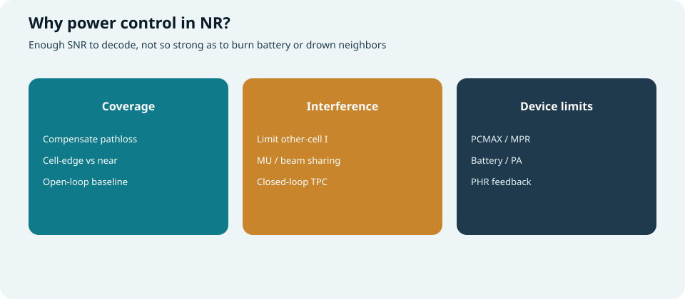
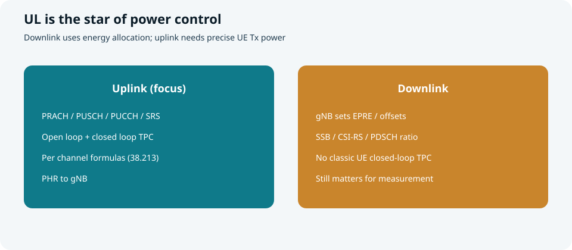
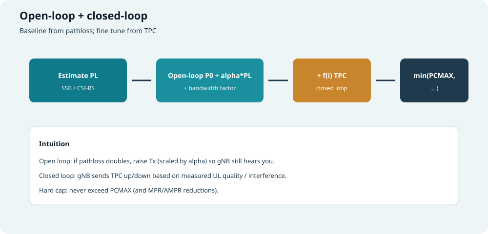
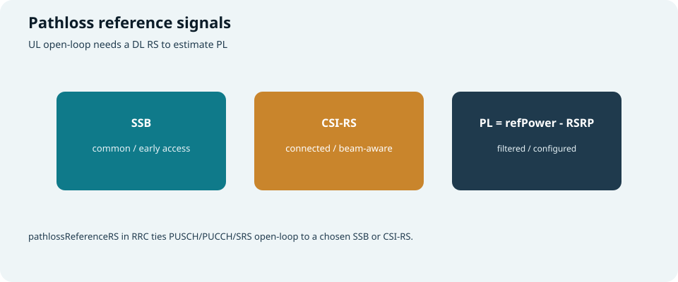
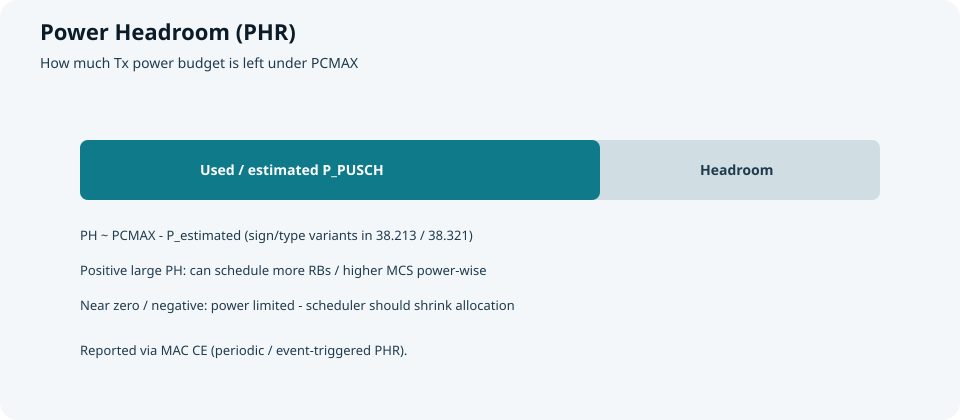
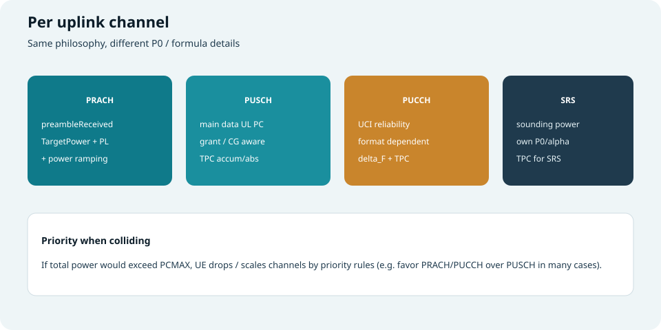
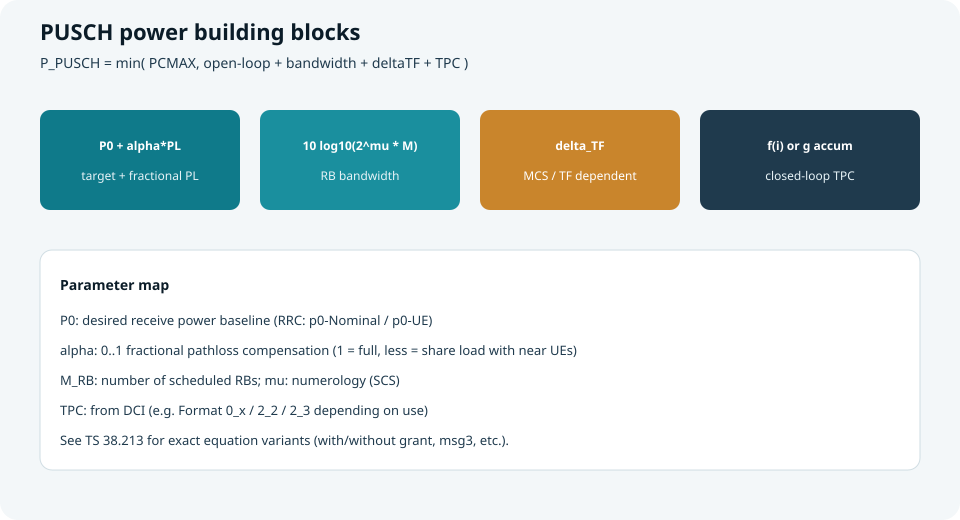

## 本篇要解决什么

空口再聪明，发射功率不对也会失败：

- 太小 → gNB/UE **听不清**（覆盖/BLER）  
- 太大 → **干扰邻居**、费电、撞上功放上限  

**Power Control（功率控制）** 就是把发射功率调到“刚刚好”。NR 里 **上行** 是重头戏（UE 侧公式多）；下行更多是 gNB 的能量/EPRE 配置。

对照：**TS 38.213**（过程与公式）、**38.331**（RRC 参数）、**38.321**（PHR MAC CE）。  
相关：[随机接入](random-access.html)、[PUCCH 与 PUSCH](pucch-pusch.html)、[DCI 与 UCI](dci-uci.html)、[NR CSI-RS](nr-csi-rs.html)、[小区搜索](cell-search.html)。



*图：覆盖、干扰、终端能力三件事同时约束 Tx 功率*

---

## 上行 vs 下行：谁在调功率



*图：上行是精细闭环主战场；下行侧重 gNB 能量分配*

| | **上行（UE→gNB）** | **下行（gNB→UE）** |
| --- | --- | --- |
| 谁算功率 | **UE** 按 38.213 公式 | **gNB** 规划/实现 |
| 典型对象 | PRACH、PUSCH、PUCCH、SRS | SSB、CSI-RS、PDCCH、PDSCH 的相对功率 |
| 开环 | 用 DL RS 估 **pathloss** | 小区覆盖规划、EPRE |
| 闭环 | DCI **TPC** 上下调 | 一般无“UE 回 TPC 调 gNB”的经典环 |
| 反馈 | **PHR** 告诉还能加多少 | CQI/RSRP 间接反映下行质量 |

本篇以 **上行功率控制** 为主线，下行作必要补充。

---

## 开环 + 闭环：总框架



*图：路损打底 → 带宽/格式修正 → TPC 微调 → 不超过 PCMAX*

| 环节 | 做什么 |
| --- | --- |
| **开环** | 根据配置的 **P0** 与 **α·PL**，粗定“要对抗多少路损” |
| **带宽项** | 调度的 RB 数（及 numerology）越大，总功率往往越高 |
| **格式/TF 项** | PUCCH format、PUSCH 的 TF/MCS 相关修正 |
| **闭环 TPC** | gNB 根据上行质量发升降指令，累加或绝对置位 |
| **限幅** | \(P = \min(P_{CMAX}, P_{computed})\) |

> 口诀：**开环看远近，闭环看听感，最后别超过功放天花板。**

---

## 路损从哪里来



*图：用 SSB 或 CSI-RS 当 DL 参考，估 PL*

直觉：

\[
PL \approx \text{referenceSignalPower} - \text{RSRP}_{\text{filtered}}
\]

| 参考 | 何时常用 |
| --- | --- |
| **SSB** | 接入早期、公共、与波束粗对齐 |
| **CSI-RS** | 连接态、可按波束/UE 更细的 pathlossReferenceRS |

RRC 里常见：`pathlossReferenceRS`、`PUSCH-PathlossReferenceRS`、`PUCCH-PathlossReferenceRS` 等，把某条 UL 信道的开环绑到指定 DL RS。

滤波（layer-3 filter）避免 RSRP 抖动导致功率乱跳。

---

## 终端上限：PCMAX、MPR、PHR

| 概念 | 含义 |
| --- | --- |
| **PCMAX** | 当前载波/小区配置下 UE 允许的最大发射功率（含能力与配置） |
| **MPR / A-MPR** | 调制/发射带宽/监管等引起的最大功率回退 |
| **PHR** | Power Headroom：相对 PCMAX 还剩多少“余量” |



*图：PH 大 → 还能加 RB/功率；PH 见底 → 功率受限*

- PH 通过 **MAC CE** 上报（周期或事件）  
- 调度器看到 PH 很小，应减少 RB、降阶或改波束/小区策略  
- 类型上有 **Type1（PUSCH）**、**Type2/3**（与 PUCCH/SRS 等组合相关，版本/场景相关）——排障时先分清报告类型  

---

## 分信道详解



*图：PRACH / PUSCH / PUCCH / SRS 各有参数集*

### 1) PRACH（随机接入前导）

目标：第一次敲门就要让 gNB 听到，又不能一上来打满干扰。

直觉公式（与 [随机接入](random-access.html) 一致）：

```text
P_PRACH ≈ min( PCMAX,
               preambleReceivedTargetPower
               + PL
               + (preambleAttempt-1)*powerRampingStep
               + 其它偏移 )
```

| 参数 | 作用 |
| --- | --- |
| **preambleReceivedTargetPower** | 希望 gNB 侧收到的目标功率 |
| **PL** | 开环路损补偿 |
| **powerRampingStep** | 失败重试每次抬高多少 |
| **preambleTransMax** | 最多抬几次/发几次 |

Msg3 的 PUSCH 功率则走 **PUSCH 公式**（常有专用/初始过程细节，见 38.213）。

---

### 2) PUSCH（上行数据主公式）



*图：P0+αPL、带宽、TF、TPC 四块，再与 PCMAX 取小*

教学形式（具体符号以 38.213 为准）：

\[
P_{\mathrm{PUSCH}} = \min\big\{ P_{CMAX},\;
P_{O,\mathrm{PUSCH}} + \alpha\cdot PL + 10\log_{10}(2^{\mu}M_{\mathrm{RB}}) + \Delta_{\mathrm{TF}} + f \big\}
\]

| 项 | 含义 | 配置/来源直觉 |
| --- | --- | --- |
| \(P_{O,\mathrm{PUSCH}}\) | 开环目标基准 | `p0-NominalWithGrant` + UE 专用 `p0` 等 |
| \(\alpha\) | 路损补偿因子 0…1 | `msg3-Alpha` / `alpha`；**分数路损补偿** |
| \(PL\) | 路损 | 由 pathlossReferenceRS 估 |
| \(M_{\mathrm{RB}}\) | 本 PUSCH 占用 RB 数 | 来自 UL grant |
| \(\mu\) | numerology | SCS 相关 |
| \(\Delta_{\mathrm{TF}}\) | 与调制编码/TF 相关的偏移 | 高阶/特定 TF 时调整 |
| \(f\) | 闭环 TPC 状态 | DCI TPC；累积或绝对 |

**α 怎么理解：**

- \(\alpha=1\)：路损全补，远近 UE 到 gNB 接收功率更齐，但远点干扰大  
- \(\alpha<1\)：远点少补一点，**让小区边缘少制造干扰**，近点相对“更轻松”  

**TPC 模式：**

| 模式 | 直觉 |
| --- | --- |
| **累积（accumulation）** | 每次 TPC 在旧 \(f\) 上加减（常见） |
| **绝对（absolute）** | TPC 直接给定闭环分量 |

DCI Format **0_0/0_1** 等可带 TPC command；组 TPC 也可用 Format **2_2** 等（视配置）。

**配置授权（CG）PUSCH**：同样有开环+闭环框架，参数集可能独立（CG 专用 P0 等）。

---

### 3) PUCCH（上行控制）

目标：保证 **HARQ-ACK / SR / CSI** 可靠，格式不同开销不同。

直觉：

```text
P_PUCCH ≈ min( PCMAX,
               P0_PUCCH + PL_factor
               + 带宽/资源相关项
               + delta_F_PUCCH(F)      # format 相关
               + delta_TF / 其它
               + g(i)                  # PUCCH TPC 闭环
             )
```

| 要点 | 说明 |
| --- | --- |
| **P0_PUCCH** | 开环基准（nominal + UE） |
| **delta_F** | Format 0/1/2/3/4 不同偏移 |
| **资源大小** | 更多 PRB/符号 → 总功率需求变化 |
| **TPC** | 常来自下行 DCI（如 DL 调度里的 TPC 字段）或组 TPC |

短 PUCCH 时长短，有时更依赖够用的功率与好的闭环；长 PUCCH 用时间换覆盖，功率策略可不同。

详见 [PUCCH 与 PUSCH](pucch-pusch.html)。

---

### 4) SRS（探测参考信号）

用于 gNB 估上行信道/波束，功率也要可控：

```text
P_SRS ≈ min( PCMAX,
             P0_SRS + alpha_SRS*PL
             + 带宽项
             + h(i) TPC_SRS )
```

可与 PUSCH 共用或独立 pathloss RS / TPC 过程（RRC 配置）。

---

## 功率撞顶时怎么办

同 slot 可能同时有 PUCCH + PUSCH + SRS…  
若之和将超过 **PCMAX**，UE 按规范 **优先级缩放或丢弃**：

| 直觉优先级（常见教学排序） | 说明 |
| --- | --- |
| 高：PRACH / 关键 PUCCH（ACK 等） | 保接入与关键反馈 |
| 中：PUSCH（尤其带 UCI 的） | 数据与捎带控制 |
| 低：部分 SRS / 次要信道 | 可降功率或放弃 |

精确优先级表见 **38.213**；排障时若“有 grant 却没发出”，要怀疑 **功率优先级裁剪**。

---

## 下行侧需要知道的功率概念

虽无“UE 闭环调 gNB”，但测量与开环依赖下行功率设定：

| 概念 | 含义 |
| --- | --- |
| **EPRE** | Energy Per Resource Element |
| **ss-PBCH-BlockPower** | SSB 功率参考（SIB1 等），用于 PL/测量换算 |
| **powerControlOffset**（CSI-RS 等） | CSI-RS 相对 PDSCH/参考的功率偏移 |
| **PDCCH/PDSCH 功率分配** | 实现侧在码率、波束、能量间权衡 |

UE 侧：错误的 referenceSignalPower 假设 → **PL 估错** → 整个上行开环歪掉。

---

## RRC / DCI 里常见旋钮清单

### RRC（半静态）

| 区域 | 典型 IE 直觉 |
| --- | --- |
| PUSCH-PowerControl | `p0-Nominal*`、`p0-AlphaSets`、`pathlossReferenceRS`、`tpc-Accumulation` |
| PUCCH-PowerControl | `p0-nominal`、`deltaF-*`、pathloss RS、TPC |
| SRS-PowerControl | `p0`、`alpha`、pathloss、TPC |
| RACH-ConfigCommon | `preambleReceivedTargetPower`、`powerRampingStep`、`preambleTransMax` |
| PHR-Config | 周期/阈值、类型 |

### DCI（动态）

| 字段 | 作用 |
| --- | --- |
| **TPC command** | 升/降闭环功率状态 |
| **UL grant 带宽** | 改变 \(M_{RB}\) 从而改变开环带宽项 |
| 组 TPC DCI | 一次调度多 UE 的功率调整 |

---

## 端到端故事

```text
1) UE 测 SSB/CSI-RS RSRP → 估 PL
2) 读 RRC：P0、alpha、pathlossReferenceRS、TPC 模式
3) 发 PRACH：目标功率 + PL + 攀升
4) 连接后发 PUSCH/PUCCH：
     开环(P0+αPL+带宽+Δ) + 闭环(TPC) ，再 min PCMAX
5) 周期性/事件上报 PHR
6) gNB 根据 PH、BLER、干扰调 TPC 与调度带宽
```

**小例子：**

- 从近点走到远点：PL ↑ → 开环自动抬功率（受 α 约束）  
- gNB 觉得上行 SINR 过高、干扰大：连续发 **TPC down**  
- 调度突然给很多 RB：带宽项 ↑ → 可能顶到 PCMAX → PH≈0 → 下次少给 RB  

---

## 排障抓手

| 现象 | 可查 |
| --- | --- |
| RACH 总失败 | targetPower 过低、攀升不够、PL 参考错、触顶 PCMAX |
| PUSCH 近点还差 | TPC 累积异常、P0 配太低、功放/MPR |
| 远点干扰大 | α 过大、P0 过高 |
| 有 UL grant 无声 | 功率优先级丢掉 PUSCH；或 PH 长期见底 |
| PH 与真实不符 | PHR 类型、PCMAX 计算、参考 RS |

---

## 快速自测

1. 为何说 NR 功率控制“重点在上行”？  
2. 开环与闭环各解决什么？α 小于 1 的动机？  
3. 写出 PUSCH 功率的积木项（不必背全符号）。  
4. PRACH 的 power ramping 与 PUSCH TPC 有何不同？  
5. PUCCH 的 `delta_F` 与 format 有什么关系？  
6. PHR 对调度意味着什么？  
7. 多信道同时发射且功率不够时，UE 大致怎么做？

> 一句话：**NR 功率控制 = 用 DL RS 估路损打底，用 P0/α/带宽/格式算开环，用 TPC 闭环微调，用 PCMAX 封顶，用 PHR 告诉调度还能加多少。**

## 相关专题

- [随机接入](random-access.html)
- [PUCCH 与 PUSCH](pucch-pusch.html)
- [PDCCH 与 PDSCH](pdcch-pdsch.html)
- [DCI 与 UCI](dci-uci.html)
- [NR CSI-RS](nr-csi-rs.html)
- [NR RRC 与 RRCReconfiguration](nr-rrc-reconfiguration.html)
