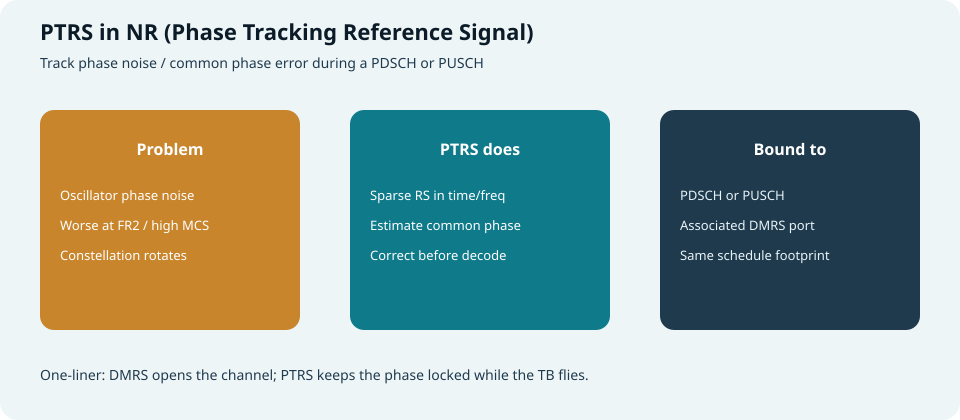
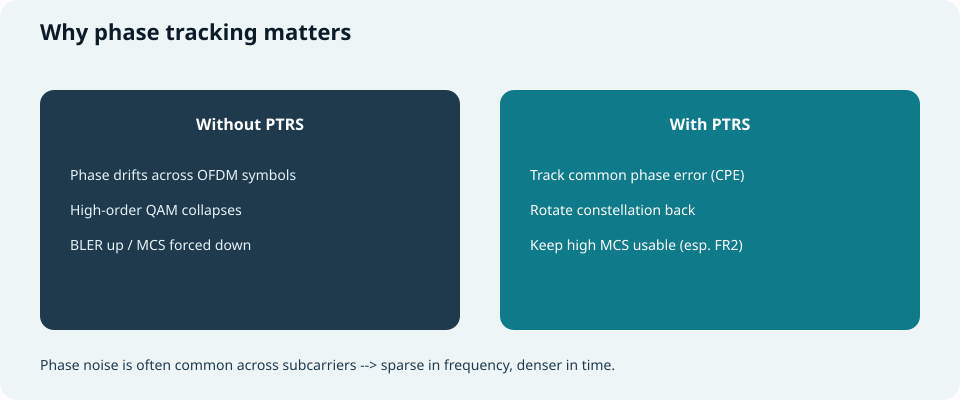
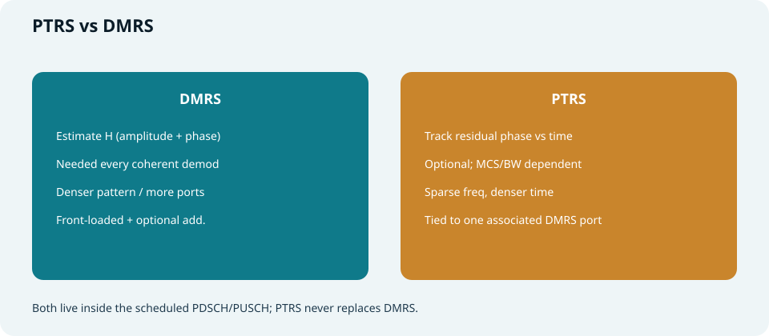
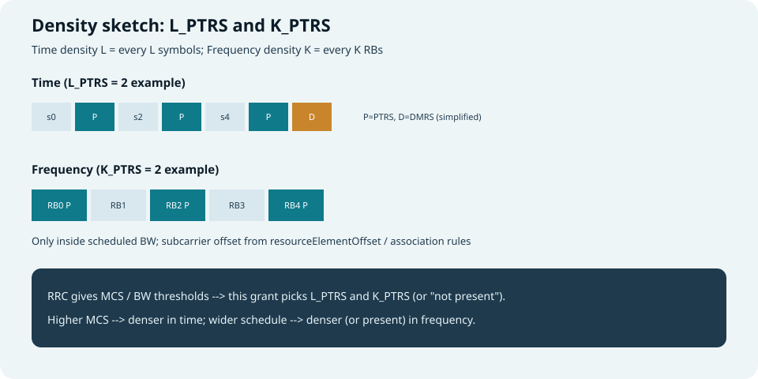
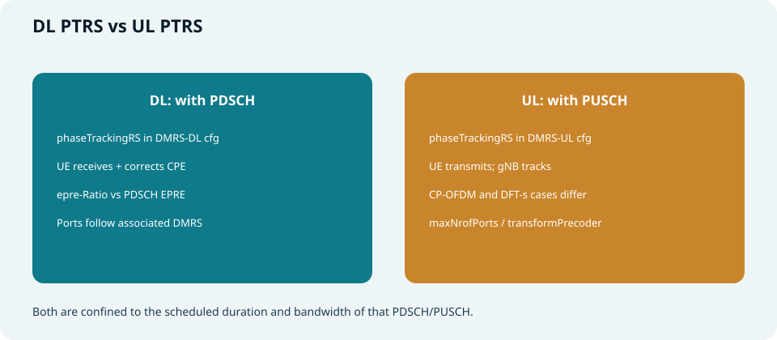
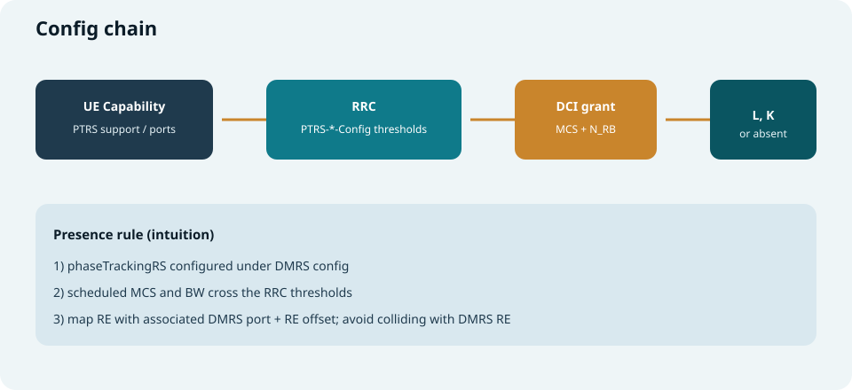

## 本篇要解决什么

高阶调制、尤其 **FR2 / mmWave** 下，本振 **相位噪声** 会让星座图慢慢“转歪”，光靠 DMRS 开局估一次信道往往不够。

**PTRS（Phase Tracking Reference Signal，相位跟踪参考信号）** 就是嵌在 **本次 PDSCH / PUSCH** 里的稀疏探针，用来跟踪 **公共相位误差（CPE）**，把相位拧回来。

本篇讲清：为什么要、跟 DMRS 差在哪、时频密度怎么定、上下行差异、RRC/门限/配置链，以及排障抓手。

对照：**TS 38.211**（映射）、**38.214**（存在性与密度过程）、**38.331**（`PTRS-DownlinkConfig` / `PTRS-UplinkConfig`）。  
相关：[NR DMRS](nr-dmrs.html)、[PDCCH 与 PDSCH](pdcch-pdsch.html)、[PUCCH 与 PUSCH](pucch-pusch.html)、[NR CSI-RS](nr-csi-rs.html)、[Antenna Port / QCL](antenna-port-qcl-resource-grid.html)。



*图：相位在漂 → PTRS 跟踪 → 再解调；并始终绑在本次调度块与某个 DMRS 端口上*

---

## PTRS 是什么

| 要点 | 说明 |
| --- | --- |
| **角色** | 跟踪发射/接收本振引起的 **相位漂移 / 公共相位误差** |
| **出现位置** | 仅出现在 **被调度的 PDSCH 或 PUSCH** 时频范围内 |
| **关联** | **总是关联到某一个 DMRS 端口**（同预编码/同“路”语义） |
| **密度特点** | 相位噪声常在子载波间 **较公共** → **频域可稀、时域宜密** |
| **是否必开** | **可选**；由 RRC 配置 + 本次 MCS/带宽是否过门限决定 |

> 口诀：**DMRS 负责“看清信道形状”；PTRS 负责“跟着相位转”。**

---

## 为什么需要 PTRS



*图：无 PTRS 时高阶 QAM 易塌；有 PTRS 才能稳住高 MCS*

| 场景 | 直觉 |
| --- | --- |
| **载波越高** | 同一相对相位噪声，绝对影响更刺眼（FR2 更常见） |
| **MCS 越高** | 星座点更密，一点点相位旋转就跨界 |
| **调度时长拉长** | 相位随 OFDM 符号累积漂移，更需要时域采样 |
| **仅靠 DMRS** | DMRS 符号之间仍可能漂；附加 DMRS 也不是为 CPE 优化的稀疏时域采样 |

PTRS **不替代** 信道估计主路径，而是在 DMRS 提供的等效信道之上，补 **随时间变化的公共相位**。

---

## PTRS vs DMRS（务必分清）



*图：一个估 H，一个跟相位；同住在调度块里*

| 维度 | **DMRS** | **PTRS** |
| --- | --- | --- |
| 目的 | 相干解调：估等效信道 | 相位跟踪：估/跟 CPE |
| 是否常配 | 有数据/控制就要能解 | 可选；看频段/MCS/配置 |
| 图案倾向 | 前置 + 可选附加；端口/CDM 丰富 | 时域较密、频域较稀 |
| 关联 | 多层/多端口 | **关联到一个 DMRS 端口** |
| 输出 | 均衡系数 | 相位校正量 |

也别和 **TRS（跟踪参考，常挂在 CSI-RS 配置里）** 混淆：TRS 更偏连接态时频同步跟踪；PTRS 专跟 **这一次共享信道传输** 的相位。

---

## 怎么工作：端到端直觉

```text
RRC 在 DMRS-*-Config 下配置 phaseTrackingRS
        │
本次 DCI 给出 MCS + 调度带宽 N_RB (+ 端口等)
        │
查 timeDensity / frequencyDensity 门限表
        ├─ 未达门限 → 本次无 PTRS
        └─ 达门限 → 得到 L_PTRS、K_PTRS
                │
在 PDSCH/PUSCH 占用的符号与 RB 内映射 PTRS RE
（避开 DMRS RE；子载波偏移由 resourceElementOffset 等决定）
                │
接收端：用关联 DMRS 端口的信道 + PTRS 相位 → 校正 → 解 TB
```

**存在性三条件（记忆版）：**

1. RRC **配了** `phaseTrackingRS`（未配/释放 → 认为没有 PTRS）  
2. 本次调度的 **MCS、带宽** 落在门限要求的区间（否则 “not present”）  
3. 映射落在 **本调度** 的时长与带宽内，并绑对 **关联 DMRS 端口**

---

## 时频密度：\(L_{\mathrm{PTRS}}\) 与 \(K_{\mathrm{PTRS}}\)



*图：时域每隔 L 个符号、频域每隔 K 个 RB 插 PTRS（示意）*

| 符号 | 含义 | 直觉 |
| --- | --- | --- |
| **\(L_{\mathrm{PTRS}}\)** | 时域密度（每隔多少符号） | 常见取值直觉：**1 / 2 / 4**；越小越密 |
| **\(K_{\mathrm{PTRS}}\)** | 频域密度（每隔多少 RB） | 常见取值直觉：**2 / 4**；越小越密 |
| **not present** | 门限判定本次不发/不收 PTRS | 低 MCS 或带宽过窄时常关闭以省开销 |

**自适应逻辑（规范用门限表实现）：**

- **MCS 升高** → 往往需要 **更密的时域**（相位更敏感）  
- **调度带宽变宽** → 往往需要 **更合适的频域密度 / 出现**（估计更稳、也控制开销）  

RRC 里的 `timeDensity`、`frequencyDensity` 给出的是 **门限点**，不是直接写死“永远 L=2”。  
若相关字段缺省，规范规定默认假设（例如 DL 常见默认 \(L=1\)、\(K=2\)——以 38.214/38.331 为准）。

**RE 位置补充：**

- 只落在 **本 PDSCH/PUSCH 调度** 内  
- **不与 DMRS RE 重叠**（冲突时按映射规则避让）  
- `resourceElementOffset` 选择子载波偏移（如 offset00/01/10/11）  
- 具体符号索引还与 **DMRS 位置、PDSCH mapping type A/B、调度 SLIV** 等相关（细表见 38.211）

---

## 下行 PTRS（PDSCH）vs 上行 PTRS（PUSCH）



*图：一边 UE 收着跟相位，一边 UE 发着让 gNB 跟*

### 下行（PDSCH PTRS）

| 点 | 说明 |
| --- | --- |
| 配置挂载 | `DMRS-DownlinkConfig` → `phaseTrackingRS` → **`PTRS-DownlinkConfig`** |
| 谁受益 | **UE** 接收机校正相位后再解 PDSCH |
| 功率 | `epre-Ratio`：PTRS 相对 PDSCH EPRE 的功率比 |
| 过程 | 38.214 PT-RS reception（随 DCI 1_x 等调度） |

### 上行（PUSCH PTRS）

| 点 | 说明 |
| --- | --- |
| 配置挂载 | `DMRS-UplinkConfig` → `phaseTrackingRS` → **`PTRS-UplinkConfig`** |
| 谁受益 | **gNB** 跟踪 UE 侧相位噪声 |
| 分岔 | **`transformPrecoderDisabled`（CP-OFDM）** 与 **`transformPrecoderEnabled`（DFT-s-OFDM）** 参数组不同 |
| CP-OFDM 侧 | 类似 DL：`timeDensity` / `frequencyDensity`、`maxNrofPorts`、`resourceElementOffset`、`ptrs-Power` |
| DFT-s 侧 | 常用 **`sampleDensity`** 等（按调度带宽选样点密度），时域另有变换预编码相关选项 |

> 排障先问：**这次 PUSCH 有没有变换预编码？** 有的话不要拿 CP-OFDM 的 L/K 表格硬套。

---

## 与 DMRS 端口的关联

PTRS **不是独立“天线端口宇宙”里乱飞的导频**，而是：

- 选一个（或受 `maxNrofPorts` 约束的）**关联 DMRS 端口**  
- 与该端口 **同预编码假设**，估到的相位才对得上数据层  
- DCI 天线端口指示、层数、CDM group 会间接影响“关联谁、有几路 PTRS”

多层传输时：并非每层都必须密密麻麻插 PTRS；规范按端口/层规则关联，以控制开销。

---

## RRC 参数清单（学习用）



*图：能力 → RRC 门限 → 本次 MCS/带宽 → 决定 L、K 或关闭*

### 下行 `PTRS-DownlinkConfig`（名随 ASN.1）

| 字段 | 含义 |
| --- | --- |
| **timeDensity** | MCS 门限序列 → 决定 \(L_{\mathrm{PTRS}}\) 或 absent |
| **frequencyDensity** | 调度带宽门限 → 决定 \(K_{\mathrm{PTRS}}\) 或 absent |
| **epre-Ratio** | PTRS 相对 PDSCH 的 EPRE 比 |
| **resourceElementOffset** | 频域子载波偏移 |

`phaseTrackingRS` **缺省/释放** ⇒ UE 假定 **无下行 PTRS**。

### 上行 `PTRS-UplinkConfig`

| 分支 | 关键字段直觉 |
| --- | --- |
| **transformPrecoderDisabled** | `timeDensity`、`frequencyDensity`、`maxNrofPorts`、`resourceElementOffset`、`ptrs-Power` |
| **transformPrecoderEnabled** | `sampleDensity`、`timeDensityTransformPrecoding` 等 |

### 挂在哪里

```text
pdsch-Config
  └── dmrs-DownlinkForPDSCH-MappingTypeA/B
        └── phaseTrackingRS → PTRS-DownlinkConfig

pusch-Config
  └── dmrs-UplinkForPUSCH-MappingTypeA/B
        └── phaseTrackingRS → PTRS-UplinkConfig
```

（还有面向特定 DCI 格式的 DMRS 配置副本，如 DCI 1_2 专用项——排障时看清用的是哪套 `dmrs-*-Config`。）

---

## UE 能力与工程取舍

| 维度 | 问什么 |
| --- | --- |
| **是否支持 PTRS** | FR1/FR2、DL/UL 支持情况 |
| **最大端口数** | UL `maxNrofPorts` 能配到几 |
| **与 MCS/带宽策略** | 门限设太激进 → 开销大；太保守 → 高 MCS 相位不够跟 |

工程上：

- **FR2 + 高阶 MCS**：优先认真配 PTRS  
- **FR1 低阶**：常关或门限抬高，省 RE  
- 开销占用的 RE **不再承载数据**，速率匹配要心里有数  

---

## 排障抓手

| 现象 | 优先怀疑 |
| --- | --- |
| 高 MCS / FR2 BLER 差，DMRS 看起来正常 | 未配 `phaseTrackingRS`；门限导致 not present |
| 以为配了却抓不到 PTRS RE | 本次 MCS/带宽未过门限；看错 BWP/调度 |
| RE 对不上工具图 | `resourceElementOffset`；DMRS 避让；mapping type A/B |
| UL 行为怪异 | 变换预编码开关与配置分支不一致 |
| 多层只有部分“跟得住” | 关联端口 / `maxNrofPorts` / DCI 端口指示 |

---

## 快速自测

1. PTRS 解决的核心损伤是什么？为何频域可以稀、时域宜密？  
2. 与 DMRS、TRS 各差在哪？  
3. \(L_{\mathrm{PTRS}}\)、\(K_{\mathrm{PTRS}}\) 分别管什么？谁由 MCS/带宽门限决定？  
4. `phaseTrackingRS` 释放后，UE 应假定有没有 PTRS？  
5. UL 在 transform precoding 开/关时，配置结构有何不同？  
6. PTRS 为什么必须关联 DMRS 端口？  

---

## 一句话

**PTRS = 嵌在本次 PDSCH/PUSCH 里、绑在关联 DMRS 端口上的相位跟踪钉；用 RRC 门限按 MCS/带宽选择时频密度，专治高载波与高阶调制下的相位噪声。**

### 站内延伸

- [NR DMRS](nr-dmrs.html)  
- [PDCCH 与 PDSCH](pdcch-pdsch.html)  
- [PUCCH 与 PUSCH](pucch-pusch.html)  
- [NR CSI-RS](nr-csi-rs.html)  

---

## 延伸阅读（推荐学习站）

对照本篇后，建议打开 ShareTechnote 的 PTRS 专页（含密度、RE 位置与 RRC 字段解读）：

- [ShareTechnote — 5G PDSCH PTRS](https://www.sharetechnote.com/html/5G/5G_PTRS_DL.html)

上行细节可结合同站的 PUSCH DMRS / PTRS-UplinkConfig 说明，与 **38.211 / 38.214** 表格交叉核对。
