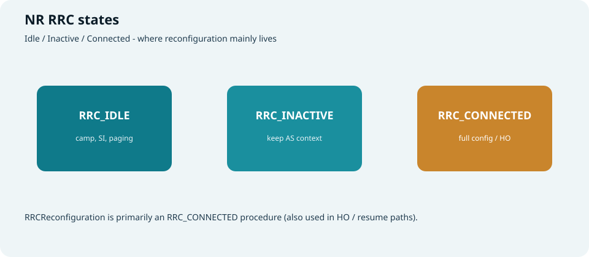
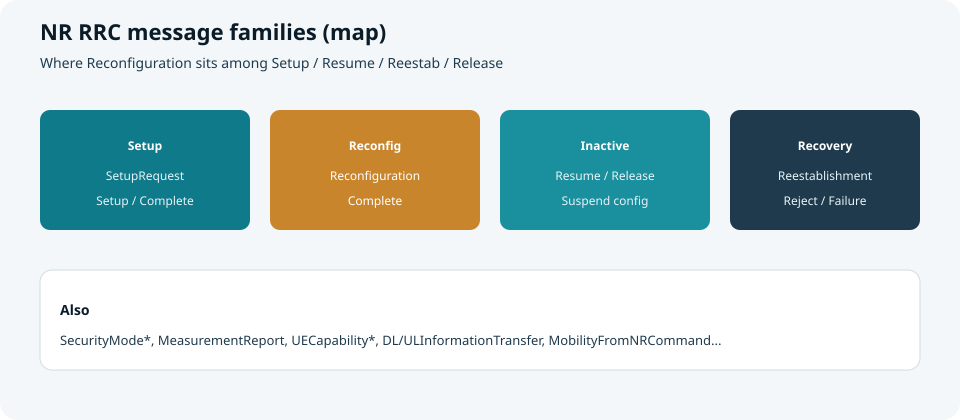
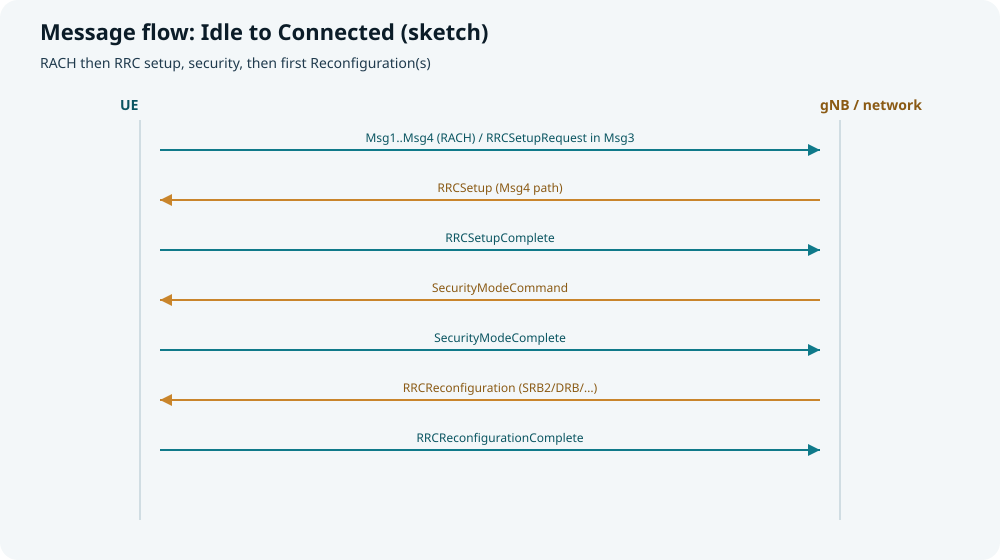
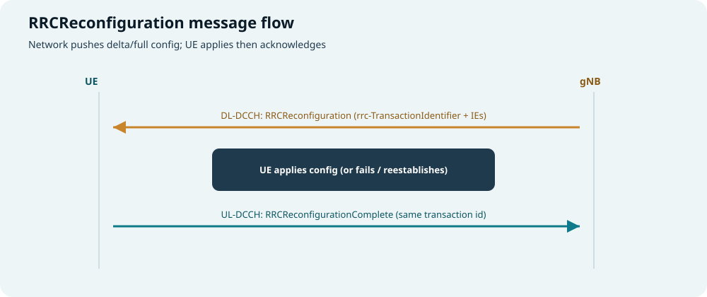
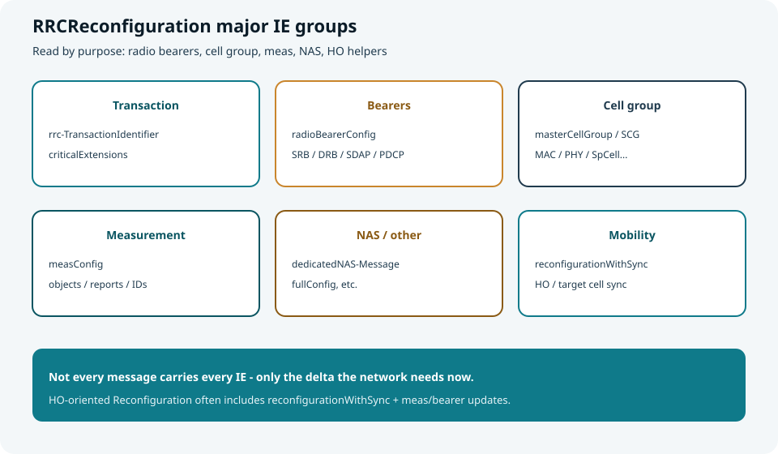
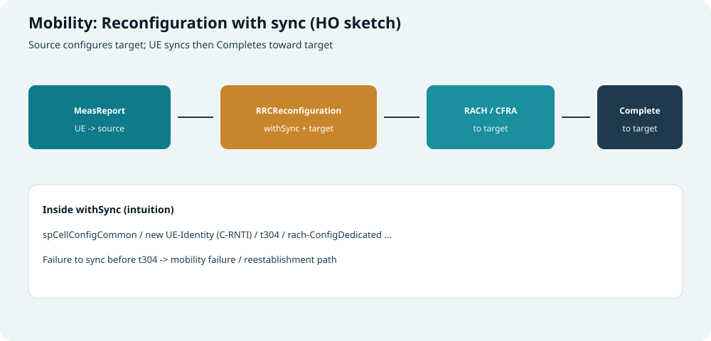

## 本篇要解决什么

物理层解决“怎么传比特”；**RRC（Radio Resource Control）** 解决“**网络如何把一套空口配置装进 UE**”。

在 NR 里，连接态最常用、也最“大而全”的配置消息就是：

**`RRCReconfiguration` → `RRCReconfigurationComplete`**

本篇尽量详细覆盖：

1. NR RRC 在系统中的位置与三种状态  
2. 主要 RRC 消息地图与建立消息流  
3. **RRCReconfiguration 消息流**  
4. **各主要字段 / IE 的含义与作用**  
5. 切换场景下的 `reconfigurationWithSync`  

对照：**TS 38.331**（ASN.1 与过程以规范为准；字段集合随 Release 扩展）。  
前置：[随机接入](random-access.html)、[PDCCH 与 PDSCH](pdcch-pdsch.html)、[CORESET 与 Search Space](coreset-search-space.html)、[DCI 与 UCI](dci-uci.html)。

---

## RRC 是什么、管什么

| 视角 | 说明 |
| --- | --- |
| **协议层** | 控制面、位于 PDCP 之上的 RRC；消息常走 **SRB**（信令无线承载） |
| **职责** | 连接建立/恢复/释放、无线承载、小区组（MAC/PHY）配置、测量、切换、部分 NAS 透传等 |
| **与下层关系** | RRC 下发的配置，最终变成 CORESET、SearchSpace、PDSCH/PUSCH、PUCCH、测量对象…… |

> 口诀：**RRC 写“菜谱”，PHY/MAC 按菜谱炒菜。**



*图：Idle / Inactive / Connected；Reconfiguration 主要在 Connected*

| 状态 | UE 侧直觉 | 典型消息 |
| --- | --- | --- |
| **RRC_IDLE** | 驻留、读 SI、听寻呼；无完整 AS 连接上下文 | Setup 流程入口 |
| **RRC_INACTIVE** | 保留 AS 上下文，可快速 Resume | Resume / Release（Suspend） |
| **RRC_CONNECTED** | 有 C-RNTI、可被调度；配置可频繁更新 | **Reconfiguration**、MeasReport、HO… |

---

## NR RRC 消息地图（先建立坐标）



*图：Setup / Reconfig / Inactive / Recovery 等家族*

| 家族 | 代表消息 | 干什么 |
| --- | --- | --- |
| **建立** | `RRCSetupRequest` / `RRCSetup` / `RRCSetupComplete` | Idle→Connected 骨架 |
| **安全** | `SecurityModeCommand` / `SecurityModeComplete` | 激活 AS 安全 |
| **重配（本篇焦点）** | `RRCReconfiguration` / `RRCReconfigurationComplete` | 增删改承载、小区组、测量、切换等 |
| **Inactive** | `RRCResumeRequest*` / `RRCResume` / `RRCRelease`（可带 suspend） | 快恢复或挂起 |
| **重建** | `RRCReestablishmentRequest` / `RRCReestablishment` / `Complete` | 失败后抢救连接 |
| **测量** | `MeasurementReport` | UE 上报测量，常触发 HO 重配 |
| **能力** | `UECapabilityEnquiry` / `UECapabilityInformation` | 能力交互 |
| **NAS 透传** | `DLInformationTransfer` / `ULInformationTransfer` | 传 NAS PDU |
| **释放 / 异系统** | `RRCRelease`、`MobilityFromNRCommand` 等 | 离开或导向其它 RAT |

逻辑信道直觉（Connected）：

| 通道 | 用途直觉 |
| --- | --- |
| **SRB0** | CCCH，建立前（如 SetupRequest） |
| **SRB1** | 主控 RRC（Setup 后多数 RRC，含 Reconfiguration） |
| **SRB2** | 常用于 NAS 相关（由重配建立） |
| **DRB** | 用户面数据承载 |

---

## 消息流 1：从 Idle 到 Connected（建立骨架）



*图：RACH → Setup → Security → 首次 Reconfiguration*

逐步说明：

| 步骤 | 消息 / 过程 | 方向 | 含义 |
| --- | --- | --- | --- |
| 1 | **RACH Msg1…Msg4** | 双向 | 拿 TA、TC-RNTI/C-RNTI 路径；Msg3 常携 **RRCSetupRequest** |
| 2 | **RRCSetup** | gNB→UE | 给出 **SRB1** 与初始 **masterCellGroup** 等，进入 Connected 雏形 |
| 3 | **RRCSetupComplete** | UE→gNB | 确认 Setup；可携 NAS（如 Registration Request） |
| 4 | **SecurityModeCommand** | gNB→UE | 指示完整性/加密算法等 |
| 5 | **SecurityModeComplete** | UE→gNB | 安全激活成功 |
| 6 | **RRCReconfiguration** | gNB→UE | 常建 **SRB2、DRB**、完善测量/PHY 等 |
| 7 | **RRCReconfigurationComplete** | UE→gNB | 重配成功 |

> 许多教材把“第一次配齐业务承载”也写成 Reconfiguration——这正是它在接入后立刻登场的原因。

### `RRCSetup` 里常见字段直觉（对照重配）

| 字段 / IE | 含义 | 作用 |
| --- | --- | --- |
| **rrc-TransactionIdentifier** | 事务号 | 与 Complete 配对 |
| **radioBearerConfig**（可含） | 至少建立 **SRB1** | 后续 RRC 走 DCCH/SRB1 |
| **masterCellGroup** | 主小区组配置（MAC/PHY…） | 能听 PDCCH、发 PUCCH/PUSCH 的初始菜谱 |
| **lateNonCriticalExtension 等** | 扩展容器 | 版本演进 |

`RRCSetupRequest` 侧常见：`ue-Identity`（如 randomValue / ng-5G-S-TMSI 相关）、`establishmentCause`（mo-Data、mo-Signalling、mt-Access…）、`spare`。

---

## 消息流 2：RRCReconfiguration（通用）



*图：下行重配 → UE 应用 → 上行 Complete*

```text
gNB --(DL-DCCH / SRB1)--> RRCReconfiguration
                              |
                         UE 应用配置
                              |
UE  --(UL-DCCH / SRB1)--> RRCReconfigurationComplete
         (带回相同 rrc-TransactionIdentifier)
```

| 情况 | UE 行为直觉 |
| --- | --- |
| **成功** | 应用 IE 后发 **Complete** |
| **失败** | 视场景：重配失败流程、或走向 **Reestablishment**（尤其切换失败） |
| **事务号** | Complete 必须对应本次 Reconfiguration 的 **rrc-TransactionIdentifier** |

可触发重配的原因（举例）：

- 建立/修改/释放 DRB、QoS flow↔DRB  
- 改 BWP、CORESET、SearchSpace、CSI、SRS、PUCCH…  
- 下发/修改 **measConfig**  
- **切换（HO）**、SN 添加/修改（EN-DC/NR-DC 等）  
- 二次小区组、SCell 增删  

---

## RRCReconfiguration：结构与字段详解



*图：按用途读 IE——不是每次消息都带全家桶*

### 顶层结构（示意，对照 38.331）

```text
RRCReconfiguration-IEs ::= SEQUENCE {
  radioBearerConfig                OPTIONAL,
  secondaryCellGroup               OCTET STRING OPTIONAL,  -- 或等价 SCG 容器
  measConfig                       OPTIONAL,
  lateNonCriticalExtension         OPTIONAL,
  nonCriticalExtension             OPTIONAL,
  -- 以及 masterCellGroup / dedicatedNAS-Message /
  -- fullConfig / masterKeyUpdate / ... 等（随版本与编码方式）
}
```

实际 ASN.1 用 `criticalExtensions` 包裹，并随 Release 不断 `nonCriticalExtension` 链扩展。学习时按 **功能组** 记字段。

---

### A. 事务与通用控制

| 字段 | 含义 | 作用 |
| --- | --- | --- |
| **rrc-TransactionIdentifier** | 0…3 的事务标识 | 把 Reconfiguration 与 Complete 绑成一次事务 |
| **criticalExtensions** | 关键扩展选择 | 兼容不同版本的消息体 |
| **fullConfig** | 指示是否按“全量配置”理解/应用 | 某些场景（如部分 HO/重建相关）要求 UE 以全配置方式处理，而不是简单增量合并 |
| **masterKeyUpdate** 等 | 密钥更新相关 | 切换/安全上下文更新时使用 |

---

### B. `radioBearerConfig`：无线承载

管 **SRB/DRB** 以及其上的 PDCP/SDAP 等。

| 字段 / 子结构 | 含义 | 作用 |
| --- | --- | --- |
| **srb-ToAddModList** | 添加/修改 SRB | 例如建立 **SRB2** |
| **srb-ToReleaseList** | 释放 SRB | 少见，按需 |
| **drb-ToAddModList** | 添加/修改 DRB | 业务承载建立与参数变更 |
| **drb-ToReleaseList** | 释放 DRB | 去承载 |
| **securityConfig**（承载侧相关） | 承载安全相关 | 与 AS 安全策略呼应 |
| **sdap-Config**（在 DRB 内） | SDAP：QoS flow ↔ DRB | 5QI/QoS flow 映射到数据无线承载 |
| **pdcp-Config** | PDCP：SN 长度、丢弃定时器、头压缩、完整性/加密是否用于该承载等 | 可靠递交与安全处理参数 |
| **cnAssociation** 等 | 与核心网侧关联方式 | EPS bearer / SDAP 等关联语义 |

**读日志时：** 看到 `drb-ToAddModList` → 业务通道在变；`srb-ToAddModList` 含 SRB2 → NAS 信令通道在补齐。

---

### C. `masterCellGroup` / Cell Group：MAC + PHY 菜谱

这是把本站物理层专题“钉死”到 RRC 的地方：  
**CellGroupConfig**（主小区组或 SCG）里常见：

| 字段 / 子结构 | 含义 | 作用 |
| --- | --- | --- |
| **cellGroupId** | 小区组 ID | 区分 MCG/SCG |
| **rlc-BearerToAddModList** | RLC 承载与逻辑信道 | 把 DRB/SRB 接到 RLC 实体与 LCH |
| **mac-CellGroupConfig** | MAC：BSR/PHR/DRX、TAR 等 | 调度请求、省电、时间对齐等 |
| **physicalCellGroupConfig** | 物理小区组级参数 | 如 TPC、HARQ-ACK 空闲空间等组级控制 |
| **spCellConfig** | SpCell（PCell/PSCell）配置 | 服务特殊小区的核心 |
| **sCellToAddModList / sCellToReleaseList** | SCell 增删 | CA 载波聚合 |
| **spCellConfigDedicated** 内更多 | 见下表 | 专用空口参数 |

#### `spCellConfigDedicated` / ServingCellConfig 内高频字段

| 字段 | 含义 | 作用 |
| --- | --- | --- |
| **initialDownlinkBWP / downlinkBWP-ToAddModList** | 下行 BWP | 定 BWP ID、公共+专用配置 |
| **initialUplinkBWP / uplinkBWP-ToAddModList** | 上行 BWP | 含 PUSCH/PUCCH/SRS/RACH 等专用部分 |
| **pdcch-Config** | CORESET + SearchSpace | 见 [CORESET 与 Search Space](coreset-search-space.html) |
| **pdsch-Config** | PDSCH 专用：DMRS、资源分配、MCS 表、聚合等 | 见 [PDCCH 与 PDSCH](pdcch-pdsch.html) |
| **pusch-Config** | PUSCH 专用 | 见 [PUCCH 与 PUSCH](pucch-pusch.html) |
| **pucch-Config** | PUCCH 资源/Format/集合 | short/long PUCCH 资源落点 |
| **csi-MeasConfig** | CSI 报告与资源 | 触发 UCI 中的 CSI |
| **srs-Config** | SRS | 上行探测与波束管理 |
| **tdd-UL-DL-ConfigurationDedicated** | 专用 TDD 图案（若有） | 覆盖/补充公共 TDD |
| **firstActiveDownlinkBWP-Id / Uplink** | 激活哪个 BWP | 重配后先工作在哪条 BWP |
| **uplinkConfig / supplementaryUplink** | NUL/SUL | 补充上行 |

> 几乎每次“改调度行为”，都会在这些 IE 里留下痕迹。

---

### D. `measConfig`：测量配置

| 字段 / 子结构 | 含义 | 作用 |
| --- | --- | --- |
| **measObjectToAddModList** | 测量对象（频点/SSB/CSI-RS 等） | UE 测什么 |
| **measObjectToRemoveList** | 删除测量对象 | 减负 |
| **reportConfigToAddModList** | 上报配置（周期/事件 A1–A6、B 类等） | 何时报、报什么 |
| **reportConfigToRemoveList** | 删除上报配置 | — |
| **measIdToAddModList** | measId = Object + Report 绑定 | 一条完整测量任务 |
| **measIdToRemoveList** | 删除测量任务 | — |
| **s-MeasureConfig** | s-Measure 门限相关 | 服务质量够好时可少测异频等 |
| **quantityConfig** | 测量量滤波等 | RSRP/RSRQ/SINR 处理 |
| **measGapConfig** | 测量间隙 | 异频/异系统测量时隙 |
| **measGapSharingConfig** 等 | Gap 共享 | 多任务共享间隙 |

事件名直觉（NR）：**A1–A6** 管服务/邻区门限与偏移；异系统另有 B 类等（版本相关）。

UE 按配置测量后，用 **`MeasurementReport`** 上报 → 网络常据此下发下一次 **RRCReconfiguration（HO）**。

---

### E. `dedicatedNAS-Message`

| 字段 | 含义 | 作用 |
| --- | --- | --- |
| **dedicatedNAS-Message** | 封装的 NAS PDU | 在 RRC 容器里捎带注册接受、PDU 会话等 NAS，减少额外往返 |

不是每次重配都有；有则说明“空口重配 + 核心网信令”绑在一起递。

---

### F. 其它常见顶层/扩展 IE

| 字段 | 含义 | 作用 |
| --- | --- | --- |
| **secondaryCellGroup**（容器） | SCG 配置 | EN-DC / NR-DC 等双连接 |
| **otherConfig** | 其它杂项配置 | 如检查点、延迟预算等（视版本） |
| **v2x / mbs / nt n / sidelink… 扩展** | 新业务扩展 | 随 Release 增加 |
| **conditionalReconfiguration** | 条件切换/条件 PSCell 变更等 | UE 在条件满足时自主执行预先下发的重配 |

---

## 消息流 3：切换——`reconfigurationWithSync`



*图：MeasReport → 带 withSync 的 Reconfiguration → 目标侧 RACH → Complete*

### 流程

| 步骤 | 内容 |
| --- | --- |
| 1 | UE 按 `measConfig` 测邻区，发 **MeasurementReport** |
| 2 | 源 gNB 决策 HO，向 UE 发 **RRCReconfiguration**（常含目标小区配置） |
| 3 | UE 按 **reconfigurationWithSync** 同步到目标（常 **CFRA/CBRA**） |
| 4 | 在目标小区发 **RRCReconfigurationComplete** |
| 5 | 超时（如 **t304**）未完成 → 切换失败 → 重建等挽救流程 |

### `reconfigurationWithSync` 关键字段

| 字段 | 含义 | 作用 |
| --- | --- | --- |
| **spCellConfigCommon** | 目标 SpCell 公共配置 | 目标小区公共空口参数 |
| **newUE-Identity** | 新 **C-RNTI** | 在目标小区的身份 |
| **t304** | 切换定时器 | 限时完成同步与接入 |
| **rach-ConfigDedicated** | 专用 RACH（前导/资源） | **CFRA**，加快接入目标 |
| **smtc** 等 | SSB 测量定时配置 | 帮 UE 快速找到目标 SSB |
| **additionalRACH-Config / 其它扩展** | 额外 RACH/波束资源 | 版本与场景相关 |

同时，同一次 Reconfiguration 往往还携带：

- 目标侧 **masterCellGroup** 专用配置  
- 可能的 **security** / 密钥更新  
- 承载是否维持或变更  

与 [随机接入](random-access.html) 的衔接：**HO 专用前导就在 withSync / rach-ConfigDedicated 里。**

---

## `RRCReconfigurationComplete` 字段

相对短小：

| 字段 | 含义 | 作用 |
| --- | --- | --- |
| **rrc-TransactionIdentifier** | 回显事务号 | 确认“哪一次重配”已完成 |
| **criticalExtensions** | 消息体选择 | 版本兼容 |
| 可选扩展 | 如上行相关信息、失败报告容器等（视版本/场景） | 辅助网络确认或诊断 |

---

## 读一条重配日志的顺序（实践）

```text
1) rrc-TransactionIdentifier = ?
2) 有没有 reconfigurationWithSync？ → 是 HO/同步类
3) radioBearerConfig：增删了哪些 SRB/DRB？
4) masterCellGroup / spCell：
     - BWP 变了吗？
     - pdcch-Config / pdsch / pusch / pucch 变了吗？
5) measConfig：新测谁？什么事件？
6) dedicatedNAS-Message：有没有捎带 NAS？
7) 等 Complete 是否同事务号回来；若 HO，看是否在目标小区 Complete
```

**示意片段：**

```text
RRCReconfiguration {
  rrc-TransactionIdentifier = 1
  radioBearerConfig {
    srb-ToAddModList = { SRB2 }
    drb-ToAddModList = { DRB1 : sdap-Config..., pdcp-Config... }
  }
  masterCellGroup {
    spCellConfig {
      spCellConfigDedicated {
        pdcch-Config { ... CORESET / SearchSpace ... }
        pdsch-Config { ... }
        pucch-Config { ... }
        pusch-Config { ... }
      }
    }
  }
  measConfig {
    measObjectToAddModList = { ... }
    reportConfigToAddModList = { event A3 ... }
    measIdToAddModList = { ... }
  }
}
```

---

## 和本站物理专题怎么对齐

| RRC IE | 物理/过程专题 |
| --- | --- |
| `pdcch-Config` | [CORESET 与 Search Space](coreset-search-space.html)、[PDCCH 与 PDSCH](pdcch-pdsch.html) |
| `pdsch-Config` / `pusch-Config` | [PDCCH 与 PDSCH](pdcch-pdsch.html)、[PUCCH 与 PUSCH](pucch-pusch.html) |
| `pucch-Config` | [PUCCH 与 PUSCH](pucch-pusch.html)（short/long） |
| `rach-ConfigDedicated` / withSync | [随机接入](random-access.html) |
| 系统消息侧公共配置 | [5G SIBs](5g-sibs.html)（公共 vs 专用：SIB 给公共，Reconfiguration 给专用） |

---

## 快速自测

1. RRC_IDLE / INACTIVE / CONNECTED 三者差异？Reconfiguration 主要在哪一态？  
2. 画出 Idle→Connected 的消息流，标出第一次 Reconfiguration 常出现的位置。  
3. `rrc-TransactionIdentifier` 有什么用？  
4. `radioBearerConfig` 与 `masterCellGroup` 分别管哪类“菜谱”？  
5. `measConfig` 里 Object / Report / measId 三者关系？  
6. `reconfigurationWithSync` 里 `t304`、`newUE-Identity`、`rach-ConfigDedicated` 各管什么？  
7. Complete 发失败或 HO 超时，UE 可能走向什么挽救过程？

> 一句话：**RRC 是空口配置中枢；RRCReconfiguration 是 Connected 态给 UE“增量或全量换菜谱”的主消息——配承载、配小区组、配测量，切换时再带 withSync。**

## 相关专题

- [随机接入](random-access.html)
- [PDCCH 与 PDSCH](pdcch-pdsch.html)
- [PUCCH 与 PUSCH](pucch-pusch.html)
- [CORESET 与 Search Space](coreset-search-space.html)
- [DCI 与 UCI](dci-uci.html)
- [5G SIBs](5g-sibs.html)
- [NSA vs SA](nsa-vs-sa.html)
