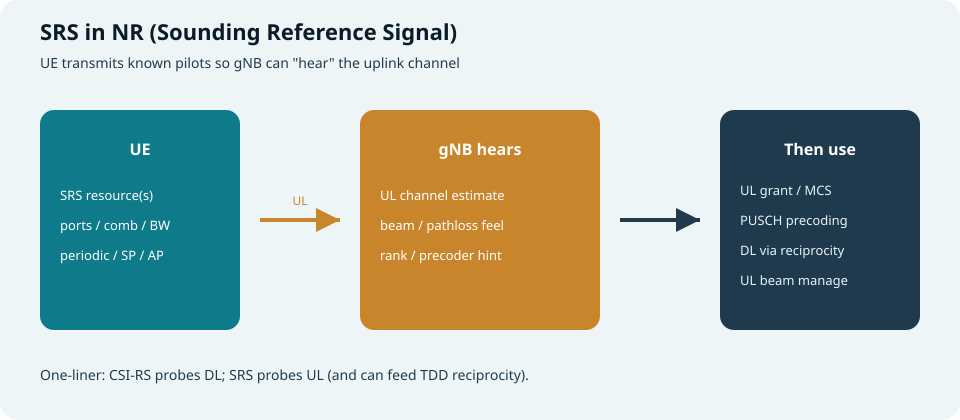
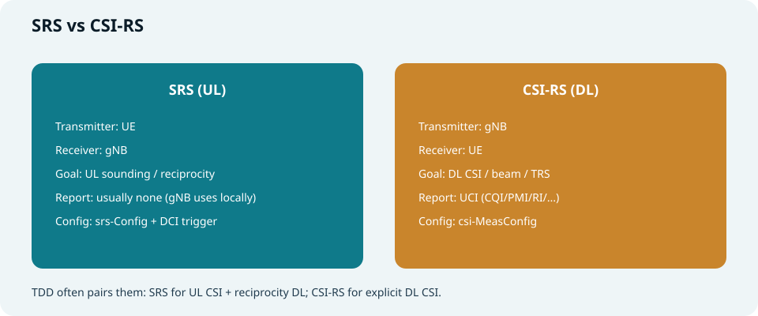
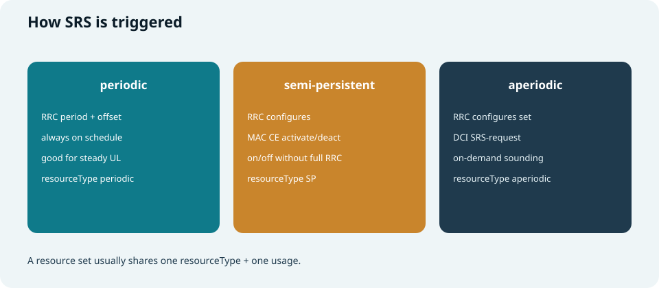
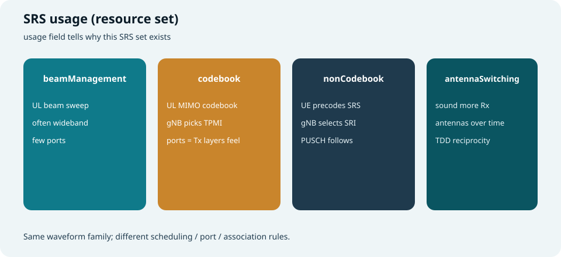
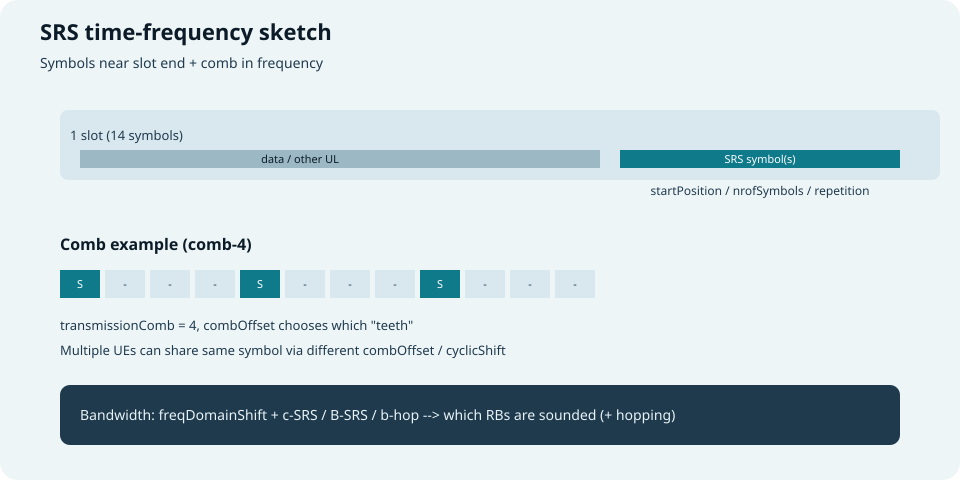
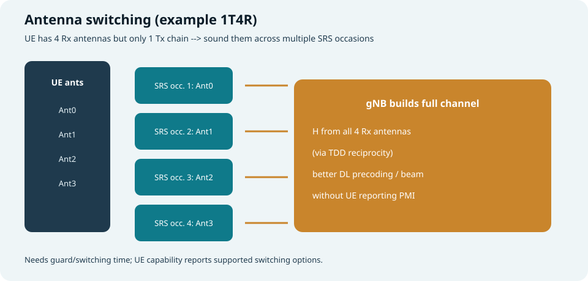
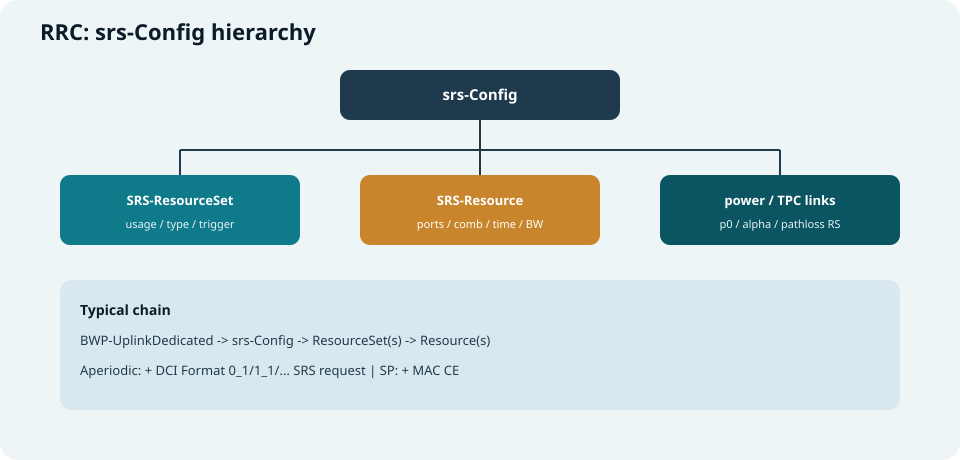

## 本篇要解决什么

下行有 CSI-RS 帮 gNB「摸清下行信道」；上行同样需要探针：

**SRS（Sounding Reference Signal，探测参考信号）** —— UE 按配置发出已知序列，**gNB 在本地估计上行信道**。

本篇讲清：SRS 干什么、时频怎么占、怎么触发与工作、按 usage 如何分类、关键参数与 RRC、`UE capability`、以及 **antenna switching**。

对照：**TS 38.211**（序列与映射）、**38.213**（功率等过程）、**38.214**（PUSCH 与 SRS 关联）、**38.331**（`srs-Config`）。  
相关：[NR CSI-RS](nr-csi-rs.html)、[NR DMRS](nr-dmrs.html)、[PUCCH 与 PUSCH](pucch-pusch.html)、[DCI 与 UCI](dci-uci.html)、[Power Control](nr-power-control.html)、[NR RRC](nr-rrc-reconfiguration.html)、[Antenna Port / QCL](antenna-port-qcl-resource-grid.html)。



*图：UE 发 SRS → gNB 听信道 → 用于调度 / 预编码 / 互易 / 波束*

---

## SRS 是什么、起什么作用

| 要点 | 说明 |
| --- | --- |
| **谁发** | **UE**（上行） |
| **谁用** | **gNB** 本地做信道估计（通常不要求 UE 再报一份“SRS-CSI”） |
| **已知性** | 序列由小区/UE 参数可推导，便于相关检测 |
| **和数据关系** | 可与 PUSCH **解耦**（单独 sounding），也可通过配置与 PUSCH 预编码策略绑定 |

**典型用途：**

1. **上行链路自适应**：估频选、MCS、RB 分配、功率策略  
2. **UL MIMO**：codebook / non-codebook 预编码选择（TPMI / SRI）  
3. **TDD 信道互易（reciprocity）**：用上行信道推下行（尤其配合 antenna switching）  
4. **上行波束管理**：扫 UE 发射波束 / 面板  
5. **定位等扩展**（版本相关，本篇以接入与 MIMO 主线为主）

> 口诀：**CSI-RS 摸下行；SRS 摸上行；TDD 还可借 SRS 推下行。**

---

## SRS vs CSI-RS vs DMRS



*图：方向相反——一个 DL 探针，一个 UL 探针*

| 维度 | **SRS** | **CSI-RS** | **DMRS** |
| --- | --- | --- | --- |
| 方向 | **UL** | **DL** | 随信道（UL/DL） |
| 目的 | 探测 / 互易 / UL 波束 | CSI / 波束 / TRS | **解调本次传输** |
| 输出 | gNB 本地信道估计 | UE 测量 + **UCI 上报** | 信道估计 → 解 TB/DCI |
| 配置入口 | `srs-Config` | `csi-MeasConfig` | 随 PDSCH/PUSCH… |

排障时别混：  
- 「下行 CQI 不对」先查 CSI-RS / 上报；  
- 「上行调度/预编码离谱」先查 SRS 是否发到、带宽/端口是否够；  
- 「解不出这一包」查 DMRS。

---

## 怎么工作：端到端故事

```text
RRC 配 srs-Config
  ├─ ResourceSet（usage + 触发类型 + 资源列表）
  └─ Resource（端口/comb/时域/频域/序列…）
        │
        ├─ periodic：按 period/offset 自己发
        ├─ semi-persistent：MAC CE 激活后按周期发
        └─ aperiodic：DCI SRS-request 触发后发
        │
gNB 接收 → 估 H_ul →
  ├─ 排 UL grant / MCS / 波束
  ├─ 选 TPMI 或 SRI（看 usage）
  └─ TDD：互易推 H_dl（可配合 antenna switching）
```

**与 PUSCH 的衔接（直觉）：**

| usage | gNB 从 SRS 得到什么 | 常见后续 |
| --- | --- | --- |
| **codebook** | 各端口信道，匹配码本 | DCI 指示 **TPMI**（及层数） |
| **nonCodebook** | 各候选预编码后的等效信道 | DCI 指示 **SRI**（选哪组 SRS） |
| **beamManagement** | 各波束质量 | 更新 UL 空间关系 / 波束 |
| **antennaSwitching** | 多接收天线维度的信道 | 互易 DL 预编码 / 波束 |

功率：SRS 有独立开环（P0、α、pathloss RS）与闭环 TPC，见 [Power Control](nr-power-control.html)。

---

## 分类一：触发方式（resourceType）



*图：周期 / 半持续 / 非周期三条触发路径*

| 类型 | 谁决定“现在发” | 特点 |
| --- | --- | --- |
| **periodic** | RRC：`periodicityAndOffset` | 稳定、开销可预期 |
| **semi-persistent (SP)** | RRC 配 + **MAC CE** 激活/去激活 | 比改 RRC 快，比 DCI 省开销 |
| **aperiodic** | RRC 配集合 + **DCI SRS request** | 按需探测，灵活 |

一个 **SRS-ResourceSet** 通常绑定一种 `resourceType` 与一种 `usage`。  
非周期时，DCI 里的 SRS request 码点映射到「触发哪个/哪些 set」（RRC 事先配好映射）。

---

## 分类二：用途（usage）



*图：同一套波形家族，任务不同*

### 1) beamManagement

- 目标：上行 **波束 / 面板** 选择与维护  
- 常见：较宽带宽、较少端口、多个 resource 对应不同空间关系  
- 与 `spatialRelationInfo`、上行 TCI/空间关系（版本相关）联动  

### 2) codebook

- 面向 **基于码本的 UL MIMO**  
- UE 按端口发 SRS（不按最终 PUSCH 预编码“拧”死）  
- gNB 估信道后从码本选 **TPMI**，在 UL grant 里告诉 UE  

### 3) nonCodebook

- 面向 **非码本 UL MIMO**  
- UE 可用不同预编码发多条 SRS（候选“虚拟天线/流”）  
- gNB 选最好的组合，用 **SRI（SRS Resource Indicator）** 指示  
- PUSCH 预编码与被选中的 SRS 关联  

### 4) antennaSwitching

- 专为 **Tx 天线数 < Rx 天线数** 的终端补齐互易信息（见后文专节）  
- RRC / 能力里会出现 `1T2R`、`2T4R`、`1T4R` 等切换选项  

> 学习顺序建议：先分清 **trigger**，再分清 **usage**，最后抠时频参数。

---

## 时频资源：SRS 长什么样



*图：靠后符号 + 频域梳状（comb）*

### 时域

| 概念 | 直觉 |
| --- | --- |
| **落点** | 多在 **时隙靠后的 OFDM 符号**（给前面留 PUSCH/PUCCH 等） |
| **startPosition** | 相对时隙末/约定参考的起始符号位置 |
| **nrofSymbols** | 连续占几个符号（1/2/4 等，视配置） |
| **repetitionFactor** | 同一资源在时域上重复，利于估计/覆盖 |
| **与其它 UL 冲突** | 同符号可能与 PUSCH/PUCCH 冲突 → 按优先级/打孔/丢弃规则处理 |

### 频域：Comb（梳状）

SRS **不是占满所有子载波**，而是按 **comb** 抽样：

| 参数 | 含义 |
| --- | --- |
| **transmissionComb** | 梳齿间隔，常见 **2** 或 **4** |
| **combOffset** | 落在哪一组“齿”上（多 UE 可错开） |
| **cyclicShift** | 循环移位，同一 comb 上再区分端口/UE |

好处：同符号可 **复用** 多个 SRS；代价是频域抽样，带宽配置要够才能“听全”。

### 频域：带宽与跳频

SRS 带宽由一套查表/参数决定（规范记法常见 \(C_{SRS}\)、\(B_{SRS}\)、\(b_{hop}\) 等）：

| 概念 | 直觉 |
| --- | --- |
| **频域起点** | `freqDomainShift` 等把 sounding 锚到 BWP 内某处 |
| **c-SRS / B-SRS** | 决定 sounding **带宽树**（多宽、分几层） |
| **b-hop** | 是否/如何在带宽树里 **跳频**，用时间换完整带宽感知 |
| **freqHopping** | 开启后，不同周期 occasion 扫不同子带 |

> 排障口诀：**听不全 = comb 太稀或带宽树太窄/跳频没配好；互相撞 = combOffset/cyclicShift/符号重叠。**

### 端口与序列

| 概念 | 直觉 |
| --- | --- |
| **nrofSRS-Ports** | 1/2/4… 端口数，支撑 UL MIMO / 切换场景 |
| **序列** | 由小区 ID、序列 ID（`sequenceId`）等生成；端口间用 CS/OCC 等正交 |
| **groupOrSequenceHopping** | 抗干扰的组/序列跳变 |

---

## 关键参数定义（学习清单）

按「从大到小」记：

### ResourceSet 级

| 参数（名随 ASN.1） | 含义 |
| --- | --- |
| **srs-ResourceSetId** | 集合 ID |
| **usage** | beamManagement / codebook / nonCodebook / antennaSwitching |
| **resourceType** | periodic / semi-persistent / aperiodic |
| **srs-ResourceIdList** | 本集合包含哪些 Resource |
| **alpha / p0 / pathloss** | 功率控制关联（可与 PUSCH 分开） |
| **aperiodicSRS-ResourceTrigger** | 非周期时与 DCI 码点的映射相关 |
| **slotOffset** 等 | 触发后延迟多少 slot 发送（非周期常见） |

### Resource 级

| 参数 | 含义 |
| --- | --- |
| **srs-ResourceId** | 资源 ID（SRI 等指示可能引用） |
| **nrofSRS-Ports** | 端口数 |
| **transmissionComb / combOffset / cyclicShift** | 梳状与正交 |
| **resourceMapping** | startPosition、nrofSymbols、repetition |
| **freqDomainShift / freqHopping / c-SRS…** | 频域位置与跳频 |
| **periodicityAndOffset** | 周期与帧内偏移（周期/SP） |
| **sequenceId** | 序列扰动 |
| **spatialRelationInfo** | 与 SSB/CSI-RS/另一 SRS 的空间关系（波束） |

具体枚举与取值范围以 **38.331 / 38.211** 为准；上手时先能解释「这一项改了，声音在时频上哪里变」。

---

## Antenna Switching（天线切换）



*图：1T4R——分多次 SRS 把 4 根接收天线都“探”一遍*

### 为什么需要

很多 UE：**下行能用更多接收天线，上行发射链路更少**（省功放/成本）。  
TDD 互易若只听「当前 Tx 天线」，gNB 看不到其它 Rx 天线的信道 → **DL 预编码吃亏**。

**Antenna switching**：在不同 SRS 时机，把仅有的 Tx 链路切到不同天线上发 SRS，让 gNB **拼出完整信道矩阵**。

### 常见能力选项（名称示意）

| 选项 | 直觉 |
| --- | --- |
| **1T2R** | 1 发 2 收，两次（或按规范 occasion）切换 sounding |
| **1T4R** | 1 发 4 收 |
| **2T4R** | 2 发 4 收（仍需切换补齐） |
| **t1r2 / t1r4…** | 能力信元里的具体枚举，以 38.306 为准 |

### 工程注意

- **切换时间 / 保护间隔**：切换不能瞬间完成，规范与能力要匹配  
- **usage = antennaSwitching** 的 ResourceSet 与普通 codebook set **不要混用语义**  
- 与 **功率、PCMAX、多面板** 叠加时，可能影响可发时机  
- FDD 互易弱，切换收益主要在 **TDD**  

---

## UE 能力（capability）里看什么

接入后 gNB 要知道「这台 UE 的 SRS 能玩多花」——能力来自 **UE Capability**（如 `Phy-Parameters` / `RF-Parameters` 等，版本与结构随 38.306）。

学习时抓住这些维度：

| 能力维度 | 问的是什么 |
| --- | --- |
| **支持的 SRS 资源 / 集合数量** | 能同时配多少 periodic/SP/AP |
| **最大端口数** | 1/2/4… |
| **comb-2 / comb-4** | 支持的梳状 |
| **aperiodic / SP** | 是否支持非周期、半持续 |
| **antenna switching 选项** | 1T2R、1T4R、2T4R… |
| **带宽 / 跳频 / 符号数** | 时频灵活度 |
| **与 CA / BWP / SUL** | 多载波下 SRS 约束 |
| **beamManagement SRS** | 波束管理相关限制 |

> 配置原则：**RRC 配的集合，不得超过 UE 声明的能力**；否则 UE 行为未定义或直接不发。

---

## RRC 参数树（`srs-Config`）



*图：挂在上行 BWP 专用配置下的 SRS 配置树*

### 挂载位置（直觉）

```text
CellGroup / BWP-UplinkDedicated
  └── srs-Config
        ├── srs-ResourceSetToAddModList / ToReleaseList
        ├── srs-ResourceToAddModList / ToReleaseList
        └── （功率、TPC 等关联配置，视版本）
```

也常见与 **PUSCH-Config**（codebook/nonCodebook）、**CSI 互易假设**、**spatialRelation** 交叉引用。

### 触发侧对照

| 路径 | 关键消息 |
| --- | --- |
| 半持续 | **MAC CE**：SP SRS 激活/去激活 |
| 非周期 | **DCI**（如 UL DCI）中的 **SRS request** 字段 |
| 周期 | 仅 RRC 即可，按 period/offset 发 |

### 与空间关系

`spatialRelationInfo` 可把某 SRS Resource 绑到：

- 某个 **SSB**  
- 某个 **CSI-RS**  
- 另一个 **SRS**  

含义：发这个 SRS 时，尽量用与参考信号 **相同的空间域滤波器（波束）**——波束管理与一致性的关键旋钮。

---

## 和调度、DCI 的接口（实用）

| 场景 | 常见指示 |
| --- | --- |
| codebook PUSCH | DCI：**precoding information / TPMI**，依赖 codebook SRS |
| nonCodebook PUSCH | DCI：**SRI**，选中某些 SRS Resource |
| 非周期探测 | DCI：**SRS request** |
| 功率 | DCI：**TPC command for SRS**（或组 TPC，视格式） |

配置授权（CG）场景也可能关联 SRS，细节见 38.213/38.321 与实现。

---

## 排障抓手

| 现象 | 优先怀疑 |
| --- | --- |
| gNB 几乎估不到 UL | SRS 没配 / 没激活 / DCI 未触发；功率过低；BWP 不对 |
| 只有部分带宽“听得见” | \(B_{SRS}\)/跳频/ BWP 宽度 |
| UE 互干扰、检测差 | combOffset / cyclicShift / 符号冲突 |
| UL MIMO 阶数上不去 | 端口数、usage、能力、天线切换未配 |
| TDD DL 互易差 | 未开 antennaSwitching 或切换能力不匹配 |
| 有时有、有时无 | SP 未激活；AP 触发时机与 slotOffset；与 PUCCH/PUSCH 优先级冲突 |

---

## 快速自测

1. SRS 与 CSI-RS、DMRS 各解决什么问题？  
2. periodic / SP / aperiodic 分别谁“按下发射键”？  
3. comb-4 + combOffset 如何实现多 UE 复用？  
4. codebook 与 nonCodebook 在指示上有何不同（TPMI vs SRI）？  
5. 为什么 1T4R 需要 antenna switching？FDD 是否同样迫切？  
6. `srs-Config` 下 ResourceSet 与 Resource 如何分工？  
7. UE capability 里若声明不支持 AP SRS，RRC 仍配 aperiodic 会怎样？  

---

## 一句话

**SRS = UE 按梳状时频发出的上行探针；用 trigger 决定何时发、用 usage 决定 gNB 拿它干什么；参数决定听得多宽多细，antenna switching 补齐“少发多收”的互易拼图，一切落在 `srs-Config` 与能力约束里。**

### 延伸阅读

- [NR CSI-RS](nr-csi-rs.html)  
- [NR DMRS](nr-dmrs.html)  
- [PUCCH 与 PUSCH](pucch-pusch.html)  
- [Power Control](nr-power-control.html)  
- [NR RRC 与 RRCReconfiguration](nr-rrc-reconfiguration.html)  
- [Massive MIMO 与波束赋形](massive-mimo-beamforming.html)  

---

## 延伸阅读（推荐学习站）

对照本篇后，建议打开：

- [ShareTechnote — 5G SRS](https://www.sharetechnote.com/html/5G/5G_SRS.html)

用于核对：Resource / ResourceSet、comb 与带宽、周期/半持续/非周期触发、usage 与 antenna switching 等图示与字段级说明。
