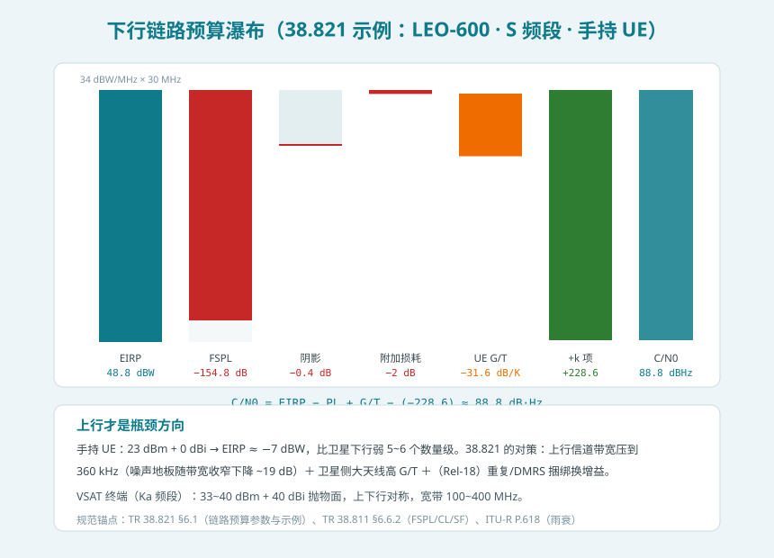
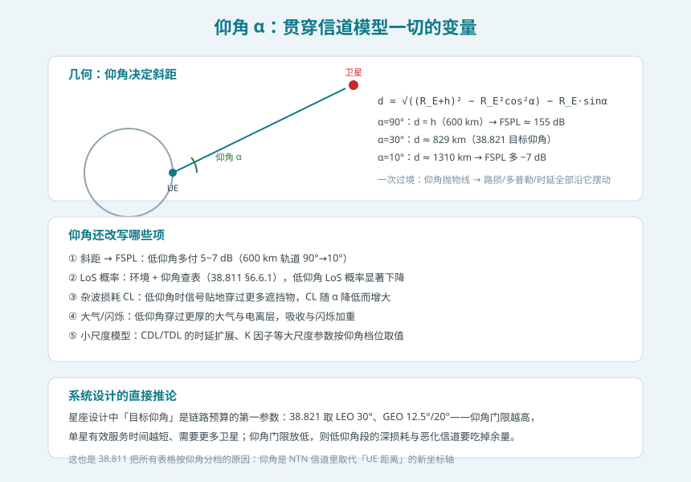
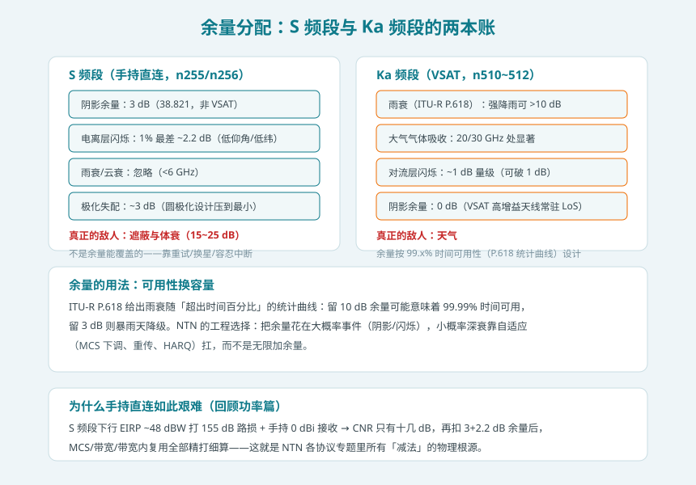

## 本篇要解决什么

前面十一篇专题反复出现同一类句子：「长 RTT 导致……」「大 Doppler 导致……」「链路预算紧张所以……」。这些减法的**源头**至今没有正式登场：155 dB 量级的自由空间路损、以仰角为坐标轴的信道模型、S 频段与 Ka 频段完全不同的余量账本。本篇把账本摊开——**理解了链路预算，前面所有协议设计的「为什么」就都有了物理注脚。**

先说结论：**NTN 信道是「LoS 主导的准静态大路损信道」——路损比地面多 40~90 dB 但变化极慢（分钟级几何量），快衰落被预补偿驯服；链路预算的瓶颈在上行手持方向，所有协议减法（360 kHz 上行、重复传输、低 MCS、32 进程 HARQ）都是这道算术的直接后果。**

对照：**TR 38.811**（信道模型：§6.6 大尺度、§6.7 快衰落、§6.9 CDL/TDL、§6.8.2 法拉第旋转）、**TR 38.821 §6.1**（链路预算参数与示例）、**ITU-R P.618**（雨衰统计）、**ITU-R P.676**（大气气体）、**TS 38.101-5**（终端 RF）。

相关：[NTN 功率控制](ntn-power.html)（链路预算的下行消费方）、[NTN 随机接入](ntn-rach.html)（上行瓶颈的第一次偿还）、[NTN 轨道与系统架构](5g-ntn.html)（仰角与轨道几何的上游）、[NTN RLM/BFM](ntn-rlm-bfm.html)（遮蔽劣化的兜底）。

---

## 一、38.811 大尺度模型：一条链路，五笔损耗

TR 38.811 把总路损拆成可分别建模的五笔（§6.6.2）：

$$\text{PL} = \text{PL}_b + \text{PL}_g + \text{PL}_s \ (+\ \text{PL}_e)$$

其中基本路损 $\text{PL}_b = \text{FSPL} + \text{CL}(\alpha, f_c) + \text{SF}$——自由空间路损、杂波损耗、阴影衰落三项之和；$\text{PL}_g$ 是大气气体吸收、$\text{PL}_s$ 是闪烁（电离层或对流层）、$\text{PL}_e$ 是建筑入射损耗（O2I）。逐笔看：

| 损耗项 | 模型 | NTN 特点 |
| --- | --- | --- |
| FSPL | 92.45 + 20lg(d_km) + 20lg(f_GHz) | 绝对主角：LEO-600 天顶 ≈155 dB，比地面宏站多 ~40 dB |
| 杂波损耗 CL(α, f_c) | 按环境 × 仰角 × 频率查表 | 信号贴地穿过的遮挡物；**LoS 条件下置 0** |
| 阴影衰落 SF | 对数正态 N(0, σ_SF²) | 标准差按环境/仰角查表；空间相关距离远大于地面 |
| 大气气体 | P.676 依赖频率/仰角/湿度 | <10 GHz 基本忽略（低仰角除外） |
| 闪烁 | 电离层（L/S）与对流层（Ka）分账 | 电离层 1% 最差 ~2.2 dB；对流层 ~1 dB |

与地面信道模型的三个**结构差异**值得单独强调：

1. **角度扩展趋近零**。卫星远在数百至数万公里外，各多径几乎平行到达——地面模型里重要的到达角/离开角统计在 NTN 里近乎退化，大尺度参数的驱动变量从「UE 距离」换成了**仰角**。
2. **雨衰在 S 频段缺席**。6 GHz 以下雨衰/云衰可忽略——S 频段账本里没有天气，Ka 频段天气是最大单项。同一份「NTN」，两个频段是两本账。
3. **法拉第旋转**。L/S 频段电波穿越电离层时极化面旋转，线极化失配可达严重程度——NTN 系统因此采用**圆极化**（LHCP/RHCP），把极化失配压到 ~3 dB 以内。

---

## 二、小尺度：LoS 主导的准静态信道

快衰落建模（38.811 §6.7/§6.9）提供两条路：

- **频率选择性模型**：沿用地面 CDL/TDL 框架，但时延扩展、K 因子等参数按 NTN 几何重新取值、按仰角分档——NTN 专用 CDL/TDL 系列；
- **两态平坦衰落模型**：LoS 态（K 因子大，信道近乎恒定）+ NLoS 态，适合 S 频段、高仰角、近 LoS 的简化仿真。

工程视角的关键认知是：**NTN 信道的时间结构与地面几乎相反**。地面是「路损稳、快衰落狂跳」；NTN 是「快衰落被 LoS 主导 + 预补偿驯服后近乎静态，真正的变化来自分钟级的几何演化（仰角抛物线）」。这解释了前面多篇专题的现象：CQI 老化不敏感（[测量篇](ntn-measurement-csi.html)）、HARQ 盲重传可行（[HARQ 篇](ntn-harq.html)）、CHO 可以提前几十秒规划（[移动性篇](ntn-mobility.html)）。

---

## 三、链路预算一页账：155 dB 的瀑布

链路预算的核心公式只有一行：

$$C/N_0 = \text{EIRP} - \text{PL} + G/T - k, \quad k = -228.6 \ \text{dBW/(K·Hz)}$$

用 38.821 的下行示例（LEO-600、S 频段、手持 UE、乡村 LoS、天顶）走一遍瀑布：

| 步骤 | 数值 | 说明 |
| --- | --- | --- |
| 卫星 EIRP | 48.8 dBW | 34 dBW/MHz × 30 MHz 载波 |
| FSPL | −154.8 dB | 600 km 天顶 |
| 阴影 + 附加损耗 | −2.4 dB | 乡村 LoS 阴影 ~0.4 dB + 附加 ~2 dB |
| UE G/T | −31.6 dB/K | 0 dBi 天线 + 7 dB 噪声系数 |
| **C/N₀** | **≈ 88.8 dB·Hz** | EIRP−PL+G/T+228.6 |
| **CNR（30 MHz）** | **≈ 14~16 dB** | 88.8 − 10lg(30 MHz) |

十几 dB 的 CNR 意味着：中阶 MCS 可以跑，但**没有任何挥霍空间**——每再扣 3 dB 阴影余量，MCS 就要降一档。这就是 [功率控制篇](ntn-power.html)「预算管理」的量化注脚。

**上行才是瓶颈方向。** 手持 UE 的 EIRP ≈ 23 dBm + 0 dBi = −7 dBW，比卫星下行弱 5~6 个数量级。38.821 的对策是三管齐下：

1. **上行信道带宽压到 360 kHz**（S 频段手持）：噪声地板随带宽收窄下降约 19 dB，直接换取每 Hz 的 C/N₀——这是 NTN 所有窄带设计的根源；
2. **卫星侧大天线高 G/T**：星载大口径阵列在 S 频段提供数十 dBi 增益；
3. **用时间换增益**：Rel-18 的 PUCCH/PUSCH 重复、DMRS 捆绑（对抗 Doppler 相位噪声）——与 IoT-NTN 的重复传输同源。

VSAT 终端（Ka 频段）则完全对称：33~40 dBm + 40 dBi 抛物面，上下行都能撑 100~400 MHz 宽带。

---

## 四、仰角：贯穿一切的变量

地面信道模型以「UE 到基站的距离」为第一坐标轴；NTN 换成了**仰角 α**。斜距公式 $d = \sqrt{(R_E+h)^2 - R_E^2\cos^2\alpha} - R_E\sin\alpha$ 把仰角翻译成路损：600 km 轨道上，天顶 90° 对应 155 dB，10° 仰角对应约 1310 km 斜距、多付 ~7 dB。

但仰角的账不止这一笔——它是五个模型的公共输入：

| 模型 | 仰角如何介入 |
| --- | --- |
| FSPL | 斜距随仰角拉长，低仰角多付 5~7 dB |
| LoS 概率 | 低仰角时信号更易被地貌遮挡，LoS 概率下降 |
| 杂波损耗 | 低仰角贴地穿越更多遮挡，CL 增大 |
| 大气/闪烁 | 穿过更厚的大气与电离层，损耗加重 |
| CDL/TDL | 时延扩展、K 因子等按仰角档位取值 |

一次过境中 UE 的仰角走一条抛物线——路损、多普勒、时延、LoS 概率全部沿它摆动。系统设计里「**目标仰角**」因此成为第一参数（38.821：LEO 30°、GEO 12.5°/20°）：门限抬高，单星服务窗口缩短、需要更多卫星补网；门限放低，低仰角段的深损耗吃掉余量。这是覆盖、成本、质量的三角权衡。

---

## 五、余量分配：两本完全不同的账

链路预算最后一行是余量——留多少，决定了链路的「时间可用性」。S 频段与 Ka 频段的账本结构完全不同：

**S 频段（手持直连）**：38.821 配置阴影余量 3 dB、电离层闪烁 1% 最差 2.2 dB、雨衰忽略。但真正的敌人是**遮蔽与体衰**（15~25 dB）——这不是余量能覆盖的量级，协议层的应对是容忍中断（重试、换星、RLF 兜底），而不是把余量堆到 25 dB。

**Ka 频段（VSAT）**：雨衰（P.618 统计曲线，强降雨 >10 dB）成为最大单项，大气吸收与对流层闪烁各占 ~1 dB 量级；VSAT 高增益天线常驻 LoS，阴影余量反而配 0 dB。余量按「99.x% 时间可用性」的统计口径设计——多留余量就是花容量买晴天。

统一的工程哲学：**余量花在大概率的小损耗（阴影、闪烁），小概率的深衰交给自适应（MCS 下调、重传、HARQ）去扛**。无限加余量等于永久降 MCS，得不偿失。

---

## 六、实务清单：链路预算的五个易错点

1. **用天顶路损配低仰角业务**：目标仰角 30° 时斜距已比天顶多 ~10%（600 km 轨道），按天顶算出的余量在低仰角段不够付。
2. **S/Ka 余量混用**：把 Ka 的雨衰账搬到 S 频段（白付），或把 S 的「无雨衰」乐观搬到 Ka（暴雨日灾难）。
3. **手持上行按宽带算**：360 kHz 上行是设计基线，按系统带宽算噪声地板会凭空「丢」十几 dB。
4. **忽略极化账**：线极化假设在 L/S 频段会被法拉第旋转惩罚；圆极化失配 ~3 dB 应计入预算。
5. **LoS 乐观主义**：LoS 概率是统计量不是保证——城市峡谷与室内场景按 NLoS + O2I 单独算账，杂波损耗与建筑入射不能省。

---

## 七、自测题

1. 写出 38.811 的总路损分解式，并说明每一项在 LoS/低仰角/Ka 频段三种条件下的行为变化。
2. 为什么 NTN 大尺度参数的驱动变量从「距离」换成了「仰角」？角度扩展趋近零对小尺度建模意味着什么？
3. 用 38.821 下行示例从 EIRP 算到 CNR：48.8 dBW 的 EIRP 打 155 dB 路损，为什么最终 CNR 只剩十几 dB？缺的那 40 dB 去哪了？
4. 手持上行 EIRP 比下行弱 5~6 个数量级，NTN 靠哪三招把上行补回来？其中「360 kHz」的数学依据是什么？
5. 一次 LEO 过境中，UE 仰角从 10° 升到 90° 再回落：路损、LoS 概率、多普勒、杂波损耗各沿什么轨迹变化？
6. S 频段和 Ka 频段的「最大敌人」分别是什么？为什么遮蔽 25 dB 不做进余量而雨衰 10 dB 要做进余量？
7. 解释「余量花在大概率小损耗，深衰交给自适应」这句话背后的可用性-容量权衡。

---

## 小结

- **大尺度五件套**：FSPL（主角，~155 dB）+ 杂波 + 阴影 + 大气 + 闪烁；LoS 时杂波清零；S 频段无雨衰、Ka 频段雨衰最大；L/S 频段法拉第旋转逼出圆极化设计。
- **小尺度反转**：LoS 主导 + 预补偿让快衰落近乎静态，分钟级几何演化才是主变量——NTN 信道是「慢变化的深路损信道」，与地面「稳定路损下的狂跳快衰落」结构相反。
- **仰角是新坐标轴**：斜距、LoS 概率、杂波、大气、TDL 参数五个模型共用它；目标仰角是星座设计的第一权衡。
- **一页账**：C/N₀ = EIRP − PL + G/T + 228.6；下行 CNR 十几 dB 只够中阶 MCS；上行靠 360 kHz 窄带 + 卫星高 G/T + 重复传输补 5~6 个数量级的鸿沟。
- **两本余量账**：S 频段防阴影/闪烁/遮蔽（3+2.2 dB 余量、深衰靠容忍），Ka 频段防天气（P.618 统计曲线、可用性换容量）。

下一篇预告：**Rel-18 NTN 增强全集**——把散落在前十二篇里的 r18 字段（Ka 频段、gap 内读 SI、上行覆盖增强、TN/NTN 移动性、位置验证）串成一张演进地图。
