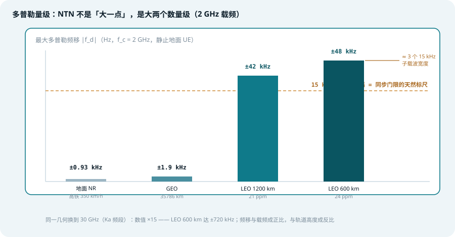
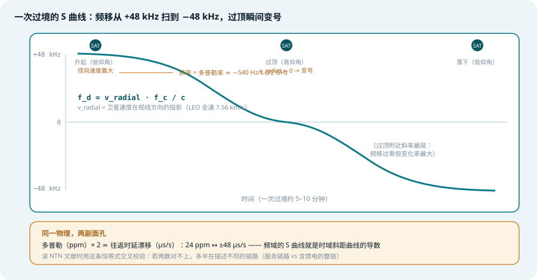
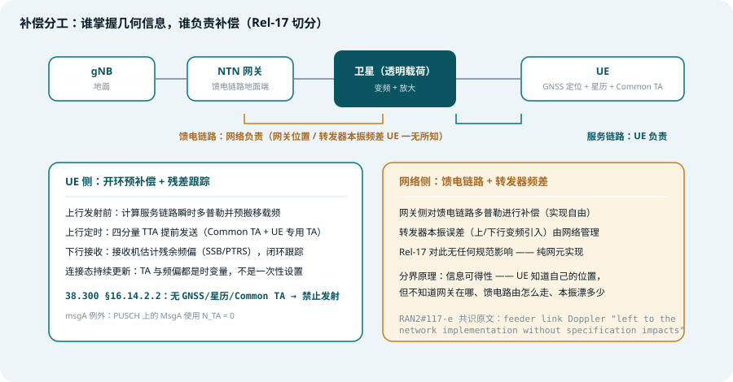
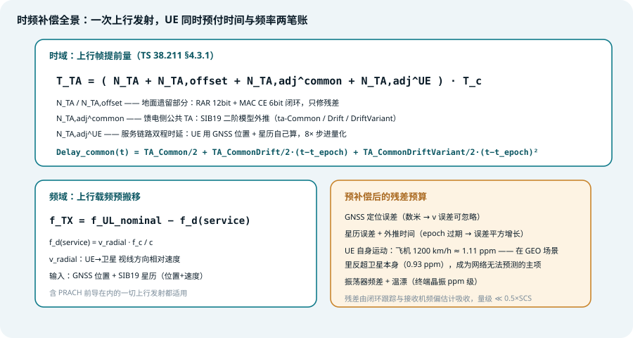

## 本篇要解决什么

[NTN 综合专题](5g-ntn.html)讲了要补偿什么，[SIB19 专题](ntn-sib19.html)讲了参数从哪广播下来，[随机接入专题](ntn-rach.html)讲了 UE 第一次开口之前必须先算清的那笔几何账。本篇把这笔账本身摊开：**多普勒与时延补偿的物理、公式、分工与残差**。

时延与多普勒在 NTN 里不是两个独立问题，而是**同一个物理量在两个域的投影**：卫星的径向速度既推着载频跑（多普勒），也拖着传播时延走（时延漂移）。理解了这一点，整个 Rel-17 补偿架构——UE 补服务链路、网络补馈电链路、闭环只修残差——就成了一条信息可得性原则的自然推论。

对照：**TS 38.300 §16.14.2.2**（TA 与频率预补偿的总纲）、**TS 38.211 §4.3.1**（TTA 公式）、**TS 38.213 §4.2**（各分量计算）、**TR 38.811 §5.3**（多普勒量级与变化率）、**TR 38.821 §7**（场景参数表）。
相关：[5G NTN 综合专题](5g-ntn.html)、[NTN SIB19](ntn-sib19.html)、[NTN 随机接入](ntn-rach.html)、[NTN UE 能力](ntn-ue-capability.html)、[NTN 再生载荷](ntn-regenerative-payload.html)。

---

## 一、量级：±48 kHz 不是「大一点」，是大两个数量级

*图 1：同一 2 GHz 载频下的最大多普勒频移——LEO 600 km 的 ±48 kHz 是地面高铁场景的 50 倍以上，横跨 3 个 15 kHz 子载波*

| 场景（静止地面 UE） | 多普勒（ppm） | @2 GHz（S 波段） | @30 GHz（Ka 波段） | 变化率 @2 GHz |
| --- | --- | --- | --- | --- |
| 地面 NR（高铁 350 km/h） | ~0.46 | ±0.93 kHz | ±14 kHz | 慢到无需建模 |
| GEO | 0.93 | ±1.9 kHz | ±28 kHz | ~0（有效静止） |
| LEO 1200 km | 21 | ±42 kHz | ±630 kHz | ≈ 0.43 ppm/s（860 Hz/s） |
| LEO 600 km | 24 | ±48 kHz | ±720 kHz | ≈ 0.27 ppm/s（540 Hz/s） |

三个读数值得停一下：

1. **48 kHz ÷ 15 kHz = 3.2 个子载波**。初始小区搜索靠 PSS/SSS 相关，容许的频差大约是半个子载波间隔（几 kHz）。一个不做预补偿的 UE 在 S 波段找 LEO 小区，不是「测不准」，是**根本找不到小区**——相关峰整个被抹掉。
2. **ppm 是几何属性，Hz 是频段属性**。24 ppm 描述的是 LEO 600 km 的轨道几何；换到 Ka 波段绝对值 ×15，直达 ±720 kHz。这也是 Rel-18 把 NTN 扩到 FR2（Ku/Ka，VSAT 终端）时多普勒问题被重新放大的原因。
3. **变化率同样致命**。540 Hz/s 意味着频偏在几秒内扫过整个同步容限——预补偿必须是**连续跟踪的过程**，不能是一次性设置。

---

## 二、多普勒从哪来：一次过境的 S 曲线

*图 2：LEO 一次过境约 5–10 分钟：升起时以最大径向速度接近（正频移），过顶瞬间视线速度归零（频移变号），落下时对称地远离（负频移）*

多普勒频移由一个公式支配：

\[ f_d = \frac{v_{\text{radial}} \cdot f_c}{c} \]

其中 \(v_{\text{radial}}\) 是卫星速度在「卫星→UE 视线」方向的投影。LEO 卫星全速约 7.56 km/s，但只有视线方向的分量才产生频移：

- **低仰角（升起/落下）**：卫星几乎正对着你冲过来或远离，径向分量接近全速 → 频移打满 ±48 kHz
- **高仰角（过顶）**：卫星从头顶横向掠过，径向分量过零 → **频移变号**，但此刻斜距最短、斜距变化率（即多普勒的导数）反而最陡
- 一条完整的过境曲线是标准 **S 形**：半个正扫、过零、半个负扫

### 同一物理，两副面孔

这张 S 曲线里藏着 NTN 最优雅的一个恒等式：

\[ \text{往返时延漂移}(\mu s/s) \approx 2 \times \text{多普勒}(\text{ppm}) \]

24 ppm 的径向速度意味着每秒单程路径变化 24 μs 的传播时间，双程就是 ~48 μs/s——与 TR 38.821 表里 LEO 再生场景 ±47.6 μs/s、透明转发场景 ±93 μs/s（多一条运动链路所以再翻倍）严丝合缝。**频域的 S 曲线就是时域斜距曲线的导数**。读任何 NTN 文献，拿这条恒等式交叉校验：若两个数对不上 2 倍关系，多半是在描述不同的链路。

这也是为什么 [SIB19](ntn-sib19.html) 的 `ta-CommonDrift`（时延漂移）与星历速度矢量（多普勒之源）是同一份数据的两种编码——网络广播星历，UE 同时解出时间和频率两本账。

---

## 三、补偿架构：谁掌握几何，谁负责补偿

*图 3：Rel-17 的切分——UE 预补偿服务链路（上行发射的全部时频偏移），网络兜底馈电链路与转发器频差*

TS 38.300 §16.14.2.2 的规定可以浓缩成一张分工表：

| 补偿对象 | 负责方 | 信息来源 | 规范化程度 |
| --- | --- | --- | --- |
| 服务链路多普勒（上行） | **UE** | GNSS 位置 + SIB19 星历 | 规范强制，开环预补偿 |
| 服务链路时延（上行） | **UE** | GNSS 位置 + 星历 + Common TA | 规范强制，TTA 公式 |
| 馈电链路多普勒 | **网络** | 网关位置 + 星历 | 实现自由，无规范影响 |
| 转发器本振频差 | **网络** | 载荷设计参数 | 实现自由 |
| 下行残余频偏 | **UE 接收机** | SSB/PTRS 频偏估计 | 接收机实现 |

切分逻辑只有一条：**信息可得性**。UE 知道自己在哪（GNSS）、卫星在哪（星历），所以服务链路的几何它算得出；但 UE 不知道网关架在哪、馈电路由怎么走、载荷本振漂了多少——这些只有网络自己知道。RAN2#117-e 的共识写得很直白：馈电链路多普勒 "left to the network implementation without any specification impacts in Release 17"。

两个容易被忽略的细节：

- **下行方向规范没有规定预补偿**。下行频偏由 UE 接收机的频偏估计（基于 SSB 的粗估 + PTRS 的细跟踪）闭环消化——这与上行「先算后发」的开环模式形成对照。
- **不补偿就不准发**。38.300 原文：UE 若没有有效的 GNSS 位置和/或有效星历与 Common TA，**在重新获取两者之前不得发射**。这不是优化建议，是硬性禁止——一次未预补偿的发射对 gNB 是纯干扰。

---

## 四、UE 侧：一次上行发射要同时预付两笔账

*图 4：时间与频率两本账并排——TTA 四分量公式与上行载频预搬移*

### 时间账：TTA 四分量

TS 38.211 §4.3.1 的上行帧定时：

\[ T_{TA} = (N_{TA} + N_{TA,offset} + N_{TA,adj}^{common} + N_{TA,adj}^{UE}) \cdot T_c \]

| 分量 | 数值来源 | 补偿的几何段 |
| --- | --- | --- |
| \(N_{TA}\) | RAR 12bit / MAC CE 6bit 闭环命令 | 残差修正（μs 级） |
| \(N_{TA,offset}\) | 固定值（38.133 表） | 双工制式偏移 |
| \(N_{TA,adj}^{common}\) | SIB19 三参数二阶外推 | 馈电链路公共往返时延 |
| \(N_{TA,adj}^{UE}\) | UE 用 GNSS 位置 + 星历自算 | 服务链路双程时延 |

公共分量按 38.213 §4.2 的模型连续外推：

\[ \text{Delay}_{common}(t) = \frac{TA_{Common}}{2} + \frac{TA_{CommonDrift}}{2}(t - t_{epoch}) + \frac{TA_{CommonDriftVariant}}{2}(t - t_{epoch})^2 \]

三个系数分别对应常数、线性、抛物线项——线性项跟踪卫星接近/远离的匀速段，二次项吸收过顶附近的几何曲率（正是线性模型失效最快的地方）。**SIB19 里 ta-Common 的量化步进约 4.07 ns，换算到 \(N_{TA,adj}\) 域是 8×**——测试规范 38.523-3 里 `NTA,adjcommon = 8 × NtnCommonTA` 说的就是这层换算。

UE 专用分量 \(N_{TA,adj}^{UE}\) 是服务链路**双程**时延（2× 单程斜距 / c），直接由 UE 位置与星历算出。唯一例外：**MsgA（两步 RACH 的 PUSCH 部分）使用 \(N_{TA}=0\)**，因为它的定时含义与四步 RACH 的 Msg1 一致，须保持预对齐语义。

### 频率账：上行载频预搬移

\[ f_{TX} = f_{UL,nominal} - f_d(\text{service}), \quad f_d = \frac{v_{radial} \cdot f_c}{c} \]

UE 把 GNSS 位置 + 星历速度矢量代入径向速度，对**包括 PRACH 前导在内的一切上行发射**施加载频预搬移。注意三件事：

1. **连续更新**。38.300 要求连接态的 UE 持续更新 TA 与频率预补偿——540 Hz/s 的变化率下，几秒前的补偿值就已过期
2. **与时间账共用输入**。同一份星历 + 同一个 GNSS 位置，解出两本账，这就是 [UE 能力专题](ntn-ue-capability.html)里 `uplinkPreCompensation-r17` 九个功能组件背后的运行时图景
3. **gNB 只测残差**。预补偿后的上行到达 gNB 时频偏差只剩 μs/ns 级与百 Hz 级——闭环命令回归地面网的老角色

---

## 五、残差预算：预补偿之后还剩什么

开环预补偿吃掉的是**几何可预测的大头**，剩下的残差有四个来源：

| 残差来源 | 量级 | 特性 |
| --- | --- | --- |
| GNSS 定位误差 | 数米 → 频移误差可忽略 | 慢变，可平均 |
| 星历误差 + epoch 过期 | 过期后误差随 \((t-t_{epoch})^2\) 增长 | **最危险**：工作正常然后突然劣化 |
| UE 自身运动 | 飞机 1200 km/h ≈ 1.11 ppm | 对 LEO 是残差的几个百分点；**对 GEO 反超卫星本身（0.93 ppm）**，且是网络唯一无法预测的主项 |
| 终端振荡器 | ppm 级频差 + 温漂 | 闭环跟踪与频偏估计吸收 |

「飞机反超 GEO 卫星」这一行值得单独消化：对 GEO 场景，卫星贡献的多普勒小到可以忽略，机载终端自己的运动反而成了频偏主导项——而且 gNB 无法用星历预测它，只能靠闭环。这解释了为什么航空场景是 NTN 频率跟踪算法的试金石。

残差的**消化门限**由接收机决定：频偏估计的常规容限约 0.5×SCS。15 kHz SCS 下即 ±7.5 kHz——预补偿把 48 kHz 压到这个门限以内绰绰有余；但若换成 1.25 kHz 窄带前导（IoT 场景），门限只有 ±625 Hz，残差预算立刻紧张。**SCS 越窄，对预补偿精度要求越苛刻**——这是 NTN 前导格式选型（[随机接入专题](ntn-rach.html)里 format 3 的 5 kHz SCS 哲学）的另一半背景。

---

## 六、对过程的影响：补偿链条上的每个环节

1. **小区搜索要扫频假设**。未同步的 UE 不知道频偏，PSS/SSS 相关只能按频偏假设分格扫描（±48 kHz 按 0.5×SCS 分格 ≈ 十几次盲试）——LEO 小区搜索时间因此显著拉长，这也是 GNSS 位置能反哺小区搜索（先算频偏再搜）的原因
2. **前导检测吃残差**。PRACH 前导是长相关积分，残余 CFO 直接侵蚀相关峰。日志里前导检测率随仰角起伏，第一怀疑对象就是频率预补偿残差
3. **PUSCH/PUCCH 的频偏跟踪**。PTRS 承担细粒度相位/频偏跟踪；多普勒率高时 PTRS 密度不足会造成 ICI（载波间干扰）抬升 BLER
4. **T430 是时间账的过期闹钟**。星历与 Common TA 有效期由 [SIB19](ntn-sib19.html) 的 `ntn-UlSyncValidityDuration` 给出，连接态到期未刷新 → 按失步处理——时间账与频率账共用同一个过期机制
5. **换星时刻是预补偿的跳变点**。服务卫星一换，星历、Common TA、多普勒全部跳变，UE 必须在切换间隙重新完成两本账的初始化（Rel-18 的 CHO / RACH-less handover 全在为这个过程铺路）

---

## 七、实践中的坑（排障视角）

1. **UE 在网络侧「隐身」**：上行无预补偿 → gNB 收到的是纯噪声级信号。日志三查：GNSS fix 是否有效、SIB19 星历是否过期（T430 / ul-ValidityDuration）、Common TA 是否解码成功
2. **前导检测率随仰角规律性波动**：看 `freqPreCorr_Hz` 是否随卫星位置变化——恒为零说明多普勒预补偿没跑；若它存在但与理论 S 曲线偏差增大，查星历 epoch 是否过期（误差平方增长，症状是「先正常后悬崖」）
3. **同步成功但吞吐差**：下行频偏估计门限被残差挤压——检查 UE 振荡器指标与 PTRS 配置密度，而非一味怀疑星历
4. **GEO 场景的移动终端频繁失步**：别再盯着卫星——对 GEO，UE 自身运动才是多普勒主导项，闭环跟踪能力（而非预补偿精度）是瓶颈
5. **窄 SCS 前导检测失败但宽带业务正常**：1.25/5 kHz SCS 对残差预算最敏感，预补偿残差在 15 kHz SCS 下无感、在窄带前导上致命——排障时分别核对两套门限
6. **TA 命令日志读出大值**：NTN 里 RAR/MAC CE 的 TA 是残差修正，值大 = 预补偿失效（与 [随机接入专题](ntn-rach.html)的自测第 3 题同一陷阱，这里是它的频域镜像）
7. **8× 换算踩坑**：`ta-Common`（SIB19 值）与 \(N_{TA,adj}^{common}\)（TTA 分量）相差 8×，工具链两端用错单位会让「看起来都对」的配置差出一个数量级

---

## 八、Rel-19 演进：把 GNSS 从前提变成优化项

Rel-17 的整套补偿架构立在一个前提上：**UE 有 GNSS**。Rel-19 开始动摇这个前提——GNSS-independent operation（无 GNSS 运行）立项研究：没有定位信息的 UE 如何完成初始接入（粗预补偿、更宽的搜索空间、按最坏几何设计）与连接态跟踪。方向是把 GNSS 从「必须的门票」降级为「性能优化项」——与 [随机接入专题](ntn-rach.html)里 Rel-18 覆盖增强（PRACH 重复、RO 分组）一脉相承：凡是硬件能力不足的地方，用过程冗余去换。

代价是明确的：无 GNSS 的 UE 要么接受更长的接入时延（扫频假设更多、接入参数按最坏几何配），要么让网络为它付出专门的调度资源。**补偿架构的核心权衡从未改变——用 UE 端的信息（位置）换网络端的资源（时延与信令）**，Rel-19 只是把这条权衡曲线向低成本终端延伸。

---

## 九、一句话总结与自测

> **多普勒与时延是同一份卫星几何在频域与时域的两本账：UE 拿 GNSS 位置和星历开环预付大头（±48 kHz 与双程时延），网络兜底馈电段，闭环只修残差——ppm 与 μs/s 的 2 倍恒等式贯穿始终，而 GNSS 是这一切的门票。**

1. LEO 600 km 在 2 GHz 的最大多普勒是多少 ppm、多少 Hz？换到 30 GHz 呢？为什么 ppm 不变而 Hz 变？
2. 一次 LEO 过境的多普勒曲线是什么形状？频移在哪一点变号？哪一点变化率最大？
3. 「往返时延漂移（μs/s）≈ 2×多普勒（ppm）」这条恒等式的物理根源是什么？用它交叉校验文献时，什么情况会出现 4 倍关系而非 2 倍？
4. Rel-17 为什么把馈电链路多普勒留给网络实现而不写进规范？切分依据的信息可得性原则是什么？
5. TTA 公式的四个分量各补偿哪段几何？其中哪个分量是二阶时间函数？为什么必须是二阶？
6. 为什么说「飞机终端在 GEO 场景反超卫星本身」？这一事实如何改变 GEO 航空场景的补偿策略重心？
7. UE 没有有效 GNSS 位置时的发射行为由哪条规范约束？msgA 是唯一的什么例外？

### 延伸阅读

以下规范的定位与关键章节，见本站 [3GPP 规范地图](3gpp-spec-map.html)：

- [TS 38.300 §16.14.2.2](3gpp-spec-map.html#ts-38300)——TA 与频率预补偿总纲（谁补哪段、GNSS 前提、禁止发射条件），[官方页面](https://www.3gpp.org/dynareport/38300.htm)
- [TS 38.211 §4.3.1](3gpp-spec-map.html#ts-38211)——TTA 四分量公式与帧结构，[官方页面](https://www.3gpp.org/dynareport/38211.htm)
- [TS 38.213 §4.2](3gpp-spec-map.html#ts-38213)——\(N_{TA,adj}^{common}\) 二阶外推模型与各分量计算，[官方页面](https://www.3gpp.org/dynareport/38213.htm)
- [TR 38.811 §5.3](3gpp-spec-map.html#tr-38811)——各轨道/频段多普勒量级与变化率曲线，[官方页面](https://www.3gpp.org/dynareport/38811.htm)
- [TR 38.821 §7](3gpp-spec-map.html#tr-38821)——参考场景参数表（时延/多普勒/漂移），[官方页面](https://www.3gpp.org/dynareport/38821.htm)
- 相关本站专题：[5G NTN 综合专题](5g-ntn.html)、[NTN SIB19](ntn-sib19.html)、[NTN 随机接入](ntn-rach.html)、[NTN UE 能力](ntn-ue-capability.html)、[NTN 再生载荷](ntn-regenerative-payload.html)
