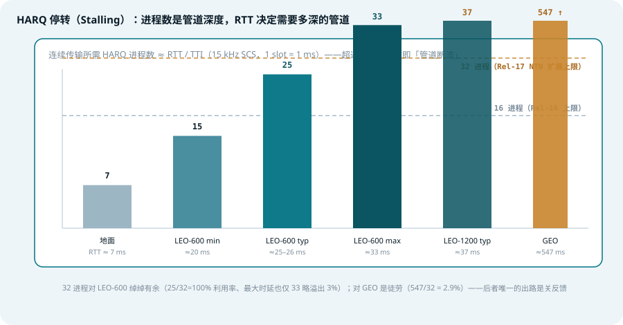
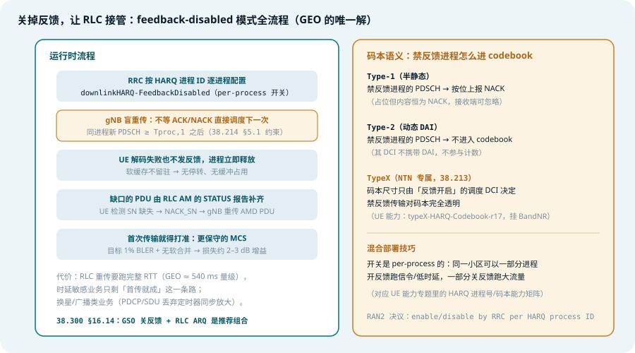
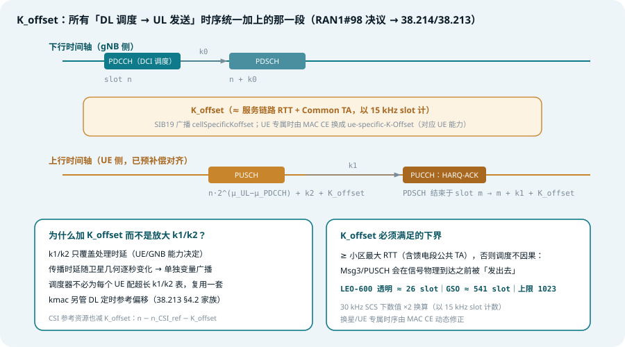
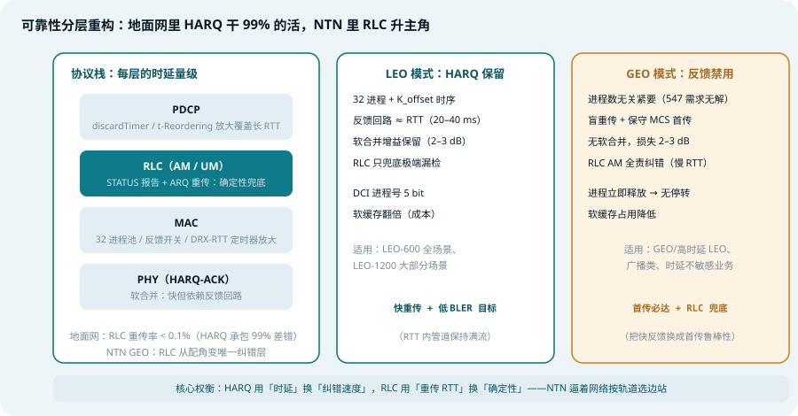

## 本篇要解决什么

[随机接入专题](ntn-rach.html)讲完「第一次开口」，本篇讲开口之后的常态：**数据面怎么在几百毫秒 RTT 的管道里保持流动**。HARQ 是 NR 数据面的心跳——停等重传（stop-and-wait）+ 软合并，每 7 ms 一个来回。NTN 把这个来回拉长到 25–550 ms，心跳直接停摆。

对照：**TS 38.214 §5.1**（PDSCH 接收与 K_offset 时序）、**TS 38.213 §4.2/§9.2**（K_offset 定义与 PUCCH 定时）、**TS 38.331**（`nrofHARQ-ProcessesForPDSCH-v1700`、`downlinkHARQ-FeedbackDisabled`）、**TS 38.321**（MAC HARQ 实体、DRX RTT 定时器）、**TS 38.322**（RLC ARQ 兜底）、**TR 38.821 §7.2**（各轨道 RTT 与进程数需求）。
相关：[5G NTN 综合专题](5g-ntn.html)、[NTN SIB19](ntn-sib19.html)（K_offset 的广播源头）、[NTN 再生载荷](ntn-regenerative-payload.html)（星上 gNB 如何砍短 RTT）、[NTN 多普勒与时频补偿](ntn-doppler.md)。

---

## 一、停转的算术：进程数就是管道深度

*图 1：连续传输所需的 HARQ 进程数 ≈ RTT / TTI——16 进程覆盖到 LEO-600 典型值就见底，GEO 差出一个数量级*

HARQ 是「每进程停等、多进程并行」的结构：进程 A 发完 TB 后等反馈，期间调度进程 B、C、D……**只要进程池够深，管道不空转**。所需进程数由 RTT 决定（以 15 kHz SCS、1 ms/slot 计）：

| 场景 | RTT（透明转发） | 所需进程 | Rel-16 上限 16 | Rel-17 上限 32 |
| --- | --- | --- | --- | --- |
| 地面 | ≈ 7 ms | 7 | 100% | — |
| LEO-600（最小/典型/最大） | ≈ 20 / 25 / 33 ms | 15 / 25 / 33 | 100% / 64% / 48% | 100% / 100% / 97% |
| LEO-1200（典型） | ≈ 37 ms | 37 | 43% | 86% |
| GEO | ≈ 547 ms | 547 | 2.9% | **无解** |

读法：32 进程把 LEO-600 从「半速停转」救回满速，把 LEO-1200 救到 86%；对 GEO 则毫无意义——547 个进程的软缓存没有任何终端装得下。**GEO 的解不在进程数，在第三节**。

注意 RTT 里包含的是**透明转发的完整链路**（服务链路 + 馈电链路 Common TA）——这正是 [再生载荷专题](ntn-regenerative-payload.html)的卖点：gNB 上星砍掉馈电段，LEO 的 HARQ RTT 进一步减半、进程需求同步下降。

---

## 二、修复一：32 进程——一行配置背后的连锁改动

Rel-17 把 HARQ 进程上限从 16 提到 32（38.331 / 38.214 §5.1，受 UE 能力 `max-HARQ-ProcessNumber-r17` 限制，见 [UE 能力专题](ntn-ue-capability.html)），改的不只是一个数字：

1. **DCI 字段扩位**：DCI 1_1 / 0_1 的 HARQ 进程号字段从 4 bit 扩到 **5 bit**——不加位，32 号进程就编不出来
2. **软缓存翻倍**：每个进程独立持有软合并缓冲，进程数 ×2 → 每 TB 可用软比特 ×0.5，合并增益受损。**给不需要 32 进程的小区配 32 是纯浪费**——这也是默认值保持 8 的原因
3. **配置分方向**：下行 `nrofHARQ-ProcessesForPDSCH-v1700` 增设 n32；上行引入 `nrofHARQ-ProcessesForPUSCH-r17`（Rel-15/16 上行固定 16，不可配）
4. **多 PDSCH 场景取模**：一条 DCI 调度多个 PDSCH 时，进程号按调度顺序 +1，**对 32 取模**（38.214 §5.1 原文）

进程数的收益曲线是边际递减的：救活 LEO-600 只需要 25–33，LEO-1200 需要跨过 37——都在 32 的射程内或边缘。超过这个射程，工程上就该换武器了。

---

## 三、修复二：关掉反馈——GEO 的唯一解

*图 2：feedback-disabled 的完整机制——盲重传 + RLC 兜底 + 码本语义分流*

当 RTT 长到重传永远迟到（GEO 一次 HARQ 重传 ≈ 540 ms），等反馈纯属浪费：进程和软缓冲被占满，重传来了也没用。Rel-17 的答案是**把 HARQ 降级为纯前向传输**：

- **开关粒度是 per-HARQ-进程**（RRC 配置 `downlinkHARQ-FeedbackDisabled`，按进程 ID 逐个设置）——不是全小区一刀切，可以混布：一部分进程开反馈跑低时延信令，一部分关反馈跑大流量
- **UE 不发 ACK/NACK，进程立即释放**。gNB 盲重传（blind retransmission）：不等反馈直接调度下一条，唯一约束是同进程的下一次 PDSCH 不得早于 **Tproc,1**（UE 处理时间，38.214 §5.1）之后
- **可靠性转移给 RLC AM**：UE 收不到的 PDU 靠 RLC STATUS 报告（NACK_SN）触发重传——确定性保证，但每次重传都是完整 RTT
- **首传就得打准**：没有软合并兜底，MCS 目标从 10% BLER 收紧到约 1%，等效损失 2–3 dB

### 码本语义的三种答案

反馈禁用后，「这个进程的 PDSCH 算不算反馈位」在三种码本里答案不同（38.213）：

| 码本 | 禁反馈进程的处理 |
| --- | --- |
| Type-1（半静态） | 占位，按位上报 **NACK**（内容恒定可忽略） |
| Type-2（动态 DAI） | **不进入码本**，其 DCI 不携带 DAI、不参与计数 |
| TypeX（NTN 专属） | 码本尺寸只由「反馈开启」的调度 DCI 决定，禁反馈传输完全透明 |

TypeX 是 NTN 的新增项（UE 能力 `typeX-HARQ-Codebook-r17`，挂 BandNR）——解决的问题是：Type-2 的 DAI 计数若混入禁反馈 DCI，UE 一旦漏检一条就无法对齐码本尺寸；TypeX 让禁反馈调度完全不碰计数器，漏检也无所谓。

---

## 四、K_offset：调度时序的平移不变量

*图 3：所有 DL→UL 时序统一加 K_offset——k1/k2 只管处理时延，传播时延单独广播*

NTN 之前，NR 的调度时序只有 k0/k1/k2 三件套（处理时延级别的短偏移）。NTN 引入第四个变量 **K_offset**（RAN1#98 决议，落地于 38.214/38.213），把「传播时延」从 k 值表里剥离出来单独广播：

| 时序 | 公式（slot） |
| --- | --- |
| PDSCH 调度 | DCI 在 slot n → PDSCH 在 n + k0（DL 侧不加） |
| **PUCCH HARQ-ACK** | PDSCH 结束于 slot m → ACK 在 **m + k1 + K_offset** |
| **PUSCH 调度** | DCI 在 slot n → PUSCH 在 **n·2^(μ_UL−μ_PDCCH) + k2 + K_offset** |
| CSI 上报（PUSCH 承载） | **n + K + K_offset**（K 由 DCI 选） |
| CSI 参考资源 | 上行 slot n′ → 参考 DL slot **n − n_CSI_ref − K_offset** |

设计逻辑值得细品：

1. **为什么加 K_offset 而不是放大 k1/k2**？k1/k2 是处理时延（UE/gNB 能力决定，每个值都要进 RRC 表）；传播时延随卫星几何**逐秒变化**——把它做成独立广播量（[SIB19](ntn-sib19.html) 的 `cellSpecificKoffset`，UE 专属时经 MAC CE 换成 `ue-specific-K-Offset`），k 值表就能全小区复用
2. **K_offset 的下界是因果性**：必须 ≥ 小区最大 RTT，否则 PUSCH 会在信号物理到达前被「发出去」。LEO-600 透明 ≈ 26 slot，GSO ≈ 541 slot，上限 1023（恰好 ≥ GEO 需求 + 余量）
3. **SCS 换算陷阱**：K_offset 以 15 kHz slot 计数，30 kHz SCS 载波上数值 ×2——日志分析高发踩坑点（同 [SIB19 专题](ntn-sib19.html)提醒）
4. **CSI 参考资源是减不是加**：上行上报时刻对应下行信道状态，得往回扣掉 K_offset 才是对齐的 DL slot——加错方向的实现 bug 常见于此

---

## 五、RLC 升任主角：慢而确定的兜底

*图 4：地面网里 HARQ 承包 99% 差错、RLC 重传率 <0.1%；NTN 里 RLC AM 从配角变成（GEO 场景下的）唯一纠错层*

反馈禁用把纠错责任推给 RLC，整个 L2 的定时器随之放大（38.322/38.323，Rel-17 为 NTN 扩展配置范围）：

| 机制 | 地面常态 | NTN 的角色变化 |
| --- | --- | --- |
| RLC t-Reassembly | 检测分段丢失，百 ms 级 | 必须容忍 RTT 量级的「迟到」，配置上限放大 |
| RLC AM STATUS / 轮询 | 冷备（很少触发） | **主用纠错路径**：NACK_SN → AMD PDU 重传 |
| PDCP discardTimer | ms1500 封顶 | 放大——否则正常飞行中的 SDU 会被过早丢弃 |
| DRX HARQ-RTT 定时器 | `drx-HARQ-RTT-TimerDL/UL` | 放大到 ≥ RTT，UE 才不会在重传物理到达前误判失步 |

一张对照表看清轨道选型（38.300 §16.14 推荐组合）：

| | LEO 模式 | GEO 模式 |
| --- | --- | --- |
| HARQ 反馈 | 开（32 进程） | **关**（进程数无解） |
| 纠错主路径 | HARQ 软合并 + RLC 兜底 | RLC AM + 保守 MCS 首传 |
| 反馈回路时延 | ≈ RTT（20–40 ms） | 等价于放弃快重传 |
| 软合并增益 | 保留 | 损失 2–3 dB |
| RLC 重传时延 | 一次 RTT | ≈ 540 ms 量级 |

---

## 六、实践中的坑（排障视角）

1. **吞吐量只有理论的一半**：LEO 场景先查进程数——`nrofHARQ-ProcessesForPDSCH` 留在默认 8 或 16，管道周期性断流；对照 RTT/TTI 算需求再配
2. **UE 能力不匹配导致配置被拒**：32 进程需要 `max-HARQ-ProcessNumber-r17` ≥ n32（见 [UE 能力专题](ntn-ue-capability.html)的能力过滤链），能力没报就配 n32 是配置错误
3. **盲重传打爆 UE**：gNB 侧不看 Tproc,1 就连续调度同进程 PDSCH——UE 解码不过来，表现为禁反馈进程 BLER 异常且无反馈可见
4. **Type-1 码本场景 NACK 满屏**：禁反馈进程在 Type-1 下按位报 NACK 是**规范行为**不是故障；想干净就用 Type-2 或 TypeX
5. **K_offset 方向反了**：CSI 参考资源应该**减** K_offset（往回找 DL slot），加错方向表现为 CSI 与真实信道错位、链路自适应持续失准
6. **SCS 换算漏乘 2**：30 kHz 载波上 K_offset 数值翻倍没换算，症状是 PUSCH 系统性早到/迟到一个 K_offset
7. **DRX 与长 RTT 打架**：`drx-HARQ-RTT-Timer` 没放大，UE 在重传到达前醒来判失步、反复进出 DRX active——查 DRX 配置而非空口
8. **PDCP 丢包误报**：discardTimer 用地面默认值，GEO 场景正常 RTT 内的 SDU 被「超时丢弃」——上层看到的是丢包，根因是定时器没放大

---

## 七、一句话总结与自测

> **32 进程救 LEO、关反馈救 GEO、K_offset 给一切时序让路、RLC AM 从冷备转正——NTN 调度的全部智慧，是让停等的 HARQ 在不可能停等的管道里各就其位。**

1. 连续传输所需 HARQ 进程数由什么决定？LEO-600 典型值和 GEO 各需要多少？32 进程分别解决谁、救不了谁？
2. 进程数从 16 到 32，DCI、软缓存、RRC 配置各要做什么连锁改动？为什么默认值仍是 8？
3. HARQ 反馈禁用的开关粒度是什么？盲重传要遵守哪条 UE 处理时间约束（规范出处）？
4. 同一个「禁反馈 PDSCH」在 Type-1、Type-2、TypeX 码本里分别如何处理？TypeX 解决了 Type-2 的什么缺陷？
5. 为什么把传播时延做成 K_offset 单独广播，而不是直接放大 k1/k2？K_offset 的因果性下界由什么决定？
6. CSI 参考资源的 K_offset 是加还是减？为什么方向与 PUSCH 相反？
7. GEO 关反馈后，纠错责任落在哪层哪几个机制上？为什么 MCS 目标要从 10% 收紧到 1%？

### 延伸阅读

以下规范的定位与关键章节，见本站 [3GPP 规范地图](3gpp-spec-map.html)：

- [TS 38.214 §5.1](3gpp-spec-map.html#ts-38214)——PDSCH 接收过程、32 进程上限、禁反馈的 Tproc,1 约束、K_offset 时序公式，[官方页面](https://www.3gpp.org/dynareport/38214.htm)
- [TS 38.213](3gpp-spec-map.html#ts-38213)——§4.2 K_offset 定义、§9.2 PUCCH/HARQ-ACK 定时与码本类型，[官方页面](https://www.3gpp.org/dynareport/38213.htm)
- [TS 38.321](3gpp-spec-map.html#ts-38321)——MAC HARQ 实体与 DRX-RTT 定时器，[官方页面](https://www.3gpp.org/dynareport/38321.htm)
- [TS 38.322](3gpp-spec-map.html#ts-38322)——RLC ARQ：STATUS 报告、t-Reassembly、AM 窗口，[官方页面](https://www.3gpp.org/dynareport/38322.htm)
- [TS 38.300 §16.14](3gpp-spec-map.html#ts-38300)——NTN HARQ/调度总纲（GSO 关反馈 + RLC ARQ 的推荐组合），[官方页面](https://www.3gpp.org/dynareport/38300.htm)
- [TR 38.821 §7.2](3gpp-spec-map.html#tr-38821)——各轨道 RTT 与 HARQ 进程需求分析，[官方页面](https://www.3gpp.org/dynareport/38821.htm)
- 相关本站专题：[5G NTN 综合专题](5g-ntn.html)、[NTN SIB19](ntn-sib19.html)、[NTN 随机接入](ntn-rach.html)、[NTN 多普勒与时频补偿](ntn-doppler.html)、[NTN 再生载荷](ntn-regenerative-payload.html)、[NTN UE 能力](ntn-ue-capability.html)
