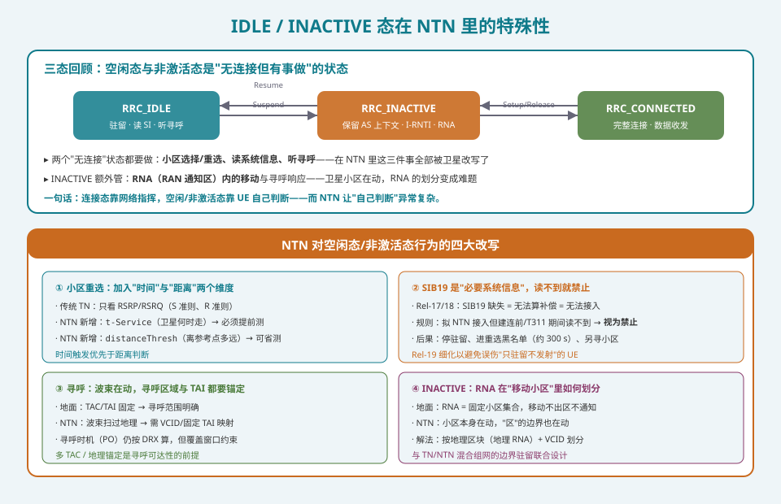
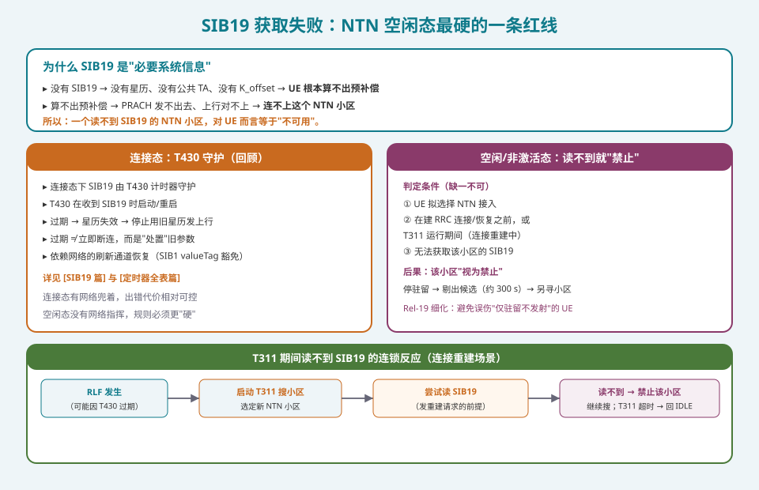
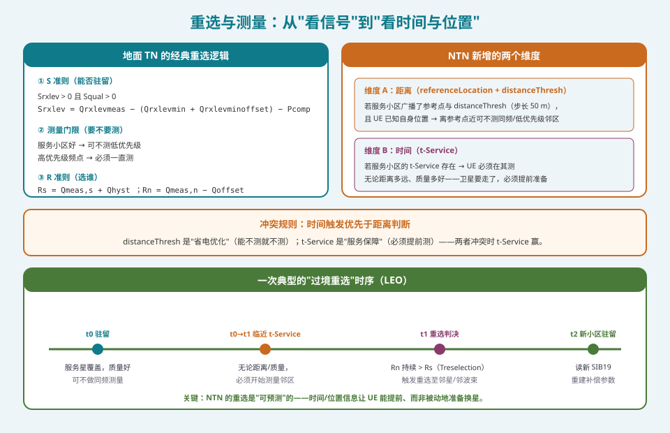
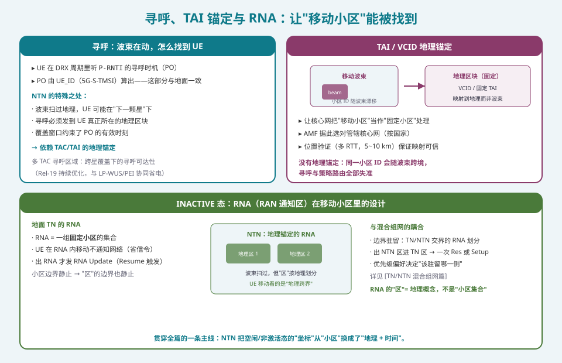

## 本篇要解决什么

前面十九篇讲的几乎都是"连接已经建立之后"的故事——预补偿、调度、HARQ、切换、功控。但终端大部分时间是**没有连接的**：开机后先驻留（IDLE）、偶尔挂起（INACTIVE），真正传数据的时间可能只占百分之一。

**待机看似最简单，在 NTN 里却最难。** 原因很直接：

> **连接态有网络指挥（网络告诉你 TA 是多少、该切到哪），空闲态没有——UE 必须自己读系统信息、自己算补偿、自己判断该不该换星。**

地面网里"自己判断"不难：基站就在那里，信号好就留着，差了就走。NTN 把这件事彻底改写了——服务你的卫星**几分钟后就飞走了**，而下一颗星什么时候来、从哪来、要什么补偿，全都写在系统信息里，要 UE 自己读、自己算。

本篇是 20 篇 NTN 学习路线的**最后一篇**，把"无连接时的行为"讲清楚，同时把散落在前面各篇的 IDLE/INACTIVE 线索归位。

对照：**TS 38.304**（空闲态/非激活态 UE 过程的最高依据：小区选择、重选、测量规则）、**TS 38.300 §16.14**（NTN 总体架构与移动性）、**TS 38.331**（SIB19、重选配置、RNA 配置、寻呼）、**TS 38.305 / 38.882**（位置验证与寻呼可达性的支撑）。

相关：[SIB19 专题](ntn-sib19.html)（补偿参数的广播源头）、[NTN 定时器全表](ntn-timers.html)（T430/T311 的完整谱系）、[TN/NTN 混合组网](ntn-tn-ntn-interworking.html)（边界驻留与优先级偏好）、[NTN 移动性与卫星切换](ntn-mobility.html)（连接态的对应图景）。

---

## 一、先看清"三态"里空闲态/非激活态的位置

NR 的三种 RRC 状态，前十九篇反复出现过，这里做最后一次对照：

| 状态 | 有无连接 | 要做什么 | NTN 里被改写的点 |
|---|---|---|---|
| **RRC_IDLE** | 无 | 驻留、读 SI、听寻呼 | 重选加入时间/距离维度；SIB19 成为"必要" |
| **RRC_INACTIVE** | 无（保留 AS 上下文 + I-RNTI） | 同上 + RNA 内移动不通知 | RNA 从"小区集合"变成"地理区块" |
| **RRC_CONNECTED** | 有 | 数据收发、切换、功控 | 前十九篇的主题 |

**两个"无连接"状态都干三件事：小区选择/重选、读系统信息、听寻呼。** 这三件事在 NTN 里全部被改了：

1. **读系统信息**——SIB19 从"可选的补充信息"变成"**必要系统信息**"（essential），读不到就禁止；
2. **小区重选**——从"看信号"（RSRP/RSRQ）变成"**看信号 + 看时间 + 看位置**"；
3. **听寻呼**——波束在动，寻呼要能发到 UE **真正所在的地理区块**，依赖 TAI/VCID 锚定。

INACTIVE 还多一层：**RNA（RAN Notification Area）**——本来"小区集合"的概念，在卫星场景下要重新定义。

---

## 二、SIB19：空闲态最硬的一条红线

### 2.1 为什么 SIB19 是"必要"的

SIB19 的内容在 [SIB19 专题](ntn-sib19.html)已经讲透：星历、公共 TA、K_offset、`epochTime`、有效期。这里只需要强调它对空闲态的意义：

**没有 SIB19，UE 就算不出预补偿。** 而算不出预补偿，PRACH 就发不出去（频偏对不上、定时对不上）——**根本连不上这个小区**。

所以从空闲态的视角看，一个读不到 SIB19 的 NTN 小区，等于**不可用**。3GPP 把 SIB19 归类为 NTN 接入的"必要系统信息"，正是这个原因。

### 2.2 两层规则：连接态靠 T430，空闲态靠"禁止"

**连接态**（回顾）：SIB19 由 `T430` 计时器守护——收到 SIB19 时启动/重启，过期则星历失效，UE 停止用旧星历发上行。连接态有网络兜着（可通过 valueTag 豁免的刷新通道恢复），出错代价相对可控。详见 [定时器全表](ntn-timers.html)。

**空闲态/非激活态**：规则更"硬"。判定条件（缺一不可）：

1. UE 拟选择 **NTN 接入**；
2. 在**建立/恢复 RRC 连接之前**，或 **T311 运行期间**（连接重建中）；
3. **无法获取该小区的 SIB19**。

三者同时成立 → 该小区**视为禁止（barred）**。后果是执行重选：停止驻留、把该小区剔出候选（通常约 **300 秒**）、另寻小区（可能是同一卫星的其它波束，或另一颗星，或地面小区）。

### 2.3 T311 期间的特殊连锁（连接重建场景）

这是最容易被忽视、后果最严重的一条链路：

1. UE 发生 **RLF**（很可能正是因为 T430 过期导致的"静默"）；
2. 启动 **T311**，搜索合适小区做重建；
3. 选定一个新的 NTN 小区，**尝试读该小区的 SIB19**（发 `RRCReestablishmentRequest` 的前提）；
4. **读不到** → 不能发重建请求 → 该小区视为禁止 → 继续搜；
5. **T311 超时仍无合适小区** → UE 转入 **RRC_IDLE**。

**意义**：SIB19 读不到不只是"这个小区不能用"，它可能把一个正在重建的连接**直接打回空闲态**——一次数据传输就此中断，要重新走接入流程。这也是为什么 Rel-19 要**细化禁止规则**：早期讨论倾向于"一旦 SIB19 缺失即禁止小区"，但那样会误伤"只驻留、不发射"的 UE（它根本不需要 SIB19 的补偿参数）。细化后的规则只在"确实要接入"时才判禁止。

> **一句话**：SIB19 对空闲态而言不是"参考资料"，是"入场券"。

---

## 三、小区重选：从"看信号"到"看时间与位置"

### 3.1 地面 TN 的经典逻辑（作为对照）

重选在 TN 里是成熟的三步：

1. **S 准则（能否驻留）**：`Srxlev > 0 且 Squal > 0`；
2. **测量门限（要不要测）**：服务小区质量好，可不测同频/低优先级频点；高优先级频点必须一直测；
3. **R 准则（选谁）**：`Rs = Qmeas,s + Qhyst`、`Rn = Qmeas,n − Qoffset`，Rn 持续高于 Rs 一段时间（Treselection）才重选。

**核心变量是"信号质量"（RSRP/RSRQ）。**

### 3.2 NTN 新增的两个维度

第十二篇（[测量与 CSI](ntn-measurement-csi.html)）算过"近远效应"让 RSRP 在 NTN 里失真。空闲态的重选因此必须引入两个新维度：

**维度 A：距离。**

- SIB19 里的 `referenceLocation`（服务小区参考点）+ `distanceThresh`（距离门限，**步长 50 m**）；
- 若 UE 已知自身位置（支持基于位置的测量发起），且离参考点比门限近 → **可不测**同频或低优先级邻区；
- 这是"省电优化"：卫星还没走，不必急着测。

**维度 B：时间。**

- SIB19 里的 `t-Service`（当前小区**停止服务**的时刻）；
- 若服务小区的 `t-Service` 存在 → UE **必须在其之前**执行（同频/异频/异系统）测量，**无论距离多远、质量多好**；
- 这是"服务保障"：卫星要走了，必须提前准备换星。

### 3.3 冲突规则：时间优先于距离

> **`t-Service` 赢。**

当"距离很近（可以省测）"与"t-Service 快到了（必须测）"冲突时，**时间判断压过距离判断**——因为 `distanceThresh` 只是省电优化，`t-Service` 是服务连续性的硬约束。规范甚至要求：**高优先级**邻区频率**不考虑**服务小区剩余服务时间，一直测。

### 3.4 移动小区：`movingReferenceLocation`

对 **earth-moving** 小区（波束在地表滑动，见 [轨道与架构篇](ntn-orbit-architecture.html)），参考点本身也在动。Rel-18 引入 `movingReferenceLocation`——**某一时刻的**移动参考位置，其时间基准由 `ntn-Config` 里的 `epochTime` 给出。

有个精妙的细节：`movingReferenceLocation` 的变化**不触发系统信息变更通知，也不改 SIB1 的 valueTag**——因为它随卫星持续变化，如果每次变化都通知，会引发信令风暴。规范把它排除在"系统信息变更判定"之外。

### 3.5 一次典型的"过境重选"时序（LEO）

| 时刻 | 状态 | 动作 |
|---|---|---|
| **t0** | 服务星覆盖，质量好 | 可不做同频测量（距离近） |
| **t0→t1** | 临近 `t-Service` | **无论距离/质量，必须开始测邻区** |
| **t1** | 重选判决 | Rn 持续 > Rs（Treselection）→ 触发重选 |
| **t2** | 新小区驻留 | 读新 SIB19，**重建补偿参数** |

**关键认知**：NTN 的重选是**可预测**的——时间/位置信息让 UE 能提前、而非被动地准备换星。这是地面网（只能事后反应信号劣化）不具备的能力。

---

## 四、寻呼与"移动小区"的定位难题

### 4.1 寻呼：波束在动，怎么找到 UE

UE 在 DRX 周期里监听 `P-RNTI` 加扰的 PDCCH 上的**寻呼时机（PO）**。PO 由 UE_ID（5G-S-TMSI）算出——这部分与地面**完全一致**（[Coreset/搜索空间篇](coreset-search-space.html) 里讲过 Type2 公共搜索空间）。

NTN 的特殊之处在于**寻呼要发到哪里**：

- 波束扫过地理，UE 可能在"下一颗星"下；
- 寻呼必须发到 UE **真正所在的地理区块**；
- 覆盖窗口约束了 PO 的有效时刻。

**→ 这依赖 TAC/TAI 的地理锚定**；跨星覆盖下需要**多 TAC 寻呼区域**来保证可达性。Rel-19 持续优化这一块，并与 **LP-WUS（低功耗唤醒信号）/ PEI（早期寻呼指示）** 协同省电——让 UE 只在真正需要时才唤醒主接收机。

### 4.2 TAI / VCID 地理锚定：让"移动小区"有"固定语义"

地面的 TAC/TAI 天然映射到固定地理区域（基站不动）。NTN 的移动波束会让**同一个小区 ID 随波束漂过不同地理区块**，直接击穿寻呼与策略路由的假设。

解法：**VCID（虚拟小区标识）/ 固定 TAI**——把"移动的小区"锚定到**地理区块**而非瞬时波束，让核心网能像处理固定 TN 小区那样处理它。

| 没有地理锚定 | 有地理锚定 |
|---|---|
| 同一小区 ID 随波束跨境 | 小区 ID 稳定映射到地理区块 |
| 寻呼可能发错区域 | 寻呼发到 UE 实际所在区块 |
| AMF 管辖选择失准 | AMF 按国家正确选择 |

**AMF 按国选择**：注册时（或之后立即）必须选对管辖核心网，以满足合法监听与业务限制。NTN 里波束可能横跨国界，不能像 TN 那样"从静态站址推断"，必须靠 **UE 粗位置上报 + 网络侧验证**（多 RTT，5~10 km 一致性检查，见 [Rel-18 增强全集](ntn-rel18-enhancements.html)）。这一套在 [TN/NTN 混合组网篇](ntn-tn-ntn-interworking.html)展开过，此处只需记住：**它是空闲态能"被找到、被正确管辖"的前提。**

### 4.3 INACTIVE 态：RNA 从"小区集合"到"地理区块"

INACTIVE 态的核心概念是 **RNA（RAN Notification Area）**：一组小区，UE 在区内移动**不通知网络**（省信令），出区才发 **RNA Update**（触发 Resume）。

地面 RNA 的前提是**小区边界静止**。NTN 里小区本身在动，"区"的边界也在动——**直接照搬会失效**。

解法：**按地理区块划分 RNA**（地理 RNA）+ **VCID** 锚定。UE 判断"是否出区"依据的是**地理跨界**，而非"小区 ID 变化"。这样波束再怎么扫过，只要 UE 没离开地理区块，就不必打扰网络。

**与混合组网的耦合**（[TN/NTN 混合组网篇](ntn-tn-ntn-interworking.html)）：

- **边界驻留**：TN/NTN 交界的 RNA 如何划分——跨越天地边界算出区还是算区内？
- **优先级偏好**决定"该驻留哪一侧"，进而影响 RNA Update 的触发条件；
- 出 NTN 区进 TN 区 → 一次 Resume 或 Setup。

---

## 五、Rel-18 / Rel-19 对空闲态/非激活态的增强

把散落的增强归位：

| 版本 | 增强 | 解决什么 |
|---|---|---|
| **Rel-17** | SIB19 引入、基于位置的测量发起（`referenceLocation` + `distanceThresh`）、`t-Service` | 空闲态在 NTN 里的基础框架 |
| **Rel-17** | SIB19 必要信息与禁止规则 | 读不到补偿参数时不自欺 |
| **Rel-18** | `movingReferenceLocation`、TN 的 SIB19（TN 也广播 NTN 邻区）、TN 地理区域清单 | 移动小区的参考点更新、双向握手 |
| **Rel-18** | IoT-NTN 的 `t-Service`/邻星星历预测、eDRX 扩展 | 稀疏星座的覆盖窗口预测 |
| **Rel-19** | 基于时间/距离的**重选优化**、移动卫星小区的参考位置更新、**ATG 专用参数** | 让"何时开始测量"更贴合可预测几何 |
| **Rel-19** | 与 **LP-WUS / PEI** 的测量卸载协同、多 TAC 寻呼 | 进一步降低空闲态功耗、保证寻呼可达 |
| **Rel-19** | 禁止规则**细化**（避免误伤只驻留不发射的 UE） | 减少不必要的禁止 |

**主线很清楚：让"跨越卫星与地面两个世界"的驻留决策越来越自动化、越来越省电、越来越不用人工干预。**

---

## 六、系列收官：20 篇 NTN 的四层骨架

写完这一篇，20 篇路线就闭合了。回头看看这个知识体系的形状——它其实是一个**"把距离当作一等公民"**的通信分支，逼着每一层协议重新审视地面时代的假设：

**第一层：物理与几何**（信道与链路预算 / 轨道与架构 / 射频频段与共存）
决定"信号能不能到"。大尺度路损、雨衰与闪烁、斜距公式、波束模式、频谱与共存。

**第二层：同步与补偿**（多普勒 / 定时器 / 功控 / 随机接入）
决定"信号对不对得上"。±50 kHz 的多普勒、270 ms 的往返、UA 的三阶外推、预补偿的残差预算。

**第三层：连接管理**（SIB19 / UE 能力 / 调度与 HARQ / 移动性 / 测量与 CSI / RLM 与 BFM / **IDLE/INACTIVE**）
决定"连接稳不稳"。**本篇的 IDLE/INACTIVE 态是这个层次的"起点"**——连接还没建立时，一切都要靠 UE 自己读系统信息、自己算星空。

**第四层：演进与融合**（Rel-18 / Rel-19 与未来 / TN-NTN 混合组网）
决定"这条路通向哪里"。从弯管到再生载荷，从纯卫星到天地一体。

**一句话总结整个系列**：

> **NTN 的全部工作，就是让 600 公里外的一颗会飞的基站，在全世界的终端看来"像地面基站一样好用"——而空闲/非激活态，是这个承诺最难兑现的一环，因为这时候没有人指挥，只有星空与你。**

---

## 排障清单：IDLE/INACTIVE 态的嫌疑

1. **终端反复禁止同一个 NTN 小区**：该小区 SIB19 未下发或下发不完整——SIB1 里应该调度 SIB19，检查广播链完整性。
2. **重建（Reestablishment）时被打回 IDLE**：T311 期间目标小区 SIB19 读不到——查该小区 SIB19 是否可达、T311 是否配得过短。
3. **过境时掉网、无法及时重选**：`t-Service` 未广播或配错，UE 不知道卫星要走——检查 SIB19 的 `t-Service`。
4. **终端在服务小区信号还很好时就乱测**：`distanceThresh`/`referenceLocation` 未下发或位置不可用，退化成"一直测"——检查基于位置测量的配置与 UE 能力。
5. **earth-moving 小区里 UE 行为异常**：`movingReferenceLocation` 缺失或 `epochTime` 对不上——检查移动参考点为移动小区下发。
6. **寻呼收不到**：TAC/TAI 与地理锚定不一致，寻呼发到了错误的地理区块——检查 VCID/固定 TAI 映射与多 TAC 配置。
7. **跨 TN/NTN 边界频繁 RNA Update**：RNA 按"小区集合"而非"地理区块"划分——重配为地理 RNA。
8. **漫游/紧急呼叫路由到错误国家**：VCID/TAI 锚定缺失、位置验证未启用——检查 AMF 按国选择链。
9. **稀疏星座下耗电异常**：未使用 `t-Service`/邻星星历预测，无覆盖期仍反复搜网——检查预测性节电配置（并参考 [IoT NTN](ntn-iot.html) 的间断覆盖机制）。
10. **空闲态功耗仍然偏高**：LP-WUS/PEI 与测量卸载未启用——检查 Rel-18/19 节电特性的配置。

---

## 自测八题

1. 为什么说"待机"在 NTN 里比在地面网里难得多？空闲态/非激活态要做哪三件事？
2. 为什么 SIB19 是"必要系统信息"？连接态的 T430 守护与空闲态的"禁止"规则有什么本质区别？
3. T311 运行期间读不到 SIB19 会产生什么连锁后果？为什么 Rel-19 要细化禁止规则？
4. NTN 重选相比地面新增了哪两个维度？`distanceThresh` 与 `t-Service` 冲突时谁赢，为什么？
5. `movingReferenceLocation` 解决什么问题？为什么它的变化不触发系统信息变更通知？
6. 波束在动，寻呼靠什么保证能发到 UE？TAI/VCID 地理锚定解决了什么？
7. INACTIVE 态的 RNA 在 NTN 里为什么要从"小区集合"改成"地理区块"？与 TN/NTN 混合组网如何耦合？
8. 用一句话概括这 20 篇 NTN 学习体系的四层结构，以及空闲/非激活态在其中的位置。

参考答案

1. 因为连接态有网络指挥（网络告诉 UE TA、该切到哪），空闲态没有——UE 必须自己读系统信息、自己算补偿、自己判断该不该换星。而服务卫星几分钟就飞走，要 UE 自己从系统信息里读出补偿参数与"下一班车"。三件事：小区选择/重选、读系统信息、听寻呼。
2. 没有 SIB19 就没有星历/公共 TA/K_offset，UE 算不出预补偿 → PRACH 发不出去 → 根本连不上，所以是"入场券"级的必要信息。区别：连接态靠 T430 计时器守护有效期（有网络兜着，过期只是停止用旧星历，可通过刷新通道恢复）；空闲态规则更硬——满足"拟 NTN 接入 + 建连前/T311 期间 + 读不到 SIB19"即视为禁止，直接剔出候选。
3. RLF 后启动 T311 搜小区 → 选定新 NTN 小区 → 尝试读 SIB19（发重建请求的前提）→ 读不到则不能发请求、小区视为禁止、继续搜 → T311 超时仍无合适小区则转入 RRC_IDLE，一次数据传输出此中断。Rel-19 细化是因为早期"一旦 SIB19 缺失即禁止"会误伤"只驻留、不发射"的 UE（它不需要补偿参数）。
4. 距离维度（`referenceLocation` + `distanceThresh`，步长 50 m，离参考点近可不测）与时间维度（`t-Service`，必须在停止服务前测，无论距离/质量）。冲突时 t-Service 赢——distanceThresh 只是省电优化，t-Service 是服务连续性的硬约束（卫星要走了必须提前准备）。
5. 解决 earth-moving 小区（波束在地表滑动的移动小区）参考点本身也在动的问题——给出某一时刻的移动参考位置，时间基准由 epochTime 给出。它随卫星持续变化，若每次变化都触发系统信息变更通知会造成信令风暴，故被排除在"系统信息变更判定"之外（不改 valueTag）。
6. 靠 TAC/TAI 的地理锚定 + 多 TAC 寻呼区域。TAI/VCID 把"移动的小区"锚定到地理区块而非瞬时波束，让核心网像处理固定 TN 小区那样处理它——使寻呼能发到 UE 实际所在的地理区块，并让 AMF 按国家正确选择管辖核心网。
7. 地面 RNA 的前提是小区边界静止，NTN 里小区本身在动、"区"的边界也在动，照搬会失效；改成"地理 RNA"（按地理区块 + VCID 锚定），UE 依据地理跨界而非小区 ID 变化判断是否出区。与混合组网耦合：TN/NTN 交界的 RNA 如何划分、优先级偏好决定驻留哪一侧、跨天地边界触发一次 Resume 或 Setup。
8. 四层：① 物理与几何（信号能不能到）② 同步与补偿（信号对不对得上）③ 连接管理（连接稳不稳）④ 演进与融合（通向哪里）。空闲/非激活态属于第三层，且是这个层次的起点——连接尚未建立时，一切依赖 UE 自己读系统信息、自己算星空，是"把 600 公里外会飞的基站做得像地面基站一样好用"这一承诺最难兑现的一环。

---

### 延伸阅读

- [SIB19 专题](ntn-sib19.html)——补偿参数的广播源头与字段全景
- [NTN 定时器与定时关系全表](ntn-timers.html)——T430 / T311 / DRX 的完整谱系
- [TN/NTN 混合组网](ntn-tn-ntn-interworking.html)——边界驻留与优先级偏好
- [Rel-18 NTN 增强全集](ntn-rel18-enhancements.html)——movingReferenceLocation 与位置验证
- [Rel-19 NTN 与未来](ntn-rel19-future.html)——时/距重选优化与 6G 展望
