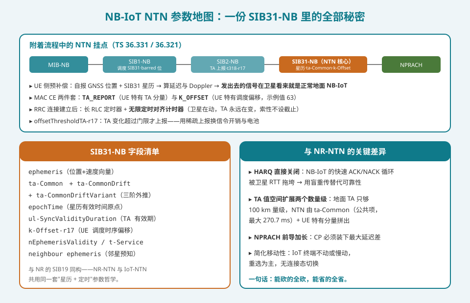
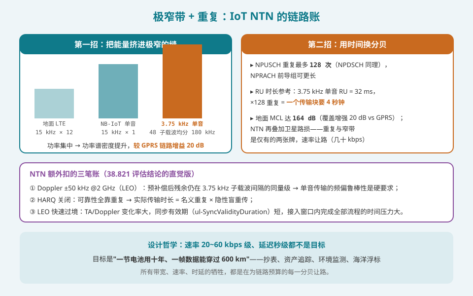
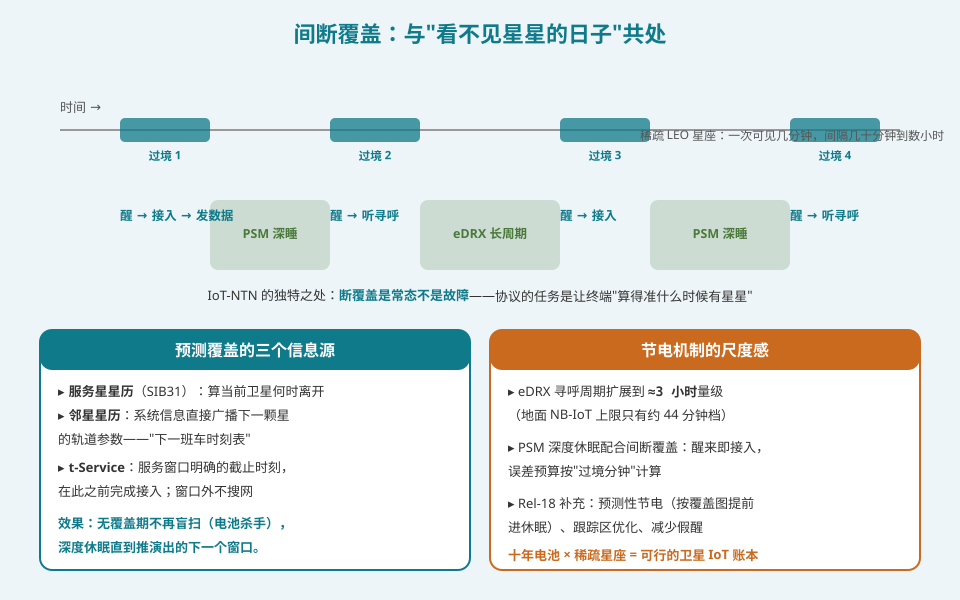
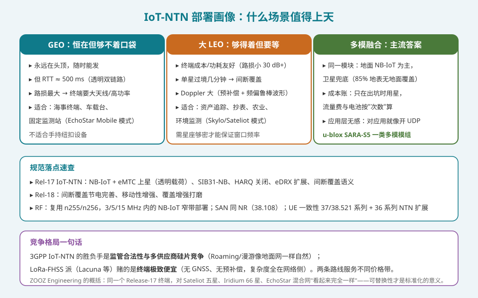

## 本篇要解决什么

前十六篇的主角都是 NR——宽带、手机、VSAT。但卫星 IoT 是 NTN 最先商业化的战场：全球 **85% 的地表没有地面蜂窝覆盖**，资产追踪、抄表、海洋浮标、农业传感的"最后一公里"只能上天。Rel-17 把 NB-IoT 和 eMTC 原生搬上卫星（合称 **IoT-NTN**），本篇讲清楚这次"搬家"改了什么、放弃了什么、赌的是什么。

先说结论：**IoT-NTN 的设计哲学与 NR-NTN 一脉相承但更极端——能砍的全砍（HARQ 直接关闭、移动性只剩重选）、能省的全省（eDRX 扩到 3 小时、PSM 深睡配合间断覆盖）、唯一不能省的是链路预算（极窄带 + 128 次重复 + 盲重传）。目标不是速率，是"一节电池用十年、一针数据能穿过 600 km"。**

对照：**TS 36.331/36.321**（SIB31-NB、TA_REPORT/K_OFFSET MAC CE）、**TR 38.821**（IoT-NTN 评估场景与链路预算）、**TS 36.213**（NB-IoT 物理层时序）、**TR 38.863**（共存，IoT 复用 n255/n256）。

相关：[NTN 定时器全表](ntn-timers.html)（定时哲学的 NB 版）、[NTN 功率控制](ntn-power.html)（重复传输的上游逻辑）、[NTN 频段与共存](ntn-rf-bands-coexistence.html)（IoT 复用的 MSS 频段）、[Rel-18 增强全集](ntn-rel18-enhancements.html)（IoT-NTN 的 r18 续章）。

---

## 一、NB-IoT 上卫星：参数地图

### 1.1 一份 SIB31-NB 里的全部秘密

NB-IoT 的 NTN 适配核心是一张新的系统信息块 **SIB31-NB**（由 SIB1-NB 调度），字段与 NR 的 SIB19 同构：

- **星历**（位置+速度向量）+ `epochTime`——UE 预补偿的原料；
- **ta-Common / ta-CommonDrift / ta-CommonDriftVariant**——公共 TA 三阶外推，与 NR 版一字不差；
- **k-Offset-r17**——UE 调度时序偏移（实际网络示例值可达 63）；
- **ul-SyncValidityDuration**——上行同步有效期（LEO 下星动得快，TA 会过期）；
- **邻星星历**——下一颗星的轨道参数，间断覆盖预测的"班车时刻表"。

SIB2-NB 负责 TA 上报使能与 RLF 定时器（`t318-r17`）；MAC 层新增两件套：**TA_REPORT**（UE 特有 TA 分量）与 **K_OFFSET** MAC CE，配合 `offsetThresholdTA-r17` 门限——TA 变化超门限才上报，用稀疏上报换电池。

### 1.2 附着流程里的 NTN 挂点

流程骨架与地面 NB-IoT 完全一致（MIB → SIB → NPRACH → RRC → EPC 附着），NTN 只是在四个位置"注入"：

1. 收完 SIB31-NB 后，UE 用 GNSS 位置 + 星历**预计算延迟与 Doppler**；
2. NPRACH 前导按预补偿后的定时发出（前导 CP 加长以容纳延迟差）；
3. RRC 建立时配置**长 RLC 定时器 + 无限定时对齐计时器**——卫星在动，TA 永远在变，索性不设截止；
4. 连接期内周期性/触发式 TA_REPORT 维持对齐。

设计哲学一句话：**设备聪明、网络标准化、卫星可替换**——同一台 Release-17 终端对 Sateliot 五颗星、Iridium 66 颗星、EchoStar 混合网"看起来完全一样"，这种可替换性正是 3GPP 路线对专有卫星方案的降维优势。

---

## 二、可靠性重构：HARQ 关闭与重复传输

### 2.1 HARQ 直接关闭

地面 NB-IoT 的 HARQ 反馈循环是亚毫秒级的；卫星 RTT 让这个循环彻底失灵。Rel-17 的选择干脆利落：**NB-IoT NTN 不支持 HARQ 反馈，可靠性改用盲重传保证**。这与 [NR-NTN 的 HARQ 篇](ntn-harq.html)（32 进程 + feedback-disabled 半关）相比更进一步——IoT 的低速率预算允许完全放弃反馈。

### 2.2 链路账：两张牌打到底

NB-IoT 地面网的看家本领本就是覆盖：MCL（最大耦合损耗）164 dB，较 GPRS 提升 20 dB。NTN 环境再叠加卫星路损，只能继续加码：

- **第一招：极窄带**。上行 3.75 kHz 单音子载波把 180 kHz 切成 48 份，功率全部挤进一条缝——功率谱密度换链路增益；
- **第二招：重复**。NPUSCH 重复最多 **128 次**；3.75 kHz 单音的 RU 本身长 32 ms，×128 = **一个传输块要 4 秒钟**——速率几十 kbps 的真相就在这道乘法里；
- **额外扣账**：LEO Doppler ±50 kHz @2 GHz，预补偿残余与 3.75 kHz 子载波间隔同量级 → 单音的频偏鲁棒性是硬要求；过境时间短 → 同步有效期内完成接入的时间压力大。

这套牺牲换来的可用场景恰恰不需要速率：抄表、环境监测、资产追踪的"一针数据"通常几十字节。

---

## 三、间断覆盖：与"看不见星星的日子"共处

这是 IoT-NTN 区别于 NR-NTN 的**独有命题**：NR-NTN 假设星座够密（Starlink 级），IoT-NTN 的稀疏星座（几颗到几十颗）意味着**断覆盖是常态不是故障**。协议的任务是让终端"算得准什么时候有星星"。

### 3.1 覆盖预测的三个信息源

1. **服务星星历**（SIB31-NB）：算当前卫星何时离开；
2. **邻星星历**：系统信息直接广播下一颗星的轨道参数——出坑前就知道"下一班车"几点来；
3. **t-Service**：服务窗口的明确截止时刻，窗口外不搜网。

效果：无覆盖期终端深度休眠（不再做电池杀手级的盲扫），按推演出的下一个窗口准时醒来。

### 3.2 节电尺度感

- **eDRX 寻呼周期扩展到约 3 小时量级**——地面 NB-IoT 的上限档只有约 44 分钟；
- **PSM 深睡**配合间断覆盖：醒来即接入，误差预算按"过境分钟"计算；
- Rel-18 补齐预测性节电（按覆盖图提前睡）、跟踪区优化、减少假醒。

十年电池 × 稀疏星座，这笔账才能成立。

---

## 四、部署画像：GEO、大 LEO 与多模融合

| 轨道 | 优势 | 代价 | 适合 |
|---|---|---|---|
| **GEO** | 永在头顶、随时能发 | RTT ≈ 500 ms、路损最大（终端要大天线） | 海事终端、车载台、固定监测站 |
| **大 LEO** | 终端成本/功耗友好（路损小 30 dB+） | 间断覆盖、Doppler 大 | 资产追踪、抄表、农业（主流） |
| **多模融合** | 地面为主卫星兜底，只在出坑时用星 | 模块复杂度 | 绝大多数商用场景的答案 |

**竞争格局一句话**：3GPP IoT-NTN 的胜负手是**监管合法性与多供应商硅片竞争**（漫游像地面网一样自然，u-blox SARA-S5 一类多模模组已商用）；LoRa-FHSS 派（Lacuna 等）赌终端极致便宜——无 GNSS、无预补偿，复杂度全推给网络侧的网关解调与过境调度。两条路线服务不同价格带，但 3GPP 派独享"和地面网同一个生态"的网络效应。

---

## 排障清单：IoT-NTN 视角的嫌疑

1. **终端在过境窗口内接不完流程**：重复次数配太高（极端覆盖档）+ 窗口太短——检查 NPRACH/接入流程是否用了与星座密度匹配的覆盖等级。
2. **TA 频繁失效重同步**：`ul-SyncValidityDuration` 与 LEO 角速度不匹配，或 GNSS 冷启动拖慢首传。
3. **电池寿命远低于十年账**：无覆盖期仍在搜网 = t-Service/邻星星历未下发——查 SIB31-NB 广播完整性。
4. **寻呼丢失**：eDRX 周期设得比覆盖窗口间隔还长——下一颗星来时终端还在睡，检查 eDRX 与星座回访周期的匹配。
5. **单音传输误块率高**：预补偿残余频偏逼近 3.75 kHz 间隔——查 Doppler 补偿精度与 GNSS 质量，必要时回落 15 kHz 多音。
6. **SIB31-NB 收不到**：SIB1-NB 调度错误或 barred 位误标——NB-IoT 的 SIB 链比 NR 长，一处错全链断。

---

## 自测七题

1. SIB31-NB 的核心字段有哪些？与 NR 的 SIB19 是什么关系？
2. 为什么 NB-IoT NTN 干脆关闭 HARQ 而 NR-NTN 只做"半关"（feedback-disabled）？
3. 3.75 kHz 单音 + 128 次重复意味着一个传输块传多久？这套牺牲换来了什么？
4. 间断覆盖下终端靠哪三个信息源预测覆盖窗口？
5. eDRX 在 IoT-NTN 中扩展到什么量级？为什么地面 NB-IoT 的档位不够用？
6. GEO 与大 LEO 的 IoT-NTN 部署各自的核心取舍？
7. 3GPP IoT-NTN 对 LoRa-FHSS 派的差异化优势与劣势各是什么？

参考答案

1. 星历+epochTime、ta-Common 三阶外推、k-Offset-r17、ul-SyncValidityDuration、邻星星历、t-Service；与 SIB19 同构——NR-NTN 与 IoT-NTN 共用同一套"星历+定时"参数哲学。
2. NB-IoT 本来就低速率低频次，低速率预算允许完全放弃反馈、用盲重传兜底（协议简单、时序宽松）；NR-NTN 承载宽带业务，全盲重传的吞吐代价不可接受，只能半关（可配置跳过反馈）。
3. 3.75 kHz 单音 RU 长 32 ms，×128 ≈ 4 秒。换来功率谱密度 + 重复增益（地面 MCL 164 dB 基础上继续扛卫星路损）——速率让位于"一节电池十年、一针数据穿过 600 km"。
4. 服务星星历（算何时离开）、邻星星历（下一班车时刻表）、t-Service（服务窗口截止时刻）。
5. 约 3 小时量级。稀疏星座的回访间隔以小时计，地面档位（约 44 分钟）撑不到下一个覆盖窗口，终端会被迫频繁假醒。
6. GEO：恒在但路损大、延迟高，适合大终端/固定台站；大 LEO：终端友好但间断覆盖 + 大 Doppler，适合低功耗海量部署。
7. 优势：监管合法性、多供应商硅片与漫游生态、与地面网同一套网络运营；劣势：终端需 GNSS 与预补偿（成本与功耗），设备侧功耗预算比无感知的 LoRa 终端高。

