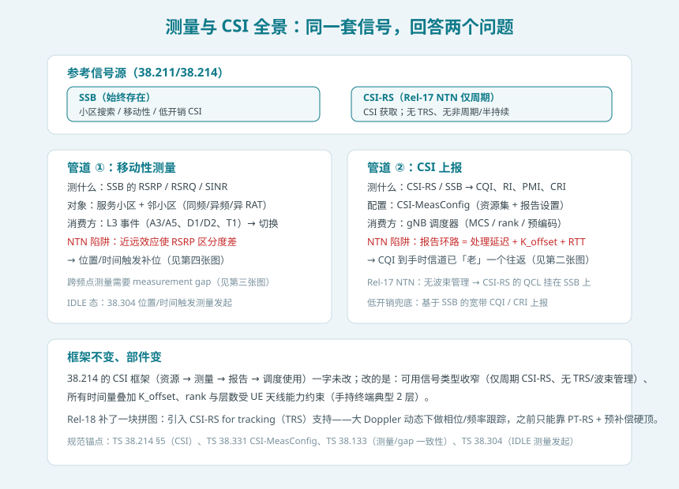
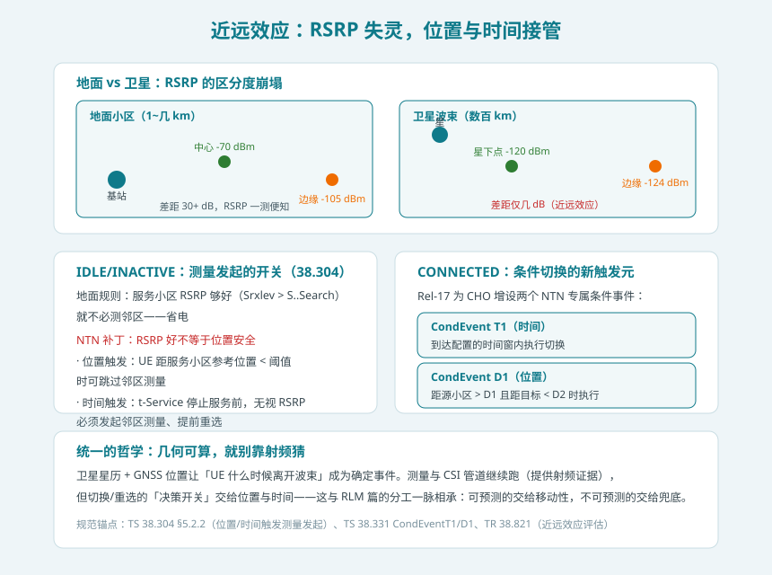
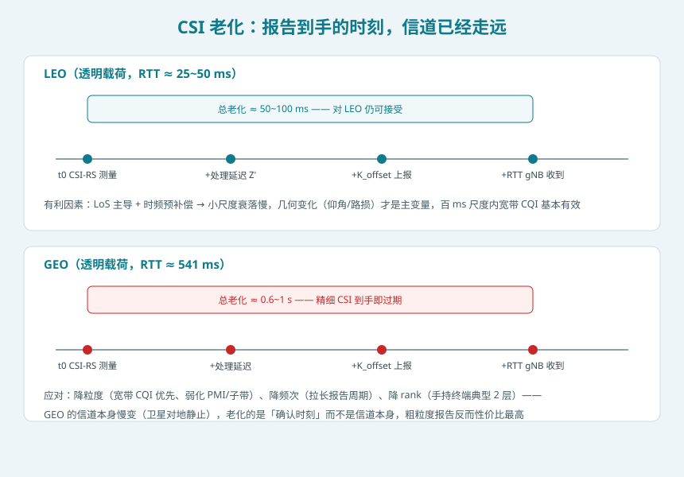
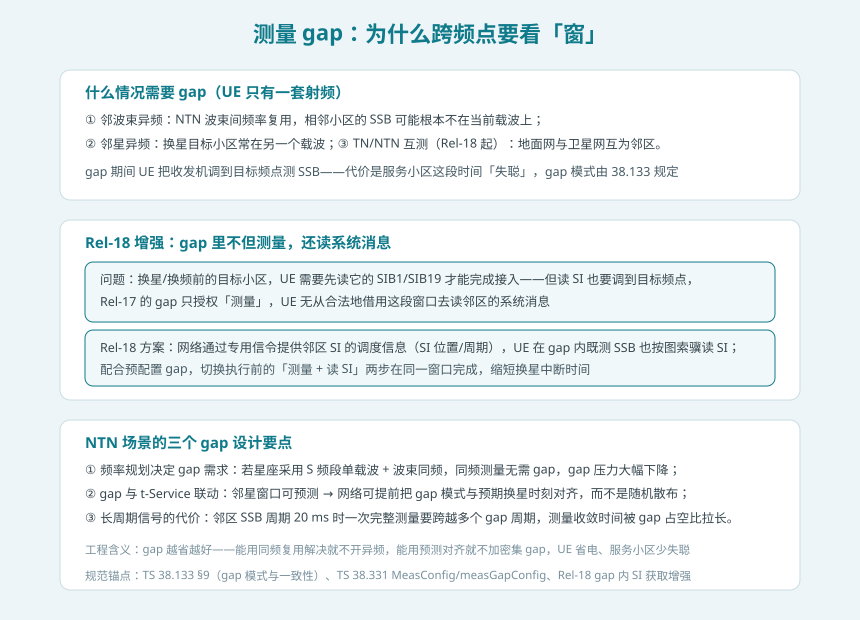

## 本篇要解决什么

测量与 CSI 是网络的「感官系统」：测量（RSRP/RSRQ）告诉网络**该不该搬家**（切换/重选），CSI（CQI/RI/PMI）告诉网络**该怎么干活**（MCS/rank/预编码）。搬到卫星上，这套感官系统遇到三个新问题：**卫星波束几百公里宽，边缘与中心的 RSRP 只差几 dB，靠功率还能分出小区好坏吗？CSI 报告跑一个往返才到手，到手的还是「现在」的信道吗？跨频点测邻星，UE 的一套射频怎么腾出时间？**

先说结论：**38.214 的 CSI 框架一字未改，改的是三件事——可用信号收窄（Rel-17 仅周期 CSI-RS、无 TRS，Rel-18 补齐）、一切时间量叠加 K_offset、以及最根本的：RSRP 不再是可靠的决策依据，位置与时间接管了决策开关，射频证据退居佐证。**

对照：**TS 38.214 §5**（CSI 获取与报告）、**TS 38.133**（测量一致性、评估周期、gap 模式）、**TS 38.304 §5.2**（IDLE 测量发起：位置/时间触发）、**TS 38.331**（MeasConfig、CSI-MeasConfig、CondEventT1/D1）、**TS 38.300 §16**（NTN 移动性总览）、**TR 38.821**（近远效应评估）。

相关：[NTN 移动性与卫星切换](ntn-mobility.html)（测量结果的消费端：事件与 CHO）、[NTN SIB19](ntn-sib19.html)（t-Service 与测量发起的时间开关）、[NTN 调度与 HARQ](ntn-harq.html)（CSI 的消费端：调度器）、[NTN RLM/BFM](ntn-rlm-bfm.html)（同源信号、不同分工）。

---

## 一、全景：同一套信号，回答两个问题

UE 的感官系统分成两条管道，共享 SSB 和 CSI-RS 两类信号源：

**管道一：移动性测量**。测 SSB 的 RSRP/RSRQ，对象是服务小区与邻小区，结果经 L3 事件（A3/A5、NTN 特有的 D1/D2/T1）触发切换与重选。这条管道在 NTN 里的变数最大——**近远效应**让 RSRP 的区分度崩塌（第三节详述）。

**管道二：CSI 上报**。测 CSI-RS（或低开销场景下的 SSB），产出 CQI/RI/PMI/CRI，经 PUCCH（周期）或 PUSCH（非周期）交给 gNB 调度器。这条管道的变数在时间——**K_offset 把报告环路拉长了一个往返**（第四节详述）。

Rel-17 NTN 对信号源做了一次明确的收窄：

| 信号/能力 | 地面 NR | Rel-17 NTN | 说明 |
| --- | --- | --- | --- |
| SSB | 有 | 有 | 始终存在，移动性测量的主力 |
| 周期 CSI-RS | 有 | **有** | CSI 获取的规范途径 |
| 非周期/半持续 CSI-RS | 有 | **无** | NTN 不引入 DCI 触发的按需测量 |
| TRS（跟踪参考信号） | 有 | **无**（Rel-18 补齐） | 大 Doppler 动态下做相位/频率跟踪 |
| 波束管理（TCI/QCL 指示） | 有 | **无** | 单波束假设，CSI-RS 的 QCL 直接挂 SSB |

收窄的逻辑与 [RLM 篇](ntn-rlm-bfm.html)关闭 BFR 一脉相承：单波束 + 长环路下，按需测量的收益撑不起协议复杂度。Rel-18 唯一补回的大件是 **TRS**——LEO 的多普勒动态要求持续的相位跟踪，仅靠 PT-RS 与预补偿不够用了。

---

## 二、近远效应：RSRP 为什么失灵

地面网测量的隐含前提是：小区小（1~几 km），中心与边缘的 RSRP 差 30 dB 以上，「信号好不好」直接映射「该不该换小区」。卫星波束几百公里宽，UE 在星下点与在波束边缘到卫星的斜距差异只有百分之几——**RSRP 差距缩小到个位数 dB**。这就是 NTN 的**近远效应（near-far effect）**：RSRP 几乎测不出「我离小区边缘有多远」，而后者恰恰决定换手时机。

Rel-17 的解法是让**几何接管决策**，两个状态各补一块：

**IDLE/INACTIVE（38.304 §5.2.2）**——测量发起的开关从「RSRP 够好就免测」改为两条新规则：

- **位置触发**：UE 距服务小区参考位置的距离小于阈值时，可以不做邻区测量（位置来自 GNSS，具体获取方式 UE 实现自定）；
- **时间触发**：准地球固定小区在 SIB19 里广播停止服务时间（t-Service），**无论 RSRP 多好**，UE 必须在停止服务前发起邻区测量、完成重选——这是对地面「省电免测」规则的强制豁免。

**CONNECTED**——为条件切换增设两个 NTN 专属触发元（详见[移动性专题](ntn-mobility.html)）：

- **CondEvent T1**：到达配置的时间窗内执行 CHO（对应波束移交时间表）；
- **CondEvent D1**：UE 距源小区参考位置超过 D1、且距目标小区参考位置小于 D2 时执行。

注意分工：**测量与 CSI 管道照常运行，提供射频佐证；但决策开关换成位置与时间**。这与 RLM 篇「可预测的交给移动性」是同一条哲学——星历 + GNSS 让几何可算，就别靠射频猜。

---

## 三、CSI：老化的往返账

CSI 的价值随时间衰减：从 UE 测 CSI-RS 到 gNB 用上这份报告，中间要跑完「测量 → 处理（Z'）→ 上报（+K_offset）→ 空口传输（RTT 的一半）」全程。NTN 里这笔账的分水岭在轨道：

**LEO（RTT 25~50 ms）**：总老化约 50~100 ms。有利的是信道本身：LoS 主导 + 时频预补偿让小尺度衰落很慢，真正变化的只是仰角与路损这类**慢变的几何量**——百毫秒尺度的宽带 CQI 基本有效，CSI 机制照常工作。

**GEO（RTT ≈ 541 ms）**：总老化 0.6~1 s。但这里有个反直觉的缓冲——GEO 卫星对地静止，信道慢变的老化账其实不痛；真正老化的是「确认时刻」。于是合理策略是**降规格**：

| 降规格维度 | 做法 | 理由 |
| --- | --- | --- |
| 粒度 | 宽带 CQI 优先，弱化子带/PMI | 秒级时效下精细预编码已过期 |
| 频次 | 拉长报告周期 | GEO 信道慢变，高频报告纯浪费上行 |
| rank | 手持终端典型 2 层 | 链路预算 + 天线能力双重约束 |
| 信号 | 可用 SSB 替代 CSI-RS 做低开销 CSI | 进一步省参考信号开销 |

非周期 CSI 的触发偏移自动叠加 K_offset——「DCI 触发 → 上报」的时序关系与调度时序（k2）、HARQ 时序（k1）一样被 K_offset 重塑，这是 [定时器全表](ntn-timers.html)里「偏移类」改写的又一成员。

---

## 四、测量 gap：跨频点的「窗口」经济学

UE 只有一套射频，测异频邻区必须开 gap——期间服务小区收不到任何下行。NTN 里需要 gap 的场景：邻波束异频（波束间频率复用）、邻星异频（换星目标常在另一载波）、以及 Rel-18 起的 TN/NTN 互测。

**Rel-18 的关键增强：gap 内读系统消息。** 换星/换频前，UE 需要先读目标小区的 SIB1/SIB19 才能完成接入，但 Rel-17 的 gap 只授权「测量」，读 SI 无合法窗口。Rel-18 让网络通过专用信令提供邻区 SI 的调度信息，UE 在 gap 内按图索骥既测 SSB 也读 SI——切换前的「测量 + 读 SI」两步在同一窗口完成，直接缩短换星中断时间。

NTN 的 gap 设计还有两个杠杆：

1. **频率规划决定 gap 需求**。星座若用单载波 + 波束同频复用，同频测量免 gap，gap 压力大减——这是系统设计期的权衡，不是协议能救的。
2. **预测对齐**。邻星窗口可从星历算出，gap 模式可以提前与预期换星时刻对齐，而不是像地面那样周期性散布。

---

## 五、排障清单：测量/CSI 的五个嫌疑方向

1. **切换晚于波束边界**：近远效应下若仍纯靠 RSRP 事件（A3）触发，UE 常在边缘才换手——检查是否已叠加位置/时间触发（T1/D1）或 IDLE 位置触发规则。
2. **CSI 报告粒度错配**：GEO 场景配置了子带 CQI/精细 PMI，报告到手即过期，调度器拿着旧数据反而震荡——降为宽带 + 低频次。
3. **gap 占空比过高**：异频邻区密集时 gap 频繁，服务小区下行吞叶下降——优先检查频率规划能否同频化，或用 Rel-18 预配置 gap 收紧窗口。
4. **换星中断偏长**：gap 内读 SI 增强未启用时，UE 要先测量、再单独找窗口读 SI，两步串行——确认 gNB 下发了邻区 SI 调度信息。
5. **t-Service 免测豁免漏配**：服务小区 RSRP 一直很好，UE 依地面规则跳过邻区测量，波束停止服务时措手不及——检查 SIB19 的服务停止时间是否有效广播。

---

## 六、自测题

1. 近远效应的物理成因是什么？它同时打击了 IDLE 重选和 CONNECTED 切换中的哪个环节？
2. 38.304 的位置触发和时间触发分别解决了什么问题？为什么时间触发必须「无视 RSRP 强制测邻区」？
3. Rel-17 NTN 的 CSI-RS 支持范围比地面收窄了哪些？Rel-18 补回的 TRS 是为哪个物理问题服务的？
4. 画出 LEO 与 GEO 的 CSI 老化时间轴：各环节（测量→处理→上报→gNB 接收）分别叠加了什么？为什么说 GEO 的老化账「反直觉地不痛」？
5. 非周期 CSI 的触发偏移如何被 K_offset 改写？它与 k1/k2 的改写属于同一类机制吗？
6. Rel-18 的 gap 内读 SI 增强解决了换星流程中的哪段串行瓶颈？
7. 为什么说 NTN 的测量哲学是「射频证据、几何决策」？与 RLM 篇的工程分工如何呼应？

---

## 小结

- **两条管道**：移动性测量（SSB RSRP → L3 事件）与 CSI 上报（CSI-RS/SSB → CQI/RI/PMI）框架不变；Rel-17 NTN 收窄信号源（仅周期 CSI-RS、无 TRS、无波束管理），Rel-18 补齐 TRS 与 gap 内读 SI。
- **近远效应**：卫星波束太宽，RSRP 无法区分小区中心与边缘 → IDLE 态位置/时间触发测量发起（38.304）、CONNECTED 态 CondEvent T1/D1——几何接管决策开关。
- **CSI 老化**：报告环路叠加 K_offset 与 RTT，LEO 约 50~100 ms 可用，GEO 降规格（宽带 CQI、低频次、低 rank、SSB 替代）；非周期触发偏移被 K_offset 重塑。
- **gap 经济学**：跨频点测量的必要窗口，Rel-18 支持在 gap 内读邻区 SIB1/SIB19，配合星历预测对齐换星前的测量窗口。

下一篇预告：**NTN 信道与链路预算**——TR 38.811 信道模型、雨衰（ITU-R P.618）、遮蔽分级、EIRP/G/T 与链路预算计算实务。
