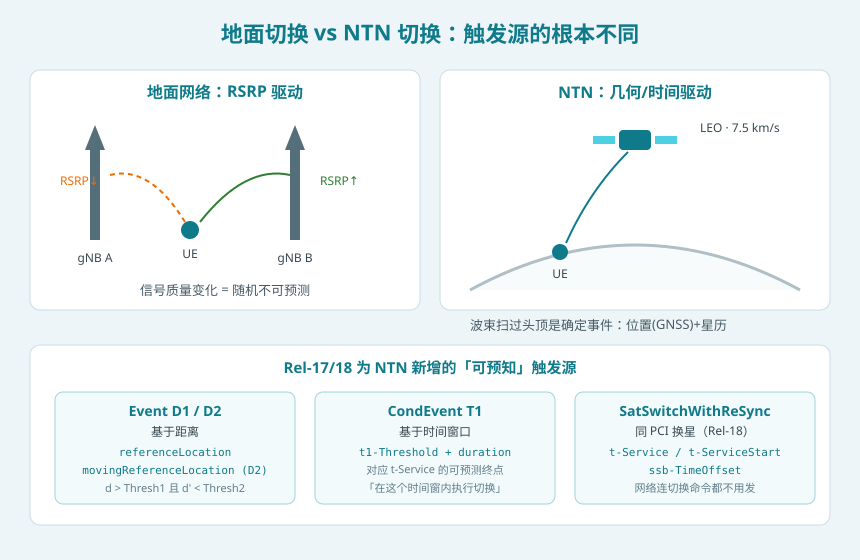
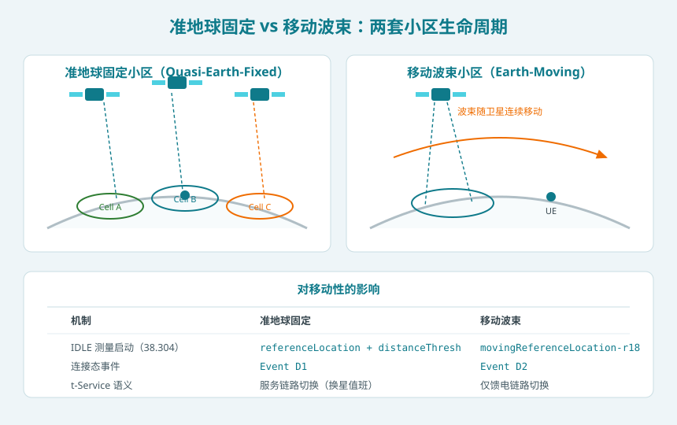
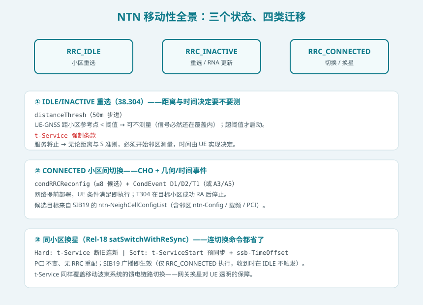
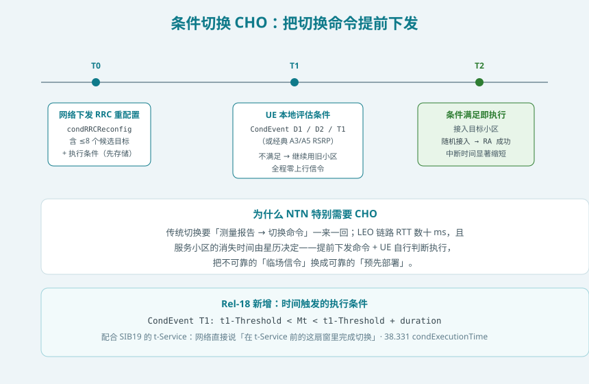
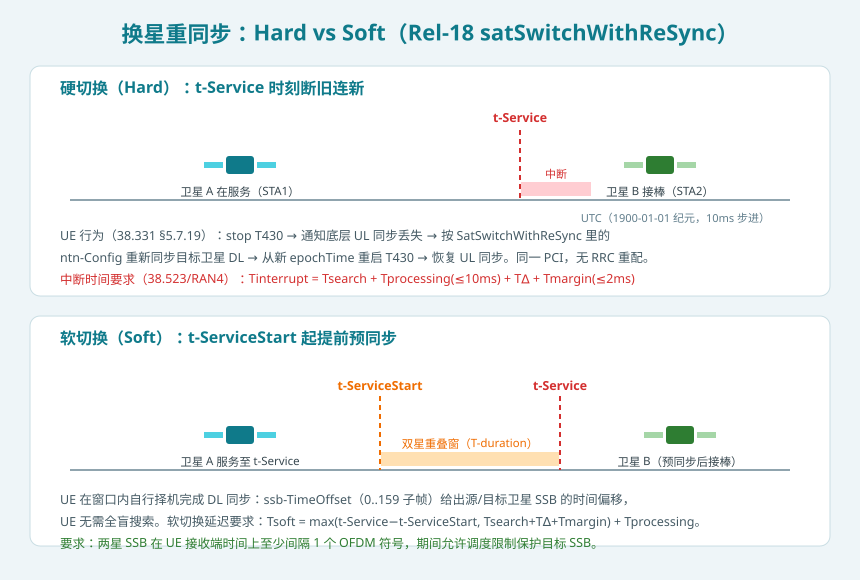

## 本篇要解决什么

前七篇专题把 NTN 的「静态资产」配齐了：[综合专题](5g-ntn.html)给全景、[再生载荷](ntn-regenerative-payload.html)定架构、[UE 能力](ntn-ue-capability.html)列终端声明、[SIB19](ntn-sib19.html)广播卫星说明书、[多普勒补偿](ntn-doppler.html)管时频、[随机接入](ntn-rach.html)管进场、[定时器全表](ntn-timers.html)管时间。本篇进入动态视角最难的一章：**UE 在一颗随时会飞走、波束随时会扫走、馈电站随时会换的网络上，如何保持不断线？**

本篇核心叙事一句话：**地面切换由「信号变差」驱动——这件事随机不可预测；NTN 切换由「几何与时间」驱动——卫星还没走，网络就知道它什么时候走。整个 NTN 移动性体系就是把这份可预测性兑换成提前量。**

对照：**TS 38.304 §4/§5**（IDLE/INACTIVE 测量启动与重选）、**TS 38.331 §5.5.4.4/§5.3.5.10**（Event D1/D2 与 CHO 执行）、**§5.2.2.4.21/§5.7.19**（换星重同步）、**TS 38.300 §16.14.4**（移动性总纲）、**RAN4 CR §6.1C.3.2**（硬/软切换中断时间）、**TR 38.821 §7**（方案评估）。
相关：[NTN SIB19](ntn-sib19.html)（本篇所有广播参数的源头）、[NTN 定时器全表](ntn-timers.html)（T430 与 CondEvent T1 的时间语义）、[NTN 随机接入](ntn-rach.html)（CHO 执行时的进场动作）。

---

## 一、先看清问题：卫星基站不是「信号变差」才走，是「必然要走」

地面切换假设：UE 与基站相对位置基本不变或缓变，链路质量由衰落主导，A3 事件（邻区比服务区好 ΔdB）是合理的触发器。

NTN 里这套假设全面失效。LEO-600 场景的一组数字：

| 现象 | 地面宏站 | LEO-600 |
| --- | --- | --- |
| 单小区服务同一 UE 的时长 | 小时级（静止 UE 几乎无限） | **约 5–10 分钟** |
| 链路质量主变因素 | 衰落、干扰 | **几何（仰角）**，几乎确定性 |
| 服务终止时刻 | 不可知 | **星历 + t-Service 广播，精确到 10 ms** |
| 换「基站」的原因 | 信号变差 | **卫星飞走了（哪怕信号还好）** |

最反直觉的一点：在准地球固定系统中，UE 静止不动，**是小区在离开 UE**。信号可能直到最后一刻都很好（高仰角结束前 RSRP 平滑下降），但卫星必然在 t-Service 时刻停止服务该区域。等 A3 事件触发再走报告流程，在 LEO 的 7.5 km/s 面前大概率来不及——这就是 NTN 移动性必须重构的根本原因。



## 二、小区形态决定移动性剧本：准地球固定 vs 移动波束



同一个卫星星座，可以用两种方式定义小区，移动性剧本完全不同：

**准地球固定（Quasi-Earth-Fixed）**：小区锚在地面不动，卫星像值班员一样轮流照射同一块覆盖区。切换分两类：
- **小区间切换**：UE 所在的覆盖区即将换一颗卫星值班，且新卫星对应**不同小区（PCI 变化）**——这就是传统 RRC 切换，只是触发源变成几何/时间；
- **同小区换星**：新旧卫星服务**同一个小区（PCI 不变）**——Rel-18 的 satSwitchWithReSync，连切换命令都省了（见第六节）。

**移动波束（Earth-Moving）**：小区跟着卫星走，覆盖区在地面上连续扫动。此时 `referenceLocation`（静态参考点）不再能描述小区位置，Rel-18 引入 **`movingReferenceLocation`**——带 epochTime 时间戳的移动参考点，配合星历可算出小区「现在」在哪。相应地，`t-Service` 在移动波束系统里只覆盖**馈电链路切换**（UE 随波束自然移动，服务链路不需要显式切换）。

工程含义：**准地球固定是 Rel-17 的默认假设**（SIB19 里 `referenceLocation` 的字段描述明确写 "quasi-Earth fixed system"），移动波束的能力是 Rel-18 补的。看网络配置时先分清形态，再看该有哪些字段。

## 三、IDLE/INACTIVE：基于距离的测量启动（38.304）



地面网络 IDLE 态的测量启动规则是「信号准则」：`Srxlev > SIntraSearchP` 时可以不测邻区。NTN 里这个规则不可靠——RSRP 还很好不代表小区还能待多久（波束快走了），也不代表该测了（UE 还在覆盖中心）。38.304 为 NTN 增补两条**位置/时间准则**：

1. **distanceThresh（距离准则）**：SIB19 广播 `referenceLocation` + `distanceThresh`（50 m 步进，0..65525）。UE 有有效 GNSS 位置时，算自己到参考点的距离：
   - 距离 **<** `distanceThresh` → 在覆盖中心，**可以不测**同频/等优先级异频/低优先级频点（省电）；
   - 距离 **≥** `distanceThresh` → 走到覆盖边缘，开始测量。
   移动波束小区同样适用，只是参考点换成 `movingReferenceLocation`（按 epochTime 外推到当前时刻）。

2. **t-Service（时间强制条款）**：如果 SIB19 带 `t-Service`，则**在服务终止前必须开始邻区测量**——不管距离准则、不管 S 准则是否满足。具体提前多久由 UE 实现决定（规范留白）。这是全篇最「硬」的条款：服务终止是广播出来的确定事件，UE 没有理由视而不见。

重选的排序准则基本沿用地面（R 准则），但 SIB19 的 `ntn-NeighCellConfigList` 让 UE 能对邻区做**时延/多普勒预评估**——重选本质上是在卫星之间选，没有邻区星历就没法预判目标小区的可达性。

## 四、CONNECTED：Event D1/D2——把「测量报告」换成「算几何」

Rel-17 复用了测量事件框架，但新增了两个**基于距离**的事件（38.331 §5.5.4.4）：

**Event D1（固定参考点）**：
- 进入条件：UE 到 `referenceLocation1` 的距离 + 迟滞 > `distanceThreshFromReference1`，**且** UE 到 `referenceLocation2` 的距离 − 迟滞 < `distanceThreshFromReference2`；
- 语义：「我已经离开服务小区的锚区、同时进入目标小区的锚区」——纯几何判断，一个 RSRP 都不用测。
- 字段：`distanceThresFromReference1/2`（50 m 步进）、`referenceLocation1/2`（GNSS 坐标，格式同 TS 37.355 Ellipsoid-Point）、`HysteresisLocation`（距离迟滞，米）。

**Event D2（移动参考点）**：结构同 D1，但服务侧用 SIB19 的 `movingReferenceLocation` + 其星历 + epochTime 推算「移动中的参考点」，目标侧用 MeasObjectNR 里的邻区参考点。用于移动波束系统。

**为什么 D1/D2 比 A3/A5 可靠**：RSRP 在 NTN 里随仰角平滑变化，区分度差、跳变点模糊；而距离是确定性函数，门限可以设得非常精准。规范同时保留 A3/A5——NTN 里它们仍有用（比如波束内干扰变化），但**D1/D2 是 NTN 的主力**。

## 五、条件切换 CHO：把切换命令提前下发



传统切换的信令链是「测量报告 → gNB 决策 → RRC 重配置（含 mobilityControlInfo）→ UE 接入目标」。在 LEO 里有两个风险：报告上行走数十 ms 的长管道；命令到达前服务链路可能已经掉了。CHO（Rel-16 引入、Rel-17 在 NTN 成为标配工具）的思路是：

1. 网络提前下发 `condRRCReconfig`，携带**最多 8 个候选目标**的完整切换命令 + 各自的执行条件；UE **先存储、不执行**；
2. UE 持续本地评估条件：经典 CondEvent A3/A5，或 NTN 的 **CondEvent D1/D2/T1**；
3. 条件满足 → UE 本地执行：向目标小区发起随机接入（带着 [RACH 专题](ntn-rach.html)里算好的预补偿）→ 成功后 T304 停止。

全程零上行信令、决策零延迟。「执行条件」里的时间类事件 **CondEvent T1** 是 Rel-17 为 NTN 新增的：

- 进入：`Mt > t1-Threshold`；离开：`Mt > t1-Threshold + duration`（duration 100 ms 步进）；
- `t1-Threshold` 以 1900-01-01 纪元、10 ms 步进计数——和 SIB19 的 `t-Service` **同一个纪元、同一个量纲**，网络可以直接把它配在 t-Service 之前，等于告诉 UE「在这个时间窗内完成切换」。

Rel-18 又补了 `condExecutionTime`：给 CHO 执行加一个**硬截止时间**——到了时刻条件哪怕没完全满足也按规范处理，防止存储的切换命令无限期挂在 UE 里。这与定时器全表篇的「时间触发」一脉相承：**NTN 把切换从「事件驱动」推向「日程驱动」。**

## 六、同小区换星：satSwitchWithReSync（Rel-18）



准地球固定系统里最频繁的移动性事件根本不是小区切换，而是**同 PCI 换星**——小区还在原地，值班卫星换了。Rel-18 之前，这也要走完整 RRC 切换（PCI 变化 → 重配 → 重同步），纯属浪费。Rel-18 在 SIB19 里新增 `satSwitchWithReSync`，出现即声明「本小区支持不换 PCI 的换星」：

```asn1
SatSwitchWithReSync-r18 ::= SEQUENCE {
    ntn-Config-r18     NTN-Config-r17,          -- 目标卫星的完整 NTN 参数
    t-ServiceStart-r18 INTEGER(0..549755813887) OPTIONAL,  -- 软切换起始时刻
    ssb-TimeOffset-r18 INTEGER(0..159) OPTIONAL  -- 源/目标 SSB 时间偏移(子帧)
}
```

**硬切换（Hard）**：SIB19 带 `SatSwitchWithReSync` + `t-Service`（无 `t-ServiceStart`）时，UE 在 `t-Service` 时刻执行（38.331 §5.7.19）：
1. stop T430；
2. 通知底层「UL 同步因换星丢失」；
3. 用 `SatSwitchWithReSync` 里的 `ntn-Config`（目标卫星星历 + 公共 TA + Koffset）重新同步目标卫星 DL；
4. 从新 `epochTime` 起重启 T430，UL 同步恢复后继续。

**软切换（Soft）**：SIB19 还带 `t-ServiceStart` 时，UE 可以在 **[t-ServiceStart, t-Service] 的重叠窗**内自行择机预同步目标卫星——`ssb-TimeOffset`（0..159 子帧）直接给出源/目标卫星 SSB 的时间偏移，UE 不用盲搜。断开旧星的时刻由 UE 实现决定，但规范要求两星 SSB 在 UE 接收端至少错开 1 个 OFDM 符号。

RAN4 给了两套中断/切换延迟要求：

| 模式 | 公式 | 说明 |
| --- | --- | --- |
| 硬切换中断 | `Tinterrupt = Tsearch + Tprocessing(≤10ms) + T∆ + Tmargin(≤2ms)` | Tsearch 基于目标首 SSB；配置 ssb-TimeOffset 时可由传播时延差推算 |
| 软切换延迟 | `Tsoft = max(t-Service − t-ServiceStart, Tsearch + T∆ + Tmargin) + Tprocessing` | 只要重叠窗够长，切换延迟被窗口「吸收」 |

三个容易看漏的规范细节：
- **t-Service 双语义**：既覆盖准地球固定的服务链路切换，也覆盖移动波束系统的**馈电链路切换**——网关换星对 UE 透明的保障就是这同一个字段；
- **状态门槛**：换星重同步只在**收到 SIB19 时处于 RRC_CONNECTED** 才执行——在 IDLE 收到带换星信息的 SIB19、之后才进入 CONNECTED 的 UE，按现行规范不触发（这是专利与提案里反复澄清的坑）；
- **重读义务**：UE 应在 `ntn-UlSyncValidityDuration` 到期前自行重读 SIB19（UE 实现），换星前的目标参数全靠这份广播是最新的。

## 七、三个状态合起来看：NTN 移动性的完整决策树

把上面所有机制按 UE 状态排一遍：

| UE 状态 | 移动性动作 | 触发源 | 关键字段 |
| --- | --- | --- | --- |
| IDLE/INACTIVE | 小区重选 | 距离 + 时间 | `referenceLocation` / `movingReferenceLocation`、`distanceThresh`、`t-Service` |
| CONNECTED（跨小区） | CHO 执行 | 几何/时间事件 | CondEvent D1/D2/T1、`condExecutionTime`、邻区 `ntn-NeighCellConfigList` |
| CONNECTED（同小区） | 换星重同步 | 纯时间 | `satSwitchWithReSync`、`t-Service`、`t-ServiceStart`、`ssb-TimeOffset` |

注意一个分层关系：**换星重同步的参数走广播（SIB19），小区切换的参数走专用信令（condRRCReconfig）**。这是 RAN2 的明确取舍——换星是同一 gNB 的可预测日程，广播一遍全小区受益；跨小区切换涉及准入与资源，必须点对点。

## 八、实践中的坑（排障八则）

1. **t-Service 到点 ≠ RSRP 变差**：日志里卫星切换发生在信号良好的时候是**正常现象**，别按地面经验当异常。
2. **distanceThresh 单位是 50 m 步进**：原始值 600 = 30 km，直接当米读会差 50 倍。
3. **D2 事件拿错参考点**：`movingReferenceLocation` 必须按 `epochTime` 外推到评估时刻，直接拿广播值算距离在移动波束下全是偏差。
4. **收 SIB19 时的状态决定换星行为**：IDLE 时收到的换星参数在进入 CONNECTED 后**不会**自动补执行——回归规范 §5.2.2.4.21 的字面逻辑。
5. **ssb-TimeOffset 的参考点是「上行时间同步参考点」**：不是 UE 接收时刻，含传播时延差的换算，差一截就是搜不到目标 SSB。
6. **软切换窗太短**：`t-ServiceStart` 贴着 `t-Service` 配置会让 `max(...)` 退化为 Tsearch 项，预同步变成硬切。
7. **邻区星历缺席**：`ntn-NeighCellConfigList` 条目缺 `ntn-Config` 时沿用列表前一条（Ext 里缺席则对齐主列表同位置）——解析实现常漏掉这个「继承」规则。
8. **换星后忘重启 T430**：38.331 要求从**新 ntn-Config 的 epochTime** 重启，按旧 epoch 算会提前误判 UL 失效。

## 九、一句话总结

**地面切换回答「现在谁的信号好」，NTN 切换回答「这颗卫星还有多久走」——distanceThresh 和 D1/D2 把覆盖边缘变成可计算的几何，t-Service 和 CondEvent T1 把服务终止变成广播出来的日程，satSwitchWithReSync 把最频繁的换星压缩成一次按表执行的重同步；NTN 用可预测性换提前量，让 UE 在卫星飞走之前就订好下一班。**

---

## 自测七题

1. 为什么 A3 事件在 LEO-600 的准地球固定系统里不是可靠的切换触发器？至少说两条。
2. Event D1 与 D2 的唯一区别是什么？`movingReferenceLocation` 为什么必须配 `epochTime` 才有意义？
3. SIB19 的 `distanceThresh` 广播值为 400，对应多少米？UE 在什么条件下可以跳过邻区测量？
4. `t-Service` 在准地球固定与移动波束系统里分别控制哪类切换？
5. CondEvent T1 的纪元与步进，和 SIB19 哪个字段完全一致？为什么这个设计很关键？
6. 硬换星与软换星的分界字段是哪个？软切换里 `ssb-TimeOffset` 省掉了 UE 的什么工作？
7. 一个 UE 在 RRC_IDLE 下收到带 `satSwitchWithReSync` 的 SIB19，随后完成 RRC 连接建立并在 `t-Service` 时刻处于 CONNECTED——按现行规范它执行换星重同步吗？为什么？

<details>
<summary>参考答案</summary>

1. ① 服务终止由几何决定，与相对信号质量无关，信号可能到最后都很好；② 长 RTT 下「报告→命令」一来一回可能赶不上卫星离开；③ RSRP 随仰角平滑变化，A3 门限的区分度差。
2. 参考点是否随时间移动：D1 用固定 `referenceLocation`，D2 用 `movingReferenceLocation`。移动参考点是「epochTime 时刻的位置」，必须配星历外推到当前时刻才代表小区现在在哪。
3. 400 × 50 m = 20 km。UE 支持 location-based measurement 且有有效 GNSS 位置、距离小于该值时，可以不测同频/等优先级异频/低优先级频点。
4. 准地球固定：服务链路切换（换星值班）；移动波束：馈电链路切换（对 UE 透明）。
5. 与 `t-Service` 一致——1900-01-01 纪元、10 ms 步进。网络可以直接把 T1 窗口配在 t-Service 之前，时间语义无缝衔接。
6. `t-ServiceStart`：有则为软切换（重叠窗预同步），无则硬切换。`ssb-TimeOffset` 给出源/目标卫星 SSB 的子帧级偏移，UE 免去对目标卫星的盲搜索。
7. 不执行。规范 §5.2.2.4.21 的换星动作以「收到 SIB19 时处于 RRC_CONNECTED」为前提；这是现行规范的字面逻辑（也是后续提案填补的空白）。

</details>

## 延伸阅读

- TS 38.304 §4/§5：IDLE/INACTIVE 测量启动（distanceThresh 与 t-Service 条款）
- TS 38.331 §5.5.4.4：Event D1/D2 定义；§5.3.5.10 与 §5.7.19：CHO 执行与换星重同步；SIB19 ASN.1（satSwitchWithReSync-r18）
- TS 38.300 §16.14.4：NTN 移动性总纲（含硬/软切换概述）
- RAN4 NTN-enh CR §6.1C.3.2：硬/软换星中断时间与延迟要求
- TR 38.821 §7：移动性候选方案评估（为什么「网络预知型」方案全胜）
- 站内相关：[NTN SIB19](ntn-sib19.html) · [NTN 定时器全表](ntn-timers.html) · [NTN 随机接入](ntn-rach.html) · [NTN UE 能力](ntn-ue-capability.html) · [NTN 再生载荷](ntn-regenerative-payload.html) · [5G NTN 综合专题](5g-ntn.html)
