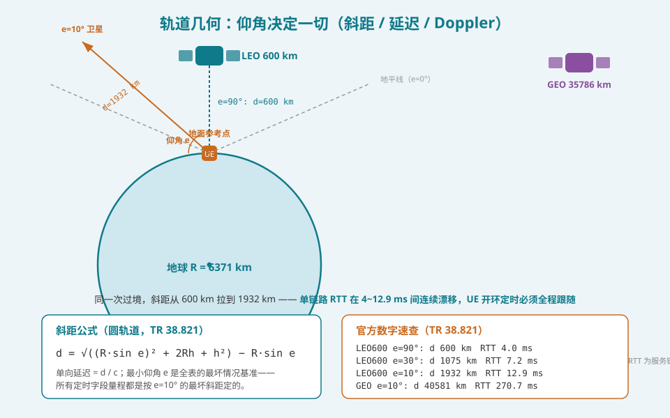
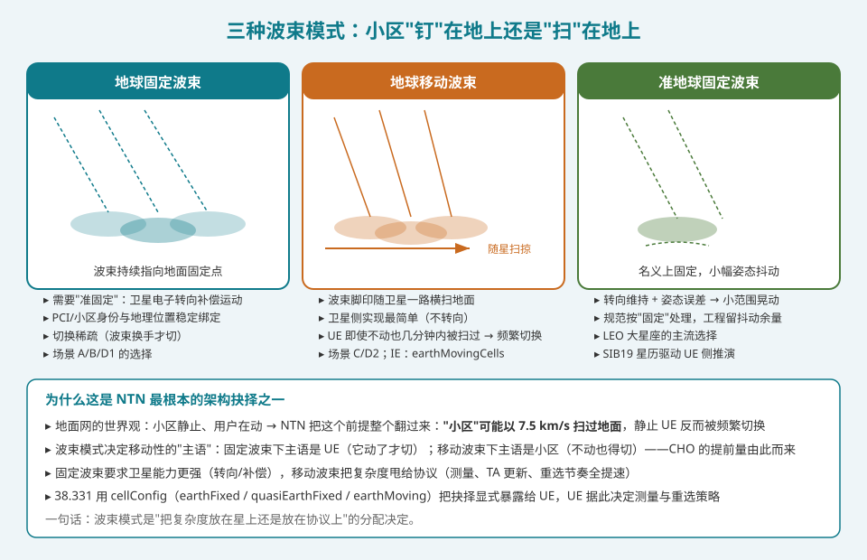
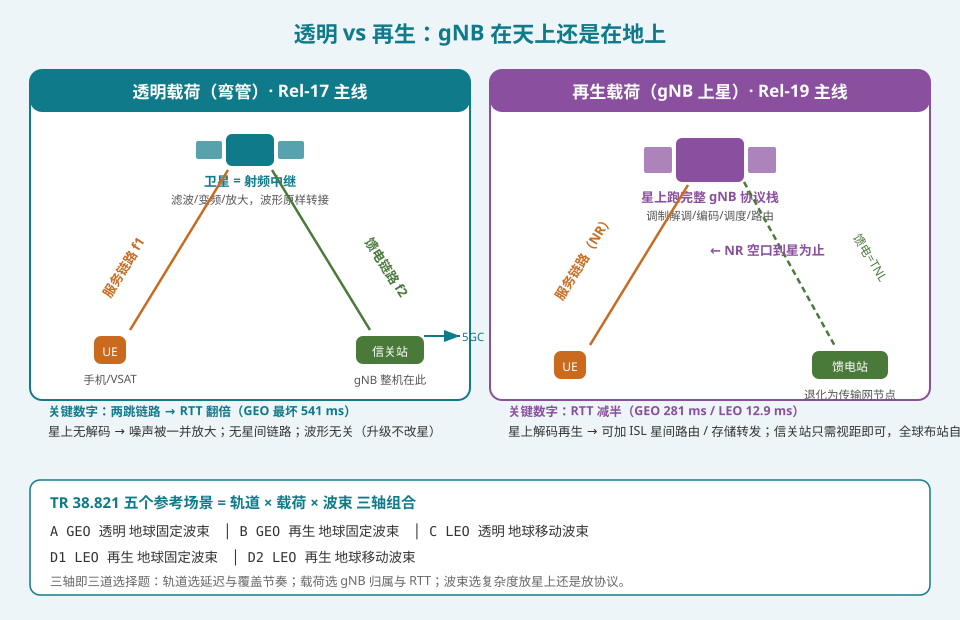
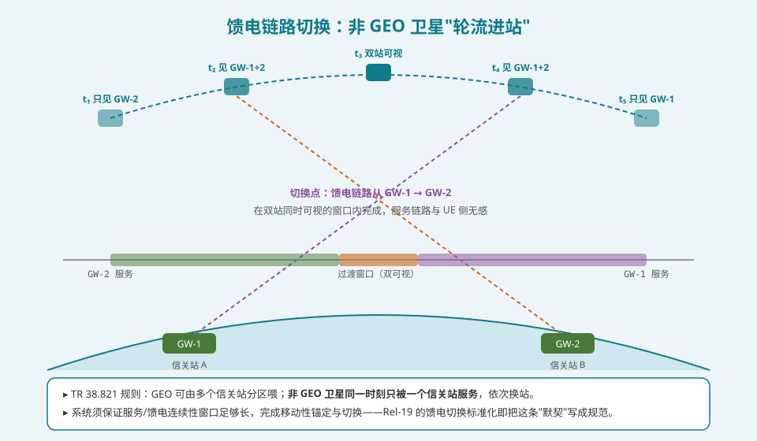

## 本篇要解决什么

系列第一篇讲过 NTN 入门全景，但当时"架构"只是背景板。前十四篇反复引用的每一个数字——K_offset 的量级、T310 的 12 s 档位、ta-Common 的 66485757 满量程、近远效应、馈电切换——**全部由一个源头决定：卫星在哪、怎么动、gNB 放哪**。本篇把这个源头正式摊开：轨道几何给了延迟与 Doppler 的边界，载荷形态给了协议栈的归属，波束模式给了移动性的"主语"。

先说结论：**NTN 架构是三道选择题的组合——轨道（延迟/覆盖节奏）、载荷（gNB 归属/RTT 翻倍与否）、波束（复杂度放星上还是放协议上）。TR 38.821 的五个参考场景 A/B/C/D1/D2 就是这三道题的官方答案集，后续所有规范增强都是在这个答案集上做题。**

对照：**TR 38.821 §4.2**（参考场景与几何参数表）、**TR 38.811 §4.6/§6**（覆盖模式与平台特性）、**TS 38.331**（cellConfig 波束模式 IE、SIB19 星历）、**TS 23.273/38.401**（架构与信关站归属）。

相关：[NTN 综合入门](5g-ntn.html)（本篇的入门版）、[NTN 定时器与定时关系全表](ntn-timers.html)（几何边界的定时消费方）、[NTN 再生载荷](ntn-regenerative-payload.html)（本篇载荷轴的展开）、[NTN 移动性与卫星切换](ntn-mobility.html)（波束模式如何改写切换主语）。

---

## 一、轨道几何：仰角决定一切

### 1.1 一条公式，一张表

对高度 h 的圆轨道，从地面点以仰角 e 看去，斜距为：

\[ d = \sqrt{(R \sin e)^2 + 2Rh + h^2} - R \sin e \]

其中 R = 6371 km。这条公式是 TR 38.821 参数表的来源，代入官方参考场景的三个关键点：

| 轨道 | 仰角 | 斜距 | 服务链路 RTT | 透明载荷全链路 RTT |
|---|---|---|---|---|
| LEO 600 km | 90°（星下点） | 600 km | 4.0 ms | 8.0 ms |
| LEO 600 km | 30° | 1075 km | 7.2 ms | 14.4 ms |
| LEO 600 km | **10°（最低仰角）** | **1932 km** | **12.9 ms** | **25.8 ms** |
| GEO 35786 km | 90° | 35786 km | 238.7 ms | 477.5 ms |
| GEO 35786 km | **10°** | **40581 km** | **270.7 ms** | **541.5 ms** |

三个容易漏读的点：

1. **最低仰角不是"覆盖参数"，是最坏情况基准**。所有定时字段（ta-Common 满量程 ≈ 270.7 ms、K_offset 档位、RAR 窗口）都是按 e=10° 的最坏斜距定的。把最低仰角从 10° 压到 5°，整张表的数字全部上移——这是覆盖与成本的直接兑换。
2. **透明载荷的 RTT 恰好是再生的两倍**——参考假设馈电链路与最坏服务链路等长。真实部署不等长，这正是 Common TA 必须广播而非推导的原因。
3. **同一次过境内的漂移量大得惊人**：LEO 600 km 从头顶到 10° 仰角，RTT 在 4.0~12.9 ms 之间连续变化，且变化速率随仰角降低而加快——这就是[多普勒篇](ntn-doppler.html)「多普勒变化率峰值出现在低仰角」和[定时器篇](ntn-timers.html)「ta-Common 三阶外推」的共同几何来源。

### 1.2 波束内与视场内：两个不同量级的延迟差

- **视场内（整片可视区）**：LEO 单次过境延迟差近 9 ms——驱动 UE 开环定时跟踪的速率要求；
- **波束内（单个脚印，LEO 可达 1000 km 直径）**：最大差分延迟约 0.65 ms（GEO 约 1.6 ms）——这是 RACH 设计必须吸收的量。0.65 ms 相当于 15 kHz 子载波间隔下 **约 660 个循环前缀**，任何保护间隔都兜不住，**每个 UE 独立的定时提前是唯一出路**——GNSS 必选的最根本物理理由。

### 1.3 三种轨道的画像

| 平台 | 高度 | RTT（服务链路） | 典型波束直径 | 移动性节奏 |
|---|---|---|---|---|
| LEO | 300–1500 km | < 30 ms | 100–1000 km | 单星可视约 20 分钟，波束内停留几分钟 |
| MEO | 7000–25000 km | 数十~百 ms | 100–1000 km | 中间档，Doppler 小一个量级 |
| GEO | 35786 km | 239–271 ms | 200–3500 km | 对地静止，切换近乎与卫星无关 |

GEO 有一个常被忽略的几何限制：**纬度 ±81° 以外不可见**（球面几何 horizon 约束）——高纬度区域天然是 LEO/MEO 的领地。极轨道 LEO 星座对全球覆盖的价值正在于此。

---

## 二、三种波束模式："小区"钉在地上还是扫在地上

地面网的世界观是：**基站静止，用户在动**。NTN 把这个前提整个翻过来——卫星以约 7.5 km/s 飞，所谓"小区"可以横扫地面。规范用三种波束模式描述小区与地面位置的关系：

### 2.1 地球固定波束（earth-fixed）

卫星用电子转向持续把波束钉在地面固定点。PCI、NCI 与地理位置稳定绑定，UE 不动就不切换——**主语是 UE**。代价是星上复杂度（转向、多普勒与定时预补偿都按固定点几何算）。

### 2.2 准地球固定波束（quasi-earth-fixed）

名义固定，但姿态抖动和转向误差让它在一个小范围内"晃"。工程上按固定处理、按抖动留余量。**这是 LEO 大星座的主流选择**——SIB19 的星历参数（positionVelocity + epochTime）就是为了让 UE 能自己推演这套几何。

### 2.3 地球移动波束（earth-moving）

波束脚印随卫星一路横扫，星上实现最简单（不转向）。代价全甩给协议：静止 UE 也在波束间穿越，测量、TA 更新、重选、切换节奏全面提速——**主语是小区**。[移动性篇](ntn-mobility.html)的 CHO 提前量、[随机接入篇](ntn-rach.html)对 ta-CommonDrift 的依赖，在移动波束场景下都取最紧的值。

38.331 用 `cellConfig`（earthFixed / quasiEarthFixed / earthMoving）把这道架构抉择显式暴露给 UE——UE 据此决定自己的测量与重选策略。**波束模式本质上是"复杂度放星上还是放协议上"的分配决定。**

---

## 三、透明 vs 再生：gNB 在天上还是在地上

### 3.1 透明（弯管）：Rel-17 主线

卫星只做射频五件事：滤波、变频、放大、收发。NR 空口终止在**地面信关站的 gNB**，波形原样转接。三个后果：

- **RTT 翻倍**（服务链 + 馈电链），GEO 最坏 541 ms——[定时器篇](ntn-timers.html)的 K_offset 量级由此封顶；
- 噪声随信号一并放大、抗干扰脆弱（星上不解码）；
- **升级与卫星解耦**：波形/协议演进不用改星——这是"弯管先行" commercially 的关键理由，也是 Rel-17 选它做主线的原因。

### 3.2 再生：Rel-19 主线

部分或全部 gNB 功能上星，NR 空口终止在卫星，馈电站退化为传输网（TNL）节点。三个回报：

- **RTT 减半**（GEO 281 ms / LEO 12.9 ms）；
- 馈电站只需与卫星视距，全球布站自由度大增，还可加**星间链路（ISL）**做星上路由——覆盖洋区时数据不必回到本土落地；
- 解码再生打开了**存储转发（S&F）**：无馈电窗口时先存后传，IoT 延迟容忍业务的范式转变。

### 3.3 五个参考场景：三轴组合

TR 38.821 用三道选择题组合出五个参考场景：

| 场景 | 轨道 | 载荷 | 波束 |
|---|---|---|---|
| **A** | GEO | 透明 | 地球固定 |
| **B** | GEO | 再生 | 地球固定 |
| **C** | LEO | 透明 | 地球移动 |
| **D1** | LEO | 再生 | 地球固定 |
| **D2** | LEO | 再生 | 地球移动 |

**读法**：MEO 不是官方参考场景（作为中间档可由 LEO/GEO 参数内插评估）；场景 A/C 是 Rel-17 规范优化的主力（透明 + 两类波束极端）；D1/D2 是 Rel-19 再生载荷的展开。前十四篇提到的每一个 K_offset/定时器取值，都能在[定时器全表](ntn-timers.html)里对号入座到某个场景的最坏情况。

---

## 四、馈电链路切换：非 GEO 卫星"轮流进站"

架构图里藏着一条容易忽略的运营规则（TR 38.821）：

- **GEO**：可以由多个信关站分区喂（覆盖 continental 尺度），假设一个小区内的 UE 由同一信关站服务；
- **非 GEO**：卫星满天飞，**同一时刻只被一个信关站服务**，依次换站——LEO 卫星绕地球一圈，要依次"进站"多次。

换站时卫星正在服务成千上万 UE，怎么保证无感？答案是**双站可视窗口**：卫星同时看到新旧两个信关站时完成馈电切换，服务链路侧（UE）完全无感。系统设计的硬要求是：**服务/馈电连续性窗口必须足够长，容得下移动性锚定与切换流程**——这句话写在 TR 38.821 的假设里，Rel-19 把它正式标准化（含馈电切换 feeder link switchover 的显式流程）。

透明载荷下这件事尤其关键：馈电链路断了，等于地面 gNB 与射频前端失联——UE 侧表现为整颗卫星的细胞全体"消失"。这就是[移动性篇](ntn-mobility.html)要求卫星侧提前广播切换计划、UE 侧 CHO 提前量要算上馈电切换的原因之一。

---

## 五、总归位：架构如何决定前十四篇的边界

| 前十四篇的概念 | 架构来源 |
|---|---|
| K_offset 档位与 ta-Common 满量程 270.7 ms | GEO e=10° 最坏斜距（轨道轴） |
| RTT 翻倍 vs 减半的两套定时账 | 透明 vs 再生（载荷轴） |
| 静止 UE 也要频繁切换 | 地球移动波束（波束轴） |
| GNSS 必选 | 波束内 0.65 ms 差分延迟无法用保护间隔兜住 |
| ta-CommonDrift 三阶外推 | 过境内 RTT 连续漂移、低仰角变化率加快 |
| CHO 提前量 / 卫星切换计划 | 过境 20 分钟 + 波束停留几分钟 + 馈电切换窗口 |
| 近远效应（位置触发测量） | 波束直径 100–3500 km，RSRP 与地理位置弱相关 |
| 存储转发 / ISL 路由 | 再生载荷 + 馈电不可持续的间隙 |

**读法**：本篇是系列的"坐标系篇"——前面每篇的"为什么"，最终都会落到轨道、载荷、波束三根轴上。理解了这张坐标系，Rel-19/未来专题（再生全景、ISL、多轨道）只是把三根轴的取值范围继续拓宽。

---

## 排障清单：架构视角下的新嫌疑

1. **定时异常先查场景对号**：UE 配置的 K_offset/TA 参数是否与实际部署场景（轨道 × 载荷）匹配——拿 GEO 场景的定时假设跑 LEO，余量全部错位。
2. **静止用户反复掉话**：先确认波束模式——earth-moving 场景下"静止 UE 频繁切换"是特性不是故障，检查的是切换成功率而非切换次数。
3. **整颗卫星的细胞同时消失**：透明载荷下优先怀疑馈电链路/信关站切换窗口问题，而非服务链路本身。
4. **高纬度无 GEO 覆盖**：±81° 纬度限制是几何宿命，不是配置错误——检查星座里是否有极轨 LEO 补位。
5. **星历推演与实际波束位置偏差大**：quasi-earth-fixed 的姿态抖动 + `epochTime` 过期（valueTag 未更新）——刷新 SIB19 后复测。
6. **过境后期 CQI 骤降**：低仰角斜距拉长 + 变化率加快，检查调度器是否随仰角自适应降 MCS，而非固定档位。

---

## 自测七题

1. 写出斜距公式，并解释为什么"最低仰角"是全表的最坏情况基准。
2. LEO 600 km 过境中，服务链路 RTT 的漂移范围是多少？这个漂移驱动了前十四篇的哪些机制？
3. 波束内差分延迟约 0.65 ms 为什么等于"每 UE 独立 TA 是唯一出路"？
4. 三种波束模式下，移动性的"主语"分别是谁？UE 侧行为有何不同？
5. 透明载荷 RTT 为什么恰好是再生的两倍？真实部署为什么不严格两倍？
6. 非 GEO 卫星馈电切换为什么能对 UE 无感？前提条件是什么？
7. TR 38.821 五场景是哪三根轴的组合？场景 A/C 与 D1/D2 分别对应哪个 Release 的主线？

参考答案

1. d = √((R·sin e)² + 2Rh + h²) − R·sin e。仰角越低斜距越长，e=10° 是规范允许的最低工作仰角，对应最大斜距与最大延迟——所有定时字段量程按此最坏值设定。
2. 4.0 ms（90°）到 12.9 ms（10°），近 9 ms 连续漂移且低仰角变化加快。驱动：ta-Common 三阶外推、开环定时跟踪速率要求、多普勒变化率峰值在低仰角、调度器随仰角自适应。
3. 0.65 ms 远超任何循环前缀/保护间隔的量级（约 660 个 CP），上行接收不可能用公共窗口覆盖所有用户，必须给每个 UE 独立的定时提前——而 TA 量与距离强相关，需要 GNSS 提供位置。
4. 地球固定：主语是 UE，UE 不动不切换；准固定：同上但留抖动余量；地球移动：主语是小区，静止 UE 也被扫过、必须按小区节奏测量/重选/切换。
5. 参考假设馈电链路与最坏服务链路等长（两跳各 e=10°），故 2 倍。真实部署中信关站选址与卫星星下点无关，馈电链路长度独立变化，所以 Common TA 必须显式广播而非推导。
6. 在新旧信关站同时可视的窗口内完成馈电链路切换，服务链路（UE 侧）波形与连接不变；前提是连续性窗口足够长，容纳移动性锚定与切换流程。
7. 轨道 × 载荷 × 波束三轴。A（GEO 透明 固定）/C（LEO 透明 移动）是 Rel-17 透明主线；D1/D2（LEO 再生，固定/移动）是 Rel-19 再生主线的展开，B 为 GEO 再生备选。

