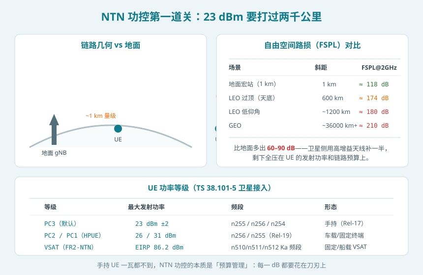
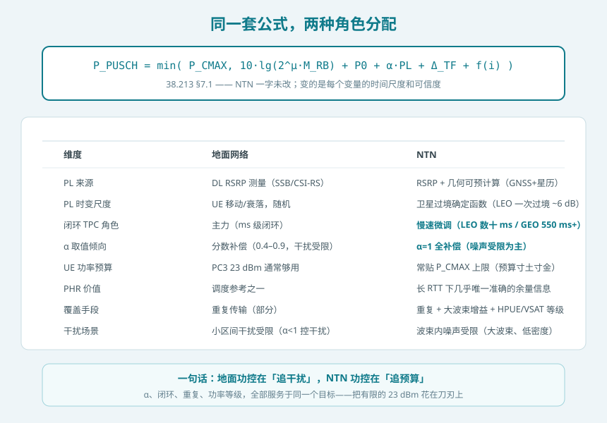
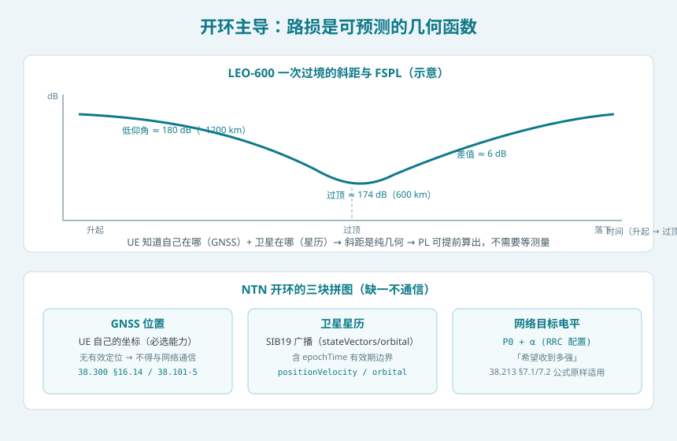
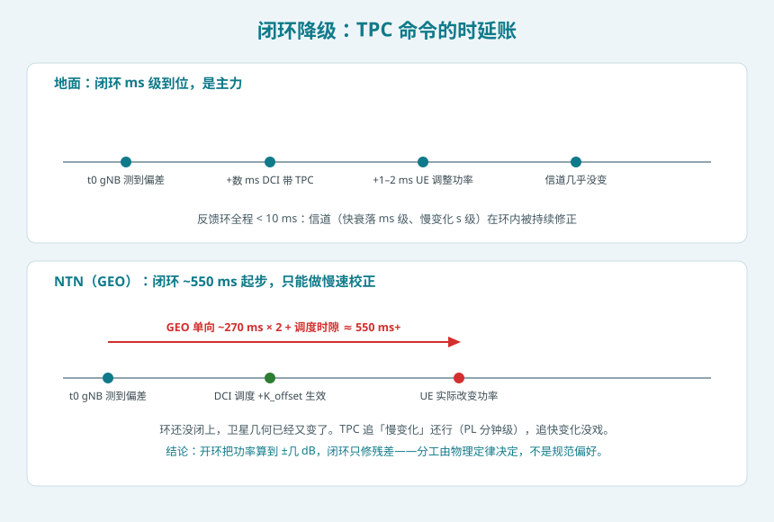

## 本篇要解决什么

前面八篇专题里，功率像个隐形角色偶尔露面：[随机接入](ntn-rach.html)里 PRACH 有功率爬坡，[调度与 HARQ](ntn-harq.html) 里 MCS 收紧是为了给功控减负，[多普勒补偿](ntn-doppler.html)的残差预算里有终端运动分量。本篇让功率站到台前，回答：**上行功率控制这套在地面网跑了十几年的机制，到卫星上还能不能用？谁主谁辅？23 dBm 的手持终端怎么打过两千公里？**

先说结论：**公式一个字没改——RAN1 在 Rel-17 明确不为 NTN 设计新的功控机制，38.213 §7 的 PUSCH/PUCCH/SRS/PRACH 四个公式原样适用。改的是权重：地面靠闭环（毫秒级反馈追衰落），NTN 靠开环（GNSS + 星历的可预测几何），闭环降级为慢速微调。这是物理定律决定的分工，不是规范偏好。**

对照：**TS 38.213 §7.1/7.2/7.3/7.4**（四信道功率公式与 PHR）、**TS 38.101-5**（卫星接入 UE RF，功率等级与 A-MPR）、**TS 38.300 §16.14**（GNSS/星历有效性前提）、**TS 38.321 §5.1**（PRACH 功率爬坡）、**TR 38.821 §6/7**（链路预算评估）。
相关：[NTN 多普勒与时频补偿](ntn-doppler.html)（同一份卫星几何在时频两域的账）、[NTN 随机接入](ntn-rach.html)（爬坡的第一次应用）、[NTN 调度与 HARQ](ntn-harq.html)（MCS 与功率的联动）。

---

## 一、先看战场：23 dBm 对 174 dB

NTN 功控为什么是硬仗，从数字开始。自由空间路损 FSPL = 20·lg(4πd/λ)：

| 场景 | 斜距 | FSPL @ 2 GHz |
| --- | --- | --- |
| 地面宏站（约 1 km） | 1 km | ≈ 118 dB |
| LEO-600 过顶 | 600 km | ≈ 174 dB |
| LEO-600 低仰角 | ~1200 km | ≈ 180 dB |
| GEO | ~36000 km+ | ≈ 210 dB |

比地面多出 **60–90 dB**。这缺口由三方分摊：卫星侧超大天线增益（补掉大头）、UE 侧的链路预算精算、以及——当这些都到极限时——**重复传输用时间换增益**（IoT-NTN 的主武器）。手持 UE 的发射功率上限 PC3 = 23 dBm（±2 dB，38.101-5 Rel-17 为卫星接入指定的默认等级），一瓦都不到。**NTN 功控的本质因此从地面的「干扰协调」变成「预算管理」：每一 dB 都要花在刀刃上。**

功率等级方面（38.101-5）：

| 等级 | 最大功率 | 频段 | 形态 |
| --- | --- | --- | --- |
| PC3（默认） | 23 dBm ±2 | n255 / n256 / n254 | 手持（Rel-17 起） |
| PC2 / PC1（HPUE） | 26 / 31 dBm | n256 / n255（Rel-19 增补） | 车载/固定终端（PC1 非手机形态） |
| VSAT（FR2-NTN） | EIRP 86.2 dBm | n510/n511/n512 Ka 频段 | 固定/船载 VSAT |

另有区域监管的 A-MPR/NS_xN 限值（如 n254 的 NS_04N 要求 27 dBm/4kHz 平均功率密度），实际可用上限是 `P_CMAX` 减去这些回退——**功控的「天花板」本身在 NTN 里就比地面复杂**。

## 二、公式没变：38.213 §7 全套照搬

四个信道的功率公式在 NTN 中逐字适用，以 PUSCH 为代表：

$$P_{PUSCH} = \min\{P_{CMAX},\ 10\lg(2^\mu M_{RB}) + P_0 + \alpha \cdot PL + \Delta_{TF} + f(i)\}$$

- \(P_0\)：小区标称 + UE 专属偏置之和，网络配置的「目标接收电平」；
- \(\alpha\)：路损补偿因子 {0, 0.4, …, 1.0}；
- \(PL\)：路损估计；
- \(\Delta_{TF}\)：MCS 相关项；
- \(f(i)\)：闭环 TPC 累计修正。

PUCCH（\(g(i)\) 闭环项）、SRS、PRACH（爬坡公式）同理。**Rel-17 NTN 工作项里，RAN1 的决议是复用而非新造**——评估过的「NTN 专属开环方案」最终都收敛到「现有框架 + 参数配置即可表达」。这不是偷懒：现有公式里 \(P_0 + \alpha \cdot PL\) 本来就是一个完整的开环项，把 \(PL\) 算准、\(\alpha\) 配对，开环的全部能力就已经在公式里了。

## 三、开环承担主责：路损是可预测的几何函数

开环的核心输入是 \(PL\)。NTN 里它有三个关键特性：

**1. 可预测**。UE 知道自己在哪（GNSS，必选能力），卫星在哪（SIB19 星历），两者一夹就是斜距：

$$d = \sqrt{(R_E+h)^2 - R_E^2\cos^2\theta} - R_E\sin\theta$$

（\(R_E\) 地球半径，\(h\) 轨道高度，\(\theta\) 仰角。）斜距代入 FSPL 公式即得瞬时路损——**一个纯几何函数，不用等任何测量**。这是开环在 NTN 里能扛大梁的根本原因。

**2. 缓变且确定**。LEO 一次过境，路损从低仰角 ≈180 dB 变到过顶 ≈174 dB，全程约 6 dB，且是平滑的 S 曲线——相比地面衰落的随机快跳变，这简直是「慢动作回放」。UE 按星历外推即可跟随。

**3. 波束内高度相似**。卫星覆盖区里所有 UE 到卫星的距离都在同一量级（u-blox 的表述：小区中心与边缘的信号强度差异很小）——这与地面「近点/远点」差异巨大的图景完全不同。含义有二：路损补偿项 \(\alpha \cdot PL\) 对波束内所有 UE 几乎是同一个数；地面用来「区分远近、抑制干扰」的分数补偿 \(\alpha<1\) 失去了主要对象。

**前提条款要记牢**（38.300 §16.14）：**UE 没有有效 GNSS 定位或有效星历时，不得与网络通信**。没有这两样，开环的全部输入归零——这也是 [SIB19 有效期](ntn-sib19.html)（`ntn-UlSyncValidityDuration`、T430）和 [UE 能力](ntn-ue-capability.html)里 GNSS 相关字段的深层原因。

## 四、闭环降级为慢速微调：TPC 的时延账

闭环功控的环路长度在 NTN 里被彻底改写：

| 环节 | 地面 | NTN（GEO） |
| --- | --- | --- |
| gNB 测量 → 决策 | ms 级 | ms 级（不变） |
| TPC 下发（DCI/RAR/其他 SI） | 下个调度点 | 调度点本身被 K_offset 推后 |
| 命令生效 → UE 改变功率 | +1–2 ms | 命令传播 +270 ms（单向）后 |
| **环路总计** | **< 10 ms** | **≈ 550 ms 起步** |

GEO 环还没闭上，卫星几何又变了。TPC 能追上的是分钟级慢变化（如波束间切换后的系统性偏差、网络侧重新配置 \(P_0\) 后的整定），追不上任何秒级以内的变化。LEO 稍好（数十 ms 环路），但也远逊地面。

所以 NTN 的分工是：**开环把功率算到 ±几 dB 的精度（几何已知），闭环只修残差**——残差来源包括 GNSS 定位误差（米级 → 纳秒级时延差，对 PL 的影响 < 0.1 dB）、星历外推误差、大气与雨衰波动、终端姿态引起的增益变化。这也解释了 [HARQ 专题](ntn-harq.html)里 GEO 关反馈后 MCS 要从 10% BLER 收紧到 1%：**上行质量的短时波动既追不了也修不动，只能靠更保守的目标留余量。**

## 五、α 与噪声受限：NTN 的干扰图景

地面上行是**干扰受限**系统：邻区用户是主要噪声源，分数补偿（\(\alpha<1\)）故意不补满路损，让远点用户少发一点、压一压对邻区的干扰，用吞吐量换整体容量。

NTN 单波束覆盖几十到上千公里，波束间隔离好、同波束用户少，上行主要是**噪声受限**：没人跟你在同一个热噪声里抢，信号能到就能解。于是：

- **α = 1（全补偿）成为 NTN 的常规配置**——路损是多少就补多少，把接收电平精确顶到 \(P_0\)；
- \(P_0\) 可以配得比地面激进——反正多发的功率不会砸到「邻区」（卫星高增益天线把能量限制在自己的覆盖内）；
- 波束间的功率协调更多是**卫星系统级的功率预算问题**（转发器总功率有限、多波束共享），那是载荷设计的账，不是 38.213 的账。

这组差异与 [定时器专题](ntn-timers.html)的结论同构：**地面机制的每一个默认值，都是「密集组网」这个前提的产物；前提一换，默认值就要重审。**

## 六、PHR 与爬坡：长 RTT 下的配角变主角

**功率余量报告（PHR）**的公式与触发机制不变（Type 1/Type 3、周期 + 路损变化触发），但价值在 NTN 里显著上升：

- 长调度管道下，gNB 对 UE 实际功率状态的「新鲜度」很差；PHR 几乎是**唯一准确的余量信息**，而它本身也要跑一趟 K_offset——所以 NTN 的调度器更需要**保守地使用 PHR**（把报告时延折算进去）；
- UE 常年贴近 \(P_{CMAX}\) 运行（预算紧张），PHR 经常是 0 甚至负值（依赖 38.101 的回退规则），网络据此决定要不要降 MCS、减 RB、加重复。

**PRACH 功率爬坡**机制不变（`preambleReceivedTargetPower` + `DELTA_PREAMBLE` + 爬坡计数 × `powerRampingStep`），但参数面貌不同：NTN 的初始目标功率和爬坡步长在参数规划上要更激进（[RACH 专题](ntn-rach.html)的差分时延分析决定了前导格式，路损分析决定了起点功率）。另一个 NTN 特有的细节：**UE 发 Msg1 前已经用 GNSS+星历算好了路损**，所以第一次爬坡的起点就比地面「盲测」准确得多——这是自举反转在功控侧的红利。

## 七、IoT-NTN：把「时间换增益」用到极致

IoT-NTN（NB-IoT/eMTC over 卫星）的功控故事更极端：

- **Rel-17 按卫星场景重新核算了最大耦合损耗目标**，把重复次数与覆盖等级的配置空间拉大——NPRACH 长格式 + 高覆盖等级成为标配，重复次数最多上百次；
- **每翻一倍重复 = 发射占空比翻一倍**：有效吞吐量减半、功耗显著上升，而终端的发射功率本来就被链路预算逼着拉满——**重复不是免费的，是在用电池换覆盖**；
- 因此 IoT-NTN 的功控哲学与 NR-NTN 相同（开环为主），但多一层约束：**覆盖等级的选取要过电池账**——很多卫星物联网项目的失败原因不是链路不通，是电池撑不住。

Rel-19 的 NR NTN 增强（HPUE 等级、上行容量）和再生载荷（[gNB 上星](ntn-regenerative-payload.html)）从两头缓解预算压力：更强的终端等级抬高了天花板，星上处理缩短了环路。

## 八、实践中的坑（排障七则）

1. **PHR 的「时效」**：PHR 经 K_offset 往返才到 gNB，直接按报告值调度会高估 UE 余量——长 RTT 下要把报告年龄折算进去。
2. **α 沿用地面的 0.6/0.8**：干扰受限的分数补偿搬到噪声受限的卫星波束里，白白损失接收电平——NTN 常规应配 α=1。
3. **忘算 A-MPR**：n254 等区域监管限值（NS_xN）会把实际可用功率压到 P_CMAX 以下，链路预算表里不体现就是「少算几个 dB 还找不到原因」。
4. **GNSS/星历失效后的静默**：规范要求 UE 无有效定位或星历时不通信——终端「突然失联」未必是射频故障，先查这两样的有效期。
5. **路损随过境变化 6 dB 却用固定值**：UE 实现若不在连接态持续按星历更新 PL，开环误差会随卫星远离线性放大，表现为「越用越差」。
6. **爬坡起点太保守**：Msg1 前路损已知，起点功率按地面「试探式低起点」配置会白白多烧几轮爬坡时间（每轮都是一个 RTT）。
7. **IoT-NTN 覆盖等级拉满**：重复次数上不封顶地配置覆盖增强，链路是通了，电池先死了——等级选择要过功耗账。

## 九、一句话总结

**NTN 功控是一场「权重再分配」：38.213 的公式一个字没改，但闭环 TPC 从毫秒级的主力降级为慢速微调，开环的 GNSS+星历几何计算升任主角；α=1 取代分数补偿，PHR 从调度参考升任长 RTT 下唯一的余量真相，23 dBm 的功率预算从「够用就好」变成「寸土寸金」——物理定律改写了每个变量的可信度，规范要做的只是让公式继续成立。**

---

## 自测七题

1. Rel-17 为什么没有为 NR-NTN 设计新的功控机制？现有公式里的哪一项就是完整的开环？
2. LEO-600 一次过境，UE→卫星的 FSPL 大约变化多少 dB？这个变化为什么是「可预计算」的？
3. 地面的分数路损补偿（α<1）在 NTN 里为什么失去了主要对象？NTN 的上行是干扰受限还是噪声受限？
4. GEO 的闭环功控环路大约多长？它能修正哪类偏差、追不上哪类变化？
5. 手持 UE 的卫星接入功率等级是多少？Rel-19 的 HPUE 增加到了什么水平？VSAT 呢？
6. 为什么说 PHR 在 NTN 调度里的地位比地面更重要？使用时要注意什么？
7. IoT-NTN 把覆盖等级（重复次数）配到最高有什么隐性代价？

参考答案

1. 现有公式 \(P_0 + \alpha \cdot PL\) 本身就是完整开环项，把 PL 算准（GNSS+星历）、α 配对即可表达所有 NTN 开环方案；RAN1 评估后收敛到复用。
2. 约 6 dB（低仰角 ≈180 dB → 过顶 ≈174 dB）。斜距是 GNSS 位置与星历的纯几何函数，代入 FSPL 即可提前算出，无需测量。
3. 分数补偿的目的是抑制对邻区的干扰，前提是「远近差异大、干扰受限」；NTN 波束内所有 UE 距离同量级、波束间隔离好，上行噪声受限，没有「远点干扰源」需要压制——α=1 全补偿。
4. 约 550 ms 起步（测量 + 调度 + 单向 270 ms 传播）。能修分钟级慢变化（参数整定、波束切换偏差），追不上秒级以内的任何变化。
5. PC3 = 23 dBm（n255/n256/n254，Rel-17 默认）；Rel-19 HPUE 增加 PC2 = 26 dBm、PC1 = 31 dBm（n256/n255，非手机形态）；FR2-NTN 固定 VSAT EIRP 86.2 dBm。
6. 长调度管道下 gNB 对 UE 功率状态的新鲜度极差，PHR 几乎是唯一准确的余量信息；但 PHR 本身也要跑 K_offset，调度时要折算报告年龄，保守使用。
7. 重复翻倍 = 发射占空比翻倍 = 吞吐量减半、功耗显著上升；终端功率本就贴近上限，很多项目的失败原因是电池撑不住而非链路不通。

## 延伸阅读

- TS 38.213 §7.1–7.4：PUSCH/PUCCH/SRS/PRACH 功率公式与 PHR（NTN 原样适用）
- TS 38.101-5 §6.2：卫星接入 UE 功率等级、MPR/A-MPR（NS_xN 区域限值）
- TS 38.300 §16.14：GNSS/星历有效性前提与 NTN 基本机制总纲
- TS 38.321 §5.1：PRACH 功率爬坡；§5.4：PHR 触发
- TR 38.821 §6/§7：NTN 链路预算与功控方案评估
- 站内相关：[NTN 多普勒与时频补偿](ntn-doppler.html) · [NTN 随机接入](ntn-rach.html) · [NTN 调度与 HARQ](ntn-harq.html) · [NTN 定时器全表](ntn-timers.html) · [NTN SIB19](ntn-sib19.html) · [NTN UE 能力](ntn-ue-capability.html) · [5G NTN 综合专题](5g-ntn.html)
