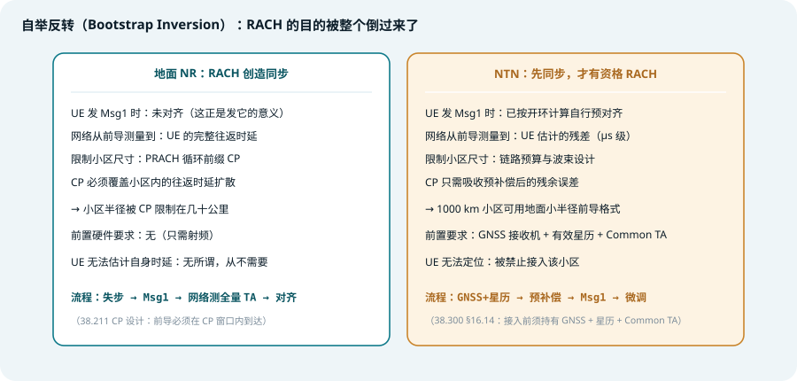
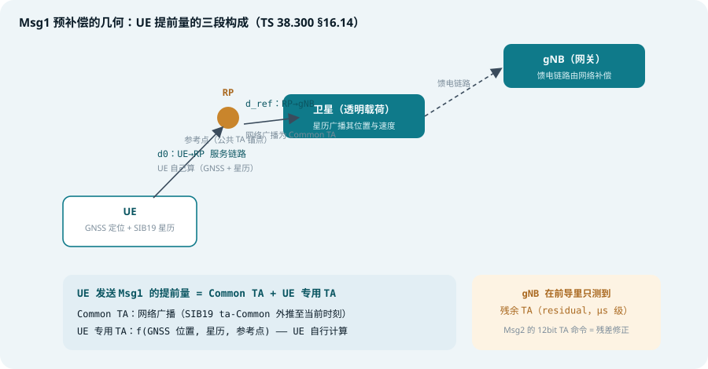
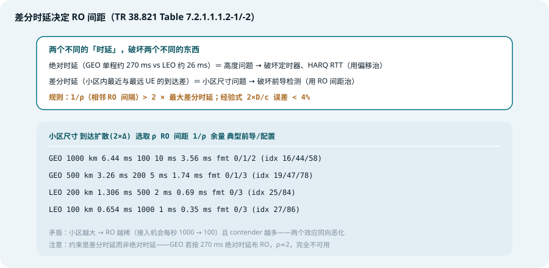
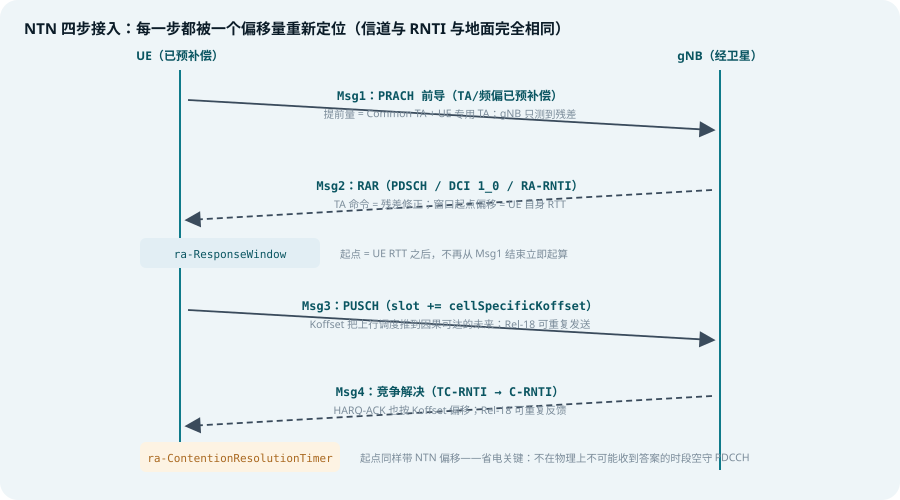

## 本篇要解决什么

[NTN 综合专题](5g-ntn.html)讲了要补偿什么，[SIB19 专题](ntn-sib19.html)讲了补偿参数从哪广播下来。本篇讲**UE 第一次开口说话的那一刻**：随机接入。

随机接入是 NTN 里被改动得最「伤筋动骨」的过程。原因很简单：**RACH 是网络认识 UE 之前唯一必须工作的过程**——其他所有上行传输都发生在 UE 已被对齐之后，而对齐正是 RACH 的产物。卫星网络把这个自举（bootstrap）逻辑整个反转了：

> **地面 NR：UE 失步 → 发 Msg1 → 网络测出全量 TA → 从此对齐。**
> **NTN：UE 先自己算好 TA → 才有资格发 Msg1 → 网络只测出残差。**

一次未补偿的 GEO 前导到达 gNB 时已晚了几百毫秒，gNB 早就停止监听了。所以 UE 必须**在随机接入之前**就完成定时对齐——这一个反转，把 GNSS 推进了 UE（[UE 能力专题](ntn-ue-capability.html)的运行时三重先决）、把星历推进了广播（[SIB19 专题](ntn-sib19.html)）、把预补偿推进了 UE 的第一次发射。

对照：**TS 38.321**（RA 过程与 NTN 计时器偏移）、**TS 38.300 §16.14**（GNSS/星历/Common TA 前提）、**TS 38.211**（前导格式与 PRACH 配置表）、**TS 38.213**（NTN 定时关系）、**TR 38.821 §7.2.1**（候选方案研究）。
相关：[5G NTN 综合专题](5g-ntn.html)、[NTN SIB19](ntn-sib19.html)、[NTN UE 能力](ntn-ue-capability.html)、[NTN 再生载荷](ntn-regenerative-payload.html)、[随机接入](random-access.html)。

---

## 一、自举反转：一张表看懂伤在哪

*图 1：地面 NR 的 RACH「创造」同步；NTN 的 RACH「验证」同步——CP 的角色也从覆盖全小区收缩到只吸收残余误差*

| 维度 | 地面 NR | NTN（Rel-17） |
| --- | --- | --- |
| UE 发 Msg1 时的状态 | 未对齐（这正是发它的意义） | 已按开环计算自行预对齐 |
| 网络从前导学到什么 | UE 的**完整往返时延** | UE 估计的**残差**（μs 级） |
| 限制小区尺寸的因素 | PRACH 循环前缀须覆盖往返扩散 | 链路预算与波束设计，CP 只须吸收残差 |
| 前置要求 | 无 | GNSS 接收机 + 有效星历 + SIB19 Common TA |
| UE 无法定位时 | 无所谓，从不需要 | **被禁止接入该小区** |

这张表里最反直觉的一行是 CP：地面网里前导格式的 CP 长度决定了小区半径上限（几十公里）；NTN 里 1000 km 的小区可以用地面小半径的前导格式——**因为 UE 已经把 99.99% 的时延预补偿掉了，CP 只需要兜住残余估计误差**。物理层流水线（信道、DCI、RNTI）与地面完全相同，被改写的只有围绕它的**定时**。

### TR 38.821 候选方案 → Rel-17 落地对照

研究阶段（TR 38.821 §7.2.1）摆出过一长串候选，最终落地情况是理解 Rel-17 设计哲学的最佳索引：

| TR 38.821 候选方案 | Rel-17 结果 |
| --- | --- |
| UE 用位置 + 星历预补偿 TA | **采纳并强制**（GNSS 成为 NTN 接入的前提条件） |
| ra-ResponseWindow 起点可配置偏移 | **采纳** |
| ra-ContentionResolutionTimer 起点偏移 | **采纳** |
| 扩展响应窗时长以覆盖全差分时延 | 预补偿普及后**基本不必要**（取值范围有扩展但远不到极限） |
| MsgA 携带辅助信息 | 落地为 **ta-Report**（UE 上报自己施加的 TA） |
| Msg3 按最坏时延假设调度 | 由 **Koffset（cellSpecificKoffset）** 承担 |
| 前导分组 / 跳频 / SFN index 辅助 | **未采用**——预补偿让这些歧义根本不会发生 |
| 拉大 RO 间距 | 保留为部署选择，但只需覆盖预补偿后的**残差** |

读法：凡是「为不知道 UE 位置而支付的代价」的方案全部落选；凡是「让 UE 自己把位置算清楚」的方案全部转正。

---

## 二、Msg1 的预补偿：几何与构成

*图 2：UE 的提前量由 Common TA（网络广播）+ UE 专用 TA（自己计算）两段构成，目标是让信号「汇聚」在参考点 RP*

NTN 的上行定时以**参考点（RP）**为锚（TS 38.300 §16.14 时序关系图）：小区里每个 UE 都把发射提前到在 RP 汇聚，而不是在各自天线处对齐——这就是前导「收敛」而非「扩散」的原因。

UE 发送 Msg1 的提前量：

$$TA_{UE} = TA_{common}(t) + TA_{specific}$$

- **Common TA**：网络在 [SIB19](ntn-sib19.html) 广播的 `ta-Common` + 漂移外推（对应 RP 到 gNB 的馈电路径 + 服务链路公共部分）
- **UE 专用 TA**：UE 用 GNSS 位置 + 星历解算的卫星实时位置，算出自己到 RP 的服务链路差分（d1 − d0）
- **多普勒预补偿**：同一套几何顺便算出视线方向的多普勒频移，UE 在前导发射前做频偏纠正（馈电链路的多普勒由网络补偿）

结果：gNB 收到的「TA」只剩**残差**（μs 级）——Msg2 RAR 里那条 12bit TA 命令，语义从地面的「全量定时提前」变成了「对 UE 估计的微调」。

**没有 GNSS 的 UE 怎么办？** Rel-17 的回答干脆：不能接入。这是[ UE 能力专题](ntn-ue-capability.html)里 GNSS 没有能力字段的原因——它不是可选能力，而是**接入资格**。TR 38.821 曾为「无位置 UE」设计过整套方案（扩展窗口覆盖全差分时延、前导分组消歧），全部停留在研究报告中。

---

## 三、差分时延与 RO 间距：部署设计的第一课

*图 3：RO 间距由 2×最大差分时延决定——GEO 1000 km 小区 10 ms 一档，LEO 100 km 小区 1 ms 一档*

PRACH 资源配置在 NTN 部署里有一张经典的量纲表（TR 38.821 Table 7.2.1.1.1.2-1/-2）：

| 小区尺寸 | 到达扩散（2×最大差分时延） | 选取 ρ（RO/秒） | RO 间距 1/ρ | 余量 | 前导格式 / PRACH 配置索引 |
| --- | --- | --- | --- | --- | --- |
| GEO 1000 km | 6.44 ms | 100 | 10 ms | 3.56 ms | fmt 0/1/2（idx 16/44/58） |
| GEO 500 km | 3.26 ms | 200 | 5 ms | 1.74 ms | fmt 0/1/3（idx 19/47/78） |
| LEO 200 km | 1.306 ms | 500 | 2 ms | 0.69 ms | fmt 0/3（idx 25/84） |
| LEO 100 km | 0.654 ms | 1000 | 1 ms | 0.35 ms | fmt 0/3（idx 27/86） |

三个要点：

1. **绝对时延 ≠ 差分时延**。绝对时延是「高度问题」（GEO 单程约 270 ms vs LEO 约 26 ms，差 20 倍），破坏的是定时器与 HARQ RTT，用偏移量治；差分时延是「小区尺寸问题」（1000 km 小区无论从 600 km 还是 35786 km 轨道馈电，扩散都约 3.3 ms），破坏的是前导检测，用 RO 间距治。GEO 若按绝对时延布 RO，每秒只有约 2 次接入机会——完全不可用
2. **规则**：相邻 RO 间隔必须大于 2×最大差分时延，否则 gNB 无法分辨前导属于哪个 RO 的接收窗。经验公式 `2×D/c`（D 为小区直径）与 TR 38.821 数值误差不到 4%
3. **没人逃得过的权衡**：小区越大 → RO 越稀（1000 次/秒 → 100 次/秒）→ 而大小区里 UE 更多——接入机会与竞争者数量同向恶化。这是「NTN 波束脚印要小」最强的工程论据之一，仅次于链路预算

### 前导格式为什么偏爱 Format 3

格式 0/1/2 是 1.25 kHz SCS 的长序列，格式 3 是 **5 kHz SCS**——SCS 翻四倍，对残余频差的容忍就翻四倍，而「残余频差容忍」正是 NTN 最缺的货币。所以 format 3 反复出现在可行配置里是**多普勒原因，不是小区尺寸原因**（GEO 500 km / LEO 各档配置表里都有它）。结合前述 CP 逻辑：地面网选前导格式看 CP 覆盖，NTN 选前导格式看**抗频偏**——同一个参数表，两种选型哲学。

---

## 四、四步接入逐条过：哪里被偏移了

*图 4：信道、DCI、RNTI 与地面完全一致；被改写的只有每一步的定时起点*

物理层流水线对照（不变的骨架）：

| 消息 | 物理信道 | 调度者 | RNTI | NTN 变化 |
| --- | --- | --- | --- | --- |
| Msg1（前导） | PRACH | UE 自发 | — | **TA + 频偏预补偿在发射前完成** |
| Msg2（RAR） | PDSCH | DCI 1_0 | RA-RNTI | TA 字段语义 = 残差；**窗口起点偏移** |
| Msg3 | PUSCH | RAR UL grant | TC-RNTI | **slot += cellSpecificKoffset** |
| Msg4 | PDSCH | DCI 1_0 | TC/C-RNTI | 竞争解决定时器起点偏移；HARQ-ACK 也按 Koffset |
| MsgA（两步） | PRACH+PUSCH | UE 自发 | — | 预补偿同样适用于两段 |
| MsgB（两步） | PDSCH | DCI 1_0 | MsgB-RNTI | msgB-ResponseWindow 同样扩展 |

RA-RNTI 计算公式与地面完全相同（基于 RO 的时隙/符号/频域索引）——因为预补偿已经消除了「前导属于哪个 RO」的歧义，TR 38.821 里的 SFN index 辅助方案才没有进入规范。

### Msg2：ra-ResponseWindow 的起点偏移

地面网里 RAR 窗口紧随 Msg1 之后开启。NTN 里如果照搬，UE 会在**物理上不可能收到答案**的时段空守 PDCCH。Rel-17 的解法：

- **窗口起点 = UE 自身往返时延之后**（不是 Msg1 结束后立即起算）
- 窗口时长无需扩到极端——每个 UE 的预补偿已把自己的不确定性收窄到残差级
- 无位置 UE 分支的「扩展窗口覆盖全差分时延」方案（GEO 需 ≥ 20.6 ms）随之作废

### Msg3：Koffset 保证因果可达

网络调度 Msg3 时还没有该 UE 的绝对 TA，Rel-17 用 **cellSpecificKoffset**（[SIB19](ntn-sib19.html) 广播）把上行调度关系整体推到未来：`Msg3 slot = RAR slot + k2 + Koffset`。Koffset 太小的症状非常特异：**过程走到 Msg3 就停滞**——Msg3 的调度时刻落在过去，因果不可达。排障对照：`cellSpecificKoffset` 是否覆盖「服务链路 RTT + Common TA」。

### Msg4：ra-ContentionResolutionTimer 同款偏移

竞争解决定时器地面行为是 Msg3 发完立即启动；NTN 里同样加了起点偏移（UE RTT 之后），收益是省电——不在不可能收到 Msg4 的时段监听 PDCCH，对 GEO（单程 270 ms）尤其可观。

### 两步 RACH：MsgA 自带答案

MsgA = PRACH 前导 + PUSCH 载荷。载荷里携带辅助信息，让网络**从第一条消息就知道 UE 施加的 TA**——落地形式就是 [SIB19](ntn-sib19.html) 的 `ta-Report {enabled}`（对应 UE 能力 `uplink-TA-Reporting-r17`）。网络不再需要按最大时延假设调度，MsgB 完成竞争解决与 TA 校正。`msgB-ResponseWindow` 同样按 NTN 偏移设计。两步接入在 NTN 里的价值比地面更大：**每次流程往返都省掉一次 270 ms 级的 RTT**。

---

## 五、Rel-18 覆盖增强：Direct-to-Cell 的续命工程

手持终端直连卫星（Direct-to-Cell）链路预算极度紧张，Rel-18 给 RACH 加了一套覆盖增强（对应 UE 能力专题 Rel-18 字段）：

- **PRACH 重复发送**：重复因子 1/2/4/8，gNB 接收端能量累积提升检测概率
- **RO 分组（RO Groups）**：UE 按测量的下行 RSRP 判断自己的覆盖等级，选对应重复次数的 RO 组发前导——覆盖差的 UE 自动用更多重复
- **Msg3 重复**：竞争解决期间链路差，UE 可连续多次发 Msg3，gNB 合并接收
- **Msg4 的 HARQ-ACK 重复**：反馈也能重复发送

注意机制细节：这不是失败后的重传（power ramping 那一套），而是**主动的能量累积**——在第一次尝试就提高成功率，因为 NTN 里每次失败重试的代价是以 RTT 计的。

---

## 六、实践中的坑（排障视角）

1. **接入失败先查预补偿三件套**：日志里 `gnssFixValid=0`（无 GNSS 定位）、星历过期（[SIB19](ntn-sib19.html) 有效期/T430）、Common TA 缺失——任一为零，Msg1 就是「裸发」，几乎必然检测失败
2. **RAR 收不到但网络发了**：查 `ra-ResponseWindow` 的 NTN 起点偏移配置——窗口开得太早，UE 在信号物理上不可能到达的时段监听，随后过早超时
3. **过程卡死在 Msg3**：Koffset 太小，Msg3 调度时刻不因果可达——对照 `cellSpecificKoffset` vs 服务链路 RTT + Common TA
4. **竞争解决超时但 Msg4 已发**：`ra-ContentionResolutionTimer` 从 Msg3 发送时刻起算而没有用偏移——查定时器的 NTN 偏移配置
5. **频偏导致前导检测率低**：看 `freqPreCorr_Hz` 是否随仰角/卫星速度变化——恒为零说明多普勒预补偿没生效；残差 CFO 会把 1.25 kHz SCS 的长格式前导直接抹掉（这正是 format 3 存在的理由）
6. **大小区接入拥塞**：别只加功率——检查 RO 间距配置。1000 km 小区 ρ=100 时接入机会本来就少，UE 数量却在上升，唯一出路是缩小波束脚印
7. **两步接入的 ta-Report 语义**：Msg2/MsgB 的 TA 命令是「残差修正」，日志里看到 12bit TA 值很小是**正常的**——看到大值反而说明预补偿失败

---

## 七、一句话总结与自测

> **地面网 RACH 创造同步，NTN RACH 验证同步——自举反转让 GNSS 成为门票、让 CP 只兜残差、让 RA 计时器全部改为「从物理可能时刻起算」。每一次接入省下的毫秒，都来自 UE 在开口之前自己算清楚的那笔几何账。**

1. 什么是 NTN RACH 的「自举反转」？它如何解释 GNSS 成为接入的强制前提？
2. UE 发送 Msg1 的提前量由哪两段构成？各自的信息来源是什么（网络广播 vs UE 计算）？
3. Msg2 RAR 中 12bit TA 命令在地面网与 NTN 中的语义有何不同？为什么日志里 NTN 的 TA 值通常很小？
4. 差分时延与绝对时延分别破坏什么？RO 间距该按哪个设计？GEO 1000 km 小区的 ρ 和 RO 间距各是多少？
5. 为什么前导格式 3（5 kHz SCS）在 NTN 配置表里反复出现？这与地面网选前导格式的哲学差异在哪？
6. ra-ResponseWindow 与 ra-ContentionResolutionTimer 在 NTN 中如何偏移？这种设计比「扩展窗口时长」好在哪里？
7. Rel-18 的 PRACH 重复与传统的失败重传（power ramping）机制差异在哪？为什么要主动重复？

### 延伸阅读

以下规范的定位与关键章节，见本站 [3GPP 规范地图](3gpp-spec-map.html)：

- [TS 38.321](3gpp-spec-map.html#ts-38321)——§5.1 随机接入过程、NTN 计时器偏移（ra-ResponseWindow / ra-ContentionResolutionTimer），[官方页面](https://www.3gpp.org/dynareport/38321.htm)
- [TS 38.300 §16.14](3gpp-spec-map.html#ts-38300)——GNSS/星历/Common TA 前提与时序关系图，[官方页面](https://www.3gpp.org/dynareport/38300.htm)
- [TS 38.211](3gpp-spec-map.html#ts-38211)——§6.3.3 前导格式与 PRACH 配置表，[官方页面](https://www.3gpp.org/dynareport/38211.htm)
- [TS 38.213](3gpp-spec-map.html#ts-38213)——§4.2 NTN 定时关系（Koffset、Common TA），[官方页面](https://www.3gpp.org/dynareport/38213.htm)
- [TR 38.821 §7.2.1](3gpp-spec-map.html#tr-38821)——NTN 随机接入候选方案研究与量纲表，[官方页面](https://www.3gpp.org/dynareport/38821.htm)
- 相关本站专题：[5G NTN 综合专题](5g-ntn.html)、[NTN SIB19](ntn-sib19.html)、[NTN UE 能力](ntn-ue-capability.html)、[NTN 再生载荷](ntn-regenerative-payload.html)、[随机接入](random-access.html)
