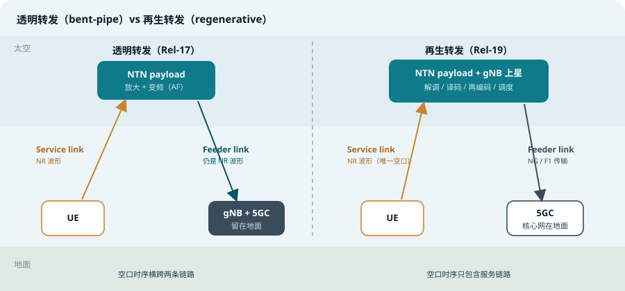
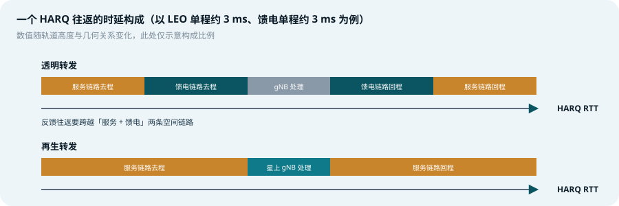
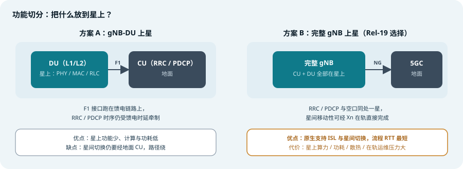
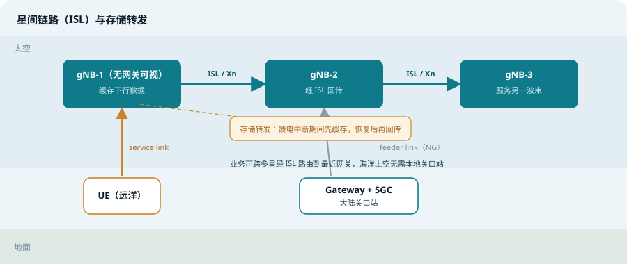

## 本篇要解决什么

[5G NTN 综合专题](5g-ntn.html)讲清了透明转发（bent-pipe）架构下的一切补偿机制：Common TA、\(K_{offset}\)、多普勒预补偿、HARQ 禁用与进程扩展。但这些机制有一个共同的底色——**gNB 还在地面，馈电链路是空口时序的一部分**。于是每个 HARQ 往返、每条调度指令，都要在太空与地面之间多跑两个来回。

再生载荷（regenerative payload）把这个底色换掉：把 gNB 的处理功能搬到星上，让卫星在轨完成解调、译码、调度与再编码。馈电链路从「NR 空口的延伸」退化为「gNB 与核心网之间的普通传输链路」。

> **一条主线**：再生载荷的所有收益与代价，都源于同一个动作——**把空口的终点从地面网关移到了星上 gNB**。时序、移动性、架构、工程实现，全部围绕这一点重新洗牌。

对照：**TS 38.300 §16.14**（NTN 总体架构）、**38.401**（gNB 功能切分）、**38.410/420/430**（NG 接口族）、**38.420/423**（Xn 接口，ISL 上承载的信令参考）。
相关：[5G NTN 综合专题](5g-ntn.html)、[3GPP 规范地图](3gpp-spec-map.html)、[卫星相控阵](satellite-phased-array.html)、[随机接入](random-access.html)、[NR 切换](nr-handover.html)、[gNB 节能](nr-gnb-energy-saving.html)。

---

## 一、透明与再生：差的不是「转发方式」，是「谁拥有空口」

两种载荷的对比常被简化成「模拟转发 vs 数字转发」，这个说法错过了重点。

**透明转发**：载荷只做射频放大与变频。gNB 在地面，因此 UE 发出的 NR 波形必须原样（仅幅相变化）穿过服务链路和馈电链路才能到达接收机。两条空间链路在信号层面是**串联**的：

- 馈电链路的噪声、非线性、相位噪声直接叠加到端到端链路预算上
- 馈电链路必须使用与空口一致的定时与频率关系，网关切换、馈电闪断都会直接冲击空口
- **空口的每一个时序（HARQ、调度、TA 命令生效）都包含馈电链路时延**

**再生转发**：载荷在轨完成解调与译码，恢复出比特流，再重新编码、调制、发射。两条链路在信号层面**解耦**：

- 馈电链路只是一条传输 NG / F1 / Xn 信令与数据的「数字管道」，可以用任何合适的频段与体制（Ka、Q/V、光学），噪声不累积
- 空口的终点就是星上 gNB，HARQ 往返只包含服务链路
- 馈电链路中断时，星上 gNB 还可以先把数据缓存住——存储转发（store-and-forward）成为可能

*图 1：左为透明转发——NR 波形横跨两条链路，gNB 留在地面；右为再生转发——星上 gNB 拥有完整空口，馈电链路退化为 NG 传输*

> **记忆**：透明转发里，馈电链路是「空口的一部分」；再生转发里，馈电链路是「回传的一部分」。一字之差，所有时序结论都要重写。

---

## 二、空口时序重构：HARQ RTT 只剩服务链路

这是再生载荷最直接、也最容易量化的收益。

### 1. RTT 构成的变化

透明转发下，UE 与 gNB 之间的往返要跨越服务链路去程、馈电链路去程、地面处理、馈电链路回程、服务链路回程。再生转发下，HARQ 反馈到星上 gNB 为止，馈电链路的两个单程被整体移出 HARQ 环路：

*图 2：再生载荷把馈电链路时延整体移出 HARQ 往返，反馈环路明显缩短*

对 LEO 而言这是「RTT 大约减半、HARQ 进程需求减少」的量级改善；对馈电链路更长的场景（GEO、或经 ISL 多跳回传的 LEO），改善幅度更大——因为被移出去的那一段往往比服务链路本身还长。

### 2. 定时参数的连锁简化

gNB 与载荷同处一星，5G NTN 专题里那套「拆三段」的定时体系随之退化：

| 定时量 | 透明转发 | 再生转发（gNB 上星） |
| --- | --- | --- |
| Common TA（`ta-Common`） | RP 与载荷之间的 RTT，覆盖馈电段 | 趋于零（RP 与载荷/ gNB 重合），广播值极小 |
| \(K_{mac}\) | 补偿 RP 与地面 gNB 之间的 RTT，影响 MAC CE 生效与 RAR 窗口 | 不再需要——gNB 就在星上 |
| \(K_{offset}\) | ≥ service link RTT + Common TA，给 UE 留处理时间 | 仍需保留，但下界回到 service link RTT 本身 |
| HARQ 反馈禁用 | GEO 场景常配 | 反馈环路缩短后，禁用的必要性大幅下降 |
| UE 侧 TA / 频偏预补偿 | GNSS + 星历自算 | 不变——多普勒与传播时延照样存在 |

**注意分寸**：简化的是「网络侧那段公共时延」，UE 侧的自算补偿一分都没少。LEO 下 UE 依然要靠 GNSS 位置与 SIB19 星历算 \(N_{TA,adj}^{UE}\) 并做频率预补偿，因为多普勒与传播时延只跟服务链路几何有关，跟 gNB 放在哪里无关。

### 3. 谁不受益

馈电链路时延没有消失，它只是换了个地方活着——现在它体现在 **NG 接口的传输时延**上：寻呼消息到达、会话建立、切换到地面其他 gNB、核心网信令往返，这些流程的总时延依然包含馈电段。受益最明显的是**逐 TTI 的空口闭环**（HARQ、调度、CSI 反馈、TA 命令），受益最少的是**端到端会话级流程**。

> **记忆**：再生载荷把时延从「每个 TTI 都付一次」变成「每个会话流程付一次」。高频闭环大赚，低频流程小赚或不赚。

---

## 三、功能切分：完整 gNB 上星还是只上 DU？

「再生载荷」不是单一选项。按 3GPP 的 gNB 功能切分（CU/DU，见 TS 38.401），星上可以只放 DU，也可以放完整 gNB：

*图 3：方案 A 只把 DU 放上星，CU 留在地面，F1 接口跑在馈电链路上；方案 B 把完整 gNB 放上星，馈电链路只承载 NG 接口*

### 方案 A：gNB-DU 上星

星上跑 L1/L2（PHY、MAC、RLC），地面 CU 保留 RRC 与 PDCP：

- **优点**：星上计算量、功耗、抗辐照设计负担都更小；CU 集中在地面便于统一运维与软件升级
- **代价**：F1 接口跑在馈电链路上，**RRC 与 PDCP 的时序仍被馈电时延牵制**——切换决策、无线承载管理、SDAP/PDCP 状态交互都要跨空间链路；星间切换时信令路径绕经地面，切换时延与中断风险回升

### 方案 B：完整 gNB 上星

CU 与 DU 一起在轨，馈电链路只承载 NG 接口：

- **优点**：RRC/PDCP 与空口同星，星间移动性可以经 Xn 类接口在轨直接完成；所有空口闭环（包括 RRC 级流程）都不再包含馈电段
- **代价**：星上要跑完整协议栈，算力、功耗、散热、在轨软件升级、故障隔离全部上星

### Rel-19 的裁决

3GPP 在 Rel-19 NTN 立项讨论约一年后（决议落在 2023 年 12 月），最终选择**方案 B：完整 gNB 上星**，而不是只放 DU。理由有三：

1. **星间移动性**：LEO 星座里 UE 每几分钟换一颗星，如果每次切换都要回地面 CU 走一遍信令，馈电链路就成了切换时延的瓶颈；完整 gNB 之间经 Xn 直接握手，切换可以在轨闭环
2. **存储转发**：CU 上的 PDCP 天然是理想的缓存点——馈电链路中断时，DU-only 方案无法独立维持 RRC 状态
3. **流程 RTT**：全功能 gNB 让每个流程的往返都不再包含馈电链路那一段

> 这背后的工程问题其实是：**当星间链路本身就是回传路径时，你该在哪里切开 RAN？** Rel-19 的答案是——切在最外面，星与星之间用 Xn，星与地之间只留 NG。

---

## 四、星间链路：再生载荷的原生能力

透明载荷在信号层面无法使用 ISL——模拟波形跨星转发意味着噪声级联与频段绑定。再生载荷则天然支持 ISL，因为星与星之间传输的是**数字比特流**，走 Xn 类接口即可。

*图 4：远洋上空的 gNB-1 无本地网关可视，可经 ISL 把业务路由到 gNB-2 的关口站；馈电中断期间先缓存，恢复后回传*

ISL 带来的系统性收益：

- **覆盖与部署解耦**：卫星不必各自「看见」网关，只要星座中任意一颗能看到关口站即可。海洋、极地上空的业务经 ISL 多跳回传，关口站数量可以大幅减少
- **星间移动性**：UE 从 gNB-1 切到 gNB-2 变成一次标准的 Xn 切换，数据前转、状态转移都走 ISL，不需要回落地面
- **路径多样性**：馈电链路故障时业务可改道其他卫星回传，网络韧性上升

**ISL 的物理层不受 3GPP 空口约束**：星间可以用激光或毫米波点对点链路，容量与时延特性由星座设计者决定，3GPP 需要规范的只是跑在上面的接口行为与时序假设。

> **一个实践提醒**：ISL 让「每颗星一条馈电链路」的星型拓扑变成「星座一张网」的网状拓扑，回传路由从此是星座运营层的路由问题——这已经超出 3GPP 的地盘，进入系统设计与运维的深水区。

---

## 五、存储转发：用时延换可达性

再生载荷 + 星上 PDCP，让「先缓存、后回传」成为标准能力：

- **触发条件**：卫星离开所有网关的可视范围（典型如 LEO 星座覆盖远洋时），馈电链路暂时不可用
- **行为**：星上 gNB 继续维持与 UE 的空口连接，下行数据在 PDCP 缓存；恢复馈电连接后按序发送
- **代价**：业务时延从「毫秒级」变成「分钟级」，只适合非实时业务（报文、IoT 采集、消息类）

这本质上是**用存储换连接的连续性**：对 NB-IoT / 物联网卫星直连场景价值极大——地面网关根本没必要为极地物联网流量全天候可见。

> **记忆**：透明载荷下馈电闪断 = 空口闪断；再生载荷下馈电闪断 = 缓存一会儿。前者是事故，后者是参数。

---

## 六、星上处理本身的工程账

再生载荷的协议收益不是白来的，星上要付出实打实的代价：

- **算力与功耗**：基带处理（FFT、信道译码、调度）是持续功耗大户，而卫星平台供电以千瓦计，射频放大之外留给基带的余量非常紧张
- **抗辐照与单粒子翻转**：太空高能粒子会导致存储器位翻转与逻辑错误，计算平台需要 ECC、三模冗余或锁步设计，进一步推高功耗与成本
- **散热**：星上没有对流，只能靠辐射排热，基带热设计直接限制处理能力上限
- **在轨运维**：gNB 软件升级要在轨完成，失败即「砖星」——软件必须支持分区升级、回滚与多星灰度
- **质量与成本**：每公斤发射成本倒逼基带平台的专用化（ASIC/专用加速器），而专用化又与「协议演进灵活性」冲突——这正是 3GPP 每个 Release 的 NTN 增强都必须向后兼容的深层原因

> 一句话：**透明载荷把复杂度留在地面，再生载荷把复杂度搬上天。** 收益（时序、移动性、韧性）与代价（功耗、重量、运维）是同一枚硬币的两面，Rel-19 选择完整 gNB 上星，等于把这一取舍推到了最激进的位置。

---

## 七、透明与再生怎么选

| 维度 | 透明转发 | 再生转发（完整 gNB 上星） |
| --- | --- | --- |
| 空口时序 | HARQ RTT 含馈电段，定时参数复杂 | 只含服务链路，\(K_{mac}\) 消失、Common TA 趋零 |
| 馈电链路 | 是空口一部分，闪断即空口故障 | 仅 NG 传输，可加 ISL 路由与缓存兜底 |
| 星间链路 | 不支持（模拟级联不可行） | 原生支持，Xn 类接口在轨完成 |
| 星间切换 | 需地面协调，时延受馈电牵制 | Xn 在轨闭环，适合分钟级过顶 |
| 覆盖部署 | 每波束需网关可视 | 网关可远端化，海洋极地友好 |
| 星上复杂度 | 低（RF 转发为主） | 高（完整基带 + 抗辐照 + 热控） |
| 在轨运维 | 几乎无需 | 软件升级、故障管理常态化 |
| 典型定位 | GEO 宽带、Rel-17 存量 | LEO 星座直连手机 / IoT，Rel-19 起增量 |

选择逻辑并不玄：**馈电链路时延占比越高、切换越频繁、回传部署越受限，再生的收益越大**。所以 GEO 宽带业务长期停留在透明架构上依然合理，而 LEO 直连终端星座则几乎必然走向再生。

---

## 八、Rel-17 → 20 演进脉络中的位置

| 版本 | 再生载荷相关进展 |
| --- | --- |
| Rel-17 | 仅透明转发；所有定时 / HARQ 增强以「gNB 在地面」为前提 |
| Rel-18 | 覆盖与移动性增强仍基于透明架构；再生方案的预研在讨论中铺开 |
| Rel-19 | **再生载荷正式立项**：完整 gNB 上星、星间链路与星间移动性、存储转发（2023 年 12 月定下切分方向） |
| Rel-20 / 6G | NTN 深度一体化：再生架构成为默认假设，与地面网络统一设计（频谱、移动性、AI 原生空口） |

放在更长的时间轴上看：Rel-17 用「补偿」让 NR 在极端几何下能活，Rel-19 用「搬 gNB 上天」让 NTN 开始像真正的蜂窝网，Rel-20 之后的问题则变成——地面与非地面如何在同一张网络里被统一调度。再生载荷是这条路径上不可绕过的一级台阶。

---

## 九、一句话总结与自测

> **再生载荷没有发明任何新协议，它只是把 gNB 搬到空口的另一端——馈电链路从空口时序中除名，星间链路与存储转发随之成为原生能力。**

1. 透明转发与再生转发下，同一个 HARQ 进程的 RTT 构成有什么不同？为什么说「馈电链路没有消失，只是换了个地方活着」？
2. gNB 上星后，Common TA、\(K_{mac}\)、\(K_{offset}\) 各自的命运是什么？UE 侧的多普勒预补偿为什么一点都不能省？
3. Rel-19 为什么选择完整 gNB 上星而不是 DU 上星？从星间移动性与存储转发两个角度分别论证。
4. 为什么透明载荷在信号层面无法支持 ISL，而再生载荷可以？ISL 上承载的接口行为属于 3GPP 规范范围吗？
5. 存储转发适合什么业务？它用牺牲什么换来了什么？
6. 如果让你为一个 GEO 宽带星座和一个 LEO 直连手机星座分别选载荷形态，你会怎么选，理由是什么？

### 延伸阅读

以下规范的定位与关键章节，见本站 [3GPP 规范地图](3gpp-spec-map.html)：

- [TS 38.300 §16.14](3gpp-spec-map.html#ts-38300)——NTN 总体架构与定时参考点（透明 / 再生架构的规范基础），[官方页面](https://www.3gpp.org/dynareport/38300.htm)
- [TS 38.401](3gpp-spec-map.html#ts-38401)——NG-RAN 架构与 gNB CU/DU 切分（功能切分方案 A/B 的出处），[官方页面](https://www.3gpp.org/dynareport/38401.htm)
- [TS 38.410](3gpp-spec-map.html#ts-38410)——NG 接口总体原理与架构（馈电链路上承载的接口），[官方页面](https://www.3gpp.org/dynareport/38410.htm)
- [TS 38.423](3gpp-spec-map.html#ts-38423)——Xn 接口控制面（星间链路信令的行为参考），[官方页面](https://www.3gpp.org/dynareport/38423.htm)
- [TS 38.331](3gpp-spec-map.html#ts-38331)——SIB19 与星历（再生架构下 UE 侧自算补偿仍依赖的参数），[官方页面](https://www.3gpp.org/dynareport/38331.htm)
