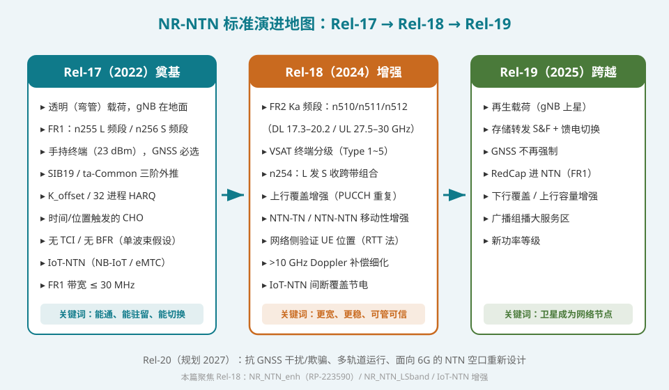
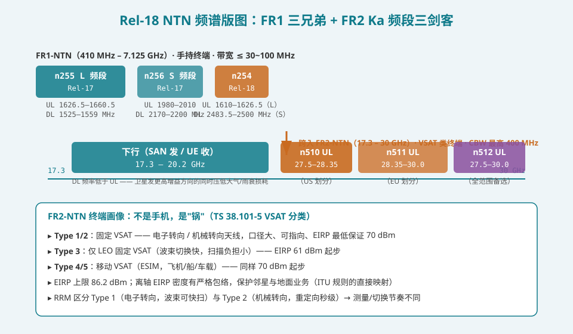
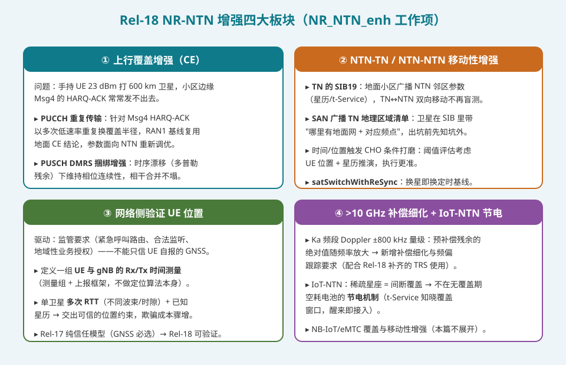
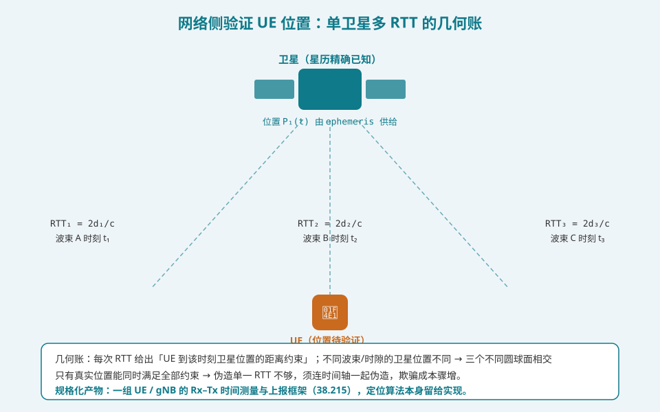

## 本篇要解决什么

前面十二篇专题里，「Rel-18」这个词已经出现过很多次：测量与 CSI 篇提到「Rel-18 补齐 TRS」「gap 内读 SI」；定时器全表提到 RRC 状态的静默优化；移动性篇提到 `satSwitchWithReSync`。但这些 r18 内容一直散落在各篇的角落里。本篇做一次**总归位**——Rel-18（5G-Advanced，2024 年 6 月功能性冻结）的 NR-NTN 增强工作项 **NR_NTN_enh** 到底改了什么、为什么改、以及它如何把 Rel-17 那个「能通但只算及格」的系统推向工程可用。

先说结论：**Rel-18 没有引入新的架构假设——卫星仍然是弯管，GNSS 仍然是必选，协议框架原封不动。它做的是四件事：把频谱从 L/S 开进 Ka（FR2）、把上行覆盖的短板补厚、把 NTN 与地面网/彼此之间的移动性接顺、把「UE 说什么就信什么」的信任模型换成可验证的。**

对照：**RP-223590 / RP-213590**（NR_NTN_enh 工作项描述）、**TS 38.101-5**（卫星接入终端 RF，Rel-18 加入 FR2-NTN）、**TR 38.821**（FR2 评估假设）、**TS 38.215**（测量）、**TS 38.331**（SIB19 扩展）。

相关：[NTN 综合入门](5g-ntn.html)（Rel-17 基线的全景）、[NTN 测量与 CSI](ntn-measurement-csi.html)（Rel-18 TRS 与 gap 增强的上游）、[NTN 移动性与卫星切换](ntn-mobility.html)（本篇移动性增强的细化对象）、[NTN 信道与链路预算](ntn-channel-link-budget.html)（Ka 频段余量账的物理源头）。

---

## 一、Rel-17 留下的四道题

Rel-17 是「从 0 到 1」：第一个可部署的 5G 卫星接入标准。但工程化视角下它留下四道明显的题：

| # | Rel-17 的限制 | 具体表现 | Rel-18 的回应 |
|---|---|---|---|
| 1 | **频谱窄** | 只有 L/S 频段（FR1），CBW 最高 30 MHz，容量天花板肉眼可见 | 开放 FR2 Ka 频段，CBW 最高 400 MHz |
| 2 | **上行是短板** | 手持 23 dBm 打卫星，小区边缘 Msg4 的 ACK 都发不稳 | PUCCH 重复 + DMRS 捆绑增强 |
| 3 | **移动性只管 NTN 内部** | TN↔NTN 互通基本靠「各扫门前雪」，地面小区对天上邻居一无所知 | TN 的 SIB19、卫星广播地面网地图、CHO 触发打磨 |
| 4 | **信任模型单薄** | 位置 = UE 自报 GNSS，监管（紧急呼叫路由、合法监听）无法核验 | 网络侧基于 RTT 测量验证 UE 位置 |

另外还有一条贯穿性的：**频率超过 10 GHz 后，Doppler 补偿的精度要求会跟着频率一起放大**——这属于 FR2 开放的附属工程。

一句话概括 Rel-18 的气质：**它不是革命，是"把第一版能跑的系统调到可商用的精度"**。真正改变架构假设的事（再生载荷、存储转发、GNSS 非必选）都留给了 Rel-19。

---

## 二、频谱版图：从 L/S 开进 Ka

### 2.1 FR1 补了一个跨带组合，FR2 开了三个新频段

Rel-18 在频谱上做了两件事：

**其一（NR_NTN_LSband 工作项）**：新增 **n254**——UL 用 L 频段 1610–1626.5 MHz 发，DL 用 S 频段 2483.5–2500 MHz 收。这不是简单的"加一个频段"：它把两个 MSS 传统频段**跨带配对**成一对 FDD，服务大 LEO MSS 系统（Iridium/Globalstar 邻近频谱）的既得频率资产。FR1 家族因此凑齐三个频段：n255（L）、n256（S）、n254（L 发 S 收）。

**其二（NR_NTN_enh 工作项）**：NTN 首次进入 **FR2-NTN（17.3–30 GHz）**，Ka 频段三个 FDD 频段：

| 频段 | UL（UE 发 / SAN 收） | DL（SAN 发 / UE 收） | 备注 |
|---|---|---|---|
| **n510** | 27.5 – 28.35 GHz | 17.3 – 20.2 GHz | 美式划分 |
| **n511** | 28.35 – 30.0 GHz | 17.3 – 20.2 GHz | 欧式划分 |
| **n512** | 27.5 – 30.0 GHz | 17.3 – 20.2 GHz | 全范围备选 |

三个频段共享同一段 DL，差别只在 UL 的切法——这是把不同区域管制划分映射进统一 NR 频段栅格的典型手法。信道带宽支持 50/100/200/**400 MHz**，一步跨到 Rel-17 的 13 倍容量密度。

### 2.2 Ka 频段的账要重算

[信道与链路预算篇](ntn-channel-link-budget.html)算过：Ka 频段的免费空间路损比 S 频段多约 **20 log₁₀(28/2) ≈ 23 dB**，且雨衰成为最大单项（S 频段几乎为零）。这笔账直接决定了 FR2-NTN 的终端画像——**它不是给手机的**：

| 维度 | FR1-NTN（Rel-17） | FR2-NTN（Rel-18） |
|---|---|---|
| 终端形态 | 手持手机（PC3，23 dBm） | **VSAT / ESIM**（飞机、船、车载、固定站） |
| 最低保证 EIRP | — | **70 dBm**（Type 3 为 61 dBm），上限 86.2 dBm |
| 天线 | 全向贴片 | 定向"锅"（机械或电子转向） |
| 带宽 | ≤ 30 MHz（FR1 早期）/ 100 MHz | 最高 **400 MHz** |
| 假设场景 | 随身、无处不在 | 固定安装或大型移动平台 |

### 2.3 VSAT 终端分级：RRM 要知道"锅"怎么转头

TS 38.101-5 把 FR2-NTN 终端分成 5 类，分类轴心是**天线转向方式**：

- **Type 1 / Type 2**：固定 VSAT，**电子转向 / 机械转向**——电子转向毫秒级重定向，机械转向是秒级的物理动作；
- **Type 3**：仅 LEO 的固定 VSAT（LEO 波束切换频繁但可预测，扫描负担相对小）；
- **Type 4 / Type 5**：移动 VSAT（ESIM，装在飞机/船/车上）。

为什么 RRM 要区分转向方式？因为[测量与 CSI 篇](ntn-measurement-csi.html)讲过：FR2 的邻区测量和波束对准依赖定向天线。**机械转向终端在重定向期间既测不了也发不了**——它的切换节奏必须把"转头的时间"算进去；电子转向终端则可以快扫。同一套切换定时器对两类终端的合理配置完全不同，这是 Rel-18 在 RRM 层引入的新维度。

### 2.4 离轴 EIRP 密度：频谱规则长进了规范

FR2-NTN 的 RF 需求里有一条很"卫星行业"的约束：**离轴方向的 EIRP 密度必须满足严格包络**。这不是 3GPP 的发明，而是 ITU 频谱规则的直接映射——邻星间距只有几度，你往天上打的旁瓣同时也在干扰别人的星。终端把主瓣做大没问题，但旁瓣必须收敛。这类条款提醒我们：NTN 规范背后站着的还有整个卫星频谱管理体系。

---

## 三、上行覆盖增强：补最短的那块板

### 3.1 问题重述

[随机接入篇](ntn-rach.html)和[功控篇](ntn-power.html)反复算过同一笔账：手持 UE 23 dBm 对 600 km 卫星，上行余量始终比下行紧。具体到信令流程，最脆弱的一环是 **Msg4 的 HARQ-ACK**——整个 RACH 流程走到收获 RRC 消息这一步，ACK 却要从边缘"喊"回卫星，发不出去意味着前功尽弃、RACH 重来。

### 3.2 两项增强

**① PUCCH 重复传输（针对 Msg4 HARQ-ACK）**

思路上没有新发明：复用地面覆盖增强的重复哲学，以 N 次低速重复把能量堆起来，换回覆盖半径。Rel-18 做的是把它正式搬进 NTN 语境并调好参数——重复次数、时域资源绑定、以及与 NTN 长定时的组合方式。

**② PUSCH DMRS 捆绑增强**

这个更"NTN 特有"。DMRS 捆绑（bundling）指连续多个符号上的 DMRS 保持相位连续，接收端跨符号做相干合并——捆得越长，估计越准、合并增益越高。但 NTN 里有个地面没有的敌人：**时序漂移导致的残余多普勒相位斜坡**。UE 的预补偿不可能完美（[多普勒篇](ntn-doppler.html)讲过残余频偏的量级），残余频偏在一个捆绑窗口内积累出相位旋转，直接摧毁相干性。Rel-18 的增强就是让 UE **在时序漂移下仍能维持相位连续**——本质是给"能捆多长"重新定了标尺。

一句话总结这一节：**两项增强都极朴素，但它们瞄准的是上行链路最痛的两毫米——ACK 通道与相干合并**。对智能手机直连卫星（D2D）的覆盖边缘体验，这是实打实的几 dB。

---

## 四、移动性与服务连续性：接顺 NTN 与地面、NTN 与 NTN

[移动性篇](ntn-mobility.html)的结论是：NTN 的切换主责在 RRC 层的提前规划（CHO），且 NTN 内部已有 CondEvent T1/D1 和 `satSwitchWithReSync`。Rel-18 补的是**跨域的盲区**。

### 4.1 TN 的 SIB19：地面小区知道天上有谁

Rel-17 里 SIB19 只出现在 NTN 侧。Rel-18 把它**扩展到 TN（地面小区）**：地面 gNB 可以在 SIB19 里广播 NTN 邻区参数（星历、t-Service 等）。价值场景是 NTN→TN→NTN 的过境：手机在地面网边缘能提前拿到天上邻居的"接入说明书"，回天不必从零开始搜星。

### 4.2 反向地图：卫星广播"哪里有地面网"

更关键的是反方向。手机在卫星覆盖下（比如海上、荒漠），Rel-17 想回地面网只能全频段瞎搜。Rel-18 让 SAN 在系统信息里**广播一份带地理信息的 TN 区域清单**（哪些地理区域有地面覆盖、对应什么频点）。这相当于卫星给终端发了一张"出坑地图"：飞机下降、船靠岸、车出山区时，终端按图索骥直奔正确的地面频点，而不是在几百个频点里地毯式扫描。

### 4.3 CHO 触发与换星收尾

- **时间/位置触发 CHO 的打磨**：[移动性篇](ntn-mobility.html)讲过 CHO 靠时间/位置提前执行；Rel-18 把评估条件细化——执行条件同时吃 UE 位置与星历推演，"什么时候到边界"算得更准。
- **`satSwitchWithReSync`**：换星场景下目标卫星的时间基线不同，直接切换等于定时作废。这个增强允许把「换星」与「重同步」打包成一次原子操作，避免先失步再重连的服务中断。

---

## 五、网络侧验证 UE 位置：从自报到可核验

### 5.1 为什么要验证

Rel-17 的信任模型：UE 报什么位置，网络记什么位置。这在地面网无伤大雅（基站自己知道你在哪），但在 NTN 里**卫星波束宽达数百公里，位置核验失去物理抓手**。而监管刚需恰恰压在位置上：紧急呼叫路由（判断该派哪个辖区的救援）、合法监听授权地域、区域性业务（如仅限某国使用的频谱）——"你说你在哪，就在哪"不再可接受。

### 5.2 怎么验证：单卫星多 RTT

方案是几何的而非新信号：定义一组 **UE 与 gNB（SAN）的 Rx/Tx 时间测量**（规入 TS 38.215 的测量集），核心思想：

1. 卫星星历精确已知（SIB19 的 `positionVelocity`，[SIB19 篇](ntn-sib19.html)讲过）——卫星在每个时刻的位置是确定的；
2. 一次 RTT 测量给出「UE 到该时刻卫星位置的距离约束」= 以卫星为中心的一个球面；
3. **不同波束/不同时隙**的卫星位置不同（LEO 每秒飞 7.5 km），多次 RTT 得到多个几何上不重合的球面；
4. 多球面相交的唯一解才是真实位置。伪造者要连着时间轴伪造一整套一致的 RTT 序列，欺骗成本骤增。

注意规范的克制：**3GPP 只定义了测量集与上报框架，定位算法本身留给实现**——和地面网定位（NR-PoT）一脉相承的分工。

### 5.3 一个隐藏福利

RTT 类测量顺带强化了定时体系：能测准 RTT，意味着网络对 UE 的传播延迟有了独立于 GNSS 的第二来源——这与 [UE 能力篇](ntn-ue-capability.html)的 `uplinkPreCompensation` 形成互补：GNSS 是预补偿的主动来源，RTT 是网络侧的被动校核。

---

## 六、大于 10 GHz 的补偿细化与 IoT-NTN 节电

### 6.1 Doppler 补偿随频率放大

Ka 频段 LEO 的 Doppler 绝对值约 **±480 kHz×(28/2) ≈ ±800 kHz** 量级（[多普勒篇](ntn-doppler.html)的账乘上频率比）。预补偿残余虽然比例不变，绝对值却随频率放大——S 频段无所谓的残余频偏，到 Ka 频段会直接顶出锁相环。Rel-18 的工作是**细化 >10 GHz 场景的补偿与频偏跟踪要求**，并配合本版本补齐的 TRS（跟踪参考信号）供 UE 做相位噪声/频偏跟踪——这正是[测量与 CSI 篇](ntn-measurement-csi.html)埋下的伏笔："Rel-17 无 TRS，Rel-18 补齐"。

### 6.2 IoT-NTN：与间断覆盖共处的节电

IoT 星座（如稀疏 LEO）的典型形态是**间断覆盖**：一颗星头顶几分钟，下一颗要等几十分钟。Rel-17 的终端在无覆盖期会本能地反复搜网，电池空耗。Rel-18 的节电机制顺着 [SIB19 篇](ntn-sib19.html)的 `t-Service` 思路走：**终端从系统信息中知晓覆盖窗口，无覆盖期深度休眠，醒来即接入**。配套的还有 NB-IoT/eMTC 的覆盖与移动性增强（本篇不展开，留待 IoT-NTN 专题）。

---

## 七、总归位：前十二篇的 r18 伏笔，各回各家

| 伏笔（所在专题） | 归属 |
|---|---|
| 「Rel-18 补齐 TRS」（测量与 CSI） | >10 GHz 频偏/相位跟踪 |
| 「gap 内读 SI 是 Rel-18 增强」（测量与 CSI） | 移动性/服务连续性板块 |
| 「`satSwitchWithReSync`」（移动性与切换） | 移动性/服务连续性板块 |
| 「T310 扩档 12 s 硬扛遮蔽」（RLM/BFM） | 与 CE 板块互补：覆盖不够时序凑 |
| 「上行 360 kHz 收窄 + 重复」（随机接入/功控/链路预算） | CE 板块是其 Rel-18 续章 |
| 「GNSS 必选、纯信任模型」（UE 能力/SIB19） | 位置验证板块补上核验侧 |
| 「Ka 频段雨衰/余量账」（信道与链路预算） | FR2 板块的物理前提 |

**读法**：Rel-17 是一张"能跑的最低配置"，Rel-18 是"按故障单逐项打补丁"——每一项增强背后都能在前十二篇里找到一条具体的痛点。这也是为什么本篇放在系列的后段：它是前十二篇的汇点，而不是新起点。

---

## 排障清单：Rel-18 特性引入后的新嫌疑

1. **FR2-NTN 切换卡在机械转向**：Type 2 终端的测量/执行节奏没把转头时间算进去——检查 RRM 配置是否按终端类型区分。
2. **Ka 频段频偏跟踪失锁**：预补偿残余 + 未启用 TRS——确认 gNB 是否配置了 Rel-18 的 TRS 资源、UE 是否支持。
3. **位置验证结果与 GNSS 自报不一致**：先查星历新鲜度（`valueTag`/`epochTime`），再查 RTT 测量是否跨了足够的几何基线（同波束多时隙的约束退化严重）。
4. **TN→NTN 回天慢**：地面小区未广播 SIB19（NTN 参数），终端仍在全频段搜星。
5. **Msg4 ACK 仍超时**：CE 重复不是万能——检查 PUCCH 重复参数是否激活，以及是不是该走 RACH 重复或更低 MCS。
6. **IoT 终端电量异常**：节电机制的覆盖窗口信息缺失（t-Service 未下发或过期），终端退回盲目搜网。

---

## 自测七题

1. Rel-18 在频谱上的两件事是什么？n254 为什么说它"跨带"？
2. n510/n511/n512 的区别在哪一段？为什么三者共享同一段 DL？
3. FR2-NTN 为什么注定不是给手机的？给出至少两个 RF 层证据。
4. Type 1 与 Type 2 VSAT 的本质区别是什么？它如何影响 RRM 配置？
5. PUSCH DMRS 捆绑增强针对的 NTN 特有敌人是什么？摧毁相干性的机理？
6. 网络侧验证 UE 位置为什么必须"多"RTT？单次 RTT 缺了什么几何信息？
7. 「TN 的 SIB19」与「SAN 广播 TN 区域清单」分别解决哪个方向的盲区？

参考答案

1. 其一 NR_NTN_LSband 新增 n254（UL 1610–1626.5 MHz / DL 2483.5–2500 MHz）；其二 NR_NTN_enh 开放 FR2-NTN Ka 频段。n254 的 UL 在 L 频段、DL 在 S 频段，两个传统 MSS 频段配对成一对 FDD，故称跨带。
2. 区别只在 UL 划分：n510 27.5–28.35 GHz、n511 28.35–30 GHz、n512 全范围；DL 均为 17.3–20.2 GHz。共享 DL 是因为不同区域的管制划分只切了 UL 段，把每种划分映射为一个独立频段即可统一进 NR 栅格。
3. 路损比 S 频段多约 23 dB 且雨衰成为最大单项，23 dBm 手持无法闭合；规范层面的证据：VSAT 最低保证 EIRP 70 dBm（61 dBm 仅 Type 3），需要定向天线，CBW 高达 400 MHz 面向高吞吐固定/移动平台。
4. 天线转向方式：Type 1 电子转向（毫秒级重定向，可快扫），Type 2 机械转向（秒级物理动作，重定向期间不可测/不可发）；切换定时器与测量节奏必须按类型配置。
5. 时序漂移产生的残余多普勒相位斜坡。预补偿残余频偏在捆绑窗口内积累相位旋转，使跨符号 DMRS 失去相位连续性，相干合并退化为非相干。
6. 单次 RTT 只给一个距离约束（一个球面），无数位置都满足；只有不同时刻卫星位置不同的多次 RTT 给出多个不重合球面，唯一交点才是真实位置。
7. TN 的 SIB19 解决 NTN→TN→NTN 过境时地面小区对天上邻居无参数的问题；SAN 广播 TN 区域清单解决卫星覆盖下终端想回地面网时"不知道去哪搜"的问题。

