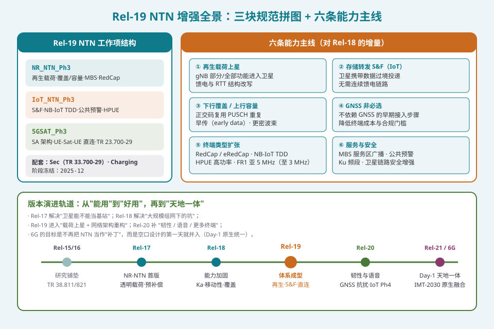
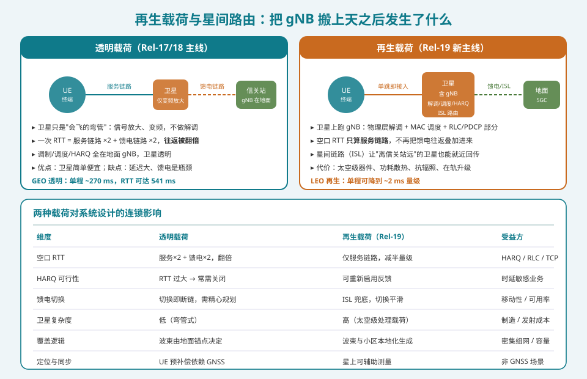
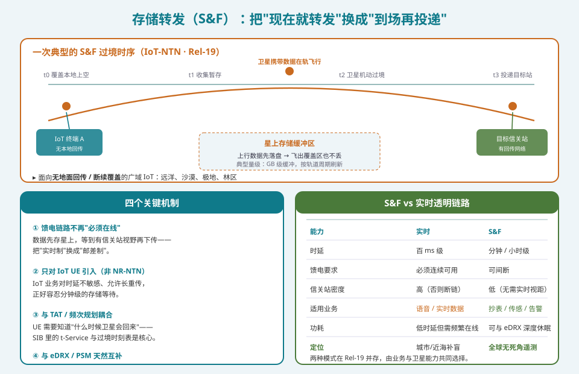
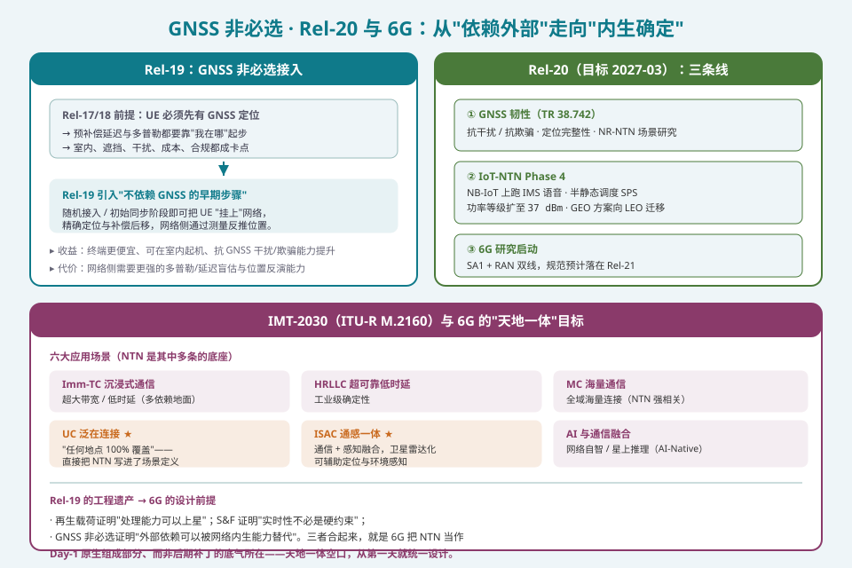

## 本篇要解决什么

十七篇走下来，NTN 的主线一直是「卫星当弯管」——信号放大、变频，所有智能都在地面。这解决了 Rel-17/18 的"能不能用"，但把三个天花板留在了那里：**馈电链路是瓶颈**（断了就全断）、**HARQ 因为 RTT 太大被关掉**（可靠性靠盲重传硬扛）、**终端必须先有 GNSS**（室内、遮挡、干扰、成本全成卡点）。

Rel-19（**2025 年 12 月冻结**）动的正是这三个天花板。它不再修修补补，而是把 **gNB 的一部分真的搬上卫星**（再生载荷）、把**存储转发**引入 IoT、把 **GNSS 从"必选"降级为"可选"**。本篇作为系列收官，先讲清 Rel-19 的增量全景，再顺着 Rel-20 与 6G 往前看一步——看看这些工程遗产如何成为"天地一体空口"的设计前提。

对照：**TR 38.821**（NTN 场景与评估基线）、**TR 23.700-29**（5GSAT_Ph3 架构）、**TR 33.700-29**（卫星链路安全）、**TR 38.742**（GNSS 韧性研究）、**TS 38.108 §5.1.1**（Ku 频段编号澄清）。规范主干仍复用前面各篇：38.331/38.213/38.214/38.321。

相关：[轨道与系统架构深读](ntn-orbit-architecture.html)（透明 vs 再生的几何账）、[Rel-18 增强全集](ntn-rel18-enhancements.html)（Rel-19 的上一级台阶）、[IoT NTN](ntn-iot.html)（S&F 的宿主）、[射频频段与共存](ntn-rf-bands-coexistence.html)（Ku 频段与频段编号）。

---

## 一、Rel-19 的三块拼图

Rel-19 的 NTN 工作不是单点增强，而是一次**分三条线同时推进**的体系升级：

| 工作项 | 归属 | 核心内容 |
|---|---|---|
| **NR_NTN_Ph3** | RAN | 再生载荷、下行覆盖/上行容量增强、MBS 服务区、RedCap/eRedCap、FR1-NTN 亚 5 MHz |
| **IoT_NTN_Ph3** | RAN | 存储转发 S&F、NB-IoT NTN TDD 模式、公共预警、HPUE |
| **5GSAT_Ph3** | SA | UE-Satellite-UE 直接用户面路由、再生载荷下的核心网架构、TR 23.700-29 |
| 配套 | SA3 | 卫星链路安全增强（TR 33.700-29）、计费 |

一句话概括版本定位：**Rel-17 解决"卫星能不能当基站"，Rel-18 解决"大规模组网下的坑"，Rel-19 进入"载荷上星 + 网络架构重构"。**

### 1.1 六个能力主线（对 Rel-18 的增量）

1. **再生载荷上星**——gNB 部分或全部功能进入卫星，空口 RTT 不再叠加馈电往返；
2. **存储转发（仅 IoT）**——卫星携带数据过境投递，馈电链路可以间断；
3. **下行覆盖 / 上行容量增强**——正交码复用 PUSCH 重复、更密波束、早传（early data）；
4. **GNSS 非必选**——不依赖 GNSS 的早期接入步骤，降低终端成本与合规门槛；
5. **终端类型扩张**——RedCap / eRedCap、NB-IoT TDD 模式、HPUE、FR1-NTN 亚 5 MHz；
6. **服务与安全**——MBS 服务区广播、公共预警、Ku 频段、卫星链路安全。

---

## 二、再生载荷：把 gNB 搬上天

第十一篇（[轨道与系统架构深读](ntn-orbit-architecture.html)）讲过一个公式级的事实：透明载荷下，一次 RTT = **服务链路 ×2 + 馈电链路 ×2**；GEO 透明单程 ~270 ms、RTT 可达 541 ms。再生载荷把这个结构改写了。

### 2.1 星上跑什么

再生载荷不是"卫星变成完整基站"，而是**分层上星**：

- **物理层**：解调、译码在星上完成——信号一到卫星就"落地"；
- **MAC 层**：调度、HARQ 反馈在星上——这正是不再用盲重传硬扛的关键；
- **RLC/PDCP 部分**：视架构切分，可能部分留在星上、部分回到地面.

### 2.2 三笔连带的账

| 维度 | 透明载荷 | 再生载荷（Rel-19） | 受影响的上层 |
|---|---|---|---|
| **空口 RTT** | 服务×2 + 馈电×2，被翻倍 | 只算服务链路，减半量级 | HARQ / RLC / TCP |
| **HARQ 可行性** | RTT 过大 → 常需关闭 | 可**重新启用反馈** | 时延敏感业务 |
| **馈电切换** | 切换即断链，需精心规划 | **ISL 兜底**，切换平滑 | 移动性 / 可用率 |
| **卫星复杂度** | 低（弯管式） | 高（太空级处理载荷） | 制造 / 发射成本 |
| **覆盖逻辑** | 波束由地面锚点决定 | 波束与小区本地化生成 | 密集组网 / 容量 |
| **定位与同步** | UE 预补偿依赖 GNSS | 星上可辅助测量 | 非 GNSS 场景 |

其中**星间链路（ISL）** 是架构层面最深远的一笔：它让"离信关站很远"的卫星也能就近回传，把地面信关站的密度要求从"必须实时可见"降为"整个星座只要少数几个出口"。这直接改写了 Rel-18 时代最头疼的**馈电切换**问题——不再是"单站视野窗口内的精心接力"，而是星座内部的网状路由。

代价同样明确：太空级器件、功耗散热、抗辐照、在轨软件升级（卫星上天后还能打补丁吗？）——这些不是协议能解决的，是航天工程的活。

---

## 三、存储转发（S&amp;F）：邮差模式

如果再生载荷是"把算力搬上天"，存储转发（Store-and-Forward，S&amp;F）就是**把时间也当成可缓冲的资源**。

### 3.1 一次典型的 S&amp;F 过境时序

IoT 终端的业务天生"不急"——抄表、传感、告警的时延容忍度是分钟甚至小时级。S&amp;F 把这份容忍度兑现成网络设计的自由度：

1. **t0**：卫星覆盖本地，IoT 终端上行数据；
2. **t0→t1**：数据**落盘到星上存储缓冲区**（GB 级量级），飞出覆盖区也不丢；
3. **t1→t2**：卫星携带数据在轨机动飞行；
4. **t3**：卫星进入目标信关站视野，**批量下传**。

**核心结论：馈电链路不再"必须在线"。** 把"实时制"换成"邮差制"，就可以服务无地面回传、断续覆盖的广域 IoT——远洋、沙漠、极地、林区。

### 3.2 与前面各篇的咬合

- **S&amp;F 只对 IoT UE 引入，不用于 NR-NTN**：NR 业务不能接受分钟级等待；
- **与 t-Service / 邻星星历耦合**：UE 必须知道"卫星什么时候回来"——SIB31-NB 里的服务窗口与过境时刻表在 S&amp;F 下从"省电参考"变成"可用性前提"；
- **与 eDRX / PSM 天然互补**：深度休眠 + 准时醒来 + 星上缓冲，三者凑成一个完整的稀疏星座服务模型（见 [IoT NTN](ntn-iot.html)）；
- **与馈电切换的关系**：S&amp;F 让"同一时刻单信关站"的约束松绑——非 GEO 馈电切换不再是唯一解，卫星可以自己拎着数据走。

| 能力 | 实时透明链路 | 存储转发 |
|---|---|---|
| 时延 | 百 ms 级 | 分钟 / 小时级 |
| 馈电要求 | 必须连续可用 | 可间断 |
| 信关站密度 | 高（否则断链） | 低（无需实时视距） |
| 适用业务 | 语音 / 实时数据 | 抄表 / 传感 / 告警 |
| 功耗 | 低时延但需频繁在线 | 可与 eDRX 深度休眠 |
| 定位 | 城市/近海补盲 | 全球无死角遥测 |

两种模式在 Rel-19 并存，由业务类型与卫星能力共同选择。

### 3.3 UE-Satellite-UE 直接路由

5GSAT_Ph3 引入的更激进的架构：当两个 UE 都在同一颗卫星覆盖下时，**用户面数据可以直接经卫星转发，不必绕回地面核心网**。这是"本地交换"在太空的版本，对偏远地区的**站间通信**（远洋船队、野外作业队）意味着可观的时延与回传成本节省。架构细节落在 TR 23.700-29。

---

## 四、GNSS 非必选：拆掉最后一根外部拐杖

Rel-17/18 有一个不太被提及但影响极大的前提：**UE 必须先有 GNSS 定位**。因为预补偿延迟与多普勒都要靠"我在哪"起步——第六篇（[多普勒与时频补偿](ntn-doppler.html)）里算过，LEO 在 2 GHz 的 Doppler 可达 ±50 kHz，不预补偿根本对不上频。

### 4.1 代价与解法

这个前提把 NTN 终端挡在了很多场景之外：**室内起机、隧道出口、城市遮挡、GNSS 干扰与欺骗、以及成本敏感的模组**。

Rel-19 的解法是引入**"不依赖 GNSS 的早期步骤"**：

- 在**随机接入 / 初始同步阶段**就把 UE "挂上"网络，不等精确定位；
- 精确定位与补偿**后移**，网络侧通过测量（多 RTT 等，见 [Rel-18 增强全集](ntn-rel18-enhancements.html) 里的位置验证逻辑）反推 UE 位置；
- 收益：终端更便宜、可在室内起机、**抗 GNSS 干扰/欺骗能力提升**；
- 代价：网络侧需要更强的多普勒/延迟盲估与位置反演能力。

这一步看似工程细节，实则是把 NTN 从"依赖外部系统的增强网络"推向"内生自洽的独立网络"。而"内生自洽"正是 6G 的核心命题——下一节展开。

---

## 五、其余增强：终端、频谱与服务

### 5.1 终端类型扩张

- **RedCap / eRedCap**：轻量化 5G 终端（可穿戴、工业传感、视频监控）原生支持 NTN——把卫星容量开放给"不需要宽带、但需要广覆盖"的中速终端；
- **NB-IoT NTN TDD 模式**：Rel-17 IoT-NTN 全 FDD，TDD 模式让 IoT-NTN 能复用更多频谱安排；
- **HPUE（高功率 UE）**：提高终端发射功率上限，改善上行链路预算（尤其 GEO 场景下天线小的终端）。

### 5.2 频谱：FR1-NTN 亚 5 MHz 与 Ku 频段

- **FR1-NTN 亚 5 MHz**：带宽可缩至 **3 MHz**，为频谱资源紧张的运营商量身——NTN 不一定非要大带宽；
- **Ku 频段**：TS 38.108 §5.1.1 澄清了频段编号，Ku 频段进入 SAN（卫星接入网）的候选集。Ku 是传统卫星通信的成熟频段，引入后可复用大量既有卫星资源。

### 5.3 服务能力：MBS 与公共预警

- **MBS（多播广播业务）服务区**：通过 SIB 广播服务区信息，让卫星能高效分发"同一内容给大量用户"——赛事直播、固件推送、区域信息；
- **NB-IoT NTN 公共预警**：地震、海啸、气象预警可通过卫星直达地面网盲区，这是 IoT-NTN 社会价值最直接的体现。

---

## 六、Rel-20 与 6G：往前看一步

### 6.1 Rel-20（目标 2027-03）

| 线 | 内容 |
|---|---|
| **GNSS 韧性** | TR 38.742 研究：抗干扰 / 抗欺骗、定位完整性、NR-NTN 场景下的韧性定位 |
| **IoT-NTN Phase 4** | NB-IoT 上跑 **IMS 语音**、半静态调度 SPS、功率等级扩至 **37 dBm、GEO 方案向 LEO 迁移** |
| **6G 研究启动** | SA1 + RAN 双线启动，规范预计落在 **Rel-21** |

IoT-NTN 支持 IMS 语音是个标志性动作——语音是"基础电信业务"的门槛，一旦打通，卫星 IoT 就真正进入主流通话生态。功率等级提升到 37 dBm（PC1 以上）则回扣了第二十四篇（[功率控制](ntn-power.html)）里的上行瓶颈。

### 6.2 IMT-2030（ITU-R M.2160）：六场景里的 NTN

ITU-R 在 M.2160 里定义了 IMT-2030（即 6G）的六大应用场景，其中**至少两条直接把 NTN 写进了定义**：

- **UC 泛在连接（Ubiquitous Connectivity）**："任何地点 100% 覆盖"——这个指标靠地面网永远做不到，NTN 是唯一解；
- **ISAC 通感一体**：通信与感知融合，卫星天然具备"雷达化"潜力，可辅助定位与环境感知。

其余四条（沉浸式通信、超可靠低时延、海量通信、AI 与通信融合）也都间接受益于 NTN 带来的全域覆盖与容量。

### 6.3 Day-1 原生天地一体

6G NTN 最终目标的表述很关键：**不再是"5G 加一个 NTN 补丁"，而是空口设计的第一天就把天地一体化并入（Day-1 Native）。**

而 Rel-19 的三块拼图，恰恰是这个目标的工程前提：

- **再生载荷**证明——"处理能力可以上星"；
- **S&amp;F**证明——"实时性不必是硬约束"；
- **GNSS 非必选**证明——"外部依赖可以被网络内生能力替代"。

三者合起来，就是 6G 有底气把 NTN 当作 Day-1 原生组成部分、而非后期补丁的原因所在。

---

## 七、版本演进轨道：一图看全

| 版本 | 时间 | NTN 定位 | 标志能力 |
|---|---|---|---|
| **Rel-15/16** | 2018–2020 | 研究铺垫 | TR 38.811 / 38.821 信道模型与部署场景 |
| **Rel-17** | 2022 | **能用** | NR-NTN 首版：透明载荷、预补偿、SIB19 |
| **Rel-18** | 2024 | **好用** | Ka 频段、VSAT 分级、上行覆盖增强、移动性接顺、位置验证 |
| **Rel-19** | 2025-12 | **体系成型** | 再生载荷、S&amp;F、UE-Sat-UE 直连、GNSS 非必选、Ku 频段 |
| **Rel-20** | 2027-03 | **韧性与普及** | GNSS 抗扰/欺骗、IoT 语音、HPUE、6G 研究启动 |
| **Rel-21 / 6G** | ~2028+ | **天地一体** | IMT-2030 原生 NTN，空口 Day-1 统一设计 |

一句话串起来：**Rel-17 让卫星"能当基站"，Rel-18 让大规模组网"不出坑"，Rel-19 让卫星"自己动脑子"，Rel-20 让网络"不怕干扰、能打电话"，6G 让天地"从第一天就是一张网"。**

---

## 系列收官：二十篇 NTN 的骨架

回头看这条学习路线，NTN 的知识可以归成四层：

1. **物理与几何层**（信道/链路预算/轨道架构/频段）——决定"信号能不能到"；
2. **同步与补偿层**（多普勒/定时器/功控/随机接入）——决定"信号对不对得上"；
3. **连接管理层**（SIB19/UE 能力/调度 HARQ/移动性/测量 CSI/RLM) ——决定"连接稳不稳";
4. **演进与融合层**（Rel-18/19/20/6G）——决定"这条路通向哪里"。

NTN 的独特之处在于：它是唯一一个**把"距离"作为一等公民写进协议**的移动通信分支。600 km 的空口尺度和 270 ms 的往返，逼着标准组织重新审视每一个"地面时代不言自明"的假设——从 HARQ 能不能用，到 GNSS 能不能省，再到基站能不能上天。这也是它值得系统学习的原因。

---

## 排障清单：Rel-19 视角的嫌疑

1. **再生载荷下 HARQ 反馈仍然异常**：星上 gNB 与地面 gNB 的**功能切分点**与协议预期不符——查架构切分（TR 23.700-29）是否与实现一致。
2. **S&amp;F 数据丢失**：星上缓冲溢出或过境时刻表不匹配——检查 t-Service 与过境预测窗口的误差预算。
3. **再生载荷 ISL 路由环路**：星座网状路由配置错误——这是架构层问题，不在 UE 侧。
4. **GNSS 非必选接入失败**：网络侧多普勒/延迟盲估能力不足或测量配置缺失——查非 GNSS 早期步骤的配置是否下发。
5. **Ku 频段终端接入失败**：Ku 频段编号与既有 SAN 配置不匹配——对照 TS 38.108 §5.1.1。
6. **MBS 服务区收不到广播**：SIB 中服务区信息与实际波束覆盖不一致——检查服务区定义与波束规划。
7. **FR1-NTN 3 MHz 配置下吞吐异常**：带宽缩小后调度假设未同步——检查 DCI 带宽字段与 BWP 配置。

---

## 自测七题

1. Rel-19 冻结时间与三块工作项（+ 配套）分别是什么？
2. 再生载荷相比透明载荷，在 RTT、HARQ、馈电切换三个维度上各带来什么改变？代价是什么？
3. 存储转发（S&amp;F）为什么只对 IoT UE 引入？它与 t-Service、eDRX 如何咬合？
4. Rel-19 的"GNSS 非必选"具体指什么？它解决了哪些 Rel-17/18 的痛点？
5. FR1-NTN 亚 5 MHz 带宽缩到多少？Ku 频段引入的意义是什么？
6. Rel-20 的三条线是什么？IoT-NTN Phase 4 为什么把 IMS 语音当作标志性能力？
7. IMT-2030 六场景中哪两条直接把 NTN 写进了定义？为什么说 Rel-19 是 6G Day-1 天地一体的工程前提？

参考答案

1. **2025 年 12 月冻结**。三块工作项：**NR_NTN_Ph3**（再生载荷、覆盖/容量、MBS、RedCap、FR1-NTN 亚 5 MHz）、**IoT_NTN_Ph3**（S&amp;F、NB-IoT TDD、公共预警、HPUE）、**5GSAT_Ph3**（UE-Sat-UE 直连、再生载荷架构、TR 23.700-29）；配套 **SA3 安全**（TR 33.700-29）与计费。
2. **RTT**：从"服务×2 + 馈电×2"（翻倍）降到"只算服务链路"（减半量级）；**HARQ**：从因 RTT 过大常被关闭，到可重新启用反馈；**馈电切换**：从"切换即断链、需精心规划"到 ISL 兜底、切换平滑。代价：卫星复杂度大幅上升（太空级处理载荷、功耗散热、抗辐照、在轨升级），制造与发射成本高。
3. 因为 NR 业务不能接受分钟/小时级的存储等待，而 IoT 业务（抄表、传感、告警）时延容忍度极高。咬合：UE 必须靠 **t-Service 与邻星星历**知道卫星何时回来（可用性前提），配合 **eDRX 深度休眠**在无覆盖期彻底省电、按预测窗口准时醒来——三者构成稀疏星座的完整服务模型。
4. 指引入**"不依赖 GNSS 的早期接入步骤"**：在随机接入/初始同步阶段就把 UE 挂上网络，精确定位与补偿后移，由网络侧测量反推位置。解决：室内起机、遮挡、GNSS 干扰/欺骗、终端成本与合规门槛高——把 NTN 从"依赖外部系统的增强网络"推向"内生自洽的独立网络"。
5. 带宽可缩至 **3 MHz**（亚 5 MHz）。Ku 频段是传统卫星通信成熟频段，引入后（TS 38.108 §5.1.1 澄清编号）可复用大量既有卫星资源，扩展 SAN 的频谱选择。
6. **① GNSS 韧性（TR 38.742）② IoT-NTN Phase 4 ③ 6G 研究启动**（规范落 Rel-21）。IMS 语音是"基础电信业务"的门槛，打通后卫星 IoT 才真正进入主流通话生态，而不只是数据采集。
7. **UC 泛在连接**（"任何地点 100% 覆盖"）与 **ISAC 通感一体**。Rel-19 的三块拼图——再生载荷证明"处理能力可上星"、S&amp;F 证明"实时性不必是硬约束"、GNSS 非必选证明"外部依赖可被内生能力替代"——合起来正是 6G 把 NTN 当作 Day-1 原生组件的底气。

