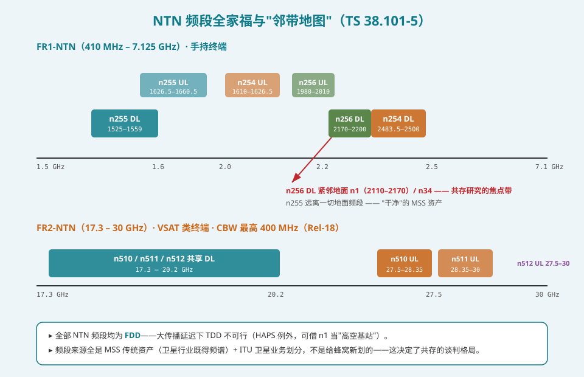
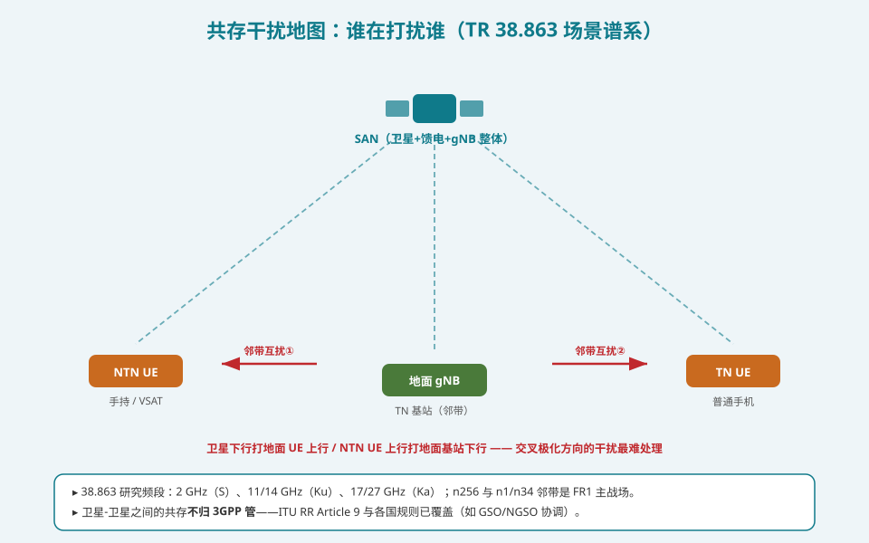
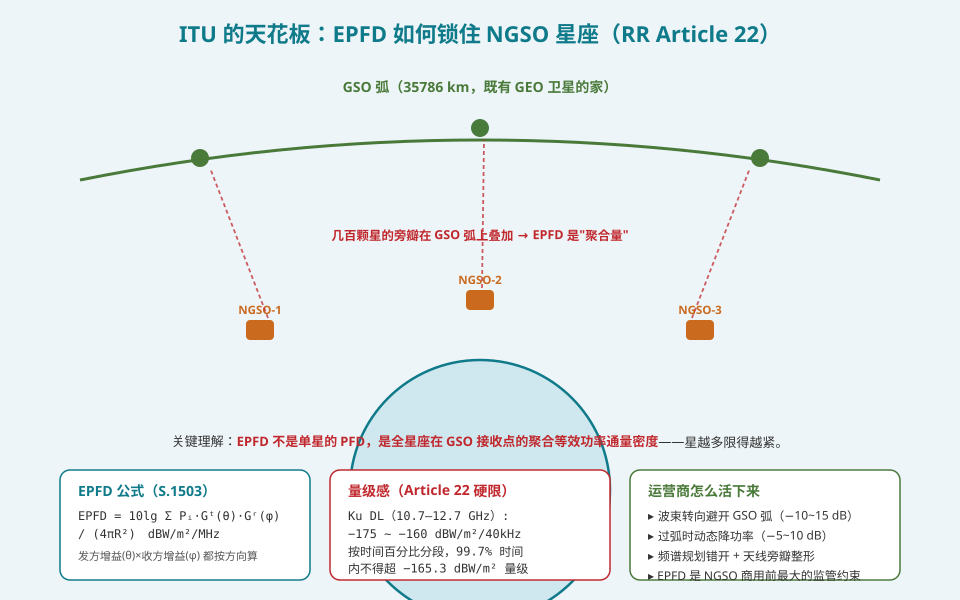
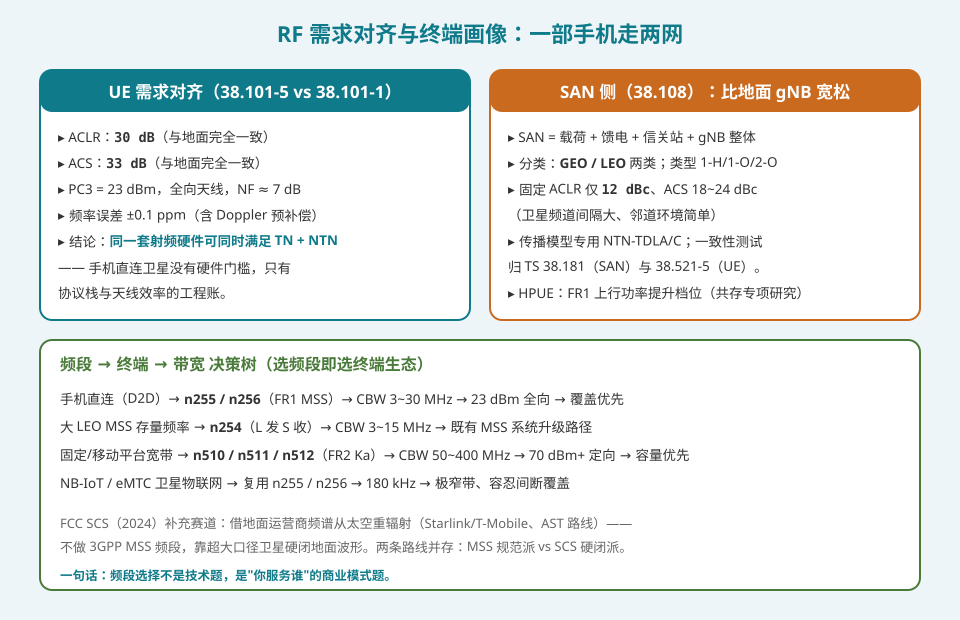

## 本篇要解决什么

[Rel-18 增强篇](ntn-rel18-enhancements.html)列过频段编号表，[信道与链路预算篇](ntn-channel-link-budget.html)算过 S 与 Ka 的两本余量账——但"频段"本身从来没有作为主角登场过。本篇回答三个问题：**NTN 的频段从哪来（答案：不是新划的，是卫星行业的家底）、谁可能与它打架（答案：隔壁的地面蜂窝网和天上的 GEO 星座）、规则由谁定（答案：3GPP 管蜂窝侧 RF，ITU 管星与星之间）**。

先说结论：**NTN 频谱全部来自 MSS 传统资产与 ITU 卫星业务划分——它是"借住"在卫星频谱里的蜂窝标准，所以 RF 工作的实质是两个行业的谈判；而谈判的最终成果是一组漂亮的工程事实：NTN 手机的 RF 需求与地面手机完全对齐（ACLR 30 dB / ACS 33 dB），同一套射频硬件走两网。**

对照：**TR 38.863**（共存研究，Rel-17 发起、持续更新至 Rel-20）、**TS 38.101-5**（UE RF）、**TS 38.108**（SAN RF）、**ITU RR Article 22 / S.1503**（EPFD）、**Recommendation ITU-R S.524/S.728**（离轴 ESD 掩模）。

相关：[Rel-18 增强全集](ntn-rel18-enhancements.html)（FR2 频段的引入章）、[NTN 信道与链路预算](ntn-channel-link-budget.html)（频段决定路损与雨衰）、[NTN 综合入门](5g-ntn.html)（频谱全局观）。

---

## 一、NTN 频段全家福：借来的家底

### 1.1 六个频段，两种来源

| 频段 | UL（UE 发） | DL（UE 收） | 带宽 | 来源 |
|---|---|---|---|---|
| n255 | 1626.5–1660.5 | 1525–1559 MHz | 3/5/10/15/20 | L 频段 MSS 传统资产（Inmarsat 遗产，同 LTE B24） |
| n256 | 1980–2010 | 2170–2200 MHz | 3~20 | S 频段 MSS（与地面 2 GHz 相邻） |
| n254 | 1610–1626.5 | 2483.5–2500 MHz | 3/5/15 | L/S 跨带配对（大 LEO MSS 存量，Rel-18） |
| n510 | 27.5–28.35 | 17.3–20.2 GHz | 50~400 | Ka（美式划分，Rel-18） |
| n511 | 28.35–30.0 | 17.3–20.2 GHz | 50~400 | Ka（欧式划分，Rel-18） |
| n512 | 27.5–30.0 | 17.3–20.2 GHz | 50~400 | Ka 全范围备选 |

关键认知：**这些频段没有一个是给蜂窝通信新划的**。L/S 是国际移动卫星业务（MSS）的百年家底，Ka 是卫星固定业务的既有阵地。3GPP 做的是把 NR 栅格"适配"进去——这也是[综合入门篇](5g-ntn.html)讲的那个战略决策（适应 NR 而非另起炉灶）在频谱维度的投影。

### 1.2 全 FDD：延迟的又一个受害者

六个频段全部 FDD。原因在[定时器篇](ntn-timers.html)讲过：数百 ms 的传播延迟下，TDD 的 HARQ 时序与 ACK 反馈在帧结构里根本排不下（LEO 单程 13~27 ms 已超出多数 TDD 时隙配比的极限）。HAPS 是唯一例外——20 km 高度延迟与地面同量级，可以直接借 n1 当"高空基站"，UE 零改动。

### 1.3 邻带地图：n256 住在闹市区

FR1 三个频段的"居住环境"截然不同：

- **n255**：周围没有地面蜂窝频段——干净的 MSS 频谱，共存问题最小；
- **n256**：**DL 2170–2200 MHz 紧邻地面 n1 的 DL（2110–2170）**，UL 也与 n1/n34 相邻——这是 TR 38.863 在 2 GHz 做共存研究的原因，也是地面移动行业与卫星行业争论最激烈的频谱；
- **n254**：L 发 S 收跨度 873.5 MHz，双侧邻居各不相同，但均非蜂窝主频段。

FR2 的 Ka 频段目前没有相邻的 3GPP 地面频段（17 GHz 附近尚无 TN 计划）——38.863 明确注明：当前结论基于"假想的相邻部署"，一旦 17 GHz 出现地面网需要重启评估。

---

## 二、共存研究：TR 38.863 的方法论

### 2.1 谁管什么：3GPP 与 ITU 的分界

这是本篇最重要的边界认知：

- **3GPP（38.863）管"蜂窝侧"**：NTN 与地面 NR 网之间、NTN UE 与地面网设备之间的干扰；
- **ITU（RR Article 9 及区域规则）管"星与星"**：GSO/NGSO 卫星系统间协调、卫星与地面微波业务——38.863 明确把卫星间共存排除在研究范围外。

### 2.2 干扰场景谱系

38.863 在 2 GHz / 11-14 GHz / 17-27 GHz 三组频段上仿真了攻守互换的四类场景：

| 攻击方 | 受害方 | 典型路径 |
|---|---|---|
| NTN UE（UL） | 地面 gNB（DL 邻带收） | 手机打卫星时旁瓣漏进地面基站 |
| 地面 gNB（DL） | NTN UE（UL 邻带收） | 基站大功率紧邻 NTN UE 接收带 |
| SAN（DL） | 地面 gNB/UE | 卫星波束扫过地面网头顶 |
| NTN UE | NTN UE / VSAT | 系统内部 |

其中最难的是**交叉方向干扰**（卫星 DL 打地面 UL）：卫星在天上、地面基站天线朝天，几何上无法靠隔离度化解，只能靠 ACLR/ACS 与频率间隔硬扛。38.863 给出的结论数字包括 SAN 固定 ACLR 12 dBc、ACS 18~24 dBc——注意这**比地面 gNB 的要求宽松**，因为卫星邻道环境简单（没有密集邻区），且卫星 EIRP 被离轴掩模约束。

### 2.3 研究结论的商业意义

38.863 最重要的产出不是某个 dB 数，而是一个许可：**NTN UE 的最小 RF 需求与地面 UE（TS 38.101-1）对齐**——ACLR 30 dB、ACS 33 dB、PC3 23 dBm。这意味着手机厂商不需要为卫星接入重做射频前端，"你的手机能连卫星"在 RF 层没有硬件障碍。剩余的差异全部在软件与天线效率上（NTN 要求 Doppler 预补偿、频率误差 ±0.1 ppm 含补偿余量）。

---

## 三、ITU 的天花板：EPFD 与离轴约束

### 3.1 EPFD：聚合的功率通量天花板

对 NGSO 星座（Starlink、Kuiper 这类），ITU RR **Article 22** 设定了保护 GSO 系统的硬性 EPFD（等效功率通量密度）限值：

\[ \text{EPFD} = 10\lg\sum_i \frac{P_i \cdot G_t^{(i)}(\theta) \cdot G_r^{(i)}(\phi)}{4\pi R_i^2} \quad \text{dBW/m}^2\text{/MHz} \]

三个要点：

1. **聚合量**：不是单星限制，是全星座所有可见卫星在 GSO 接收点的叠加——星座越大，每颗星分到的"配额"越小；
2. **按时间百分比分段**：如 Ku 下行 −175.4 dBW/m²/40kHz（40% 时间）到 −160（100% 时间）——允许短暂越限，长期不许；
3. **方向敏感**：发射增益按偏离主轴角度 θ、接收增益按来波方向 φ 计入——这正是"波束转向避开 GSO 弧"能省 10~15 dB 的数学原因。

### 3.2 这与 3GPP 有什么关系

表面看 EPFD 是卫星行业内部事务，但它通过两条路径进入蜂窝规范：

- **TS 38.101-5 的离轴 EIRP 密度包络**（[Rel-18 篇](ntn-rel18-enhancements.html)讲过）：VSAT 主瓣可以 86.2 dBm，旁瓣必须收敛——这是 ITU 掩模（S.524 等）在 3GPP 规范里的直接投影；
- **FR2 部署的容量上限**：EPFD 限值实质限制了 NGSO Ka 星座的频谱效率与密度——Amazon 在 WRC-27 议程上争取放宽 Article 22，正说明这道天花板是 FR2-NTN 商业模型的核心变量。

### 3.3 一句话总结监管格局

**UE 的 EIRP 上限管的是"你"，EPFD 管的是"你们所有人加起来"**。前者写在 38.101-5，后者写在 ITU 无线规则——一个厂商可以绕开 3GPP（如 SCS 路线），绕不开 ITU。

---

## 四、终端画像与决策树：选频段即选商业模式

把频段、终端、带宽连成决策树，NTN 的产品光谱一目了然：

| 目标用户 | 频段 | 带宽 | 终端 | 优先级 |
|---|---|---|---|---|
| 手机直连（D2D） | n255 / n256 | 3~30 MHz | 23 dBm 全向 | 覆盖优先 |
| 大 LEO MSS 存量升级 | n254 | 3~15 MHz | 既有 MSS 终端 | 平滑演进 |
| 固定/移动平台宽带 | n510/511/512 | 50~400 MHz | VSAT（70 dBm+ 定向） | 容量优先 |
| 卫星物联网 | n255/n256 复用 | 180 kHz | NB-IoT/eMTC 模组 | 成本与功耗 |

SAN 侧（TS 38.108）与 UE 侧的分工值得记住：**UE 需求向地面对齐（严格），SAN 需求比地面 gNB 宽松**——因为卫星邻道环境简单、且被 ITU 掩模另管。SAN 分 GEO/LEO 两类（类型 1-H/1-O/2-O），一致性测试归 TS 38.181（SAN）与 38.521-5（UE）。

最后一条补充赛道：**FCC SCS（2024，全球首个地面频谱太空重辐射框架）**。Starlink/T-Mobile 与 AST 走的不是 3GPP MSS 频段，而是借地面运营商的现役频段从太空重辐射——用超大口径卫星硬闭地面波形，手机零改动零感知。它与 MSS 规范派（Skylo 等走 NB-IoT-NTN）构成 2026 年直连卫星的两条路线：**频谱 rights 换工程难度**，各赌各的未来。

---

## 排障清单：RF/共存视角的嫌疑

1. **n256 部署区地面网投诉干扰**：先查 NTN UE 上行 ACLR 是否达标 + 保护区协调协议——n256 与 n1/n34 邻带是监管审批的重灾区。
2. **FR2 吞吐远低于预期**：EPFD 限值在扣容量——查当前波束几何是否贴近 GSO 弧（转向规避会强制降功率）。
3. **VSAT 年检不过**：离轴 EIRP 密度超掩模——天线指向误差累积是最常见原因（机械转向尤其）。
4. **频率误差测试失败**：±0.1 ppm 要求含 Doppler 预补偿残余，检查 GNSS 馈入与补偿算法链路，而非晶体本身。
5. **HPUE 档位开不了**：共存结论未覆盖当前部署邻带组合——HPUE 在 2 GHz 侧行有严格前置条件。
6. **HAPS 不需要 NTN 定时参数**：n1 高空基站延迟与地面同量级，别把 K_offset/SIB19 套上去——架构假设先确认。

---

## 自测七题

1. NTN 六个频段的频谱来源是什么？这对 RF 工作的实质影响是什么？
2. 为什么 NTN 全部采用 FDD？唯一的例外是谁，为什么例外？
3. n256 为什么是共存研究的焦点带？n255 为什么不是？
4. 3GPP 与 ITU 在 NTN 共存上的管辖分界线是什么？各自管什么？
5. EPFD 与单星 PFD 的本质区别？它如何随星座规模变化？
6. NTN UE 的 ACLR/ACS 与地面 UE 的关系是什么？这个对齐的商业意义？
7. MSS 规范派与 FCC SCS 派的本质分歧是什么？

参考答案

1. 全部来自 MSS 传统资产（L/S）与 ITU 卫星业务划分（Ka），没有新划频谱。实质影响：NTN 是卫星频谱里的"借住者"，RF 工作是蜂窝与卫星两个行业的谈判，邻带约束由别人家的历史占用决定。
2. 大传播延迟使 TDD 的 HARQ/ACK 时序在帧结构内排不下。例外是 HAPS：20 km 高度延迟与地面同量级，可直接用 n1 的 TDD/FDD 地面配置。
3. n256 DL（2170–2200）紧邻地面 n1 DL（2110–2170），UL 亦邻 n1/n34，干扰路径短且地面网密集；n255 周围无地面蜂窝频段，邻道环境干净。
4. 3GPP（38.863）管 NTN 与地面蜂窝网之间及 NTN 系统内部的 RF 共存；ITU（RR Article 9/22 及区域规则）管星与星（GSO/NGSO）及卫星与其他业务的协调。
5. EPFD 是全星座所有可见卫星在受害接收点的聚合等效功率通量密度（含收发双向方向增益），PFD 是单星的。星座越大聚合越强，每颗星可用功率配额越小——限值随规模"自动收紧"。
6. 完全对齐：ACLR 30 dB、ACS 33 dB、PC3 23 dBm。意义：手机射频前端无需为卫星重做，TN/NTN 双模零硬件代价，手机直连卫星的 RF 门槛消失。
7. 频谱权利：MSS 派用 3GPP 规范化的 MSS 专有频谱（合规干净但带宽窄），SCS 派借地面运营商现役频谱从太空重辐射（FCC 2024 框架，带宽复用手机零改动，但需超大口径卫星硬闭链路且地域限于已立法区域）。

