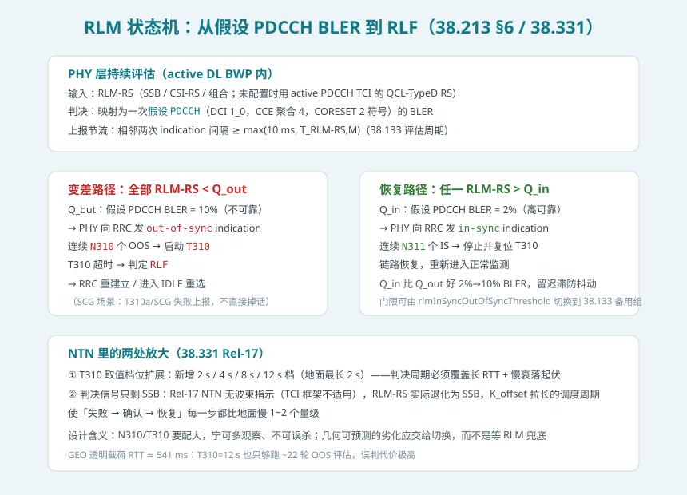
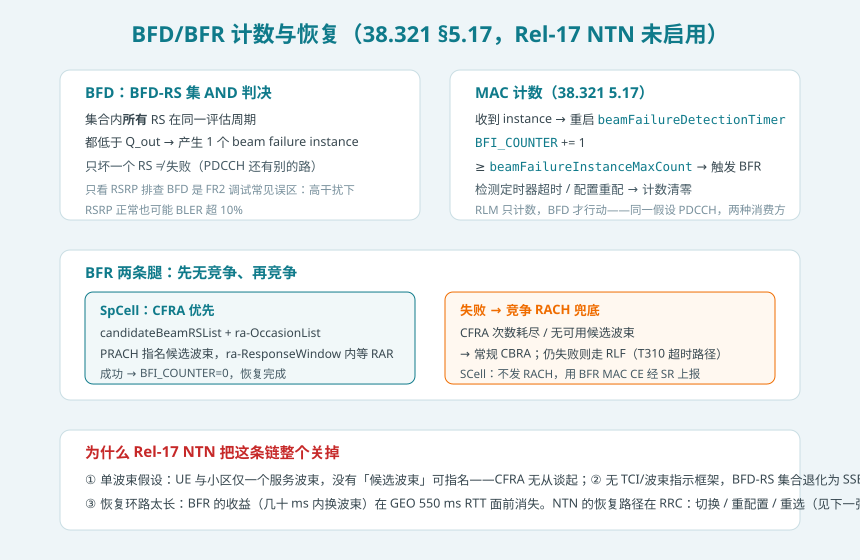
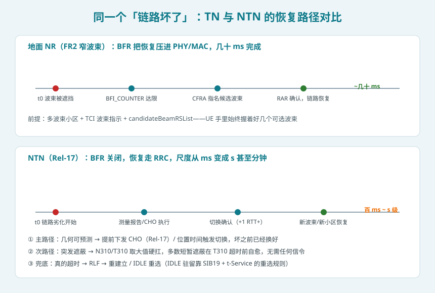
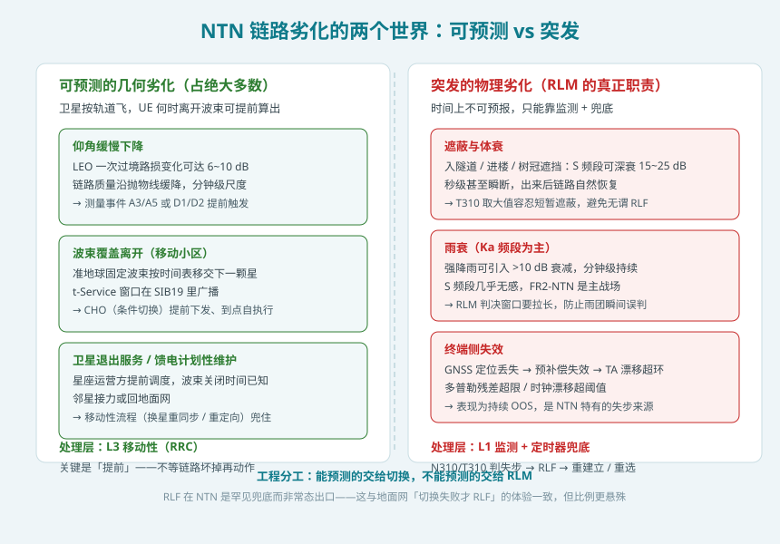

## 本篇要解决什么

链路总会坏。地面网里 UE 掉线前有一套完整的报警与自救机制：物理层盯着参考信号估质量（RLM），MAC 层发现波束坏了就换波束（BFR），RRC 层兜底重建立。这套机制搬到卫星上遇到一个根本问题：**NTN 的「坏」分两种——一种是按轨道算得出、提前几十秒就知道会坏的（UE 驶出波束、卫星仰角下降），另一种是突发的（进隧道、树冠遮蔽、Ka 频段雨团）——标准化的监测与恢复机制应该为哪一种服务？**

先说结论：**Rel-17 NTN 做了一次「减法」——BFR（波束失败恢复）整体不启用，RLM 保留但把定时器拉到 12 s 级；链路恢复的主责交给 L3 移动性（CHO/切换/重选），RLM 降级为突发场景的最后兜底。这不是功能缺失，而是单波束 + 长反馈环路下的理性取舍。**

对照：**TS 38.213 §6**（RLM：Qout/Qin 与假设 PDCCH BLER）、**TS 38.321 §5.17**（BFD/BFR 计数与恢复）、**TS 38.331**（rlf-TimersAndConstants、RadioLinkMonitoringRS、NTN 扩展的 T310 档位）、**TS 38.133 §8/§10**（评估周期、指示间隔、测量一致性）、**TS 38.300 §16**（NTN 移动性总览）、**TR 38.811**（遮蔽/雨衰信道模型）。

相关：[NTN 定时器与定时关系全表](ntn-timers.html)（T310 扩档的完整定时器账本）、[NTN 移动性与卫星切换](ntn-mobility.html)（RLM 让出的那半边：主动恢复）、[NTN SIB19](ntn-sib19.html)（t-Service 窗口与 IDLE 重选）、[NTN 随机接入](ntn-rach.html)（BFR 若启用会复用的 CFRA 机制）。

---

## 一、RLM：UE 如何知道链路要死了

### 1.1 判决标准：不是测功率，是预测解码

NR 的 RLM 有个容易误解的设计：UE 监测的不是 RSRP，而是**把测得的参考信号质量映射为一次「假设 PDCCH 传输」的 BLER**——假设现在用 DCI 1_0、CCE 聚合度 4、CORESET 占 2 个符号发一条 PDCCH，能解出来的概率是多少。这样定义把调制方式、聚合度、干扰、噪声全部折进一个数，直接回答「下行控制信道还能不能可靠收」。

两个门限（38.133 默认组，`rlmInSyncOutOfSyncThreshold` 未配置时生效）：

| 门限 | 含义 | 对应假设 PDCCH BLER |
| --- | --- | --- |
| Q_out | 链路「不可靠接收」的水平 | 10% |
| Q_in | 链路「高可靠接收」的水平 | 2% |

物理层据此向 RRC 发两类指示：

- **out-of-sync**：*所有*被监测的 RLM-RS 都差于 Q_out；
- **in-sync**：*至少一个* RLM-RS 好于 Q_in。

注意两条判据的量词不同——OOS 要求全军覆没，IS 只要有生还者。中间地带（全部介于 Q_in 与 Q_out 之间）**不发任何指示**，这是刻意设计的迟滞带，防止门限附近的链路把 RRC 层的通知刷爆。

### 1.2 状态机：N310 → T310 → N311

RRC 层的状态机简单到三句话：

1. 连续收到 **N310** 个 out-of-sync → 启动 **T310**；
2. T310 运行期间连续收到 **N311** 个 in-sync → 停止并复位 T310，链路自愈；
3. T310 超时 → 宣告**无线链路失败（RLF）**，走重建立或进 IDLE 重选。

被监测的 RLM-RS 从哪来：网络显式配置（SSB / CSI-RS / 混合，38.331 `RadioLinkMonitoringRS`）；没配就用 active PDCCH TCI state 的 QCL-TypeD 参考信号——**但这一条回退规则在 NTN 里的语义变了**，因为 Rel-17 NTN 根本没有 TCI 波束指示框架（见第二节），RLM-RS 实际上就是 SSB。

指示的产出频率有下限：相邻两次 L1 指示至少间隔 `max(10 ms, T_RLM-RS,M)`，其中 T_RLM-RS,M 是所有 RLM-RS 里最短的参考信号周期。SSB 周期 20 ms 时，指示最快 20 ms 一次——这决定了从「链路开始变坏」到「RRC 知道」本身就有几十 ms 的观测延迟，NTN 里这个数字还要乘上更长的判决周期。

---

## 二、BFD/BFR：地面网的「换波束自救」

### 2.1 BFD：与 RLM 同源，消费方不同

BFD（波束失败检测）和 RLM 问的是同一个问题——**现在这个假设 PDCCH 还能解吗**——都基于 Q_out 那条 10% BLER 线。区别在消费方与动作：

| | RLM | BFD |
| --- | --- | --- |
| 门限 | Q_out + Q_in（带迟滞） | 仅 Q_out |
| 判决逻辑 | 任一 RS 好于 Q_in 即算恢复 | BFD-RS 集内**所有** RS 都差于 Q_out 才算失败（AND） |
| 消费方 | RRC：N310/T310/N311 | MAC：BFI_COUNTER |
| 失败后的动作 | 被动等待，只计数 | 主动：触发波束恢复 |

AND 逻辑是关键细节：UE 配了两个 CORESET 挂在两个波束上，只坏一个时 PDCCH 仍有路可走，不算波束失败。这也是 FR2 调试的经典陷阱——**盯着某一个波束的 RSRP 断崖看不到 BFD 触发，因为判据是整组 AND**；反过来，高干扰场景 RSRP 看着正常、BLER 却超 Q_out，只看 RSRP 排障会一头雾水。

### 2.2 BFR：计数、指名、换波束

MAC 层（38.321 §5.17）收到 beam failure instance 后：

1. 重启 `beamFailureDetectionTimer`，`BFI_COUNTER += 1`；
2. `BFI_COUNTER ≥ beamFailureInstanceMaxCount` → 触发 BFR；
3. SpCell 的 BFR 优先走**无竞争随机接入**：网络预先在 `candidateBeamRSList` 里放好候选波束，UE 用 `ra-OccasionList` 指定的 PRACH 资源发起 CFRA，等于「指名道姓」地告诉 gNB：我现在的波束坏了，我要换到那个候选上；
4. `ra-ResponseWindow` 内等到 RAR → 恢复成功，计数清零；等不到 → 退回竞争 RACH（CBRA），再失败就汇入 RLF 路径；
5. SCell 的 BFR 不发 RACH，改用 **BFR MAC CE** 经调度请求上报，成本更低。

整条链路在地面 FR2 上是毫秒级工程：beamFailureDetectionTimer 默认 100 ms 量级、CFRA 一两个往返、恢复总耗时几十 ms——因为假设的前提是**小区里有几十个窄波束、UE 手里始终攥着好几个候选**。

---

## 三、NTN 的减法：为什么 Rel-17 把 BFR 整个关掉

Rel-17 NTN 的特性清单里，BFR 明确不在支持范围内。三个原因，一个比一个硬：

**① 单波束假设。** Rel-17 NTN 的 UE 与小区之间只有一个服务波束，卫星侧是宽波束（S 频段单波束覆盖数百 km 量级），不存在「候选波束」这个概念。`candidateBeamRSList` 没有填的东西，CFRA 指名换波束无从谈起。

**② 没有 TCI/波束指示框架。** 地面 BFD 的 RS 集合、候选波束的 QCL 关系全靠 TCI state 体系维系。Rel-17 NTN 明确不支持波束指示（PDCCH/PDSCH 的 TCI 激活不适用），BFD 的 AND 集合退化成单个 SSB——一个「波束失败检测」机制在单波束世界里退化成了 RLM 的低配翻版，没有存在的必要。

**③ 反馈环路太长，恢复窗口错过时效。** BFR 的价值是「几十 ms 内无损换波束」。NTN 里从 UE 发 PRACH 到看到 RAR 至少隔一个 RTT：LEO 约 25~50 ms 勉强，GEO 透明载荷 541 ms 起步——此时「恢复」早已不是波束级操作能解决的问题，而是要整建制地重新同步、重新接入。机制的收益被时延吃光，成本（信令、配置、UE 复杂度）却一分不少，于是整个被裁掉。

**结论：NTN 的链路恢复主责上移到 RRC。** 能预测的劣化用切换（含 Rel-17 就有的 CHO）在坏之前完成；不能预测的劣化用放大的 T310 硬扛；真扛不住的 RLF 走重建立/重选。这与地面网「RLM 只兜底、恢复靠主路径」的哲学一致，只是比例更加悬殊。

---

## 四、NTN 的「坏」分两种：工程分工的依据

NTN 链路劣化的物理成因可以按「可预测性」分成两个世界：

**可预测的几何劣化（占绝大多数）**。卫星按开普勒轨道飞，波束覆盖、仰角、路损全是时间的确定函数：LEO 一次过境路损变化可达 6~10 dB、准地球固定波束按时间表移交下一颗星、t-Service 窗口就写在 SIB19 里。这一类劣化**根本不该让 RLM 看见**——测量事件（A3/A5、NTN 特有的 D1/D2）和条件切换应该在链路仍然健康时就完成换星。RLM 若频繁触发，恰恰说明移动性参数配坏了。

**突发的物理劣化（RLM 的真正职责）**。进隧道/楼体的遮蔽在 S 频段可造成 15~25 dB 的深衰，秒级甚至瞬断；Ka 频段（Rel-18 FR2-NTN）的雨团衰减可超 10 dB 且持续分钟级；终端侧的 GNSS 定位丢失会让预补偿失效、TA 漂移出环，表现为持续 out-of-sync——这是 NTN 特有的失步来源。这一类**时间上不可预报**，只能靠监测 + 定时器兜底。

两类劣化的处理策略正交：**能预测的交给切换，不能预测的交给定时器**。这条分工线是理解 NTN 移动性与 RLM 两篇专题关系的钥匙。

---

## 五、判决账本：T310 为什么要拉到 12 s

Rel-17 为 NTN 扩展了 T310 的可配置档位（38.331 `rlf-TimersAndConstants` 新增 2 s/4 s/8 s/12 s，地面最长 2 s）。拉长是三笔账的合力：

| 账本 | 内容 | 量级 |
| --- | --- | --- |
| 观测延迟 | OOS 指示间隔 ≥ max(10 ms, SSB 周期)，N310 个连续 OOS 才启动 T310 | 数百 ms |
| 反馈环路 | 就算立即发起恢复（重建立），一轮信令 = 1~2 个 RTT；GEO 透明载荷 RTT ≈ 541 ms | 秒级 |
| 遮蔽时长 | S 频段典型遮蔽（树冠、桥隧）数秒内结束，链路可自愈 | 数秒 |

T310=12 s 时，GEO 场景大约能容纳 20 余轮 OOS 评估周期加若干轮重建立尝试——**宁可多等，不可误杀**。误杀的代价极其昂贵：RLF → 重建立（或掉到 IDLE 重新搜网），在 NTN 里意味着重新做一遍完整的 GNSS 同步 + 小区搜索 + 随机接入，中断以十秒计；而「多等几秒链路自愈」的代价是零信令。两个方向的代价不对称，决定了 T310 取大值的倾向。

N310/N311 的取值本身没变（仍是 n1~n20 那几档），变的是**每个指示的间隔**被长 SSB 周期和慢判决拉大——定时器数值与指示节奏要配套设计，只改一头会出现「N310 还没数满链路早就死了」或反过来「数满了 T310 还在跑，明明早就该放弃」的错配。

还有一个容易被忽略的耦合：**RLF 后的 IDLE 重选依赖 SIB19 的有效性**。UE 在 RLF 重选时用的仍是缓存的星历与 ta-Common 外推——若 RLF 的根因是星历过期（epochTime 太老），重选会反复失败，这与 [SIB19 专题](ntn-sib19.html)里 valueTag 豁免机制的「有效性边界」遥相呼应。

---

## 六、排障清单：NTN 里 RLF 的六个嫌疑方向

按出现频率排：

1. **T310 配小了**：短暂遮蔽（隧道/树冠）在 T310 超时前本可自愈，配成地面默认 1 s 就是高频误杀。看 RLF 前的 OOS 持续时长分布，若大量 < 2 s，优先放大 T310。
2. **移动性没接住几何劣化**：UE 驶出波束属可预测事件，若 RLM 频繁在切换前触发，检查事件 D1/D2 / CHO 配置与 t-Service 窗口的余量。
3. **星历过期**：epochTime 陈旧 → ta-Common 外推失效 → TA 漂移 → 持续 OOS。这类 RLF 常伴随上行失步告警，且重建立后立刻再挂。
4. **GNSS 丢失**：预补偿链条断裂，时频残差超限。UE 侧表现是「失步 + 频偏异常」，网侧无能为力，只能等 UE 重捕 GNSS。
5. **K_offset 与调度周期错配**：长周期 PDCCH 监听 + 大 K_offset 使「失败确认」本身就慢，N310 的观测窗口拉长后若 T310 未同步放大，会出现「定时器跑得比判决快」。
6. **Ka 频段雨衰**：分钟级深衰，S 频段经验完全失效；这类 RLF 带地域/天气聚集性，靠网侧临时调整覆盖（波束功率、MCS 下限）缓解，协议层无解。

---

## 七、自测题

1. Q_out 和 Q_in 各对应多大的假设 PDCCH BLER？为什么 OOS 的判据是「全部 RS 超限」而 IS 是「任一 RS 达标」？
2. RLM 与 BFD 都基于假设 PDCCH BLER 和 Q_out，两者的消费方和失败后的动作有何不同？BFD 的 AND 逻辑意味着什么？
3. Rel-17 NTN 关闭 BFR 的三个原因分别是什么？其中哪一条在 GEO 场景下最致命？
4. Rel-17 NTN 中 RLM-RS 实际上是什么信号？为什么地面网「未配置 RLM-RS 时用 active TCI 的 QCL-TypeD RS」这条回退规则在 NTN 里语义失效？
5. 一列火车穿过 3 km 隧道（S 频段 NTN，GEO），T310 分别配 1 s 和 8 s，两条路径分别走什么？哪种的代价更小？
6. NTN 把 T310 档位扩展到 12 s 的三笔账（观测延迟/反馈环路/遮蔽时长）各自贡献了什么？
7. 为什么说「NTN 里 RLM 频繁触发本身就是移动性配置故障」？对应的排查入口有哪些？

---

## 小结

- **RLM**：PHY 层以假设 PDCCH BLER 对 Q_out(10%)/Q_in(2%) 判决，向 RRC 发 OOS/IS 指示，N310/T310/N311 状态机最终以 T310 超时宣告 RLF——机制原样适用于 NTN，只是节奏被放大。
- **BFD/BFR**（38.321 §5.17）：同一判决标准交给 MAC 计数，达阈值后用 CFRA 指名候选波束快速自救——**Rel-17 NTN 因单波束、无 TCI 框架、长环路三点整体不启用**。
- **工程分工**：可预测的几何劣化（过境/波束移交）交给切换与 CHO 提前化解；突发劣化（遮蔽/雨衰/GNSS 丢失）交给放大后的定时器硬扛；RLM 在 NTN 是罕见兜底而非常态出口。
- **定时器账本**：T310 扩档至 12 s，N310/T310 与指示间隔必须配套设计；RLF 后的 IDLE 重选仍依赖 SIB19 星历有效性，星历过期是 NTN 特有的「连环 RLF」根因。

下一篇预告：**NTN 测量与 CSI 上报**——基于 UE 位置的 CSI-RS 触发、测量 gap 增强（gap 内读 SI）、CSI 上报在长 RTT 下的周期与 rank 限制。
