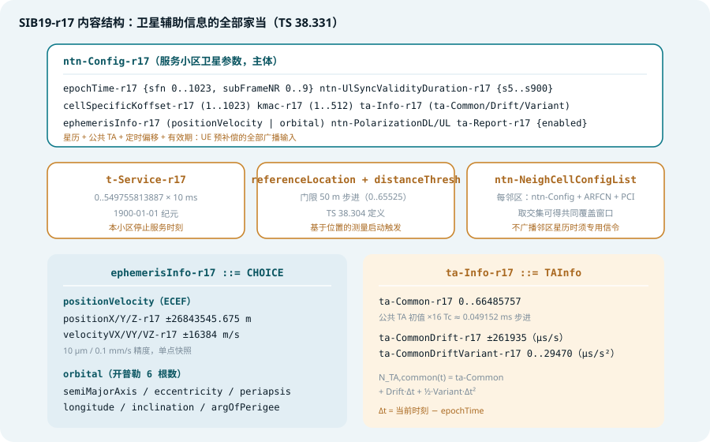
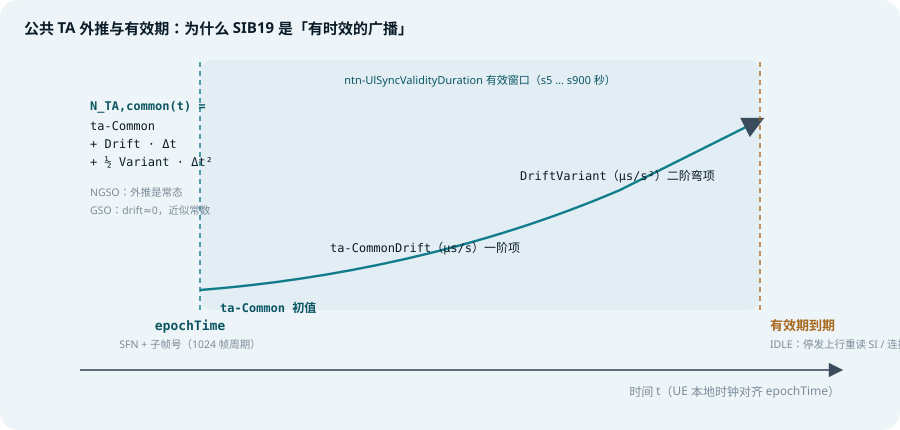
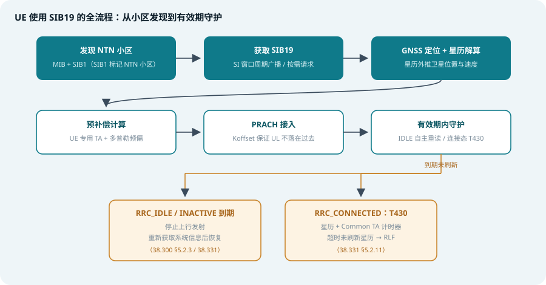

## 本篇要解决什么

[NTN 综合专题](5g-ntn.html)讲的是网络如何补偿大时延与大频偏，[再生载荷专题](ntn-regenerative-payload.html)讲的是 gNB 放在哪里，[UE 能力专题](ntn-ue-capability.html)讲的是终端声明自己能干什么。本篇讲**一切预补偿机制的广播源头**：**SIB19——网络把「卫星的时空坐标」广播给 UE 的那一纸说明书。**

NTN 的核心矛盾是：**地面网络里「网络知道的一切」，卫星网络里 UE 也必须知道一部分**。没有卫星位置，UE 算不出自己的 TA；没有公共 TA 参数，预补偿无从谈起；没有有效期管理，NGSO 卫星跑远之后所有计算都是错的。SIB19（Rel-17 引入，**TS 38.331** 定义，行为规则在 **TS 38.300 §16.14** 与 **TS 38.304**）把这些全部装进一个系统信息块：

- **空间**：星历——卫星在哪里、往哪飞（两种形态任选其一）
- **时间**：epoch 锚点 + 公共 TA 三阶外推模型 + K_offset / K_mac
- **信任边界**：`ntn-UlSyncValidityDuration` 有效期与到期后果
- **退路**：`t-Service` 停止服务时刻、邻区 NTN 配置、极化方式

> **一条主线**：SIB19 把卫星几何变成了一串**可外推、有时效、带退路**的参数。UE 从被动的「听 gNB 命令」变成主动的「算卫星几何」。

对照：**TS 38.331**（SIB19 与 NTN-Config ASN.1、T430）、**TS 38.300 §16.14**（GNSS 假设与 UE 行为）、**TS 38.304**（IDLE 态基于位置的测量、referenceLocation 语义）。
相关：[5G NTN 综合专题](5g-ntn.html)、[NTN 再生载荷](ntn-regenerative-payload.html)、[NTN UE 能力](ntn-ue-capability.html)、[随机接入](random-access.html)、[3GPP 规范地图](3gpp-spec-map.html)。

---

## 一、SIB19 在系统信息家族中的位置

NR 系统信息 = MIB + SIB1（小区级，常播）+ 一堆按需的 other SIB。NTN 在 SIB1 里打标记（`cellBarred` 之外的 NTN 特征、多 TAC 广播等），把卫星辅助信息放进 **SIB19**，按 SI 周期广播或按需请求。

三个「身份特征」：

1. **NTN 专属，Rel-17 引入**：只有 NTN 小区才会调度它；老 UE 遇到 NTN 小区，不认识 SIB19 也能驻留（只是得不到 NTN 增强，行为退回保守模式）
2. **valueTag 豁免**：other SIB 通常靠 valueTag 变化提示重读，但 SIB19 的内容**随卫星运动而失效**（星历过期），valueTag 可能纹丝不动。因此 NTN UE **不能依赖 valueTag 判断 SIB19 新鲜度**，必须自己按有效期管理——这是排障时最常见的一类实现 bug 的根源
3. **按需请求也可行**：SI 按需机制（MSG1 / MSG3 请求）对 SIB19 同样适用，省广播开销；连接态 UE 也可通过 `si-RequestConfig` 相关流程获取

---

## 二、SIB19 内容全景



*图 1：SIB19 的内容结构——主体是服务小区的 ntn-Config，加上停止服务时刻、参考位置与距离门限、邻区 NTN 配置；右下两块分别是星历与公共 TA 的字段细节*

ASN.1 骨架（TS 38.331，节选）：

```asn.1
SIB19-r17 ::= SEQUENCE {
    ntn-Config-r17                NTN-Config-r17 OPTIONAL,   -- Need R
    t-Service-r17                 INTEGER (0..549755813887) OPTIONAL,   -- Need R
    referenceLocation-r17         ReferenceLocation-r17 OPTIONAL,   -- Need R
    distanceThresh-r17            INTEGER (0..65525) OPTIONAL,   -- Need R
    ntn-NeighCellConfigList-r17   NTN-NeighCellConfigList-r17 OPTIONAL,   -- Need R
    lateNonCriticalExtension      OCTET STRING OPTIONAL,
    ...
}
```

四个顶层字段，四个角色：

| 字段 | 角色 | 说明 |
| --- | --- | --- |
| `ntn-Config-r17` | **主体** | 服务小区的星历、公共 TA、K_offset/K_mac、有效期、极化——UE 预补偿的全部广播输入 |
| `t-Service-r17` | **退路（时间）** | 准地面固定小区（quasi-Earth fixed）停止服务当前区域的时刻 |
| `referenceLocation` + `distanceThresh` | **门限** | 基于位置的测量启动触发（IDLE/INACTIVE，TS 38.304） |
| `ntn-NeighCellConfigList` | **退路（空间）** | 邻区 NTN 参数列表，移动性预算的输入 |

---

## 三、ntn-Config：九个字段各司其职

```asn.1
NTN-Config-r17 ::= SEQUENCE {
    epochTime-r17                    EpochTime-r17 OPTIONAL,   -- Need R
    ntn-UlSyncValidityDuration-r17   ENUMERATED {s5, s10, s15, s20, s25, s30,
                                      s35, s40, s45, s50, s55, s60, s120,
                                      s180, s240, s900} OPTIONAL,   -- Cond SIB19
    cellSpecificKoffset-r17          INTEGER (1..1023) OPTIONAL,   -- Need R
    kmac-r17                         INTEGER (1..512) OPTIONAL,   -- Need R
    ta-Info-r17                      TAInfo-r17 OPTIONAL,   -- Need R
    ntn-PolarizationDL-r17           ENUMERATED {rhcP, lhcP, linear} OPTIONAL,   -- Need R
    ntn-PolarizationUL-r17           ENUMERATED {rhcP, lhcP, linear} OPTIONAL,   -- Need R
    ephemerisInfo-r17                EphemerisInfo-r17 OPTIONAL,   -- Need R
    ta-Report-r17                    ENUMERATED {enabled} OPTIONAL,   -- Need R
    ...
}
```

| 字段 | 含义 | UE 拿它做什么 |
| --- | --- | --- |
| `epochTime` | {sfn 0..1023, subFrameNR 0..9}：星历与公共 TA 的**参考时刻锚点** | Δt = 当前时刻 − epochTime，外推的起点 |
| `ntn-UlSyncValidityDuration` | s5 … s900 秒：星历 + Common TA 的**有效窗口** | 到期前必须重新获取系统信息（详见第五节） |
| `cellSpecificKoffset` | 1..1023 slot @ 15 kHz：K_offset | 上行时序整体右移，保证 UL 不落在过去 |
| `kmac` | 1..512：下行 MAC CE 的生效延迟 | 配置生效时刻对齐卫星 RTT |
| `ta-Info` | ta-Common（0..66485757）+ Drift（±261935）+ Variant（0..29470） | 公共 TA 三阶外推模型（见下） |
| `ntn-PolarizationDL/UL` | rhcp / lhcp / linear | 圆/线极化配置，影响射频前端 |
| `ephemerisInfo` | positionVelocity 或 orbital（二选一） | 卫星位置与速度——多普勒与 TA 的计算基础 |
| `ta-Report {enabled}` | 网络开启 TA 上报 | 触发 UE 经 MAC CE 上报 TA（对应 UE 能力 `uplink-TA-Reporting-r17`） |

### 星历的两种形态

```asn.1
EphemerisInfo-r17 ::= CHOICE {
    positionVelocity-r17   PositionVelocity-r17,
    orbital-r17            Orbital-r17
}
```

**形态一：`positionVelocity`（ECEF 状态向量）**

| 字段 | 范围 | 单位换算 |
| --- | --- | --- |
| positionX/Y/Z | ±26843545.675 m | 10 μm 步进 |
| velocityVX/VY/VZ | ±16384 m/s | 0.1 mm/s 步进 |

直接给出某一时刻的卫星位置与速度快照。**GSO 卫星速度近似为零，网络可以长期不更新**；NGSO 则依赖网络侧的更新频率（LEO 星历通常分钟级刷新，控制面可经 SIB19 或专用信令下发）。

**形态二：`orbital`（开普勒轨道根数）**

| 根数 | 字段 |
| --- | --- |
| 半长轴 a | semiMajorAxis（0..8589934591，步进 1 m） |
| 偏心率 e | eccentricityE |
| 近地点幅角 ω | periapsis |
| 升交点经度 Ω | longitude |
| 轨道倾角 i | inclination |
| 真近点角 ν | argOfPerigee（规范中以近地点幅角相关变体承载） |

轨道根数形态对 NGSO 更友好：一套根数可以外推较长时间，不必频繁刷新。UE 用标准轨道传播算法自行解算任意时刻的位置速度。

### 公共 TA 的三阶外推模型



*图 2：网络在 epochTime 时刻广播 ta-Common 及其一阶、二阶漂移项；UE 在有效窗口内外推公共 TA，到期必须重读 SIB19*

$$N_{TA,common}(t) = ta\text{-}Common + Drift \cdot \Delta t + \tfrac{1}{2} \cdot Variant \cdot \Delta t^2,\quad \Delta t = t - epochTime$$

- **ta-Common**：初值，0..66485757，单位 16·T_c ≈ 0.049152 μs 步进——量纲与地面 TA 的 N_TA 一致
- **ta-CommonDrift**：一阶项（μs/s），对应卫星径向速度——**GSO ≈ 0，NGSO 是主项**
- **ta-CommonDriftVariant**：二阶项（μs/s²），捕捉加速度（轨道弯曲、机动修正）

UE 的总 TA = 公共 TA（外推） + **UE 专用 TA**（GNSS 位置 + 星历实时算出的服务链路差分）。公共部分全网一致由广播承载，专用部分每台 UE 不同由自己算——这就是[ NTN 综合专题](5g-ntn.html)「Common TA + UE-specific TA」两级模型在 SIB19 里的具体参数化。

### t-Service：准地面固定小区的「谢幕时间」

- 单位：10 ms 步进，从 **1900-01-01 00:00** 起算的绝对时间
- 语义：**quasi-Earth fixed 系统**中，当前小区（波束）停止服务其覆盖区域的时刻——NGSO 多波束按「波束轮流扫过固定服务区」设计，每个波束对每片服务区都有一个谢幕时刻
- UE 行为：临近 `t-Service`，该准备小区重选 / 切换了；配合邻区星历（`ntn-NeighCellConfigList`）算出「当前卫星和下一颗卫星都覆盖我」的公共时间窗，移动性决策就有了定量预算

### referenceLocation + distanceThresh：基于位置的测量触发

`referenceLocation`（地理坐标）+ `distanceThresh`（50 m 步进）实现 **location-based measurement initiation**（TS 38.304）：UE 发现自己离参考位置超过门限才启动测量。对「卫星在天上跑、UE 在地上不动」的 NTN 场景，比传统的基于时间/信号的触发更贴合——决定测量的不是信号弱了，而是**几何快变了**。

---

## 四、UE 如何使用 SIB19：三态各有规则



*图 3：从发现 NTN 小区、读取 SIB19、GNSS 定位与预补偿接入，到有效期内守护与到期后果的完整流程*

### 1. 驻留之前：SIB19 决定「能不能算」

选小区前 UE 要评估 NTN 小区可用性：读 SIB19 拿星历与公共 TA，结合自身 GNSS 位置做预补偿计算，才有资格发起 PRACH。**接不进 NTN 小区，第一现场检查 SIB19 是否解码成功、星历是否过期。**

### 2. RRC_IDLE / INACTIVE：UE 自主管理有效期

NTN 小区（尤其 NGSO）随时在动，系统信息随时会因卫星运动而失效。规范把责任压给 UE：

- **到期即停发**：`ntn-UlSyncValidityDuration` 窗口耗尽而未重读 SIB19 → UE 视为丢失上行同步，**停止上行发射**，重新获取系统信息后才能恢复（TS 38.300 §5.2.3）
- **到期与后果的对应**：IDLE 态不触发 RLF（本无连接），但驻留合法性依赖有效的星历；连接前的 RACH 自然也被挡住
- 准地面固定场景下配合 `t-Service`：谢幕时刻之前完成小区重选

### 3. RRC_CONNECTED：T430 计时器守护星历

连接态引入 **T430**（TS 38.331 §5.2.11）：网络下发星历 + Common TA 参数（SIB19 或专用信令）时启动 T430；**T430 超时而网络未刷新星历 → UE 声明 RLF**，走重建流程。这与[ UE 能力专题](ntn-ue-capability.html)的运行时三重先决（能力 / GNSS / 星历）互为表里：能力是历史声明，GNSS 与星历是**每一次传输的现场检查**。

### 4. 网络侧刷新通道

- 广播更新：SIB19 重新广播（valueTag 可能不变，UE 靠有效期自决）
- 专用信令：RRC Reconfiguration 直接下发 NTN 定时参数与星历，连接态 UE 可不经系统信息拿到新鲜星历；邻区星历也可放进测量对象（Rel-18 `ntn-NeighbourCellInfoSupport-r18` 能力，见 UE 能力专题第五节）
- MAC CE：UE 专用 K_offset 的即时调整

---

## 五、有效期机制：SIB19 最容易被实现忽视的部分

`ntn-UlSyncValidityDuration` 从 s5 到 s900 枚举，覆盖从 LEO 快速更新到 GEO 长周期信任的范围。三个设计要点：

1. **valueTag 豁免是规范层面的精心设计**：普通 other SIB 靠 valueTag 增量判断重读；SIB19 因内容随卫星运动而失效，valueTag 不再可靠，**UE 必须无条件按有效期重读**——把「新鲜度」从网络通知改为 UE 自治
2. **T430 是同一思想在连接态的镜像**：广播域用 `ntn-UlSyncValidityDuration`，专用域用 T430，两个计时器守护同一个东西——星历信任
3. **实现陷阱**：把 SIB19 当普通 SIB 缓存（只在 valueTag 变化时重读）的设备，在 NGSO 场景下会出现「驻留着、但 TA 全算错」的隐性故障——不报错、不上行、日志里只有 RACH 失败

---

## 六、与 UE 能力、后续版本的联动

- **`ta-Report {enabled}` ↔ `uplink-TA-Reporting-r17`**：SIB19 置位 `ta-Report`，UE 经 MAC CE 上报自己的 UE 专用 TA；gNB 据此可下发 **UE 专属 Koffset**（对应能力 `ue-specific-K-Offset-r17`），替换广播的 `cellSpecificKoffset`，让调度贴合每个 UE 的实际几何——广播的「一刀切」升级为单播的「量体裁衣」
- **Rel-18 `satSwitchWithReSync`**：SIB19 里直接携带目标卫星的 `ntn-Config-r18`、`t-ServiceStart`、`ssb-TimeOffset`，UE 按时重同步到新卫星，配合有条件换星（硬/软卫星切换，见 UE 能力专题 Rel-18 字段）实现「换星不换连接」
- **Rel-18 测量 gap 内读 SI**：此前测量 gap 与 SI 获取冲突（UE 得失步调离），Rel-18 允许在 gap 内获取 SIB19——测量与星历刷新并行不悖
- **Rel-19**：`NTN-Config-r19`（含 IoT 场景 `ta-InfoIoT` 窄带变体）与 SIB28 面向 NTN 低复杂度增强；地面小区发 SIB19（TN/NTN 混合组网）对应能力 `sib19-Support-r18`
- **IoT NTN 的 SIB31**：eMTC/NB-IoT 侧对应物，职能与 SIB19 同构

---

## 七、实践中的坑（排障视角）

1. **接入失败先查 SIB19**：MIB/SIB1 正常但 PRACH 时机全错，多半是 SIB19 未解码或星历已过期——没有星历就没有 UE 专用 TA，上行频偏预补偿也无从谈起
2. **星历过期 ≠ 寻呼提醒**：valueTag 豁免意味着 UE 必须自己盯有效期；把 SIB19 当普通 SIB 缓存是最常见的实现 bug
3. **Koffset 与 SCS 换算**：`cellSpecificKoffset` 以 15 kHz slot 计，30 kHz SCS 载波要乘 2 换算——日志分析时容易踩坑
4. **GSO/NGSO 参数形态完全不同**：GSO 打满 `ta-Common`、漂移为零；NGSO `ta-Common` 可为零、全靠星历 + 漂移外推。看 38.523-1 测试例时别误以为是配置错误
5. **邻区星历不广播时**：网络不发 `ntn-NeighCellConfigList`，邻区参数要走专用信令（测量对象里带）——终端侧「看不到邻区星历」不代表网络没配置
6. **极化对不上**：`ntn-PolarizationDL/UL` 的 rhcp/lhcp 配错，症状是信号质量奇差但时序全对——查完定时查极化

---

## 八、一句话总结与自测

> **SIB19 把「卫星的时空坐标」变成一串可外推的参数——星历给出空间，epoch + 三阶 TA 模型给出时间，有效期给出信任边界，t-Service 和邻区星历给出退路。UE 从被动的「听 gNB 命令」变成主动的「算卫星几何」，这是 NTN 一切预补偿机制的广播源头。**

1. SIB19 的四个顶层字段各自承担什么角色？为什么说 `ntn-Config` 是主体？
2. 星历的两种形态（`positionVelocity` / `orbital`）分别适合什么卫星场景？GSO 卫星选哪种、更新频率如何？
3. 写出公共 TA 的三阶外推公式，并说明 GSO 与 NGSO 场景下各阶项的主次关系。
4. 为什么 SIB19 获得了 valueTag 豁免？这个设计把「新鲜度」的责任从谁转移到了谁？
5. RRC_CONNECTED 态下星历过期会触发什么？IDLE/INACTIVE 态又会怎样？两者的后果为何不同？
6. `ta-Report {enabled}` 置位后触发 UE 做什么？它对应的 UE 能力字段是哪个？gNB 拿到上报值后可以获得什么新能力？

### 延伸阅读

以下规范的定位与关键章节，见本站 [3GPP 规范地图](3gpp-spec-map.html)：

- [TS 38.331](3gpp-spec-map.html#ts-38331)——SIB19 / NTN-Config / EphemerisInfo ASN.1、T430 计时器（§5.2.11），[官方页面](https://www.3gpp.org/dynareport/38331.htm)
- [TS 38.300 §16.14](3gpp-spec-map.html#ts-38300)——GNSS 假设、星历失效时的 UE 行为，[官方页面](https://www.3gpp.org/dynareport/38300.htm)
- [TS 38.304](3gpp-spec-map.html#ts-38304)——IDLE/INACTIVE 态基于位置的测量触发、referenceLocation 语义，[官方页面](https://www.3gpp.org/dynareport/38304.htm)
- [TS 38.523-1](3gpp-spec-map.html#ts-38523-1)——GSO/NGSO SIB19 测试例参数对照，[官方页面](https://www.3gpp.org/dynareport/38523-1.htm)
- 相关本站专题：[5G NTN 综合专题](5g-ntn.html)、[NTN 再生载荷](ntn-regenerative-payload.html)、[NTN UE 能力](ntn-ue-capability.html)、[随机接入](random-access.html)
