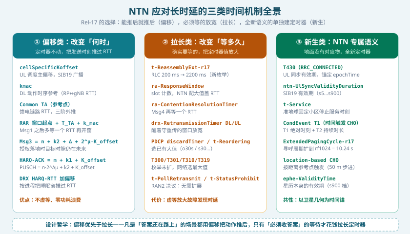
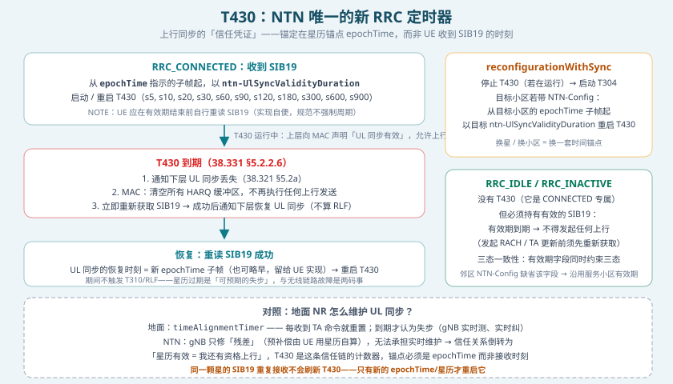
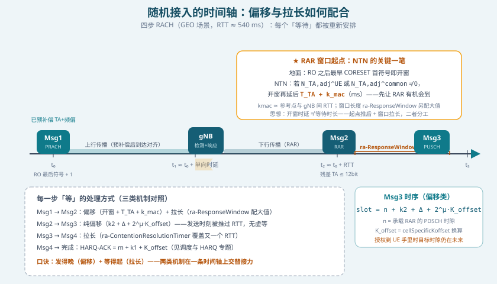
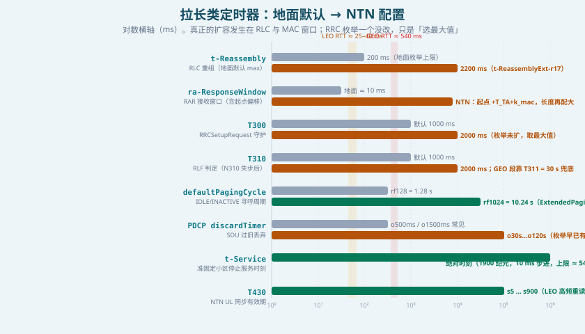

## 本篇要解决什么

前五篇专题里，定时器像背景噪音一样反复出现：[SIB19](ntn-sib19.html) 里冒出 T430 和有效期，[随机接入](ntn-rach.html)里窗口被推后又被拉长，[多普勒与时频补偿](ntn-doppler.html)里 TA 在外推，[调度与 HARQ](ntn-harq.html) 里 K_offset 重塑一切时序。本篇把它们全部收进一张总表，回答一个问题：**NTN 到底改了协议栈里的哪些时间参数，怎么改的，为什么这样改**。

对照：**TS 38.331 §5.2.2.4/5.2.2.6**（T430 动作）、**§5.3.5.5**（reconfigurationWithSync 与 T430）、**TS 38.321 §5.1/5.2a/5.7**（RA 窗口起点、UL 同步维护、DRX）、**TS 38.322 §7.3**（RLC 定时器）、**TS 38.323**（PDCP 定时器）、**TS 38.300 §16.14**（Common TA / K_offset / kmac 官方定义）、**RAN2#112e–116e 决议**（哪些定时器扩展、哪些明确不扩展）。
相关：[5G NTN 综合专题](5g-ntn.html)、[NTN UE 能力](ntn-ue-capability.html)（`uplink-TA-Reporting` 的运行时入口）、[NTN 再生载荷](ntn-regenerative-payload.html)（gNB 上星如何整体砍掉这套补偿）。

---

## 一、先看全景：三类时间机制



*图 1：Rel-17 应对长时延的三类机制——能推后就推后（偏移），必须等的放宽（拉长），全新语义单独建定时器（新生）*

一条 GEO 链路往返 540 ms，LEO 也要 25–40 ms。协议栈里所有隐含「几毫秒内会有回应」的假设全部作废。Rel-17 的应对不是无脑把所有定时器乘上一个系数，而是**按语义分流成三类**：

| 类别 | 回答的问题 | 代表参数 | 为什么优先这类 |
| --- | --- | --- | --- |
| **① 偏移类** | 何时发送？ | K_offset、kmac、Common TA、RAR 窗口起点偏移 | 答案还在路上就把动作推后，零虚等、零功耗浪费 |
| **② 拉长类** | 等多久？ | ra-ResponseWindow、t-Reassembly、T310 配置值 | 必须收到回应的等待，只能把定时器值放大 |
| **③ 新生类** | NTN 独有语义 | T430、t-Service、CondEvent T1、ExtendedPagingCycle | 地面没有对应物：星历会过期、小区会离开、卫星按时刻切换 |

这个分流本身就是最重要的认知框架。**混淆①和②是最常见的概念错误**：K_offset 改变的是「发送时刻」（时序关系），拉长类改变的是「容忍时长」（定时器值）——前者是物理上的因果安排，后者是工程上的耐心预算。NTN 两者都要，但能用①解决的不用②，因为②的每一毫秒都是实打实的等待时延。

---

## 二、定时关系的三块地基：Common TA、K_offset、kmac

先纠正一个广泛流传的误解：Rel-17 **没有**引入「定时器缩放因子」这种东西——网络不广播一个乘数去拉伸 UE 的定时器。真正被系统化引入的是三个**偏移量**，38.300 §16.14 给出的官方定义：

| 参数 | 官方定义（38.300） | 数值范围 | 来源 |
| --- | --- | --- | --- |
| **Common TA** | 参考点（RP）与 NTN 载荷之间的 **RTT** | 0..270.7 ms，三阶外推 | SIB19 `ntn-Config`（`ta-Common` + 漂移） |
| **K_offset** | ≈ **服务链路 RTT + Common TA** 之和 | 1..1023 slot（15 kHz 参考，≈ 1 s 上限） | SIB19 `cellSpecificKoffset`，可用 UE 专属值替换 |
| **kmac** | ≈ **参考点与 gNB 之间的 RTT** | 1..512 | SIB19 `kmac`，DL 定时参考 |

三个偏移的几何分解：**服务链路（UE↔卫星）由 UE 自己算**（GNSS 位置 + 星历），**馈电链路（卫星↔参考点/网关）由 Common TA 承担**，**参考点到 gNB 的剩余距离用 kmac 补**。K_offset 则是这一切在调度域的「打包总和」——它必须大于小区内最差 UE 的 RTT，保证任何「收到授权→发送」的时序都落在未来。

数值上限再次呼应轨道几何：1023 slot ≈ 1 s 的 K_offset 上限，正是为 GEO 的 541 ms RTT 留出的余量。

---

## 三、上行时序公式全表（偏移类主战场）

K_offset 挂进了**每一条**上行时序关系（38.213/38.214，RAN1#98 决议）：

| 时序关系 | 地面公式 | NTN 公式 |
| --- | --- | --- |
| PUSCH 调度 | `n·2^Δμ + k2` | `n·2^Δμ + k2 + K_offset` |
| HARQ-ACK 反馈 | `m + k1` | `m + k1 + K_offset` |
| RAR 上行授权的 Msg3 | `n + k2 + Δ` | `n + k2 + Δ + 2^μ·K_offset` |
| 周期性 CSI 参考资源 | `n − n_ref` | `n − n_CSI_ref − K_offset` |
| 周期性 SRS | 类似 | 同样计入 K_offset |

三个读表要点：

1. **CSI 参考资源是「减」K_offset**——它是「测量应该对应哪个下行时刻」，往回退才对；其余是「我何时发」，往前推。方向反了是排障高频错误（详见第八节坑 3）。
2. **K_offset 叠加而不替换** k1/k2 等常规间隔——网络依然可以用小 k2 调度近端 UE，K_offset 只负责把「物理不可达」变成「可达」。
3. **UE 专属 K_offset**（Rel-18，基于 `ta-Report` 的 TA 上报）可以把小区级广播值替换为按 UE 几何定制的值——LEO 场景下这能显著收窄调度保守度。

---

## 四、T430：NTN 唯一的新 RRC 定时器



*图 2：T430 的启动、到期与恢复——注意它锚定 epochTime 而非接收时刻*

Rel-17 在 38.331 里为 NTN 新增的 RRC 定时器只有一个：**T430**。它的值不是独立配置的，直接取 SIB19 的 `ntn-UlSyncValidityDuration`（枚举 s5…s900）。规范行为（38.331 §5.2.2.4 / §5.2.2.6 原文）：

1. **收到 SIB19**（RRC_CONNECTED）→ 从 `epochTime` 指示的子帧起，以 `ntn-UlSyncValidityDuration` 启动/重启 T430
2. **T430 运行中** → RRC 向 MAC 声明 UL 同步有效（38.321 §5.2a），允许上行发送
3. **T430 到期** → 通知下层 UL 同步丢失；MAC **清空所有 HARQ 缓冲区、停止一切上行发送**；随后重新获取 SIB19，成功后恢复
4. **reconfigurationWithSync** → 停止 T430、启动 T304；目标小区带 NTN-Config 则从目标小区的 epochTime 起重启

四个容易忽视的设计细节：

- **锚点是 epochTime，不是 UE 收到 SIB19 的时刻**。同一份星历重复接收不会刷新 T430——只有新的 epochTime/星历/TA 才会。有效期是从「星历的出生时刻」起算的绝对时长。
- **T430 到期不是 RLF**。它不触发 T310/T311 流程，只是「暂时失去上行资格」，重读 SIB19 即恢复。设备实现里最常见的 bug 是把它当成链路故障处理。
- **它取代了地面的 `timeAlignmentTimer` 语义**。地面靠 gNB 实时测 TA、发命令重置定时器；NTN 里 gNB 只修残差，维护信任的责任倒转为「星历有效 = 我有资格上行」。
- **三态一致性**：RRC_IDLE/INACTIVE 没有 T430（它专属 CONNECTED），但有效期字段同样约束它们——有效期过了，发起任何上行（包括 RACH）前必须先重新获取 SIB19。

---

## 五、IDLE/INACTIVE 的时间：寻呼与重选

空闲态的定时器适配常被忽略，但恰恰是省电的主战场：

| 机制 | 地面 | NTN | 说明 |
| --- | --- | --- | --- |
| `defaultPagingCycle` | rf32–rf256（0.32–2.56 s） | **ExtendedPagingCycle-r17：rf256/rf512/rf1024 = 最长 10.24 s** | Rel-17 新枚举，专为 NTN 稀疏寻呼设计 |
| eDRX（Rel-18） | — | `ExtendedPagingCycleConfig-r18`：hf2…hf1024 + PTW | 寻呼周期拉到**小时级**（hf1024 ≈ 2.9 h），面向 discontinuous coverage |
| 小区重选 | 信号质量驱动 | **t-Service + referenceLocation/distanceThresh** | 信号好≠待得久：按「卫星何时停止服务」「离参考点多远」重选 |
| SI 有效性 | valueTag 变化通知 | **valueTag 豁免**：星历/TA 变化不改 valueTag、不发 SI 变更通知 | 唯一时间闸门就是有效期（详见 [SIB19 专题](ntn-sib19.html)） |

`ExtendedPagingCycle` 的十秒级寻呼周期是纯粹的「拉长类」：卫星覆盖下寻呼本来就稀疏，长周期换来的是空口广播资源与 UE 唤醒次数双降。Rel-18 的 eDRX 更进一步——对每天只过顶几次的 LEO 波束，小时级的寻呼周期才配得上「断续覆盖」的商业模式。

---

## 六、MAC 层：RACH 窗口的「起点 + 长度」二分法



*图 3：GEO 场景四步 RACH 时间轴——偏移（开窗推迟）与拉长（窗口变宽）在一条轴上接力*

MAC 层是长时延咬得最深的地方，因为它掌管 RACH 和 HARQ 这两个紧环路。Rel-17 的处理手法值得精读——**ra-ResponseWindow 被拆成两半分别处理**：

**起点（偏移类）**：若 `N_TA,adj^UE` 或 `N_TA,adj^common` ≠ 0（NTN 场景必然如此），RAR 窗口的启动在地面规则（RO 最后符号后至少 1 符号、Type1-PDCCH CSS 的最早 CORESET 首符号）基础上**再延后 T_TA + k_mac 毫秒**。物理意义：RAR 不可能比完整 RTT 更早回来，那就在 RAR 物理可达之后才开窗——UE 不必在「窗口开着但什么都不会来」的时段空耗 PDCCH 监听。

**长度（拉长类）**：窗口长度仍由 `ra-ResponseWindow` 提供（slot 计数），NTN 网络直接配置大值。同理 `ra-ContentionResolutionTimer` 覆盖 Msg4 的又一个 RTT，`msra-ResponseWindow` 服务两步 RACH。

**DRX 家族**（38.321 §5.7）：`drx-HARQ-RTT-TimerDL/UL` 决定「发完反馈后可以睡多久」——NTN 中按 HARQ 进程将定时器长度**扩展一个 RTT 偏移**（RAN2#116bis 决议：per-process、timer length extended by offset）。两个关键联动：

- **反馈被禁用的进程不启动 drx-HARQ-RTT-Timer**——重传永远不会来，醒来监听纯属浪费电池（TR 38.821 §7.2.1.2 问题陈述 → Rel-17 落地）
- `drx-LastTransmissionUL` 控制上行场景 RTT 定时器的启动符号位置，适配 UL HARQ 模式 A/B 的多传输场景

**SR 与 BSR**：调度请求发出后 grant 需要一个 RTT 才能返回，`sr-ProhibitTimer` 与 BSR 周期同样按 RTT 放大配置——机制不变，取值放宽。

---

## 七、RLC/PDCP：真正被「扩容」的定时器



*图 4：对数轴上地面默认值与 NTN 配置的对比——注意哪些是真扩容、哪些只是选大值*

整张全表里**唯一新增枚举**的层是 RLC（RAN2#112e–116e 决议逐条落地）：

| RAN2 决议 | 结论 |
| --- | --- |
| `t-Reassembly` | **需要扩展** → 新增 `t-ReassemblyExt-r17`：{ms210, ms220, ms340, ms350, ms550, ms1100, ms1650, ms2200}，叠在原有 0–200 ms 之上 |
| `t-PollRetransmit` | **明确不扩展**（轮询由发送端驱动，不受 RTT 强迫） |
| `t-StatusProhibit` | **明确不扩展**（状态报告节奏可控） |
| RLC SN 长度 | **不扩展**（12/18 bit 够用；窗口按 18-bit AM = 131072 已覆盖 GEO 需求） |

为什么 t-Reassembly 是例外？它是「收端宣布 PDU 丢失」的判官——启动于检测到序号空洞，到期即宣告丢失并触发重传/状态报告。HARQ 开着的时候它必须**容忍 HARQ 的一整个往返+重传链**，GEO 上这意味着秒级；配 200 ms 的地面值会导致 RLC 在 HARQ 尚未完成时就发 NACK，重传风暴白白吞掉稀缺的卫星空口资源。

PDCP 层一个枚举都没加——`discardTimer` 早就备好了 o30s…o120s 的大值（OAI 的 GEO 实验报告里明确记录：不改大 discardTimer 就会在传输途中过早丢 SDU），`t-Reordering` 同样选大即可。**这不是巧合而是设计分工**：RLC 的判官定时器与 HARQ 时延强耦合（NTN 被迫扩），PDCP 的大值早已存在（NTN 白捡）。

---

## 八、RRC 层：枚举没改的真相，与值怎么选

广为流传的说法是「NTN 扩展了 T300/T301/T310 的取值范围」——**查 ASN.1 原文，Rel-17 的 `UE-TimersAndConstants` 一个枚举都没动**：

```text
UE-TimersAndConstants ::= SEQUENCE {
  t300 ENUMERATED {ms100, ms200, ms300, ms400, ms600, ms1000, ms1500, ms2000},
  t301 ENUMERATED {ms100, ms200, ms300, ms400, ms600, ms1000, ms1500, ms2000},
  t310 ENUMERATED {ms0, ms50, ms100, ms200, ms500, ms1000, ms2000},
  n310 ENUMERATED {n1, n2, n3, n4, n6, n8, n10, n20},
  t311 ENUMERATED {ms1000, ms3000, ms5000, ms10000, ms15000, ms20000, ms30000},
  n311 ENUMERATED {n1, n2, n3, n4, n5, n6, n8, n10},
  t319 ENUMERATED {ms100, ms200, ms300, ms400, ms600, ms1000, ms1500, ms2000},
  ...
}
```

那么 NTN 怎么活？三个手段组合：

1. **选最大值**：T300/T301/T319 = ms2000。粗算 GEO：RRCSetupRequest 上行 1×单向 + gNB 处理 + RRCSetup 下行 1×单向 ≈ 540 ms + 处理时延，2000 ms 勉强够一次完整往返；LEO 绰绰有余。
2. **靠偏移机制消除虚等**：T310 的失步判定发生在 PHY（预补偿后的残差域），DRX/HARQ 的时序已被 K_offset 推正——RRC 消息的收发时刻本身不再错位，定时器只需容忍真实的传播时长。
3. **T311 = 30 s 兜底**：重建流程含小区搜索 + 新接入（又一个 RACH），GEO 全流程可达十几秒，30 s 上限覆盖最差情况。

**RLF 判定的 NTN 细节**：T310 在 NTN 里依旧从 N310 次失步指示后启动，但 RLM 测量参考要先用星历/Doppler 预补偿对齐（见[多普勒专题](ntn-doppler.html)）——频偏没补干净会让 L1 报假失步，T310 配多长都救不了。

**移动性的新时间语义**（Rel-18）：CHO 引入了两个地面没有的触发维度——**CondEvent T1**（时间触发：绝对时刻 T1 + 持续时长 T2）和**位置触发**（UE 与参考点距离，50 m 步进）。卫星轨道分钟级可预知，网络可以把切换条件配置在「卫星几何还好的最后一刻」，T304 的守护也被拉长配置。这是「新生类」在移动性上的落点，详见后续移动性专题。

---

## 九、全表汇总

| 层 | 参数/定时器 | 地面 | NTN（Rel-17/18） | 机制类别 |
| --- | --- | --- | --- | --- |
| PHY/调度 | Common TA | — | RP↔载荷 RTT，三阶外推 | 偏移 |
| PHY/调度 | K_offset | — | ≈ 服务链路 RTT + Common TA（1..1023 slot） | 偏移 |
| PHY/调度 | kmac | — | ≈ RP↔gNB RTT（1..512） | 偏移 |
| MAC | RAR 窗口起点 | RO 后即开 | 再延后 T_TA + k_mac | 偏移 |
| MAC | ra-ResponseWindow | 数 ms | slot 计数配大值 | 拉长 |
| MAC | ra-ContentionResolutionTimer | 数 ms | 覆盖 Msg4 RTT | 拉长 |
| MAC | drx-HARQ-RTT-Timer DL/UL | 0..56 符号 | 按进程加 RTT 偏移；禁反馈进程不启动 | 偏移+新生 |
| MAC | timeAlignmentTimer | TA 命令重置 | 被 T430 机制取代 | 新生 |
| RRC | T430 | — | = ntn-UlSyncValidityDuration（s5…s900） | 新生 |
| RRC | T300/T301/T319 | 默认 1000 ms | ms2000（枚举未扩） | 拉长 |
| RRC | T310/N310/N311 | 默认 1000 ms/n10/n1 | ms2000 + 大 N310 小心配 | 拉长 |
| RRC | T311 | 默认 10000 ms | ms30000 兜底重建 | 拉长 |
| RRC | T304（CHO 含时间/位置触发） | 默认 1000 ms | 拉长 + CondEvent T1 / 位置触发 | 拉长+新生 |
| RRC | ExtendedPagingCycle | rf32–rf256 | rf1024 = 10.24 s（r17）；eDRX 小时级（r18） | 新生 |
| RLC | t-Reassembly | 0–200 ms | **t-ReassemblyExt-r17 至 2200 ms** | 拉长（唯一真扩容） |
| RLC | t-PollRetransmit / t-StatusProhibit | — | 不扩展（RAN2 决议） | 不动 |
| PDCP | discardTimer / t-Reordering | 常用小值 | 选既有大值（o30s…o120s / s30…） | 拉长（选大） |

### 排障八坑

1. **混淆偏移与拉长**：接入失败时先问「RAR 到底没来，还是窗口开早了？」——起点偏移没配（T_TA + k_mac 缺失）与窗口太短是两种故障。
2. **T430 当 RLF 处理**：星历过期触发的是重读 SIB19，不是重建——看日志别把 T430 到期后的静默误读成无线链路恶化。
3. **CSI 参考资源 K_offset 方向反了**：它是减号；配错方向 CSI 时序整体漂移，测量结果与真实信道错位。
4. **K_offset 漏乘 SCS**：`cellSpecificKoffset` 以 15 kHz slot 计，30 kHz SCS 的载波要乘 2——本表与 HARQ 专题共同的高频坑。
5. **t-Reassembly 配地面值**：RLC 在 HARQ 完成前狂发 NACK，重传风暴吃满空口——GEO 场景必配 t-ReassemblyExt-r17。
6. **禁反馈进程还在跑 DRX RTT 定时器**：UE 周期性醒来监听永远不会来的重传——电池杀手，检查 downlinkHARQ-FeedbackDisabled 与 DRX 配置的一致性。
7. **T300 沿用地面默认 1000 ms**：GEO 一次 RRC 往返 ≈ 540 ms + 处理，网络拥塞一次重发就超时——NTN 小区应配 ms2000。
8. **寻呼周期没拉长**：NTN 业务稀疏，rf1024 的 ExtendedPagingCycle 不用白不用；漏配则 UE 频繁醒来、卫星广播资源浪费。

### 记忆点

- **偏移解决「何时」，拉长解决「等多久」，新生解决「NTN 独有的时间语义」**
- **全表唯一的真扩容在 RLC：t-ReassemblyExt-r17（200 ms → 2200 ms）**
- **T430 是 NTN 唯一新 RRC 定时器：值 = SIB19 有效期，锚 = epochTime，到期 ≠ RLF**
- **RRC 枚举一个没改——靠选最大值 + 偏移机制消除虚等 + T311 兜底**
- **RAR 窗口 = 起点 + T_TA + k_mac（偏移）× 长度配大（拉长）——一扇门的两半**

### 自测题

1. 为什么 Rel-17 优先用 K_offset 偏移而不是把所有定时器拉长？（提示：虚等时延与故障发现时延的代价）
2. T430 的计时起点为什么必须是 epochTime 指示的子帧，而不是 UE 收到 SIB19 的时刻？
3. RAN2 决议不扩展 t-PollRetransmit 和 t-StatusProhibit，却必须扩展 t-Reassembly——三者的「时间主人」分别是谁？
4. GEO 场景下 T300 = ms2000 是否总有富余？哪个环节可能吃掉预算？（提示：RACH 重试次数 × RTT）
5. UE 支持 RACH-less 的时间触发 CHO（CondEvent T1）相比测量事件触发，在 LEO 换星时有什么优势？T1/T2 分别约束什么？
6. 为什么禁用 HARQ 反馈的进程不应启动 drx-HARQ-RTT-Timer？这个联动由哪条 TR 38.821 问题陈述引出？
7. `ExtendedPagingCycle-r17` 与 Rel-18 eDRX 的 hf/PTW 各面向什么场景？为何 IoT-NTN 比 NR-NTN 更需要它？

---

## 延伸阅读

- 站内：[5G NTN 综合专题](5g-ntn.html)（补偿体系总览）、[NTN SIB19](ntn-sib19.html)（有效期三件套与 valueTag 豁免）、[NTN 随机接入](ntn-rach.html)（窗口与 Msg3 时序的接入视角）、[NTN 调度与 HARQ](ntn-harq.html)（K_offset 对 k0/k1/k2 的重塑）、[NTN 多普勒与时频补偿](ntn-doppler.html)（TA 四分量与外推）、[NTN UE 能力](ntn-ue-capability.html)
- 3GPP：TS 38.331 §5.2.2.4（SIB19 接收动作）/§5.2.2.6（T430 到期）；TS 38.321 §5.1（RA 过程与窗口起点）、§5.2a（UL 同步维护）、§5.7（DRX）；TS 38.322 §7.3；TS 38.300 §16.14；RAN2#112e–116e NTN email 决议（RLC/PDCP/DRX 定时器扩展清单）；TR 38.821 §7.2（各层定时器问题陈述与候选方案）
