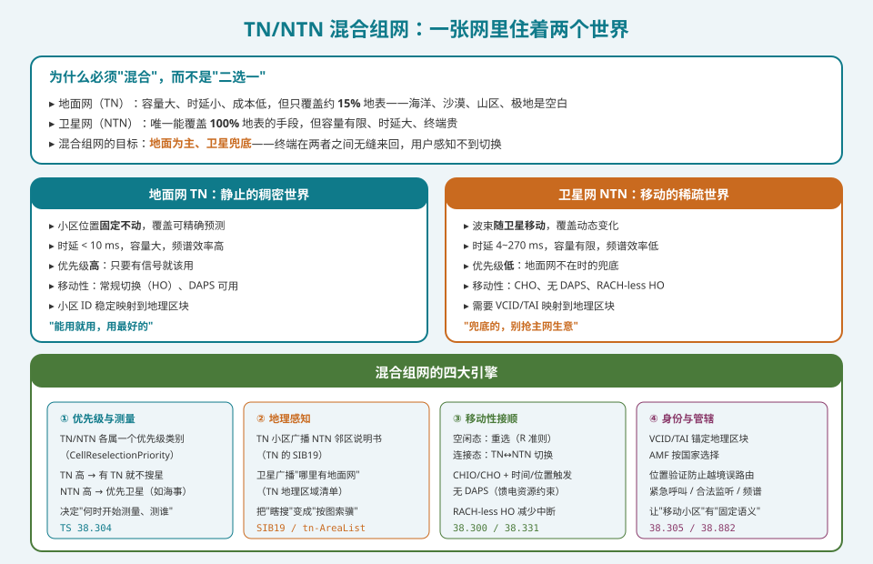
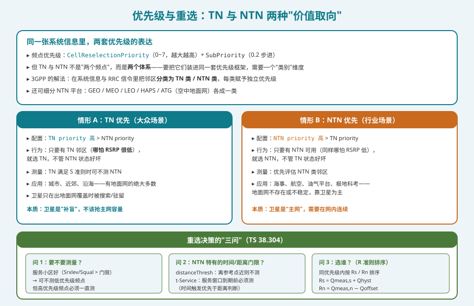
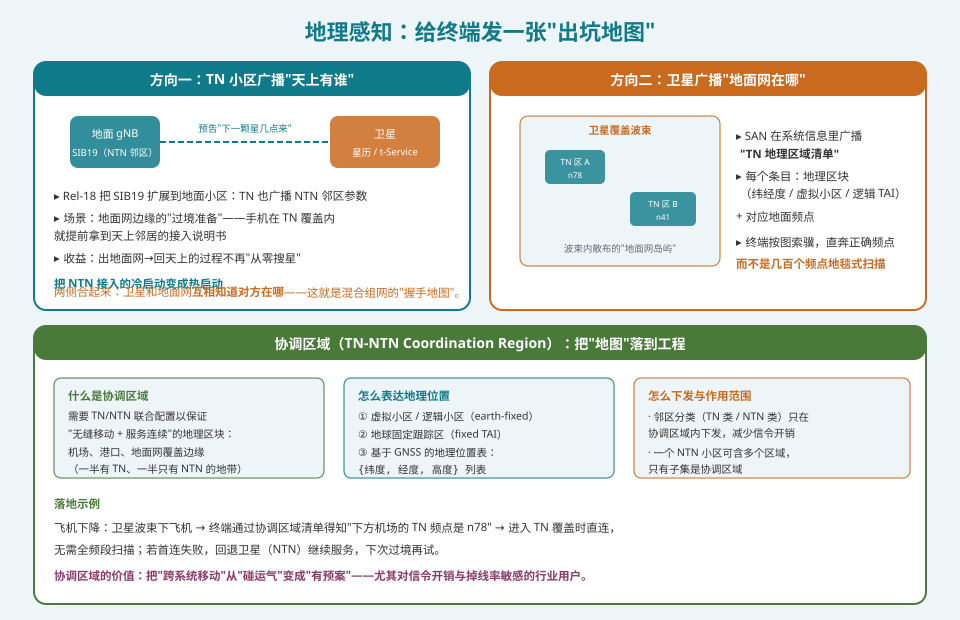
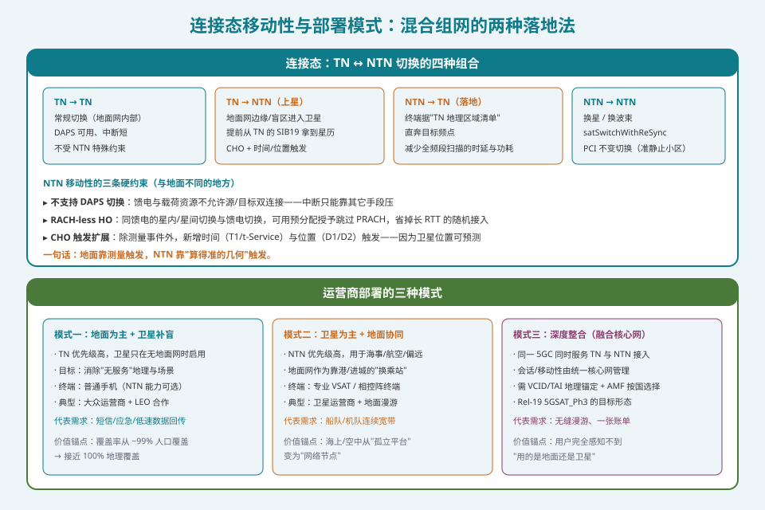

## 本篇要解决什么

前十八篇讲的几乎都是"卫星网自己怎么运作"。但现实中没有人会为卫星单独建一张网——**卫星是插进既有 5G 网络的一块拼图**。这片拼图要装得进去，需要解决一个根本矛盾：地面网（TN）和卫星网（NTN）是**两个性格完全不同的世界**，它们必须在同一台终端上无缝共处。

先说结论：**混合组网的全部难点，可以归纳成一件事——让终端在两个"价值取向相反"的体系之间，做出既符合用户利益、又符合运营商意图、还符合监管要求的驻留与切换决策。**地面网要的是"效率"（能用就用最好的），卫星网要的是"兜底"（没地面时顶上），监管要的是"管辖"（你到底在哪、该连哪个国家的网）。

对照：**TS 38.304**（空闲态/非激活态 UE 过程，小区选择与重选的最高依据）、**TS 38.300 §16.14**（NR 与 NG-RAN 总体，NTN 架构与移动性）、**TS 38.331**（SIB19、重选配置、切换命令）、**TS 38.305 / TR 38.882**（位置验证与 AMF 管辖）、**TR 38.863**（Rel-18 增强研究）。

相关：[Rel-18 增强全集](ntn-rel18-enhancements.html)（TN 的 SIB19 与反向地图首次引入）、[NTN 移动性与卫星切换](ntn-mobility.html)（NTN 内部移动性）、[Rel-19 NTN 与未来](ntn-rel19-future.html)（5GSAT_Ph3 与融合核心网）、[NTN 射频频段与共存](ntn-rf-bands-coexistence.html)（TN/NTN 共用的频段资产）。

---

## 一、为什么要"混合"，而不是"二选一"

这问题看似简单，答案却决定了整个协议设计的走向。先摆事实：

| 维度 | 地面网 TN | 卫星网 NTN |
|---|---|---|
| **覆盖** | 约 **15%** 地表 / 约 99% 人口 | 唯一能覆盖 **100%** 地表的手段 |
| **容量** | 大（每 km² 数十 Gbps 量级） | 有限（每波束几十 Mbps 量级） |
| **时延** | < 10 ms | 4 ms（LEO 再生）~ 270 ms（GEO 透明） |
| **小区** | 位置固定，覆盖可精确预测 | 波束随卫星移动，覆盖动态变化 |
| **终端成本** | 手机 | 手机（低轨）/ 相控阵终端（宽带） |
| **频谱效率** | 高 | 低（长距离、大路径损、多普勒） |

**结论一目了然：两者不是竞争关系，是互补关系。** 地面网负责"人口密集区的高效服务"，卫星网负责"地面网到不了的地方"。混合组网的目标形态可以一句话概括：

> **地面为主、卫星兜底——终端在两者之间无缝来回，用户感知不到切换。**

但"无缝"两个字背后是海量的协议设计。第十二篇（[测量与 CSI](ntn-measurement-csi.html)）讲过一个前提：NTN 里 RSRP 会因为"近远效应"而失真，测量本身就需要重新设计。混合组网把这个问题放大了——**终端要同时理解两套测量语义、两套触发逻辑、两套优先级。**

---

## 二、优先级：把两个世界装进同一套框架

3GPP 的小区重选本来就有一套成熟的"绝对优先级"框架：每个频点有一个 `CellReselectionPriority`（0~7，越大越优先），还可以用 `CellReselectionSubPriority`（0.2 步进）做细分。

但 TN 与 NTN 不是简单的"两个频点"——它们是**两个体系**。把它们硬塞进频点优先级会产生歧义：同一个频点上可能既有地面小区又有卫星小区。3GPP 的解法是引入一个**"类别"维度**：

- 系统信息和 RRC 信令里，邻区被**分类为 TN 类 / NTN 类**（或按平台再细分 GEO / MEO / LEO / HAPS / ATG）；
- 每一类有独立的优先级，终端据此决定"什么时候开始测量、优先测谁、优先选谁"。

### 2.1 两种价值取向

| | 情形 A：TN 优先 | 情形 B：NTN 优先 |
|---|---|---|
| **配置** | TN priority > NTN priority | NTN priority > TN priority |
| **行为** | 只要有 TN 邻区（**哪怕 RSRP 很低**）就选 TN，不管 NTN 状态 | 只要有 NTN 可用（同样哪怕 RSRP 低）就选 NTN，不管 TN 状态 |
| **测量** | TN 满足 S 准则时可不测 NTN | 优先评估 NTN 类邻区 |
| **应用** | 城市、近郊、沿海（绝大多数用户） | 海事、航空、油气平台、极地科考 |
| **本质** | 卫星是"补盲"，不该抢主网容量 | 卫星是"主网"，需要在网内连续 |

注意这里的"**哪怕 RSRP 很低**"——这不是 bug，是 feature。它体现了网络运营者的意图：**保护既有投资**（大众运营商不希望用户跑到卫星上去消耗昂贵的卫星容量）或**保障服务连续**（卫星运营商希望用户稳定待在自家里，不要被地面网的弱信号拐走）。

还可以配置"**TN 与 NTN 等优先**"，此时用更严格的 RSRP/门限规则来决定——留给终端一定的自主裁量。

### 2.2 重选决策的"三问"

TS 38.304 的重选逻辑，在混合场景下可以理解成三个问题：

**问 1：要不要测量？**

- 服务小区质量好（`Srxlev > SIntraSearchP` 且 `Squal > SIntraSearchQ`）→ 可**不测**同频或低优先级频点；
- 但**高优先级**频点必须一直测——因为高优先级的定义就是"只要能用就优先切过去"。

**问 2：NTN 特有的时间/距离门限？**

这是 NTN 给重选逻辑加的两个新维度（Rel-17 引入、Rel-18/19 持续优化）：

- **`distanceThresh`**（SIB19 广播）：如果 UE 到服务小区参考点的距离小于门限，可以**不测量**同频/低优先级邻区——因为卫星波束还远没离开；
- **`t-Service`**（服务窗口截止时刻）：只要服务小区的 t-Service 存在，UE 必须**在 t-Service 之前**执行测量，**无论距离多远、质量多好**。这是硬约束——卫星要走了，你必须提前准备。

> **时间触发优先于距离判断。** 距离门限是"省电优化"，t-Service 是"服务保障"——当两者冲突，t-Service 赢。

**问 3：选谁？**

同优先级内按 R 准则排序：

\[ R_s = Q_{meas,s} + Q_{hyst} - Q_{offsettemp} \]
\[ R_n = Q_{meas,n} - Q_{offset} - Q_{offsettemp} \]

服务小区 Rs 与邻区 Rn 比较，Rn 持续高于 Rs 一段时间（`Treselection`）才触发重选。这在 TN/NTN 之间同样适用，只是 `Q_{offset}` 里可能额外带上"TN 与 NTN 类别间的偏移"。

---

## 三、地理感知：给终端发一张"出坑地图"

优先级解决"该选谁"，但还有一个前置问题：**终端怎么知道哪里有另一个网？** 这一节是混合组网最"工程"的部分，也是 Rel-18 的主要增量。

### 3.1 方向一：TN 小区广播"天上有谁"（TN 的 SIB19）

Rel-17 里 SIB19 只出现在 NTN 侧（卫星广播自己的星历）。Rel-18 把它**扩展到地面小区**：地面 gNB 可以在 SIB19 里广播 NTN 邻区参数（星历、t-Service 等）。

价值场景：**NTN → TN → NTN 的过境**。手机在地面网覆盖内（比如沿海基站）就能提前拿到天上邻居的"接入说明书"——出地面网、回天上时，不必从零开始搜星、读 SI、算补偿。**把 NTN 接入的冷启动变成热启动。**

### 3.2 方向二：卫星广播"地面网在哪"（TN 地理区域清单）

更关键的是反方向。手机在卫星覆盖下（海上、荒漠），Rel-17 想回地面网只能**全频段瞎搜**——几百个频点上地毯式扫描，耗电、耗时、体验差。

Rel-18 让 SAN 在系统信息里**广播一份带地理信息的 TN 区域清单**：哪些地理区域有地面覆盖、对应什么频点。这相当于卫星给终端发了一张"**出坑地图**"——飞机下降、船靠岸、车出山区时，终端按图索骥直奔正确的地面频点。

### 3.3 协调区域（TN-NTN Coordination Region）

把这张"地图"落到工程，需要一个明确的载体：**协调区域**——需要 TN/NTN 联合配置、以保证"无缝移动 + 服务连续"的地理区块。典型例子：

- **机场**（飞机降落时的天地转换点）；
- **港口**（船靠岸时的转换点）；
- **地面网覆盖边缘**（一半有 TN、一半只有 NTN 的地带）。

地理位置怎么表达？协议给了几种方式：

| 表达方式 | 说明 |
|---|---|
| **虚拟小区 / 逻辑小区** | earth-fixed 的虚拟标识，与物理波束解耦 |
| **地球固定跟踪区（fixed TAI）** | 让核心网把"移动小区"当作"固定小区"处理 |
| **GNSS 地理位置表** | `{纬度, 经度, 高度}` 列表，最直观 |

邻区分类（TN 类 / NTN 类）**只在协调区域内下发**——因为不需要在全国范围广播"隔壁是天还是地"，只在真正需要跨域切换的地方才下发，大幅节省信令开销。一个 NTN 小区可以包含多个区域，其中只有子集是协调区域。

> **落地示例**：飞机下降 → 卫星波束下的终端通过协调区域清单得知"下方机场的 TN 频点是 n78" → 进入 TN 覆盖时直连，无需全频段扫描；若首连失败，回退卫星继续服务，下次过境再试。**把"跨系统移动"从"碰运气"变成"有预案"。**

---

## 四、连接态移动性：四种组合与三条硬约束

空闲态靠重选，连接态靠切换。混合组网把切换组合从"一种"扩成"四种"：

| 组合 | 说明 | 关键机制 |
|---|---|---|
| **TN → TN** | 地面网内部切换 | 常规 HO，DAPS 可用，中断短 |
| **TN → NTN** | 上星（地面网边缘/盲区） | 提前从 TN 的 SIB19 拿到星历，CHO + 时间/位置触发 |
| **NTN → TN** | 落地 | 终端据"TN 地理区域清单"直奔目标频点 |
| **NTN → NTN** | 换星 / 换波束 | `satSwitchWithReSync`、PCI 不变切换（准静止小区） |

### 4.1 NTN 移动性的三条硬约束

第五篇（[移动性与卫星切换](ntn-mobility.html)）已经详细讲过 NTN 内部移动性，这里只强调与地面不同的地方：

1. **不支持 DAPS 切换**。DAPS（双活动协议栈）要求终端在切换期间与源、目标**同时**保持连接。NTN 里这条做不到——卫星载荷与馈电资源不允许双连接。**代价是中断时间变长**，只能用 CHO 提前规划、RACH-less HO 缩短接入来补偿。
   > 注：这是 NTN 相对 TN 的一个"能力缺口"，工程上要正视——地面网用户习以为常的"零中断切换"，在卫星场景是奢侈品。

2. **RACH-less HO**。同馈电的星内/星间切换与馈电切换，可以**跳过 PRACH 随机接入**，用预分配的授予直接发上行——省掉长 RTT 下最耗时的一环。（随机接入篇算过：卫星 RTT 让一次 RACH 可能耗时几百 ms。）

3. **CHO 触发扩展**。除测量事件外，新增**时间（T1/t-Service）与位置（D1/D2）触发**。因为卫星位置是**可预测的**——用星历算出"何时该换"，比等测量结果更早、更准。
   > 一句话对比：**地面靠测量触发，NTN 靠"算得准的几何"触发。**

### 4.2 ANR 的特殊性

自动邻区关系（ANR）在混合组网里要处理一个新问题：**邻区是 TN 还是 NTN？** 终端上报的 PCI 若来自卫星，其对应的"小区"可能在移动。因此 ANR 需要借助 VCID/TAI 的地理锚定，才能把一个"移动的小区"正确地映射到邻区关系表里。

---

## 五、身份与管辖：让"移动小区"有"固定语义"

这一节是混合组网最容易被忽略、却最能体现"卫星通信本质上是国际治理问题"的部分。

### 5.1 VCID / TAI 地理锚定

地面网的 CGI（小区全球标识）天然映射到固定地理位置——基站就在那里。但 NTN 的"移动小区"（earth-moving beam）会让**同一个小区 ID 随波束飘过多个国家**。这会直接击穿核心网的策略与路由假设。

解法是引入**虚拟小区标识（VCID）** 或**锚定到地理区块的 TAI**：让 AMF 能像处理固定 TN 小区那样，处理"移动的卫星小区"。运营商用星历与波束规划配置映射关系，使 gNB 上报的 ULI/TAI 与 UE 实际所在的**地理区块**一致。

> 没有地理锚定，同一个小区 ID 会在波束移动中跨越国界，破坏策略与紧急呼叫路由。

### 5.2 AMF 按国家选择

跨波束国家边界带来管辖（jurisdiction）问题：**该连哪个国家的核心网？** 5GC 需要保证在注册时（或注册后立即）选对 AMF，以满足合法监听与业务限制的地域要求。地面网可以"从静态站址地理"推断，NTN 不能——因为波束可能横跨或快速穿越国界。

### 5.3 位置验证

Rel-18 的逻辑是：**UE 报告位置 + 网络侧验证**。

- 连接态建立 AS 安全后，UE 可应请求上报**粗粒度位置**；
- 核心网可触发基于 LMF 的验证（NTN 定制方法，如**多 RTT** + 星历/TA/漂移辅助），给出 **5~10 km 一致性检查**，而非 GNSS 级精度（见 [Rel-18 增强全集](ntn-rel18-enhancements.html)）；
- 若 GNSS 上报位置与网络评估在几 km ~ 10 km 内一致，则认为位置已**验证**。

**为什么要验证？** 因为 GNSS 可能被欺骗或不可用，而监管路由（紧急呼叫、合法服务限制）依赖可信的国家/区域信息。**传统 TN 从不担心这个问题——静态小区天然可信；NTN 必须验证粗位置，因为波束可能快速穿越国界。**

---

## 六、三种运营商部署模式

回到商业视角，混合组网怎么落地？业界大致形成三种模式：

| 模式 | 优先级取向 | 终端 | 典型玩家 | 价值锚点 |
|---|---|---|---|---|
| **一：地面为主 + 卫星补盲** | TN 高 | 普通手机（NTN 可选） | 大众运营商 + LEO 合作 | 覆盖率从 ~99% 人口覆盖 → 接近 100% 地理覆盖 |
| **二：卫星为主 + 地面协同** | NTN 高 | 专业 VSAT / 相控阵终端 | 卫星运营商 + 地面漫游 | 海上/空中从"孤立平台"变"网络节点" |
| **三：深度整合（融合核心网）** | 视业务配置 | 通用终端 | 5GSAT_Ph3 目标形态 | 用户完全感知不到"用的是地面还是卫星" |

**模式三**是 Rel-19 5GSAT_Ph3 的方向（见 [Rel-19 NTN 与未来](ntn-rel19-future.html)）：**同一个 5GC 同时服务 TN 与 NTN 接入**，会话与移动性由统一核心网管理，需要 VCID/TAI 地理锚定 + AMF 按国选择的完整支撑。这是终极形态——"天地一体"在核心网层面真正合二为一。

---

## 七、往前看：Rel-19 的时/距重选优化

TS 38.304 Rel-19 版本（2026-02）对 NTN 小区重选做了进一步优化：

- **基于时间/距离的重选优化**——让"什么时候开始测量"的判断更贴合卫星可预测的几何；
- **参考位置更新**处理移动卫星小区（服务小区参考点本身在动）；
- **ATG（空中地面网）专用参数**——飞机对地通信作为 NTN 家族的新成员纳入重选框架；
- 与 **LP-WUS**（低功耗唤醒信号）的测量卸载协同——进一步降低混合场景下的终端功耗。

这些优化方向说明一件事：**混合组网的演进主线，是让"跨越两个世界"的决策越来越自动化、越来越省电、越来越不需要人工干预。**

---

## 排障清单：混合组网视角的嫌疑

1. **终端死活不落地面网**：NTN 优先级配得过高，或协调区域/`distanceThresh` 让终端"以为还没离开卫星"——检查优先级配置与 SIB19 参数。
2. **落地时全频段扫描耗电**：卫星未广播"TN 地理区域清单"，或列表里的频点信息有误——查 SAN 的系统信息是否包含该区域清单。
3. **上星时从零搜星很慢**：地面小区未广播含 NTN 邻区的 SIB19——检查 TN 侧 SIB19 是否启用。
4. **切换中断时间异常长**：尝试了 DAPS 或没走 RACH-less HO——确认 NTN 场景下是否按约束配置了 CHO 与预分配授予。
5. **跨域移动时掉话**：CHO 的时间/位置触发参数（T1/D1/D2）与星历/波束规划不匹配——SAT 移动是可预测的，检查触发阈值的几何依据。
6. **漫游/紧急呼叫路由到错误国家**：VCID/TAI 地理锚定缺失或配置错误，导致移动小区跨过国界时身份未更新——检查 AMF 按国选择与位置验证链。
7. **ANR 邻区表混乱**：卫星 PCI 被当作固定邻区处理——需要 VCID/TAI 映射把移动小区映射到地理区块。
8. **协调区域内服务乒乓**：TN 与 NTN 优先级接近但门限不一致——重选参数在两侧未统一或协调区域边界配置重叠。

---

## 自测八题

1. 为什么 TN 与 NTN 必须"混合组网"而不是"二选一"？两者的核心取舍各是什么？
2. 3GPP 如何把 TN 与 NTN 两个"体系"装进同一套优先级框架？"类别"维度解决什么问题？
3. 情形 A（TN 优先）下，为什么"哪怕 RSRP 很低也选 TN"是 feature 而不是 bug？
4. 重选决策的"三问"是什么？`distanceThresh` 与 `t-Service` 冲突时谁赢，为什么？
5. TN 的 SIB19 与卫星广播的"TN 地理区域清单"分别解决什么方向的问题？合起来效果是什么？
6. 什么是协调区域？为什么邻区分类只在协调区域内下发？
7. NTN 移动性的三条硬约束是什么？为什么 NTN 不支持 DAPS 切换？
8. VCID/TAI 地理锚定与 AMF 按国选择解决了什么监管问题？位置验证的精度要求为什么是 5~10 km 而非 GNSS 级？

参考答案

1. 两者是互补而非竞争：地面网容量大、时延小、成本低但只覆盖约 15% 地表；卫星网是唯一能覆盖 100% 地表的手段但容量有限、时延大、终端贵。混合组网目标形态是"地面为主、卫星兜底，终端无缝来回"。
2. 复用既有绝对优先级框架（`CellReselectionPriority` + `SubPriority`），但引入"类别"维度：邻区被分类为 TN 类 / NTN 类（或按平台细分 GEO/MEO/LEO/HAPS/ATG），每类独立优先级。解决的是"同一频点上既有地面小区又有卫星小区"的歧义——类别让优先级不再只看频点。
3. 因为它体现网络运营者意图：保护既有投资（大众运营商不希望用户消耗昂贵卫星容量）、保障服务连续（卫星运营商希望用户稳定待在自家网内）。所以"低 RSRP 也优先"是刻意配置的策略选择。
4. 问 1 要不要测量（服务小区质量好+低优先级可不测，高优先级必测）；问 2 是否触及 NTN 特有的时间/距离门限；问 3 选谁（R 准则排序）。`t-Service` 赢——它是服务保障的硬约束（卫星要走了必须提前准备），`distanceThresh` 只是省电优化。
5. TN 的 SIB19 让地面小区广播 NTN 邻区参数（上星热启动）；卫星广播 TN 地理区域清单让终端知道地面网在哪（落地按图索骥）。合起来是"双向握手地图"——卫星和地面互相知道对方在哪，把跨系统移动从碰运气变成有预案。
6. 需要 TN/NTN 联合配置以保证无缝移动与服务连续的地理区块（机场、港口、地面网覆盖边缘）。邻区分类只在协调区域内下发，因为不需要在全国广播"隔壁是天还是地"，只在真正需要跨域切换处下发——大幅节省信令开销。
7. ① 不支持 DAPS 切换（载荷与馈电资源不允许源/目标双连接，中断只能靠 CHO 提前规划 + RACH-less HO 补偿）；② RACH-less HO（同馈电信道跳过 PRACH，用预分配授予）；③ CHO 触发扩展（新增时间 T1/t-Service 与位置 D1/D2 触发，因卫星位置可预测）。地面靠测量触发，NTN 靠几何触发。
8. 卫星"移动小区"会让同一小区 ID 随波束飘过多个国家，击穿核心网路由与策略假设；VCID/TAI 地理锚定让移动小区拥有固定地理语义，AMF 按国选择保证注册时选对管辖核心网，满足合法监听与业务地域限制。位置验证要 5~10 km 是因为 GNSS 可能被欺骗/不可用、而监管只需可信的国/区级粗粒度判断，不需要 GNSS 级精度——用多 RTT + 星历辅助即可达成。

