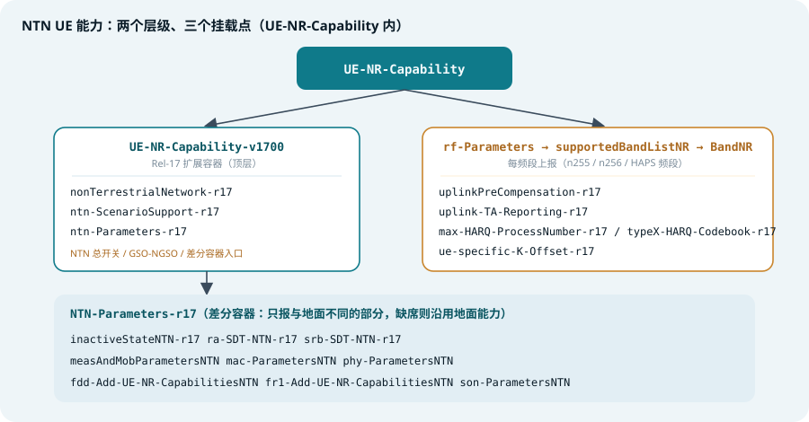
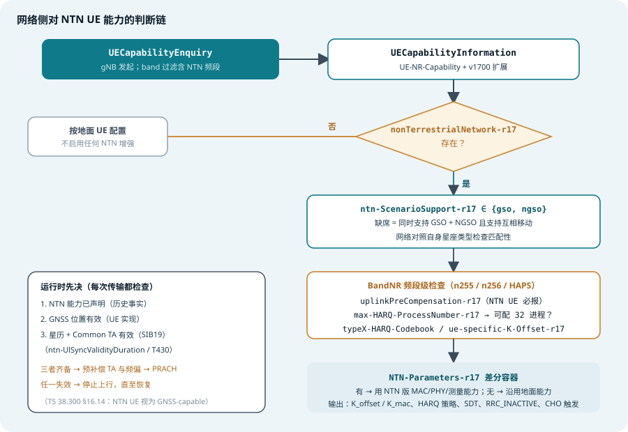
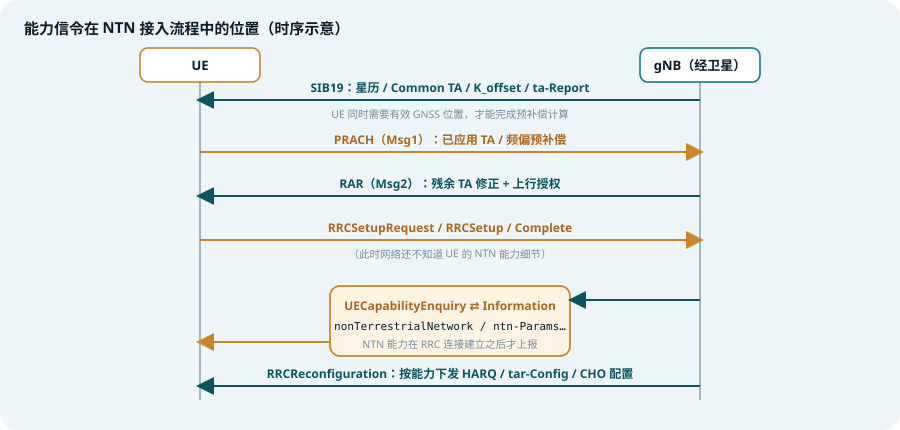

## 本篇要解决什么

[NTN 综合专题](5g-ntn.html)讲的是网络如何补偿大时延与大频偏，[再生载荷专题](ntn-regenerative-payload.html)讲的是 gNB 放在哪里。本篇回到终端：**一部声称「能上卫星」的 UE，必须向网络声明什么？网络拿到声明后，又按什么逻辑判断？**

NR 的 UE 能力机制（`UECapabilityEnquiry` / `UECapabilityInformation`，RRC 协议在 **TS 38.331**，每个字段的语义在 **TS 38.306**，特性分组与组件拆解在 **TR 38.822**）为 NTN 增加了一整套专属字段。它们回答的是三个问题：

- **能不能**：UE 是否支持 NTN 接入（总开关 + GSO/NGSO 场景）
- **强不强**：上行预补偿、32 个 HARQ 进程、TA 上报、UE 专用 K_offset 这些「重活」能不能干（每频段字段）
- **差在哪**：同一部 UE 在 NTN 下的 MAC / PHY / 测量能力与地面是否不同（差分容器）

> **一条主线**：NTN UE 能力 = **一个总开关 + 一组每频段开关 + 一个差分容器**。判断过程就是网络沿这条链从粗到细核对的过程。

对照：**TS 38.331**（RRC ASN.1 与信令流程）、**TS 38.306**（能力参数语义）、**TR 38.822**（Rel-17 特性清单 Table 6.1.4-1）、**TS 38.300 §16.14**（GNSS 假设与总体行为）。
相关：[5G NTN 综合专题](5g-ntn.html)、[NTN 再生载荷](ntn-regenerative-payload.html)、[随机接入](random-access.html)、[DCI 与 UCI](dci-uci.html)、[3GPP 规范地图](3gpp-spec-map.html)。

---

## 一、为什么 NTN 需要专属能力字段

地面 NR 的能力字段（带宽、MIMO 层数、CA 组合）描述的是「射频与处理规格」。NTN 在此之外引入了一类全新的能力——**算法与过程能力**：

- **预补偿是终端实现能力**：基于 GNSS 位置 + 星历实时计算 TA 与多普勒，计算量和射频规格一样是「有的 UE 有、有的没有」
- **HARQ 增强有 UE 侧代价**：32 个 HARQ 进程意味着两倍的软缓冲，反馈禁用后的码本行为也要终端配合
- **GSO 与 NGSO 是两种世界**：时延特性、移动性模型完全不同，UE 可以只支持其一
- **同一部 UE 双面能力**：地面上 4 层 MIMO、卫星下只做 1 层，完全合理——这就需要差分上报

设计上还必须**向后兼容**：Rel-15/16 的老 UE 根本没有 v1700 扩展容器，网络读到「没有这些字段」就当不支持处理，一句话都不用多说。

---

## 二、能力全景：两个层级、三个挂载点



*图 1：NTN 能力字段在 UE-NR-Capability 内的挂载位置——顶层容器放「总开关」，BandNR 里放「每频段开关」，NTN-Parameters-r17 放差分能力*

从 `UE-NR-Capability`（TS 38.331）的 Rel-17 扩展容器看（节选）：

```asn.1
UE-NR-Capability-v1700 ::= SEQUENCE {
    ...
    mbs-Parameters-r17                 MBS-Parameters-r17,
    nonTerrestrialNetwork-r17          ENUMERATED {supported} OPTIONAL,
    ntn-ScenarioSupport-r17            ENUMERATED {gso, ngso} OPTIONAL,
    ...
    ntn-Parameters-r17                 NTN-Parameters-r17 OPTIONAL,
    nonCriticalExtension               SEQUENCE {} OPTIONAL
}
```

三个挂载点，三种粒度：

| 挂载点 | 粒度 | 承载内容 |
| --- | --- | --- |
| `UE-NR-Capability-v1700` | UE 级 | NTN 总开关、GSO/NGSO 场景、差分容器入口 |
| `BandNR`（rf-Parameters → supportedBandListNR） | 每频段 | 预补偿、TA 上报、HARQ 进程数、码本增强、UE 专用 K_offset |
| `NTN-Parameters-r17` | UE 级（差分） | NTN 下与地面不同的 MAC / PHY / 测量 / 移动性能力 |

> **适用范围约束**（TR 38.822 反复强调）：BandNR 里的 NTN 字段**只对 NTN 频段有意义**——即 TS 38.101-5 Table 5.2.2-1 定义的卫星频段（n255、n256 等）与 TS 38.104 Clause 5.2 的 HAPS 频段。在地面频段的 BandNR 里看到这些字段没有意义。

---

## 三、Rel-17 核心字段逐个解析

### 1. 三个顶层字段

| 字段 | 取值 | 语义 | 强制条件 |
| --- | --- | --- | --- |
| `nonTerrestrialNetwork-r17` | supported | NTN 总开关：支持 NTN 接入、接收 NTN 专用 SIB（SIB19）、适配长 RTT 的 MAC/RLC/PDCP 定时器、大传播时延下的 RACH、单小区多 TAC 广播 | — |
| `ntn-ScenarioSupport-r17` | gso / ngso | 只支持静止轨道或非静止轨道场景 | **缺席但总开关在** = 同时支持 GSO 与 NGSO，且支持两者之间的移动性 |
| `ntn-Parameters-r17` | 容器 | NTN 差分能力入口（见第四节） | — |

注意 `ntn-ScenarioSupport-r17` 的**缺席语义是「都支持」**——这是个容易看反的字段：看到没有这个字段，不能得出「不支持 NGSO」的结论，恰恰相反。

### 2. BandNR 里的频段级字段

| 字段 | 语义 | 备注 |
| --- | --- | --- |
| `uplinkPreCompensation-r17` | 上行时/频预补偿与定时关系增强（详见下） | **NTN UE 必报**：声明支持 NTN 就必须声明它 |
| `uplink-TA-Reporting-r17` | 支持上报 TA 预补偿相关信息（TA Report） | 前置：需支持预补偿 |
| `max-HARQ-ProcessNumber-r17` | 最大 HARQ 进程数（16 → 32） | 网络配 `nrofHARQ-ProcessesForPDSCH = n32` 的前提 |
| `type1/type2/type3-HARQ-Codebook-r17` | 存在反馈禁用 HARQ 进程时的码本增强 | 对应 HARQ 反馈禁用（`downlinkHARQ-FeedbackDisabled`）配置 |
| `ue-specific-K-Offset-r17` | 支持经 MAC CE 接收 UE 专用 K_offset | 前置：预补偿 + TA 上报 |

> 字段名与挂载位置依据 TR 38.822 Table 6.1.4-1（Rel-17 特性清单）与 TS 38.331 ASN.1；个别字段在不同小版本间的容器归属可能微调，工程解码时以所用基线版本的 38.331 ASN.1 为准。

### 3. `uplinkPreCompensation-r17` 到底覆盖什么

这是 NTN 最核心的 UE 能力，按 TR 38.822 特性组 26-1，它包含九个功能组件：

1. 基于 GNSS 位置 + 服务卫星星历，计算 UE 专用 TA
2. 基于网络参数计算 Common TA（未提供时按 0 处理）
3. 连接态 TA 更新采用「开环（自算）+ 闭环（TA 命令）」组合控制
4. 把算出的 TA 实际应用于上行发射（预补偿）
5. 估计 UE–gNB RTT，并据此推迟 RAR 窗口起点
6. 频率预补偿，抵消服务链路多普勒
7. 用 `cellSpecificKoffset` 确定 PUSCH / PUCCH / PDCCH 触发 PRACH / CSI 参考资源 / 非周期 SRS / TA 命令生效 / CG Type-2 首传的时序
8. 用 `K_mac` 确定 MAC CE 下行配置的生效时刻，以及波束失败恢复中恢复搜索空间的 PDCCH 监视时刻
9. 从系统信息接收小区级 `K_offset` / `K_mac`

一句话：**从「收到什么」到「什么时候发」的整条 NTN 时序链，都压在这一个字段上**——所以它对 NTN UE 是强制的。

### 4. HARQ 相关字段与配置的联动

对照[ NTN 综合专题](5g-ntn.html)的 HARQ 一节：

- 网络想配 **32 进程**（LEO 的「多开几路并行」策略）→ 先看 `max-HARQ-ProcessNumber-r17`
- 网络想配**下行 HARQ 反馈禁用**（GEO 的「不等」策略）→ 反馈禁用比特图本身是网络配置，但**存在禁用进程时的码本行为**依赖 `typeX-HARQ-Codebook-r17` 能力
- 还有配套的 **K1（PDSCH→HARQ-ACK）取值范围扩展**等 L1 特性，让反馈定时的天花板从几十个时隙抬高到能容纳卫星 RTT

---

## 四、NTN-Parameters-r17：差分容器的设计思想

Rel-17 没有把 NTN 能力拆散塞进各现有结构，而是定义了一个**整体复用地面能力结构的差分容器**：

```asn.1
NTN-Parameters-r17 ::= SEQUENCE {
    inactiveStateNTN-r17               ENUMERATED {supported} OPTIONAL,
    ra-SDT-NTN-r17                     ENUMERATED {supported} OPTIONAL,
    srb-SDT-NTN-r17                    ENUMERATED {supported} OPTIONAL,
    measAndMobParametersNTN-r17        MeasAndMobParameters OPTIONAL,
    mac-ParametersNTN-r17              MAC-Parameters OPTIONAL,
    phy-ParametersNTN-r17              Phy-Parameters OPTIONAL,
    fdd-Add-UE-NR-CapabilitiesNTN-r17  UE-NR-CapabilityAddXDD-Mode OPTIONAL,
    fr1-Add-UE-NR-CapabilitiesNTN-r17  UE-NR-CapabilityAddFRX-Mode OPTIONAL,
    ue-BasedPerfMeas-ParametersNTN-r17 UE-BasedPerfMeas-Parameters-r16 OPTIONAL,
    son-ParametersNTN-r17              SON-Parameters-r16 OPTIONAL
}
```

**规则：容器内某字段缺席 → 沿用对应的地面能力字段。**

| 字段 | 语义 | 条件 |
| --- | --- | --- |
| `inactiveStateNTN-r17` | NTN 下支持 RRC_INACTIVE | **声明 NTN 即强制** |
| `ra-SDT-NTN-r17` | RRC_INACTIVE 下经随机接入发起小数据传输（4-step；支持 2-step RACH 则含 2-step） | 需 NTN 总开关 |
| `srb-SDT-NTN-r17` | 经 SRB2 做 MO/MT 小数据传输 | 需至少一种 NTN SDT 能力 |
| `measAndMobParametersNTN` 等 | NTN 下专属的测量移动性 / MAC / PHY / FDD / FR1 附加能力 | 差分逻辑 |

为什么用差分而不是全量复制？因为 NTN UE 大多同时是地面 UE：**大部分能力两边一致，只报差异**，信令开销从「再抄一份」降到「只抄改过的行」。这与 MAC-Parameters / Phy-Parameters 复用同一 IE 类型的设计一致——规范不关心你在哪个接入下用，只关心你说的是不是同一套语义。

---

## 五、Rel-18 / 19 增量字段

| 版本 | 字段 | 语义 |
| --- | --- | --- |
| Rel-18 | `sib19-Support-r18` | 在**地面小区**的连接态接收 SIB19——TN/NTN 混合组网、准备切向卫星时的关键能力 |
| Rel-18 | `hardSatelliteSwitchResyncNTN-r18` | 硬卫星切换 + 重同步 |
| Rel-18 | `softSatelliteSwitchResyncNTN-r18` | 软卫星切换（**同时要求支持硬切换**——软切网络里只会硬切的 UE 也能活） |
| Rel-18 | `ntn-CHO-OnlyLocationTimeTrigger-r18` | NTN 条件切换仅用位置/时间触发（condEvent D1/T1 类） |
| Rel-18 | `ntn-NeighbourCellInfoSupport-r18` | 在 MeasObjectNR 中接收**专用邻区星历** |
| Rel-18 | `mt-SDT-NTN-r18` | 响应寻呼的 MT-SDT |
| Rel-18 | `ntn-VSAT-AntennaType-r18` / `ntn-VSAT-MobilityType-r18` | VSAT 终端的天线指向 / 移动性类别（FR2-NTN，>14.5 GHz） |
| Rel-19 | `ntn-Redirection-r19` | 从 NR 地面频率重定向到 NR NTN 频率 |
| Rel-19 | `ntn-RedirectionWithSatelliteInfo-r19` | 在 RRCRelease 中携带卫星辅助信息做 NTN 频率间重定向 |
| Rel-19 | `ntn-VSAT-AntennaTypeKuBand-r19` / `ntn-VSAT-MobilityTypeKuBand-r19` | Ku 频段（10.7–14.5 GHz）VSAT |
| Rel-19 | `ntn-ERedCap-FR1-r19` | eRedCap UE 的 FR1-NTN 支持 |

另有共享频谱场景下的 NTN 组合字段（`cqi-4-BitsSubbandNTN-SharedSpectrumChAccess-r17`、`dynamicSlotRepetitionMulticastNTN-SharedSpectrumChAccess-r17`、`ta-BasedPDC-NTN-SharedSpectrumChAccess-r17`），依赖对应的共享频谱接入能力，此处不展开。

一条清晰的演进脉络：**Rel-17 证明「UE 能上卫星」，Rel-18 补「UE 能换卫星」，Rel-19 打通「UE 能被引去卫星」。**

---

## 六、判断过程：从驻留到配置的完整链路



*图 2：网络侧判断链——总开关 → 场景匹配 → 频段级字段 → 差分容器 → 配置决策；右侧为运行时每次传输都要复核的三个先决条件*

### 1. UE 侧：信令之前的三项自评估

UE 在上报之前（实际上在产品定义时）要自查：

- **频段支持**：射频链路覆盖 n255 / n256（38.101-5）或 HAPS 频段
- **GNSS + 星历解算能力**：预补偿的计算基础。注意 GNSS 能力**本身没有单独的能力字段**——TS 38.300 §16.14 直接把 Rel-17 NTN UE 定义为 GNSS-capable，预补偿能力隐含了它
- **算法实现**：TA/多普勒计算精度、更新频率、HARQ 32 进程的缓冲

### 2. 信令过程与过滤



*图 3：UE 先用 SIB19 完成预补偿并接入，NTN 能力在 RRC 连接建立后才通过能力查询上报*

gNB 发 `UECapabilityEnquiry` 时可带频段过滤（`capabilityRequestFilter`），**只有请求的频段列表包含 NTN 频段时，UE 才会带出 BandNR 里的 NTN 字段**——这是抓包时「找不到 NTN 字段」的常见原因之一：先看询问里有没有要 n255/n256。

### 3. 网络侧判断决策表

| 判断条件 | 结论 | 网络动作 |
| --- | --- | --- |
| `nonTerrestrialNetwork-r17` 缺席 | 不支持 NTN | 按地面 UE 配置；NTN 增强全部不启用 |
| 总开关在，`uplinkPreCompensation-r17` 缺席 | 非法组合（规范要求必报） | 兼容处理：按最保守时序配置 |
| `ntn-ScenarioSupport-r17 = ngso`，网络是 GEO | 场景不匹配 | 不把该 UE 接入 / 不配置 GSO 特性 |
| `max-HARQ-ProcessNumber-r17` 支持 32 | 可配 32 进程 | LEO 星座下配置以掩盖 RTT |
| `typeX-HARQ-Codebook-r17` 支持 | 可配反馈禁用 | GEO 星座下按比特图禁用部分进程反馈 |
| `NTN-Parameters-r17` 各字段缺席 | 沿用地面能力 | 用地面版 MAC/PHY/测量参数 |
| `inactiveStateNTN-r17` 在（强制） | 可配 RRC_INACTIVE | 含 NTN 的 RNA / SDT 配置 |

### 4. 运行时先决：能力之外的三个门

能力声明是一次性的历史事实；**每一次上行传输**之前，UE 还要过三道运行时的门：

1. NTN 能力已声明（信令层）
2. **GNSS 位置有效**（UE 实现；丢失即停发）
3. **星历 + Common TA 有效**（SIB19，受 `ntn-UlSyncValidityDuration` / T430 约束）

三者齐备才做 TA / 频偏预补偿并发 PRACH；任一失效，UE 停止上行直至恢复（TS 38.300 §16.14）。这也是[ NTN 综合专题](5g-ntn.html)中「GNSS 是事实前置条件」在能力维度的呼应：**能力是声明，GNSS 是每一次的现场检查。**

---

## 七、实践中的坑

- **能力没报 → 网络不启用特性**：UE 能力排查是 NTN 互通问题的第一现场。功能「实测能跑」但网络不配，九成是能力声明缺失或被过滤掉了
- **每个 NTN 频段独立判断**：BandNR 是每频段的，n255 报了 `uplinkPreCompensation-r17` 不代表 n256 也报了
- **缺席语义要看清**：`ntn-ScenarioSupport-r17` 缺席 = 双场景都支持；而 `ntn-Parameters-r17` 内字段缺席 = 沿用地面能力——两种「缺席」两种含义
- **软切与硬切的包含关系**：`softSatelliteSwitchResyncNTN-r18` 要求同时支持硬切，单看一个字段会误判
- **互操作基线**：老版本 gNB 可能根本不询问 NTN 频段，UE 再强也无用武之地；反之老 UE 在 NTN 小区里就是纯地面行为，只能享受不到增强

---

## 八、一句话总结与自测

> **NTN UE 能力没定义任何新协议栈，它只是把「终端算法能做到哪一步」变成了信令里可核对的一行行字段——网络照着字段逐级放行。**

1. NTN UE 能力的三个挂载点分别是什么？各自承载什么粒度的信息？
2. 为什么 `uplinkPreCompensation-r17` 对 NTN UE 是强制字段？它覆盖的九个组件中，哪几个与[ NTN 综合专题](5g-ntn.html)讲的定时体系（Common TA / K_offset / K_mac）直接对应？
3. `ntn-ScenarioSupport-r17` 缺席时网络应得出什么结论？这个缺席语义与 `NTN-Parameters-r17` 内字段的缺席语义有何不同？
4. 网络要为 LEO UE 配置 32 个 HARQ 进程、为 GEO UE 禁用部分进程的 HARQ 反馈，分别需要核对哪些能力字段？
5. 抓包发现 UE 上报里没有任何 NTN 字段，请给出至少两个可能原因。
6. 为什么 GNSS 能力没有对应的能力字段？它与能力声明在判断时序上有什么本质区别？

### 延伸阅读

以下规范的定位与关键章节，见本站 [3GPP 规范地图](3gpp-spec-map.html)：

- [TS 38.331](3gpp-spec-map.html#ts-38331)——UE-NR-Capability ASN.1、能力查询信令流程（字段的「形」），[官方页面](https://www.3gpp.org/dynareport/38331.htm)
- [TS 38.306](3gpp-spec-map.html#ts-38306)——各 NTN 能力参数的语义与强制条件（字段的「义」），[官方页面](https://www.3gpp.org/dynareport/38306.htm)
- [TR 38.822 Table 6.1.4-1](3gpp-spec-map.html#tr-38822)——NR_NTN_solutions 特性组、字段名与挂载位置对照表，[官方页面](https://www.3gpp.org/dynareport/38822.htm)
- [TS 38.300 §16.14](3gpp-spec-map.html#ts-38300)——GNSS 假设、GNSS/星历失效时的 UE 行为，[官方页面](https://www.3gpp.org/dynareport/38300.htm)
- [TS 38.101-5](3gpp-spec-map.html#ts-38101-5)——NTN 频段定义（Table 5.2.2-1），[官方页面](https://www.3gpp.org/dynareport/38101-5.htm)
