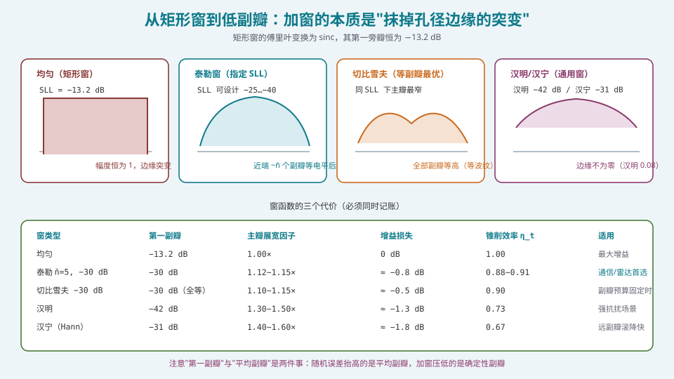
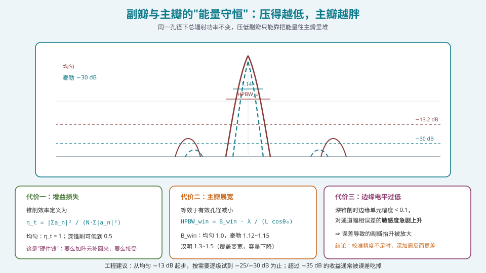
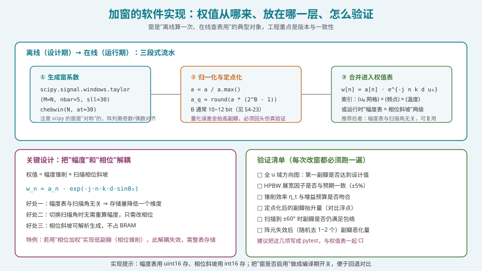

## 本篇要解决什么

均匀激励的方向图有一个"天赋缺陷"：第一副瓣恒为 −13.2 dB，而且**无论你怎么改 N、d、频率都不会变**（见 [阵列因子](pa-array-factor.html)）。

要突破这个天花板，唯一的手段是**改变幅度分布**——也就是"加权"或"加窗"。

本篇要讲透：

1. **为什么加窗有效**？——从"孔径边缘的突变"讲到傅里叶变换的高频分量。
2. **用哪个窗**？——泰勒、切比雪夫、汉明、汉宁的取舍，以及"第一副瓣"与"平均副瓣"的区别。
3. **代价是什么**？——三笔必须同时记账的成本。
4. **怎么实现**？——窗系数生成、定点化、两级加窗的坑、验证清单。

> **一句话定位**：这一篇是 S2 里**投入产出比最高**的一篇。因为你大概率的第一个实际工程问题就是"副瓣超标"，而它的解法就在这里。

---

## 一、为什么加窗有效：边缘突变 → 高频分量



*图 1：四种典型幅度分布。矩形的边缘是"一跳到底"，而所有低副瓣窗都在边缘做了平滑过渡。*

### 1.1 从傅里叶对偶看

[空间频率与空间傅里叶变换](pa-spatial-frequency-fft.html) 已经论证过：**阵列激励与远场方向图是一对空间傅里叶变换**。

\[
AF(u)=\int_{-L/2}^{L/2}a(x)\,e^{jkux}\,dx
\]

在这个视角下，"副瓣"= 方向图的高空间频率分量。而傅里叶变换的性质告诉我们：

> **函数在定义域边界处的突变，会在频域产生 \(1/f\) 量级的高频分量。**

均匀激励的 \(a(x)\) 在孔径边缘从 1 **跳到 0** —— 这是最剧烈的突变，所以副瓣最高（−13.2 dB）。

**加窗做的事，就是让 \(a(x)\) 在边缘平滑地趋近于零。** 边缘越平滑，高频分量越少，副瓣越低。

### 1.2 三条定性规律

| 规律 | 说明 |
| --- | --- |
| 边缘越低 ⇒ 近端副瓣越低 | 但**远端副瓣**要看函数的**光滑度**（连续几阶导数） |
| 越平滑 ⇒ 远端副瓣滚降越快 | 汉宁（二阶连续）的远副瓣滚降 −18 dB/oct；汉明只有 −6 dB/oct |
| 越平滑 ⇒ 主瓣越宽 | 因为有效孔径被"削"掉了 |

**关键洞察：近端副瓣与远端副瓣由不同的性质决定。** 这是选窗时最实用的一条判据：

- 如果你的问题是"第一副瓣超标"（干扰方就在主瓣旁边）⇒ 关心**边缘电平**，选泰勒或切比雪夫；
- 如果你的问题是"远副瓣超标"（合规包络）⇒ 关心**光滑度**，选汉宁或高斯类窗。

---

## 二、窗函数选型

### 2.1 泰勒窗（Taylor）

**设计目标**：指定一个副瓣电平 \(SLL\)，让**靠近主瓣的 \(\bar n\) 个副瓣恰好等电平**，之后的副瓣按 \(1/u\) 包络滚降。

\[
a(x)=1+2\sum_{m=1}^{\bar n-1}F(m,A,\bar n)\cos\!\left(\frac{2\pi m x}{L}\right),\qquad
SLL=-20\log_{10}\!\big(\cosh(\pi A)\big)
\]

| 参数 | 效果 |
| --- | --- |
| \(SLL\) | 近端副瓣电平（如 −25 / −30 / −35 / −40 dB） |
| \(\bar n\) | 等电平副瓣的个数；\(\bar n\) 越大，"等电平区"越宽，远端滚降越晚 |

**典型数据**：

| SLL | \(\bar n\) | 锥削效率 \(\eta_t\) | 主瓣展宽因子 \(B_{\text{win}}\) | 增益损失 |
| --- | --- | --- | --- | --- |
| −25 dB | 3 | ~0.94 | ~1.08~1.10 | ~0.35 dB |
| −30 dB | 5 | ~0.90 | ~1.12~1.15 | ~0.8 dB |
| −35 dB | 6 | ~0.87 | ~1.19 | ~1.1 dB |
| −40 dB | 6 | ~0.84 | ~1.24 | ~1.5 dB |

**为什么是工程首选**：**给定副瓣指标下，主瓣展宽最小**（除了切比雪夫），而且**远端滚降好**、**对误差鲁棒**。

### 2.2 切比雪夫窗（Dolph-Chebyshev）

**设计目标**：全部副瓣**等高**（等波纹），在给定第一副瓣电平下**主瓣最窄**。

\[
x_0=\cosh\!\left(\frac{1}{N-1}\cosh^{-1}\!\left(10^{SLL/20}\right)\right),\qquad
a_n \propto \text{IDFT}\left[\,T_{N-1}\!\big(x_0\cos(\psi/2)\big)\right]
\]

**优点**：理论最优（主瓣最窄）。
**缺点**：
1. **远端副瓣不滚降**（所有副瓣等高，包括很远的角度）——这对合规包络（通常是 \(1/u\) 型递减）**很不利**；
2. **边缘有跳变**（不是平滑趋零），对制造公差敏感；
3. **对随机误差的鲁棒性差于泰勒**——误差会把等高副瓣"打散"成更高的峰值副瓣。

**使用场景**：副瓣预算被接收机动态范围固定（"必须全部低于 −40 dB 否则被强信号淹没"）。

### 2.3 汉明 / 汉宁（Hamming / Hann）

\[
a_{\text{Hann}}(x)=0.5-0.5\cos\!\left(\frac{2\pi x}{L}\right), \qquad\text{边缘}=0
\]
\[
a_{\text{Hamm}}(x)=0.54-0.46\cos\!\left(\frac{2\pi x}{L}\right), \qquad\text{边缘}=0.08
\]

| 窗 | 第一副瓣 | 远端滚降 | 主瓣展宽 | \(\eta_t\) |
| --- | --- | --- | --- | --- |
| 汉宁 | −31 dB | −18 dB/oct（好） | ~1.4~1.6 | ~0.67 |
| 汉明 | −42 dB | −6 dB/oct（差） | ~1.3~1.5 | ~0.73 |

**汉明窗的边缘电平 0.08 而不为 0** —— 这不是"设计失误"，而是刻意的：非零边缘让远端副瓣滚降变慢（−6 vs −18 dB/oct），但换来了更低的第一副瓣（−42 vs −31 dB）。

**在阵列里怎么用**：经典 DSP 窗（Hamming/Hann/Blackman）本来是给频谱分析设计的，**直接搬到阵列里通常不是最优**（主瓣展宽过大、锥削效率过低）。**能用泰勒就用泰勒。**

### 2.4 一张选型决策表

| 你的主要矛盾 | 推荐 | 期望结果 |
| --- | --- | --- |
| "第一副瓣超标，增益要保住" | **泰勒 \(\bar n=5\)，SLL=−25~−30 dB** | 副瓣达标 + 展宽仅 1.15× |
| "远副瓣要满足 1/u 型合规包络" | **泰勒（大 \(\bar n\)）或汉宁** | 远端滚降快 |
| "接收机动态范围限定所有副瓣" | **切比雪夫** | 全等副瓣、主瓣最窄 |
| "要最大增益、副瓣不是硬指标" | **均匀（不加窗）** | 增益最大化 |
| "阵元数很少（N<8）" | **慎用深窗** | 小阵的窗效应不明显，反而损失增益 |

---

## 三、三笔代价（必须同时记账）



*图 2：压副瓣不是"免费的性能提升"，而是把能量重新分配。三笔代价缺一不可。*

### 3.1 代价一：增益损失

定义为**锥削效率**：

\[
\eta_t=\frac{\left|\sum_{n} a_n\right|^2}{N\sum_n |a_n|^2}
\]

- 均匀激励：\(a_n=1\Rightarrow\eta_t=\dfrac{N^2}{N\cdot N}=1\)；
- 任意非均匀激励：\(\eta_t<1\)（柯西-施瓦茨不等式）。

**它出现在增益预算里**：

\[
G_{\text{dBi}}=G_e+10\log_{10}N+10\log_{10}(\eta_t\cdot\eta_s\cdot\eta_f\cdot\eta_m)
\]

**代数量级**：泰勒 −30 dB ⇒ −0.8 dB；汉明 ⇒ −1.3 dB。**这不是小数目。** 在卫星链路里，1 dB 增益往往需要增加 25% 的阵元才能补回来。

### 3.2 代价二：主瓣展宽

\[
\mathrm{HPBW}=B_{\text{win}}\cdot\frac{0.886\lambda}{L\cos\theta_0}
\]

| 窗 | \(B_{\text{win}}\) |
| --- | --- |
| 均匀 | 1.00 |
| 泰勒 −25 dB | 1.08~1.10 |
| 泰勒 −30 dB | 1.12~1.15 |
| 切比雪夫 −30 dB | 1.10~1.15 |
| 汉明 | 1.30~1.50 |
| 汉宁 | 1.40~1.60 |

**工程后果**：
1. 波束覆盖变小 ⇒ 需要**更多波束**覆盖同一区域；
2. 若波束数是固定的（如卫星的固定多波束），**相邻波束的交叠电平会下降** ⇒ 切换出现缝隙；
3. 若规格要求"波束宽度 ≤ 3°"，加窗后可能变成 3.5°，**需要重新增大孔径**（阵元数 +18%）。

**很多人在设计初期忘了这一项**，等到仿真出来发现波束太宽，再回头加阵元——代价是重新布局、重新出图、延期。

### 3.3 代价三：边缘电平过低 ⇒ 误差敏感度上升

这是最隐蔽、也最容易被忽略的一项。

深锥削窗的边缘阵元幅度可能低到 0.05~0.1。此时：

- 该通道的**相对幅相误差**被放大（绝对误差不变，但相对占比变大）；
- 结果：**误差导致的副瓣抬升被放大**。

**定量参考**：设 \(N\) 元阵上的随机相位误差标准差 \(\sigma_\phi\)（弧度），则平均副瓣被抬到约

\[
SLL_{\text{avg}}\approx-10\log_{10}N+10\log_{10}(\sigma_g^2+\sigma_\phi^2)\ \text{dB}
\]

（\(\sigma_g\) 为幅度误差，以相对值计。）

而**深锥削会让有效 \(N\) 减小**——因为边缘单元的贡献被压得很低，它们对"相干增益"的贡献变小，但对"误差引入的随机副瓣"的贡献没有同步减小。

> **结论（很重要）**：**如果校准精度不足，深加窗反而更差。** 因为理想副瓣降了 17 dB（−13 → −30），但误差副瓣可能只降了 5 dB，结果实际副瓣由误差主导。
>
> **这条决策规则**：加窗之前先问自己"我的幅相校准精度是多少"。残余相位误差若 > 8~10°，把副瓣设计到 −30 dB 以下意义不大——见 [通道误差的来源与影响](pa-channel-error-impact.html)。

---

## 四、实现：窗系数从哪来



*图 3：三段式流水。工程重点在"把幅度与相位解耦"以及"每次改窗都跑一遍验证清单"。*

### 4.1 用 scipy 生成（以及三个陷阱）

```python
import numpy as np
from scipy.signal import windows

def make_taper(N, kind="taylor", sll_db=30.0, nbar=5):
    """生成幅度锥削系数（长度 N，已归一化到最大值 1）。"""
    if kind == "uniform":
        a = np.ones(N)
    elif kind == "taylor":
        # scipy 的 taylor 参数语义：nbar 是"近似等电平的副瓣数"，
        # sll 是副瓣比（正数 dB），必须满足 sll > 13.26
        a = windows.taylor(N, nbar=nbar, sll=sll_db, norm=True)
    elif kind == "chebwin":
        # at 是"副瓣比"，单位 dB（正数）
        a = windows.chebwin(N, at=sll_db)
    elif kind == "hamming":
        a = windows.hamming(N)
    elif kind == "hann":
        a = windows.hann(N)
    else:
        raise ValueError(kind)
    return a / a.max()

def taper_efficiency(a):
    """锥削效率 eta_t = |sum a|^2 / (N * sum |a|^2)。"""
    a = np.asarray(a)
    return np.abs(a.sum())**2 / (len(a) * np.sum(np.abs(a)**2))
```

```python
for kind, kw in [("uniform", {}), ("taylor", dict(sll_db=30)),
                 ("chebwin", dict(sll_db=30)), ("hamming", {}), ("hann", {})]:
    a = make_taper(32, kind, **kw)
    print(f"{kind:10s} eta_t={taper_efficiency(a):.3f}  "
          f"gain_loss={10*np.log10(taper_efficiency(a)):+.2f} dB  "
          f"edge={a[0]:.3f}")
```

**需要注意的三个陷阱**：

1. **`taylor` 与 `chebwin` 的 `sll` 语义不同**。scipy 的 `taylor` 用 `sll`（有的版本是 `sll`，有的是 `sll` 以 dB 表示副瓣比），`chebwin` 用 `at`。**必须查你本地 scipy 版本的文档**，参数名与含义在不同版本有变化。**写测试断言第一副瓣电平**，而不是相信参数名。
2. **窗是对称的**。scipy 生成的窗在 \(n=0\) 与 \(n=N-1\) 处等值。这对**偶数 N** 是自然的；对**奇数 N**，中心元素幅度最大。位置对齐必须确认（特别是当你在子阵级使用窗时）。
3. **归一化方式**。`norm=True`（taylor）会让窗归一化——但归一化的定义（和归一 vs 峰值归一）影响增益计算。**统一用峰值归一化（除以 max），然后在增益预算里用 \(\eta_t\) 记账**，这样最不容易出错。

### 4.2 幅度与相位解耦（推荐结构）

\[
w_n=\underbrace{a_n}_{\text{幅度表}}\cdot\underbrace{e^{-jnkd\sin\theta_0}}_{\text{相位斜坡（解析）}}
\]

**好处**：
1. 幅度表与扫描角无关 ⇒ **存储量降一个维度**；
2. 切换扫描角只需改相位（一个角度索引 → 一组相位增量）；
3. 相位斜坡可以用 CORDIC 或查表实时生成，不占 BRAM。

**反例**：如果使用**相位加权**（只改相位不改幅度）来实现低副瓣，这个解耦失效，必须整表存储。相位加权在**恒定模约束**（PA 全饱和工作，效率最高）的系统里是必要的，但要付出更高的实现复杂度。

### 4.3 定点化

幅度系数通常用 10~12 bit 表示。**量化本身会抬高副瓣**，必须验证：

```python
def quantize_taper(a, bits):
    """把幅度系数量化到 bits 位无符号整数，返回 (量化系数, 量化误差)。"""
    a = np.asarray(a) / np.max(a)
    q = np.round(a * (2**bits - 1)).astype(np.int64)
    aq = q / (2**bits - 1)
    return aq, np.abs(aq - a)

def sidelobe_from_weights(a, N_opts=(32,), d_over_l=0.5, oversample=32):
    """由幅度权值直接算方向图的第一副瓣（dB）。"""
    from scipy.signal import argrelmax
    results = {}
    for N in N_opts:
        w = np.zeros(oversample * N, dtype=complex)
        w[:N] = a[:N]
        AF = np.abs(np.fft.fftshift(np.fft.fft(w)))
        AF = AF / AF.max()
        idx = argrelmax(AF)[0]
        # 排除主瓣附近
        center = len(AF) // 2
        far = [i for i in idx if abs(i - center) > 3]
        results[N] = 20*np.log10(AF[far[0]]) if far else float('nan')
    return results
```

**经验起点**：幅度 10~12 bit、相位 6~8 bit（对应 64~256 态移相器或矢量调制器）。**权值位宽不足会先在最深的零陷处暴露**（见 [定点化：从浮点仿真到硬件指标不退化](pa-fixed-point-quantization.html)）。

### 4.4 【必踩的坑】两级加窗的重复锥削

在混合波束成形（HBF）里，**子阵级**和**阵元级**都可以加窗。若为了压副瓣**在两级都加泰勒窗**：

\[
a_{\text{total}}=a_{\text{sub}}\otimes a_{\text{elem}}
\]

总幅度分布是两者的（近似）乘积，等效于一个**极深的锥削**：

- \(\eta_t^{\text{total}}=\eta_t^{\text{sub}}\times\eta_t^{\text{elem}}\)（例如 \(0.88\times0.88=0.774\Rightarrow-1.1\ \text{dB}\) 白丢）；
- 边缘单元幅度低到 0.1 以下 ⇒ 误差敏感度暴涨；
- 主瓣展宽也是两级之和（约 1.3×），覆盖变小。

**正确做法**：**只在一个层级做幅度锥削**，另一级用等幅。若因重叠子阵等原因确实需要两级，则**把两级幅度的乘积作为统一的设计变量做一次性优化**。

---

## 五、验证清单（每次改窗都必须跑）

| 检查项 | 判据 | 工具 |
| --- | --- | --- |
| 第一副瓣是否达标 | 与设计 SLL 之差 ≤ 0.5 dB | 高分辨率方向图（零填充） |
| 远端副瓣是否满足包络 | 逐角度比对 \(1/u\) 型包络 | 全角度扫描（含栅瓣位置） |
| HPBW 展宽因子 | 与预期 \(\pm5\%\) | 精确方向图 |
| 锥削效率 \(\eta_t\) | 与增益预算一致 | 解析计算 |
| 定点化后的副瓣抬升 | 与浮点相比 ≤ 0.5 dB | 量化仿真 |
| **扫描到 ±60° 时副瓣** | 仍满足包络（大角处副瓣会变差） | 全角度扫描 |
| **阵元失效容忍度** | 随机去 1~2 个单元后副瓣抬升 ≤ 3 dB | 蒙特卡洛 |
| 边缘单元电平 | > 0.1（避免误差敏感） | 检查 \(a_n\) |

**建议把这几项写成 pytest**，与权值表一起进 CI。**加窗的参数一旦改动，整个系统的副瓣、增益、覆盖都会变**——没有自动化回归，很容易在"改一个小参数"时引入退化。

---

## 六、常见误区清单

**误区一：把"加窗"理解为"把边缘阵元功率调小"。**
物理上确实如此，但**理解错了因果**。正确的理解是：**加窗 = 空间低通滤波**，目的是去掉孔径边缘突变引入的高频分量（副瓣）。把它当成"功率管理"，你会搞不清为什么它会影响主瓣宽度。

**误区二：以为加窗可以无限压副瓣。**
三笔代价都是硬约束：增益跌、主瓣胖、误差敏感。而且**实际副瓣存在下限**，由通道幅相误差决定（典型 −30 ~ −35 dB 量级，取决于校准精度）。设计到 −45 dB 是没有意义的，除非校准精度极高。

**误区三：把"第一副瓣"当作唯一的副瓣指标。**
第一副瓣（近端）与远副瓣由不同性质决定：近端看**边缘电平**，远端看**光滑度**。合规包络（如 ITU-R S.580 的 \(1/u\) 型）主要约束**远端**。只优化第一副瓣可能仍违反包络。

**误区四：忘了加窗会加宽主瓣，导致覆盖/分辨率不达标。**
见 §3.2。设计初期就要把 \(B_{\text{win}}\) 计入孔径需求。

**误区五：在两级（子阵级 + 阵元级）重复加窗。**
见 §4.4。**这是 HBF 设计中最常见的实现错误**，白丢 1 dB 增益且恶化误差敏感度。

**误区六：忽略加窗对通道误差的放大效应。**
深锥削后，边缘通道的相对误差被放大。若校准精度不足（残余相位 > 8°），深窗的实际效果可能不如浅窗。**加窗与校准精度必须一起设计。**

**误区七：把"加窗"和"自适应零陷"混为一谈。**
加窗是**数据无关**的（离线设计，对所有方向一视同仁）；自适应零陷是**数据相关**的（在线解算，针对特定干扰方向）。见 [自适应波束形成：MVDR 与 LCMV](pa-adaptive-mvdr-lcmv.html)。二者可以叠加使用，但作用机制完全不同。

**误区八：以为"加窗点越少越省资源"。**
窗系数是**离线算一次、在线查表**的。存储量很小（N 个系数），不构成资源压力。**不要为了省几个 BRAM 而放弃合适的窗。**

**误区九：用 \(\theta\) 域评估加窗后的副瓣结构。**
方向图必须在 \(u=\sin\theta\) 域读（见 [空间频率与空间傅里叶变换](pa-spatial-frequency-fft.html)）。在 \(\theta\) 域，副瓣间距不均匀，容易误判"副瓣位置移动了"。

---

## 七、快速自测

**Q1.** 请从傅里叶变换的角度解释：为什么均匀激励的第一副瓣是 −13.2 dB，而加窗可以降低它？为什么"提高加工精度"无法降低它？

<details><summary>参考要点</summary>

**均匀激励 = 矩形窗**。矩形窗的傅里叶变换是 sinc 函数（严格说是狄利克雷核），其第一旁瓣恒为 \(2/(3\pi)\approx0.212\Rightarrow-13.46\ \text{dB}\)（渐近 −13.26 dB）。这是**截断操作的数学必然**。

**加窗为什么有效**：把边缘从"1 → 0 的跳变"变为"平滑趋零"，傅里叶变换的高频分量减少 ⇒ 副瓣降低。代价是边缘幅度损失 ⇒ 有效孔径减小 ⇒ 主瓣展宽。

**为什么加工精度无关**：−13.2 dB 由**窗的形状**决定，不由器件精度决定。器件误差只会让实际副瓣**高于**这个下界（因为误差是额外的、随机的干扰源）。**想低于它，只能换窗。**

</details>

**Q2.** 32 元阵、\(d=\lambda/2\)、正扫。分别计算均匀激励与泰勒 −30 dB（\(\eta_t=0.90\)）的：(a) 峰值增益差；(b) HPBW 差；(c) 第一副瓣差。

<details><summary>参考要点</summary>

\(L/\lambda=Nd/\lambda=16\)。

(a) **增益**：阵因子部分相同（\(10\log_{10}32=15.05\) dB），差异在锥削效率：
\(\Delta G=10\log_{10}(0.90)=-0.46\ \text{dB}\)。
（注意：常见文献给泰勒 −30 dB 的损失是 0.8 dB，那是针对**连续孔径**或更严格的 \(\bar n\)。离散 32 元阵的锥削效率会略高。**这类差异必须用你实际的 \(a_n\) 算，不要抄文献值。**）

用代码验证：
```python
a = make_taper(32, "taylor", sll_db=30)
print(10*np.log10(taper_efficiency(a)))   # 实际值
```

(b) **HPBW**：\(\mathrm{HPBW}=50.8/(16\times\cos0°)=3.175°\)（均匀）。
加窗后 \(B_{\text{win}}\approx1.12\Rightarrow3.56°\)。**展宽 0.38°，即 12%。**

(c) **第一副瓣**：均匀 −13.2 dB；泰勒 −30 dB ⇒ 实际约 −29.5 ~ −30.5 dB（取决于 \(\bar n\) 与离散化）。

**总结**：用 **0.5 dB 增益 + 12% 主瓣展宽**，换来 **17 dB 的副瓣改善**。这个交换通常非常划算——**前提是你的校准精度足够**。

</details>

**Q3.** 你的系统要求"所有副瓣 ≤ −30 dB，且远端需满足 \(1/u\) 型包络"。泰勒窗和切比雪夫窗哪个更合适？为什么？

<details><summary>参考要点</summary>

**选泰勒窗（\(\bar n\ge5\)，SLL=−30 dB）。**

理由：
1. **切比雪夫是全等副瓣**——所有副瓣都恰好 −30 dB，**包括很远的角**。而 \(1/u\) 型包络要求副瓣随角度递减。−30 dB 的平直副瓣在窄包络下**会违规**；
2. **泰勒窗只有近端 \(\bar n\) 个副瓣是等电平的**，之后按 \(1/u\) 包络滚降，**天然匹配监管包络的形状**；
3. **泰勒对误差更鲁棒**：切比雪夫的边缘跳变使其对随机误差敏感，误差会把等高副瓣打散成更高的峰值副瓣；泰勒的平滑边缘更"结实"。

**唯一该选切比雪夫的场景**：副瓣指标是"全部低于某个绝对值"（接收机动态范围限制），且不关心远端形状。

**注意**：实际设计时应在设计 SLL 上留 **2~3 dB 裕量**（设计 −33 dB 以达到 −30 dB），因为离散化、量化、误差都会抬高副瓣。

</details>

**Q4.** 计算泰勒 −30 dB 窗（\(\eta_t=0.88\)）与均匀激励相比，为达到**相同的 EIRP** 需要多少额外的阵元（或功率）？两种方案的成本差异在哪？

<details><summary>参考要点</summary>

**功率方案**：\(\eta_t=0.88\Rightarrow\) 增益损失 \(10\log_{10}(0.88)=-0.56\ \text{dB}\)。要补回 0.56 dB：
- 发射功率增加 \(10^{0.056}=1.138\) 倍，即 **+13.8% 功率**；
- 代价：PA 输出功率增加、功耗上升、热负荷上升、可能触及饱和。

**阵元方案**：增益与 \(N\) 成正比，需 \(N\) 增加 \(1/0.88=1.136\) 倍，即 **+13.6% 阵元**。
- 代价：射频链成本 +13.6%、功耗 +13.6%、面积 +13.6%（若间距不变）。

**还需要考虑主瓣展宽**：若规格要求波束宽度不变，则孔径要增加 \(B_{\text{win}}=1.12\) 倍 ⇒ 阵元增加 12% ⇒ **总阵元增加约 \(1.136\times1.12\approx1.27\) 倍（+27%）**。

**成本差异的关键**：
- **毫米波大阵**：阵元成本主导（每条射频链 $1~10 商用 / $100~1000 军品）⇒ 加功率可能更便宜（如果 PA 有余量）；
- **低频或小阵**：PA 成本占比高，且功耗受限 ⇒ 加阵元可能更便宜；
- **卫星载荷**：功率与散热是最紧缺资源 ⇒ 优先加阵元（如果尺寸允许）。

**这条计算的工程价值**：它让"要不要加窗"变成一个**可量化的成本决策**，而不是"加窗听起来更专业"。

</details>

**Q5.** 解释为什么"深锥削时，通道幅相误差会导致实际副瓣比预期差得多"，并给出一个定量的经验判断规则。

<details><summary>参考要点</summary>

**机制**：
1. 深锥削 ⇒ 边缘单元幅度极低（0.05~0.1）；
2. 每个通道的幅相误差是**绝对的**（如 ±0.5 dB、±5°），不随该通道的激励幅度缩小；
3. 所以对边缘通道，**相对误差**被放大（0.5 dB 对幅度 0.1 的通道是 5% 的相对误差）；
4. 这些误差构成**随机扰动源**，产生的副瓣近似**不随锥削减小**——它们与理想副瓣**在功率上相加**（概念上）。

**定量经验规则**：
- 若 \(N\) 元阵上的残余相位误差标准差为 \(\sigma_\phi\)（弧度）、幅度误差 \(\sigma_g\)（相对值），则**误差主导的平均副瓣**约为
  \[
  SLL_{\text{err}}\approx-10\log_{10}N+10\log_{10}(\sigma_g^2+\sigma_\phi^2)\ \text{dB}
  \]
- 若 \(SLL_{\text{err}}>-10\) dB（即误差副瓣高于设计副瓣），则**加窗的效果被误差吃掉**。

**实用判据**：
- 残余相位误差 **< 5°** ⇒ 可以安全地设计到 −35 dB；
- **5°~8°** ⇒ −30 dB 可行，−35 dB 收益有限；
- **> 10°** ⇒ 建议设计到 −25 ~ −28 dB，把裕量花在别处（如改善校准）。

**对应的工程动作**：先做校准精度评估（见 [通道误差的来源与影响](pa-channel-error-impact.html)），再定副瓣指标。**顺序反了，就是做无用功。**

</details>

**Q6.** 写出一个函数，给定 \(N\)、\(d/\lambda\)、窗类型与参数，返回第一副瓣电平、HPBW、锥削效率。说明你会怎么验证它的正确性。

<details><summary>参考要点</summary>

```python
import numpy as np
from scipy.signal import argrelmax

C = 299_792_458.0

def analyze_taper(N, d_over_lambda, kind="taylor", u0=0.0, **kw):
    a = make_taper(N, kind, **kw)
    L = N * d_over_lambda                      # 以波长为单位的孔径

    # --- 锥削效率（解析，精确）---
    eta_t = taper_efficiency(a)

    # --- 方向图（零填充 FFT，u 域）---
    OS = 64                                    # 过采样因子
    n_fft = OS * N
    w = np.zeros(n_fft, dtype=complex)
    n = np.arange(N)
    w[:N] = a * np.exp(-1j*2*np.pi*d_over_lambda*n*u0)   # 加扫描相位
    AF = np.abs(np.fft.fftshift(np.fft.fft(w)))
    AF /= AF.max()

    # u 轴：FFT 的频率轴对应 u，步长 = 1/(OS*N*d/lambda)
    du = 1.0 / (OS * N * d_over_lambda)
    u = (np.arange(n_fft) - n_fft//2) * du

    # 只看可见空间
    vis = np.abs(u) <= 1.0
    u_v, AF_v = u[vis], AF[vis]

    # --- 第一副瓣 ---
    center = np.argmin(np.abs(u_v - u0))
    idx = argrelmax(AF_v)[0]
    far = [i for i in idx if abs(i - center) > 2]
    sll_db = 20*np.log10(AF_v[far[0]]) if far else float('nan')

    # --- HPBW（在 u 域找 -3dB 点，再换算）---
    half = 1/np.sqrt(2)
    above = AF_v >= half
    # 找到包含 center 的连续区间
    lo = center
    while lo > 0 and above[lo-1]:
        lo -= 1
    hi = center
    while hi < len(above)-1 and above[hi+1]:
        hi += 1
    u_lo, u_hi = u_v[lo], u_v[hi]
    # 线性插值到精确 -3dB 点
    def interp_u(i0, i1):
        a0, a1 = AF_v[i0], AF_v[i1]
        if abs(a1-a0) < 1e-12: return u_v[i0]
        return u_v[i0] + (half-a0)/(a1-a0)*(u_v[i1]-u_v[i0])
    u_l = interp_u(lo, max(lo-1, 0))
    u_r = interp_u(hi, min(hi+1, len(AF_v)-1))
    # 换算到角度
    theta = np.degrees(np.arcsin(np.clip([u_l, u_r], -1, 1)))
    hpbw = abs(theta[1] - theta[0])

    # --- 展宽因子 ---
    b_win = hpbw / (50.8 / L * np.sqrt(max(1-u0**2, 1e-9)))

    return dict(sll_db=sll_db, hpbw_deg=hpbw, eta_t=eta_t,
                gain_loss_db=10*np.log10(eta_t), b_win=b_win)
```

**验证方法（三层）**：

1. **解析对照**：均匀激励时 `sll_db` 应为 **−13.26 ± 0.1 dB**；`eta_t` 应为 **1.000**；`b_win` 应为 **1.00 ± 0.02**。这三个数是"已知答案"，跑不过就是代码错了。
2. **过采样收敛**：把 `OS` 从 16 改到 128，结果应稳定（第一副瓣变化 < 0.05 dB）。若不稳定，说明副瓣峰没被采到。
3. **与全波仿真/实测对比**：选一个实测过的阵，用它的实际权值跑这个函数，看副瓣是否对得上（容差 1~2 dB，因为仿真是理想的）。

**常见 bug**：
- 忘记乘扫描相位 ⇒ 扫描时的副瓣算错；
- 在 \(\theta\) 域而非 \(u\) 域找副瓣峰 ⇒ 大角处副瓣位置判断错误；
- 零填充不够 ⇒ 漏掉副瓣峰（第一副瓣位置在 \(u\approx1.43/N\)，若 \(du>0.2/N\) 就会漏）。

</details>

**Q7.** 一个 HBF 系统，子阵规模 4×4，用泰勒 −30 dB 在子阵级加窗，同时用泰勒 −30 dB 在阵元级加窗。估算总锥削效率与总主瓣展宽，并说明为什么这是一个错误设计。

<details><summary>参考要点</summary>

**总锥削效率**：近似为两者之积（严格说不是简单相乘，因为子阵窗作用于子阵中心，阵元窗作用于阵元位置，但量级上如此）。

\[
\eta_t^{\text{total}}\approx0.90\times0.90=0.81\Rightarrow10\log_{10}(0.81)=-0.92\ \text{dB}
\]

**总主瓣展宽**：近似为两者之和的效应。

\[
B_{\text{win}}^{\text{total}}\approx1.13\times1.13\approx1.28
\]

（若窗的形状在空间上"卷积"，展宽效应会叠加。）

**为什么是错误设计**：

1. **白丢约 1 dB 增益**（相对只在单层加窗的 0.45 dB，多丢 0.5 dB）；
2. **主瓣多展宽 13%**，覆盖变小，可能需要额外波束或更大孔径；
3. **边缘单元幅度过低**：子阵级窗的边缘子阵幅度 × 阵元级窗的边缘单元幅度 ⇒ 可能低到 0.1×0.1=0.01 量级 → 该通道的**相对误差被放大 100 倍**，误差副瓣会主导实际副瓣；
4. **没有任何额外收益**：副瓣指标在单层加窗时就已经达到了（−30 dB）。第二层加窗只是把"已经达标"再压一遍，**换来的只是更差的增益与更强的误差敏感度**。

**正确做法**：
1. 只在**阵元级**做幅度锥削（子阵级用等幅），或者
2. 只在**子阵级**做（阵元级等幅）；
3. 若必须两级配合（如重叠子阵的补偿），把**两级幅度乘积**作为单一设计变量，一次性做优化，而不是"各设计各的"。

</details>

**Q8.** 描述你会如何为一个新项目选窗。给出一个 5 步流程，并说明每步的输入与输出。

<details><summary>参考要点</summary>

**第 1 步：明确副瓣指标的性质**
- 输入：系统需求文档、监管要求（如 ITU-R S.580、3GPP SEM）
- 问题：是"第一副瓣 ≤ X dB"还是"全部副瓣满足 \(1/u\) 型包络"？两者选窗不同
- 输出：指标类型（近端 / 远端 / 全等）

**第 2 步：评估校准可达精度**
- 输入：校准方案、预期残余幅相误差（见 [通道误差的来源与影响](pa-channel-error-impact.html)）
- 问题：误差副瓣的下限是多少？($-10\log_{10}N+10\log_{10}\sigma^2$)
- 输出：**实际可达到的副瓣下限**——这决定了设计目标的上限

**第 3 步：确定主瓣与增益的约束**
- 输入：覆盖需求（波束宽度、波束数）、链路预算（最小增益）
- 问题：能承受多少 \(B_{\text{win}}\) 与 \(\eta_t\) 损失？孔径能否增大？
- 输出：\(B_{\text{win}}\) 与 \(\eta_t\) 的允许范围

**第 4 步：选窗型与参数**
- 输入：上面三步的输出
- 规则：
  - 需要远端滚降 ⇒ 泰勒（\(\bar n\) 取较小值以利滚降）或汉宁
  - 需要主瓣最窄 ⇒ 切比雪夫
  - 通用 ⇒ 泰勒 \(\bar n=5\)
- 输出：候选窗型 + SLL 参数（带 2~3 dB 裕量）

**第 5 步：验证与迭代**
- 输入：候选权值
- 跑：§5 的完整验证清单（副瓣/HPBW/\(\eta_t\)/量化/大角扫描/失效容忍）
- 输出：定案权值 + 验证报告；若不达标，回到第 4 步（降 SLL 或加孔径）

**流程的关键点**：**第 2 步在最前面。** 很多人从"我要 −35 dB 副瓣"开始，然后花了大量时间做优化，最后发现校准精度只支持 −28 dB。**先测天花板，再定目标。**

</details>

---

## 八、与本站其它专题的连接

| 想了解 | 看哪篇 |
| --- | --- |
| 阵列因子与 −13.2 dB 副瓣的来源 | [阵列因子：从两个阵元到 N 个阵元](pa-array-factor.html) |
| 傅里叶对偶与"加窗=空间滤波" | [空间频率与空间傅里叶变换](pa-spatial-frequency-fft.html) |
| 增益、孔径与锥削效率在预算里的位置 | [波束宽度、增益与孔径](pa-beamwidth-gain-aperture.html) |
| 栅瓣（加窗无法解决的问题） | [λ/2 准则：栅瓣的成因、抑制与例外](pa-half-wavelength-criterion.html) |
| 从"加窗"到"反问题"的下一步 | [方向图综合与赋形](pa-pattern-synthesis-shaping.html) |
| 权值 LUT 与常规波束形成的实现 | [常规波束形成：数据无关的权值计算](pa-conventional-beamforming.html) |
| 数据相关的低副瓣（自适应零陷） | [自适应波束形成：MVDR 与 LCMV](pa-adaptive-mvdr-lcmv.html) |
| 两级加窗与子阵拓扑 | [混合波束成形（HBF）的子阵设计](pa-hybrid-beamforming.html) |
| 权值位宽不足如何抬高副瓣 | [定点化：从浮点仿真到硬件指标不退化](pa-fixed-point-quantization.html) |
| 移相器位数对副瓣的贡献 | [移相器与真时延器件（TTD）](pa-phase-shifter-ttd.html) |
| 误差如何抬高副瓣（校准入门前置） | [通道误差的来源与影响](pa-channel-error-impact.html) |
| 系统与卫星的物理机制 | [卫星相控阵天线：从阵元到波束](satellite-phased-array.html) |
| 学习体系全貌 | [相控阵天线学习体系：六阶段路线图](phased-array-roadmap.html) |

---

## 九、延伸阅读

**教材**
- Hansen, *Phased Array Antennas*, 2nd ed., 第 3 章（"Array Pattern Synthesis"）。**加窗的权威参考**，含泰勒分布、切比雪夫分布、贝塞尔分布等的完整公式与效率表。
- Mailloux, *Phased Array Antenna Handbook*, 3rd ed., §2.4 与 §3.3。把加窗放在"阵面设计"的整体语境里。
- Balanis, *Antenna Theory*, 4th ed., §6.7（阵列的幅度加权）与第 14 章（微带阵）。
- Harris, F. J., "On the Use of Windows for Harmonic Analysis with the Discrete Fourier Transform," *Proceedings of the IEEE*, vol. 66, no. 1, pp. 51–83, 1978。**DSP 窗函数的圣经**。虽然是给频谱分析写的，但每一个窗的"最高旁瓣电平/旁瓣滚降/等效噪声带宽"表格在阵列里同样适用。**强烈建议读一遍，再回头理解阵列加窗。**

**经典文献**
- C. L. Dolph, "A Current Distribution for Broadside Arrays Which Optimizes the Relationship Between Beam Width and Side-Lobe Level," *Proceedings of the IRE*, vol. 34, pp. 335–348, 1946。**切比雪夫分布的原论文**，1946 年，至今仍是必读。
- T. T. Taylor, "Design of Line-Source Antennas for Narrow Beamwidth and Low Side Lobes," *IRE Transactions on Antennas and Propagation*, vol. AP-3, pp. 16–28, 1955。**泰勒分布的原论文。**
- R. S. Elliott, *Antenna Theory and Design*, 第 4 章。对泰勒分布的严格推导与修正版本。
- 关于小阵的加窗：R. S. Elliott & G. J. Stern, "A New Technique for Shaping a Lens Antenna Pattern," 以及 Elliott 关于离散阵列综合的系列工作。

**工程应用笔记**
- RF Essentials, *What is the effect of amplitude taper across a phased array on beamwidth and sidelobe level?* 给出了本文 §2 的数值表的实践版本。
- Analog Devices, *Phased Array Antenna Patterns — Part 4: Beamwidth, Tapering, and Sidelobes*（若配套发布）。与本文口径一致，含可复现的仿真参数。
- Keysight, *How to Design and Test a Phased Array Antenna*，关于副瓣测试与"taper vs. tolerance"权衡的章节。
- 关于量化对加窗效果的影响：见 [定点化：从浮点仿真到硬件指标不退化](pa-fixed-point-quantization.html) 与相关工程笔记。
