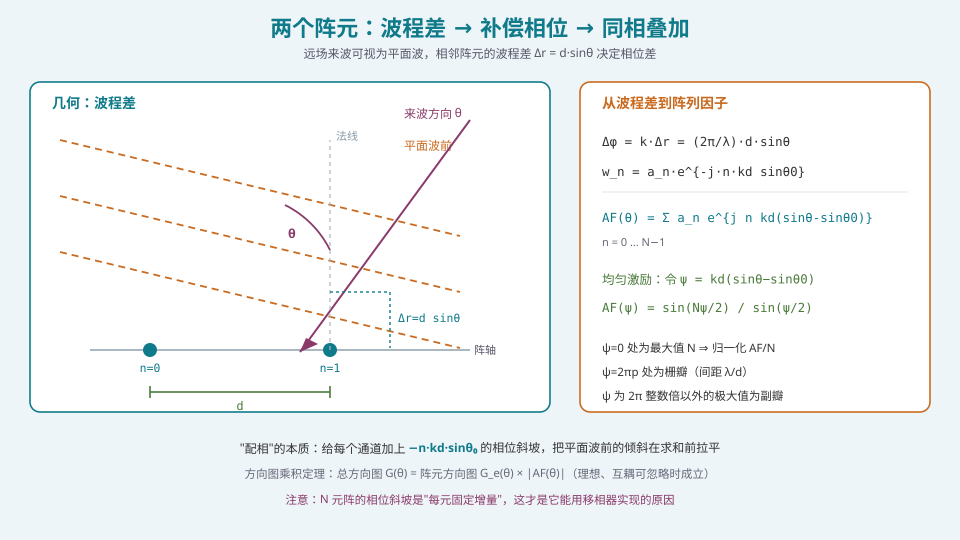
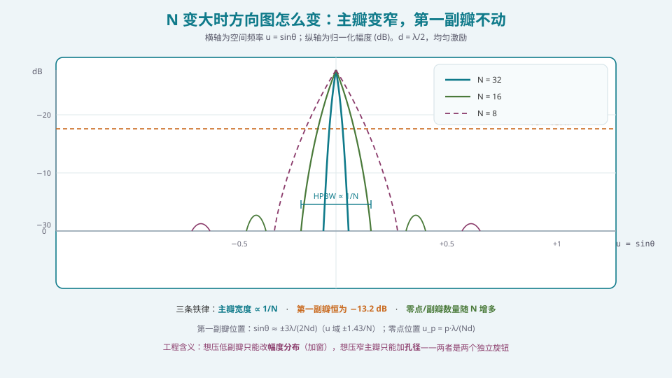
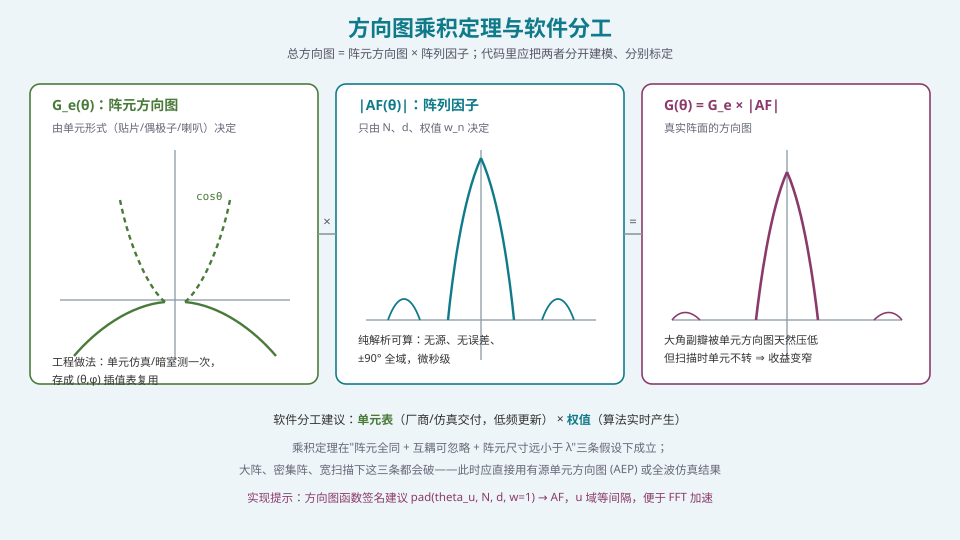

## 本篇要解决什么

S1 的两篇已经打好地基：

- [相控阵的数学语言：复数、相量与相量运算](pa-math-complex-phasor.html) 解决了"用什么表示"——相量、复数乘、配相。
- [空间频率与空间傅里叶变换](pa-spatial-frequency-fft.html) 解决了"用什么变量"——\(u=\sin\theta\)，以及"激励 ↔ 方向图"的傅里叶对偶。

这一篇把两者**合起来，推到闭式解**。

如果你只打算从一个相控阵公式里带走一样东西，那应该是这个：

\[
AF(\psi)=\frac{\sin(N\psi/2)}{\sin(\psi/2)},\qquad \psi = kd(\sin\theta-\sin\theta_0),\quad k=\frac{2\pi}{\lambda}
\]

它看起来平平无奇，但它一次性回答了 S2 后面五篇的大部分问题：

| 你关心的问题 | 这个式子给出的答案 | 展开到哪一篇 |
| --- | --- | --- |
| 主瓣有多宽？ | \(u\) 域零点间距 \(2\lambda/(Nd)\) ⇒ HPBW ≈ \(0.886\lambda/(L\cos\theta_0)\) | [波束宽度、增益与孔径](pa-beamwidth-gain-aperture.html) |
| 副瓣多高？ | 与 \(N\)、\(d\) **无关**，恒为 −13.2 dB | [加权加窗：低副瓣设计的完整方法](pa-amplitude-tapering.html) |
| 会不会出栅瓣？ | 周期 \(\lambda/d\)，落到 \(u\in[-1,1]\) 就是栅瓣 | [λ/2 准则：栅瓣的成因、抑制与例外](pa-half-wavelength-criterion.html) |
| 扫描后怎么变？ | 只在 \(u\) 域平移，形状不变 | [扫描损耗：波束越偏增益越低](pa-scan-loss.html) |
| 想要别的形状？ | 换 \(w_n\)（反问题） | [方向图综合与赋形](pa-pattern-synthesis-shaping.html) |

> **一句话定位**：这一篇是 S2 的**总纲**。后面的五篇都是它的一阶推论。

---

## 一、从两个阵元开始：波程差 → 补偿相位

### 1.1 几何推导



*图 1：远场来波视为平面波，相邻阵元的波程差 \(\Delta r=d\sin\theta\) 决定相位差；"配相"就是给每个通道加一个能抵消这个相位差的相位斜坡。*

设阵元沿 \(x\) 轴排列，间距 \(d\)，来波方向与阵面法线夹角 \(\theta\)。远场条件下（见 [远场条件与近场世界](pa-far-field-near-field.html)），到达各阵元的波前可视为平行平面波。

相邻阵元的**波程差**：

\[
\Delta r = d\sin\theta
\]

对应**相位差**：

\[
\Delta\varphi = k\Delta r = \frac{2\pi}{\lambda}d\sin\theta
\]

若阵元 0 接收信号为 \(s_0(t)=A e^{j\omega t}\)，则阵元 \(n\) 为：

\[
s_n(t) = A e^{j\omega t}\cdot e^{-j n k d\sin\theta}
\]

（负号表示阵元 \(n\) 比阵元 0 **更早**收到信号，因为波先到 n=0 侧——符号取决于坐标定义，推导时统一即可。）

### 1.2 补偿相位

现在我们要让波束指向 \(\theta_0\)。做法是给每个通道乘一个权值 \(w_n\)，抵消掉上面那个相位因子：

\[
w_n = a_n e^{-j n k d\sin\theta_0}
\]

注意这里的关键结构：**相位值与阵元序号 \(n\) 成正比**。这是"线性相位斜坡"，也是它能用一个**固定步进的移相器**实现的原因。

于是求和：

\[
AF(\theta)=\sum_{n=0}^{N-1} w_n e^{j n k d\sin\theta}
=\sum_{n=0}^{N-1} a_n\, e^{\,j n k d(\sin\theta-\sin\theta_0)}
\]

### 1.3 一个必须记住的直觉

把 \((nkd\sin\theta)\) 和 \((nkd\sin\theta_0)\) 放在一起看：**前者是来波自然带来的相位，后者是我们用手加的相位**。

- 在 \(\theta=\theta_0\) 方向上，两者**恰好抵消**，所有 \(N\) 个通道同相相加 ⇒ 最大；
- 在其他方向上，两者不同相，部分抵消 ⇒ 抑制。

所以"波束指向 \(\theta_0\)"的精确含义是：**在校正平面（\(\theta_0\) 方向）上所有通道相位对齐**。

---

## 二、N 个阵元：闭式解与它的结构

### 2.1 等比数列求和

令 \(a_n=1\)（均匀激励），并令：

\[
\psi = kd(\sin\theta-\sin\theta_0)
\]

则：

\[
AF(\psi)=\sum_{n=0}^{N-1} e^{jn\psi}
\]

这是一个**公比为 \(e^{j\psi}\) 的等比数列**。求和公式直接给出：

\[
AF(\psi)=\frac{1-e^{jN\psi}}{1-e^{j\psi}}
= e^{j(N-1)\psi/2}\cdot \frac{\sin(N\psi/2)}{\sin(\psi/2)}
\]

幅度（去掉无关紧要的线性相位因子）：

\[
\boxed{\;|AF(\psi)|=\left|\frac{\sin(N\psi/2)}{\sin(\psi/2)}\right|\;}
\]

归一化后，最大值 \(N\) 处取 1：\(AF_N = |AF|/N\)。这就是 **狄利克雷核**（离散 sinc、aliased sinc、周期性 sinc，同一件事的不同名字）。

### 2.2 三组关键位置

把 \(|AF|\) 当作 \(\psi\) 的函数，它的结构完全由 \(\psi\) 决定：

| 特征 | 条件 | \(\psi\) 值 | 换算到 \(\theta\) |
| --- | --- | --- | --- |
| **主瓣峰值** | \(\psi=0\) | 0 | \(\sin\theta=\sin\theta_0\) |
| **零点** | \(\sin(N\psi/2)=0\) 且 \(\psi\ne0\) | \(\psi=2\pi p/N,\;p=\pm1,\pm2,\dots\)（\(p\ne kN\) 的整数倍） | \(\sin\theta-\sin\theta_0 = p\lambda/(Nd)\) |
| **栅瓣** | 分子分母同时为零 | \(\psi=2\pi m,\;m=\pm1,\pm2,\dots\) | \(\sin\theta-\sin\theta_0 = m\lambda/d\) |
| **副瓣峰** | 介于相邻零点之间 | \(\psi\approx \pm(2q+1)\pi/N\) 附近 | 需数值求解 |

**第一零点**（\(p=1\)）：

\[
u_1-u_0 = \frac{\lambda}{Nd}=\frac{\lambda}{L},\qquad L=Nd
\]

这个结果极其重要：**零点间距只由孔径 \(L\) 决定，与 \(N\) 和 \(d\) 如何分配无关**。

### 2.3 −13.2 dB 从哪来

第一副瓣的峰值出现在 \(\psi\approx 3\pi/N\) 附近（不在零点上）。代入 \(|AF|/N\)：

\[
\frac{|AF(\psi_{s1})|}{N}\approx \frac{2}{3\pi}\approx 0.2124
\]

\[
20\log_{10}(0.2124)\approx -13.46\ \text{dB}
\]

精确数值（\(N\gg1\) 时）为 **−13.26 dB**，工程上简称 **−13.2 dB**。

> **关键认知**：这个数字**只由"矩形窗"这个截断操作决定**，与 \(N\)、\(d\)、\(\theta\) 全都无关。所以：
> - 提高加工精度**不可能**让它变好（只会让它更接近 13.2 而不是高于 13.2）；
> - 想压低它，只能**换窗**，也就是改变 \(a_n\) 的分布 —— 见 [加权加窗](pa-amplitude-tapering.html)。

### 2.4 用代码把它算出来

```python
import numpy as np

C = 299_792_458.0   # m/s

def array_factor(u, N, d_over_lambda, weights=None, u0=0.0):
    """均匀线阵的归一化阵列因子（幅度）。

    u        : 方向余弦 sin(theta)，标量或 ndarray
    N        : 阵元数
    d_over_lambda : 阵元间距 / 波长
    weights  : 长度 N 的复权值（幅度锥削 + 相位斜坡），None 表示全 1
    u0       : 波束指向（方向余弦）
    """
    u = np.atleast_1d(np.asarray(u, dtype=float))
    n = np.arange(N)
    # 导向矢量：a_n(theta) = exp(+j*2*pi*d/lambda*n*u)
    a = np.exp(1j * 2 * np.pi * d_over_lambda * np.outer(u, n))
    if weights is None:
        # 只做扫描相位：w_n = exp(-j*2*pi*d/lambda*n*u0)
        weights = np.exp(-1j * 2 * np.pi * d_over_lambda * n * u0)
    af = a @ weights
    return np.abs(af) / np.abs(weights).sum()

def hpbw_rad(N, d_over_lambda, u0=0.0):
    """均匀激励 HPBW 近似（弧度）。"""
    return 0.886 / (N * d_over_lambda * np.sqrt(max(1 - u0**2, 1e-9)))

def first_null_u(N, d_over_lambda):
    """第一零点相对指向的方向余弦偏移。"""
    return 1.0 / (N * d_over_lambda)
```

跑一下验证三件事：

```python
N, dol = 16, 0.5
us = np.linspace(-1, 1, 4001)
af = array_factor(us, N, dol)

peak = af.max()
# 找第一副瓣（峰值之外的最大局部极大）
from scipy.signal import argrelmax
idx = argrelmax(af)[0]
sll = 20*np.log10(af[idx[0]] / peak) if len(idx) else float('nan')
print(f"第一副瓣 = {sll:.2f} dB")     # ≈ -13.2
print(f"第一零点 u = {first_null_u(N, dol):.4f}")   # 0.125 -> 与 2/(N)=0.125 对应
print(f"HPBW ≈ {np.degrees(hpbw_rad(N, dol)):.2f}°")  # ≈ 6.35°
```

---

## 三、看现象：N 变大时到底发生了什么



*图 2：d = λ/2，均匀激励。N 增大时主瓣变窄、零点与副瓣数量增多，但第一副瓣的高度纹丝不动地停在 −13.2 dB。*

从图上可以读出三条**必须背下来的铁律**：

**铁律一：主瓣宽度 ∝ 1/N（等价地 ∝ 1/L）。**
\(u\) 域首零点在 \(\pm\lambda/(Nd)\)，所以 HPBW ≈ \(0.886\lambda/(Nd)\)。这意味着：
- 想窄波束 ⇒ 加孔径。这是唯一有效的手段；
- **零填充（zero-padding）不会让波束变窄**，只会让曲线更光滑。这一点在 [空间频率与空间傅里叶变换](pa-spatial-frequency-fft.html) 里已经用傅里叶对偶解释过。

**铁律二：第一副瓣恒为 −13.2 dB，与 N 无关。**
这正是"矩形窗的旁瓣"这一事实的直接体现。

**铁律三：零点/副瓣数量随 N 线性增多。**
\(N\) 元阵在 \(u\in[-1,1]\) 内有约 \(2Nd/\lambda\) 个零点。\(d=\lambda/2\) 时正好是 \(N\) 个。

> **工程含义**：三条铁律揭示了**两个独立的旋钮**——"孔径"管主瓣宽度，"幅度分布"管副瓣高度。把它们当成一个旋钮来调，是新手最常犯的错误。

---

## 四、方向图乘积定理：以及它的三条假设

### 4.1 定理陈述

上面我们假设阵元是**各向同性**点源。真实阵元有自己的方向图 \(G_e(\theta)\)。若阵元全同、互耦可忽略，则：

\[
\boxed{\;G(\theta)=G_e(\theta)\cdot|AF(\theta)|\;}
\]



*图 3：单元方向图与阵列因子相乘得到总方向图。软件上应当把两者分开建模、分别标定、分别版本管理。*

这个定理的工程价值在于**解耦**：单元设计和阵列设计可以独立进行，然后相乘。

### 4.2 三条假设（必须知道它们什么时候会破）

| 假设 | 什么时候不成立 | 后果 |
| --- | --- | --- |
| **阵元全同** | 制造公差、边缘单元与中心单元不同、失效单元 | 副瓣抬高、指向偏移 |
| **互耦可忽略** | 间距 < 0.5λ、介质基板表面波、大阵 | 单元方向图变形、扫描盲区 |
| **阵元尺寸 ≪ λ** | 高频段贴片、喇叭作单元 | 单元内相位不可忽略，不能简单相乘 |

工程上的正确做法是使用**有源单元方向图（AEP, Active Element Pattern）**：

\[
G(\theta)=\left|\sum_{n} w_n\, g_n^{\mathrm{AEP}}(\theta)\right|^2
\]

其中 \(g_n^{\mathrm{AEP}}\) 是把其他单元接匹配负载、只激励第 \(n\) 个单元时测到的（或仿真得到的）方向图。它**已经把互耦包含在内**，因此在大阵、密集阵、宽角扫描时比乘积定理准得多。

> **给软件工程师的落点**：把单元数据的**表结构**设计好。乘积定理用一张 \(G_e(\theta,\phi)\) 表；AEP 要用 \(N\) 张表。**接口留成后者，先用前者填数据**——将来升级不用改调用方。

### 4.3 单元方向图做了什么"好事"

真实单元的 \(G_e\) 在大角处通常有滚降（典型 \(\cos\theta\) 量级）。这带来一个**免费的好处**：

**大角副瓣被单元方向图自然压低。**

也就是说，"总方向图的远副瓣电平"通常明显好于"阵列因子的远副瓣电平"。但要注意两个陷阱：

1. **扫描时单元不转**。波束扫到 60°，但单元方向图的凹口还留在正前方。所以扫到大角时，阵元增益下降，且原来被压住的栅瓣位置**会移动**，可能不再落在单元零点上——这正是 [λ/2 准则](pa-half-wavelength-criterion.html) 里 `d > λ/2` 时"栅瓣在扫描后变得和主瓣一样大"的原因。
2. **别把单元滚降当成副瓣抑制手段**。它是频率相关的、角度相关的，不能替代加窗。

---

## 五、把公式变成工程能力

### 5.1 判断一：给定 N、d、θ₀，能立刻报出四项指标

```python
def analyze_ula(N, d_over_lambda, u0=0.0, f_hz=28e9):
    lam = C / f_hz
    L = N * d_over_lambda * lam
    res = {
        "aperture_m": L,
        "hpbw_deg": np.degrees(0.886 / (N * d_over_lambda * np.sqrt(max(1-u0**2, 1e-9)))),
        "fnbw_deg": np.degrees(2 * np.arcsin(min(1.0, 1.0/(N*d_over_lambda)))) if N*d_over_lambda else None,
        "sll_db": -13.26,
        "grating_free": d_over_lambda <= 1.0/(1.0+abs(u0)),
        "grating_u": [u0 + lam/(d_over_lambda*lam), u0 - lam/(d_over_lambda*lam)],
    }
    return res
```

这是"能不能独立干活"的最直接检验：**不看任何工具，能把这个字典填出来。**

### 5.2 判断二：权值 LUT 的索引必须用 \(u_0\) 等间隔

前面 S1 已经讨论过，这里给出直接的工程理由：

- 阵列因子只依赖 \(\psi=kd(u-u_0)\)，即**只依赖 \(u_0\)**；
- 用 \(u_0\) 等间隔建表 ⇒ 表项在 \(u\) 域的覆盖均匀 ⇒ 指向精度均匀、插值误差有界；
- 用 \(\theta_0\) 等间隔 ⇒ 大角区 \(u\) 变化慢（表项冗余、浪费存储），小角区变化快（插值误差大），**与"大角精度要求宽松"的实际需求正好相反**。

### 5.3 判断三：波控数据量估算

一个实际的权值表结构：

\[
\text{表项数} = N_{\text{scan}} \times N_{f} \times N_{T} \times N_{\text{beam}}
\]

举例：\(N_{\text{scan}}=61\)（\(u\in[-0.87,0.87]\) 步长 0.029）、\(N_f=4\) 频点、\(N_T=3\) 温度、\(N_{\text{beam}}=4\) 波束。若每项 2 字节（幅度 + 相位各一字节量化）：

\[
61\times4\times3\times4\times2\ \text{B}\approx 5.9\ \text{kB}
\]

**这个量级完全可以放片上 BRAM。** 但若把幅度表与扫描角解耦：

\[
\text{幅度表}=N\times N_f\times N_T=16\times4\times3=192\ \text{项}
\]

相位斜坡则用解析公式实时算（一个乘法器）。**存储降了一个数量级，且改变扫描角只需改相位。** 这是实践中推荐的结构。

### 5.4 判断四：扫描到 \(\pm60^\circ\) 时主瓣宽了多少

\[
\frac{\mathrm{HPBW}(\theta_0)}{\mathrm{HPBW}(0°)}=\frac{1}{\cos\theta_0}
\]

\(\theta_0=60°\Rightarrow\) 主瓣宽 **2 倍**。这会直接吃掉你的角度分辨率与空分复用能力。相关内容在 [扫描损耗](pa-scan-loss.html)。

---

## 六、常见误区清单

**误区一：以为主瓣宽度由 N 决定，而不是由孔径 \(L=Nd\) 决定。**
错。\(N\) 与 \(d\) 单独都没意义，只有乘积 \(L\) 有意义。16 元 @ 1λ 间距和 32 元 @ 0.5λ 间距有**完全相同**的主瓣宽度（但后者无栅瓣、前者有）。

**误区二：以为提高加工精度能把副瓣降到 −13.2 dB 以下。**
−13.2 dB 是**矩形窗的数学下界**，不是"误差"。误差只会让实际副瓣**高于**它。要降低，唯一途径是改变幅度分布（加窗）或使用超分辨/自适应。

**误区三：忽略方向图乘积定理的适用条件，直接拿单元方向图乘。**
在 \(d<\lambda/2\) 的密集阵或大阵边缘，互耦会显著改变 AEP，乘积定理给出的副瓣与扫描损耗**偏差可以到 3 dB 以上**。设计评审时这是一个必问点。

**误区四：只归一化"主瓣峰值"，然后拿副瓣的绝对值去比对包络。**
副瓣包络（如 ITU-R S.580、3GPP 的 SEM）通常是相对**峰值 EIRP 或峰值增益**定义的。归一化基准错了，整条曲线都会错。参见 S6 的 [规范与认证地图](pa-conformance-standards.html)。

**误区五：把栅瓣当成"大一点的副瓣"。**
栅瓣的高度**等于主瓣**（在它所在的 \(\psi=2\pi m\) 处），消耗同样的功率。它是**通向另一个方向的完整波束**，不是副瓣。加窗无法消除它（见 [λ/2 准则](pa-half-wavelength-criterion.html)）。

**误区六：用 \(\theta\) 等间隔采样方向图并据此计算 HPBW。**
HPBW 定义在两个 −3 dB 点之间。用 \(\theta\) 等间隔会在 \(\theta_0\) 附近分辨率不足；应使用 \(u\) 域等间隔（或自适应加密）再换算回 \(\theta\)。

**误区七：把"阵列因子"当成"总方向图"，忘记乘单元方向图。**
这在**近副瓣**区域影响不大，但在**大角区**会导致严重误判——尤其是判断"大角副瓣是否满足包络"时。

**误区八：忘记相位斜坡的周期性。**
移相器只能提供 \([0,2\pi)\) 的相位。\(n k d\sin\theta_0\) 随 \(n\) 线性增长，必须对 \(2\pi\) **取模**再落到位数上。取模本身无害（相位是周期的），但**取模后的量化误差会随 \(n\) 累积**，这是 [移相器与真时延器件](pa-phase-shifter-ttd.html) 里量化副瓣分析的起点。

---

## 七、快速自测

**Q1.** 推导 4 元均匀线阵、\(d=\lambda/2\)、正扫（\(\theta_0=0\)）时的阵列因子表达式，并给出所有零点的位置（用 \(u=\sin\theta\) 表示）。

<details><summary>参考要点</summary>

\(N=4\)，\(d/\lambda=0.5\)，\(\theta_0=0\Rightarrow \psi=kd\sin\theta=\pi\sin\theta=\pi u\)。

\[
AF(u)=\left|\frac{\sin(4\cdot\pi u/2)}{\sin(\pi u/2)}\right|=\left|\frac{\sin(2\pi u)}{\sin(\pi u/2)}\right|
\]

零点：\(\sin(2\pi u)=0\) 且分母非零 ⇒ \(2\pi u=m\pi\Rightarrow u=m/2\)。在 \([-1,1]\) 内为 \(u=\pm0.5,\pm1\)。
注意 \(u=\pm1\) 处分母也为零（\(\sin(\pm\pi/2)=\pm1\)），所以那里**不是**零点——实际零点只有 \(u=\pm0.5\)。而 \(u=0\) 是主瓣峰值。

**校验**：\(N\) 元阵零点间距应为 \(\lambda/(Nd)=1/(4\times0.5)=0.5\)，与 \(u=\pm0.5\) 一致。✓

</details>

**Q2.** 一个 32 元线阵，\(d=0.5\lambda\)，工作在 28 GHz。(a) 孔径是多少 mm？(b) 正扫 HPBW 是多少度？(c) 扫描到 45° 时 HPBW 与增益各损失多少？

<details><summary>参考要点</summary>

\(\lambda=299792458/28\times10^9=10.71\ \text{mm}\)，\(d=5.355\ \text{mm}\)。

(a) \(L=Nd=32\times5.355=171.4\ \text{mm}\approx 0.171\ \text{m}\)。

(b) \(\mathrm{HPBW}=\arcsin\left(\dfrac{0.886\lambda}{L}\right)=\arcsin\left(\dfrac{0.886\times10.71}{171.4}\right)=\arcsin(0.05537)\approx 3.17°\)。
用工程近似 \(50.8/(L/\lambda)=50.8/16=3.175°\)。✓

(c) \(\theta_0=45°\)：\(\cos45°=0.7071\)。
- HPBW 展宽 \(1/\cos\theta_0=1.414\) 倍 ⇒ \(3.17\times1.414\approx 4.48°\)；
- **纯几何**增益损失 \(10\log_{10}(0.7071)=-1.51\ \text{dB}\)；
- 实际还要加上单元方向图滚降（45° 时约 0.3~0.8 dB）与失配，总损失通常 1.8~2.5 dB。**这就是"标称范围≠性能保证范围"的具体数字。**

</details>

**Q3.** 为什么第一副瓣总是 −13.2 dB？请从"矩形窗的傅里叶变换"角度解释，并说明这一结论在什么条件下会失效。

<details><summary>参考要点</summary>

**来源**：均匀阵列的激励序列是长度 \(N\) 的矩形序列，其离散时间傅里叶变换即狄利克雷核。其旁瓣包络近似为 \(1/(N\psi/2)\) 的 sinc 包络，第一旁瓣峰在 \(\psi\approx3\pi/N\) 处，值为 \(\approx2/(3\pi)=0.2124\)，即 −13.46 dB；精确值为 −13.26 dB（\(N\to\infty\) 极限）。

**失效条件**：
1. **幅度非均匀**（加窗）：副瓣按窗的形状改变，不再 −13.2；
2. **N 很小**（如 \(N\le3\)）：−13.2 dB 是 \(N\to\infty\) 的渐近结果，小阵的"第一副瓣"概念本身意义有限（没有明确的旁瓣结构）；
3. **单元方向图相关**：若 \(G_e\) 在主瓣区起伏剧烈，乘积会改变实际副瓣；
4. **存在误差**：随机幅相误差会**抬高**平均副瓣，但对确定性第一副瓣（近副瓣）影响较小。

</details>

**Q4.** 写出 16 元阵、\(d=\lambda/2\)、指向 \(u_0=0.5\) 时，第 8 号阵元（\(n=8\)）所需相位（取模 \(2\pi\)）是多少度？如果移相器是 4 bit，实际下发的相位是多少？

<details><summary>参考要点</summary>

\(\varphi_n = -nkd u_0 = -n\cdot2\pi\cdot0.5\cdot0.5 = -n\pi/2\)（弧度）。

\(n=8\)：\(\varphi=-8\pi/2=-4\pi\equiv 0\ (\!\!\bmod 2\pi)\) ⇒ **0°**。

4 bit ⇒ 步进 \(360/16=22.5°\)，量化后仍是 0°。

**再算一个**：\(n=3\)：\(\varphi=-3\pi/2=-270°\equiv 90°\)。量化：\(90/22.5=4\) ⇒ 精确落在格点上 ⇒ **90°**。

**再算一个**：\(n=5\)：\(\varphi=-5\pi/2=-450°\equiv -90°\equiv 270°\)。\(270/22.5=12\) ⇒ 仍是格点。

**注意**：\(d=\lambda/2\)、\(u_0=0.5\) 这一组合让相位恰好落在 \(\pi/2\) 的整数倍上，**这是特例**。取 \(u_0=0.37\) 试试：\(n=5\) 时 \(\varphi=-5\pi(0.37)=-5.812\ \text{rad}=-333°\equiv 27°\)，\(27/22.5=1.2\) ⇒ 量化为 \(22.5°\)，**误差 4.5°**。这就是量化副瓣的来源。

</details>

**Q5.** 一个 64 元阵工作在 12 GHz，要求 ±60° 扫描无栅瓣。最大允许的物理间距是多少毫米？如果介质基板 \(\varepsilon_r=3.0\)（有效波长缩短为 \(\lambda_0/\sqrt{3}\)），这个约束如何变化？

<details><summary>参考要点</summary>

\(\lambda_0=299792458/12\times10^9=24.98\ \text{mm}\)。

自由空间约束：\(d\le\lambda_0/(1+|\sin60°|)=24.98/1.866=13.39\ \text{mm}\)。

**注意**：栅瓣条件应按**介质中的波长**评估。若阵元处于有效介电常数 \(\varepsilon_{\text{eff}}\) 的介质中，相位常数 \(k=\omega\sqrt{\mu_0\varepsilon_0\varepsilon_{\text{eff}}}=2\pi/\lambda_{\text{eff}}\)，\(\lambda_{\text{eff}}=\lambda_0/\sqrt{\varepsilon_{\text{eff}}}\)。

\(\sqrt{3}=1.732\Rightarrow\lambda_{\text{eff}}=14.42\ \text{mm}\)。约束变为 \(d\le14.42/1.866=7.73\ \text{mm}\)。

**结论**：**介质中的电间距与空气中不同**。同样的物理间距 \(d\)，在介质里对应的电尺寸更大（\(d/\lambda_{\text{eff}}\) 更大），栅瓣更容易出现。这是相控阵设计中"介质基板必须薄着用"的根本原因之一——基板越厚、\(\varepsilon_r\) 越大，表面波与栅瓣问题越严重。

**工程落点**：软件读入的应是 `d_over_lambda_eff`，而不是从物理尺寸除以真空波长。

</details>

**Q6.** 你在做一个 8 元线阵，测试发现第一副瓣是 −11.5 dB，而不是理论上的 −13.2 dB。列出至少四条可能原因，并说明如何逐条排除。

<details><summary>参考要点</summary>

| 可能原因 | 排除方法 |
| --- | --- |
| **幅度不一致**（各通道输出功率不同） | 单通道功率扫，检查幅度离散度；期望 < 0.3 dB |
| **相位误差**（随机相位偏差） | 单通道相位扫或做 REV 校准；期望 < 5° |
| **阵元位置误差**（加工公差） | 三坐标测量或近场扫描反演位置 |
| **互耦/边缘效应**（边缘单元与中心单元不同） | 测 AEP，比对中心单元与边缘单元方向图 |
| **测量系统本身**（暗室反射、探头方向图、截断） | 换距离/换探头重测；验证静区 |
| **馈电网络不等分**（功分器实际分配比与设计不符） | VNA 测各端口 S21 幅度 |

**量化参考**：\(N\) 元阵上的随机相位误差 \(\sigma_\phi\)（弧度）会把**平均**副瓣抬到约 \(-10\log_{10}N + 10\log_{10}\sigma_\phi^2\) dB 量级；而**第一副瓣**受误差影响相对较小，因为它是确定性的、由窗形状主导。所以如果第一副瓣明显高于 −13.2 dB，**首先要怀疑系统性误差（幅度锥削、位置、馈网）而不是随机误差**。

</details>

**Q7.** 解释：为什么"把 N 从 16 加倍到 32"能让增益增加 3 dB，但不足以让链路余量增加 3 dB？

<details><summary>参考要点</summary>

**增益确实增加 3 dB**：\(G_{AF}=10\log_{10}N\)，\(N\) 翻倍 ⇒ +3.01 dB。这是相干功率合成（不是放大）。

**但链路余量增加不到 3 dB**，原因：
1. **主瓣变窄**：HPBW ∝ 1/N，波束指向容差与跟踪误差的代价上升。若指向误差固定，窄波束的指向损耗会增加；
2. **口径效率可能下降**：更多阵元若带来更长的馈电路径，插损增加；若边缘单元更多，锥削效率变化；
3. **扫描时窄波束的展宽**：\(\theta_0=60°\) 时主瓣宽 2 倍，覆盖变小，边缘用户可能落在 −3 dB 之外；
4. **阵面更大 ⇒ 更重的互耦与公差累积**（尤其大阵），实际副瓣抬升；
5. **热与功耗**：+3 dB 增益往往需要 +3 dB 发射功率，功耗与散热代价。

**所以正确说法是**：\(N\) 翻倍带来 **3 dB 的峰值增益**，但**系统级余量**要按整体链路预算重算，通常只有 1.5~2.5 dB 的实际收益。

</details>

**Q8.** 用方向图乘积定理计算时，如果单元方向图是 \(G_e(\theta)=\cos\theta\)，写出总方向图中"最靠近主瓣的副瓣"与"大角副瓣"的相对变化规律，并解释为什么这个规律对宽角扫描系统是危险的。

<details><summary>参考要点</summary>

\(G(\theta)=\cos\theta\cdot|AF(\theta)|\)。

- **近副瓣**（\(\theta\) 小）：\(\cos\theta\approx1\)，几乎不变 ⇒ 仍是 −13.2 dB 量级；
- **大角副瓣**（\(\theta\to\pm90°\)）：\(\cos\theta\to0\) ⇒ 被压得很低，远副瓣明显改善。

**危险性**（宽角扫描）：
1. **单元方向图不跟着波束转**。波束扫到 60° 后，\(\theta=0°\) 附近的单元增益仍然最大，但那里已经没有波束。而原本被 \(\cos\theta\) 压住的栅瓣（若 \(d>\lambda/2\)）**可能移动到 \(\theta\) 小角区域**，此时 \(\cos\theta\approx1\)，**不再被压住** —— 于是栅瓣变得和主瓣一样大。
2. **波束变形**：扫描后主瓣被 \(\cos\theta\) 沿角度非对称加权，主瓣形状不对称、峰值偏移（"beam shift"），HPBW 也偏离公式预测。
3. **扫描盲区**：在特定扫描角，互耦与表面波共振会导致"扫描盲区"，增益断崖式下跌。这不是乘积定理能预测的，需要 AEP 或全波仿真。

**实践结论**：乘积定理用于**快速估算与近轴分析**足够好；在**宽角扫描、大阵、密集阵**的关键设计上，必须用 AEP 或全波仿真复核。

</details>

---

## 八、与本站其它专题的连接

| 想了解 | 看哪篇 |
| --- | --- |
| 复数、相量与"配相是复数乘" | [相控阵的数学语言：复数、相量与相量运算](pa-math-complex-phasor.html) |
| \(u=\sin\theta\) 与傅里叶对偶（本篇的数学前传） | [空间频率与空间傅里叶变换](pa-spatial-frequency-fft.html) |
| 为什么 \(d>\lambda/2\) 会出现栅瓣 | [采样、混叠与栅瓣的同一性](pa-sampling-aliasing-grating.html) |
| 主瓣宽度、增益与孔径的定量关系（本篇的直接延伸） | [波束宽度、增益与孔径](pa-beamwidth-gain-aperture.html) |
| λ/2 红线的完整推导与例外 | [λ/2 准则：栅瓣的成因、抑制与例外](pa-half-wavelength-criterion.html) |
| 把 −13.2 dB 压到 −30 dB 的完整方法 | [加权加窗：低副瓣设计的完整方法](pa-amplitude-tapering.html) |
| 反问题：给定方向图求激励 | [方向图综合与赋形](pa-pattern-synthesis-shaping.html) |
| 权值 LUT 与常规波束形成的实现 | [常规波束形成：数据无关的权值计算](pa-conventional-beamforming.html) |
| 移相器位数如何影响副瓣 | [移相器与真时延器件（TTD）](pa-phase-shifter-ttd.html) |
| 阵元方向图、互耦与 AEP | [电磁地基（结论级）：阵元、极化、互耦、表面波](pa-electromagnetics-basics.html) |
| 相控阵物理机制的整体图景 | [卫星相控阵天线：从阵元到波束](satellite-phased-array.html) |
| 学习体系全貌 | [相控阵天线学习体系：六阶段路线图](phased-array-roadmap.html) |

---

## 九、延伸阅读

**教材**
- Balanis, *Antenna Theory: Analysis and Design*, 4th ed., §6.3（两元阵）、§6.4（N 元线阵与方向图乘积定理）、§6.5（阵因子）与 §6.8（平面阵）。**本章的推导与本文第一节完全对应**，注意作者用 \(\psi=kd\cos\theta\)（以阵轴为参考），与本文的 \(\theta\) 定义相差 90°。
- Mailloux, *Phased Array Antenna Handbook*, 3rd ed., §1.2 与 §2.2。对"阵列因子 vs 方向图乘积"的处理最严谨，也是最早系统讨论 AEP 与扫描盲区的著作。
- Hansen, *Phased Array Antennas*, 2nd ed., §1.2 与第 3 章。加窗与综合的权威参考（本文只需其 §1.2 的基础形式）。
- Stutzman & Thiele, *Antenna Theory and Design*, §8.2 与 §8.3。对"电子扫描与阵列因子"的入门处理很友好。

**经典文献**
- S. A. Schelkunoff, "A Mathematical Theory of Linear Arrays," *Bell System Technical Journal*, vol. 22, pp. 80–107, 1943。**阵列理论的奠基论文**，把阵列因子写成多项式，零点即多项式的根。用它重新看一遍本文第二节，会有"原来如此"的感觉。
- J. C. Simon & G. Weill 关于 AEP 的系列工作（1960s–70s）——有源单元方向图概念的来源。
- C. A. Balanis, "Antenna Theory" 中关于 "array factor vs pattern multiplication" 的讨论，以及 Hansen 关于 "pattern multiplication validity" 的评述。

**工程应用笔记**
- Analog Devices, *Phased Array Antenna Patterns — Part 1: Linear Array Beam Characteristics and Array Factor*。用极少的数学给出可交互的结论，**配套的 Figure 10/11 就是本文图 2 的出处思路**。
- Analog Devices, *Phased Array Antenna Patterns — Part 2: Grating Lobes and Beam Squint*。栅瓣与波束斜视的直观处理。
- Keysight, *How to Design and Test a Phased Array Antenna*（免费电子书），第 2 章。从工程视角复述阵列因子，并直接接到测试项。
- R. Mailloux, "Phased Array Theory and Technology," *Proceedings of the IEEE*, vol. 70, no. 3, 1982。综述性质，适合建立全局观。
