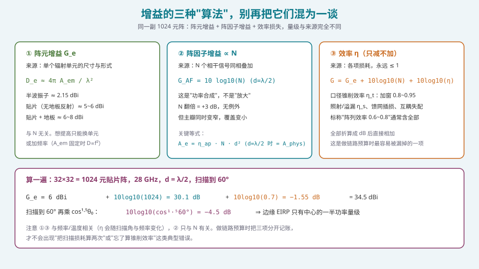
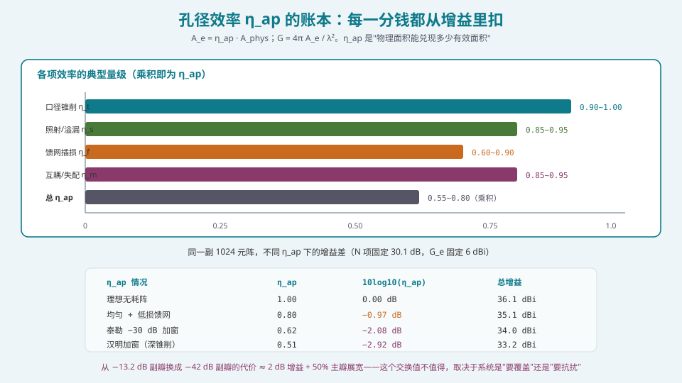
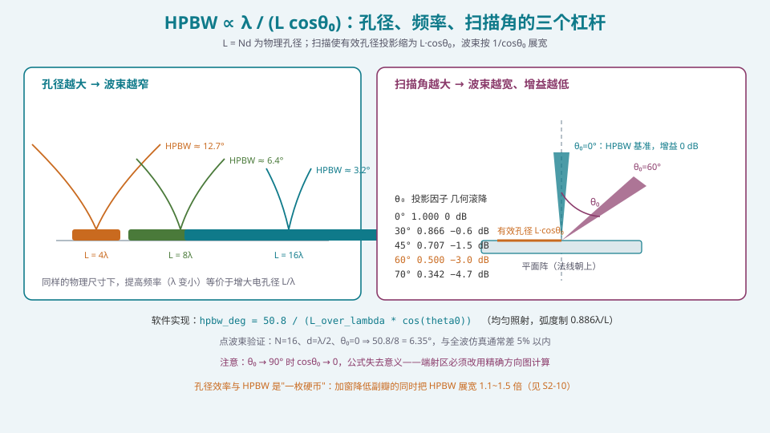

## 本篇要解决什么

[阵列因子：从两个阵元到 N 个阵元](pa-array-factor.html) 给出了方向图的**形状**。这一篇给出它的**规模**：主瓣有多宽、峰值增益有多高。

之所以要专门花一篇，是因为增益这块土地上**流传的错误说法最多**：

- "加大发射功率就能提高 EIRP" —— 对，但阵列增益来自**方向性**，不是放大；
- "阵元越多增益越高" —— 在固定孔径下**不成立**；
- "把阵列效率设成 0.9" —— 这个 0.9 是什么的效率？很多人答不上来；
- "标称 60° 扫描范围，链路预算按中心增益算就行" —— 这是最常见的严重高估。

这一篇的目标是把增益这件事**拆成三本独立的账**，让每一本都能单独核对。

---

## 一、三本账：把增益拆干净



*图 1：同一副 1024 元阵，三本账的来源、量级与变化规律完全不同。把它们混成一个数字，是链路预算出错的第一步。*

### 1.1 账本一：阵元增益 \(G_e\)

**这是单个辐射单元在孤立（或理想阵中）条件下的增益。**

由天线的方向性公式：

\[
D_e=\frac{4\pi A_{em}}{\lambda^2}=\frac{4\pi \eta_e A_{\text{phys}}}{\lambda^2}
\]

| 单元形式 | 典型增益 |
| --- | --- |
| 各向同性（理论） | 0 dBi |
| 半波振子 | 2.15 dBi |
| 微带贴片（无地板/无限地板） | 5~8 dBi |
| 开口波导 | 6~10 dBi |
| 喇叭 | 10~25 dBi |

**关键性质**：
1. **与 N 无关**。阵元数再多，单个单元的增益不变。
2. **随频率升高而升高**（若物理尺寸固定）：\(D_e\propto1/\lambda^2\)。这是毫米波阵列能在小尺寸下获得高增益的原因之一。
3. **随扫描角变化**：真实的 \(G_e(\theta)\) 在偏离法线时滚降（典型 \(\cos^m\theta\)，\(m\approx1\sim1.3\)）。这一项就是 [扫描损耗](pa-scan-loss.html) 的第二本账。

### 1.2 账本二：阵因子增益 \(\propto N\)

\(N\) 个相干通道同相叠加，**幅度**相加为 \(N\) 倍，**功率**为 \(N^2\) 倍；而各通道噪声不相关，功率相加为 \(N\) 倍。所以：

\[
\mathrm{SNR}\ \text{增益}=\frac{N^2}{N}=N
\]

即：

\[
G_{AF}=10\log_{10}N\quad\text{dB}
\]

（当 \(d=\lambda/2\) 且无锥削时。）

**必须记住的三点**：

1. **这是功率合成，不是放大。** 每个通道的发射功率没有增加；增加的是"往一个方向堆功率"的能力。总辐射功率增加 \(N\) 倍（因为阵元多了 \(N\) 倍），而峰值强度增加 \(N^2\) 倍。
2. **它只与 \(N\) 有关**，与扫描角无关（"形状不变"是 \(u\) 域平移的直接结果）。
3. **有代价**：主瓣变窄，覆盖变小。见 [扫描损耗](pa-scan-loss.html) 与 S2 的全部内容。

### 1.3 账本三：口径效率 \(\eta\)

\[
G_{\text{array,dBi}}=G_e+10\log_{10}N+10\log_{10}\eta
\]

\(\eta\) 是**所有损耗的乘积**，永远 \(\le1\)。它必须被拆开记账，否则你永远不知道哪一项在吃你的增益：



*图 2：总 η 是四项的乘积。注意"标称阵列效率 0.6~0.8"通常是这四项的合并结果——拿到一个效率数字时，先问它包含哪些项。*

| 效率项 | 典型值 | 来源 | 可用手段 |
| --- | --- | --- | --- |
| 口径锥削 \(\eta_t\) | 0.80~1.00 | 加窗（幅度分布） | 选窗类型；用 [泰勒窗](pa-amplitude-tapering.html) 而非汉明 |
| 照射/溢漏 \(\eta_s\) | 0.85~0.95 | 单元方向图与阵面边缘 | 单元设计；加边缘阵元 |
| 馈网插损 \(\eta_f\) | 0.60~0.90 | 功分网络、移相器、线损 | 拓扑选择（强制/空间/数字馈电） |
| 互耦/失配 \(\eta_m\) | 0.85~0.95 | 有源驻波、扫描失配 | 间距设计、降耦结构 |

### 1.4 等效写法：用有效面积表达

另一个等价且更"物理"的写法：

\[
G=\frac{4\pi A_e}{\lambda^2},\qquad A_e=\eta_{ap}A_{\text{phys}}
\]

对于 \(d=\lambda/2\) 的阵：\(A_{\text{phys}}=Nd^2=N\lambda^2/4\)，于是

\[
G=\frac{4\pi}{\lambda^2}\cdot\eta_{ap}\cdot\frac{N\lambda^2}{4}=\pi\eta_{ap}N
\]

即 \(G_{\text{dBi}}\approx10\log_{10}N+4.97+10\log_{10}\eta_{ap}\)。

> **工程校验点**：这个式子告诉你，\(d=\lambda/2\) 时 \(10\log_{10}N\) 已经"用满"了物理面积。若再增大 \(d\)，物理面积变大，但栅瓣风险出现（见 [λ/2 准则](pa-half-wavelength-criterion.html)）。**所以 λ/2 是"不产生栅瓣的前提下孔径最大"的选择** —— 这才是 λ/2 成为标准的第二个理由（第一个是抗栅瓣）。

---

## 二、HPBW：公式、推导与边界

### 2.1 公式

\[
\boxed{\;\mathrm{HPBW}\approx\frac{0.886\,\lambda}{L\cos\theta_0}=\frac{0.886\,\lambda}{Nd\cos\theta_0}\;}
\quad\text{(弧度)}
\]

换成角度制（\(L\) 以波长为单位）：

\[
\mathrm{HPBW}\approx\frac{50.8°}{L/\lambda\cdot\cos\theta_0}
\]

### 2.2 推导（只差一个常数）

\(u\) 域中主瓣近似为宽度 \(2\lambda/L\) 的函数（首零点间距）。若把主瓣**近似为矩形**，则 −3 dB 点应落在 \(u=0\) 到首零点之间的一半位置。实际数值求解 \(\mathrm{sinc}^2\) 的 −3 dB 点给出：

\[
\frac{\sin(N\psi/2)}{N\sin(\psi/2)}=\frac{1}{\sqrt2}\Rightarrow \psi_{3dB}\approx\pm\frac{2.65}{N}
\]

由此 \(u_{3dB}=\pm\lambda/(2.39L)\)，HPBW 全宽 \(=0.836\lambda/L\)。更精细的数值解（考虑分母 \(\sin(\psi/2)\) 的影响）给出 \(0.886\)。这就是那个常数的来历——**它不是"随便定的"，而是狄利克雷核在 −3 dB 点的精确解**。

### 2.3 三个杠杆



*图 3：孔径、波长、扫描角是三个独立杠杆。注意第四个隐含杠杆——加窗的展宽因子 B_win（1.0~1.6）。*

| 杠杆 | 关系 | 工程含义 |
| --- | --- | --- |
| 孔径 \(L=Nd\) | \(\mathrm{HPBW}\propto1/L\) | 想窄波束只能加孔径；**N 与 d 单独都无效** |
| 波长 \(\lambda\) | \(\mathrm{HPBW}\propto\lambda\) | 同尺寸下高频波束更窄（毫米波优势） |
| 扫描角 \(\theta_0\) | \(\propto1/\cos\theta_0\) | 60° 时展宽 2 倍；90° 时公式失效 |
| 加窗因子 \(B_{\text{win}}\) | \(\times1.0\sim1.6\) | 低副瓣的代价，见 [加权加窗](pa-amplitude-tapering.html) |

完整形式应写为：

\[
\mathrm{HPBW}\approx B_{\text{win}}\cdot\frac{0.886\lambda}{L\cos\theta_0}
\]

**别忘了 \(B_{\text{win}}\)**。用汉明窗时它约 1.3~1.5，这意味着你在纸面上算出的 3° 实际上是 4.5°。

### 2.4 公式的适用边界

| 条件 | 后果 |
| --- | --- |
| \(\theta_0\to90°\)（端射） | \(\cos\theta_0\to0\)，公式发散；必须用精确方向图 |
| \(L/\lambda\) 很小（≤ 2~3） | "窄波束近似"失效；HPBW 与 FNBW 是同量级 |
| 强锥削（深加窗） | 主瓣形状偏离狄利克雷核，\(B_{\text{win}}\) 需实测/仿真标定 |
| 阵元数少（N ≤ 5） | 用公式前先画一次方向图，别信公式 |

---

## 三、增益算式与实现

### 3.1 一个可用的增益预算函数

```python
import numpy as np

def array_gain_dbi(N, d_over_lambda, *,
                   g_e_dbi=6.0,
                   eta_taper=0.90,
                   eta_spill=0.92,
                   eta_feed=0.80,
                   eta_mismatch=0.92,
                   u0=0.0,
                   m_elem=1.2):
    """相控阵峰值增益预算（dB）。

    g_e_dbi       : 单元峰值增益
    eta_*         : 各项效率（见正文表）
    u0            : 波束指向的方向余弦
    m_elem        : 单元方向图指数，G_e(theta) ~ cos^m(theta)
    """
    n_db = 10*np.log10(N)
    eta = eta_taper*eta_spill*eta_feed*eta_mismatch
    eta_db = 10*np.log10(eta)

    # 扫描引起的单元方向图滚降：几何投影 + 单元滚降
    cos_t = np.sqrt(max(1.0 - u0**2, 1e-9))
    scan_db = 10*np.log10(cos_t**m_elem)   # 单元方向图项
    proj_db = 10*np.log10(cos_t)           # 有效孔径投影项

    total = g_e_dbi + n_db + eta_db + scan_db + proj_db
    return dict(g_e=g_e_dbi, n=n_db, eta=eta_db,
                elem_rolloff=scan_db, projection=proj_db, total=total)
```

跑一个例子：

```python
r = array_gain_dbi(1024, 0.5, g_e_dbi=6.0, u0=0.0)
print(f"正扫峰值增益 = {r['total']:.1f} dBi")
# g_e=6.0, n=30.1, eta=-1.55, 扫描项=0 => 34.6 dBi

r60 = array_gain_dbi(1024, 0.5, g_e_dbi=6.0, u0=np.sin(np.radians(60)))
print(f"60° 扫描增益 = {r60['total']:.1f} dBi  "
      f"（损失 {r['total']-r60['total']:.1f} dB）")
# 单元滚降 + 投影 => 约 -4.5 dB，得 30.1 dBi
```

### 3.2 "固定孔径下加阵元 ≠ 加增益"——证明

设固定物理孔径 \(A=L\times L\)（平面阵）。

- 若用 \(d_1=\lambda/2\)：\(N_1=A/(\lambda/2)^2=4A/\lambda^2\)，增益 \(\propto N_1\)；
- 若减半间距到 \(d_2=\lambda/4\)：\(N_2=16A/\lambda^2=4N_1\)，**阵元数变为 4 倍**。

按"增益 ∝ N"你会期望 +6 dB。但物理面积 A 没变，\(A_e\le A\)，所以

\[
G=\frac{4\pi A_e}{\lambda^2}\le\frac{4\pi A}{\lambda^2}
\]

**增益被物理面积封顶**。多出来的阵元只是让采样更密，主瓣宽度几乎不变（仍由 A 决定），而互耦急剧上升、效率下降。

> **结论**：固定孔径下，阵元数超过 \(A/(\lambda/2)^2\) 之后，**增益不再增加，只会增加成本、功耗与互耦**。这是"用多少阵元"这个问题的正确答案。
>
> 反过来：如果孔径不限，那么"加阵元 ⇒ 加孔径 ⇒ 同时加增益、窄波束"是成立的，只是要付出尺寸与成本的代价。

### 3.3 什么时候 \(10\log_{10}N\) 不成立

| 情形 | 偏差 |
| --- | --- |
| 有幅度锥削 | 增益要乘 \(\eta_t<1\)，等效 \(-0.5\sim-2\) dB |
| 存在相关误差（系统性幅相偏差） | 部分通道不能完全相干，增益损失可达 1~3 dB |
| 互耦导致单元阻抗失配 | 每单元输出功率下降，有效 N 减小 |
| 大阵边缘效应 | 边缘单元贡献低于中心单元 |
| 扫描到宽角 + 单元滚降 | 见 [扫描损耗](pa-scan-loss.html) |

**实践规则**：纸面按 \(10\log_{10}N\) 算，然后统一扣 \(1.5\sim3\) dB 归入 \(\eta\)。**不要试图逐项精确建模**——你没有那么准的数据，扣一个保守量反而更稳。

---

## 四、链路预算里的三处常见算错

### 4.1 算错一：用中心增益代替边缘增益

链路余量的瓶颈总在**覆盖边缘**。以卫星为例：星下点扫描角 0°，边缘 60°。若用 34.6 dBi 做预算，实际边缘只有 30.1 dBi，**高估 4.5 dB**。

正确做法：

\[
\mathrm{EIRP}(\theta)=\mathrm{EIRP}_0+G(\theta)-G(0°)
\]

即先做出 \(G(\theta)\) 表，再逐个角度算。S6 的 [测试量：EIRP / TRP / EIS 与球面扫描](pa-ota-metrics-spherical-scan.html) 讲的球面扫描就是为了这个。

### 4.2 算错二：把 \(\eta\) 当成与频率/温度无关的常数

口径效率的每一项都随频率与温度变化：锥削效率随频率变（因为 \(w_n\) 固定但电尺寸变）、馈网插损随温度变（介质损耗）、互耦随频率剧烈变化。**至少要在频段两端各算一次。**

### 4.3 算错三：混淆"方向性增益"与"功率增益"

- **方向性系数 D**：只考虑方向图，无损耗；
- **增益 G**：包含损耗（\(G=\eta D\)）。

很多厂商手册给的是 "directivity"，做成链路预算时直接当"gain"用，就少了 1~2 dB。**读手册时先确认是哪一个。**

---

## 五、常见误区清单

**误区一：以为增益来自"放大器"。**
阵列增益来自**方向性**：把同样多的功率集中到更小的立体角里。它是能量守恒的应用，不是能量创造。总辐射功率随 N 线性增长，但峰值强度随 \(N^2\) 增长，差额来自"不再往其他方向辐射"。

**误区二：以为"阵元越多增益越高"，不考虑孔径约束。**
见 §3.2 的证明。固定孔径下，元件数超过奈奎斯特密度后增益不再增长。

**误区三：用 \(d\) 越大增益越高来选间距。**
增大 \(d\) 确实增大孔径与增益（\(G\propto A\propto d^2\)），但会引入栅瓣。且 \(d>\lambda/2\) 时单元间互耦减弱，看起来"干净"，但代价是栅瓣可能落入可见空间，且单元在阵中的有源阻抗变化剧烈，可能产生扫描盲区。**λ/2 是"无栅瓣约束下的最优孔径利用率"**。

**误区四：认为 HPBW 与阵元数成反比。**
在**固定间距**下确实如此（\(L=Nd\)）；在**固定孔径**下不成立。考试与评审都爱考这个。

**误区五：忘记加窗带来的主瓣展宽。**
\(\mathrm{HPBW}\approx B_{\text{win}}\cdot0.886\lambda/(L\cos\theta_0)\)，\(B_{\text{win}}\) 可达 1.5。设计低副瓣天线时如果忘了它，最终波束会比预期宽 30%~50%。

**误区六：把 \(-3\ \text{dB}\) 波束宽度与"零点间宽度"混用。**
两者相差约 2 倍：\(\mathrm{FNBW}\approx2\lambda/L\)，\(\mathrm{HPBW}\approx0.886\lambda/L\)。写接口文档时务必标明是哪一个。

**误区七：忽略增益随扫描角的"真实"跌幅。**
纯几何只给 −3 dB @ 60°，实测常是 −4\sim−6 dB（\(k=1.2\sim1.5\)）。见 [扫描损耗](pa-scan-loss.html)。

---

## 六、快速自测

**Q1.** 一个 16×16 平面阵，工作在 30 GHz，\(d_x=d_y=0.5\lambda\)。求：(a) 物理孔径；(b) 正扫 HPBW（两个主平面）；(c) 若单元增益 6 dBi、总效率 0.7，峰值增益是多少 dBi？

<details><summary>参考要点</summary>

\(\lambda=299792458/30\text{e}9=9.993\ \text{mm}\)，\(d=4.997\ \text{mm}\)。

(a) \(L=16\times4.997=79.95\ \text{mm}\)，即约 \(80\ \text{mm}\times80\ \text{mm}\)。电尺寸 \(L/\lambda=8\)。

(b) \(\mathrm{HPBW}=50.8/(L/\lambda)=50.8/8=6.35°\)（两个主平面相同，因为对称）。

(c) \(G=6+10\log_{10}(256)+10\log_{10}(0.7)=6+24.08-1.55=28.5\ \text{dBi}\)。

**交叉验证**：\(A=80^2\ \text{mm}^2=6.4\times10^{-3}\ \text{m}^2\)，\(A_e=0.7A=4.48\times10^{-3}\)，\(G=4\pi A_e/\lambda^2=4\pi\times4.48\times10^{-3}/(9.993\times10^{-3})^2=704=28.5\ \text{dBi}\)。✓

</details>

**Q2.** 证明：对于 \(d=\lambda/2\) 的 \(N\) 元均匀线阵，其正扫**方向性系数** \(D\approx2N\)。

<details><summary>参考要点</summary>

方法一（有效面积）：\(A_{\text{phys}}=Nd^2=N\lambda^2/4\)，均匀照射 \(\eta_{ap}=1\)，故

\[
D=\frac{4\pi A_e}{\lambda^2}=\frac{4\pi}{\lambda^2}\cdot\frac{N\lambda^2}{4}=N\pi\approx 3.14N
\]

即约 \(10\log_{10}N+4.97\) dBi。

方法二（用 HPBW 近似 \(D\approx41253/(\theta_E\theta_H)\)，单位度）：线阵只有一个平面，不能用此式，改用 \(D\approx2L/\lambda\) 形式更合适：

\[
D\approx\frac{2L}{\lambda}=\frac{2Nd}{\lambda}=N\quad(\text{当 }d=\lambda/2)
\]

两种方法给出 \(N\) 与 \(\pi N\)，差异来自"线阵 vs 无限大地面"的假设。对于**自由空间中的线阵**，正确结果是 \(D\approx2L/\lambda=N\)；对于**带反射板的阵**（只在半空间辐射），\(D\) 翻倍为 \(\pi N\approx3.14N\)。

**关键认知**：这个 2 倍差异不是矛盾，而是"辐射空间是否只有半空间"的差别。做链路预算时必须确认阵面有没有反射板。

</details>

**Q3.** 为什么在固定孔径下增加阵元数不能提高增益？用有效面积公式给出定量论证，并给出"该用多少阵元"的判据。

<details><summary>参考要点</summary>

**论证**：\(G=4\pi A_e/\lambda^2\)，且 \(A_e=\eta_{ap}A_{\text{phys}}\le A_{\text{phys}}\)。物理孔径固定 ⇒ \(G\) 有上界 \(4\pi A_{\text{phys}}/\lambda^2\)。

增加阵元（减小 \(d\)）只改变**采样密度**，不改变物理面积。当 \(d\) 从 \(\lambda/2\) 减到 \(\lambda/4\)：
- 阵元数 ×4（成本、功耗 ×4）；
- 主瓣宽度几乎不变（仍由 \(A\) 决定）；
- 锥削效率可能下降（边缘单元占比变化），互耦急剧上升。

**判据**：满足无栅瓣要求的最小阵元数即最优：

\[
N_{\text{opt}}=\frac{A_{\text{phys}}}{d_{\max}^2},\qquad d_{\max}=\frac{\lambda}{1+|\sin\theta_{\max}|}
\]

对 ±60° 扫描、正方形孔径 \(A=L^2\)：\(N_{\text{opt}}=A(1.866/\lambda)^2=3.48A/\lambda^2\)。

**例外**：如果孔径可以自由增大（不受尺寸限制），那么加阵元 ⇒ 加孔径 ⇒ 加增益是成立的。**这就是"阵元数换增益"成立与不成立的分界线。**

</details>

**Q4.** 一个阵列的标称效率是 0.75。你想知道其中"加窗"贡献了多少损耗。写出你的估算路径。

<details><summary>参考要点</summary>

**不能直接拆**——0.75 是一个乘积。要拆必须自己逐项估：

1. **锥削效率** \(\eta_t=\left|\sum a_n\right|^2/\left(N\sum|a_n|^2\right)\)。
   - 若窗已确定（如泰勒 \(\bar n=5\)、SLL=−30 dB），直接算出 \(\eta_t\approx0.88\sim0.91\)；
   - 若只知道"用了加窗但不知道哪种"，无法反推。
2. **馈网插损** \(\eta_f\)：查功分器与移相器的插损数据手册，逐级相加。典型 1~3 dB。
3. **照射/溢漏** \(\eta_s\)：看单元方向图在阵面边缘的截断，需仿真或实测。
4. **互耦/失配** \(\eta_m\)：看有源驻波比（VSWR）随扫描角的变化。

**实践方法**：做一个"效率分解表"，每项标注"已知/估算/未知"。算完看总乘积是否接近 0.75；若差得多，说明有项被低估。**永远不要用"厂商给了 0.75 就用 0.75"的方式做预算**——不同厂商的 0.75 含义不同。

</details>

**Q5.** 4 元线阵与 64 元线阵，若两者的**孔径相同**，它们的 HPBW 是否相同？第一副瓣是否相同？增益是否相同？逐项回答并给出理由。

<details><summary>参考要点</summary>

| 指标 | 是否相同 | 理由 |
| --- | --- | --- |
| **HPBW** | **相同** | 只由孔径 \(L\) 决定：\(\mathrm{HPBW}=0.886\lambda/L\) |
| **第一副瓣** | **相同**（都是 −13.2 dB） | 均匀激励下由窗形状决定，与 N、d 无关 |
| **峰值增益** | **基本相同** | \(G=4\pi A_e/\lambda^2\)，同孔径同效率 ⇒ 同增益 |

**细微差异**（这三点才是这道题的价值）：
1. 4 元阵的孔径 = \(4d_4\)，64 元阵 = \(64d_{64}\)。要孔径相同，需要 \(d_4=16d_{64}\)。若 \(d_{64}=\lambda/2\)，则 \(d_4=8\lambda\) —— **4 元阵会有大量栅瓣落进可见空间**。所以"同孔径"在物理上很难实现，除非接受栅瓣。
2. 4 元阵只有 2 个副瓣（N−2），"第一副瓣"这个概念在小阵里含义模糊，−13.2 dB 是渐近值。
3. 4 元阵的增益上限受单元方向图影响大：\(d=8\lambda\) 的单元已不能视为点源。

**真正的结论**：孔径是"性能"的决定量，阵元数是"采样密度"的决定量。**在无栅瓣约束下，阵元数应取满足奈奎斯特定理的最小值。**

</details>

**Q6.** 你的系统要求 5° 波束宽度（正扫），工作频率 20 GHz，扫描范围 ±45°，用矩形栅格平面阵。给出阵元数、间距与阵面尺寸的完整设计。然后说明如果改用加窗把副瓣压到 −30 dB，这几项分别怎么变。

<details><summary>参考要点</summary>

**第一步：孔径。**
\(\lambda=14.99\ \text{mm}\)。\(50.8/(L/\lambda)=5°\Rightarrow L/\lambda=10.16\Rightarrow L=152.3\ \text{mm}\)。

**第二步：间距。**
±45° 无栅瓣：\(d/\lambda\le1/(1+0.7071)=0.5858\Rightarrow d\le8.78\ \text{mm}\)。
实际取 \(d=0.5\lambda=7.50\ \text{mm}\)（标准值，留裕量给公差）。

**第三步：阵元数。**
\(N=L/d=152.3/7.50=20.3\Rightarrow N=21\)（每维）。

**第四步：阵面尺寸。**
\(21\times7.5=157.5\ \text{mm}\)，即 \(158\times158\ \text{mm}\)（含阵元自身占位，实际更大）。

**第五步：验证。**
- 栅瓣：\(d/\lambda=0.5<0.536\) ✓（±60° 都安全）
- HPBW：\(50.8/(21\times0.5)=4.84°<5°\) ✓
- 总阵元：\(21^2=441\)

**改用 −30 dB 加窗后**：

| 项 | 变化 |
| --- | --- |
| 孔径 | 要满足 5° **且** 加窗展宽：\(N\cdot d/\lambda=5\times B_{\text{win}}=5\times1.2=6.0\Rightarrow L/\lambda=12\Rightarrow L=180\ \text{mm}\)**（孔径增加约 18%）** |
| 阵元数 | \(180/7.5=24\Rightarrow24^2=576\)（**增加 31%**） |
| 间距 | 不变（栅瓣约束与加窗无关） |
| 增益 | 阵元增益 +1 dB，但**锥削损失 −0.8 dB**，净约 +0.2 dB |
| 副瓣 | −13.2 dB ⇒ −30 dB |

**结论**：把副瓣从 −13.2 压到 −30 dB，代价是**孔径与阵元数各增加约 1/5 ~ 1/3**（因为要"补偿回来"主瓣展宽）。这个交换在成本上通常比想象中贵。

</details>

**Q7.** 解释：为什么"扫描到 60° 时增益掉 3 dB"这个说法**既对又不对**？

<details><summary>参考要点</summary>

**"对"的部分**：纯几何投影确实给出 \(10\log_{10}(\cos60°)=-3.01\ \text{dB}\)。有效孔径从 \(L\) 变为 \(L\cos\theta_0=0.5L\)，这是**平面阵的物理宿命**，不可消除。

**"不对"的部分**：
1. **还有单元方向图滚降**。真实单元的 \(G_e(\theta)\approx\cos^m\theta\)，60° 时额外贡献 −1.5~−3 dB。
2. **还有失配损耗**。有源驻波随扫描角恶化，贡献 −0.3~−1 dB。
3. **还有可能的扫描盲区**（特定阵型/间距下增益断崖式下跌）。

**所以实测总损失通常是 −4.5 ~ −6 dB（对应 \(k=1.2\sim1.5\) 的 \((\cos\theta_0)^k\) 模型）**。

**工程落点**：链路预算里用的模型应是

\[
\Delta G_{\text{scan}}=10k\log_{10}(\cos\theta_0),\quad k\in[1.0,\,1.5]
\]

\(k\) 取 1.0 是"纸面最优"，取 1.5 是"工程保守"。**做覆盖设计用 1.5，做技术指标宣称用 1.0 时必须在文档里注明假设。**

</details>

**Q8.** 用一句话说清"方向性系数 D"与"增益 G"的区别，并给出一个你会实际遇到的场景，说明混淆二者会造成什么后果。

<details><summary>参考要点</summary>

**区别**：\(G=\eta D\)。\(D\) 只描述"能量往哪里集中"，\(G\) 还包含"有多少能量损失在路上"。

**实际场景**：选型时看到两款 28 GHz 阵列芯片手册：
- 芯片 A：标 "Directivity 32 dBi, Radiation Efficiency 70%"；
- 芯片 B：标 "Gain 32 dBi"。

芯片 B 的 32 dB **已经**是含损耗的增益，等效 \(D=32+1.5=33.5\) dBi（若 \(\eta=0.7\)）。
芯片 A 的实际增益是 \(32+10\log_{10}(0.7)=30.45\) dBi。

若把两者都当"32 dBi 增益"做链路预算，**A 方案会高估 1.55 dB**。在 Ka 段雨衰动辄 10 dB 的场景里，1.5 dB 就是能不能通的区别。

**实践规则**：读手册时找三个关键词——`Directivity` / `Realized Gain` / `Gain`。**Realized Gain** 通常还包含了端口失配（\(1-|S_{11}|^2\)），是链路预算最该用的那个。</details>

---

## 七、与本站其它专题的连接

| 想了解 | 看哪篇 |
| --- | --- |
| 阵列因子的形状与 −13.2 dB 副瓣的来源 | [阵列因子：从两个阵元到 N 个阵元](pa-array-factor.html) |
| 为什么 \(d\le\lambda/2\) | [λ/2 准则：栅瓣的成因、抑制与例外](pa-half-wavelength-criterion.html) |
| 扫描损耗的三本账 | [扫描损耗：波束越偏增益越低](pa-scan-loss.html) |
| 加窗如何吃掉增益（锥削效率） | [加权加窗：低副瓣设计的完整方法](pa-amplitude-tapering.html) |
| 给定覆盖形状反求权值 | [方向图综合与赋形](pa-pattern-synthesis-shaping.html) |
| 哪些硬件参数真正影响增益 | [T/R 组件与射频前端：一份手册怎么读](pa-tr-module-rf-frontend.html) |
| 有效孔径与"增益来自方向性"的物理图景 | [卫星相控阵天线：从阵元到波束](satellite-phased-array.html) |
| 增益与多波束的信道容量关系 | [大规模 MIMO 与波束赋形](massive-mimo-beamforming.html) |
| 学完 S2 后的算法主线 | [相控阵天线学习体系：六阶段路线图](phased-array-roadmap.html) |
| 增益表怎么做线上验证 | [测试量：EIRP / TRP / EIS 与球面扫描](pa-ota-metrics-spherical-scan.html) |

---

## 八、延伸阅读

**教材**
- Balanis, *Antenna Theory*, 4th ed., §2.6（方向性系数与增益）与 §6.6（阵列增益与波束宽度）。给出 \(D=\pi N\) 与 \(0.886\lambda/L\) 的严格推导。
- Mailloux, *Phased Array Antenna Handbook*, 3rd ed., §2.3–2.5（波束宽度、增益与效率分解）。**本文第一节的效率分解表基本沿用该书的框架**，是理解"效率从哪来"的最佳起点。
- Hansen, *Phased Array Antennas*, 2nd ed., 第 2 章。对"孔径效率"有最细致的分解与实测数据。
- Stutzman & Thiele, *Antenna Theory and Design*, §2.9（增益与有效面积）与 §8.4（阵列增益）。

**经典文献**
- R. C. Hansen, "Fundamental Limitations in Antennas," *Proceedings of the IEEE*, vol. 69, no. 2, pp. 170–182, 1981。**"超增益"与带宽极限的权威讨论**，解释了为什么固定孔径下增益有硬上界。
- A. Oliner & G. Knittel, "Phased Arrays," in *Antenna Engineering Handbook*, 第 20 章。工程视角的增益与效率处理。
- 关于 scan loss 指数 \(k\) 的实践参考：J. S. Ajioka, "Phased Array Antennas," in *Microwave Journal* 或 Brookner 编的 *Practical Phased Array Antenna Systems*（1991）。

**工程应用笔记**
- Analog Devices, *Phased Array Antenna Patterns — Part 3: Beamwidth and Directivity*（若配套发布）。与本文口径一致，可直接对照验证。
- Keysight, *How to Design and Test a Phased Array Antenna*，第 3~4 章。把方向性、增益与 OTA 测试项接起来。
- RF Essentials, *How do I calculate the number of elements required for a phased array to achieve a given beamwidth?*。把本文 §3.1 的流程压缩成决策树，适合快速查表。
- ITU-R P.525 / P.526 与 ITU-R S.580，关于自由空间损耗与旁瓣包络的官方文本——把"增益"放回监管语境。
