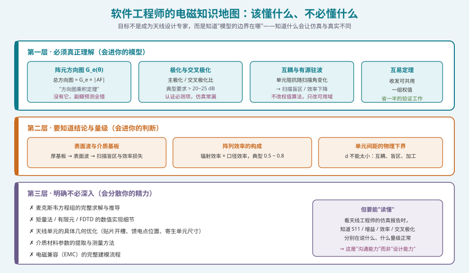
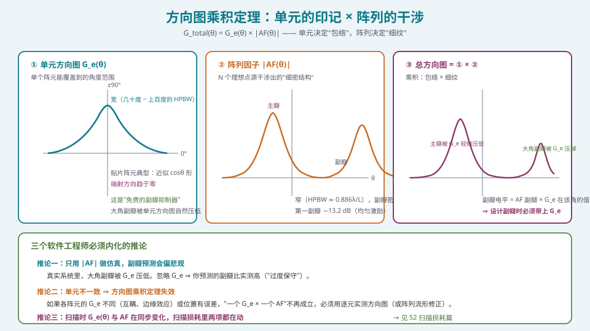
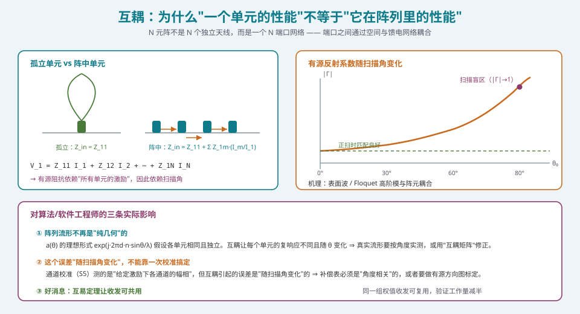

## 本篇要解决什么

这是 S1 的最后一篇，也是最"反直觉"的一篇——因为它的核心结论之一是：**有四件事你明确不必深入学。**

先看这个问题的背景。当你翻完 [天线理论](https://guizang.github.io/antennas) 一类的教材目录，会看到麦克斯韦方程组、位函数、镜像法、矩量法、有限元……一个软件工程师看到这些的第一反应是"我是不是得先把这些啃完"？

**不必。** 而且反过来说：**试图啃完它们，是对时间的严重浪费。**

原因在于，相控阵系统里，电磁学的角色是**"模型误差的来源"，而不是"算法设计的对象"**：

| 你的角色 | 你需要电磁学做什么 |
| --- | --- |
| 算法设计 | 知道"理想模型在什么条件下不成立"，以便在算法里加稳健项 |
| 系统仿真 | 知道哪些效应必须建模（否则仿真乐观），哪些可以忽略 |
| 测试分析 | 知道哪些指标（交叉极化、有源驻波）会解释你在测试里看到的异常 |
| 需求评审 | 知道"这个指标在物理上是否可能"（例如：口径效率不可能 100%） |

**所以本篇的定位是"知识地图"而非"知识本身"**：帮你划清"必须懂 / 知道结论 / 不必深入"三条线，并在"必须懂"的那一层给出足够扎实的结论。

*图 1：三层知识地图。第一层会进你的模型，第二层会进你的判断，第三层会分散你的精力*

---

## 一、阵元方向图与方向图乘积定理

### 1.1 定理本身

相控阵里最有用、最容易用错的一条定理：

\[
\boxed{\;G_{\text{total}}(\theta) = G_e(\theta)\times |AF(\theta)|\;}
\]

其中：

- **\(G_e(\theta)\)** 是**单个阵元**的方向图（也叫单元因子、element pattern）
- **\(|AF(\theta)|\)** 是**阵列因子**——假设所有阵元都是**理想点源**（各向同性）时的干涉结果

**为什么这条定理成立？** 前提是三个假设：

1. **阵元相同**：所有单元的 \(G_e\) 一模一样
2. **阵元互不影响**：每个单元的方向图不因邻居的存在而改变
3. **远场叠加**：远场任意点的场是各单元场的矢量叠加

**这三个假设里，第 2 条几乎从来不严格成立**（这就是互耦，见第三节），第 1 条在边缘单元上也不成立。**所以方向图乘积定理是一个"起点"，不是一个"终点"。**

### 1.2 直觉：包络 × 细纹

*图 2：单元方向图是"宽包络"，阵列因子是"细密结构"，总方向图是两者相乘*

用一句好记的话说：

> **阵列因子决定"哪里有几根刺"，单元方向图决定"这些刺最长能有多长"。**

**典型阵元方向图的形状与量级**：

| 阵元类型 | 方向图近似 | 典型 HPBW | 备注 |
| --- | --- | --- | --- |
| 半波振子（垂直阵列轴） | \(\cos(\frac{\pi}{2}\sin\theta)/\cos\theta\) | ~78° | 端射方向有零点 |
| 微带贴片（最常用） | \(\approx \cos\theta\) | 65° ~ 90° | 端射趋于零，天然抑制大角副瓣 |
| 贴片（带地平面、厚基板） | \(\cos^{1.5}\theta\) ~ \(\cos^2\theta\) | 50° ~ 70° | 更"聚焦"，扫描范围受限 |
| 波导缝隙 / 喇叭阵元 | 更窄 | 20° ~ 40° | 用于高增益、窄扫描需求 |

### 1.3 关键推论：只用 \(|AF|\) 仿真会"偏悲观"

这是本节最重要的工程结论。

**因为 \(G_e(\theta)\) 在大角度上趋于零，而阵列因子的副瓣在大角度上也会出现**，所以：

\[
\text{实测大角副瓣} = \underbrace{AF_{\text{副瓣}}}_{\text{可能只有 } -13\text{ dB}} \times \underbrace{G_e(\theta_{\text{副瓣}})}_{\text{可能只有 } 0.2} \;\ll\; AF_{\text{副瓣}}
\]

**后果**：如果你用纯阵列因子（理想点源）仿真，会预测出**比实测高很多的大角副瓣**。这个偏差是"过度保守"，看起来"安全"，但实际上会让你：

- 误判方案不可行（实际可行）
- 对加窗量做过多的要求（实际不需要那么大）
- 在需求评审里给出错误的副瓣包络

**怎么处理**：
- **快速评估**：用 \(\cos\theta\) 或 \(\cos^{1.5}\theta\) 作为单元方向图的粗略近似，乘上去再看副瓣。
- **精度要求高时**：用**实测单元方向图**（或者阵列中单元的"有源方向图"，包含了互耦影响）。
- **注意近正扫的副瓣**：单元方向图在正扫附近≈1，那里**必须**按 \(|AF|\) 严格设计。

> **一个很有用的记忆方式**：**副瓣是靠"远角"工作的，而远角正是单元方向图最弱的地方。** 所以现实中的大角副瓣，通常比你担心的低。

### 1.4 什么时候乘积定理彻底失效

三种情况必须放弃"一个 \(G_e\) × 一个 \(AF\)"：

1. **边缘效应**：阵列边缘单元与中心单元的环境不同（邻居数量不同），\(G_e\) 不同。
2. **互耦随角度变化**：不同扫描角下各单元的激励不同，有源方向图不同（这是 \(G_e\) **随扫描角变化**）。
3. **单元间不一致**（制造公差、位置误差、馈电差异）。

**处理方式**：改用**逐元有源方向图**或**阵列流形修正**：

\[
G_{\text{total}}(\theta) = \left|\sum_n w_n\, g_n(\theta)\, e^{j\phi_n(\theta)}\right|
\]

其中 \(g_n(\theta)\) 是第 \(n\) 个单元的**有源方向图**（既包含自身特性，也包含互耦）。**这就是从"解析模型"走向"测量-建模"的分界线**，也是 [通道误差的来源与影响](pa-channel-error-impact.html) 里要处理的误差来源之一。

---

## 二、极化与交叉极化

### 2.1 极化的物理含义

电磁波的**极化**是电场矢量随时间变化的轨迹形状。对天线而言，极化是"这个天线主要响应哪个方向的电场"。

| 极化类型 | 电场矢量轨迹 | 描述 |
| --- | --- | --- |
| 线极化（LP） | 一条直线 | 最常见；分水平/垂直/斜 |
| 圆极化（CP） | 一个圆 | 分左旋（LHCP）/右旋（RHCP） |
| 椭圆极化（EP） | 一个椭圆 | 最一般的形式 |

**极化匹配**：接收天线与来波极化一致时，接收功率最大；正交时，理论上接收为零（−∞ dB）。这个"零"在实用中不会出现，因为总是存在**交叉极化分量**。

### 2.2 交叉极化隔离度（XPD）

\[
\mathrm{XPD} = 10\log_{10}\frac{P_{\text{co-pol}}}{P_{\text{cross-pol}}} \quad [\text{dB}]
\]

**典型指标的工程量级**：

| 场景 | 典型 XPD 要求 | 备注 |
| --- | --- | --- |
| 一般通信阵列 | \(> 20\) dB | 常见设计目标 |
| 高要求通信 / 卫星上行 | \(> 25\) ~ \(30\) dB | 需要双极化馈电网络 |
| 极化复用（同一频点两个极化） | \(> 25\) dB（含波束扫描角内） | **"轴比"必须同时在整带内达标** |
| 3GPP FR2 相关测试 | 有明确定义，通常在 20 dB 量级 | 见 TS 38.101-2 与测试方法 |

**为什么它重要**：交叉极化不只是"浪费能量"。在**极化复用**（polarization reuse，同一频点用两个正交极化通信）的系统里，交叉极化直接变成**通道间干扰**。所以 XPD 决定了"极化复用能不能用"。

### 2.3 为什么软件工程师容易漏掉它

**原因**：大多数阵列仿真工具默认"理想线极化阵元"，交叉极化在理想模型里**根本不存在**。直到实测才发现 XPD 只有 15 dB，而要求是 25 dB。

**交叉极化的真实来源**：

1. **阵元本身**：贴片的交叉极化电平与其几何、馈电方式强相关（例如，双馈圆极化单元的端口不平衡直接产生交叉极化）。
2. **互耦**：相邻单元的耦合会把一部分主极化能量"旋转"成交叉极化。**这一项在大阵里是重要来源。**
3. **馈电网络的不对称**：走线、过孔、接地不完整都会引入不对称。
4. **阵列边缘与结构件**：金属边框、散热器、外壳会在某些角度上散射出交叉极化。
5. **波束扫描**：**扫描后交叉极化通常会变差**——因为阵列的"极化纯度"依赖各单元的极化矢量在空间中同向，扫描后各单元的极化矢量在远场方向上不再完全同向。

> **一个非常实际的提醒**：**交叉极化的最坏值往往出现在扫描边缘，而不是正扫。** 如果你只在正扫测 XPD，会得到一个乐观的数。**测试大纲必须覆盖最大扫描角。**

### 2.4 关于圆极化（CP）的额外概念：轴比

如果系统用圆极化，关键的指标不是 XPD，而是**轴比（Axial Ratio, AR）**：

\[
\mathrm{AR} = 20\log_{10}\left(\frac{E_{max}}{E_{min}}\right) \quad [\text{dB}]
\]

**理想圆极化的 AR = 0 dB**（长短轴相等）。工程上典型要求 AR < 3 dB（即 \(E_{max}/E_{min} < 1.41\)）。

**注意**：**AR 与 XPD 不是同一个量**，且**AR 必须在一个带宽内和整个波束角内都达标**。GNSS 接收阵、卫星通信载荷常要求 AR < 3 dB，这是一个"带宽 + 角度"的二维约束，在阵列里很难在两个维度同时做好——**这正是交叉极化工程难点所在。**

---

## 三、互耦：最影响算法的那一项

### 3.1 物理图像

N 元阵列**不是 N 个独立天线**，而是一个**N 端口网络**：

\[
\begin{bmatrix}V_1\\ V_2\\ \vdots\\ V_N\end{bmatrix}
=
\begin{bmatrix}Z_{11} & Z_{12} & \cdots & Z_{1N}\\
Z_{21} & Z_{22} & \cdots & Z_{2N}\\
\vdots & \vdots & \ddots & \vdots\\
Z_{1N} & Z_{2N} & \cdots & Z_{NN}\end{bmatrix}
\begin{bmatrix}I_1\\ I_2\\ \vdots\\ I_N\end{bmatrix}
\]

**关键点**：第 1 个端口看到的**输入阻抗**不只是 \(Z_{11}\)，而是：

\[
Z_{\text{in},1} = \frac{V_1}{I_1} = Z_{11} + \sum_{m\ne1} Z_{1m}\frac{I_m}{I_1}
\]

**注意最后那个比值 \(I_m/I_1\)**：它由**激励决定**，因此**由扫描角决定**。

> **这就是互耦最重要的性质**：**互耦对单元的影响是"随扫描角变化"的。**

*图 3：左：孤立单元与阵中单元的区别。右：有源反射系数随扫描角变化，在大角处可能接近 1，形成"扫描盲区"*

### 3.2 有源驻波比（Active VSWR）

工程上用**有源反射系数**来量化：

\[
\Gamma_{\text{active}}(\theta_0) = \frac{Z_{\text{in}}(\theta_0) - Z_0}{Z_{\text{in}}(\theta_0) + Z_0}
\]

对应**有源驻波比**：

\[
\mathrm{VSWR}_{\text{active}} = \frac{1 + |\Gamma_{\text{active}}|}{1 - |\Gamma_{\text{active}}|}
\]

**典型工程要求**：扫描范围内 \(\mathrm{VSWR}_{\text{active}} < 2\)（即 \(|\Gamma| < 0.33\)，约 −9.5 dB）。

**为什么这个指标很硬**：
- \(|\Gamma|\) 大 ⟹ 功率被反射回去 ⟹ 发射效率下降、PA 可能损坏
- 反射波会在馈电网络里形成驻波，影响其他单元
- \(|\Gamma| \to 1\) 就是**扫描盲区（scan blindness）**：那个扫描角上阵列基本不工作

### 3.3 扫描盲区（Scan Blindness）

**定义**：在某些扫描角上，阵列的辐射/接收能力**崩塌**（有源反射接近 1）。

**两种主要机理**：

1. **表面波耦合**（见第四节）：介质基板支持表面波，当某个扫描角使得"栅瓣（Floquet 高阶模）与表面波发生相位匹配"时，能量被强烈耦合进表面波而不辐射出去。
2. **馈电网络谐振**：馈线之间的耦合在特定频率/角度上共振。

**工程对策**（知道"有对策"就够了，不必会做）：

| 对策 | 思路 | 代价 |
| --- | --- | --- |
| 调节 \(d/\lambda\) | 改变 Floquet 模与表面波的匹配条件 | 受栅瓣约束，可行区间窄 |
| 薄基板 / 高介电常数 | 抑制表面波激发 | 带宽变窄 |
| EBG / 过孔墙 | 结构上阻断表面波 | 加工复杂度上升 |
| 加介质覆盖层 | 改变等效表面波条件 | 重量、损耗 |

### 3.4 对算法/软件工程师的三条实际影响

**影响一：真实阵列流形不是"纯几何"的。**

理想流形 \(a_n(\theta) = e^{j2\pi(d/\lambda)n\sin\theta}\) 假设各单元相同且独立。互耦让每个单元的复响应不同，**且随角度变化**。所以：

\[
a_{\text{real}}(\theta) \ne a_{\text{ideal}}(\theta)
\]

**实践中怎么办**：
- **建模阶段**：用 CST/HFSS 的"无限阵 + 周期边界"仿真导出**有源单元方向图**，用它替代理想 \(G_e\)。
- **算法阶段**：在流形里引入"互耦矩阵"修正 \(a_{\text{real}} = C \cdot a_{\text{ideal}}\)（\(C\) 是与角度相关的矩阵）。
- **测量阶段**：直接在暗室里测各角度的有源方向图（成本高但对高要求系统值得）。

**影响二：这个误差"随扫描角变化"，一次校准解决不了。**

这一点在 [通道误差的来源与影响](pa-channel-error-impact.html) 里会详述，但这里先给出结论：

> **通道校准（S5）测的是"给定激励下各通道的幅相不一致"，而互耦引起的误差是"随扫描角变化"的。所以补偿表必须是"角度相关"的，或者必须做有源方向图标定。**

**这是一个非常重要的架构决策点**：如果系统只需要扫几个固定角度（如卫星星座跟踪），可以**逐角度标定**；如果要连续扫描，就需要**建模 + 插值**，成本和复杂度都上升。

**影响三：好消息——互易定理让收发可共用。**

**互易定理（Reciprocity Theorem）**：对无源线性各向同性媒质中的天线，**发射方向图与接收方向图相同**（幅度与相位都相同）。

**工程价值**：**同一组权值，收发可以共用。** 这直接带来：
- 只需要标定一次（虽然实际系统常因收发链路不同而分别标定）
- 算法设计只需要做一套
- **验证工作量减半**

**注意边界**：互易定理在**含铁氧体、等离子体、有源器件（如放大器）**的路径上不成立。相控阵的**天线部分**满足互易，但**收发链路的差异（PA/LNA）**必须分别处理。**所以"权值共用"通常是成立的，"校准系数共用"往往不成立。**

---

## 四、表面波与介质基板（知道结论即可）

### 4.1 什么是表面波

介质基板（如 PCB、陶瓷）支持一种沿介质表面传播、能量集中在介质内的波——**表面波（surface wave）**。它不由天线辐射出去，而是"沿着板子跑"。

**表面波的两个坏处**：
1. **能量泄漏**：本该辐射出去的能量变成了板内传播，**降低辐射效率**。
2. **边缘辐射与耦合**：表面波跑到板边被反射/绕射，形成**杂散辐射**，抬高副瓣、恶化交叉极化、干扰其他单元。

### 4.2 什么时候要担心

**激发强度与基板厚度正相关**。常用的判据（工程经验）：

\[
h < \frac{0.3\lambda_0}{\sqrt{\varepsilon_r}} \quad \text{（一般不会显著激发表面波）}
\]

其中 \(h\) 是基板厚度，\(\varepsilon_r\) 是相对介电常数。

**举例**：\(\varepsilon_r = 3\)、28 GHz（\(\lambda_0 = 10.7\) mm）时，\(\lambda_0/\sqrt{3} = 6.2\) mm，0.3 倍是 1.85 mm。**典型 mmWave 板厚 0.1~0.5 mm，远低于此——所以 mmWave 平面阵一般不用担心表面波。**

**反过来**：低频（\(\lambda_0\) 大）或高 \(\varepsilon_r\) 的厚基板，就比较危险。

### 4.3 与扫描盲区的关系

表面波与扫描盲区的耦合机理（知道这个"故事"就够了）：

> 在无限阵中，当某个扫描角使**栅瓣（Floquet 高阶模）**的传播常数与**表面波的传播常数**相匹配时，两者强烈耦合，能量被导入表面波 → 有源反射系数剧增 → **扫描盲区**。

**这解释了一个重要的工程现象**：**扫描盲区出现的位置与 \(d/\lambda\) 和基板参数强相关**——所以调 \(d\) 是应对盲区的第一手段。但 \(d\) 又受栅瓣约束（[上一篇](pa-sampling-aliasing-grating.html)），**这是一个典型的"两边都是墙"的设计问题**。

---

## 五、明确不必深入的四件事

这一节是本篇"最省时间"的部分。

### 5.1 不必深入：麦克斯韦方程组的完整推导与求解

**为什么不必**：你的工作不涉及"求解场分布"。**你需要的所有场相关信息，都已经被人总结成"格元方向图"+"互耦矩阵"+"表面波判据"这些**可用的中间量**了。

**需要的最低限度**：
- 知道**波长、频率、相速**的关系 \(c = \lambda f\)
- 知道**平面波在自由空间的传播**（相位随距离线性变化 → 这是所有"相位差"公式的来源，见 [复数篇](pa-math-complex-phasor.html)）
- 知道**电场矢量有方向**（这就是极化）

**这三点已经覆盖了你 95% 的需求。**

### 5.2 不必深入：矩量法 / 有限元 / FDTD 的数值实现

**为什么不必**：这些是**天线设计师**用来算单元特性的工具。你只需要**读结果**（S11 曲线、增益、方向图、效率），不需要**实现算法**。

**需要的限度**：
- 知道这些方法的**名字与适用场景**（矩量法：线天线/金属结构；有限元：复杂结构/宽频；FDTD：宽带/瞬态）
- 知道结果的**可信度判据**（网格收敛、边界条件、端口设置）——但这些应在与设计师沟通时询问，而不是自己判断

### 5.3 不必深入：天线单元几何的优化

**为什么不必**：贴片开槽、馈电点位置、寄生单元尺寸、缝隙宽度——这些是**单元设计师**的工作。你在这里花一周，收益远低于在算法上花一周。

**需要的限度**：
- 知道**单元类型与它的大致方向图/带宽特性**（见 §1.2 的表）
- 知道**单元决定带宽**（阵列的带宽通常被单元带宽卡住）
- 知道**单元间距的物理下界**（互耦、加工、馈电网络布线）

### 5.4 不必深入：材料参数的提取与 EMC 完整建模

**为什么不必**：材料参数（\(\varepsilon_r\)、\(\tan\delta\)）由板材厂商提供或由实验室测量；EMC 建模是专门的工程领域。

**需要的限度**：
- 知道 **\(\tan\delta\)（损耗角正切）越大，板内损耗越大**，影响效率
- 知道 **\(d\) 的选择与 \(\varepsilon_{\text{eff}}\) 有关**（介质中的等效波长更短，所以同样的物理间距对应更大的电长度）

> **一句总结**：**你要的是"边界感"，不是"深度"。** 知道自己的模型在什么条件下失真、失真多严重、如何用一句话向设计师求证——这就是电磁学对软件工程师的全部价值。

---

## 六、常见误区清单

**误区一：以为 \(G_{\text{total}} = G_e \times |AF|\) 总是成立。**
它需要三个假设（阵元相同、互不影响、远场叠加），其中"互不影响"几乎从不成立。**在大阵、宽扫描、高精度需求下，必须用有源方向图或流形修正。**

**误区二：只用 \(|AF|\) 评估副瓣，得出"过度悲观"的结论。**
单元方向图会自然压低大角副瓣。用理想点源仿真会给出比实测高的副瓣预测。**这会让你在方案取舍上做出错误判断（例如过度加窗，牺牲了不该牺牲的主瓣宽度）。**

**误区三：认为交叉极化是"次要指标"。**
在**极化复用**系统里，交叉极化直接等于通道干扰。而且**扫描边缘的交叉极化通常最差**，只测正扫会给出乐观结果。

**误区四：把轴比（AR）和交叉极化隔离度（XPD）混为一谈。**
它们是不同的量。圆极化系统看 AR（< 3 dB 是常见要求），线极化系统看 XPD。**AR 需要在带宽和波束角内同时达标，是二维约束。**

**误区五：认为互耦是"可以一次性校准掉的固定误差"。**
互耦引起的误差**随扫描角变化**（因为它依赖激励）。单组固定校准系数无法覆盖所有扫描角。**这直接决定校准架构：要逐角度标定，还是要建模 + 插值。**

**误区六：以为"\(d\) 越小互耦越小"。**
**反了。** \(d\) 越小，单元越近，互耦**越强**。这才是"\(d\) 有下界"的原因。\(d\) 的可行区间被两侧夹住：**上界由栅瓣决定，下界由互耦/盲区/加工决定。**

**误区七：认为互易定理意味着"收发校准系数可以共用"。**
**天线部分**满足互易（方向图相同），但**收发链路不同**（PA 与 LNA 的幅相特性、滤波器、开关不同）。所以"权值算法可共用"成立，"校准系数可共用"通常不成立。

**误区八：忽略介质对电长度的影响。**
介质中 \(\lambda_{\text{eff}} = \lambda_0/\sqrt{\varepsilon_{\text{eff}}}\)，所以**同样的物理间距在介质中对应更大的电长度**。用 \(d/\lambda_0\) 判断栅瓣时，如果单元处于介质中（印刷天线），需要用**介质中的等效波长**。**这也是为什么"PCB 上的天线间距"不能简单地按真空波长算。**

---

## 七、快速自测

**Q1.** 写出方向图乘积定理，并列出它成立的三个假设。指出哪一个假设在真实阵列里几乎从不成立。

参考要点

\(G_{\text{total}}(\theta) = G_e(\theta)\times|AF(\theta)|\)。
**三个假设**：① 所有阵元相同；② 阵元互不影响（各自的方向图不因邻居而改变）；③ 远场线性叠加。
**几乎从不成立的是 ②**：因为互耦总是存在（见 §3）。准确说法是"阵元的有源方向图会因邻居的激励而改变"，而激励又随扫描角变化，所以单元方向图实际上**随扫描角变化**。
**近似可接受的条件**：\(d\) 适中（0.4~0.5λ）、阵元数不太大（互耦影响以边缘为主）、或用均匀大阵的"无限阵"近似（此时互耦对每个单元影响相同，等效于一个共同的 \(G_e\)）。

**Q2.** 为什么只用阵列因子（理想点源）预测副瓣会"偏悲观"？给出一个具体的角度范围说明。

参考要点

因为真实阵元的方向图 \(G_e(\theta)\) 在偏离正扫方向时下降（典型 \(\cos\theta\) 或 \(\cos^{1.5}\theta\)）。而阵列因子的**大角副瓣**恰好落在这些 \(G_e\) 已经下降的角度上，所以：
实测大角副瓣 = \(AF_{\text{副瓣}} \times G_e(\theta_{\text{副瓣}})\)，**比 \(AF_{\text{副瓣}}\) 低很多**。
**举例**：一个 \(\cos\theta\) 单元的 32 元阵，\(AF\) 在 \(\theta = 60°\) 处有个 −13 dB 的副瓣，则实测该副瓣约为 −13 + 20log₁₀(cos60°) = −13 + 20log₁₀(0.5) = −13 − 6 = **−19 dB**。
**但注意**：正扫附近的副瓣（\(\theta\lesssim20°\)）处 \(G_e \approx 1\)，**必须严格按 \(AF\) 设计**。所以准确的说法是"大角副瓣偏悲观，近角副瓣必须严格"。

**Q3.** 什么是交叉极化隔离度（XPD）？为什么在极化复用系统里它直接等于干扰？为什么扫描边缘的 XPD 通常最差？

参考要点

\(\mathrm{XPD} = 10\log_{10}(P_{co}/P_{cross})\)。
**极化复用时**：同一频点上，两个正交极化各承载一路数据。如果 XPD 只有 20 dB，那么每个极化会向另一个极化泄漏 −20 dB 的功率——**这就是同频同波束内的通道间干扰**，直接限制 SINR 与频谱效率。所以 XPD 直接决定极化复用能不能用。
**扫描边缘最差的原因**：阵列的"极化纯度"依赖各单元在主极化方向上的辐射矢量在远场方向上**同向**。扫描到边缘时，各单元到远场观察点的几何关系不对称，主极化矢量在远场方向上的投影**方向出现离散**，一部分能量投影到交叉极化方向上。此外，边缘单元的互耦环境不同，也会引入不对称。所以**扫描边缘的 XPD 通常比正扫差 3~8 dB。**

**Q4.** 为什么说"互耦导致的误差不能靠一次校准搞定"？这对校准架构有什么影响？

参考要点

**原因**：互耦对单元输入阻抗/方向图的影响取决于**所有单元的激励**（\(Z_{\text{in},1} = Z_{11} + \sum Z_{1m}I_m/I_1\)），而激励（即配相）由扫描角决定。所以：
- 正扫时各单元同相，互耦影响是某种形式；
- 扫到 60° 时各单元有线性相位斜坡，互耦影响**另一种形式**；
- 所以"通道误差"是一个**角度相关的量**，单组固定系数无法覆盖。
**对校准架构的影响**：
1. **逐角度标定**：在若干个离散扫描角上分别标定，用插值覆盖中间角度。适用于扫描角不多、精度要求高（如卫星跟踪）的场景。
2. **建模 + 外推**：建立互耦模型（从仿真或实测提取），按角度计算修正。适用于连续扫描、需要自适应系统的场景。
3. **有源方向图标定**：直接在暗室测各角度的有源方向图，精度最高、成本最高。
**架构决策点**：这个选择必须在系统设计早期确定，因为它决定了波控软件的数据结构（是"一个系数表"还是"一个角度索引的系数表 + 插值算法"）。

**Q5.** 为什么"\(d\) 越小互耦越小"是错的？给出"\(d\) 可行区间"的两侧约束。

参考要点

**错的**：互耦随单元间距减小而**增强**（单元间的近场耦合 ∝ \(1/d^3\) 为主，还有表面波与馈电网络耦合）。所以 \(d\) 越小，互耦越强。
**两侧约束**：
- **上界（栅瓣约束）**：\(d \le \lambda/(1+\sin\theta_{max})\)，全半球扫描时 \(d\le\lambda/2\)。
- **下界（互耦/工程约束）**：\(d \gtrsim 0.3\sim0.4\lambda\)。低于此：互耦剧增 → 有源驻波恶化、扫描盲区风险上升、加工与馈电网络布线困难。
**可行区间**：约 \(0.4\lambda \sim 0.5\lambda\)（某些应用中放宽到 \(0.3\lambda\sim0.5\lambda\)）。**这是一个"夹心"设计窗口，不是单向优化问题。**
**额外提醒**：如果使用介质基板，判断"电尺寸"时应考虑介质中的等效波长（\(\lambda_{\text{eff}} = \lambda_0/\sqrt{\varepsilon_{\text{eff}}}\)），此时对应的**物理间距会更小**。

**Q6.** 互易定理的内容是什么？它给工程带来什么便利？它的边界在哪（即什么时候不成立）？

参考要点

**内容**：对位于无源、线性、各向同性媒质中的天线，**发射方向图与接收方向图相同**（幅度与相位都相同）。等价地，天线作为发射和接收时的等效电路参数一致。
**便利**：
1. **权值算法只需做一套**（收发共用）；
2. **方向图测量只需测一次**（可以用发射测，也可以用接收测，结果相同）；
3. **验证工作量减半**。
**边界**：
- 含**各向异性媒质**（铁氧体、等离子体）时不成立；
- 含**有源器件**（放大器、混频器）时不成立；
- 含**非线性器件**时不成立。
**对相控阵的实际影响**：**天线与馈电网络部分**满足互易（因此"理想权值"收发共用），但**收发链路（PA vs LNA、滤波器、开关）不同**，所以**校准系数必须分别处理**。这是一个很容易被忽略的细节——"互易"给你的是算法上的便利，不是校准上的。

**Q7.** 一个 28 GHz 的微带贴片阵，基板 \(\varepsilon_r = 3.0\)、厚 0.254 mm。需要担心表面波吗？如果换成 \(\varepsilon_r = 10.2\)、厚 1.27 mm 呢？

参考要点

28 GHz 时 \(\lambda_0 = c/f = 10.7\) mm。
**情形一**：\(\varepsilon_r = 3.0\)，\(h = 0.254\) mm。判据 \(h < 0.3\lambda_0/\sqrt{\varepsilon_r} = 0.3\times10.7/1.732 = 1.85\) mm。\(0.254 \ll 1.85\) ⟹ **不必担心表面波**。
**情形二**：\(\varepsilon_r = 10.2\)，\(h = 1.27\) mm。判据 \(= 0.3\times10.7/\sqrt{10.2} = 0.3\times10.7/3.19 = 1.006\) mm。\(1.27 > 1.006\) ⟹ **超过判据，需警惕**。
**实际的连带影响**：
1. 高 \(\varepsilon_r\) 让介质中波长缩短到 \(\lambda_{\text{eff}} = 10.7/\sqrt{10.2_{\text{eff}}} \approx 3.4\) mm 量级——**这意味着"电尺寸"变大，同样的物理间距对应更大的电间距，栅瓣会更早出现**。
2. 同时，高 \(\varepsilon_r\)、厚基板的贴片带宽通常更窄（带宽 ∝ 厚度/介电常数）。
**结论**：**基板选择不只影响单元性能，还会通过"等效波长"改变阵列层面的栅瓣条件**。这是"单元-阵列"耦合的一个具体例子，也是为什么系统设计不能只按真空波长算。

---

## 八、与本站其它专题的连接

| 想了解 | 看哪篇 |
| --- | --- |
| S1 其他三篇（复数 / 空间频率 / 采样） | [相控阵的数学语言](pa-math-complex-phasor.html) ｜ [空间频率与空间傅里叶变换](pa-spatial-frequency-fft.html) ｜ [采样、混叠与栅瓣的同一性](pa-sampling-aliasing-grating.html) |
| 阵列因子的完整推导（用 \(G_\text{total} = G_e\times AF\) 的下一站） | [阵列因子：从两个阵元到 N 个阵元](pa-array-factor.html) |
| 增益与效率的定量构成（阵列效率 η 的分解） | [波束宽度、增益与孔径](pa-beamwidth-gain-aperture.html) |
| \(d\) 的两侧约束与工程取值 | [λ/2 准则：栅瓣的成因、抑制与例外](pa-half-wavelength-criterion.html) |
| 互耦对馈电网络与效率的影响 | [功分合成网络与互耦效应](pa-feed-network-mutual-coupling.html) |
| 通道误差的分类与影响（含互耦项） | [通道误差的来源与影响](pa-channel-error-impact.html) |
| T/R 组件与噪声系数、G/T | [T/R 组件与射频前端：一份手册怎么读](pa-tr-module-rf-frontend.html) |
| 交叉极化与旁瓣的认证要求 | [规范与认证地图：从 38.101 到 CTIA 到 ITU-R](pa-conformance-standards.html) |
| 卫星链路与极化复用 | [5G NTN 非地面网络](5g-ntn.html) ｜ [NTN 射频频段与共存](ntn-rf-bands-coexistence.html) |
| 学习体系全貌 | [相控阵天线学习体系：六阶段路线图](phased-array-roadmap.html) |

---

## 九、延伸阅读

**教材（按"性价比"排序）**
- Balanis, *Antenna Theory: Analysis and Design*, 4th ed.，**第 2 章（基本参数：方向图、增益、极化、效率）与第 6.5 节（互耦）**。这是本文最重要的两处出处，且难度适中——第 2 章的实际内容远没有目录看起来那么吓人。
- Mailloux, *Phased Array Antenna Handbook*, 3rd ed.，**第 7 章（互耦与阵列性能）与第 8 章（表面波与扫描盲区）**。处理方式非常工程化，是本文 §3、§4 的直接来源。
- Hansen, *Phased Array Antennas*, 第 7 章。互耦的有源反射系数分析方法。

**期刊综述（一次读透互耦）**
- Mutual coupling 综述文献（如 IntechOpen 的 "Mutual Coupling in the Antennas" 章节）。含耦合机理、分析方法（无限阵 + Floquet 模）与降耦技术（EBG、缺陷地、中和线）的分类。
- 扫描盲区：可搜索 "scan blindness phased array surface wave"，含大量毫米波阵列的实例。

**工程应用笔记（最省时间的入门）**
- Analog Devices, *Phased Array Antenna Patterns* 系列（Part 1~3）。对"单元方向图 × 阵列因子"的处理极清楚，配图可直接复现。
- Keysight, *How to Design and Test a Phased Array Antenna*，第 3 章（阵列效率、极化）。含实测数据的量级参考。
- 任意一份毫米波相控阵芯片（如 ADI / Anokiwave）的应用笔记。**它们会告诉你真实的量产阵列如何权衡 \(d\)、极化、互耦——这比教材更贴近工程现场。**

**一句话建议**：**如果时间有限，只读 Balanis 第 2 章 + Mailloux 第 7 章。** 这两处覆盖了本文 90% 的实用性内容，剩下的可以在遇到具体问题时按需查阅。
