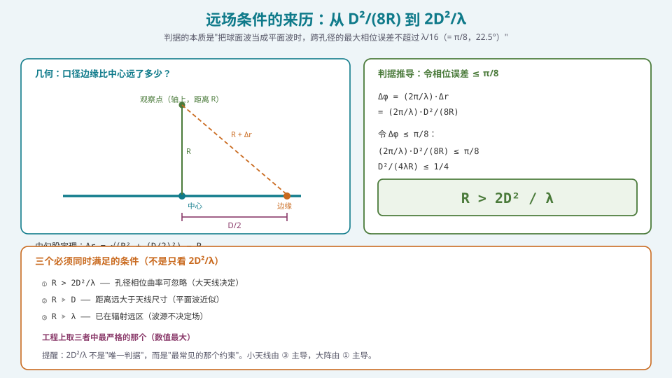
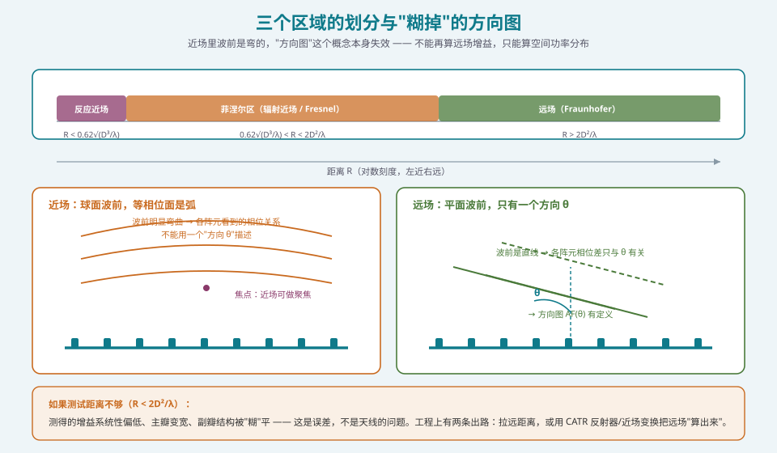

## 本篇要解决什么

前两篇分别解决了两件事：用什么表示（[复数](pa-math-complex-phasor.html)）、用什么变量（[空间频率](pa-spatial-frequency-fft.html)）。而 [采样、混叠与栅瓣的同一性](pa-sampling-aliasing-grating.html) 处理了模型在**空间维度**上的适用边界。

这一篇处理模型的**另一条边界：距离维度**。

整个相控阵理论有一句从未被大声说出的前提：

> **来波是平面波。**

为什么？因为只有这样，"相邻阵元的波程差 = \(d\sin\theta\)"这个式子才成立。如果来波是球面波，那么每一对阵元之间的波程差都**不一样**，"方向 \(\theta\)"这个单一参数根本无法描述这个场。

问题是：**现实里哪来的平面波？** 都是球面波（点源发出的），不过是"距离足够远之后，球面的一小块近似于平面"。所以我们要问的是：

**多远才算"足够远"？**

这个问题的答案就是**弗劳恩霍夫距离（Fraunhofer distance）**：

\[
\boxed{\;R > \frac{2D^2}{\lambda}\;}
\]

本篇要做四件事：

| 目标 | 内容 |
| --- | --- |
| **推出它** | 从勾股定理出发，得到 \(\Delta r \approx D^2/(8R)\)，令相位误差 ≤ \(\pi/8\) |
| **理解它** | 物理含义是"跨孔径的最大相位误差 ≤ 22.5°"，不是"某个魔法数字" |
| **知道它不满足时会怎样** | 方向图"糊掉"、增益系统性偏低、副瓣失真 |
| **知道工程上怎么应对** | 三条路：拉远距离 / CATR / 近场变换 |

> **一句话定位**：这是 S1 的第四篇。它和 [采样篇](pa-sampling-aliasing-grating.html) 一起，把相控阵模型的**两个边界**（空间采样边界、距离边界）讲清楚。**边界搞错，后面的仿真、算法、测试全都会得出"看起来合理但实际错误"的结论**——这是最难被发现的错误类型。

---

## 一、判据推导：从勾股定理到 \(2D^2/\lambda\)

### 1.1 几何与近似

考虑一个口径为 \(D\) 的天线（或阵列），观察点在**轴线上**，距离 \(R\)。

- **从中心**到观察点：\(R\)
- **从边缘**到观察点：\(\sqrt{R^2 + (D/2)^2}\)

两者之差就是**最大波程差**：

\[
\Delta r = \sqrt{R^2 + \left(\frac{D}{2}\right)^2} - R
\]

当 \(R \gg D\)（这是我们关心的情形）时，用二项式展开 \(\sqrt{R^2 + x} = R\sqrt{1 + x/R^2} \approx R(1 + \frac{x}{2R^2})\)：

\[
\Delta r \approx R\left(1 + \frac{(D/2)^2}{2R^2}\right) - R = \frac{D^2}{8R}
\]

**这个 \(D^2/(8R)\) 是整篇推导的核心。** 它说的是：**"口径越大，波前弯曲带来的边缘-中心波程差越大；距离越远，这个差越小。"**

对应的最大相位误差：

\[
\Delta\varphi_{max} = \frac{2\pi}{\lambda}\Delta r = \frac{2\pi}{\lambda}\cdot\frac{D^2}{8R}
\]



*图 1：几何与推导。左：边缘路径比中心路径长的量是 D²/(8R)。右：令相位误差 ≤ π/8，解出 R > 2D²/λ*

### 1.2 为什么门槛是 \(\pi/8\)（22.5°）

这是一个**约定值**，不是物理临界点。它来自天线工程的经典传统（Balanis、Silver 等教材沿用）：

\[
\Delta\varphi_{max} \le \frac{\pi}{8} \quad (= 22.5°)
\]

代入：

\[
\frac{2\pi}{\lambda}\cdot\frac{D^2}{8R} \le \frac{\pi}{8}
\;\Longrightarrow\;
\frac{D^2}{4\lambda R} \le \frac{1}{4}
\;\Longrightarrow\;
\boxed{\;R \ge \frac{2D^2}{\lambda}\;}
\]

**注意这里的 \(\lambda/16\) 等价说法**：\(\Delta\varphi = \pi/8\) 对应 \(\Delta r = \lambda/16\)。所以判据也可以读作"**路径差不超过 \(\lambda/16\)**"。这两种表述完全等价，在文献里都常见。

### 1.3 一个必要的诚实：这个判据不是"物理临界"

必须说清楚三件事，否则你会被这个公式误导：

**（1）\(\pi/8\) 是工程折中，不是物理定律。**
取 \(\pi/10\) 会得到 \(R > 2.5D^2/\lambda\)，取 \(\pi/4\) 会得到 \(R > D^2/\lambda\)。不同教材、不同标准用的门槛略有差异。**关键是"相位误差小到什么程度可以忽略"，而这个"可以忽略"由应用精度要求决定，不由公式决定。**

**（2）对相控阵，这个距离在某些角上更宽松。**
近期研究（Monemi 等人，GLOBECOM 2024）指出：对**相控阵**，偏离正扫方向时的弗劳恩霍夫距离会显著变化——在偏离正扫较大的角度上，真实距离可达 \(8D^2\sin^2\theta/\lambda\)（即单元素模型的 4 倍），而接近正扫时回落到 \(2D^2/\lambda\)。**也就是说"\(2D^2/\lambda\) 对全角度都成立"这个常见说法是不严格的。**

> **但工程上仍然用 \(2D^2/\lambda\)**：因为它是一个**保守的、与角度无关的上界**，而且它简单、可算、被标准广泛引用（3GPP TS 37.842、CTIA 测试计划等）。**知道它的保守性是加分项，但不必因此在工程里换用复杂公式。**

**（3）它有三个"兄弟条件"，不要只看一个。**

| 条件 | 表达式 | 主导场景 |
| --- | --- | --- |
| ① 孔径相位曲率可忽略 | \(R > 2D^2/\lambda\) | **大孔径、高频**（相控阵主导） |
| ② 距离远大于天线尺寸 | \(R \gg D\) | 中等尺寸天线 |
| ③ 已在辐射远区 | \(R \gg \lambda\) 且 \(R > 10\lambda\)（常见经验值） | **小天线、低频** |

**工程上取三者中最严格的那个（数值最大者）**。举例：一个 2 GHz、口径 7.5 cm 的贴片阵，\(2D^2/\lambda = 2\times0.075^2/0.15 = 0.075\) m ≈ 7.5 cm，**比一个波长还小**——此时判据 ③ 才是决定性的（实际远场距离会是 \(10\lambda = 1.5\) m 量级）。

> **一个非常常见的错误**：拿一个毫米波小阵列的 \(2D^2/\lambda\)（可能只有几厘米）说"远场很近"。**当你换到一个米级口径的阵列时，\(2D^2/\lambda\) 会按平方增长**——30 cm 口径在 28 GHz 下是 16.8 m。**平方关系是这里最需要建立直觉的地方。**

---

## 二、三个区域：反应近场、菲涅尔区、远场



*图 2：三个区域及其边界。左侧近场里波前明显弯曲，右侧远场里波前是直线；同一个阵列，两种完全不同的问题*

### 2.1 反应近场（Reactive Near Field）

**边界**：\(R < 0.62\sqrt{D^3/\lambda}\)

**特征**：
- 电场与磁场**不同相**，存在显著的储能（无功）场
- 波前形状复杂，与源的具体分布强相关
- 在这个区域里，"方向图"完全没有意义

**工程含义**：
- 手持设备里，"手/头靠近天线"改变的是**天线本身的谐振**（去谐、效率下降），不是简单地"挡住波"。这个现象就发生在反应近场里。
- 探头、介质、金属物如果进入这个区域，会**改变天线本身**，而不只是"接收信号"。

### 2.2 菲涅尔区（辐射近场，Fresnel Region）

**边界**：\(0.62\sqrt{D^3/\lambda} < R < 2D^2/\lambda\)

**特征**：
- 波前是**弯曲**的球面波
- 场的幅度与相位都随距离显著变化
- **"方向"不是一个足够的描述变量**——同一时刻，阵列不同部分看到的来波方向不同

**工程含义 —— 这里有两种截然不同的态度**：

**态度一：把它当作"不能用"的区域（传统测试视角）**
在这个区域里测方向图会得到失真的结果。所以传统测试要求 \(R \ge 2D^2/\lambda\)。**如果你不知道自己的测试架台在哪个区，你可能一直在测一个"错误的"方向图。**

**态度二：把它当作"可以利用"的区域（近场聚焦视角）**
近场虽然让远场方向图失效，但它也带来了**额外的自由度**：在近场，你可以用阵列做**聚焦（focusing）**——让各阵元的相位补偿"球面"而不是"平面"，把能量真正汇聚到空间某一点。

**这是近场最有价值的用途**：
- **近场聚焦可以突破远场分辨率的"瑞利限"**（近场分辨率由孔径与距离共同决定，而不是只由孔径）
- 无线输能（wireless power transfer）、近场成像、近场探测都利用这一点
- 6G 的"近场通信"（near-field communications）把这一点当作一个独立的研究范式

> **软件工程师的视角**：远场波束成形用**导向矢量** \(a(\theta)\)（一维参数），近场聚焦用**聚焦矢量** \(a(r,\theta)\)（二维参数：距离 + 角度）。**多了一个参数，就多了一个维度——LUT 从一维变成二维，计算量上升，但能力也上升。**

### 2.3 远场（Fraunhofer Region）

**边界**：\(R > 2D^2/\lambda\)（且满足 \(R\gg D\)、\(R\gg\lambda\)）

**特征**：
- 波前近似为**平面**，横向幅度均匀，相位线性
- 场的角分布**不再随距离变化**（这是"远场"的定义性特征！）
- **方向图 \(AF(\theta)\) 在此有定义**

**"不再随距离变化"这一点值得强调**：你可以用"在不同距离测方向图，看它是否随距离变化"来判断自己是否在远场。**这是实验上最直接的判据**，比算公式更可靠（尤其在有反射、多径的环境里）。

---

## 三、不满足远场条件会发生什么

这一节是"知道错在哪"的部分。

### 3.1 现象一：测得增益系统性偏低

**机理**：近场中，各阵元接收到的来波方向不一致，无法实现同相叠加。等价于**有效口径被"部分抵消"**。

**量级**：在 \(R = 2D^2/\lambda\) 处误差已经很小（因为那就是判据的边界）；但在 \(R = 0.5D^2/\lambda\) 处，增益测量误差可能达到 **零点几 dB 到 1 dB 量级**，且**总是偏低**（不会偏高）。

**为什么"总是偏低"很重要**：这意味着这个误差**不能被"多测几次取平均"消除**。它是系统性偏差。

### 3.2 现象二：主瓣变宽，副瓣结构被"糊"

**机理**：近场里，波前的曲率等价于"不同阵元看到的来波方向不同"。从方向图的角度看，这类似于**对方向图做了角度上的卷积（模糊）**：

- 主瓣**变宽**（分辨率下降）
- **零陷变浅**（深零陷最先被"填平"）
- 副瓣结构变得**平滑、失真**

**关键提醒**：**"零陷变浅"往往是最灵敏的指标。** 如果你在测试里发现"零陷怎么都做不深"，除了查校准和算法，**也要查测试距离**。这是排查抗干扰系统问题时极易被忽略的一个方向。

### 3.3 现象三：这个错误在"大阵 + 高频"下最严重

因为 \(R_{ff} \propto D^2 f\)，**同样的测试距离，对大阵和高频来说"更不够用"**。


*图 3：典型场景的远场距离对照表与测试方案决策树。注意 30 cm 口径在 28 GHz 下需要 16.8 m——大多数实验室放不下*

**这张表最重要的读法**：看 28 GHz 那一栏，口径从 10 cm 增到 30 cm（3 倍），\(R_{ff}\) 从 1.9 m 增到 16.8 m（**9 倍**）。**平方关系在工程上意味着"稍微大一点，就完全放不下"。**

**这就引出了 S6 的内容**：为什么必须做 OTA、为什么要用 CATR 和近场变换。**它们全是被这个平方关系逼出来的。**

---

## 四、工程上的三种应对：距离、反射器、数值变换

### 4.1 路线一：直接远场（DFF，Direct Far Field）

**做法**：把测试距离真的做到 \(\ge 2D^2/\lambda\)。

**优点**：
- **最可信**——没有中间变换，测的就是远场
- 数学上最简单，实现上最难（要空间）

**缺点**：
- **空间**：见上面的表，mmWave 大阵动辄十几米
- **自由空间损耗**：距离拉远，接收电平下降（FSPL ∝ \(R^2\)），动态范围被压缩
- **多径与反射**：大暗室的吸波材料成本与维护成本都高

**适用**：低频、小口径、或者实验室空间充足的情况。

### 4.2 路线二：紧凑型天线测试场（CATR，Compact Antenna Test Range）

**做法**：用一个**抛物面反射器**把馈源发出的球面波准直成平面波，在反射器前方的"**静区（quiet zone）**"内制造远场条件。

**优点**：
- **暗室尺寸大幅缩小**（典型 CATR 暗室约 5~10 m 长即可覆盖 30 cm 口径的 mmWave 阵列）
- 静区内的相位平坦度可以做到很好（典型 \(< \pm 10°\)）

**缺点**：
- **成本高**——高精度抛物面反射器的加工与安装要求极高，**整机成本常可达 DFF 方案的 10 倍量级**
- **静区尺寸有限**：口径越大的 DUT，需要的反射器越大
- 存在**边缘绕射与纹波**，需要专门的边缘处理（锯齿边缘、卷边）

### 4.3 路线三：近场变换（NF→FF，Near-Field to Far-Field Transformation）

**做法**：
1. 在**近场**用一个探头扫描一个**包络面**（平面、柱面、球面），逐点测量**幅度与相位**
2. 用**波展开（wave expansion）**把测得的近场数据变换为远场方向图

**数学本质**（平面波展开，以平面扫描为例）：

近场数据 \(E(x, y)\) 与远场方向图 \(F(k_x, k_y)\) 通过**二维傅里叶变换**联系：

\[
F(k_x, k_y) \propto \iint E(x,y)\, e^{\,j(k_x x + k_y y)}\, dx\,dy \Big|_{\text{含传播因子}}
\]

**注意：这里又出现了傅里叶变换！** 和 [空间频率与空间傅里叶变换](pa-spatial-frequency-fft.html) 里的对偶关系是同一套数学——只不过那一次是"激励 ↔ 方向图"，这一次是"近场分布 ↔ 远场方向图"。

**优点**：
- **不需要大空间**（探头离 DUT 可以只有 3~5\(\lambda\)）
- 可以同时得到**幅度与相位**，信息量最大
- 数学上可以做到很高的精度

**缺点**：
- **需要相位测量**（比纯幅度测量复杂，需要相干接收机与稳定参考）
- **计算量大**（虽然 FFT 可以加速，但采样点数 \(N_x \times N_y\) 往往很大）
- **对准与定位精度要求高**（探头位置误差直接进入相位）
- 采样面必须"截断"在探头可及范围，存在**截断误差**

**这就是软件工程师的战场**：近场变换的算法实现、采样面设计、截断误差补偿、快速算法（球面/柱面 FFT 的加速）、静区验证的数据处理——全是可编程的活。**详见 S6 的 [OTA 三方法与暗室工程](pa-ota-methods-chamber.html)。**

### 4.4 一个对比表

| 方案 | 空间需求 | 相位测量 | 成本量级 | 适用 |
| --- | --- | --- | --- | --- |
| **DFF** | 最大（需 \(\ge 2D^2/\lambda\)） | 不需要（幅度即可） | 中（大暗室） | 低频、小口径 |
| **CATR** | 小（约 1/3 ~ 1/5） | 不需要 | **高（可达 DFF 的 10×）** | mmWave 中口径 |
| **NF→FF** | **最小**（3~5λ） | **必须** | 中高（扫描系统 + 计算） | 大阵、高精度 |
| **混响室** | 小 | 不需要 | 低 | **仅 TRP**（无方向图） |

---

## 五、数值验证：亲眼看见"糊掉"

```python
import numpy as np

def far_field_distance(D, lam):
    return 2.0 * D**2 / lam

def reactive_near_field(D, lam):
    return 0.62 * np.sqrt(D**3 / lam)

def near_field_pattern(N, d, theta0_deg, R_over_D, lam=1.0, R_ff_ratio=1.0):
    """用球面波（精确几何）算"近场方向图"，对比远场方向图

    做法：对每个阵元，精确计算它到远场观察点的距离（球面波），
          而不是用远场近似 d*sin(theta)。
    """
    n = np.arange(N)
    L = (N - 1) * d                      # 口径
    R = R_over_D * L                     # 指定距离（以口径为单位）
    D = L
    Rff = far_field_distance(D, lam)

    # 观察点：在远场球面上（距离 R_obs 很大），方向 theta
    R_obs = 1000.0 * max(L, lam)
    th = np.deg2rad(np.linspace(-90, 90, 1801))
    px = R_obs * np.sin(th)
    py = R_obs * np.cos(th)

    # 阵元位置（沿 x 轴）
    ex = (n - (N - 1) / 2) * d
    ey = np.zeros_like(ex)

    total = np.zeros_like(th, dtype=complex)
    for k in range(N):
        # 源到观察点的精确距离
        r = np.sqrt((px - ex[k])**2 + (py - ey[k])**2)
        # 用 R_obs=inf 的远场相位作为参考（避免整体相位旋转）
        r_ref = R_obs
        total += np.exp(1j * 2 * np.pi / lam * (r - r_ref))

    return th, np.abs(total) / N

# 对比：同一个阵，在不同距离处"看起来"的方向图
N, d, lam = 32, 0.5, 1.0
D = (N - 1) * d
print(f"口径 D = {D:.1f} λ  →  R_ff = 2D²/λ = {far_field_distance(D, lam):.1f} λ")
print(f"反应近场边界 = {reactive_near_field(D, lam):.1f} λ\n")

for R_over_D in [0.5, 1.0, 2.0, 4.0]:
    th, P = near_field_pattern(N, d, 0.0, R_over_D)
    i = np.argmax(P)
    # 粗略估计 HPBW（-3dB 宽度）
    half = P >= P.max() / np.sqrt(2)
    idx = np.where(half)[0]
    hpbw = np.rad2deg(th[idx[-1]] - th[idx[0]]) if len(idx) else np.nan
    print(f"R = {R_over_D:4.1f}D = {R_over_D*D:6.1f} λ  →  峰值幅度 {P.max():.4f}, HPBW ≈ {hpbw:.2f}°")

# 预期：R/D 越小，峰值幅度越低（增益系统性偏低）、HPBW 越宽（主瓣变宽）
```

**这段代码想让你看到的三件事**：

1. **峰值幅度随 \(R/D\) 减小而下降**——这就是"增益系统性偏低"的数值证据。
2. **HPBW 随 \(R/D\) 减小而变宽**——这就是"主瓣变宽、分辨力下降"。
3. **在 \(R \ge 2D^2/\lambda\) 之后，曲线基本不再变化**——这就是"远场的定义性特征：场的角分布不再随距离变化"。

> **一个很好的自检实验**：把 \(R/D\) 从 0.5 一路加到 8，画出"峰值幅度 vs 距离"曲线。你会看到一条**先上升、后平台化**的曲线，平台开始的点约在 \(R = 2D^2/\lambda\)。**这条曲线就是远场判据的"可视化证明"，比记公式有用得多。**

---

## 六、常见误区清单

**误区一：认为"远场"是一个绝对的距离概念。**
远场**依赖口径和波长**。同一句话"我在 5 米外测的"，对 10 cm 口径的 28 GHz 阵是远场（需要 1.9 m），对 30 cm 口径的同一个阵**完全不是远场**（需要 16.8 m）。**谈距离必须同时给出 D 和 λ。**

**误区二：只记 \(2D^2/\lambda\)，忘了它受"\(R \gg D\) 且 \(R \gg \lambda\)"的双重约束。**
小天线（尤其低频）时，\(2D^2/\lambda\) 可能只有几厘米，**真正的远场由 \(10\lambda\) 量级的条件主导**。只看第一个条件会低估所需距离。

**误区三：把 \(D\) 取成"某一维的尺寸"而不是"最大口径"。**
对矩形阵，**\(D\) 应取对角线**（最大尺寸）。用边长会低估远场距离。这个错误在测试距离规划里很常见。

**误区四：以为近场只是"精度差一点"，可以硬测。**
近场不是"精度问题"，而是**概念失效**：那个距离上根本不存在一个单一的"方向"。你测到的不是"带误差的远场方向图"，而是一个**不同物理量的值**。把近场数据当远场数据用，会得到**定性错误**的结论（例如零陷是否存在、副瓣形状是否合规）。

**误区五：忽略"近场是有用的"这一面。**
近场不只带来问题，也带来**额外自由度**：近场聚焦可以突破远场分辨率限制，这是无线输能、近场成像、6G 近场通信的核心。**算法上，聚焦矢量 \(a(r,\theta)\) 比导向矢量 \(a(\theta)\) 多一个维度，代价与能力的权衡值得系统学习。**

**误区六：把"测试距离"当成"跟阵列规模无关的固定值"。**
\(R_{ff} \propto D^2\)，**口径翻倍，距离四倍**。设计测试方案时，**必须按最大口径（含未来可能升级）规划**——否则产品迭代一次，测试方案就要推翻。

**误区七：以为 \(2D^2/\lambda\) 是"所有角度都严格成立"的。**
对相控阵，偏离正扫方向时真实判据会变化（可达 4 倍）。\(2D^2/\lambda\) 是**保守的、与角度无关的上界**。保守意味着安全——**所以在工程上继续用它是对的，但要清楚它保守在哪。**

---

## 七、快速自测

**Q1.** 从勾股定理出发推导 \(\Delta r \approx D^2/(8R)\)，并说明为什么判据门槛取 \(\pi/8\)。

<details><summary>参考要点</summary>

几何：中心到观察点距离 \(R\)，边缘到观察点 \(\sqrt{R^2 + (D/2)^2}\)。波程差
\(\Delta r = \sqrt{R^2+(D/2)^2} - R\)。当 \(R \gg D\)，用 \(\sqrt{1+x}\approx1+x/2\) 展开：
\(\Delta r \approx R\left[1 + \frac{(D/2)^2}{2R^2}\right] - R = \frac{(D/2)^2}{2R} = \frac{D^2}{8R}\)。
**门槛 \(\pi/8\)**：这是天线工程的经典约定（等价于 \(\Delta r = \lambda/16\)），代表"相位误差小到可以忽略"的常用判据。它**不是物理临界点**——取 \(\pi/10\) 或 \(\pi/4\) 都能得到自洽的理论，只是"远场"的边界会移动。工程上继续用 \(\pi/8\) 的原因是**标准化与可比性**。

</details>

**Q2.** 一个 20 GHz 的相控阵，口径 30 cm（对角线）。求远场距离。如果测试暗室只有 8 m，你会怎么处理？

<details><summary>参考要点</summary>

\(\lambda = c/f = 3\times10^8/2\times10^{10} = 1.5\) cm。
\(R_{ff} = 2\times0.3^2/0.015 = 2\times0.09/0.015 = 12\) m。
**8 m 不够**（12 m > 8 m）。
处理方案：
1. **CATR**：用抛物面反射器在 8 m 暗室内制造静区。需要选择反射器尺寸使静区覆盖 DUT 口径，且静区相位平坦度满足要求。**成本最高、方法最直接。**
2. **近场变换**：探头在 3~5λ（≈5~8 cm）处扫描平面，做平面波展开得到远场。**空间最省、需要相位测量、计算量大。**
3. **降级测量 + 标注不确定性**：如果只是研发阶段相对比较（不是认证），可以在 8 m 处测，并在报告里明确标注"距离不足 2D²/λ，增益读数系统性偏低约 X dB"。
**不能做的**：把 8 m 处的读数当远场读数值直接汇报或用于认证。

</details>

**Q3.** "远场"的定义性特征是什么？为什么它能用来判断"我是否在远场"？

<details><summary>参考要点</summary>

定义性特征：**场的角分布不再随距离变化**。也就是说，在远场里把接收天线放置于任意足够远的距离，测到的方向图（归一化后）是一样的。
**实用判据**：在若干个递增的距离上测方向图，观察它是否收敛。当连续距离（如 \(1.5R_{ref}\)、\(2R_{ref}\)、\(3R_{ref}\)）上测得的方向图（特别是**零陷深度**和**副瓣电平**）不再变化时，可以认为已经在远场。
**为什么这比公式更可靠**：公式依赖 D 的取法（边长 vs 对角线）和门槛选择，且在有反射/多径的环境里会被污染。**用"收敛性"判断，本质上是直接检验定义，不受参数选择影响。**

</details>

**Q4.** 为什么说"近场测量的零陷变浅"是最灵敏的指示？这对调试抗干扰系统有什么实际帮助？

<details><summary>参考要点</summary>

**机理**：近场波前弯曲等价于对方向图做角度卷积（模糊）。卷积会：① 略微降低主瓣峰；② 显著展宽主瓣；③ **把窄而深的零陷"填平"**。
零陷的深度对角度模糊极其敏感——因为零陷是"两个以上方向的信号精确相消"的结果，**只要角度有一点点错位，相消就不完全，深度立刻损失**。而主瓣峰值只损失很少（因为主瓣很宽、很平）。所以**零陷深度是灵敏指示器**。
**调试帮助**：如果实测中"零陷深度达不到设计值"，排查顺序应该是：
1. 通道校准残余误差（[校准篇](pa-calibration-engineering.html)）
2. 数值条件数 / 对角加载量（[MVDR 篇](pa-adaptive-mvdr-lcmv.html)）
3. **测试距离是否达到远场条件**（本篇）
4. 多径与暗室反射
**第 3 条最容易被漏掉**，而它的排查成本很低（算一下 \(2D^2/\lambda\) 就知道了）。

</details>

**Q5.** 近场聚焦相比远场波束成形，多了一个什么自由度？这个自由度带来什么能力，又带来什么代价？

<details><summary>参考要点</summary>

**多了一个距离维度**：远场用导向矢量 \(a(\theta)\)（一维，只有角度）；近场用聚焦矢量 \(a(r,\theta)\)（二维，距离 + 角度）。
**能力**：
1. 可以把能量**真正汇聚到空间某点**（远场只能"指向"一个方向，能量沿该方向发散）；
2. 近场分辨率不再受远场瑞利限约束——在近场，物理孔径与距离共同决定聚焦光斑尺寸，**可以实现亚波长聚焦**（在一定条件下）；
3. 可用于无线输能、近场成像、近场通信（6G 的研究范式之一）。
**代价**：
1. **LUT 从一维变二维**，存储与查表复杂度显著上升；
2. **计算量**：每增加一个距离维度，都需要重新解算权值；
3. **对位置误差更敏感**：聚焦要求精确知道目标距离，距离估计误差直接转化为聚焦效率损失；
4. **互耦与近场耦合效应更复杂**，标准的方向图分析工具（远场假设）不再适用。

</details>

**Q6.** 有人说"我的阵列口径很小，只有 5 cm，工作在 28 GHz，所以远场只要 47 cm，暗室外就能测"。请指出这句话中的问题。

<details><summary>参考要点</summary>

计算：\(\lambda = 1.07\) cm，\(2D^2/\lambda = 2\times0.05^2/0.0107 = 0.467\) m ≈ 47 cm。**这个数本身算对了。** 问题在于：
1. **"暗室外就能测"是错误推论**。即使距离够了，**多径与反射**会污染测量。远场条件只解决"孔径相位曲率"，不解决"环境反射"。**没有暗室，你就无法排除反射**。
2. **忽略了 \(R \gg D\) 与 \(R \gg \lambda\) 的约束**：47 cm 相对 5 cm 口径是 \(9.3D\)，勉强够；但实际工程上建议取 \(R \ge 2D^2/\lambda\) 并**加裕量**（常见做法是取 1.2~1.5 倍），因为口径定义（是否含地平面、封装）常有歧义。
3. **\(D\) 的取法**：如果"5 cm"是边长而实际最大尺寸是对角线（比如 \(5\sqrt2 = 7\) cm），\(R_{ff}\) 会变成 92 cm，**几乎翻倍**。
4. **没有考虑测试频率范围**：如果产品要覆盖 26.5~29.5 GHz，应**按最低频（最长 λ）算？还是最高频？** 正确做法是按**最大 \(D^2/\lambda\)** 算，通常是最**高频**端。

</details>

**Q7.** 近场变换（NF→FF）的数学核心是什么？为什么它对软件工程师特别友好？

<details><summary>参考要点</summary>

**数学核心**：**波展开**。把近场采样面上的场表示为平面波（或柱面波/球面波）基函数的加权和，然后由近场数据反解出各平面波分量的复系数，这些系数**直接对应远场方向图**。
对平面扫描，最简单的情形是**二维傅里叶变换**：近场分布 \(E(x,y)\) 与远场 \(F(k_x,k_y)\) 构成傅里叶变换对（含传播因子修正），可用 FFT 快速实现。
对柱面/球面扫描，则是**Hankel 函数展开 / 球谐函数展开**，可以用 FFT 在某些维度上加速。
**为什么对软件工程师友好**：
1. 核心是**线性代数 + 变换**（矩阵运算、FFT、最小二乘、截断误差补偿），全是可编程的；
2. **不需要掌握电磁仿真软件**（不像单元设计需要 HFSS/CST）；
3. 有**明确的验证手段**：用已知的解析方向图（如均匀线阵的 sinc 形）生成合成近场数据，再变换回来对比——**完美的单元测试场景**；
4. **性能有明确优化空间**：FFT 加速、GPU 并行、采样面自适应加密、迭代求解——这是典型的"算法工程"工作。
**这也是为什么 S6 的"测试与一致性"阶段定位为"软件工程师相关度中高"** —— 测试的后半段完全是数据处理。

</details>

**Q8.** 为什么说"远场判据是保守的"？列出至少两条保守的来源。

<details><summary>参考要点</summary>

**来源一：门槛 \(\pi/8\) 的保守性**。
\(\pi/8 = 22.5°\) 是"可以忽略"的宽松门槛。如果应用对相位一致性要求更高（例如需要极深零陷），实际需要的距离会更远；反之如果要求宽松，距离可以更近。**用它作为一个"通用判据"意味着对高精度应用偏宽松、对低精度应用偏严格——但因为它被广泛引用，其"保守/宽松"是相对的。**

**来源二：与角度无关**。
对相控阵，偏离正扫方向时真实弗劳恩霍夫距离会变化（研究表明在较大偏角处可达 \(8D^2\sin^2\theta/\lambda\)，即 4 倍于单元素模型的值；而在正扫附近回落到 \(2D^2/\lambda\)）。使用与角度无关的 \(2D^2/\lambda\) 相当于**在所有角度上采用同一个保守边界**——对偏角情形它可能偏小（不够保守），对正扫情形则偏大（过于保守）。

**来源三：\(D\) 的取法**。
把 \(D\) 取为最大尺寸（对角线）本身就是保守的，因为实际"有效口径"可能小于几何最大尺寸。

**工程结论**：\(2D^2/\lambda\) 是一个**简单、通用、被标准化引用**的判据，它的价值在于**可比性与可沟通性**，而不是"绝对正确"。**实际测试方案的规划应在此基础上加裕量（常见 1.2~1.5 倍），并用"方向图随距离的收敛性"做最终验证。**

</details>

---

## 八、与本站其它专题的连接

| 想了解 | 看哪篇 |
| --- | --- |
| 空间采样边界（模型的另一半边界） | [采样、混叠与栅瓣的同一性](pa-sampling-aliasing-grating.html) |
| 空间频率与傅里叶对偶（近场变换的数学基础） | [空间频率与空间傅里叶变换](pa-spatial-frequency-fft.html) |
| 复数与相量（波程差→相位） | [相控阵的数学语言：复数、相量与相量运算](pa-math-complex-phasor.html) |
| 平面波假设成立后推出的阵列因子 | [阵列因子：从两个阵元到 N 个阵元](pa-array-factor.html) |
| 为什么必须做 OTA 测试 | [为什么必须 OTA：从连接器消失说起](pa-ota-necessity.html) |
| DFF / CATR / NFTF 三方案与暗室工程 | [OTA 三方法与暗室工程：DFF / CATR / NFTF](pa-ota-methods-chamber.html) |
| 球面扫描、球面数据积分 | [测试量：EIRP / TRP / EIS 与球面扫描](pa-ota-metrics-spherical-scan.html) |
| 近场扫描用于校准（另一个近场用途） | [近场扫描、并行编码与环回自校准](pa-nearfield-encoding-loopback.html) |
| 卫星链路的几何与距离 | [5G NTN 非地面网络](5g-ntn.html) |
| 学习体系全貌 | [相控阵天线学习体系：六阶段路线图](phased-array-roadmap.html) |

---

## 九、延伸阅读

**教材**
- Balanis, *Antenna Theory: Analysis and Design*, 4th ed., §2.6（Field Regions）与 §6.6。经典推导，含三个区域的定义与图。
- Mailloux, *Phased Array Antenna Handbook*, 3rd ed., §3.6。对阵列的近场/远场边界与测试影响有工程化讨论。
- Hansen, *Phased Array Antennas*, 第 1 章。含"有效弗劳恩霍夫距离"的讨论。

**研究论文（进阶）**
- M. Monemi, M. Rasti, M. Latva-aho, "Revisiting the Fraunhofer and Fresnel Boundaries for Phased Array Antennas," *IEEE GLOBECOM 2024*。**本文 §1.3 的保守性讨论即来自此文**：指出相控阵的弗劳恩霍夫距离在偏角处可达 \(8D^2\sin^2\theta/\lambda\)，并给出闭式近似。
- 近场聚焦与近场通信：可搜索 "near-field beamforming"、"near-field focusing MIMO"、"holographic surface near-field" 等关键词。这是当前 6G 研究的热点方向之一。

**标准与规范**
- 3GPP TS 37.842（RRM 测试方法与远场条件）、TS 38.101-2（FR2 射频要求）。**注意标准里对测试距离的表述往往与本文公式一致，读标准时可直接对照。**
- CTIA, *Test Plan for Wireless Device Over-the-Air Performance*。含 OTA 测试的远场条件与替代方案说明。

**工程应用笔记**
- Keysight, *How to Design and Test a Phased Array Antenna*，第 5~6 章。含 CATR 与近场变换的工程实现细节。
- 任意一篇 "near-field to far-field transformation" 的教程（球面/柱面/平面三种扫描各有综述）。**这是 S6 阶段最值得动手实现一次的算法。**
