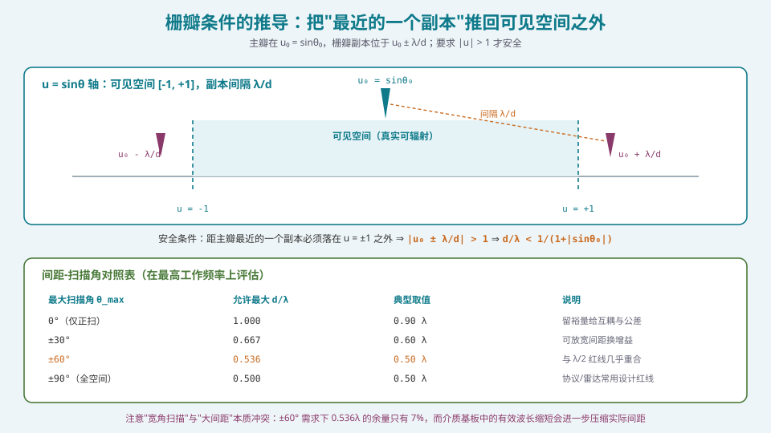
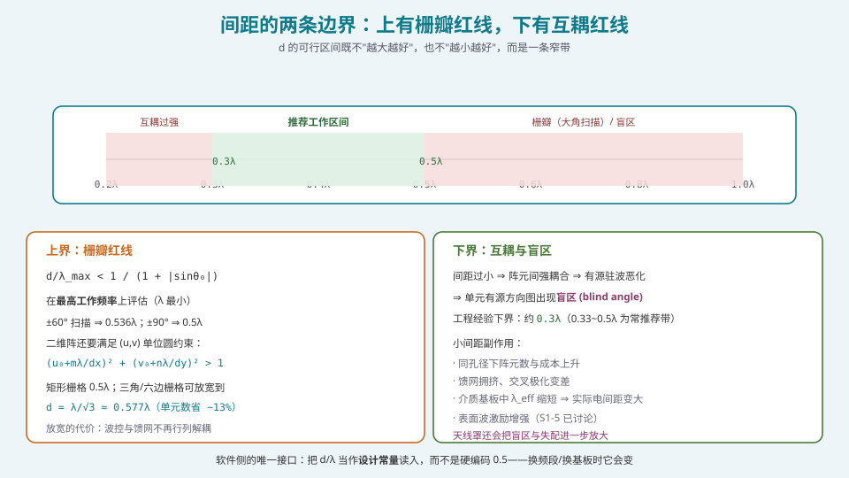
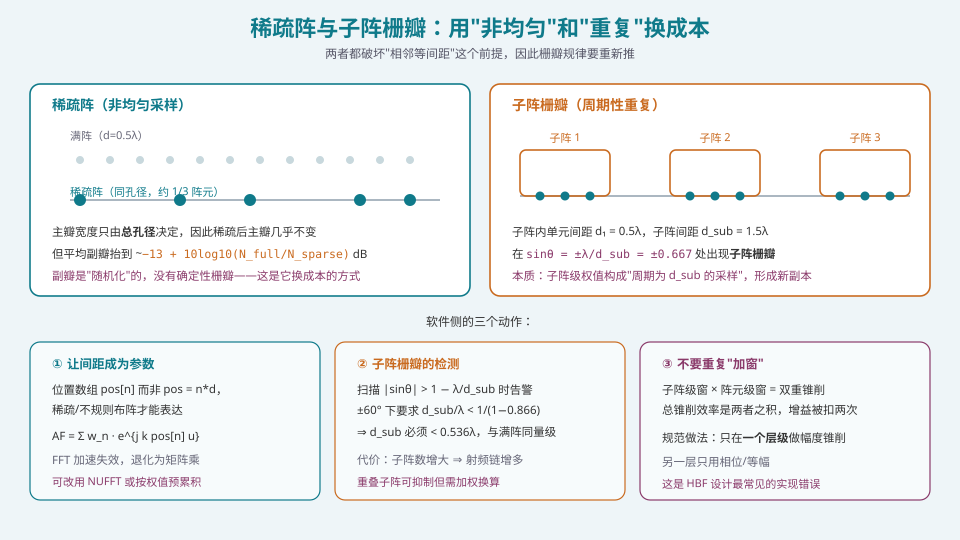

## 本篇要解决什么

[采样、混叠与栅瓣的同一性](pa-sampling-aliasing-grating.html) 已经论证过：**栅瓣就是空间域的混叠**。这一篇把它做成**可以查表、可以写进代码**的工程准则。

需要解决的四个问题：

1. **推导**：为什么是 \(d/\lambda<1/(1+|\sin\theta_0|)\)，而不是别的式子？
2. **边界**：为什么不能无限减小 \(d\)？下界从哪来？
3. **例外**：稀疏阵、子阵栅瓣——它们"看起来违反了 λ/2 准则"，实际没有。
4. **实现**：软件里必须把哪三处写对？

---

## 一、推导：把"最近的副本"推出可见空间



*图 1：主瓣在 u₀，栅瓣副本周期为 λ/d。只要最近的一个副本落在 |u| > 1 之外，就没有栅瓣。*

### 1.1 前提：u 域的重述

回顾 [阵列因子](pa-array-factor.html) 的结论。归一化阵列因子：

\[
AF(u)=\frac{\sin\!\big(N\pi \tfrac{d}{\lambda}(u-u_0)\big)}{\sin\!\big(\pi \tfrac{d}{\lambda}(u-u_0)\big)},\qquad u=\sin\theta
\]

它的**周期性**：不是周期函数（分母非零时），但当 \(\pi(d/\lambda)(u-u_0)=m\pi\) 时，分子分母同时为零，出现**极大值**（与主瓣等高）。这就是栅瓣。

### 1.2 栅瓣位置

\[
\boxed{\;\frac{d}{\lambda}(u-u_0)=m \;\Longrightarrow\; u_{\mathrm{GL}}=u_0+m\frac{\lambda}{d},\quad m=\pm1,\pm2,\dots\;}
\]

**注意这个式子里没有 \(N\)。** 栅瓣的位置与阵元数完全无关——这是很多人第一次看会惊讶的事。\(N\) 只影响主瓣与栅瓣**之间的副瓣结构**，不影响栅瓣的位置与高度（栅瓣恒与主瓣等高）。

### 1.3 可见空间条件

物理上只存在 \(|\sin\theta|\le1\)，即 \(u\in[-1,1]\)。落到这个区间里的极大值才是"真实辐射出去"的栅瓣。

要求**第一对栅瓣**（\(m=\pm1\)）都在外面。由于 \(u_0\) 可以是正也可以是负，取最坏情况（\(u_0\) 与 \(+m\lambda/d\) 同号）：

\[
|u_0|+\frac{\lambda}{d}>1
\]

即

\[
\boxed{\;\frac{d}{\lambda}<\frac{1}{1+|\sin\theta_0|}\;}
\]

这就是那条著名的式子。常见特例：

| \(\theta_0\) | \(d_{\max}/\lambda\) | 含义 |
| --- | --- | --- |
| 0°（仅正扫） | 1.000 | 正扫时 d 可以到 1λ |
| ±30° | 0.667 | |
| ±45° | 0.586 | |
| **±60°** | **0.536** | 与 λ/2 只差 7% |
| ±90°（全空间） | 0.500 | **λ/2 红线** |

> **一句话理解 λ/2 的来历**：它是在**要求覆盖整个可见空间（±90°）**的前提下，由 1.3 式给出的**临界值**。所以："λ/2 保证任何扫描角都无栅瓣"，而不是"λ/2 是个习俗"。

### 1.4 一个立即有价值的推论

**如果你的系统只需要 ±30° 扫描，那么 d 可以放宽到 0.667λ。**

这意味着：
- 同样孔径下，阵元数减少 \(0.5/0.667=75\%\)（省 25% 阵元）；
- 或者同样阵元数下，孔径增大 33%，增益增加约 1.25 dB；
- 代价：互耦变化（间距变大通常**减小**互耦，是好事）、以及阵列厚度增加。

**这是一条被普遍忽视的设计自由度。** 很多系统照抄"λ/2"而不审查实际扫描需求，白白多付 25% 的阵元成本。

---

## 二、二维阵：单位圆约束

二维矩形栅格的栅瓣位置：

\[
(u_{\mathrm{GL}},v_{\mathrm{GL}})=\left(u_0+m\frac{\lambda}{d_x},\; v_0+n\frac{\lambda}{d_y}\right),\quad m,n\in\mathbb{Z}
\]

不是所有 \((m,n)\) 都在可见空间。可见空间是 \(u,v\) 平面上的**单位圆**：

\[
u^2+v^2\le1
\]

所以判据是：

\[
(u_0+m\lambda/d_x)^2+(v_0+n\lambda/d_y)^2>1\quad\text{对所有 }(m,n)\ne(0,0)
\]

**软件实现**：

```python
import numpy as np

def has_grating_lobe(u0, v0, dx_over_l, dy_over_l, mmax=3, nmax=3):
    """检查 (u0,v0) 指向下是否存在落入可见空间的栅瓣。"""
    hits = []
    for m in range(-mmax, mmax+1):
        for n in range(-nmax, nmax+1):
            if m == 0 and n == 0:
                continue
            u = u0 + m * 1.0 / dx_over_l      # 1/(dx/lambda) = lambda/dx
            v = v0 + n * 1.0 / dy_over_l
            if u*u + v*v <= 1.0 + 1e-12:
                hits.append((m, n, u, v))
    return hits
```

### 三角/六边栅格：省 13% 单元

矩形栅格：单元面积 \(d^2\)，\(d_{\max}=\lambda/2\Rightarrow A_{\text{cell}}=\lambda^2/4\)。

三角（六边形密排）栅格：

\[
d_{\max}=\frac{\lambda}{\sqrt3}\approx0.577\lambda,\qquad
A_{\text{cell}}=\frac{\sqrt3}{2}d^2=\frac{\sqrt3}{2}\cdot\frac{\lambda^2}{3}=\frac{\lambda^2}{2\sqrt3}\approx0.2887\lambda^2
\]

面积比 \(\dfrac{0.2887}{0.25}=1.155\)，即**间距可放宽 15.5%**，同孔径下**阵元数减少约 13.4%**。

**代价**：
1. 馈电网络布局复杂（不再是行列分离）；
2. 波控的行/列解耦失效——相位不能再写成 \(m\psi_x+n\psi_y\)，需要逐元计算；
3. 二维加窗的分离性变差（不能简单写成一维窗的乘积）。

**决策**：如果 \(N>2000\)，省 13% 的射频链路成本通常大于增加的布线复杂度，值得做。如果 \(N<500\)，不值得。

---

## 三、下界：互耦与扫描盲区



*图 2：d 的可行区间是一条窄带。上方是栅瓣红线（可算），下方是互耦红线（只能靠仿真/实测标定）。*

### 3.1 最小间距从哪来

\(\lambda/2\) 准则只给了**上界**。下界来自三个机制：

**机制一：互耦随间距减小而上升。**
两个相邻单元的距离越近，耦合越强。后果：
- 每个单元的有源输入阻抗偏离孤立值 ⇒ 匹配变差 ⇒ 反射损耗；
- 有源驻波比（VSWR）随扫描角剧烈变化，最坏处可达 2:1 以上；
- 单元方向图被邻元"拉"变形，"全同单元"假设失效。

**机制二：表面波激励。**
厚介质基板 + 小间距会激励表面波，能量沿基板传播而不辐射出去，表现为：
- 效率下降；
- 在特定扫描角出现**扫描盲区**——增益断崖式下跌（可跌 10 dB 以上）。

**机制三：加工可行性。**
28 GHz 时 \(\lambda/2=5.36\ \text{mm}\)。若要 0.3λ，就是 3.2 mm。在这么小的节距里放一个完整的 T/R 通道（PA + LNA + 移相器 + 衰减器 + 开关），还要散热与布线——**这是集成度问题，不是电磁问题**。

**工程经验下界**：约 **\(0.3\lambda\)**；文献常推荐的区间是 **\(0.33\lambda\sim0.5\lambda\)**。

### 3.2 介质基板里的"隐形压缩"

一个容易致命的问题：**栅瓣条件必须用介质中的有效波长评估。**

\[
k=\frac{2\pi}{\lambda_{\text{eff}}},\qquad \lambda_{\text{eff}}=\frac{\lambda_0}{\sqrt{\varepsilon_{\text{eff}}}}
\]

若基板 \(\varepsilon_r=3.0\)，\(\lambda_{\text{eff}}=\lambda_0/1.732=0.577\lambda_0\)。同样物理间距 \(d\)，其**电尺寸** \(d/\lambda_{\text{eff}}\) 是空气中的 1.73 倍。

**数值例子**：28 GHz，\(d=5.0\ \text{mm}\)。
- 空气中：\(d/\lambda_0=5.0/10.71=0.467\lambda_0\) ⇒ 安全；
- 基板中：\(d/\lambda_{\text{eff}}=5.0/6.18=0.809\lambda_{\text{eff}}\) ⇒ **±45° 以上就有栅瓣风险**。

> **实现要求**：代码里读入的**不能**是 `d` 除以真空波长。必须区分 `d_over_lambda_air` 与 `d_over_lambda_eff`，并在注释里写明用的是哪一个。S5 的校准环节也会暴露这个问题——**电尺寸错了，校正平面就会偏**。

---

## 四、例外一：稀疏阵



*图 3：稀疏阵用"非均匀"换成本，代价是副瓣随机抬高；子阵栅瓣来自"周期性重复"，必须靠减小子阵间距解决。*

### 4.1 稀疏阵为什么没有栅瓣

如果阵元位置**不是**等间距的，那么 \(\psi=k\sum$ 处的周期性就不存在——**没有"每隔 λ/d 复制一份"的机制**，因此没有确定性栅瓣。

**代价**：随机化的位置会把能量散到各处，形成**随机副瓣**。典型抬升量：

- 平均副瓣电平 \(\approx-10\log_{10}N_{\text{full}}+10\log_{10}(N_{\text{full}}/N_{\text{sparse}}) +(-13)\ \text{dB}\) 量级；
- 更常用的经验式：平均副瓣 \(\approx-10\log_{10}N_{\text{sparse}}-13\ \text{dB}\) 左右（取决于布阵优化程度）。

**收益**：同孔径下阵元数可减少 30%~60%，且**主瓣宽度几乎不变**（因为主瓣只由孔径决定）。

### 4.2 稀疏阵的实现要点

| 要点 | 说明 |
| --- | --- |
| 位置必须是**数据**，不是公式 | \(\mathrm{pos}[n]\) 数组；不能写成 \(n d\) |
| FFT 加速失效 | 非均匀采样 ⇒ 直接算 \(AF=\sum w_n e^{jk\,\mathrm{pos}_n u}\)，复杂度 \(O(N\!\cdot\!N_u)\) |
| 可用 NUFFT | 若 \(N_u\) 很大，非均匀 FFT 能把复杂度降到 \(O(N\log N)\) |
| 必须做**优化**（不只是随机） | 用遗传算法/粒子群/凸优化最小化最大副瓣 |
| 副瓣包络要重新评估 | 随机副瓣的统计特性与确定性副瓣不同，认证时要按最大副瓣而非平均值 |

---

## 五、例外二：子阵栅瓣

### 5.1 成因

混合波束成形（HBF）里，若干阵元共享一条射频链，构成一个**子阵**。子阵内单元间距 \(d_1\)（通常 λ/2），相邻子阵中心间距 \(d_{\text{sub}}\)（通常是 \(M d_1\)，\(M\) 为子阵规模）。

问题来了：**子阵内的单元权值往往相同**（或相同比例），于是从子阵级别看，激励呈现**周期性**——周期是 \(d_{\text{sub}}\)。

这会产生新的极大值：

\[
\sin\theta_{\text{GL,sub}}=u_0 + m\frac{\lambda}{d_{\text{sub}}}
\]

**这就是子阵栅瓣**。它与你有没有满足 \(d_1\le\lambda/2\) 无关——**满足单元级的准则并不能保证子阵级的准则**。

### 5.2 数值例子

\(d_1=0.5\lambda\)，子阵规模 \(M=4\Rightarrow d_{\text{sub}}=2\lambda\)。

正扫时子阵栅瓣在 \(\sin\theta=\pm2\lambda/(2\lambda)=\pm1\)（正好在端射）——勉强安全。
扫描到 30° 时：\(\sin\theta=0.5\pm1\Rightarrow \sin\theta=1.5\)（不可见）或 \(\sin\theta=-0.5\) ⇒ **在 −30° 处出现一个与主瓣等的栅瓣**。

> **极端危险的情形**：主瓣指向 +30°，但 −30° 方向（也就是**指向另一个用户/卫星**的方向）出现等强度波束。这不仅是能量浪费，还是**干扰合规问题**——可能直接违反 ITU-R 的旁瓣包络或 3GPP 的 SEM。

### 5.3 抑制手段

| 手段 | 原理 | 代价 |
| --- | --- | --- |
| 减小 \(d_{\text{sub}}\) | 直接把副本推出可见空间 | 子阵数增多 ⇒ 射频链增多 ⇒ 成本/功耗上升 |
| **重叠子阵** | 子阵之间相互重叠，破坏周期性 | 需要子阵级权值换算矩阵，复杂度上升 |
| 子阵级相位扰相 | 给不同子阵加不同相位偏移（随机/伪随机） | 会把子阵栅瓣"打散"成更高但更分散的副瓣 |
| 子阵级幅度锥削 | 压低边缘子阵 | **会与单元级锥削叠加，双重损失**（见下） |
| 数字域补偿 | 若子阵级有独立 ADC，可在数字域做子阵级零点 | 需要子阵级独立数据流，不再是廉价 HBF |

**判据**：若要求 ±60° 无子阵栅瓣，则

\[
\frac{d_{\text{sub}}}{\lambda}<\frac{1}{1+|\sin60°|}=0.536
\]

即 \(d_{\text{sub}}<0.536\lambda\) —— 与满阵同量级！**这直接说明：便宜的 HBF（子阵大）与宽角扫描是互斥的。** 相关内容在 [混合波束成形（HBF）的子阵设计](pa-hybrid-beamforming.html) 有完整讨论。

---

## 六、软件侧必须写对的三处

### 6.1 位置数组，不是间距标量

```python
# 错：只支持均匀阵
def af_wrong(u, N, d_over_l, u0=0.0):
    n = np.arange(N)
    return np.abs(np.exp(1j*2*np.pi*d_over_l*np.outer(u, n-u0)).sum(1)) / N

# 对：位置是数据，间距只是它的一种生成方式
def af_right(u, pos_over_l, weights):
    """pos_over_l: 阵元位置（以波长为单位）的 ndarray，长度 N
       weights   : 复权值，长度 N"""
    u = np.atleast_1d(np.asarray(u, float))
    # 导向矢量 a[u, n] = exp(+j 2pi pos_n u)
    a = np.exp(1j*2*np.pi*np.outer(u, pos_over_l))
    return np.abs(a @ weights) / np.abs(weights).sum()

# 由间距生成位置的便捷函数
def uniform_positions(N, d_over_l):
    return np.arange(N) * d_over_l
```

**为什么值得改**：一旦用了位置数组，稀疏阵、非均匀阵、重叠子阵、甚至共形阵（位置是三维坐标）都能用同一个函数处理。**接口一次做对，省掉后面所有重构。**

### 6.2 栅瓣检测要进 CI

```python
def check_design(u_scan_max, dx_over_l, dy_over_l):
    """设计期自检：返回 (是否安全, 违规清单)"""
    problems = []
    for u0 in np.linspace(-u_scan_max, u_scan_max, 41):
        for v0 in np.linspace(-u_scan_max, u_scan_max, 41):
            if u0*u0 + v0*v0 > 1:   # 该方向不可见，跳过
                continue
            hits = has_grating_lobe(u0, v0, dx_over_l, dy_over_l)
            if hits:
                problems.append((u0, v0, hits[0]))
    return (not problems), problems
```

把这段跑在每次改阵面参数之后。**它能在 10 毫秒内发现一个会让你返工三个月的错误。**

### 6.3 【最容易踩的坑】不要在两个层级重复加窗

HBF 系统有**两个可以加窗的层级**：子阵级（射频链的幅度控制）和阵元级（子阵内部的幅度控制）。

**错误做法**：为了压副瓣，在两个层级都加泰勒窗。

**后果**：总幅度分布是两级窗的**乘积**，等效于一个**极深的锥削**。锥削效率是两者之积：

\[
\eta_t^{\text{total}}=\eta_t^{\text{sub}}\times\eta_t^{\text{elem}}
\]

若各有 0.88，则总 0.775，**白丢 1.1 dB 增益**；而且边缘单元幅度会低到 0.1 以下，**对通道误差的敏感度急剧上升**——在校准精度不足时，实际副瓣可能比不加窗还差。

**正确做法**：
1. **只在一个层级做幅度锥削**（通常选阵元级，因为子阵级的幅度控制通常是粗粒度的）；
2. 另一层级只用**等幅**（或仅做必要的归一化）；
3. 若确实需要两级配合（如重叠子阵的补偿矩阵），必须**把两级幅度的乘积作为设计变量**做一次性优化，而不是各算各的。

这类 bug 的特点是：**仿真漂亮、装机翻车**。因为仿真里你用的是理想权值，而机上的子阵级幅度控制精度可能只有 1 dB。

---

## 七、常见误区清单

**误区一：认为 λ/2 是"经验值"或"传统"。**
它是 \(d/\lambda<1/(1+|\sin\theta_0|)\) 在 \(\theta_0=90°\) 时的精确解。理解了这一点，你就知道"±30° 扫描可以用 0.667λ"这种放宽不是违规，而是**同一公式的正确应用**。

**误区二：以为栅瓣位置与 N 有关。**
无关。栅瓣位置只由 \(d/\lambda\) 与 \(u_0\) 决定。\(N\) 只改变主瓣与栅瓣之间的副瓣结构（\(N\) 越大，副瓣越多越密）。这个误区会导致"我用更大阵就能避免栅瓣"的错误设计。

**误区三：以为可以用加窗压制栅瓣。**
不能。加窗是**空间低通滤波**，对主瓣与栅瓣施加**同一种**平滑。主瓣降 3 dB，栅瓣也降 3 dB —— **比值不变，栅瓣依然与主瓣等高**。原因在 [空间频率与空间傅里叶变换](pa-spatial-frequency-fft.html) 已经讲过：栅瓣是**混叠产物**，是"信息层面"的问题，包络整形无能为力。

**误区四：用真空波长评估放在介质中的阵列的栅瓣。**
见 §3.2。必须用 \(\lambda_{\text{eff}}\)。这是相控阵设计中**最隐蔽也最致命**的错误之一——它不会让设计"明显错"，只会让波束在扫描到一定角度时突然冒出一个不明来源的大波束。

**误区五：把"阵元间距"当成可以独立优化的量。**
它同时被三个条件约束：上界（栅瓣）、下界（互耦/加工）、以及**频率范围**（要在最高频评估上界，在最低频评估性能）。

**误区六：稀疏阵不做优化，"随机撒点"。**
纯随机布阵的副瓣通常比优化布阵高 5~10 dB。稀疏阵的价值在于**用优化换取成本**，不做优化就只是把性能白送掉。

**误区七：忘记子阵级也有栅瓣。**
HBF 设计里最常见的遗漏。子阵栅瓣可能出现在**指向其他用户的方向**，是干扰合规事故的高发点。

**误区八：认为缩小间距"只有好处没有代价"。**
互耦、表面波、失配、加工难度、散热——全是代价。0.3λ 附近是工程底线，不是越密越好。

---

## 八、快速自测

**Q1.** 一位同事说："我们用 λ/2 间距，所以肯定没有栅瓣。"这句话在什么前提下成立，什么情况下不成立？列出至少三种不成立的情形。

<details><summary>参考要点</summary>

**成立前提**：均匀线性阵、等幅（或任意幅度）同相激励、只考虑**单元级**栅瓣、用**真空波长**评估、扫描到 ±90°、单频。

**不成立的情形**：
1. **子阵栅瓣**：HBF 子阵级周期 > λ/2 ⇒ 子阵栅瓣（与单元间距无关）。
2. **介质中的电间距**：基板 \(\varepsilon_r>1\) ⇒ \(\lambda_{\text{eff}}<\lambda_0\) ⇒ 实际 \(d/\lambda_{\text{eff}}\) 已达 0.5 甚至更高。
3. **宽带**：λ/2 只在设计频率上成立；最高频处 \(d/\lambda\) 更大，可能出现栅瓣（见 [波束斜视与宽带相控阵](pa-beam-squint-wideband.html)）。
4. **有频率扫描或 TTD 混合**：等效相位关系改变。
5. **稀疏/非均匀阵**：准则不再适用（不过这类通常也不会有确定性栅瓣）。
6. **相控阵透镜（Rotman lens）等其他馈电形式**：几何关系不同。

**这个问题的价值**：它检验"是否真的理解了准则的适用范围" vs "背下了一个数字"。

</details>

**Q2.** 一个 28 GHz 系统，要求 ±45° 扫描。给出最大允许间距（mm）。若阵元在 \(\varepsilon_{\text{eff}}=2.5\) 的介质中工作，答案如何变化？

<details><summary>参考要点</summary>

\(\lambda_0=10.71\ \text{mm}\)。

自由空间：\(d_{\max}=\lambda_0/(1+\sin45°)=10.71/1.7071=6.27\ \text{mm}\)。

介质（\(\sqrt{2.5}=1.581\)）：\(\lambda_{\text{eff}}=10.71/1.581=6.77\ \text{mm}\)，\(d_{\max}=6.77/1.7071=3.97\ \text{mm}\)。

**结论**：介质约束把允许间距压到自由空间的 63%。若产品手册写"间距 5.36 mm（λ/2 @ 28 GHz）"，在 \(\varepsilon_{\text{eff}}=2.5\) 的基板里，**电间距已达 0.79λ_eff，±45° 扫描必然出栅瓣**。

**工程落点**：天线基板的选择（厚度与 \(\varepsilon_r\)）与阵元间距是**耦合设计**，不能分开决定。

</details>

**Q3.** 一个 8×8 的 HBF 阵列，\(d_1=0.5\lambda\)，每个子阵含 \(2\times2\) 单元（即 \(d_{\text{sub}}=1\lambda\)）。求：(a) 正扫时子阵栅瓣位置；(b) 扫描到 \(u_0=0.5\) 时的子阵栅瓣位置；(c) 是否落进可见空间？

<details><summary>参考要点</summary>

\(d_{\text{sub}}/\lambda=1\Rightarrow\lambda/d_{\text{sub}}=1\)。

(a) \(u_{\text{GL}}=0\pm1=\pm1\) ⇒ 正好在端射（\(u=\pm1\) 即 \(\theta=\pm90°\)）。**边界情况**——严格说 \(u=1\) 是可辐射的（掠射），实际上会在端射方向形成一个与主瓣相当的大波束。

(b) \(u_{\text{GL}}=0.5\pm1\Rightarrow u=1.5\)（不可见）与 \(u=-0.5\)（**可见，\(\theta=-30°\)**）。

(c) **是的，落进可见空间**。\(\theta=-30°\) 方向有一个与主瓣等高的子阵栅瓣。

**后果**：主瓣对准 +30°（\(u_0=0.5\)）的用户，同时向 −30° 方向辐射等强度功率。若 −30° 方向有同频段的其他系统，这就是**同频干扰事故**。

**修正**：把子阵规模从 \(2\times2\) 降到 \(1\times2\)（\(d_{\text{sub}}=0.5\lambda\)），或引入重叠子阵。

</details>

**Q4.** 稀疏阵（1/3 阵元）与满阵相比：主瓣宽度、第一副瓣、平均副瓣、增益，分别怎么变？哪一项是"必须付出"的，哪一项可以靠优化改善？

<details><summary>参考要点</summary>

设满阵 \(N_f\)、稀疏阵 \(N_s=N_f/3\)，**孔径相同**。

| 指标 | 变化 | 能否优化 |
| --- | --- | --- |
| **主瓣宽度** | 几乎不变（只由孔径决定） | 不需优化——这是稀疏阵的核心价值 |
| **第一副瓣** | 概念弱化（非周期性，无明确"第一副瓣"） | — |
| **平均副瓣** | 抬升约 \(10\log_{10}(N_f/N_s)=4.8\ \text{dB}\) | **可以**，通过布阵优化（GA/PSO/凸优化）改善 3~6 dB |
| **峰值副瓣** | 抬升 4~10 dB | **可以**，优化后通常能压到 −15~−20 dB |
| **增益** | 略降（约 1~2 dB，来自效率与互耦变化） | 部分可改善（间距更大，互耦更小，是好事） |

**"必须付出"的是**：副瓣的**统计涨落**。非均匀布阵的副瓣是随机变量，不同方向的高度不同。这带来两个后果：
1. 认证时要按**最大**副瓣（而非平均）来比对包络；
2. 方向图对**频率与扫描角**更敏感（不同频点的副瓣图不同）。

**可以改善的是**：把"随机"变成"优化过的准随机"——用确定性的优化算法找一组副瓣尽可能低的位形。

</details>

**Q5.** 请解释为什么"栅瓣与主瓣等高"是必然的，而不是"通常接近"。给出数学论证。

<details><summary>参考要点</summary>

在 \(\psi=2\pi m\) 处（\(m\) 为非零整数）：

\[
AF(\psi)=\sum_{n=0}^{N-1}e^{jn\psi}=\sum_{n=0}^{N-1}e^{j2\pi mn}
\]

对每个 \(n\)，\(e^{j2\pi mn}=1\)（因为 \(m,n\) 都是整数）。所以

\[
AF(2\pi m)=\sum_{n=0}^{N-1}1=N
\]

**这是一次"完全同相"的求和，与主瓣处的 \(\psi=0\) 情形完全相同**（在 \(\psi=0\) 处，\(e^{j0}=1\)，求和也是 \(N\)）。

所以 \(|AF|=N\)，与主瓣峰值**严格相等**。不是"接近"，是"恒等"。

**物理理解**：在栅瓣方向上，相邻阵元的波程差恰好是**整数个波长**。也就是说，**这个方向上相邻阵元接收到的信号本来就是同相的**——阵列"以为"这就是主瓣方向。任何相位补偿都无济于事，因为这个方向本身就满足"完全相干"的条件。

**关键推论**：加窗（改幅度）无法改变这一点，因为幅度加权对 \(\psi=2\pi m\) 与 \(\psi=0\) 的作用**完全一样**（都只是在求和项前乘同一个 \(a_n\)）。所以 \(|AF(2\pi m)|/\max|AF|\) 恒等于 1。

</details>

**Q6.** 你的阵面设计被要求"在 ±60° 内无栅瓣"，同时在 24~30 GHz 全频段工作。给出设计约束的推导与最终间距。

<details><summary>参考要点</summary>

**关键原则**：栅瓣约束必须在**最高工作频率**上评估（此时 \(\lambda\) 最小，\(d/\lambda\) 最大，最容易出栅瓣）。

\(f=30\ \text{GHz}\Rightarrow\lambda_{\min}=9.993\ \text{mm}\)。

\[
\frac{d}{\lambda_{\min}}<\frac{1}{1+\sin60°}=\frac{1}{1.8660}=0.5359
\]

\[
d<0.5359\times9.993=5.355\ \text{mm}
\]

**取 \(d=5.0\ \text{mm}\)**（留 7% 裕量给公差与介质效应）。

**验证各频点**：
- 30 GHz：\(d/\lambda=0.500\) ✓（恰好 λ/2）
- 24 GHz：\(d/\lambda=5.0/12.49=0.400\) ✓（余量更大）

**若介质 \(\varepsilon_{\text{eff}}=2.2\)（\(\sqrt{}=1.483\)）**：
- 30 GHz：\(\lambda_{\text{eff}}=9.993/1.483=6.738\ \text{mm}\)，\(d/\lambda_{\text{eff}}=5.0/6.738=0.742\) ❌ **±30° 以上就出栅瓣**。
- 必须把 \(d\) 压到 \(0.5359\times6.738=3.61\ \text{mm}\)。

**结论**：**频率范围与基板材料必须一起考虑**。只按最高频率 + 真空波长算，会漏掉介质效应；只按中心频点算，会漏掉带宽效应。

**另一种解法**：如果介质效应无法避免（例如必须用厚基板做天线），可以考虑：
1. 用**空气腔**或**悬置**结构降低有效介电常数；
2. 接受较小的扫描范围（如 ±40°）；
3. 使用**介质谐振器天线（DRA）**，其有效尺寸与基板关系不同。

</details>

**Q7.** 为什么"减小间距"不是"越保险越好"？给出至少三个机制，并说明各自的观测征兆。

<details><summary>参考要点</summary>

| 机制 | 物理原因 | 观测征兆 |
| --- | --- | --- |
| **互耦上升** | 邻元间距小 ⇒ 近场耦合强 ⇒ 有源阻抗偏离孤立值 | 有源 VSWR 随扫描角恶化；单元方向图在阵中与孤立时差别大 |
| **扫描盲区** | 表面波与阵元频率-波数曲线交叉 ⇒ 特定角度阻抗失配 | 方向图在某角度出现**深度凹陷**（10 dB 以上），且位置随频率移动 |
| **加工与热** | 节距小于 T/R 通道物理尺寸 ⇒ 无法布线/散热 | 装配良率、热仿真超限 |
| **效率下降** | 表面波能量不辐射；馈网拥挤导致线损增加 | 实测增益低于预算 1~3 dB，且与频率相关 |
| **公差敏感度上升** | 小间距 ⇒ 相对位置误差（以 λ 归一）更敏感 | 加工公差导致的相位误差增大 |

**工程做法**：
1. 在下界（0.3λ）附近设计时，**必须做有源 S 参数扫描**（激励全阵、只测一个单元端口）；
2. 用"扫描盲区扫描曲线"（盲区频率 vs 角度）确认工作区内无交叉；
3. 在 0.33λ~0.5λ 之间选值，**优先选 0.5λ 除非有明确理由**。

</details>

**Q8.** 你要为一个大阵（32×32）写一个"阵面配置合法性检查"函数。列出它应该检查的所有项，并说明每项失败时的报错信息应该包含什么。

<details><summary>参考要点</summary>

```python
def validate_array_config(cfg, *, f_range_ghz, eps_eff, scan_max_deg,
                          d_sub_over_l=None, has_radome=False):
    errs, warns = [], []

    # 1. 单元级栅瓣（在最高频、用有效波长）
    f_max = max(f_range_ghz)
    lam_eff = (299.792458 / f_max) / np.sqrt(eps_eff)   # mm
    d_lam_eff = cfg.dx_mm / lam_eff
    d_limit = 1.0 / (1.0 + np.sin(np.radians(scan_max_deg)))
    if d_lam_eff >= d_limit:
        errs.append(f"单元级栅瓣：dx/λ_eff={d_lam_eff:.3f} ≥ {d_limit:.3f} "
                    f"(f={f_max} GHz, ε_eff={eps_eff})")
    elif d_lam_eff > 0.95 * d_limit:
        warns.append(f"单元级栅瓣裕量不足：{d_lam_eff:.3f} vs {d_limit:.3f}")

    # 2. 子阵级栅瓣（若为 HBF）
    if d_sub_over_l is not None:
        ds_eff = cfg.d_sub_mm / lam_eff
        ds_limit = 1.0 / (1.0 - np.sin(np.radians(scan_max_deg)))
        if ds_eff >= ds_limit:
            errs.append(f"子阵栅瓣：d_sub/λ_eff={ds_eff:.3f} ≥ {ds_limit:.3f}")

    # 3. 互耦下界
    d_lam_air = cfg.dx_mm / (299.792458 / f_max)
    if d_lam_air < 0.3:
        errs.append(f"间距过小（互耦风险）：dx/λ_air={d_lam_air:.3f} < 0.30")

    # 4. 二维单位圆检（逐 (u0,v0)）
    # ... 见正文 has_grating_lobe

    # 5. 加窗层级重复
    if cfg.taper_sub is not None and cfg.taper_elem is not None:
        warns.append("两级加窗叠加：锥削效率为两者之积，请确认增益预算已扣除")

    # 6. 天线罩
    if has_radome:
        warns.append("天线罩会带来插损与波束偏移，增益与指向预算需单独扣除")

    return errs, warns
```

**报错信息必须包含**：违规项、**实际值**、**限值**、以及**计算所依赖的假设**（频率、\(\varepsilon_{\text{eff}}\)、扫描角）。缺了假设，别人复现不出你的结论——这在多团队协作里是最常见的时间黑洞。

</details>

---

## 九、与本站其它专题的连接

| 想了解 | 看哪篇 |
| --- | --- |
| 栅瓣与混叠的同一性（本系列的源头） | [采样、混叠与栅瓣的同一性](pa-sampling-aliasing-grating.html) |
| \(u\) 域与傅里叶对偶 | [空间频率与空间傅里叶变换](pa-spatial-frequency-fft.html) |
| 阵列因子与栅瓣位置 | [阵列因子：从两个阵元到 N 个阵元](pa-array-factor.html) |
| 孔径、增益与 HPBW | [波束宽度、增益与孔径](pa-beamwidth-gain-aperture.html) |
| 扫描损耗（间距放宽后"代价"的变化） | [扫描损耗：波束越偏增益越低](pa-scan-loss.html) |
| 子阵设计的完整方法 | [混合波束成形（HBF）的子阵设计](pa-hybrid-beamforming.html) |
| 互耦、表面波与扫描盲区 | [电磁地基（结论级）：阵元、极化、互耦、表面波](pa-electromagnetics-basics.html) |
| 馈电网络与有源驻波 | [功分合成网络与互耦效应](pa-feed-network-mutual-coupling.html) |
| 移相器量化对副瓣的贡献 | [移相器与真时延器件（TTD）](pa-phase-shifter-ttd.html) |
| 宽带下的栅瓣与斜视 | [波束斜视与宽带相控阵](pa-beam-squint-wideband.html) |
| 副瓣包络的监管红线 | [规范与认证地图：从 38.101 到 CTIA 到 ITU-R](pa-conformance-standards.html) |
| 学习体系全貌 | [相控阵天线学习体系：六阶段路线图](phased-array-roadmap.html) |

---

## 十、延伸阅读

**教材**
- Mailloux, *Phased Array Antenna Handbook*, 3rd ed., §1.4（栅瓣条件式 1.74 与平面阵栅瓣格点图 1.13）。**本文第一节的推导与 §1.4 完全对应**，作者还特别指出"实际间距必须进一步减小以避免扫描盲区"——这是本文第三节的来源。
- Balanis, *Antenna Theory*, 4th ed., §6.4.3（栅瓣条件）与 §6.8（平面阵）。三角栅格的 \(2/\sqrt3\) 面积比在这一节。
- Hansen, *Phased Array Antennas*, 2nd ed., §1.3 与第 4 章（互耦、盲区）。互耦下界与盲区机制的权威讨论。
- Haupt, *Antenna Arrays: A Computational Approach*, §4.2（稀疏阵）。稀疏阵与副瓣统计特性的入门参考。

**经典文献**
- R. J. Mailloux, "Surface Waves and Blindness in Scanned Arrays," 与 "On the Effect of Array Element Lattices on Grating Lobes" 相关论文。
- R. C. Hansen, "Linear Arrays," in *Phased Array Antennas* 第 3 章，以及 Hansen 关于 density-tapered 稀疏阵的经典论文。
- A. Ishimaru 关于周期结构散射（表面波导致盲区）的电磁学基础工作。
- **稀疏阵优化**：R. L. Haupt, "Thinned Arrays Using Genetic Algorithms," *IEEE Trans. AP*, vol. 42, no. 7, 1994。稀疏阵优化的开山之作。

**工程应用笔记**
- Analog Devices, *Phased Array Antenna Patterns — Part 2: Grating Lobes and Beam Squint*。栅瓣的图形化处理，含 scan 后栅瓣"移动"的演示，与本文 §1.4 图 1 互补。
- RF Essentials, *How do I calculate the antenna pattern of a linear array of elements?* 给出了本问题最简洁的判据汇总。
- 关于介质中电尺寸陷阱：任意一本微带天线教材中关于 "effective dielectric constant" 与 "surface wave" 的章节（如 Balanis 第 14 章）。
- 关于 HBF 子阵栅瓣：A. Alkhateeb 等人关于 hybrid beamforming 的论文与综述，以及 [混合波束成形（HBF）的子阵设计](pa-hybrid-beamforming.html) 中的工程讨论。
