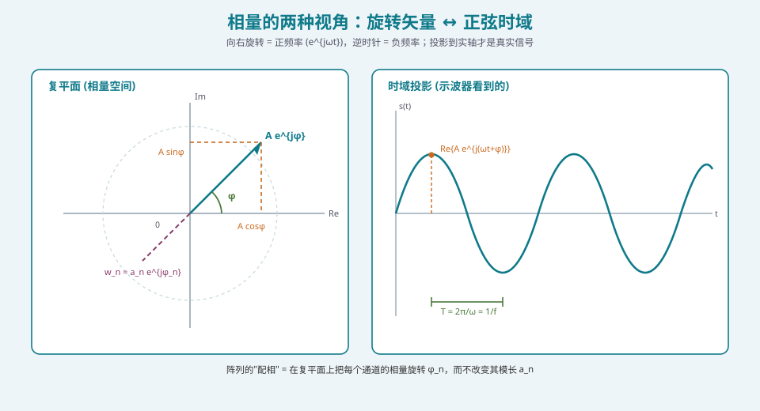
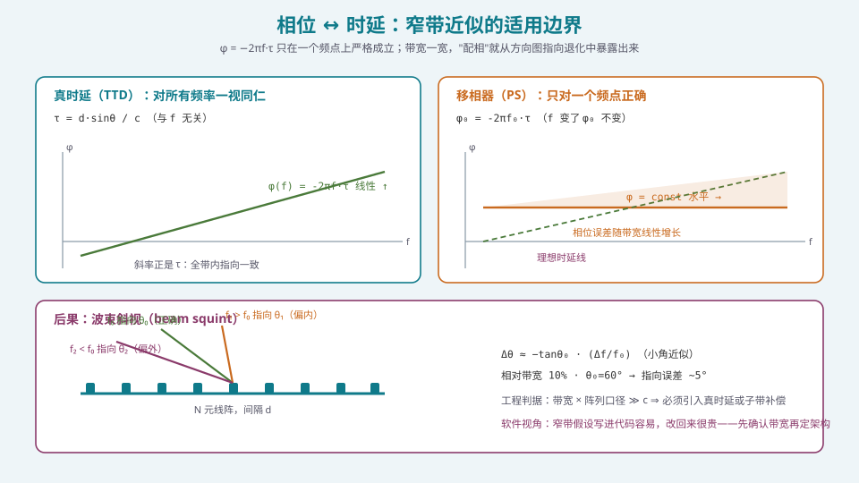
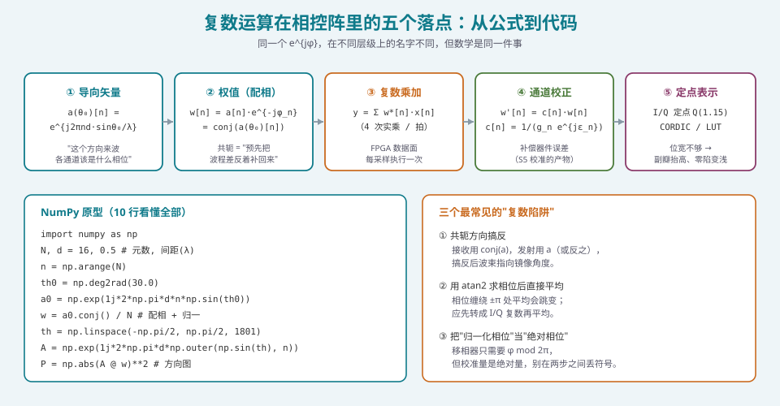

## 本篇要解决什么

如果你翻过 [卫星相控阵天线：从阵元到波束](satellite-phased-array.html)，会注意到那篇里所有的推导都建立在一件事上：**两个阵元接收同一个来波，因为波程差不同，因此相位不同**。补偿这个相位差，波束就指向了我们想要的方向。

问题是：**为什么"相位不同"可以直接相加或相消？为什么不用 sin、cos 直接算？为什么整个行业的代码里都是 `exp(1j*...)`？**

这不是一个"数学品味"问题，而是一个**工程效率**问题。答案可以压缩成一句话：

> 对窄带信号，**时移 = 相移**。而在复数域里，"相移"就是一次**复数乘法**。
> 复数是唯一一种能让"振荡 + 相移"变成"乘法"的表示法。

本篇的目标，是让你在写完第一行波束成形代码之前，就把这套语言的**语法**和**边界**搞清：

| 你要回答的问题 | 本篇给的答案 |
| --- | --- |
| 为什么用复数而不是 sin/cos | 复数把「振幅 + 相位」打包成一个可乘的量，正弦叠加变成代数求和 |
| `e^{jφ}` 到底是什么 | 单位圆上的一个点；`e^{jωt}` 是一个以 ω 逆时针匀速旋转的矢量 |
| "配相"在数学上做了什么 | 一次复数乘：`y = w·x`，其中 `w = a·e^{jφ}` |
| 相位和时延怎么换 | `φ = −2πf·τ`，反向 `τ = −φ/(2πf)` |
| 这个换算什么时候会崩 | 当 `B·τ` 不可忽略时；表现出来就是**波束斜视** |

> **一句话定位**：这篇是 [相控阵天线学习体系：六阶段路线图](phased-array-roadmap.html) 里 **S1 的第一块地基**。它不讲天线，只讲你不写下来会一直犯错的那部分数学。

---

## 一、为什么必须是复数

### 1.1 物理量的真实形式：只有一个实部

任何一个单频信号，物理上只有一种写法：

\[
s(t) = A\cos(\omega t + \varphi)
\]

其中 \(A\) 是幅度，\(\omega = 2\pi f\) 是角频率，\(\varphi\) 是初相。**注意：这是实信号**，示波器上看到的就是它。

问题出在**叠加**上。两个同频信号相加：

\[
A_1\cos(\omega t + \varphi_1) + A_2\cos(\omega t + \varphi_2) = A\cos(\omega t + \varphi)
\]

想直接解出 \(A\) 和 \(\varphi\)，你需要展开 \(\cos(\alpha+\beta) = \cos\alpha\cos\beta - \sin\alpha\sin\beta\)，然后做三角恒等变换，最后再求模和角。**不很难，但会一直烦下去。**

### 1.2 欧拉公式：把"振荡"折叠进一个矢量

欧拉公式给了我们第二条路：

\[
e^{j\theta} = \cos\theta + j\sin\theta
\]

于是：

\[
s(t) = A\cos(\omega t + \varphi) = \mathrm{Re}\left\{A e^{j(\omega t + \varphi)}\right\}
            = \mathrm{Re}\left\{\underbrace{A e^{j\varphi}}_{相量}\cdot e^{j\omega t}\right\}
\]

关键的一步在这里：**我们把"振幅 \(A\) 和初相 \(\varphi\)"打包成一个复数 \(Ae^{j\varphi}\)，而时间因子 \(e^{j\omega t}\) 被单独拎出来了。**



*图 1：同一件事的两种看法。左边是复平面上的相量（静止的箭头，长度 A、角度 φ），右边是它在实轴上的投影随时间画出的一条正弦曲线。"频率"是箭头的转速，"相位"是箭头的初始角度*

于是上面那个"三角恒等变换"的问题，变成了：

\[
A_1 e^{j\varphi_1} + A_2 e^{j\varphi_2} = A e^{j\varphi}
\]

**就是两个复数相加。** 加法在直角坐标下逐分量进行，在极坐标下才是那个烦人的三角变换。**复数的价值不在于"更优雅"，而在于它把相移变成了乘法、把叠加变成了加法——这两件事恰好是硬件最擅长做的两件事。**

> **工程注记**：负号频率是真实存在的。\(e^{-j\omega t}\) 对应顺时针旋转，物理上和正频率不可区分——所以工程上我们约定只取 \(f>0\) 那一支，用一个复相量表示一个实信号。这个约定叫**解析信号（analytic signal）**，也是 I/Q 采样的数学基础。

### 1.3 一个必须记住的实操结论

在代码里，相控阵信号几乎永远按 **I/Q 复数**存储，而不是按"幅度 + 相位"存储。原因有三条，每条都很硬：

1. **加法**：两路信号合成时，I/Q 直接逐分量相加，是两次浮点加；如果存"幅相"，你得先转成 I/Q 再合。
2. **相位缠绕**：角度是周期量。存"相位"意味着你要在 ±π 边界上处理跳变，而 I/Q 表示**天然无跳变**。信号处理里至少一半的诡异 bug 来自这一点。
3. **线性运算的封闭性**：波束成形本质上是线性加权，I/Q 域是线性的，角度域不是。

这一点在 [定点化：从浮点仿真到硬件指标不退化](pa-fixed-point-quantization.html) 里会再次以"位宽"的面目出现——**你在角度域做插值，硬件上会付出代价。**

---

## 二、相量运算：相控阵真正用到的只有四种

不要背复数运算大全。相控阵里真正每天用到的，只有下面四件事。

### 2.1 复数乘 = 幅度相乘 + 相位相加

设 \(z_1 = A_1e^{j\varphi_1}\)，\(z_2 = A_2e^{j\varphi_2}\)，则：

\[
z_1 z_2 = A_1A_2\, e^{j(\varphi_1+\varphi_2)}
\]

**这就是"配相"的全部数学内容。** 接收时，把通道信号 \(x_n\) 乘以权值 \(w_n = a_n e^{-j\phi_n}\)，结果是：幅度被 \(a_n\) 缩放（加权），相位被 \(-\phi_n\) 旋转（配相）。

### 2.2 共轭：为什么接收端要用 \(\mathrm{conj}(\cdot)\)

设目标方向 \(\theta_0\) 的**阵列流形（导向矢量）**：

\[
a_n(\theta_0) = e^{\,j\frac{2\pi}{\lambda} n d \sin\theta_0}
\]

它描述的是"如果来波从 \(\theta_0\) 来，第 \(n\) 个通道**相对于第 0 个通道**领先/滞后了多少相位"。

现在我们要抵消它，所以乘上它的共轭：

\[
w_n = \frac{1}{N}\, a_n^*(\theta_0) = \frac{1}{N}e^{-j\frac{2\pi}{\lambda}nd\sin\theta_0}
\]

相加后：

\[
\sum_{n=0}^{N-1} w_n\, a_n(\theta_0) = \frac{1}{N}\sum_{n=0}^{N-1} 1 = 1
\]

**同相相加，幅度满额。** 而来自其它方向的来波，相位无法对齐，相加时相互抵消——这就是方向图副瓣的物理来源。

> **⚠️ 这是新手最常翻车的地方**：接收用 `conj(a)`，发射用 `a`（或按你的约定互换）。搞反之后，波束不会跑到 ±180° 去，而是**镜像到 \(-\theta_0\)**——看起来"也能工作"，但指向全错，而且在小角时偏差不明显，很容易蒙混过关直到实测才暴露。

### 2.3 模与辐角：幅度衰减、相位误差

\[
|z| = \sqrt{\mathrm{Re}^2 + \mathrm{Im}^2}, \qquad \arg z = \mathrm{atan2}(\mathrm{Im}, \mathrm{Re})
\]

在相控阵里，**模对应通道增益/损耗，辐角对应通道相移**。通道校正（[通道误差的来源与影响](pa-channel-error-impact.html)）做的事情，本质上就是测出每个通道的复增益 \(c_n\)，然后乘上 \(1/c_n\)。

### 2.4 共轭相乘 = 功率

\[
|z|^2 = z z^*
\]

方向图的功率表示 \(P(\theta) = |AF(\theta)|^2\) 用的就是这个；协方差矩阵 \(R = \mathbb{E}[xx^H]\) 也是这个（\(x^H\) 是共轭转置），它是 [自适应波束形成：MVDR 与 LCMV](pa-adaptive-mvdr-lcmv.html) 和 [DOA 估计：MUSIC / ESPRIT](pa-doa-music-esprit.html) 的入口。

---

## 三、相位与时延：等式、近似与代价

这一节是整篇里**唯一一个"现在不搞清，以后一定后悔"**的地方。

### 3.1 严格关系

一个正弦波经时延 \(\tau\) 传输后，相位变化为：

\[
\varphi = -\omega\tau = -2\pi f \tau
\]

**注意：相位变化与频率成正比。** 这个"正比"是一切问题的根源。

反解出来：

\[
\tau = -\frac{\varphi}{2\pi f}
\]

### 3.2 关键：移相器把"正比"变成了"常数"

理想时延器件（TTD）实现的相位是：

\[
\varphi_{\mathrm{TTD}}(f) = -2\pi f \tau \quad \text{——与 } f \text{ 成正比（直线，斜率 } {-2\pi\tau}\text{）}
\]

移相器（PS）实现的是：

\[
\varphi_{\mathrm{PS}}(f) = \varphi_0 = -2\pi f_0 \tau \quad \text{——与 } f \text{ 无关（一条水平线）}
\]

**只在一个频点 \(f_0\) 上，这两者相等。**



*图 2：左：真时延对所有频率给出线性相位，全带内指向一致。右：移相器给出恒定相位，与理想时延线的偏差随 \(|f-f_0|\) 线性增长——带状面积就是"相位误差的积分"，它在宽带下必然转化为指向误差*

### 3.3 定量：窄带近似的判据

在偏离中心频率 \(\Delta f\) 处，两种器件的相位差为：

\[
\Delta\varphi(f) = \varphi_{\mathrm{TTD}} - \varphi_{\mathrm{PS}} = -2\pi (f - f_0)\tau = -2\pi\,\Delta f\,\tau
\]

**怎么算这个"不严重"？** 一条工程上很好用的判据是：**跨过整个孔径的色散相位误差远小于 π 时，可以按窄带处理。**

设阵列总口径 \(L = (N-1)d\)，则最大时延为 \(\tau_{max} = L\sin\theta_0 / c\)。代入 \(c = \lambda f\)：

\[
\Delta\varphi_{max} = 2\pi\,\frac{B}{f_0}\cdot\frac{L\sin\theta_0}{\lambda}
\]

令其 \(<\pi/2\) 作为"可以忽略"的门槛，得到**相对带宽判据**：

\[
\boxed{\;\frac{B}{f_0} \ll \frac{\lambda}{2L\sin\theta_0}\;}
\]

给几个具体数（\(d=\lambda/2\)，且扫到最大角）：

| 阵元数 N | 口径 \(L/\lambda\) | \(\theta_0=30°\) 可用相对带宽 | \(\theta_0=60°\) 可用相对带宽 |
| --- | --- | --- | --- |
| 8 | 3.5 | ≈ 16% | ≈ 8% |
| 32 | 15.5 | ≈ 3.7% | ≈ 1.9% |
| 64 | 31.5 | ≈ 1.8% | ≈ 0.9% |
| 256 | 127.5 | ≈ 0.45% | ≈ 0.23% |

> **这张表的读法**：一个 64 元的阵，在 10% 相对带宽下扫 60°，**窄带假设已经站不住了**。这也是为什么 5G FR2（相对带宽 3~5% 左右）还能大规模用纯移相器，而卫星通信的 Ku/Ka 宽带载荷、雷达的宽带波形，就不得不上 TTD 或子带补偿。

### 3.4 后果的工程名字：波束斜视

窄带近似失效的直接表现是**波束斜视（beam squint）**：

\[
\sin\theta(f) = \frac{\lambda(f)}{\lambda_0}\sin\theta_0 = \frac{f_0}{f}\sin\theta_0
\]

小角近似下：

\[
\Delta\theta \approx -\tan\theta_0\cdot\frac{\Delta f}{f_0}
\]

**注意 \(\tan\theta_0\) 这个因子**：斜视对**大扫描角**特别狠。\(\theta_0 = 60°\) 时 \(\tan\theta_0 = 1.73\)——同样的 5% 相对带宽，在正扫时偏 0°，在 60° 扫描时偏 \(0.05\times1.73 \approx 5°\)。

**这解释了一个很常见的实测现象**：窄带标定得漂漂亮亮的阵列，一换到宽带波形或换一个频点，正扫方向还好，**大扫描角方向的增益却掉了好几个 dB**。

深入的处理（TTD、子阵级 TTD + 阵元级移相、数字域子带加权）在 [波束斜视与宽带相控阵](pa-beam-squint-wideband.html) 里展开；本篇只要求你记住一件事：**"相位 = 时延"是一个带条件的近似，条件就是 \(B\tau \ll 1\)，而这个条件往往由口径和扫描角决定，而不是由波形决定。**

---

## 四、复数运算在相控阵里的五个落点

同一个 \(e^{j\varphi}\)，在系统不同层级上有五个不同的名字。把它们串成一条链，你对整个体系的理解就通了。



*图 3：导向矢量 → 权值 → 复数乘加 → 通道校正 → 定点表示。前两级在 CPU/DSP 上算（帧级、慢），中间一级在 FPGA 上逐采样跑（快），后两级是 S5 校准与 S4 实现的产物*

### 4.1 落点一：阵列流形 / 导向矢量 \(a(\theta)\)

\[
a_n(\theta) = e^{\,j\frac{2\pi}{\lambda} n d\sin\theta}, \quad n = 0, 1, \dots, N-1
\]

这是把"几何"翻译成"复数"的唯一桥梁。**整个相控阵的数学都从这里开始。** 写成矩阵形式时，它就是阵列流形矩阵 \(A = [a(\theta_1), a(\theta_2), \dots]\) 的一列。

### 4.2 落点二：权值 \(w\)

\[
w_n = \frac{1}{N}\,a_n^*(\theta_0)
\]

这就是**常规波束形成**（[常规波束形成：数据无关的权值计算](pa-conventional-beamforming.html)）的全部内容——注意它**与数据无关**，只依赖几何和期望方向。这也是它能被预先算成 LUT 的原因。

### 4.3 落点三：复数乘加（FPGA 数据面）

\[
y_k = \sum_{n=0}^{N-1} w_n^*\, x_n[k]
\]

一次复乘 = **4 次实数乘 + 2 次实数加**：

\[
(a+jb)(c+jd) = (ac - bd) + j(ad + bc)
\]

\(N\) 元阵列、\(f_s\) 采样率下，需要的实乘次数是 \(4Nf_s\) 次/秒。**这个数是选 FPGA 型号时的第一行算式**——详见 [FPGA/HLS 实现：数据面与控制面的分工](pa-fpga-hls-implementation.html)。

### 4.4 落点四：通道校正系数 \(c_n\)

\[
w_n' = c_n \cdot w_n, \qquad c_n = \frac{1}{g_n e^{j\varepsilon_n}}
\]

其中 \(g_n\) 是通道增益误差，\(\varepsilon_n\) 是通道相位误差。**注意 \(c_n\) 仍然是复数乘法**——所以校准链路在数学上和波束成形是同一种运算，只是系数来源不同（一个来自几何，一个来自测量）。

### 4.5 落点五：定点化与相位旋转实现

硬件上做 \(e^{-j\phi_n}\) 的乘法有三种常见实现：

| 实现方式 | 典型配置 | 资源占用 | 适用 |
| --- | --- | --- | --- |
| **复数乘法器** | 4 乘 2 加，权值预先算好存 BRAM | 4 个 DSP48/拍 | 通用，最常用 |
| **CORDIC** | 迭代 \(B\) 次得 \(B\) bit 精度 | 无乘法器，纯移位加 | 权值需实时更新、资源紧张 |
| **查表（LUT）+ 插值** | 相位量化到 \(2^K\) 点 | 1 个 BRAM + 1 乘 | 相位步进固定、更新慢 |

**注意一个反直觉的点**：如果权值是**预先算好的常数**（常规波束形成就是），那么"查表 + 复数乘法器"几乎总是最优——你不需要 CORDIC。**CORDIC 的真正用武之地是权值需要实时解算的场景**（自适应、DOA 跟踪）。这个取舍在 [FPGA/HLS 实现：数据面与控制面的分工](pa-fpga-hls-implementation.html) 里会详细展开。

---

## 五、NumPy 原型：十行看懂全部

理论说完，看一眼代码。下面这段可以直接跑，是后面所有专题的"地基函数"：

```python
import numpy as np

def steering_vector(N, d, theta, lam=1.0):
    """阵列流形：a_n = exp(j*2*pi/lam * n*d*sin(theta))"""
    n = np.arange(N)
    return np.exp(1j * 2 * np.pi / lam * n * d * np.sin(theta))

def beam_pattern(N, d, theta0, theta, taper=None):
    """给定配相角 theta0，返回 theta 网格上的功率方向图"""
    a0 = steering_vector(N, d, theta0)
    w  = a0.conj() / N                    # 配相 + 归一化
    if taper is not None:
        w = w * taper / taper.sum() * N   # 幅度加窗（S2 会讲）
    A  = np.stack([steering_vector(N, d, t) for t in theta], axis=1)
    return np.abs(A @ w) ** 2

# 用法
N, d = 16, 0.5
theta = np.deg2rad(np.linspace(-90, 90, 3601))
P = beam_pattern(N, d, np.deg2rad(30.0), theta)
print("峰值角度 =", np.rad2deg(theta[np.argmax(P)]))   # 应 ≈ 30°
```

**三个值得注意的实现细节**：

1. **`np.stack` 逐点构造流形矩阵在工程上不可接受**（\(O(N\cdot M)\) 内存），但在原型阶段能让你一眼看清它在干什么。真实仿真里用 `np.outer` 或直接向量化。
2. **归一化放在配相之后**（`/N`），这样 \(P\) 的峰值约为 1，方便比较不同 N 的方向图。
3. **`np.sin(theta)` 而不是 `theta`**——这是空间域的核心变量 \(u = \sin\theta\)，下一篇会用整整一节说明为什么必须是 \(\sin\theta\) 而不是 \(\theta\)。

> **强烈建议**：把上面这段存成 `bf.py`，因为 S2 的每一个结论（波束宽度、第一副瓣 −13.2 dB、栅瓣）都可以用它验证。**能自己跑出来的结论，才是自己的结论。**

---

## 六、常见误区清单

**误区一：以为复数表示是"为了方便"，物理信号还是实数。**
物理信号确实是实数，但**线性系统的最优数学表示是复数**。相控阵里的所有核心运算（配相、加权、相关）在复数域都是代数运算，在实数域则要做三角变换。这不是品味问题，是实现代价问题。

**误区二：认为"相位 = 时延"永远成立。**
只在窄带下成立。判据是 \(B\tau \ll 1\)，而 \(\tau\) 由**口径×扫描角**决定。大阵 + 大扫描角 + 宽带，是三个条件同时凑齐才崩，所以很多人做小阵仿真从来没遇到，上大阵才踩雷。

**误区三：在角度域做平均/滤波。**
角度是周期量。\(+179°\) 和 \(-179°\) 实际只差 \(2°\)。任何相位平均、相位插值、相位滤波，都应该先转成复数（I/Q）再做，最后一步才 `np.angle`。**校准解算里最容易在这里出错。**

**误区四：把 `conj` 用反了。**
现象不是"完全不工作"，而是"波束指向镜像角度"。正扫时几乎看不出来，扫到大角才发现指向错了。**建议在代码里显式注释 `# RX: conj(a)`，并在单测里断言峰值角度。**

**误区五：把"相位"和"电长度"混为一谈。**
移相器上的刻度可能是"度"，但 PCB 走线、器件延迟带来的是"时延"。**这两者的温度系数完全不同**——前者是器件特性（温漂表），后者是几何/材料特性（\(\varepsilon_r\) 随温度变化）。校准表里这两类误差要分开处理。

**误区六：忽略 \(2\pi\) 模糊。**
移相器只需要 \(\varphi \bmod 2\pi\)，但**通道相位差本身是绝对的**。在校准链路里，如果你在校准阶段取了 mod \(2\pi\)，之后在波控里就无法区分"真的差了 \(350°\)"和"差了 \(-10°\)"。工程上要保证**至少有一处保存了未折叠的相位**。

---

## 七、快速自测

**Q1.** 把 \(s(t) = 3\cos(2\pi\cdot 10^9 t + \pi/3)\) 写成相量形式，并说明这个相量的模和辐角分别对应什么物理量。

<details><summary>参考要点</summary>

相量为 \(A e^{j\varphi} = 3 e^{j\pi/3}\)。模 3 对应**幅度**（电压或电流的峰值），辐角 \(\pi/3\) 对应**初相**（\(t=0\) 时刻相对于参考余弦的相位领先量）。频率 \(10^9\) Hz 是旋转速度，不属于相量本身——**相量是"去掉时间因子之后剩下的那部分"**，这是理解相量的关键一句。

</details>

**Q2.** 来波方向 \(\theta_0 = 30°\)，频率 3 GHz，阵元间距 \(d = 3\) cm。求相邻阵元之间的**时延差**和**相位差**。

<details><summary>参考要点</summary>

\(\lambda = c/f = 0.1\) m。波程差 \(\Delta r = d\sin\theta_0 = 0.03\times0.5 = 0.015\) m。时延差 \(\tau = \Delta r/c = 0.015/3\times10^8 = 50\) ps。相位差 \(\varphi = 2\pi f\tau = 2\pi\times0.05 = 0.1\pi = 18°\)。
**校验**：也可直接算 \(\varphi = 2\pi d\sin\theta_0/\lambda = 2\pi\times0.03\times0.5/0.1 = 0.3\pi\)... 

⚠️ 注意这里有个**容易搞混的点**：如果 \(d = 0.3\lambda = 3\) cm，则 \(\varphi = 2\pi\times0.3\times0.5 = 0.3\pi = 54°\)，对应 \(\tau = \varphi/(2\pi f) = 0.3\pi/(2\pi\times3\times10^9) = 50\) ps。两者一致。**建议养成"两个算法都算一遍"的习惯**，这是检查自己没把 \(d/\lambda\) 和 \(d\) 混用的最快方法。

</details>

**Q3.** 为什么接收端配相要用 \(\mathrm{conj}(a(\theta_0))\) 而不是 \(a(\theta_0)\)？用一句话说清物理含义。

<details><summary>参考要点</summary>

因为 \(a(\theta_0)\) 描述的是**来波本身造成的通道间相位**（第 \(n\) 通道相对参考通道"多走"了 \(nd\sin\theta_0\) 的路程，因此**滞后**）。我们要做的是"把这段多走的路补回来"，因此需要施加**相反**的相位，即共轭。用 \(a(\theta_0)\) 相当于把波程差**加倍**，结果是波束指向 \(-\theta_0\)（镜像）。**一句话：配相是在"抵消"波程差，不是在"复制"它。**

</details>

**Q4.** 一个 32 元均匀线阵，\(d=\lambda/2\)，工作相对带宽 8%，最大扫描角 60°。窄带假设还能用吗？给出你的判断依据。

<details><summary>参考要点</summary>

口径 \(L = (N-1)d = 15.5\lambda\)，\(\sin60°=0.866\)，最大时延 \(\tau_{max} = L\sin\theta_0/c = 15.5\times0.866/f_0 = 13.4/f_0\)。
跨孔径色散相位误差 \(\Delta\varphi_{max} = 2\pi B\tau_{max} = 2\pi\times0.08\times13.4 = 6.7\) rad ≈ 384°。
这个值远超 \(\pi/2\)，**窄带假设已经崩了**。用表格法交叉验证：32 元、60° 时可用相对带宽 ≈1.9%，8% 是它的 4 倍。预期现象：60° 扫描方向上，带内边缘频点相对中心频点会掉增益、且指向偏移约 \(\tan60°\times0.04 ≈ 3.5°\)（半带宽 4%）。
**结论：需要子带补偿或引入 TTD。**

</details>

**Q5.** 复数乘法 \((a+jb)(c+jd)\) 在硬件上需要多少次实数乘法？如果 N=64、采样率 200 MHz，数据面每秒需要多少次实乘？

<details><summary>参考要点</summary>

复乘需要 **4 次实乘、2 次实加**（\((ac-bd) + j(ad+bc)\)）。注意 \(ad\) 和 \(bc\) 可以复用来做另一种分解（Karatsuba 只需 3 次乘），但相控阵里通常用 4 乘 2 加的直算形式——因为它完美映射到 DSP48 的原生结构，**乘法器比加法器贵，但映射效率比省一次乘更重要**。
N=64、\(f_s\)=200 MHz：\(4\times64\times200\text{e}6 = 5.12\times10^{10}\) 次实乘/秒 = **51.2 GMAC/s**。按 Xilinx DSP48 在 500 MHz 下 1 乘/拍计，需要约 103 个 DSP 专门做乘法——还要留余量给校正、加权、累加。

</details>

**Q6.** 有人说"校准就是给每个通道乘一个复数"，这句话对吗？为什么？

<details><summary>参考要点</summary>

**方向是对的，但不完整。** 对的部分：通道误差确实可以建模成复增益 \(c_n\)，补偿确实是复数乘。
不完整的地方有三处：（1）误差**随频率变化**（不只是"一个复数"，而是"一条曲线"），所以补偿系数要按频点索引；（2）误差**随温度/时间漂移**，所以要有温补表；（3）**互耦带来的误差不是对角阵**——严格来说通道响应是一个耦合矩阵而非独立系数（详见 [功分合成网络与互耦效应](pa-feed-network-mutual-coupling.html)）。
工程上通常先假设"对角 + 频率相关"这个近似，因为它把解算难度从矩阵求逆降到逐通道复除法。**知道近似在哪、什么时候失效，比会用近似更重要。**

</details>

**Q7.** 相位缠绕（phase wrapping）为什么会在校准脚本里造成 bug？给出一个具体场景。

<details><summary>参考要点</summary>

场景：你在多个频点测了某通道的相位，想拟合一条"相位随频率"的直线（斜率即该通道的等效时延）。如果直接对每个频点的相位做线性拟合，当相位跨越 ±π 边界时，原始相位序列会出现一个 \(2\pi\) 的突变跳点，拟合出的斜率完全错误。
正确做法：先 **unwrap（解缠绕）** 再拟合（`np.unwrap`），或者干脆**在 I/Q 域做拟合**（对 \(e^{j\varphi(f)}\) 做插值/拟合，避免角度运算）。
同类 bug 还出现在：多通道相位做平均、相位插值生成补偿表、跨温度点的相位趋势外推。**通用原则：角度域的"线性运算"一律先转 I/Q。**

</details>

**Q8.** 如果我只做正扫（\(\theta_0=0°\)）的窄带系统，本篇里哪些内容可以暂时跳过？

<details><summary>参考要点</summary>

可以跳过或缓学：**第三节的波束斜视部分**（正扫时 \(\tan\theta_0=0\)，斜视为零，TTD 与移相器无差别）。
**但不能跳过**：复数乘与共轭（配相本身就在用）、模与辐角（幅度加权仍在用）、定点化落点（硬件实现仍要面对）。
**特别提醒**：正扫时"看起来一切都对"，恰好是窄带假设失效最难被发现的工况。一旦产品需求扩展到 ±60°，前面按正扫建立的直觉会全线失效。**所以本篇的第三节建议至少读一遍并记住判据公式，而不是跳过。**

</details>

---

## 八、与本站其它专题的连接

| 想了解 | 看哪篇 |
| --- | --- |
| 整个学习体系的阶段划分 | [相控阵天线学习体系：六阶段路线图](phased-array-roadmap.html) |
| 相控阵的物理机制（波程差 / 阵列因子 / 架构） | [卫星相控阵天线：从阵元到波束](satellite-phased-array.html) |
| 为什么必须用 \(u=\sin\theta\)：阵列因子与 DFT 的对偶 | [空间频率与空间傅里叶变换](pa-spatial-frequency-fft.html) |
| 空间采样与栅瓣（复相位差 \(2\pi\) 模糊的另一种表述） | [采样、混叠与栅瓣的同一性](pa-sampling-aliasing-grating.html) |
| 相位/时延换算失配的完整后果 | [波束斜视与宽带相控阵](pa-beam-squint-wideband.html) |
| 用共轭流形算权值的第一种算法 | [常规波束形成：数据无关的权值计算](pa-conventional-beamforming.html) |
| 复数运算在 FPGA 上怎么落地 | [FPGA/HLS 实现：数据面与控制面的分工](pa-fpga-hls-implementation.html) |
| 复增益误差的测量与补偿 | [通道误差的来源与影响](pa-channel-error-impact.html) |
| 定点化与位宽（复数的数字表示） | [定点化：从浮点仿真到硬件指标不退化](pa-fixed-point-quantization.html) |
| 阵列端口在协议层的对应概念 | [天线端口、QCL 与资源网格](antenna-port-qcl-resource-grid.html) |

---

## 九、延伸阅读

**教材**
- Balanis, *Antenna Theory: Analysis and Design*, 4th ed., 第 6 章"Arrays: Linear, Planar, and Circular"。第 6.2~6.4 节用相量语言重推了波程差与阵列因子，是本文的直接延续。
- Mailloux, *Phased Array Antenna Handbook*, 3rd ed., 第 1~2 章。对"相位 vs 时延"的工程边界有非常直白的处理。

**信号处理**
- Oppenheim & Schafer, *Discrete-Time Signal Processing*, 第 2 章（复指数与相量）、第 4 章（采样定理）。**注意：把"时间频率"替换成"空间频率"，S1 的后两篇就是这本书的镜像。**
- Van Trees, *Optimum Array Processing*, 第 2 章。阵列流形与导向矢量的严格定义。

**工程应用笔记（性价比最高）**
- Analog Devices, *Phased Array Antenna Patterns — Part 1: Linear Array Beam Characteristics and Array Factor*（ADI 技术文章）。用极少篇幅讲清了相量配相的工程含义，配有可直接复现的图。
- Keysight, *How to Design and Test a Phased Array Antenna*（免费电子书），第 2 章覆盖复数表示与相位/时延关系。
