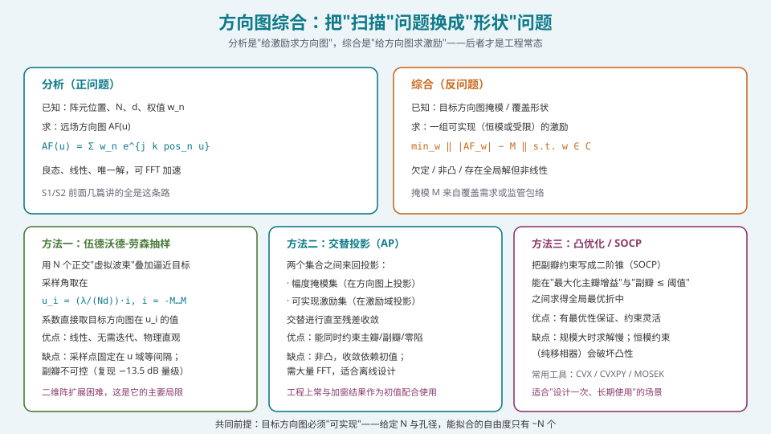
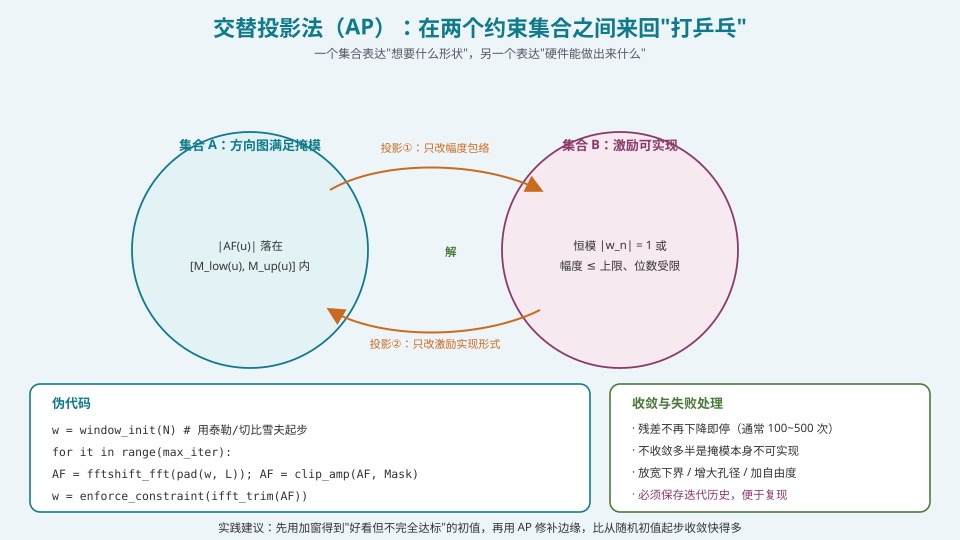
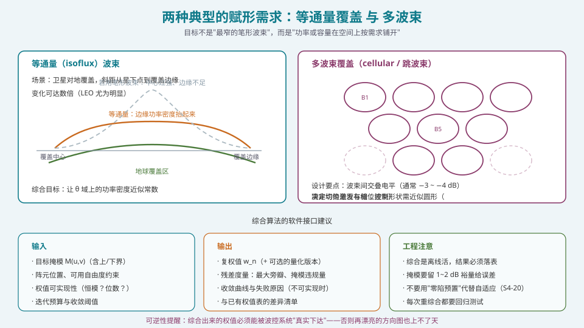

## 本篇要解决什么

S2 前五篇讲的都是**正问题**：

> 已知位置、N、d、权值 \(w_n\) → 求方向图 \(AF(u)\)

但工程中你遇到的多半是**反问题**：

> 卫星需要覆盖地面的一个圆形区域，边缘功率不能太低 → 求权值
> 雷达需要在干扰方向上留一个凹口，同时主瓣保形 → 求权值
> 需要一个"平顶"波束覆盖一片海域 → 求权值

这就叫**方向图综合（pattern synthesis）**。本篇讲清三件事：

1. **问题为什么难** —— 欠定、非凸、有可实现性约束；
2. **三条主流路线** —— 伍德沃德-劳森、交替投影、凸优化，各自的擅长与不擅长；
3. **两个真实需求怎么落地** —— 等通量与多波束。

> **定位提醒**：这一篇是 S2 的收尾，也是 S4 的入口。S4 的 [零陷展宽、宽带与稳健波束形成](pa-null-broadening-robust.html) 里的"主瓣保形"、"确定性零陷"都是综合问题的变体。学完这一篇，"方向图"就从"要背的公式"变成了"可以设计的对象"。

---

## 一、把问题说清楚



*图 1：正问题是"线性、良态、唯一解"；反问题是"欠定、非凸、多解"。这决定了方法论的差异。*

### 1.1 数学表述

**目标**：找到一个激励向量 \(\mathbf w\in\mathbb C^N\)，使得方向图 \(|AF(u)|\) 落在给定的**掩模** \(M(u)\) 内（含上界与下界）。

\[
\min_{\mathbf w}\ \left\|\,\log|AF_{\mathbf w}(u)|-\log M(u)\,\right\|\quad\text{s.t.}\quad \mathbf w\in\mathcal C
\]

其中 \(\mathcal C\) 是**可实现集**，例如：

| 约束 | 含义 |
| --- | --- |
| **恒模** \(|w_n|=1\) | 只用移相器（无衰减器），PA 全部饱和工作（效率最高） |
| **幅度受限** \(|w_n|\le a_{\max}\) | 有限动态范围的衰减器 |
| **量化** \(\angle w_n\in\{0,\frac{2\pi}{2^B},\dots\}\) | B 位移相器 |
| **子阵共享** | 若干阵元共享一条射频链（HBF） |
| **零陷** \(|AF(u_i)|<\varepsilon_i\) | 在指定方向必须低于某电平 |

### 1.2 为什么难

1. **欠定**：有 \(N\) 个复自由度（\(2N\) 个实自由度），而掩模约束有 \(N_u\) 个（\(N_u\gg N\)）。解不唯一。
2. **非凸**：目标函数含 \(|AF|\)，是 \(|\sum w_n e^{j\phi_n}|\)，对 \(\mathbf w\) 非凸。
3. **可实现集非凸**：恒模约束 \(|w_n|=1\) 本身就是一个非凸集（单位圆的并集）。
4. **只能得到"最好"而非"最优"**：除了极少数解析可解的情形（如切比雪夫、泰勒），一般都只能找局部最优。

> **认知校准**：综合问题的正确期待不是"找到唯一正确解"，而是"**在一个可接受的代价内，找到满足掩模的一个解**"。这也意味着：**如果找不到解，往往不是算法不好，而是掩模本身不可实现**（见 §5）。

---

## 二、方法一：伍德沃德-劳森抽样（Woodward-Lawson）

### 2.1 核心思想

用一组**正交的"虚拟波束"**叠加来逼近目标方向图。

对于 \(N\) 元均匀线阵（间距 \(d\)），取 \(N\) 个采样方向：

\[
u_i=\frac{\lambda}{Nd}\cdot i,\qquad i=-\frac{N-1}{2},\dots,\frac{N-1}{2}
\]

这些方向恰好对应**首零点/副瓣零点位置**，因此对应的虚拟波束（等幅 + 线性相位）彼此**正交**。

然后在每个 \(u_i\) 处，用目标方向图的值作为该虚拟波束的权重 \(c_i\)：

\[
c_i=\frac{M(u_i)}{N}
\]

最终的阵元激励是**所有虚拟激励的叠加**：

\[
\boxed{\;I_n=\sum_i c_i\,e^{-j2\pi n d u_i/\lambda}\;}\quad
\Longleftrightarrow\quad
I_n=\text{IDFT}\{c_i\}
\]

### 2.2 一个可运行的实现

```python
import numpy as np

C = 299_792_458.0

def woodward_lawson(mask_fn, N, d_over_lambda, u_range=(-1.0, 1.0), n_samples=None):
    """伍德沃德-劳森抽样综合。

    mask_fn : callable(u) -> 目标幅度（线性，非 dB）；允许返回 0 表示该方向不要辐射
    N       : 阵元数
    d_over_lambda : 间距/波长
    返回    : 阵元激励 I（复数，长度 N）, 采样位置 u_i, 采样系数 c_i
    """
    if n_samples is None:
        n_samples = N

    # 采样位置：在 u 域等间隔，间距 lam/(N d)
    du = 1.0 / (N * d_over_lambda)
    # 覆盖可见空间 [-1, 1] 的采样（可能多于 N 个，也可取恰好 N 个）
    n_side = int(np.floor(1.0 / du))
    i = np.arange(-n_side, n_side + 1)
    u_i = i * du
    u_i = u_i[(u_i >= u_range[0]) & (u_i <= u_range[1])]

    c_i = np.asarray([mask_fn(u) for u in u_i], dtype=float) / N

    # I_n = sum_i c_i * exp(-j 2 pi n d u_i / lam)
    n = np.arange(N)
    I = np.exp(-1j * 2 * np.pi * d_over_lambda * np.outer(n, u_i)) @ c_i
    return I, u_i, c_i

def pattern_from_excitation(I, d_over_lambda, u):
    """由激励算方向图（归一化幅度）。"""
    u = np.atleast_1d(u)
    n = np.arange(len(I))
    a = np.exp(1j * 2 * np.pi * d_over_lambda * np.outer(u, n))
    AF = np.abs(a @ I)
    return AF / AF.max()
```

**试一个方波覆盖**：

```python
def square_mask(u):
    """目标：|u| <= 0.25 内为 1，其余为 0。"""
    return np.where(np.abs(u) <= 0.25, 1.0, 0.0)

I, u_i, c_i = woodward_lawson(square_mask, N=24, d_over_lambda=0.5)
u = np.linspace(-1, 1, 2001)
AF = pattern_from_excitation(I, 0.5, u)
# 在 |u|<=0.25 内应接近 1（有波纹），外侧应快速下降（但不会到 0）
print(AF[np.abs(u) <= 0.25].min())     # 带内最小电平，通常 0.8~0.95
print(AF[np.abs(u) > 0.35].max())      # 带外最大电平，通常 -15~-20 dB
```

### 2.3 特点与局限

| 优点 | 局限 |
| --- | --- |
| **线性**：无需迭代，一次算完 | **采样点固定在 \(u\) 域等间隔**，不能自由选点 |
| **无需初值** | **副瓣不可控**：复现出的副瓣通常在 −13.5 dB 量级（因为虚拟波束本身是均匀激励的） |
| **物理直观**：每个采样点 = 一个波束 | **二维阵扩展困难**（采样点在 \((u,v)\) 平面上需落在特定的格点） |
| 计算量小（一次 IDFT） | **带内波纹**：采样点之间会有起伏，采样越稀波纹越大 |
| 可精确控制**指定方向**的值（若把采样点设在期望位置） | **恒模约束**下需额外处理（得到的 \(I_n\) 一般是复数的，幅度不等） |

**什么时候用**：快速原型、需要精确控制若干指定方向（如"这几个方向必须是零点"）、作为其他算法的初值。

### 2.4 一个重要的历史注记

Woodward-Lawson 发表于 1946/1948 年（P. M. Woodward, *J. IEE*, 1946；Woodward & Lawson, *J. IEE*, 1948）。它的核心思想——"**用有限个正交基函数的叠加来逼近目标函数**"——后来被反复重新发现，在信号处理里叫"滤波器组"，在压缩感知里叫"稀疏基展开"。**理解它，就理解了一整类方法。**

R. S. Elliott 在 1988 年对该方法提出过批评（*IEEE AP-S Newsletter*），主要论点是：它复现出的副瓣电平固定在 −13.5 dB，无法满足低副瓣需求；且不适合二维阵。**这些批评是正确的，也正是交替投影和凸优化诞生的动机。**

---

## 三、方法二：交替投影（Alternating Projection）

### 3.1 核心思想



*图 2：在两个约束集合之间来回投影，收敛到交集附近。这是"投影梯度法"在非凸集合上的自然推广（Gerchberg-Saxton 算法的推广）。*

定义两个集合：

- **集合 A**：所有"满足掩模"的方向图（在方向图空间内）；
- **集合 B**：所有"可实现"的激励（在激励空间内）。

在两者之间**交替投影**：

1. 从激励 \(\mathbf w\) 出发，算方向图；
2. 把方向图的幅度**裁到掩模内**（保持相位不变）——这给出集合 A 中的一点；
3. 反变换回激励，并把激励**投到可实现集**上（如把幅度归一化到恒模、把相位量化）——给出集合 B 中的一点；
4. 重复。

### 3.2 实现

```python
def clip_to_mask(AF, mask_low, mask_up, eps=1e-12):
    """把方向图幅度裁到 [mask_low, mask_up] 内，保留相位。"""
    mag = np.abs(AF)
    ph = AF / np.maximum(mag, eps)
    mag_new = np.clip(mag, mask_low, mask_up)
    return mag_new * ph

def enforce_constant_modulus(w):
    """恒模约束投影：只保留相位。"""
    return np.exp(1j * np.angle(w))

def enforce_quantized_phase(w, bits):
    """B 位量化相位投影。"""
    step = 2 * np.pi / (2 ** bits)
    return np.exp(1j * np.round(np.angle(w) / step) * step)

def alternating_projection(N, d_over_lambda, mask_low_fn, mask_up_fn,
                           u_grid=None, max_iter=300, tol=1e-3,
                           w_init=None, proj="constant_modulus",
                           phase_bits=6, os_factor=8):
    """交替投影法综合赋形方向图。

    mask_low_fn, mask_up_fn : callable(u) -> 掩模下界/上界（线性幅度）
    u_grid                  : 评估方向图的 u 网格（None 则自动生成）
    proj                    : "constant_modulus" | "quantized" | "none"
    """
    if u_grid is None:
        Lu = os_factor * N
        du = 1.0 / (Lu * d_over_lambda)
        u_grid = (np.arange(Lu) - Lu // 2) * du
        u_grid = u_grid[np.abs(u_grid) <= 1.0]

    lo = np.asarray([mask_low_fn(u) for u in u_grid])
    up = np.asarray([mask_up_fn(u) for u in u_grid])

    n = np.arange(N)
    A = np.exp(1j * 2 * np.pi * d_over_lambda * np.outer(u_grid, n))  # (Nu, N)

    if w_init is None:
        w_init = np.ones(N, dtype=complex)
    w = w_init.copy()

    hist = []
    for it in range(max_iter):
        AF = A @ w
        AF_c = clip_to_mask(AF, lo, up)

        # 投影回激励空间（最小二乘）
        w_new = np.linalg.lstsq(A, AF_c, rcond=None)[0]

        if proj == "constant_modulus":
            w_new = enforce_constant_modulus(w_new)
        elif proj == "quantized":
            w_new = enforce_quantized_phase(w_new, phase_bits)

        err = np.linalg.norm(w_new - w) / (np.linalg.norm(w) + 1e-12)
        w = w_new
        hist.append(err)
        if err < tol:
            break
    return w, u_grid, np.array(hist)
```

### 3.3 一个完整的例子：平顶波束 + 指定零陷

```python
def flat_top_with_null():
    # 目标：|u|<=0.3 内为平顶（掩模 [0.9, 1.0]），
    #       u≈0.55 处强零陷（< -35 dB），其余 < -20 dB
    def lo(u):
        if abs(u) <= 0.3:   return 0.90
        if abs(u - 0.55) < 0.02: return 0.0     # 零陷
        return 0.0
    def up(u):
        if abs(u) <= 0.3:   return 1.00
        if abs(u - 0.55) < 0.02: return 10**(-35/20)
        return 10**(-20/20)

    w, u, hist = alternating_projection(
        N=32, d_over_lambda=0.5,
        mask_low_fn=lo, mask_up_fn=up,
        max_iter=400, proj="constant_modulus", os_factor=8)
    print(f"迭代 {len(hist)} 次，最终残差 {hist[-1]:.2e}")
    # 验证
    from numpy import exp
    n = np.arange(32)
    A = exp(1j*2*np.pi*0.5*np.outer(u, n))
    AF = np.abs(A @ w); AF /= AF.max()
    band = np.abs(u) <= 0.3
    print(f"带内最小 {20*np.log10(AF[band].min()):.2f} dB")
    print(f"零陷处   {20*np.log10(AF[np.abs(u-0.55)<0.02].max()):.2f} dB")
```

### 3.4 特点与收敛

| 优点 | 局限 |
| --- | --- |
| 能**同时**约束主瓣形状、副瓣、零陷、恒模 | **非凸**：收敛依赖初值 |
| 迭代式，容易加入各种约束（子阵共享、量化） | 可能收敛到局部最优（或振荡） |
| 实现简单（FFT + 裁剪） | 需要**大量迭代**（通常 100~500 次），适合离线设计 |
| 可证明在两个集合都为凸时收敛（但此处不满足） | 大规模（\(N>10^4\)）时求 `lstsq` 会很慢 |

**实践技巧**：
1. **用加窗结果作初值**（如泰勒 −25 dB），比随机初值收敛快得多；
2. **放松掩模的下界**（带内允许波纹），收敛更容易；
3. **记录迭代历史**，便于复现；
4. **不收敛时先怀疑掩模不可实现**（见 §5），而不是换算法。

---

## 四、方法三：凸优化 / SOCP

### 4.1 只优化副瓣（一个可用凸形式）

若**不**约束恒模（即允许任意复权值），那么"最大化主瓣增益 + 副瓣 ≤ 阈值"是凸问题：

\[
\max_{\mathbf w}\ \text{Re}\{\mathbf w^H\mathbf a(\theta_0)\}\quad
\text{s.t.}\quad |\mathbf w^H\mathbf a(\theta_s)|\le\varepsilon,\ \forall\theta_s\in\Omega_{\text{side}}
\]

这是一个 SOCP（二阶锥规划），可以用 CVXPY 求解：

```python
import cvxpy as cp
import numpy as np

def socp_low_sidelobe(N, d_over_lambda, u0, side_mask_u, eps_lin,
                      normalize=True):
    """SOCP：主瓣增益最大 + 旁瓣压制（无恒模约束）。"""
    n = np.arange(N)

    def a(u):
        return np.exp(1j * 2 * np.pi * d_over_lambda * n * u)

    w = cp.Variable(N, complex=True)
    a0 = a(u0)

    objective = cp.Maximize(cp.real(a0.conj() @ w))
    constraints = [cp.norm(w) <= 1.0]   # 防止无界
    for u_s in side_mask_u:
        constraints.append(cp.abs(a(u_s).conj() @ w) <= eps_lin)

    prob = cp.Problem(objective, constraints)
    prob.solve(solver=cp.CLARABEL)

    wv = w.value
    if normalize:
        wv = wv / np.abs(wv).max()
    return wv, prob.status
```

### 4.2 恒模约束会破坏凸性

若必须 \(|w_n|=1\)，问题变为非凸。常见处理：

| 手段 | 说明 |
| --- | --- |
| **SDR（半定松弛）** | 把非凸约束松弛为矩阵约束，得下界，再随机化取可行解 |
| **逐次凸近似（SCA）** | 在当前点线性化非凸项，迭代求解凸子问题 |
| **交替优化** | 固定相位优化幅度 / 固定幅度优化相位，轮流进行 |
| **相位提取 + 交替投影** | 先用 SOCP 得复权值，再用 §3 的 AP 投影到恒模集 |

**工程判断**：
- 如果系统有**幅度控制**（衰减器或矢量调制器）⇒ 可以接近凸问题，直接用 SOCP；
- 如果是**纯移相器**（恒模）⇒ 需要额外的非凸处理，复杂度上升，实际常退化为"设计幅度 + 投影到相位"的两步法。

### 4.3 三种方法对照

| 维度 | 伍德沃德-劳森 | 交替投影 | 凸优化/SOCP |
| --- | --- | --- | --- |
| 是否有迭代 | 无（一次 IDFT） | 有（100~500 次） | 有（内点法，几十次） |
| 副瓣可控 | ❌ 固定在 −13.5 dB | ✅ | ✅（有最优性保证） |
| 零陷 | ✅（指定方向） | ✅ | ✅ |
| 恒模支持 | 需后处理 | ✅ 原生 | ❌（破坏凸性） |
| 二维阵 | ❌ 困难 | ✅ | ✅ |
| 计算量 | 极低 | 中 | 中高（规模敏感） |
| 适用阶段 | 快速原型 / 初值 | 通用设计 | 指标严格、可离线 |

**实践建议**：**用加窗或伍德沃德-劳森得到初值 → 用交替投影迭代 → 若指标仍不达标，用 SOCP 找最优折中（或作为上界参考）。** 这条流水线覆盖了 90% 的实际需求。

---

## 五、可实现性：为什么有时候"找不到解"



*图 3：两类真实需求。注意"目标不是最窄的笔形波束，而是功率或容量在空间上按需求铺开"。*

### 5.1 自由度计数（第一道判据）

一个 \(N\) 元阵能"塑造"的方向图自由度大约只有 \(N\) 个（实自由度 \(2N\)，但方向图幅度与相位的约束会互相牵制）。

若你的掩模在可见空间内被**离散化为 \(N_u\) 个独立约束**，且 \(N_u\gg N\)，那么**几乎不可能全部满足**。这不取决于算法好坏。

**实用判据**：

\[
\text{可实现性}\approx\frac{\text{掩模的"有效约束数"}}{\text{可用自由度}}\lesssim1
\]

"有效约束数"的估算：主瓣要求 + 需要控制的零点数 + 需要压制到特定电平的角度数。

### 5.2 常见的不可实现情形

| 情形 | 表现 | 解法 |
| --- | --- | --- |
| **平顶边沿太陡** | 迭代不收敛，边沿总有振铃（Gibbs 现象） | 平滑边沿（用升余弦过渡带）；增大孔径 |
| **零陷太深 + 太多** | 零陷达不到目标深度，或主瓣严重变形 | 减少零点数；增 N；接受更浅零陷 |
| **主瓣与零陷太近** | 零陷会把主瓣吃掉 | 拉开角度；用 [零陷展宽](pa-null-broadening-robust.html) 类技术 |
| **带内波纹要求过严** | 波纹无法压到很低 | 放松到 ±0.5 dB；用更多采样点 |
| **恒模 + 深零陷** | 相位自由度不足 | 混合架构（部分幅度控制）；或接受浅零陷 |

### 5.3 【最容易被忽略的约束】权值必须能被波控真实下达

综合出来的 \(\mathbf w\) 再漂亮，也必须是**波控系统能执行**的：

| 约束 | 后果 |
| --- | --- |
| 相位量化（B 位） | 量化误差抬高副瓣、浅化零陷 |
| 幅度量化 | 同上 |
| 波控**更新速率** | 形状波束通常需要更多计算，可能跟不上波束切换节奏 |
| 波控表**存储容量** | 形状波束的权值表不能像常规波束那样用"幅度表 × 相位斜坡"解耦 ⇒ 存储量上升 |
| **温度漂移** | 形状波束对幅相误差更敏感（因为形状约束更紧） |

> **工程规则**：综合阶段就要把波控的实现约束**作为硬约束**纳入，而不是"先设计理想权值再想办法量化"。理想权值 → 量化的"事后处理"通常会损失 3~8 dB 的副瓣/零陷性能。
>
> 正确做法：在设计循环内就调用量化函数（见 [定点化](pa-fixed-point-quantization.html)），把"量化后的方向图"作为评估对象。

---

## 六、两个真实需求

### 6.1 等通量（isoflux）覆盖

**场景**：卫星对地覆盖。星下点到覆盖边缘的**斜距**变化可达数倍（LEO 尤为明显，见 [NTN 轨道与架构](ntn-orbit-architecture.html)）。若用笔形波束，中心过强、边缘不足。

**目标**：让**地球表面**的功率密度近似常数。

推导一下：设卫星到地面点的斜距 \(R(\theta)\)，天线增益 \(G(\theta)\)，则地面功率密度：

\[
S(\theta)=\frac{P_t G(\theta)}{4\pi R^2(\theta)}
\]

要求 \(S\) 为常数 ⇒

\[
G(\theta)\propto R^2(\theta)
\]

**几何关系**（设卫星高度 \(h\)、地球半径 \(R_E\)）：

\[
R^2(\theta)=(R_E+h)^2+R_E^2-2R_E(R_E+h)\cos\theta_{\text{earth}}
\]

其中 \(\theta_{\text{earth}}\) 与扫描角的关系由正弦定理给出。对于 LEO（\(h\sim550\ \text{km}\)、边缘仰角 10°），\(R\) 从星下点约 550 km 变到边缘约 1900 km，**\(R^2\) 变化约 12 倍（10.8 dB）**。

所以等效的目标方向图是：**从中心到边缘增益逐步抬升约 10~11 dB**（而对于更远的边缘还可叠加大气损耗的补偿需求）。

**实现**：这就是一个"目标方向图已知"的综合问题。用交替投影或 SOCP，把目标设为 \(\propto R^2(\theta)\) 的形状。

**注意两点**：
1. **波束不再是"笔形"**，因此"波束宽度"这个概念要重新定义（通常用覆盖边界的角度范围）；
2. **等通量波束的副瓣通常更差**（因为主瓣被"摊开"），需要与合规包络协调。

### 6.2 多波束覆盖（cellular / 跳波束）

**场景**：需要在地面铺一层**近似圆形**的波束网格，波束间有固定交叠（通常 −3 ~ −4 dB），以支持无缝隙切换与频率复用。

**设计要素**：

| 要素 | 说明 |
| --- | --- |
| **波束形状** | 需近似圆形（在 \((u,v)\) 平面），因此要**非均匀激发 + 相位控制** |
| **交叠电平** | −3 ~ −4 dB（决定切换缝隙与干扰） |
| **旁瓣** | 必须低于合规包络（考虑频率复用时的同频干扰） |
| **波束数** | 由覆盖面积与波束间距决定 |

**实现路径**：
1. 对**每个波束**做一次赋形综合（目标是一个"圆形平顶"），得到一组权值；
2. 若要求波束是**正交**的（无交叠），可以用伍德沃德-劳森的虚拟波束或 DFT 波束；
3. 若要**交叠**，需放宽掩模下界，让相邻波束在主瓣边缘有规定电平。

**与通信系统的接口**：波束的重叠电平与形状会直接影响调度器的**用户-波束配对**与**干扰协调**。**综合阶段就应该让系统工程师参与设定交叠电平**，而不是最后才验收。

---

## 七、常见误区清单

**误区一：把"综合"当成"优化算法调参"。**
综合问题的难点在于**掩模是否可实现**，而不是算法是否收敛。花时间在算法上，不如花时间在设计一个"可实现"的掩模上。**先问物理，再问算法。**

**误区二：忘记权值必须可被波控真实下达。**
见 §5.3。理想权值 → 事后量化会损失 3~8 dB 的副瓣/零陷。**把量化放进设计循环。**

**误区三：认为"算法越复杂效果越好"。**
交替投影（30 行代码）通常能达到 SOCP（100 行 + 求解器）的 90% 效果。而 SOCP 在恒模约束下失效，反而可能不如 AP。**选方法要看约束，不只看名字。**

**误区四：把伍德沃德-劳森当成"过时的方法"。**
它的**思想**（正交基展开）是现代方法的基础，且作为初值生成器非常高效。1920 世纪 90 年代的批评针对的是"用它直接做低副瓣综合"，不是否定这个方法。

**误区五：忽略带内波纹（ripple）。**
采样点之间的起伏可能达到 ±1 dB，若通信系统对幅度平坦度有要求（如 EVM 预算），需要加密采样点或放松掩模。

**误区六：用 \(\theta\) 域等间隔采样目标方向图。**
应在 \(u=\sin\theta\) 域等间隔（或按物理意义采样）。\(\theta\) 域等间隔会在端射附近过采样、在正扫附近欠采样。

**误区七：以为等通量波束就是"更宽的波束"。**
它不是"宽"，而是**形状不同**（边缘比中心更强）。它的副瓣特性、扫描特性都不同于笔形波束。**用笔形波束的公式去估算等通量波束会严重出错。**

**误区八：忽略形状波束的存储与计算代价。**
常规波束的权值可以"幅度表 × 相位斜坡"解耦，存储量小。形状波束**不能解耦**，必须整表存储，且每个波束一套。**在系统容量规划时要算进去。**

**误区九：忽略温度漂移对形状波束的影响。**
形状约束比指向约束更紧。指向偏了 0.1° 可能无所谓，但波形变了 1 dB 可能导致覆盖缝隙。**形状波束系统对温补表的要求更高**（见 [校准工程化](pa-calibration-engineering.html)）。

---

## 八、快速自测

**Q1.** 用一段话解释"正问题"与"反问题"的区别，并说明为什么反问题通常没有唯一解。

<details><summary>参考要点</summary>

**正问题**：已知激励（位置、N、d、权值）→ 求方向图。它是**线性**的（\(AF=\sum w_n e^{j\cdots}\)）、**良态**的（连续依赖）、**唯一**的。

**反问题**：已知目标方向图 → 求激励。它是**欠定**的（\(N\) 个复自由度 vs \(N_u\gg N\) 个约束）、**非线性**（目标含 \(|AF|\)）、**非凸**的。

**为什么无唯一解**：因为自由度少于约束数，满足掩模的激励通常有无穷多组。而且"方向图"只反映了 \(AF\) 的**幅度**（在多数应用里相位不关心），进一步减少了有效约束。

**推论**：既然解不唯一，就可以在解集里按**其他准则**挑选——比如"最小化恒模误差"、"最小化权值动态范围"、"满足量化约束"。这实际上是好消息：**多出来的自由度可以用来满足工程约束。**

</details>

**Q2.** 伍德沃德-劳森法的采样点为什么取 \(u_i=(\lambda/(Nd))\,i\)？如果取更密的采样点（比如加倍），会有什么变化？

<details><summary>参考要点</summary>

**为什么取这个间隔**：\(\lambda/(Nd)=1/L\) 恰好是**首零点位置**（对应 \(u\) 域主瓣宽度）。取这组采样点，虚拟波束之间**正交**——一个波束的峰值恰好落在其他波束的零点上。这保证了叠加时"每个采样点的值不被邻居污染"，是方法数学上正确的前提。

**取更密的采样点**：
- **好处**：带内波纹减小（因为用更多正交分量去拟合），逼近精度提高。
- **代价**：① 更密的采样点在 \(u\) 域对应**更长的虚拟阵**（超出物理孔径），其波束无法用 \(N\) 元阵实现 ⇒ 需要截断，引入误差；② 计算量增加；③ 若采样点间距小于 \(\lambda/(Nd)\)，虚拟波束之间不再正交，"每个采样点的值"就不再是该方向的实际方向图值，**方法的理论基础被破坏**。
- **实际做法**：通常取恰好覆盖可见空间的采样点数（约 \(2L/\lambda\) 个），或略多。**加密采样的收益很小，通常不值得。**

</details>

**Q3.** 交替投影法在什么条件下会收敛？为什么在相控阵综合里不能保证收敛？

<details><summary>参考要点</summary>

**收敛条件（经典结果）**：若两个集合都是**凸闭集**，则交替投影收敛到两集合最近点（Cheney & Goldstein, 1959；von Neumann 交错投影定理）。

**在相控阵综合里为什么不保证**：

1. **集合 A（满足掩模的方向图）在方向图空间是凸的**（一个盒约束），✅；
2. **集合 B（可实现激励）在激励空间一般不是凸的**：
   - **恒模约束** \(|w_n|=1\) 是单位圆 —— 非凸；
   - **相位量化** 是有限点集 —— 非凸、不连续；
   - **子阵共享** 是线性约束（凸），这一点是好的；
3. 而且从方向图空间（\(N_u\) 维）到激励空间（\(N\) 维）的"逆投影"本身是降维的（用 `lstsq` 近似），引入了额外的误差。

**实际表现**：
- 通常"收敛"（残差单调下降）到某个局部最优；
- 有时**振荡**（在两个解之间来回跳）；
- 有时**停滞**（因掩模不可实现）。

**工程处理**：设置最大迭代数 + 收敛阈值；记录历史；若不收敛，先检查掩模可实现性（§5），再考虑换初值。

</details>

**Q4.** 为什么"恒模约束会破坏凸性"？举一个具体的例子说明这对求解方法的影响。

<details><summary>参考要点</summary>

**恒模约束集** \(\mathcal C=\{w\in\mathbb C^N: |w_n|=1\ \forall n\}\) 是 \(N\) 个单位圆的笛卡尔积。

**非凸的证明（两个点）**：取 \(N=1\)，\(\mathcal C\) 是复平面上的单位圆。取 \(w_1=1\)、\(w_2=-1\)，两者都在 \(\mathcal C\) 内。但其中点 \((w_1+w_2)/2=0\) **不在** \(\mathcal C\) 内（\(|0|\ne1\)）。所以 \(\mathcal C\) 非凸。✓

**对求解方法的影响**：

1. **内点法不可用**。凸优化的所有算法（内点法、椭球法）都依赖凸性来保证全局最优。恒模约束下，理论保证消失。
2. **松弛会出现**。常用 SDR（半定松弛）：把 \(|w_n|=1\) 放松为 \(\mathrm{diag}(W)=1\)、\(W\succeq0\)、\(W=ww^H\) 的秩 1 约束被丢掉 ⇒ 得到的是**下界**，需随机化取可行解（且可能不可行）。
3. **只能局部最优**。SCA（逐次凸近似）、交替优化、AP 等都只能保证局部收敛。
4. **实用后果**：同样的掩模，恒模系统的可达性能**严格差于**有幅度控制的系统。这也解释了为什么"全数字/矢量调制"架构虽然贵，但在复杂赋形场景下是必要的。

**工程缓解**：
- 若允许**少量幅度控制**（如 ±3 dB），问题从"单位圆"变为"窄环"，非凸性减弱，性能显著改善；
- 若必须严格恒模，可在恒模集和掩模集之间交替投影（§3.2），接受局部最优。

</details>

**Q5.** 一个 LEO 卫星（高度 550 km）要对地做等通量覆盖，边缘仰角 10°。估算从星下点到覆盖边缘所需的增益抬升（dB）。

<details><summary>参考要点</summary>

**几何关系**：设地球半径 \(R_E=6371\ \text{km}\)，卫星高度 \(h=550\ \text{km}\)，星地距离 \(d_s=R_E+h=6921\ \text{km}\)。

边缘点仰角 \(\varepsilon=10°\)。由三角形关系（卫星 S、地心 O、地面点 P，\(\angle OPS=90°+\varepsilon\)）：

\[
\frac{\sin\angle OSP}{R_E}=\frac{\sin(90°+\varepsilon)}{d_s}
\]

\[
\sin\angle OSP=\frac{R_E\cos\varepsilon}{d_s}=\frac{6371\times0.9848}{6921}=0.9066\Rightarrow \angle OSP=65.0°
\]

地心角 \(\angle SOP=180°-90°-10°-... \) 用更直接的公式：

\[
\angle SOP=\arccos\!\left(\frac{R_E}{d_s}\cos\varepsilon\right)-\varepsilon
=\arccos(0.9066)-10°=25.0°-10°=15.0°
\]

卫星到边缘点的斜距（余弦定理）：

\[
R_{\text{edge}}^2=R_E^2+d_s^2-2R_E d_s\cos(15.0°)
=6371^2+6921^2-2\times6371\times6921\times0.9659
\]

\[
=4.059\times10^7+4.790\times10^7-8.516\times10^7=3.33\times10^6\ \text{km}^2
\]

\[
R_{\text{edge}}=\sqrt{3.33\times10^6}=1825\ \text{km}
\]

星下点斜距 \(R_0=550\ \text{km}\)。

**增益抬升**：

\[
\Delta G=10\log_{10}\!\left(\frac{R_{\text{edge}}^2}{R_0^2}\right)
=20\log_{10}\!\left(\frac{1825}{550}\right)=20\log_{10}(3.318)=10.4\ \text{dB}
\]

**所以等通量波束的边缘增益要比中心高约 10.4 dB。**

**还要叠加的项**（这解释了为什么真实设计更复杂）：
- 边缘掠射路径穿过更多大气 ⇒ 大气吸收增加；
- 边缘波束的扫描损耗（若用单面板）⇒ 需要再抬升 3~4 dB；
- 雨衰在低仰角更严重（Ka/Ku 段可达数 dB）。

**总计**：真实设计中，边缘相对中心的增益抬升常达 **12~16 dB**。这是一个非常有挑战性的赋形目标——它把主瓣"摊"得很开，因此副瓣控制会更难。

</details>

**Q6.** 你要综合一个"平顶波束"，覆盖 \(|u|\le0.3\)，要求带内平坦度 ±0.5 dB、第一副瓣 ≤ −25 dB、32 元阵、\(d=\lambda/2\)。给出你的方法与迭代流程。

<details><summary>参考要点</summary>

**第 1 步：评估可实现性。**
- 孔径 \(L/\lambda=Nd/\lambda=16\)。首零点在 \(u=\pm1/16=\pm0.0625\)。覆盖 ±0.3 需要约 \(0.6/0.0625\approx10\) 个"波束宽度"。
- 平顶边沿宽度约 \(\lambda/L=0.0625\)。过渡带不能比这个更陡（否则 Gibbs 振铃）。
- **判断**：孔径够用，但带内波纹控制在 ±0.5 dB 需要认真的综合。

**第 2 步：设计掩模。**
- 带内（\(|u|\le0.25\)）下界 0.94、上界 1.0（预留过渡带）；
- 过渡带（\(0.25<|u|<0.35\)）线性下降；
- 副瓣区（\(|u|>0.35\)）上界 \(10^{-25/20}=0.056\)。
- **不要把掩模设成"方波"**（带内直接跳变），会引入振铃。

**第 3 步：初值。**
用加窗（泰勒 −25 dB）或伍德沃德-劳森（采样点设在 \(|u|\le0.3\) 内）作为初值。

**第 4 步：交替投影迭代。**
- 用 §3.2 的 `alternating_projection`；
- `os_factor=8`（\(u\) 网格足够密，避免漏掉副瓣峰）；
- 若要求恒模 ⇒ `proj="constant_modulus"`；若有幅度控制 ⇒ `proj="none"` 或幅度受限投影。

**第 5 步：验证。**
- 带内最小/最大值（平坦度）；
- 第一副瓣；
- **量化后**的指标（若系统有量化）；
- **扫描到 ±45° 时**的指标（赋形波束通常只在设计角度有效，扫描后形状会变！）。

**第 6 步：若失败，按顺序尝试。**
1. 放宽掩模（带内波纹 ±1 dB、过渡带加宽）；
2. 换初值（多个随机初值各跑一次，取最好）；
3. 增大孔径（若允许）；
4. 用 SOCP 求"最优折中"作为上界参考，判断是"算法问题"还是"物理不可实现"。

**关键提醒**：**赋形波束扫描后会变形**。如果你的系统需要"扫描的形状波束"，复杂度会跃升一个数量级——通常需要按扫描角逐点综合（每个角度一套权值），存储量巨大。

</details>

**Q7.** 解释"为什么综合出来的权值不能直接下发给波控"，并给出把量化约束纳入设计循环的两种做法。

<details><summary>参考要点</summary>

**为什么不能直接下发**：
1. **相位量化**：理想权值有连续相位，移相器只有 \(2^B\) 个状态。量化误差（最大 \(180°/2^B\)）会抬高副瓣、浅化零陷；
2. **幅度量化**：衰减器的步进（如 0.5 dB）无法表示任意幅度；
3. **波控表结构**：常规波束可用"幅度表 × 相位斜坡"解耦；形状波束不能解耦 ⇒ 存储量暴增，可能超出波控的 BRAM；
4. **更新速率**：形状波束的权值不能解析生成，必须查表 ⇒ 切换速度受限于表读取；
5. **温度补偿**：形状波束对幅相误差更敏感 ⇒ 温补表必须更精细。

**两种把量化纳入设计循环的做法**：

**做法 A：在迭代中投影（推荐）**
在交替投影的每一步，把 `enforce_quantized_phase(w, bits)` 作为投影算子。这样求出的解**天生满足量化约束**。
- 优点：一次成型；评估的就是真实性能；
- 缺点：量化使解空间离散，收敛可能变慢或陷入局部最优；需要多次随机初值。

**做法 B：量化感知的目标函数**
在目标函数里加入量化误差惩罚项：

\[
\min_{\mathbf w}\ \|\,|AF_{\mathbf w}|-M\,\|^2+\lambda\cdot\|e^{j\angle\mathbf w}-q(e^{j\angle\mathbf w})\|^2
\]

其中 \(q(\cdot)\) 是量化算子，\(\lambda\) 是权重。
- 优点：可以权衡"形状误差"与"量化误差"；
- 缺点：需要调 \(\lambda\)。

**通用原则**：
- **不要"先设计理想、再量化、再修补"**——这条路径通常会损失 3~8 dB；
- **在设计阶段就用量化后的方向图作为评估对象**；
- 把量化函数与波控的实际能力**一一对应**（位数、步进、动态范围），不要用"理想量化"模型。

参见 [定点化：从浮点仿真到硬件指标不退化](pa-fixed-point-quantization.html)。

</details>

**Q8.** 用"自由度计数"论证：为什么"在 ±60° 内的 20 个指定方向上同时形成 −50 dB 的零陷"对一个 32 元阵是不可实现的？

<details><summary>参考要点</summary>

**自由度**：32 元阵有 32 个复自由度 = 64 个实自由度。但方向图**幅度**的独立可控量远少于这个数（相位与幅度的约束互相牵制）。

**经验规则**：一个 \(N\) 元阵大约能独立控制 \(N\) 个方向图特征点（零点或指定电平点）。所以 32 元阵理论上可以放置约 **32 个零点**。

**但这里的问题不是"零点数"，而是"深度"**：
1. 形成 20 个独立的零陷，需要约 20 个自由度放在这些方向；
2. **每个零陷还要"深"（−50 dB）**，这需要把该方向的响应压到 \(10^{-50/20}=0.0032\) —— 极小的数。要对 20 个方向同时做到，需要的"精度"非常高；
3. 剩下的自由度（约 12 个）还要支撑主瓣与其余副瓣的控制；
4. **在 ±60° 内**（\(|u|\le0.866\)）意味着这些零陷彼此间距较小，方向图在这些角度上需要剧烈振荡 —— 需要的"振荡频率"可能超过孔径能提供的最高空间频率（\(L/\lambda=16\)）。

**更根本的论证（用空间频率带宽）**：
方向图能表达的"空间频率"上限约为 \(L/\lambda=Nd/\lambda=16\)（cycles per unit u）。要在 \(u\in[-0.866,0.866]\)（带宽 1.732）内放置 20 个零点并在其间保持低电平，平均"零点密度"为 \(20/1.732=11.5\) 个/u。而方向图的带宽只有 16 cycles/u —— 每个零点的可用带宽不到 1.4 cycles，**已经接近理论极限**（每个零点至少需要约 1 个"周期"的过渡）。再加上主瓣占用的带宽，**不可实现**。

**结论**：这不是算法问题，是**信息论层面的不可能**。所有算法都会"不收敛"，且这不是 bug。

**工程应对**：
1. **减少零陷数**（要压制最强的几个干扰源，而不是所有）；
2. **放宽零陷深度**（−50 → −30 dB）；
3. **增大阵面**（加 N）；
4. **使用超分辨/子空间方法做 DOA 后再集中资源**（见 [DOA 估计：MUSIC / ESPRIT 与工程改良](pa-doa-music-esprit.html)）——**这是最实用的路径**：不知道干扰从哪来，就只能"广撒网"；知道之后，可以用几个深零陷代替 20 个浅零陷。

</details>

---

## 九、与本站其它专题的连接

| 想了解 | 看哪篇 |
| --- | --- |
| 阵列因子（正问题的闭式解） | [阵列因子：从两个阵元到 N 个阵元](pa-array-factor.html) |
| 傅里叶对偶与空间频率 | [空间频率与空间傅里叶变换](pa-spatial-frequency-fft.html) |
| 加窗（一种"预定的"方向图设计） | [加权加窗：低副瓣设计的完整方法](pa-amplitude-tapering.html) |
| 增益与孔径约束（赋形的物理上限） | [波束宽度、增益与孔径](pa-beamwidth-gain-aperture.html) |
| 栅瓣对综合的约束 | [λ/2 准则：栅瓣的成因、抑制与例外](pa-half-wavelength-criterion.html) |
| 扫描损耗（形状波束扫描后的变化） | [扫描损耗：波束越偏增益越低](pa-scan-loss.html) |
| 数据相关的零陷（自适应） | [自适应波束形成：MVDR 与 LCMV](pa-adaptive-mvdr-lcmv.html) |
| DOA：先定位干扰再集中资源 | [DOA 估计：MUSIC / ESPRIT 与工程改良](pa-doa-music-esprit.html) |
| 零陷展宽与主瓣保形（S4 的直接延续） | [零陷展宽、宽带与稳健波束形成](pa-null-broadening-robust.html) |
| HBF 下的综合与子阵约束 | [混合波束成形（HBF）的子阵设计](pa-hybrid-beamforming.html) |
| 量化约束如何进设计循环 | [定点化：从浮点仿真到硬件指标不退化](pa-fixed-point-quantization.html) |
| 卫星对地覆盖的几何与轨道 | [NTN 轨道与架构](ntn-orbit-architecture.html) |
| 相控阵的物理机制 | [卫星相控阵天线：从阵元到波束](satellite-phased-array.html) |
| 学习体系全貌 | [相控阵天线学习体系：六阶段路线图](phased-array-roadmap.html) |

---

## 十、延伸阅读

**教材**
- Mailloux, *Phased Array Antenna Handbook*, 3rd ed., 第 3 章（"Array Pattern Synthesis"）。**综合问题的最佳单章参考**，覆盖 Woodward-Lawson、Taylor、Bayliss、优化方法等。
- Hansen, *Phased Array Antennas*, 2nd ed., 第 3 章与第 7 章（"Shaped Beam Arrays"）。等通量与赋形波束的工程处理。
- Balanis, *Antenna Theory*, 4th ed., §6.9（阵列综合简介）。
- Elliott, *Antenna Theory and Design*, 第 4 章。Woodward-Lawson 与 Taylor 分布的严格处理。
- Van Trees, *Optimum Array Processing*, 第 3 章（"Synthesis of Array Weights"）。从最优滤波视角看综合问题。
- Boyd & Vandenberghe, *Convex Optimization*。SOCP 在阵列综合里的应用基础；第 4 章与第 6 章必读。

**经典文献**
- P. M. Woodward, "A Method for Calculating the Field over a Plane Aperture Required to Produce a Given Polar Diagram," *J. IEE*, vol. 93, pt. IIIA, pp. 1554–1558, 1946。** Woodward-Lawson 方法的第一篇。**
- P. M. Woodward & J. D. Lawson, "The Theoretical Precision with Which an Arbitrary Radiation-Pattern May be Obtained from a Source of a Finite Size," *J. IEE*, vol. 95, pt. III, no. 37, pp. 363–370, 1948。**第二篇，给出可实现性界限——与本文 §5 的自由度计数呼应。**
- R. S. Elliott, "Criticisms of the Woodward-Lawson Method," *IEEE AP-S Newsletter*, vol. 30, no. 3, p. 43, June 1988。**对该方法的经典批评**，解释了为什么需要迭代方法。
- R. Gerchberg & W. Saxton, "A Practical Algorithm for the Determination of Phase from Image and Diffraction Plane Pictures," *Optik*, 1972。**交替投影法的起源**（虽然是相位恢复问题）。
- H. Lebret & S. Boyd, "Antenna Array Pattern Synthesis via Convex Optimization," *IEEE Trans. Signal Processing*, vol. 45, no. 3, pp. 526–532, 1997。**把凸优化引入阵列综合的里程碑论文。**
- B. Fuchs, "Application of Convex Relaxation to Array Synthesis Problems," *IEEE Trans. AP*, vol. 62, no. 2, 2014。SDR 在综合问题里的应用。

**工程应用笔记**
- S. E. Skip 等关于"shaped beam synthesis"的工程综述（如 Chireix、Silver 的经典著作中的相关章节）。
- Keysight, *How to Design and Test a Phased Array Antenna*，关于"pattern shaping"与"beam coverage"的测试验证章节。
- 相控阵天线模型（`phased-array-antenna-model`）文档中的 "Pattern Synthesis" 与 "Tapering Theory" 部分，给出了可复现的数值例子。
- 关于等通量覆盖的工程参数：3GPP TR 38.821 中关于 NTN 覆盖的讨论，以及 ITU-R S.672（卫星天线增益方向图的参考模板——**这是监管层面对"赋形"的约束**）。
