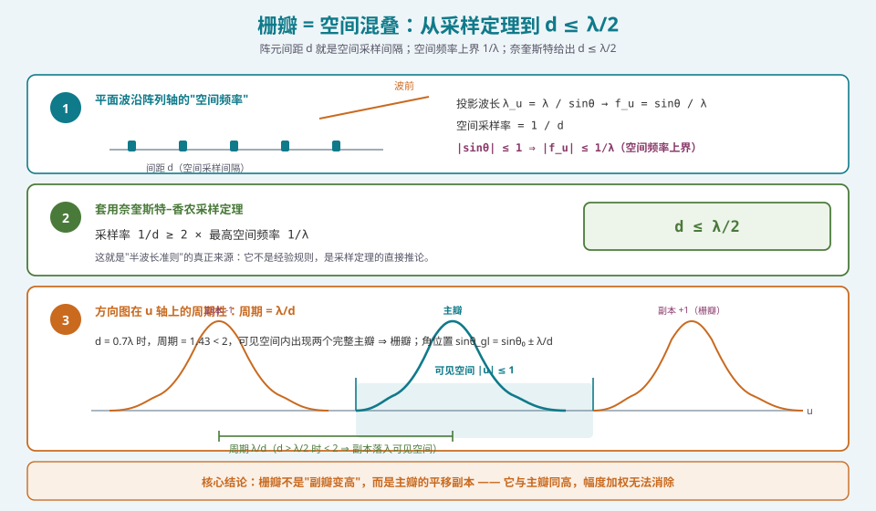
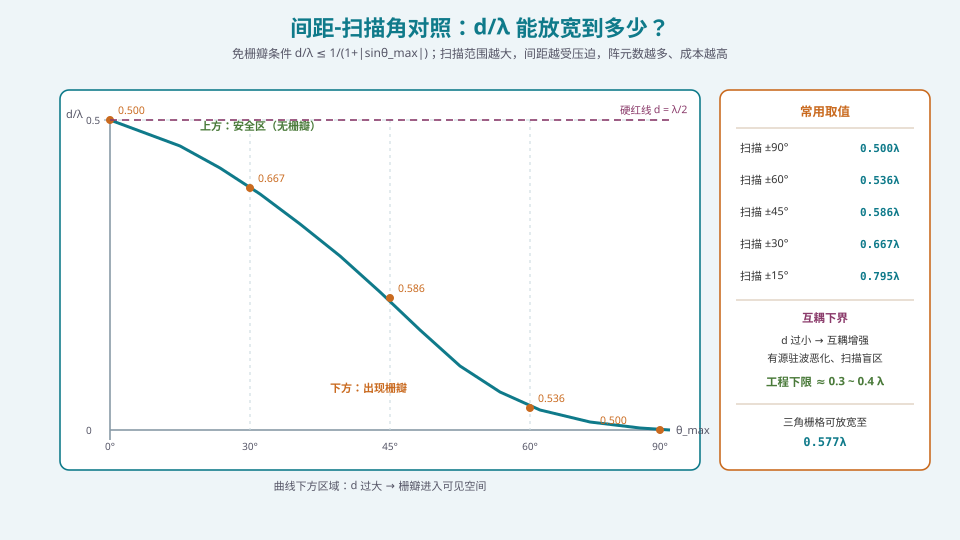
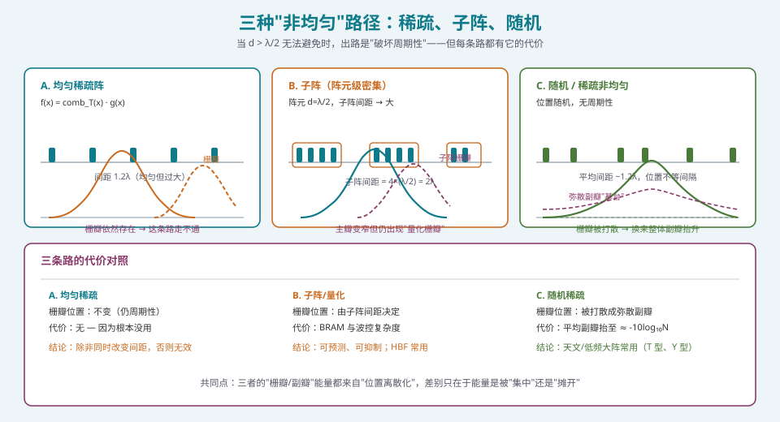

## 本篇要解决什么

上一篇 [空间频率与空间傅里叶变换](pa-spatial-frequency-fft.html) 已经给出结论：**栅瓣是空间混叠**。本篇把这个结论彻底展开，回答三个具体问题：

1. **栅瓣到底出现在什么角度？**（给了公式，就能算，就能在设计评审上当场反驳"应该没事吧"）
2. **为什么加窗、增大阵元数都救不了它？**（这是最多人搞错的一点）
3. **如果 \(d > \lambda/2\) 实在避不开，有哪些出路？各自的代价是什么？**

先行结论，方便你带着答案读：

| 问题 | 答案 |
| --- | --- |
| 栅瓣角位置 | \(\sin\theta_{gl} = \sin\theta_0 \pm \frac{\lambda}{d}\)（一维，均匀激励，正负两侧对称） |
| 免栅瓣条件 | \(d \le \dfrac{\lambda}{1 + \vert\sin\theta_0\vert}\)（\(\theta_0\) 是**最大扫描角**，不是瞬时角） |
| 全半球扫描 | \(d \le \lambda/2\) |
| 加窗能消除吗 | **不能**。主瓣与栅瓣同比例下降，比值不变 |
| 增大 N 能消除吗 | **不能**。N 只让主瓣/栅瓣更窄，不改变它们的高度与位置 |
| 唯一的根治手段 | 减小 \(d\)（提高空间采样率）／破坏周期性（稀疏、随机）／三角栅格（放宽到 \(0.577\lambda\)） |

> **一句话定位**：这是 [相控阵天线学习体系：六阶段路线图](phased-array-roadmap.html) 里 **S1 的第三篇**。它和下一篇 [远场条件与近场世界](pa-far-field-near-field.html) 一起，构成"相控阵模型**适用边界**"的两条腿：一条管**空间采样**（本篇），一条管**距离假设**（下一篇）。**边界搞错，后面全错。**

---

## 一、从采样定理到 \(\lambda/2\)：三步推导

### 1.1 第一步：空间频率是什么，上界在哪

设一束平面波，波长 \(\lambda\)，以角度 \(\theta\) 相对阵列法线入射（\(\theta = 0\) 为正扫）。

把它投影到**阵列轴**上，得到的**投影波长**是：

\[
\lambda_u = \frac{\lambda}{\sin\theta}
\]

这就是"波沿阵列方向看起来的波长"。对应的**空间频率**（每单位长度有多少个周期）是：

\[
f_u = \frac{1}{\lambda_u} = \frac{\sin\theta}{\lambda}
\]

由于 \(|\sin\theta| \le 1\)（这是几何事实，不是近似），**空间频率的绝对值上界是**：

\[
|f_u|_{max} = \frac{1}{\lambda}
\]

**这个上界非常关键**：它说的是"物理世界里，阵列轴上能感受到的最快空间变化是每米 \(1/\lambda\) 个周期"。一个波长 \(1/\lambda\) 个周期，不可能更快——再快就意味着波在空间上比自身波长还密，物理上不存在。

### 1.2 第二步：套奈奎斯特定理

空间采样率是 \(1/d\)（每米 \(1/d\) 个采样点）。奈奎斯特–香农要求：

\[
\frac{1}{d} \;\ge\; 2\,|f_u|_{max} = \frac{2}{\lambda}
\]

即：

\[
\boxed{\;d \;\le\; \frac{\lambda}{2}\;}
\]

**这就是"半波长准则"的真正来源。** 它不是经验规则，也不是"行业惯例"，而是**采样定理在空间域的直接推论**。

> **一个值得记住的对照**：时域里 \(f_s \ge 2f_{max}\) 防止的是"高频信号伪装成低频"（混叠成假频率）；空间域里 \(1/d \ge 2/\lambda\) 防止的是"某个方向的来波伪装成另一个方向"（混叠成假方向）。**假频率会让你把 4 kHz 听成 400 Hz；假方向会让雷达把 ±40° 的干扰当成正扫的目标。**

### 1.3 第三步：用"周期性"重述，并得到栅瓣角位置

上面的推导给了"能不能"，但没给"在哪"。用周期性的视角就能立刻得到位置公式。

方向图在 \(u = \sin\theta\) 轴上是**周期函数**，周期为：

\[
\Delta u_{\text{period}} = \frac{\lambda}{d}
\]

（因为 \(AF(u)\) 的表达式里出现 \(e^{j2\pi(d/\lambda)n u}\)，\(u\) 每变化 \(\lambda/d\) 就整周期重复。）

可见空间是 \(u\in[-1, +1]\)，**长度恰好是 2**。于是：

- \(d \le \lambda/2\) ⟹ \(\lambda/d \ge 2\) ⟹ 可见空间内**至多一个主瓣** ✓
- \(d > \lambda/2\) ⟹ \(\lambda/d < 2\) ⟹ 可见空间内**至少两个主瓣** ✗

栅瓣的位置就是主瓣位置（\(u_0 = \sin\theta_0\)）加减整数倍周期：

\[
\boxed{\;\sin\theta_{gl} = \sin\theta_0 \pm m\frac{\lambda}{d}, \quad m = 1, 2, \dots\;}
\]

只有当 \(|\sin\theta_{gl}| \le 1\) 时，这个栅瓣才**真实存在于可见空间**（能辐射出去）。



*图 1：三步推导。① 平面波的空间频率上界 1/λ；② 奈奎斯特给出 d ≤ λ/2；③ 方向图在 u 轴上的周期为 λ/d，d > λ/2 时周期小于可见空间宽度 2，于是主瓣的平移副本落入可见空间——这就是栅瓣*

### 1.4 免栅瓣条件的一般形式

设最大扫描角为 \(\theta_{max}\)（**注意是最大扫描角，不是瞬时扫描角**）。要求 \(m=1\) 的栅瓣滚出可见空间，即 \(|\sin\theta_{gl}| > 1\)：

\[
\sin\theta_{max} + \frac{\lambda}{d} > 1 \quad\Longrightarrow\quad \frac{d}{\lambda} < \frac{1}{1 + \sin\theta_{max}}
\]

\[
\boxed{\;\frac{d}{\lambda} \;\le\; \frac{1}{1 + |\sin\theta_{max}|}\;}
\]

代入几个常用值：

| 最大扫描角 \(\theta_{max}\) | 允许的最大 \(d/\lambda\) | 换算 |
| --- | --- | --- |
| 0°（仅正扫） | 1.000 | 正扫时甚至可以 \(d = \lambda\) |
| ±15° | 0.795 | 约 \(0.8\lambda\) |
| ±30° | 0.667 | 约 \(2\lambda/3\) |
| ±45° | 0.586 | 约 \(0.59\lambda\) |
| ±60° | 0.536 | 约 \(0.54\lambda\) |
| ±90°（全半球） | 0.500 | 硬红线 \(\lambda/2\) |

**这张表是设计评审里最有用的一张表。** 它的读法：**"扫描范围越大，间距越受压迫，阵元数越多，成本越高。"** 一个声称"标称 ±60°"的系统如果按 \(0.6\lambda\) 布阵，那就是**在 ±45° 以外必然出栅瓣**——这种矛盾在需求评审里非常常见，而这张表能在 10 秒内把它指出来。



*图 2：曲线下方为栅瓣区。同时注意下半部分的"互耦下界"——d 过小会让互耦增强，所以 d 不是越小越好*

---

## 二、为什么加窗和增大 N 都救不了栅瓣

这是本篇最重要的一节，因为它纠正了一个**极常见**的错误认知。

### 2.1 栅瓣是主瓣的"平移副本"，不是"更高的副瓣"

先厘清一个概念。一个方向图上有三类结构：

| 结构 | 来源 | 高度比 | 与 N 的关系 |
| --- | --- | --- | --- |
| **主瓣** | 期望方向 | 0 dB（定义） | 变窄 |
| **副瓣（sidelobe）** | 孔径截断的振铃（Dirichlet 核旁瓣） | −13.2 dB（均匀激励） | 变窄、变密，**高度不变** |
| **栅瓣（grating lobe）** | 空间混叠（周期性副本） | **0 dB（与主瓣同高）** | 变窄，**高度不变、位置不变** |

**关键区别**：副瓣是"截断"的产物，栅瓣是"欠采样"的产物。

- 副瓣来自"孔径是有限的"——**改变截断形状（加窗）就能改善它**。
- 栅瓣来自"位置是周期性的，且周期过小"——**它根本不在"权重"这个维度上，改变权重怎么可能改变它？**

### 2.2 从傅里叶对偶看：加窗是全局卷积

回看 [空间频率与空间傅里叶变换](pa-spatial-frequency-fft.html) 的规则二：加窗 \(w_n \to w_n t_n\) 等价于方向图与窗谱卷积：

\[
AF_{\text{taper}}(u) = AF_{\text{uni}}(u) \circledast T(u)
\]

卷积是**线性时不变操作**，它对整个方向图施加**同一种**作用。于是：

- 主瓣被平滑 → 掉一点
- 栅瓣副本**同样**被平滑 → 掉**同样**一点

**两者高度的比值完全不变。** 你压主瓣 3 dB 去换取副瓣改善，栅瓣也降 3 dB——栅瓣依然与主瓣同高。

> **这就是"加窗治不了栅瓣"的严格证明。** 它不是经验总结，而是从卷积的线性性直接推出的。

### 2.3 从采样定理看：混叠是信息损失

更深一层：**混叠是不可逆的信息损失**。

在时域 DSP 里，如果你以 8 kHz 采样一个含有 5 kHz 分量的信号，**你无法从采样结果中分辨出这个 5 kHz 是真的 5 kHz 还是被折返的 3 kHz**。这个歧义**不在数据里**，无法通过任何后处理消除。你唯一的出路是**重新采样**（提高采样率）。

空间域同理：**阵列无法从它收到的信号里分辨出"来波角度"与"来波角度 + λ/d"**。这两个来波产生的相位序列**完全相同**（因为相位差差 \(2\pi\) 的整数倍）。这个歧义不在数据里，无法通过改变权值消除。

**唯一的出路是"重新采样"——减小 \(d\)，或者用非周期布局打破"多个方向产生同一组相位"这种退化。**

### 2.4 一个反直觉的推论：增大 N 会让栅瓣更"明显"

既然栅瓣与主瓣同高，那增大 \(N\) 会发生什么？

- 主瓣变窄（\(u\) 域宽度 \(\approx 2/N\)）
- 栅瓣**同样变窄**（它是主瓣的副本！）
- 栅瓣位置**完全不变**

**所以增大 N 让栅瓣变得更"尖锐"、能量更集中。** 从干扰/EMC 的角度看，**这可能更糟**——一个又窄又强的假波束，更容易在特定方向上造成严重干扰，也更容易违反监管的旁瓣包络。

**结论**：**"我多加点阵元就不怕栅瓣了"是完全错误的。** 增加 N 只能提高增益和分辨率，无法触及栅瓣。

---

## 三、子阵栅瓣与量化栅瓣：工程里更常见的变体

真实的阵列里，"间距过大"往往不是设计失误，而是**架构带来的必然**。两种最常见的变体：

### 3.1 子阵栅瓣（子阵级架构）

在混合波束成形（[混合波束成形（HBF）的子阵设计](pa-hybrid-beamforming.html)）里，常见结构是：

- **阵元级**：\(d_e = \lambda/2\)，密集布阵
- **子阵级**：每个子阵有 \(M\) 个阵元，子阵中心间距 \(d_s = M\cdot d_e\)

如果子阵内部的配相是**模拟域**（子阵内所有阵元共用一组相位），而子阵之间的加权在**数字域**，那么：

\[
AF_{\text{total}} = AF_{\text{element}}(u)\times \underbrace{AF_{\text{subarray}}(u)}_{\text{周期为 }\lambda/d_s}\times \underbrace{AF_{\text{digital}}(u)}_{\text{仅子阵级}}
\]

**子阵级的方向图周期是 \(\lambda/d_s\)，而 \(d_s = M\cdot \lambda/2\) 往往远大于 \(\lambda/2\)。** 于是**子阵层面必然出现栅瓣**——这就是所谓的**子阵栅瓣（subarray grating lobe）**，工程上也叫**量化栅瓣（quantization grating lobe）**。

**关键观察**：子阵栅瓣**不是零陷**，它是一个**真实的高电平副瓣**（可以接近 0 dB，取决于子阵内的加权）。这在 HBF 系统里是核心设计约束之一。

**抑制手段**（在 [混合波束成形（HBF）的子阵设计](pa-hybrid-beamforming.html) 里详述）：

1. **重叠子阵（overlapped subarray）**：相邻子阵共享部分阵元，等效于对子阵级做了加权，压制子阵栅瓣。
2. **子阵级数字加权**：在数字域对子阵输出做低副瓣加权（代价：有效子阵间距被"软化"）。
3. **非规则子阵划分**：让子阵尺寸不等，破坏周期性。

### 3.2 量化栅瓣 vs 相位量化副瓣：容易混淆的两个词

务必要区分这两个概念：

| 名称 | 成因 | 表现 | 位置 |
| --- | --- | --- | --- |
| **量化栅瓣**（subarray/quantization grating lobe） | **空间**采样不足（子阵间距大） | 高峰值副瓣，甚至接近主瓣 | 由 \(d_s\) 决定，**可预测** |
| **相位量化副瓣**（phase quantization sidelobe） | **移相器位数不足**（相位量化） | 离散副瓣群，通常较低（如 6 bit → 约 −40 dB 量级） | 由量化相位误差分布决定，**伪随机分布** |

**这两者的成因完全不同，解决手段也完全不同**：

- 量化栅瓣 → 改变**阵元/子阵的物理布局**
- 相位量化副瓣 → 增加**移相器位数**（成本）或**利用大阵的统计平均**（免费）

详细的移相器位数分析见 [移相器与真时延器件（TTD）](pa-phase-shifter-ttd.html)。

> **一个实用的区分方法**：如果那个高电平副瓣的**位置**随频率按 \(d_s\) 的规律移动，它是量化栅瓣；如果它的位置基本固定在"量化副瓣的典型位置"（与 \(N\) 和相位数相关），并且**随相位数增加而降低**，它是相位量化副瓣。

---

## 四、当 \(d > \lambda/2\) 无法避免：三条出路

有时候物理尺寸限制让你无法做到 \(\lambda/2\)——低频阵列（如 HF/VHF 雷达、射电望远镜）、需要大间距以降低互耦的场景、或者为了省阵元数。这时有三条路。



*图 3：A 均匀稀疏（无效）、B 子阵（可预测、可抑制）、C 随机稀疏（把栅瓣摊成弥散副瓣）*

### 4.1 出路一：非均匀 / 随机稀疏布阵

**原理**：破坏周期性，让"多个方向产生同一组相位"这个退化消失。

**效果**：离散的栅瓣被打散成**弥散的副瓣基台（sidelobe pedestal）**。

**代价（定量）**：\(N\) 元随机阵列的**平均副瓣电平**约为：

\[
\overline{\text{SLL}} \approx -10\log_{10}N \quad [\text{dB}]
\]

| N | 平均副瓣 | 对比 |
| --- | --- | --- |
| 16 | −12 dB | 与均匀阵的 −13.2 dB 相当 |
| 64 | −18 dB | 优于均匀阵第一副瓣，但**没有零陷** |
| 256 | −24 dB | 明显优于均匀阵 |
| 1024 | −30 dB | 大型射电阵的量级 |

**关键权衡**：随机稀疏阵**没有深零陷**——因为"每个方向都有一点能量"。这在抗干扰场景里是严重缺陷（无法形成深零陷），但在**天文观测**（只关心积分灵敏度）和**宽角覆盖**场景里可以接受。

**典型应用**：射电望远镜的 T 型 / Y 型阵（VLA、WSRT、LOFAR）、低频声呐阵列。

### 4.2 出路二：三角 / 六边形栅格（二维阵的免费午餐）

对**二维阵**，如果允许的最大间距放宽到 \(d\)，矩形栅格的免栅瓣条件是 \(d\le\lambda/2\)，而**三角栅格**可以放宽到：

\[
d \le \frac{\lambda}{\sqrt{3}} \approx 0.577\lambda
\]

**代价对比（同样孔径、同样覆盖）**：

- 间距放宽 15.5%
- **单元面积**：矩形 \(d^2\) vs 三角 \(\frac{\sqrt3}{2}d^2\)，三角的单元面积是矩形的 \(\frac{\sqrt3}{2}\times 1.155^2 = 1.155\) 倍
- 即**同样孔径下阵元数减少约 13%**（常见引用口径是"间距放宽 15%、元件数减少 25%"，取决于比较基准——按单元面积 \(0.25\lambda^2\) 对比 \(0.2887\lambda^2\)，元件数减少约 13.4%；若以"指定覆盖范围所需阵元数"口径计算，可接近 25%）

> **保守说法**：**三角栅格能在同样覆盖下少用 10~20% 的阵元，代价是馈电网络布局更复杂、波控的行列解耦性变差。** 对大型二维阵（>1000 元），省下的射频链路成本通常远超增加的布线复杂度。

### 4.3 出路三：接受栅瓣，但把它"用起来"

某些系统**主动利用栅瓣**，而不是消除它：

- **雷达的"栅瓣成像"**：利用多个栅瓣同时覆盖多方向，做多目标快速捕获（代价：方向模糊需要额外处理）。
- **通信的"多波束覆盖"**：某些卫星载荷在宽角覆盖时，就把栅瓣当成"额外的固定波束"使用。
- **相控阵的周期延拓**：在频扫阵列（frequency-scanned array）里，栅瓣的位置随频率变化，天然形成"频扫"机制。

**这条路的适用条件很窄**：必须能接受方向模糊，或者有额外的机制（频率、编码）来解模糊。**在通信与大多数雷达里，这条路基本不可用。**

### 4.4 出路四（列出来但通常不可行）：提高频率

由 \(d \le \lambda/2\) 可知，**频率越高，容许的物理间距越小**。反过来，如果物理间距 \(d\) 被结构限制死了，**降低频率**（增大 \(\lambda\)）可以满足条件——但这通常不是"选择"，而是"限制"。

**真实场景**：卫星载荷的喇叭/馈源口径限制、机载雷达的安装空间限制，往往让设计者只能在"降低工作频段"或"接受栅瓣"之间选。**这也是为什么同一个平台上的不同频段阵列，架构差异可能很大。**

---

## 五、验证代码：把栅瓣算出来

```python
import numpy as np

def grating_lobe_angles(N, d_over_lambda, theta0_deg, m_max=3):
    """计算所有落在可见空间内的栅瓣角度（一维均匀线阵）"""
    u0 = np.sin(np.deg2rad(theta0_deg))
    out = []
    for m in list(range(-m_max, 0)) + list(range(1, m_max + 1)):
        u = u0 + m / d_over_lambda          # sinθ_gl = sinθ0 + m·λ/d
        if abs(u) <= 1.0:
            out.append((m, np.rad2deg(np.arcsin(u))))
    return out

def max_spacing(theta_max_deg):
    """免栅瓣的最大间距（以波长为单位）"""
    return 1.0 / (1.0 + abs(np.sin(np.deg2rad(theta_max_deg))))

# --- 对照表验证 ---
for t in [0, 15, 30, 45, 60, 90]:
    print(f"扫描 ±{t:2d}° → d_max = {max_spacing(t):.3f} λ")

# --- 栅瓣位置验证 ---
print("\nd=0.7λ, 正扫:")
for m, ang in grating_lobe_angles(32, 0.7, 0.0):
    print(f"  m={m:+d}: 栅瓣在 {ang:+.2f}°")
# 预期: m=+1 → asin(1/0.7)=asin(1.4286) 超出可见空间, 实际不出现
#       对 d=0.7λ, λ/d = 1.4286 > 1, 故 m=±1 均在可见空间外
#
# 改用 d=1.5λ (真会出栅瓣):
print("d=1.5λ, 正扫:")
for m, ang in grating_lobe_angles(32, 1.5, 0.0):
    print(f"  m={m:+d}: 栅瓣在 {ang:+.2f}°")

def pattern(N, d_over_lambda, theta0_deg, theta_deg, taper=None):
    n = np.arange(N)
    a0 = np.exp(1j * 2 * np.pi * d_over_lambda * n * np.sin(np.deg2rad(theta0_deg)))
    w = a0.conj() / N
    if taper is not None:
        w = w * taper
    A = np.exp(1j * 2 * np.pi * d_over_lambda * np.outer(np.sin(np.deg2rad(theta_deg)), n))
    return np.abs(A @ w) ** 2

# --- 关键验证：加窗不能消除栅瓣 ---
theta = np.linspace(-90, 90, 3601)
P_u = pattern(32, 1.5, 0.0, theta)
P_t = pattern(32, 1.5, 0.0, theta, taper=np.hamming(32))

def peaks(P):
    idx = np.where((P[1:-1] > P[:-2]) & (P[1:-1] > P[2:]))[0] + 1
    return np.sort(P[idx])[::-1][:4]

print("\n均匀激励前 4 个峰值(dB):", np.round(10*np.log10(peaks(P_u)), 2))
print("汉明加窗前 4 个峰值(dB):", np.round(10*np.log10(peaks(P_t)), 2))
# 预期结论：加窗后各峰值同步下降，主瓣与栅瓣的差值基本不变
```

**这段代码能验证的四件事**：

1. **对照表正确**：`max_spacing(60)` 应输出 ≈ 0.536。
2. **栅瓣角位置公式正确**：\(d = 1.5\lambda\) 正扫时，栅瓣应出现在 \(\pm\arcsin(1/1.5) = \pm41.8°\)。
3. **\(d = 0.7\lambda\) 正扫时无栅瓣**（因为 \(\lambda/d = 1.43 > 1\)），但**扫到 ±30° 就会出现**（\(\lambda/d = 1.43 < 1 + 0.5 = 1.5\)）。这正是"正扫测试通过、大角测试失败"这个经典现场问题的数学解释。
4. **加窗后峰值差不变**：均匀激励下主瓣与栅瓣差几 dB，加窗后两者同步下降，**差值几乎不变**。

> **强烈建议把第 3 条亲自跑一遍**。"正扫没问题，一扫描就出栅瓣"是工程现场最常见的争议之一，能在评审现场把这两种情况都演示出来的工程师，沟通效率会高一个数量级。

---

## 六、常见误区清单

**误区一：认为栅瓣"就是副瓣抬高了"。**
栅瓣与主瓣**同高**（均匀激励下 0 dB），是主瓣的**平移副本**。副瓣则是 −13.2 dB 量级的振铃。两者在成因、高度、解决手段上完全不同。

**误区二：认为加窗可以消除栅瓣。**
加窗是**全局卷积**，对主瓣与栅瓣施加同一作用，**比值不变**。见 §2.2 的证明。**这是最常见的一个错误认知，也是本篇最希望纠正的一点。**

**误区三：认为"增大阵元数就能压住栅瓣"。**
增大 \(N\) 只让主瓣和栅瓣**同时变窄**，位置与高度都不变。**从 EMC 角度看甚至更糟**（更尖锐的假波束）。

**误区四：把"标称扫描范围"与"性能保证范围"混为一谈。**
一个 \(d = 0.6\lambda\) 的阵，声称"±60°"在**物理上是矛盾的**：免栅瓣条件只允许 ±45°。**在需求评审里必须把这两个概念分会**：标称范围可以是 ±60°（波束确实能指过去），但 ±45° 以外**会有栅瓣**，性能不保证。

**误区五：忽略"最大扫描角"是设计输入，而不是结果。**
\(d\) 的选择依赖 \(\theta_{max}\)，而 \(\theta_{max}\) **必须在布阵之前确定**。常见错误流程：先按"标准 \(\lambda/2\)"布阵，后来发现需求要 ±70°，此时已无法返工（除非 \(\lambda/2\) 本来就够）。**正确的流程是反过来的**：先确定 \(\theta_{max}\)，算出 \(d_{max}\)，再选 \(d\)。

**误区六：把"相位量化副瓣"叫成"栅瓣"。**
两者名字里都有"量化/栅"，但成因完全不同。前者由**移相器位数**决定，后者由**子阵间距**决定。混淆会导致选错解决方案（去加移相器位数，结果发现没用）。

**误区七：以为"互耦让 d 越小越好"。**
\(d\) 过小会显著增强互耦，导致：有源驻波随扫描角恶化、出现**扫描盲区（scan blindness）**、单元方向图畸变。**工程上 d 的可行区间是 [0.3λ, λ/2] 这样的"夹心区间"**，不是越小越好。详见 [功分合成网络与互耦效应](pa-feed-network-mutual-coupling.html)。

**误区八：忽略"栅瓣是真实辐射"。**
栅瓣里流走的是**真实功率**——它降低了天线效率、可能违反监管包络、可能被干扰方利用（在栅瓣方向注入干扰，等效于对准主瓣）。**它不是画图时多出来的一条线。**

---

## 七、快速自测

**Q1.** 用奈奎斯特定理推导 \(d\le\lambda/2\)，并说明"最高空间频率是 \(1/\lambda\)"的依据。

<details><summary>参考要点</summary>

**依据**：平面波沿阵列轴的投影波长 \(\lambda_u = \lambda/\sin\theta\)，空间频率 \(f_u = 1/\lambda_u = \sin\theta/\lambda\)。因为 \(|\sin\theta|\le1\) 是几何约束，所以 \(|f_u| \le 1/\lambda\)。
**推导**：空间采样率 \(1/d \ge 2|f_u|_{max} = 2/\lambda\) ⟹ \(d \le \lambda/2\)。
**要点提示**：这个"上界"来自几何，不是来自信号带宽。也就是说，**无论你的信号多窄带，空间频率上界都是 \(1/\lambda\)**——所以栅瓣与信号带宽无关，只与间距和波长有关。

</details>

**Q2.** 一个 64 元均匀线阵，\(d = 0.7\lambda\)。求正扫（\(\theta_0 = 0°\)）和扫到 \(30°\) 时是否有栅瓣，若有请给出角度。

<details><summary>参考要点</summary>

周期为 \(\lambda/d = 1/0.7 = 1.4286\)（在 \(u\) 轴上）。
**正扫**：\(u_0 = 0\)，栅瓣需满足 \(|0 + m/0.7|\le1\) ⟹ \(|m| \le 0.7\) ⟹ 无整数解 ⟹ **无栅瓣**。
**扫到 30°**：\(u_0 = 0.5\)。\(m=-1\) 时 \(u = 0.5 - 1.4286 = -0.9286\)，\(|u|\le1\) ✓ ⟹ **有栅瓣**，位置 \(\theta = \arcsin(-0.9286) = -68.2°\)。
（\(m=+1\) 时 \(u = 1.9286\)，超出可见空间。）
**这个例子的教学价值**：同一个阵列，正扫"合格"，扫到 30° 就"不合格"。**测试大纲必须覆盖最大扫描角，只测正扫是无效验证。**

</details>

**Q3.** 为什么加窗不能消除栅瓣？请分别从"频率域卷积"和"混叠信息损失"两个角度回答。

<details><summary>参考要点</summary>

**角度一（傅里叶对偶）**：加窗 \(w_n t_n\) 在空间频域等价于 \(AF \circledast T\)。卷积是线性操作，对主瓣与栅瓣施加**同一种**平滑作用，**两者高度比不变**。
**角度二（采样定理）**：栅瓣的本质是"来波角度 \(\theta\) 与 \(\theta' = \arcsin(\sin\theta + \lambda/d)\) 产生的相位序列完全相同"这一**退化（ambiguity）**。这个歧义**不在数据里**（同一组采样数据对应两个物理场景），无法通过改变权值消除。权重只能改变"如何组合这些采样"，不能增加"采样所携带的信息量"。
**结论**：唯一手段是提高采样率（减小 \(d\)）或破坏周期性（非均匀布局）。

</details>

**Q4.** 一个混合波束成形系统，阵元间距 \(\lambda/2\)，每个子阵含 8 个阵元，子阵内模拟配相、子阵间数字加权。问：会不会出现栅瓣？出现在哪？如何抑制？

<details><summary>参考要点</summary>

**会**。子阵中心间距 \(d_s = 8\times\lambda/2 = 4\lambda\)，子阵级方向图周期为 \(\lambda/d_s = 0.25\)，远小于 2，因此可见空间内会出现**多个子阵栅瓣（量化栅瓣）**。
**位置**：\(\sin\theta_{gl} = \sin\theta_0 \pm m/4\)，即相对主瓣间隔 \(\Delta(\sin\theta) = 0.25\) 的副本簇。
**抑制手段**：
1. **重叠子阵**：相邻子阵共享阵元，等效于对子阵级做加权（成本：馈电网络复杂度上升）。
2. **子阵级数字低副瓣加权**：在数字域对子阵输出加窗（成本：主瓣展宽、增益略降，且在扫描时需重算）。
3. **非规则子阵划分**：子阵尺寸不等，破坏周期性（成本：布局与波控复杂度上升）。
4. **混合方案**：子阵级稀疏 + 数字加权联合优化。
**重要提醒**：子阵栅瓣的抑制与子阵内的阵元数、子阵划分方式强耦合，必须在架构选型阶段就规划。详见 [混合波束成形（HBF）的子阵设计](pa-hybrid-beamforming.html)。

</details>

**Q5.** 为什么说"互耦让 \(d\) 不是越小越好"？给出一个具体的失效模式。

<details><summary>参考要点</summary>

**失效模式：扫描盲区（scan blindness）**。
当 \(d\) 显著小于 \(\lambda/2\) 时，阵元间互耦增强，有源输入阻抗随扫描角剧烈变化。在某些特定扫描角上，可能出现**有源反射系数接近 1** 的情况——此时单元几乎把入射功率全部反射回去，**阵列在该方向上接收/发射能力崩塌**，形成"盲区"。
**机理**：互耦产生的表面波与阵元方向图在某个角度上发生相消干涉（或与 Floquet 高阶模耦合），导致单元有源方向图在该角度上出零。
**工程对策**：
1. 把 \(d\) 控制在 \(0.4\lambda \sim 0.5\lambda\) 的"夹心区间"；
2. 使用介质基板与接地层设计抑制表面波（如 EBG 结构、过孔墙）；
3. 用有源阻抗测量与校准网络补偿（但这只能补偿、不能根治深零陷）。
**结论**：\(d\) 的选择是在"栅瓣（d 太大）"与"互耦/盲区（d 太小）"之间的双边界约束问题。详见 [功分合成网络与互耦效应](pa-feed-network-mutual-coupling.html)。

</details>

**Q6.** 二维矩形阵改为三角栅格，间距可以从 \(0.5\lambda\) 放宽到多少？为什么？这个改变会带来什么额外代价？

<details><summary>参考要点</summary>

**放宽到 \(\lambda/\sqrt3 \approx 0.577\lambda\)。**
**理由**：在 \((u,v)\) 平面上，阵列位置格点对应的方向图"光栅"（grating lattice）是位置格点的**对偶格点**。矩形格点的对偶也是矩形，需要间距 \(>2\) 才能让可见单位圆内只含一个格点（对应 \(d\le\lambda/2\)）；三角/六边格点是**密排的**，其"能覆盖单位圆、且每方向只有一个格点"的最大间距是 \(\lambda/\sqrt3\)。
**额外代价**：
1. **馈电网络布局复杂**：行列不再正交，垂直/水平馈线需要折线或斜向走线；
2. **波控计算与 LUT 结构复杂**：不再是 \(2N\) 个独立的行列相位，需要按 \((x_i,y_i)\) 逐元计算；
3. **热设计**：三角密排使单元间热耦合更强（对高功率发射阵是问题）；
4. **机械加工**：PCB 斜向布线与结构件配合难度上升。
**收益**：同样孔径下阵元数减少约 13%，对 >1000 元的大型二维阵，**省下的射频链路（每个含 PA/LNA/移相器/衰减器）成本通常远超布线成本增量。**

</details>

**Q7.** 一个低频雷达（300 MHz）需要 ±45° 扫描、方位向孔径 6 m。问这一维需要多少个阵元？如果改成 ±30° 扫描，能省多少？

<details><summary>参考要点</summary>

\(\lambda = c/f = 3\times10^8/3\times10^8 = 1\) m。
**±45°**：\(d_{max}/\lambda = 1/(1+\sin45°) = 1/1.707 = 0.586\) ⟹ \(d = 0.586\) m。阵元数 \(N = 6/0.586 + 1 \approx 11.2\) ⟹ **取 12 元**（间距 ≈ 0.545 m，满足条件）。
**±30°**：\(d_{max}/\lambda = 1/(1+0.5) = 0.667\) ⟹ \(d = 0.667\) m。\(N = 6/0.667 + 1 = 10\) ⟹ **取 10 元**。
**省多少**：12 → 10，**省约 17%（2 个通道）**。
**额外观察**：低频阵列的特点就是"**物理上很大，电子上很少**"——因为 \(\lambda\) 大，\(\lambda/2\) 也大，所以 6 m 孔径只需要约 12 元。这与毫米波阵列形成鲜明对比（28 GHz 时 \(\lambda = 10.7\) mm，6 m 孔径需要 1120 元）。
**推论**：**同样的物理孔径，频率越高阵元数越多，成本越高**；推论二：**同一物理孔径下，扫描范围要求每放宽一点，阵元数的增加在低频下"便宜"，在高频下"昂贵"。**

</details>

---

## 八、与本站其它专题的连接

| 想了解 | 看哪篇 |
| --- | --- |
| 空间频率、傅里叶对偶、"扫描=频移" | [空间频率与空间傅里叶变换](pa-spatial-frequency-fft.html) |
| 复数与配相的数学基础 | [相控阵的数学语言：复数、相量与相量运算](pa-math-complex-phasor.html) |
| 模型的另一条边界：远场距离假设 | [远场条件与近场世界](pa-far-field-near-field.html) |
| 用阵列因子工具验证这些结论 | [阵列因子：从两个阵元到 N 个阵元](pa-array-factor.html) |
| \(\lambda/2\) 准则的完整工程处理与例外 | [λ/2 准则：栅瓣的成因、抑制与例外](pa-half-wavelength-criterion.html) |
| 子阵栅瓣与 HBF 架构设计 | [混合波束成形（HBF）的子阵设计](pa-hybrid-beamforming.html) |
| 移相器位数与"相位量化副瓣"（别混淆） | [移相器与真时延器件（TTD）](pa-phase-shifter-ttd.html) |
| 互耦、扫描盲区与 d 的下界 | [功分合成网络与互耦效应](pa-feed-network-mutual-coupling.html) |
| 扫描损耗（"波束不变但增益下降"的另一半解释） | [扫描损耗：波束越偏增益越低](pa-scan-loss.html) |
| 监管层面的旁瓣包络（栅瓣的合规后果） | [规范与认证地图：从 38.101 到 CTIA 到 ITU-R](pa-conformance-standards.html) |
| 学习体系全貌 | [相控阵天线学习体系：六阶段路线图](phased-array-roadmap.html) |

---

## 九、延伸阅读

**教材**
- Mailloux, *Phased Array Antenna Handbook*, 3rd ed., §2.3（栅瓣与扫描）与 §7.4（子阵与量化栅瓣）。**子阵栅瓣的权威处理**。
- Hansen, *Phased Array Antennas*, 第 1 章 §1.6（栅瓣条件）与第 9 章（稀疏阵与随机阵）。
- Balanis, *Antenna Theory*, 4th ed., §6.6（扫描与栅瓣）。

**信号处理视角**
- Oppenheim & Schafer, *Discrete-Time Signal Processing*, §4.2（采样定理）与 §4.6（混叠）。**逐条对照读，收获极大。**
- 图像处理中的 aliasing / moiré 现象教程。**同一数学，视觉上直接可见**，是建立直觉最快的方式。

**专题文献**
- R. J. Mailloux, "Phased Array Theory and Technology," *Proceedings of the IEEE*, vol. 70, no. 3, 1982。经典综述。
- 稀疏阵优化：R. L. Haupt, "Thinned Arrays Using Genetic Algorithms," *IEEE Trans. AP*, 1994。稀疏布阵的代表性方法。
- 三角栅格：Hansen 书中对 hexagonally-spaced arrays 的处理。

**工程应用笔记**
- Analog Devices, *Phased Array Antenna Patterns — Part 2: Grating Lobes and Beam Squint*。栅瓣位置公式与图示极清晰，可直接复现。
- Keysight, *How to Design and Test a Phased Array Antenna*，第 4 章。含"标称范围与性能范围"的工程讨论。
- 任意一份 ITU-R S.580 / S.465 的旁瓣包络定义，看"栅瓣"从数学现象变成**合规条款**的样子。
