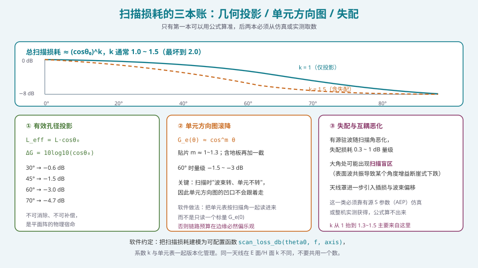
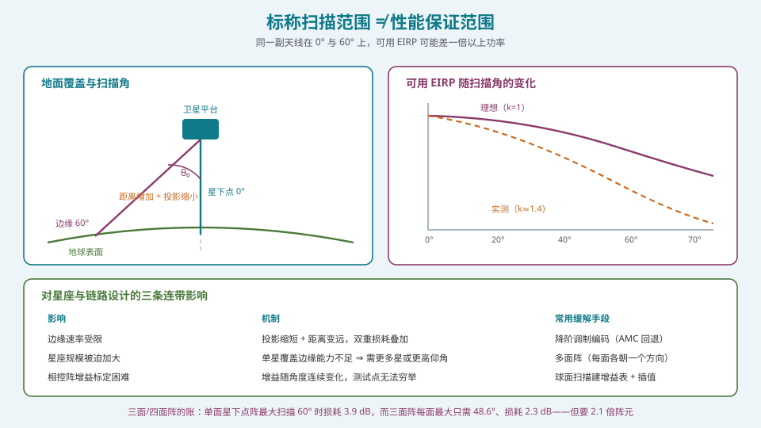
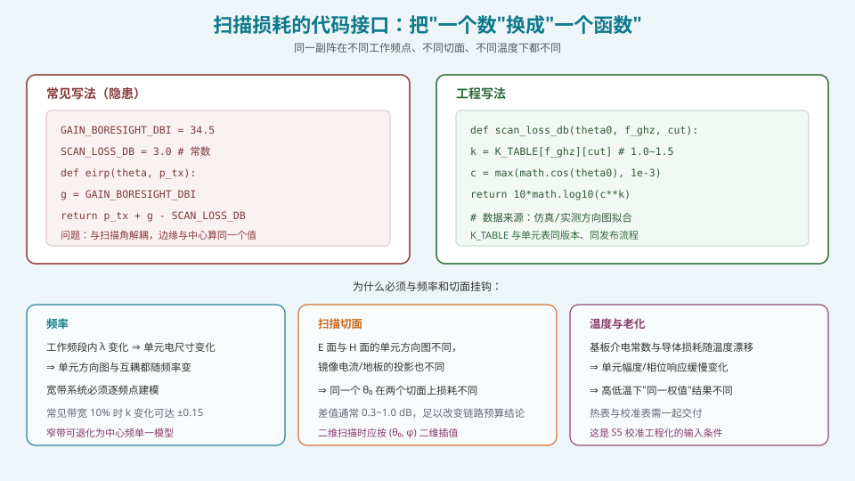

## 本篇要解决什么

[波束宽度、增益与孔径](pa-beamwidth-gain-aperture.html) 告诉你正扫的峰值增益怎么算。但真实系统里，**波束大部分时间不在正前方**。

卫星地面终端要跟踪过顶的卫星、卫星要对地覆盖到边缘、基站要服务小区边缘的用户——都要求扫描。而扫描要付代价。

这篇要回答三个非常具体的问题：

1. **60° 扫描到底掉多少 dB？** 答案取决于你问的是"纸面"还是"装机"。
2. **这个损耗怎么建模？** \((cos\theta)^k\) 里的 \(k\) 是多少？
3. **覆盖设计里怎么用它？** 单面板全扫描 vs 多面板小扫描，哪个划算？

---

## 一、三本账



*图 1：只有第一本账能算准。后两本必须从仿真或实测取数——把它们当成"公式的一部分"是链路预算最常见的失误。*

### 1.1 账本一：有效孔径投影（可算、不可消除）

这是最本质的一项，纯几何。

平面阵从扫描方向"看过去"，投影面积缩小为：

\[
A_{\text{eff}}(\theta_0)=A_{\text{phys}}\cos\theta_0
\]

因此方向性系数：

\[
D(\theta_0)=D(0°)\cdot\cos\theta_0
\]

即

\[
\boxed{\;\Delta G_{\text{proj}}=10\log_{10}(\cos\theta_0)\ \text{dB}\;}
\]

| \(\theta_0\) | \(\cos\theta_0\) | 损耗 |
| --- | --- | --- |
| 0° | 1.000 | 0 dB |
| 15° | 0.966 | −0.15 dB |
| 30° | 0.866 | −0.63 dB |
| 45° | 0.707 | −1.51 dB |
| **60°** | **0.500** | **−3.01 dB** |
| 70° | 0.342 | −4.66 dB |
| 75° | 0.259 | −5.87 dB |
| 80° | 0.174 | −7.60 dB |

**关键性质**：
- **不可消除**。这不是设计缺陷，是平面阵的几何宿命。加大阵、加功率都改变不了这个因子；
- **对增益的"形状"也有影响**。因为有效孔径在一个方向上缩短，主瓣在扫描平面内展宽 \(1/\cos\theta_0\)，在正交平面内**不变**。所以扫描后主瓣变成**椭圆**。

> **给算法工程师的话**：这就是为什么"波束宽度"在扫到 ±60° 时不能再用一个标量。你的波束管理算法如果按固定波束宽度做邻近波束搜索，会在边缘方向漏掉相邻波束。**波束宽度必须按 (θ, φ) 二维建模。**

### 1.2 账本二：单元方向图滚降（必须从数据取）

单个阵元不是各向同性的。典型贴片阵元的幅度方向图近似：

\[
G_e(\theta)\propto \cos^m\theta,\qquad m\approx1.0\sim1.3\ (\text{贴片，含地板})
\]

**关键认知**：扫描时**波束转，但单元不转**。所以：

- 波束指向 60° 时，主瓣方向上的单元增益已不是峰值，而是 \(G_e(60°)\)；
- 单元方向图的零点/凹口**留在原位**，不会跟着波束走。

60° 时这一项通常贡献 **−1.5 ~ −3 dB**。

> **陷阱**：这一项与阵元的具体形式强相关。半波振子、贴片、喇叭、波导开口的 \(\cos^m\) 指数差别很大（\(m\) 可以从 0.5 到 2）。**必须查你实际用的单元的数据。**

### 1.3 账本三：失配与互耦恶化（只能仿真/实测）

随扫描角增加：
- 每个单元看到的**有源输入阻抗**变化 ⇒ 反射损耗增加；
- 在特定角度可能触发**扫描盲区**（表面波共振），增益断崖式下跌。

典型贡献 **−0.3 ~ −1.0 dB**，但若存在盲区，可以到 **−10 dB 以上**（这已经不是"损耗"，而是故障）。

**如何获得**：需要**有源 S 参数**数据——激励全阵、只测一个单元的端口反射。这必须靠全波仿真或实测，任何解析公式都算不出来。

---

## 二、合成模型：(cosθ₀)^k

### 2.1 为什么用幂律

把三项合并，工程上普遍使用：

\[
\boxed{\;\Delta G_{\text{scan}}(\theta_0)=10k\log_{10}(\cos\theta_0)\ \text{dB},\qquad k\in[1.0,\ 1.5]\;}
\]

| \(k\) | 含义 | 使用场景 |
| --- | --- | --- |
| 1.0 | 只有几何投影（理想单元、无失配） | 技术指标的"宣称值"；文档中必须注明假设 |
| 1.3 | 典型工程实现（含单元滚降与部分失配） | 链路预算的默认取值 |
| 1.5 | 保守（含较多失配、单元滚降大） | 覆盖设计、EIRP 指标承诺、边缘容量规划 |
| 2.0 | 最坏情况（严重失配或轻度盲区） | 风险分析 |

### 2.2 为什么不能"哪项都算准"

有同事会问："既然能算投影、能查单元表、能仿真失配，为什么还要用一个模糊的 \(k\)？"

三个理由：

1. **三项的边界本身不清晰**。"单元方向图"在阵中与孤立时不同（互耦），而"失配"又部分来自互耦——简单相乘会**重复计算**。
2. **数据精度不够**。单元表通常是仿真的（±0.5 dB），失配是仿真的（±0.5 dB）。三个 ±0.5 dB 的数和三个精确数在工程上没有区别。
3. **决策需要保守**。用 \(k=1.5\) 得到的余量比用三项精确计算得到的更安全，且**更容易向别人解释**（"我们用了保守的 1.5 次幂模型"）。

**实践规则**：**用 \(k\ge1.3\) 做预算，用 \(k=1.0\) 做"理论极限"说明，两者都写进文档。**

### 2.3 不同切面的 \(k\) 不同

E 面（含电场矢量）与 H 面的单元方向图不同，因此 \(k\) 也不同。典型差异 **0.3~1.0 dB**。

在 60° 扫描、1024 元阵的场景里，0.5 dB 的差异就足以改变"边缘用户能否达到目标速率"的结论。

---

## 三、覆盖设计：单面板 vs 多面板

### 3.1 问题的实质

对一个需要半球（或宽角）覆盖的系统（卫星对地、地面终端对天），有两种路线：

- **路线 A：单面板全扫描**。一块阵面，扫描到 ±60°（或更大）。
- **路线 B：多面板分区**。若干块阵面，各自朝不同方向，每块只需小角度扫描。

### 3.2 定量对照



*图 2：可用 EIRP 随扫描角连续下降。设计必须按边缘（最坏点）做，而不是按中心。*

以 LEO 卫星对地覆盖为例（采用 \(k=1.3\) 的模型）：

| 配置 | 最大扫描角 | 最大扫描损耗 | 归一化阵元需求 | 说明 |
| --- | --- | --- | --- | --- |
| 单面板（星下点） | 60° | **3.9 dB** | **1.0** | 成本最优 |
| 三面板 | 48.6° | 2.3 dB | 2.1 | 每面只扫小角，但需要 2 倍多阵元 |
| 四面板 | 37.7° | 1.3 dB | 2.2 | 收益递减 |
| 单面板 | 70° | 6.1 dB | 1.0 | 边缘过于恶劣 |

**读法**：三面板用 **2.1 倍的阵元数**换取 **1.6 dB** 的边缘增益改善。

**决策依据**：
- 若**阵元成本主导**（毫米波、大规模阵）⇒ 选单面板，用更大阵面或更高功率弥补；
- 若**链路余量主导**（边缘用户速率是硬指标、雨衰严重）⇒ 多面板更划算；
- **注意**"多面板"并不总是更贵：每个小面板的射频链数量少，热密度低，结构更简单。真正的成本差来自**总阵元数**与**机械结构**。

### 3.3 一个常被忽略的连带影响

**星座规模会被扫描损耗"顶起来"。**

若单星边缘能力不足，你只有三条路：
1. 加大阵面（阵元数 ↑、功耗 ↑、重量 ↑）；
2. 增加卫星数量（星座成本 ↑↑）；
3. 提高边缘仰角要求（覆盖面积 ↓）。

而"边缘能力"的瓶颈往往就是那 3~6 dB 的扫描损耗。**在系统设计早期把 \(k\) 定对，比后期加星便宜得多。**

---

## 四、"标称范围 ≠ 性能保证范围"

### 4.1 三个层次的范围

这是本篇最需要建立的概念：

| 层次 | 含义 | 典型来源 |
| --- | --- | --- |
| **机械/波控可达范围** | 相位可以配置出的最大扫描角 | 波控表的设计范围 |
| **标称扫描范围** | 厂商宣传的"±60°" | 营销/规格书，通常基于 \(k=1\) |
| **性能保证范围** | 在此范围内**同时**满足增益、副瓣、EIRP、EVM 等所有指标 | 系统指标分解，基于实测 |

**这三者通常依次收窄。** 举例：一款终端宣传"±60° 电子扫描"，但保证的 EIRP 只在 ±45° 内成立（因为 60° 时 EIRP 低于规范/链路要求）；而保证的 EVM 可能只在 ±40° 内成立（因为大角处 PA 回退导致的非线性变化）。

> **阅读规格书的规则**：看到"扫描范围 ±X°"时，**立刻追问"在什么指标下保证"**。如果没有明确条件，就按只有正扫指标可信来用。

### 4.2 为什么"标称"必然基于 \(k=1\)

因为 \(k=1\) 是可计算的、与具体实现无关的。厂商不愿把自己的单元方向图和失配数据全公开（那是核心技术），所以只能标"纯几何"的范围。**这不算欺骗，但你必须自己补上后两本账。**

---

## 五、代码：把"一个数"改成"一个函数"



*图 3：扫描损耗必须与频率和切面挂钩。把常数写进代码，等于把"设计假设"永远埋起来。*

### 5.1 反例与正例

```python
# ===== 反例：把设计假设写死 =====
GAIN_BORESIGHT_DBI = 34.5
SCAN_LOSS_DB = 3.0            # ← 这个 3.0 从哪来的？什么频率？什么切面？
def eirp_wrong(theta_deg, p_tx_dbm):
    return p_tx_dbm + GAIN_BORESIGHT_DBI - SCAN_LOSS_DB
```

问题：① 与扫描角解耦（边缘与中心算同一个值）；② 隐含"k=1"的假设但没写；③ 换频段/换切面要改代码。

```python
import math

# ===== 正例：损耗是 (theta, f, cut) 的函数 =====
K_TABLE = {
    # (f_ghz, cut) -> k
    (27.5, "E"): 1.28, (27.5, "H"): 1.42,
    (28.0, "E"): 1.30, (28.0, "H"): 1.45,
    (29.5, "E"): 1.34, (29.5, "H"): 1.50,
}
DEFAULT_K = 1.50   # 未知频点时用保守值

def scan_loss_db(theta0_rad, f_ghz, cut, k_table=K_TABLE):
    """扫描损耗（dB，负值）。数据来源：单元表 + 有源 S 参数仿真拟合。"""
    key = (round(f_ghz, 1), cut)
    k = k_table.get(key)
    if k is None:
        # 线性插值到最近的已知频点，找不到就用保守值
        k = DEFAULT_K
    c = max(math.cos(abs(theta0_rad)), 1e-3)   # 防 theta->90 时 cos->0
    return 10.0 * k * math.log10(c)

def gain_dbi(theta0_rad, f_ghz, cut, g_boresight_dbi):
    return g_boresight_dbi + scan_loss_db(theta0_rad, f_ghz, cut)
```

### 5.2 三条实现要求

1. **数据与代码分离**。`K_TABLE` 应该是外部配置文件（YAML/JSON），与单元表同版本、同发布流程。这样标定/仿真更新数据时无需改代码。
2. **保守默认值**。查不到数据时返回保守值（\(k=1.5\)）而非乐观值。**链路预算的错误方向应该是"偏悲观"**。
3. **断言与文档**。函数 docstring 里必须写明"数据来源、适用频段、拟合误差"，并在越界（\(|\theta_0|>70°\)）时打警告日志。

### 5.3 与波束管理算法接口

如果系统需要**按角度动态调整发射功率**（补偿扫描损耗），那么：

```python
def tx_power_for_eirp(target_eirp_dbw, theta0_rad, f_ghz, cut,
                      g_boresight_dbi, p_max_dbw):
    """反算为达到目标 EIRP 所需的发射功率（受限）。"""
    g = gain_dbi(theta0_rad, f_ghz, cut, g_boresight_dbi)
    p_need = target_eirp_dbw - g
    if p_need > p_max_dbw:
        # 功率不足，需要降级（改 MCS / 降带宽）
        return p_max_dbw, (target_eirp_dbw - (p_max_dbw + g))   # 缺口 dB
    return p_need, 0.0
```

返回的"缺口 dB"就是**需要靠自适应调制编码（AMC）回退来吸收的量**。这在系统设计里是一个非常实用的接口——把"物理层限制"变成"链路自适应算法的一个输入"。

---

## 六、常见误区清单

**误区一：认为扫描损耗只有 3 dB @ 60°。**
只有纯几何投影是 −3.0 dB。含单元滚降与失配后通常是 −4.5 ~ −6 dB。工程上所有"3 dB @ 60°"的说法都隐含"理想单元、无失配"的前提。

**误区二：把扫描损耗当成与频率无关的常数。**
\(k\) 随频率变化（单元电尺寸变化、失配结构变化）。宽带系统必须逐频点建模，至少要在频段两端各算一次。

**误区三：在 E 面与 H 面用同一个 \(k\)。**
两个切面的单元方向图与在场分布都不同，\(k\) 可差 0.1~0.2（在 60° 时约 0.3~1.0 dB）。

**误区四：忘了主瓣会变宽。**
\(\mathrm{HPBW}\propto1/\cos\theta_0\)，60° 时主瓣宽 2 倍。这直接影响：
- 角度分辨率；
- 波束管理的邻居搜索范围；
- 空分复用的正交性。

**误区五：以为"加大发射功率就能补偿"。**
功率可以补偿**链路余量**，但不能补偿**波束变宽**带来的分辨率下降与间干扰上升。而且大角处 PA 往往已经接近饱和，没有功率余量。

**误区六：用中心增益做链路预算。**
链路瓶颈永远在边缘。用中心增益会让整个预算乐观 3~6 dB。**这类错误的特征是：仿真全绿、外场不通。**

**误区七：忽略"标称范围"与"保证范围"的差别。**
见 §4。规格书上的扫描范围通常只是波控可达范围。

**误区八：认为扫描损耗是"设计缺陷"，试图消除它。**
除共形阵（弧形阵面，让阵面始终朝向目标）外，平面阵的投影损耗**不可消除**。它能被"补偿"的只有后两本账（改善单元、优化匹配）。**认清哪些能改、哪些不能改，是工程判断力的核心。**

**误区九：忽略扫描时的副瓣变化。**
扫描时副瓣也会移动与变化。大角处副瓣通常**变差**（有效孔径小、边缘照射变化），可能违反监管包络。合规验证必须在**最大扫描角**上做，而不是正扫。

---

## 七、快速自测

**Q1.** 一个 1024 元阵（32×32，\(d=\lambda/2\)），\(G_e=6\ \text{dBi}\)，总口径效率 0.70。求：(a) 正扫峰值增益；(b) 用 \(k=1.3\) 估算 60° 扫描的增益；(c) 若单载波发射功率 30 dBm，两种情形下的 EIRP 各是多少 dBm？

<details><summary>参考要点</summary>

(a) \(G=6+10\log_{10}(1024)+10\log_{10}(0.70)=6+30.10-1.55=34.55\ \text{dBi}\)。

(b) 扫描损耗 \(=10\times1.3\times\log_{10}(\cos60°)=13\times(-0.3010)=-3.91\ \text{dB}\)。
\(G(60°)=34.55-3.91=30.64\ \text{dBi}\)。

(c) EIRP = \(P_{tx}+G\)：
- 正扫：\(30+34.55=64.55\ \text{dBm}=34.55\ \text{dBW}\)；
- 60°：\(30+30.64=60.64\ \text{dBm}=30.64\ \text{dBW}\)。

**差额 3.91 dB**，功率上是 **2.46 倍**。也就是说，边缘方向上"等效于发射功率只有中心的 41%"。

**若用 \(k=1.0\)**，60° 损耗只有 3.01 dB，EIRP 高估 0.9 dB。**在 Ka 段这是个不能忽略的量。**

</details>

**Q2.** 为什么"波束在扫描平面内展宽 2 倍、正交平面不变"？用有效孔径解释，并说明这对一个 2D 波束扫描系统意味着什么。

<details><summary>参考要点</summary>

**解释**：设阵面在 xy 平面，孔径 \(L_x\times L_y\)。扫描方向在 xz 平面（\(\phi=0\)），扫描角 \(\theta_0\)。

- 从扫描方向看去，**x 方向**的投影缩短为 \(L_x\cos\theta_0\)；
- **y 方向**的投影**不变**（\(L_y\)，因为 y 垂直于扫描平面）；

所以：
- x 平面（扫描平面）内 \(\mathrm{HPBW}\propto1/(L_x\cos\theta_0)\) ⇒ **展宽 \(1/\cos\theta_0\)**；
- y 平面内 \(\mathrm{HPBW}\propto1/L_y\) ⇒ **不变**。

**含义（对 2D 扫描系统）**：
1. **波束变成椭圆**。60° 扫描时长短轴比 2:1；
2. **波束管理算法必须按 (θ, φ) 使用不同的波束宽度**。若按固定宽度搜索邻波束，在扫描平面方向会漏波束；
3. **跟踪算法的环路增益要随扫描角调整**（波束宽，指向容差大，环路可以更松）；
4. **空分复用的用户间正交性在扫描平面上劣化更快**。若做 MU-MIMO 或空分多址，配对策略需要考虑这一点；
5. **波束赋形权值的"波束宽度约束"要写成椭圆的**，而不是圆形（若做波束保形优化）。

</details>

**Q3.** 你要设计一个 LEO 卫星的地面终端，需要跟踪从 30° 仰角到过顶再落下的卫星。用一句话说清"扫描角范围"是多少，并说明这个范围内增益变化多少 dB（取 \(k=1.3\)）。

<details><summary>参考要点</summary>

**扫描角范围**：对天顶指向的平面阵，仰角 30° ⇒ 扫描角 \(\theta_0=90°-30°=60°\)。所以扫描角范围是 **0°（过顶）~ 60°（低仰角）**。

**增益变化**：
- 过顶（0°）：0 dB；
- 60°：\(10\times1.3\times\log_{10}(\cos60°)=-3.91\ \text{dB}\)。

**所以整个跟踪过程中增益变化约 3.9 dB**（若用 \(k=1.5\)，则为 4.5 dB）。

**工程含义**：
1. 链路预算的**瓶颈在低仰角**（同时也是斜距最远、大气损耗最大、雨衰最严重的时刻）——**三重打击叠加**；
2. 若终端用机械跟踪 + 电子扫描混合方案，可以让阵面法线尽量对准卫星，把电子扫描角控制在 ±30° 内（损耗仅 −0.9 dB），代价是机械转动；
3. **纯电扫终端必须按 60° 设计**；若想避免，需要考虑多面板布局（如倾斜安装的若干面板）。

</details>

**Q4.** 解释：为什么"中心 EIRP 达标"不等于"边缘 EIRP 达标"，并说明这会如何影响星座设计。

<details><summary>参考要点</summary>

**原因**：EIRP = \(P_{tx}+G(\theta)\)。增益随扫描角下降 3~6 dB（取决于 \(k\) 与最大扫描角）。若 \(P_{tx}\) 固定（或受限于 PA 最大输出），则 EIRP 必然下降同样量。

**为什么这是"必然"而不是"设计不良"**：
1. 投影损耗不可消除（平面阵几何）；
2. 大角处 PA 通常已经为补偿这 3~6 dB 而运行在更高功率，可能触及饱和（此时不能无损补偿）。

**对星座设计的影响**：
1. **边缘能力决定单星覆盖半径**。若边缘 EIRP 不足，就必须**减小覆盖半径**（提高最小仰角）或**增加卫星数量**；
2. **增加卫星数量的代价是二次方的**：卫星数翻倍，发射成本、在轨数量、地面信关站调度都翻倍；
3. **"三面板"路线的账**：单面最大扫描 60° 损耗 3.9 dB，三面每面最大 48.6° 损耗 2.3 dB（改善 1.6 dB），但阵元需求 2.1 倍。**这两个数字必须放在同一张表上比较**——只比较 dB 或只比较成本都是不完整的；
4. **实际系统的折中**：多采用"多面板 + 机械指向"或"多面板固定 + 电扫小角度"的组合，而非纯电扫大角度。

**一句话结论**：**扫描损耗是"系统性"成本，它会在星座规模、单星功率、天线尺寸之间形成一个三角约束。** 越早认识到这点，设计空间越大。

</details>

**Q5.** 你的同事辩称："扫描损耗是 10log10(cosθ₀)，这是物理定律，不需要仿真。"请指出这句话对与不对的地方。

<details><summary>参考要点</summary>

**对的部分**：
- \(10\log_{10}(\cos\theta_0)\) 确实是有效孔径投影的严格结果，是几何必然；
- 它是唯一"不需要仿真"的项。

**不对的部分**：
1. **它只是三项中的一项**。把它当作"全部"是遗漏。单元方向图滚降（−1.5~−3 dB @ 60°）与失配（−0.3~−1 dB，或盲区时的 10 dB+）都不是几何项，都必须仿真/实测。
2. **它不包含"形状"变化**。几何投影改变的是**增益标量**，而单元方向图同时改变**波束形状**与**峰值位置**（beam shift），这部分也无法用 \(\cos\theta_0\) 表达。
3. **有源阻抗的影响会改变"有效"投影**。严格地说，互耦让"每个单元的有效孔径"本身随扫描角变化，不是一个常数乘 \(\cos\theta_0\)。
4. **端射附近公式失效**。\(\theta_0\to90°\) 时 \(\cos\theta_0\to0\)，但真实阵列在端射仍有增益（因为单元方向图不完全是 \(\cos\) 型，且阵面有厚度）。公式给出的 −∞ 是数学假象。

**正确表述**："\(10\log_{10}(\cos\theta_0)\) 是扫描损耗的**下界**（最优情况）。实际损耗 ≥ 这个值，超出量取决于单元设计与匹配质量，必须实测。"

</details>

**Q6.** 用 \(k=1.3\) 与 \(k=1.5\) 分别计算 ±50° 扫描的损耗，并说明在做"链路余量承诺"时该用哪一个。

<details><summary>参考要点</summary>

\(\cos50°=0.6428\)，\(\log_{10}(0.6428)=-0.1919\)。

- \(k=1.3\)：\(10\times1.3\times(-0.1919)=-2.49\ \text{dB}\)；
- \(k=1.5\)：\(10\times1.5\times(-0.1919)=-2.88\ \text{dB}\)；
- 差 **0.39 dB**。

**该用哪一个**：

| 场景 | 用哪个 \(k\) | 理由 |
| --- | --- | --- |
| 对客户**承诺**链路余量 | **1.5**（或更大） | 承诺必须能兑现；留裕量 |
| 内部**技术指标分解** | 1.3 | 典型实现值，便于工程推进 |
| **竞争对比** | 1.0（并注明假设） | 与竞品同一口径比较 |
| **风险分析/最坏情况** | 2.0 | 覆盖失配与轻度盲区 |

**关键原则**：**同一个系统在文档里出现不同 \(k\) 值时，必须同时写明用途。** 混用是评审时最常见的质疑点——不是因为数字错，而是因为口径不清。

**附注**：0.39 dB 看似很小，但在 Ka/Ku 段，链路余量常常只有 2~4 dB，0.4 dB 就是 10%~20% 的余量差异。

</details>

**Q7.** 设计一个"扫描角自适应功率补偿"的算法，写出伪代码，并说明它可能与哪些系统约束冲突。

<details><summary>参考要点</summary>

```text
输入：目标 EIRP（由链路自适应给定），当前指向 (θ₀,φ₀)，工作频点 f
     G_boresight(f)，k(f,cut) 表，P_max（PA 上限），P_min（线性度约束）
输出：发射功率 P_tx，以及功率缺口 gap（若不足）

1. 计算 G(θ₀,f) = G_boresight(f) - 10k log10(cos θ₀)
2. P_need = EIRP_target - G(θ₀,f)
3. 若 P_need > P_max：
      P_tx = P_max；gap = P_need - P_max     # 缺口由 AMC 吸收
   否则若 P_need < P_min：
      P_tx = P_min；                      # 不能更低（EVM/线性度）
   否则：
      P_tx = P_need；gap = 0
4. 输出 P_tx, gap
```

**可能冲突的系统约束**：

| 约束 | 冲突点 |
| --- | --- |
| **EVM / ACLR** | 提高功率会把 PA 推向饱和 ⇒ 非线性 ⇒ EVM 变差、邻道泄漏上升 |
| **热** | 大角处持续高功率 ⇒ 局部热密度上升 ⇒ 可能超温降额 |
| **功耗预算** | 宽角覆盖要求全程高功率 ⇒ 平均功耗上升 ⇒ 电池/太阳能帆板受限 |
| **频谱合规（SEM/ESD）** | 功率提高同时抬高副瓣的绝对电平 ⇒ 可能违反离轴 EIRP 密度限值 |
| **多用户公平性** | 边缘用户获得更多功率，但总功率受限时会影响其他用户 |

**工程做法**：
1. **把 EIRP 目标设定为"最低可接受"而非"最高可达"**，让功率回退成为常态；
2. **在最大扫描角上做热与频谱合规验证**（不是正扫）；
3. **把 gap 上报给 MAC 层**，由链路自适应用降低阶数/带宽来吸收，而不是靠无限制加功率。

**关键洞察**：扫描损耗的补偿必须**在系统层面**做（功率 + 调制编码 + 调度联合），纯物理层加功率很快会遇到非线性与热的墙。

</details>

**Q8.** 一个共形（圆柱面）阵列宣称"无扫描损耗"。这个说法在什么意义下成立？有哪些它没有说的事？

<details><summary>参考要点</summary>

**成立的意义**：共形阵通过**激活朝向目标的那部分阵元**来实现波束指向。因为工作的是"朝向目标的那一段弧面"，其切平面始终大致垂直于波束方向，**投影因子近似为 1**，因此避免了平面阵的 \(\cos\theta_0\) 滚降。

**没有说的事**：

1. **有效孔径受"激活区域"限制**。圆柱阵激活一段弧面，其有效面积是 \(A_{\text{eff}}=(2/\pi)RL\) 量级（而不是全阵面）。若要达到与平面阵相同的孔径，需要**更大的物理表面**与**更多阵元**（因为大部分阵元在任一时刻不工作）。
2. **阵元利用率低**。典型只有 1/3 ~ 1/4 的阵元同时激活。这意味着**单位成本的增益更低**。
3. **波束形状随扫描角变化**。激活区域的边界会造成方向图的不对称与副瓣变化（"边缘衍射"效应），不像平面阵那样形状稳定。
4. **单元方向图仍然滚降**。单个阵元偏离自身法线时仍有 \(G_e\) 滚降，如果激活区域选得宽，滚降仍然存在。
5. **互耦与馈电网络复杂**。圆柱面上的阵元位置不同，互耦关系随位置变化；波控需要二维（方位 + 俯仰）协调。
6. **"无扫描损耗"只在增益上近似成立**，副瓣、极化纯度、相位一致性仍随扫描角变化。

**结论**：共形阵确实消除了投影损耗，代价是**表面面积与阵元数的大幅增加**。它在"表面本身就存在"的场合（导弹、飞机机身、卫星本体）有优势——因为阵面"镶嵌"在已有结构上，额外成本低。但作为独立天线与平面阵比较时，成本往往更高。

</details>

---

## 八、与本站其它专题的连接

| 想了解 | 看哪篇 |
| --- | --- |
| 增益与孔径的三本账（本篇的前置） | [波束宽度、增益与孔径](pa-beamwidth-gain-aperture.html) |
| 阵列因子与 \(u\) 域平移 | [阵列因子：从两个阵元到 N 个阵元](pa-array-factor.html) |
| 为什么扫描后栅瓣会移动 | [λ/2 准则：栅瓣的成因、抑制与例外](pa-half-wavelength-criterion.html) |
| 单元方向图与互耦的物理 | [电磁地基（结论级）：阵元、极化、互耦、表面波](pa-electromagnetics-basics.html) |
| 有源驻波与馈网插损 | [功分合成网络与互耦效应](pa-feed-network-mutual-coupling.html) |
| 扫描时波束形状变化与主瓣保形 | [零陷展宽、宽带与稳健波束形成](pa-null-broadening-robust.html) |
| 宽带下的额外扫描问题 | [波束斜视与宽带相控阵](pa-beam-squint-wideband.html) |
| 卫星链路预算的整体方法 | [5G NTN 非地面网络](5g-ntn.html) |
| NTN 信道与链路预算 | [NTN 信道与链路预算](ntn-channel-link-budget.html) |
| 星座与轨道对覆盖的影响 | [NTN 轨道与架构](ntn-orbit-architecture.html) |
| 相控阵的物理机制与架构 | [卫星相控阵天线：从阵元到波束](satellite-phased-array.html) |
| 学习体系全貌 | [相控阵天线学习体系：六阶段路线图](phased-array-roadmap.html) |

---

## 九、延伸阅读

**教材**
- Mailloux, *Phased Array Antenna Handbook*, 3rd ed., §2.5（扫描时的增益变化与阻抗变化）。对"投影 + 失配"的分离讨论最清楚。
- Hansen, *Phased Array Antennas*, 2nd ed., §2.3 与第 4 章。含扫描损耗的实测数据与"阵列效率 vs 扫描角"的曲线族。
- Balanis, *Antenna Theory*, 4th ed., §6.6。有效孔径投影的基础处理。
- K. Fujimoto & J. R. James (eds.), *Mobile Antenna Systems Handbook*, 关于共形阵与圆柱阵的性能讨论。

**经典文献**
- R. J. Mailloux, "Phased Array Theory and Technology," *Proceedings of the IEEE*, vol. 70, no. 3, pp. 246–302, 1982。包含扫描损耗与盲区的系统性处理。
- **关于 \((cos\theta)^k\) 的工程取值**：N. J. Kolias 等关于卫星相控阵的论文，以及 *Microwave Journal* 的 "The Influence of Phased-array Antenna Systems on LEO Satellite Constellations"（本文 §3.2 的三面板/四面板数据来源之一）。
- 关于共形阵的有效孔径：H. Steyskal, "Digital Beamforming Antennas," 与 Kummer & Villeneuve 关于共形阵方向图控制的经典工作。
- 关于扫描盲区：N. Amitay, V. Galindo & C. P. Wu, *Theory and Analysis of Phased Array Antennas*, 1972 年。这本书是盲区理论的经典。

**工程应用笔记**
- RF Essentials, *How do I calculate the scan loss of a phased array as the beam is steered off boresight?* 把三本账与数值表整理得很清楚，与本文 §1 一致。
- Analog Devices, *Phased Array Antenna Patterns — Part 2: Grating Lobes and Beam Squint*。扫描时波束变宽与栅瓣移动的图形化处理。
- Keysight, *How to Design and Test a Phased Array Antenna*，关于扫描一致性测试的章节（"beam scan consistency"是 OTA 测试的必测项）。
- **ITU-R S.580 / S.465**：旁瓣包络与离轴 EIRP 密度的监管定义。把"扫描时的副瓣恶化"放回合规语境——见 [规范与认证地图](pa-conformance-standards.html)。
