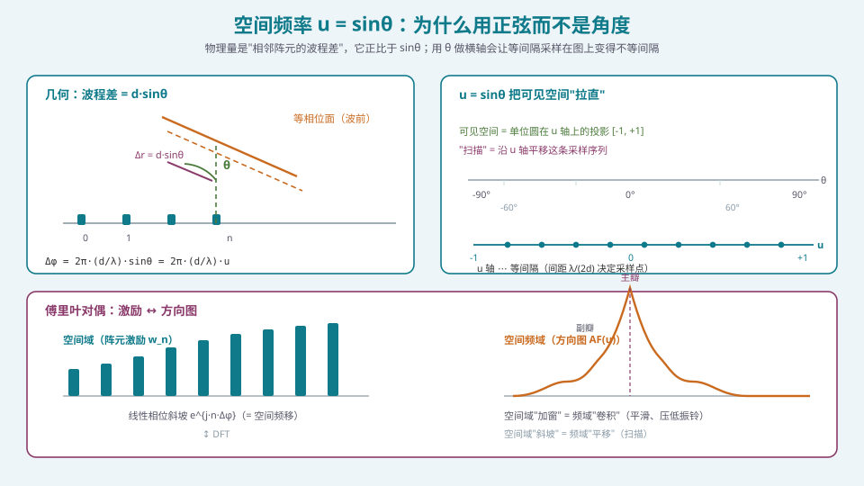
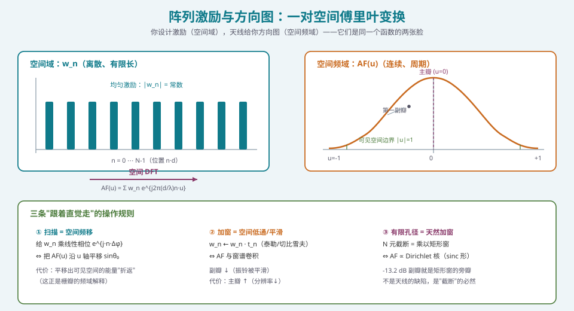
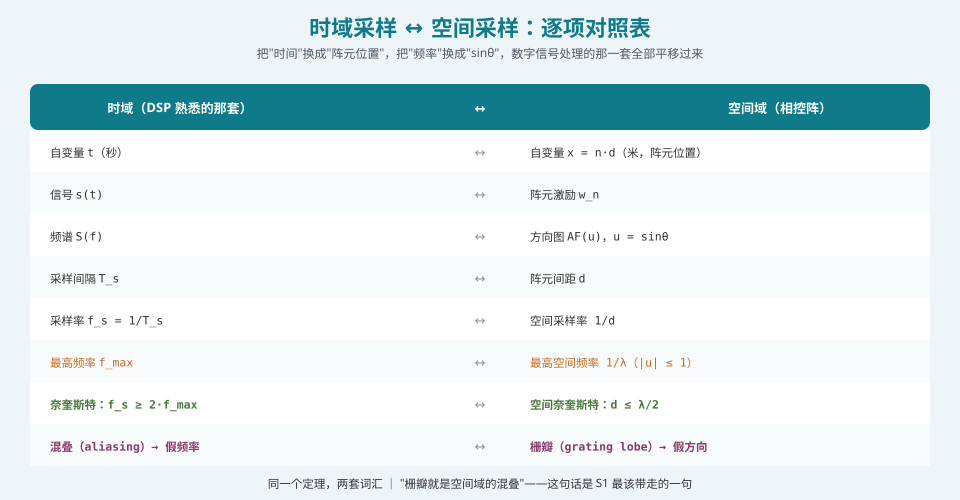

## 本篇要解决什么

上一篇 [相控阵的数学语言：复数、相量与相量运算](pa-math-complex-phasor.html) 解决了"用什么表示"的问题：复数。这一篇解决**"用什么变量"**的问题。

如果你翻过 [卫星相控阵天线：从阵元到波束](satellite-phased-array.html)，会记得阵列因子的标准写法：

\[
AF(\theta) = \sum_{n=0}^{N-1} w_n\, e^{\,j\frac{2\pi}{\lambda} n d \sin\theta}
\]

**请盯着这个式子看 10 秒。** 然后把它和数字信号处理里的 DFT 放在一起：

\[
X[k] = \sum_{n=0}^{N-1} x[n]\, e^{-j\frac{2\pi}{N}nk}
\]

**它们是同一个式子。** 唯一的区别是：DSP 里的 \(k/N\) 变成了相控阵里的 \(\frac{d}{\lambda}\sin\theta\)。

这不是"数学上有点像"，而是**完全的对偶**。本篇的目标就是把这条对偶关系从"看一眼觉得像"变成"能在工程判断里随手调用的工具"：

| 你原本以为 | 对偶视角下 | 立刻得到的结论 |
| --- | --- | --- |
| 阵列因子的自变量是 \(\theta\) | 自变量应该是 \(u = \sin\theta\) | 用 \(\theta\) 做横轴画方向图，会**白白拉伸**大角区域 |
| 扫描就是把波束指向别的角度 | 扫描 = **空间频移** | 频移出可见空间的能量必然折返 → 栅瓣 |
| 加窗是"把边缘阵元功率调小" | 加窗 = **空间低通滤波** | 副瓣降低与主瓣展宽的定量关系可以照搬窗函数理论 |
| −13.2 dB 副瓣是"天线的特性" | 它是 **矩形窗的旁瓣** | 只要愿意，就能用窗函数理论把它压到任意低 |
| 阵列是"N 个天线" | 它是**有限长的空间序列** | 有限长 ⇒ 截断 ⇒ 振铃，这是必然，不是缺陷 |

> **一句话定位**：这一篇是整个相控阵学习体系里**"看透相控阵"的那把钥匙**。[相控阵天线学习体系：六阶段路线图](phased-array-roadmap.html) 里把它排在第 2 位，理由就是：学完它，S2 和 S4 的大半内容都会从"要背的公式"变成"能自己推出来的直觉"。

---

## 一、为什么自变量必须是 \(u = \sin\theta\)

### 1.1 物理依据：波程差正比于 \(\sin\theta\)

回到最原始的几何。两个相邻阵元，间距 \(d\)，来波与阵列法线成角 \(\theta\)。**波程差**是：

\[
\Delta r = d\sin\theta
\]

对应的相位差是：

\[
\Delta\varphi = \frac{2\pi}{\lambda}\Delta r = \frac{2\pi d}{\lambda}\sin\theta
\]

**注意：\(\Delta\varphi\) 正比于 \(\sin\theta\)，不是正比于 \(\theta\)。** 而阵列之所以能工作，完全依赖"相邻阵元有恒定的相位增量"这个性质——**只有在 \(u=\sin\theta\) 这个坐标下，这个增量才是均匀的。**



*图 1：左：几何与波程差。右：θ 轴与 u 轴的关系。可见空间 [-90°, 90°] 映射到 u 轴上的 [-1, +1]，但映射是**非线性的**——靠近正扫（θ≈0）的区域被压缩，靠近端射（θ≈±90°）的区域被拉伸*

### 1.2 后果一：用 \(\theta\) 做横轴会让你看错方向图

这是**每一个初学者的第一个视觉陷阱**。同一个方向图，画在 \(\theta\) 轴上和画在 \(u\) 轴上，看起来完全不一样：

- **画在 \(\theta\) 轴上**：靠近 ±90° 的副瓣被"拉伸"，视觉上显得宽大；主瓣显得窄。
- **画在 \(u\) 轴上**：所有副瓣宽度视觉上一致（因为它们本来就是相等的），主瓣结构对称清晰。

**工程上的直接后果**：如果你在 \(\theta\) 轴上目测"副瓣宽度"或"零陷位置"，会得到错误的数。**所有方向图的定量分析都应在 \(u\) 域做。**

### 1.3 后果二：扫描损耗在 \(u\) 域里是"平移"，在 \(\theta\) 域里是"挤压"

给定配相角 \(\theta_0\)，权值 \(w_n = a_n e^{-j\frac{2\pi d}{\lambda}n\sin\theta_0}\)，代入阵列因子：

\[
AF(u) = \sum_{n=0}^{N-1} a_n\, e^{\,j\frac{2\pi d}{\lambda}n(u - u_0)}, \qquad u_0 = \sin\theta_0
\]

**看这个式子的形状**：它和正扫时的 \(AF(u)\) 只差一个**平移 \(u_0\)**。

所以：

> **扫描在 \(u\) 域里就是纯粹的平移。** 波束形状（主瓣宽度、副瓣结构）在 \(u\) 域里**完全不变**。

那为什么实测中扫描后会掉增益？因为**可见空间只有 \(u\in[-1,+1]\)**，而阵列单元的**方向图 \(G_e(\theta)\) 也在变**。这两件事在 \(\theta\) 域里体现为"波束被挤压到更大的角度范围上"，工程上叫**扫描损耗**（[扫描损耗：波束越偏增益越低](pa-scan-loss.html) 有完整推导）。**在 \(u\) 域里你能看到本质：波束没变，是"取景框"变了。**

### 1.4 一个实用的命名约定

工程上把 \(u = \sin\theta\) 叫**方向余弦（direction cosine）**，把 \(u\) 叫**空间频率（spatial frequency）**。它的量纲是"每米多少个波"：

\[
\text{空间频率} \;=\; \frac{\sin\theta}{\lambda} \quad [\text{周期/米}]
\]

平面阵更常用三个方向余弦 \((u, v, w)\)：

\[
u = \sin\theta\cos\phi,\quad v = \sin\theta\sin\phi,\quad w = \cos\theta,\quad u^2+v^2+w^2 = 1
\]

**可见空间在 \((u,v)\) 平面上是一个单位圆。** 大阵方向图综合、二维加窗、子阵栅瓣的分析，全部在这个单位圆上做——**二维方向图本质上是一张"圆内的图像"，而不是"球面上的图"**。这一点在 [方向图综合与赋形](pa-pattern-synthesis-shaping.html) 里会反复用到。

---

## 二、傅里叶对偶：激励 ↔ 方向图

### 2.1 严格陈述

把阵列激励看成一个**离散空间序列** \(w_n\)，定义在空间位置 \(x_n = nd\) 上。远场方向图是：

\[
AF(u) = \sum_{n=0}^{N-1} w_n\, e^{\,j 2\pi \frac{d}{\lambda} n u}
\]

对比 DTFT 的定义 \(X(\Omega) = \sum_n x[n]e^{-j\Omega n}\)，我们立刻得到对应关系：

\[
\boxed{\;\Omega \;\longleftrightarrow\; -2\pi\frac{d}{\lambda}u \;}
\]

**这就是全部的对应关系。** 于是窗函数理论里的每一条结论，都能一字不改地搬到相控阵里。



*图 2：上半：空间域激励（均匀）与其空间频谱（方向图）。下半：三条可以"跟着直觉走"的操作规则*

### 2.2 规则一：扫描 = 空间频移

给 \(w_n\) 乘以线性相位斜坡 \(e^{j\cdot n\cdot \Delta\varphi}\)：

\[
\sum_n w_n e^{jn\Delta\varphi}e^{j2\pi\frac{d}{\lambda}nu} = AF\!\left(u + \frac{\Delta\varphi}{2\pi d/\lambda}\right)
\]

即方向图**整体平移**了 \(\Delta u = \frac{\lambda}{2\pi d}\Delta\varphi\)。要让主瓣移到 \(u_0 = \sin\theta_0\)，取 \(\Delta\varphi = -\frac{2\pi d}{\lambda}\sin\theta_0\)，这正是我们熟悉的配相公式。

**这个视角的价值在于**：它让你意识到"扫描"和"波束形状"是**解耦**的两件事。想改指向就改斜坡相位，想改形状就改 \(|w_n|\)。**工程实现上这两件事也因此可以分开处理**：相位控制指向（移相器），幅度控制形状（衰减器/数字加权）。

**关键推论**：平移无边界。方向图本来是周期为 \(\lambda/d\)（在 \(u\) 轴上）的函数，可见空间只有长度 2。当 \(d > \lambda/2\) 时周期 \(< 2\)，**必然有多个主瓣副本落进可见空间**——这就是栅瓣。**下一篇会专门讲这件事。**

### 2.3 规则二：加窗 = 空间滤波

设窗序列 \(t_n\)，则：

\[
AF_{\text{taper}}(u) = \sum_n (w_n t_n)e^{j\cdots} = AF_{\text{uni}}(u) \circledast T(u)
\]

**时域加窗 ≡ 频域卷积**。把 \(AF\) 与窗谱 \(T(u)\) 卷积的直觉效果是：

- **振铃（旁瓣）被平滑**降低 → 副瓣下去
- **分辨率（主瓣）被模糊** → 主瓣变宽

这就是**低副瓣设计的基本权衡**：副瓣与主瓣宽度是一对反向指标，你不可能同时改善。

窗函数理论里有一整套量化指标，直接搬过来就有：

| 窗类型 | 第一副瓣 (dB) | 主瓣展宽因子 | 典型用途 |
| --- | --- | --- | --- |
| 矩形（无窗） | −13.2 | 1.00 | 最大增益，副瓣不敏感 |
| 汉宁（Hanning） | −31.5 | 2.00 | 通用低副瓣 |
| 汉明（Hamming） | −42.7 | 1.36 | 副瓣要求较高 |
| 布莱克曼 | −58.1 | 2.29 | 极低副瓣 |
| 泰勒（\(\bar{n}=5\)） | −35 ~ −40 | ~1.2 | **雷达/卫星通信首选**（等电平副瓣 + 可控衰减） |
| 切比雪夫 | 可任意指定 | 随指标增大 | 等副瓣最优（给定主瓣宽度下副瓣最低） |

> **工程提示**：相控阵里**泰勒窗**比切比雪夫更常用。原因是切比雪夫窗的等副瓣是"所有副瓣都一样高"，包括**远离主瓣的那些**——这会抬高远角副瓣，影响 EMC/合规与抗干扰。泰勒窗让副瓣**从前若干个开始单调衰减**，更符合"近角严格、远角放松"的实际需求。完整的加窗方法见 [加权加窗：低副瓣设计的完整方法](pa-amplitude-tapering.html)。

### 2.4 规则三：有限孔径 = 天然加窗（也是 −13.2 dB 的真正来源）

这是最有启发的第三条。

"N 个阵元"这句话，在数学上等于：

\[
w_n = a_n \cdot \mathrm{rect}_N(n)
\]

即**把一个理论上的无限序列乘上了一个长度为 N 的矩形窗**。于是方向图是：

\[
AF(u) = A(u) \circledast \mathcal{D}_N(u)
\]

其中 \(\mathcal{D}_N\) 是**狄利克雷核（Dirichlet kernel）**，也就是离散 sinc：

\[
\mathcal{D}_N(\Omega) = \frac{\sin(N\Omega/2)}{\sin(\Omega/2)}
\]

**矩形窗的旁瓣最高点就是 −13.2 dB（约 0.217）。这就是均匀阵列第一副瓣 −13.2 dB 的全部来源。**

它不是"天线材料的缺陷"，不是"加工精度不够"——**它是"截断"这个数学操作的必然结果**。只要你的孔径是有限的、激励是均匀的，这个副瓣必然出现，无一例外。

**这条认知的价值**：
1. 你不再会试图"通过更好的加工"去改善它（改不了）。
2. 你知道唯一的方法是**改变截断的形状**（加窗），并且你立刻知道代价（主瓣展宽）。
3. 你理解为什么"孔径越大，副瓣越窄但不会更低"——**副瓣高度只由窗形状决定，与 N 无关**。

> **一个常被忽略的推论**：既然副瓣高度与 \(N\) 无关，那么**增大阵元数并不能改善副瓣电平**，只会让副瓣更密集（用 \(u\) 域看）。要提高抗干扰能力，必须加窗或做自适应零陷（[自适应波束形成：MVDR 与 LCMV](pa-adaptive-mvdr-lcmv.html)）。

---

## 三、空间采样：DSP 那套定理的完全平移

这是本篇最"省力"的一节：**你不需要学新东西，只需要换一套词汇。**



*图 3：把"时间"换成"阵元位置"，"频率"换成"sinθ"，数字信号处理的那套定理全部平移过来*

### 3.1 逐项对照

| 时域（DSP） | 空间域（相控阵） |
| --- | --- |
| 自变量 \(t\) | 空间位置 \(x = nd\) |
| 信号 \(s(t)\) | 激励 \(w_n\) |
| 频谱 \(S(f)\) | 方向图 \(AF(u)\)，\(u=\sin\theta\) |
| 采样间隔 \(T_s\) | 阵元间距 \(d\) |
| 采样率 \(f_s = 1/T_s\) | 空间采样率 \(1/d\) |
| 最高频率 \(f_{max}\) | 最高空间频率 \(1/\lambda\)（因为 \(|\sin\theta|\le1\)） |
| **奈奎斯特定理** \(f_s \ge 2f_{max}\) | **空间奈奎斯特** \(d \le \lambda/2\) |
| 频谱周期 \(f_s\) | 方向图周期 \(\lambda/d\)（在 \(u\) 轴上） |
| 混叠 → 假频率 | **栅瓣 → 假方向** |

### 3.2 为什么最高空间频率是 \(1/\lambda\)

这是理解全局的关键一步，值得单独说清。

一束平面波，波长 \(\lambda\)，沿与阵列轴成 \(\theta\) 的方向传播。它在阵列轴上的**投影波长**是：

\[
\lambda_u = \frac{\lambda}{\sin\theta}
\]

（\(\theta=90°\) 端射时投影波长最短 = \(\lambda\)；\(\theta=0\) 正扫时投影波长无限长 = 均匀相位。）

所以沿阵列轴看到的**空间频率**是：

\[
f_u = \frac{1}{\lambda_u} = \frac{\sin\theta}{\lambda}
\]

由于 \(|\sin\theta| \le 1\)，**空间频率的上界是 \(\pm 1/\lambda\)**。代入奈奎斯特：

\[
\frac{1}{d} \ge 2 \times \frac{1}{\lambda} \quad\Longrightarrow\quad \boxed{\,d \le \frac{\lambda}{2}\,}
\]

**\(\lambda/2\) 准则就这么自然而然地掉出来了**，而且它的来源不是"经验"，而是**采样定理**。

### 3.3 从"欠采样"看栅瓣

方向图在 \(u\) 轴上是**周期**的，周期为 \(\lambda/d\)。可见空间长度是 2。于是：

- \(d \le \lambda/2\) ⟹ 周期 \(\ge 2\) ⟹ 可见空间内**至多一个主瓣** ⟹ 无栅瓣
- \(d > \lambda/2\) ⟹ 周期 \(< 2\) ⟹ 可见空间内**至少两个主瓣** ⟹ 有栅瓣

**栅瓣的高度与主瓣一样吗？** 在均匀激励下，**是的，完全一样**。因为它是主瓣的**平移副本**，不是某个"较弱的旁瓣"。这是空间混叠的特征——**混叠不会衰减，只会平移**。

**这给出一个很重要的推论**：任何**幅度加权**（加窗）都**无法消除栅瓣**。因为加窗只改变"副本"的包络形状，而副本本身依然存在，且同样被窗谱平滑——**你的主瓣掉多少，栅瓣也掉多少，两者始终同高**。

> **"加窗治不了栅瓣"这句话，是空间采样视角给出的、别的方法很难看透的结论。** 唯一解法是减小 \(d\)（提高空间采样率）或使用非均匀/稀疏阵列（破坏周期性，把离散栅瓣变成弥散的副瓣抬升）。详见 [采样、混叠与栅瓣的同一性](pa-sampling-aliasing-grating.html)。

---

## 四、DFT 原型：把方向图当频谱算

理论讲完，看代码。下面这段是"空间傅里叶"视角的直接实现——**注意它比直接双重循环快得多，因为可以用 FFT。**

```python
import numpy as np

def pattern_via_fft(N, d_over_lambda, u_max=1.0, nfft=8192):
    """用零填充 FFT 计算均匀线阵方向图（空间域 → 空间频域）

    原理：AF(u) 在 u 轴上的采样点间隔为 1/(nfft * d/lambda)
    """
    # 1) 空间域激励：均匀，长度 N
    w = np.ones(N, dtype=complex)

    # 2) 零填充到 nfft，提高 u 域分辨率（等价于用更细的 u 网格观察同一方向图）
    w_pad = np.zeros(nfft, dtype=complex)
    w_pad[:N] = w

    # 3) 空间 DFT = 方向图（未做 fftshift）
    AF = np.fft.fft(w_pad)

    # 4) u 轴：FFT 频率轴 × (1/(d/lambda))/nfft，再 fftshift 到中心
    u = np.fft.fftshift(np.fft.fftfreq(nfft, d=1.0)) / d_over_lambda
    AF = np.fft.fftshift(AF)

    # 5) 只保留可见空间 |u| <= 1
    vis = np.abs(u) <= u_max
    return u[vis], 20 * np.log10(np.abs(AF[vis]) / np.abs(AF).max() + 1e-12)

def apply_taper(w, name="taylor"):
    """给激励加窗（空间低通滤波）"""
    n = len(w)
    if name == "hamming":
        t = np.hamming(n)
    elif name == "hanning":
        t = np.hanning(n)
    elif name == "taylor":
        # 简化泰勒窗（实际工程用 scipy.signal.windows.taylor）
        from scipy.signal import windows
        t = windows.taylor(n, nbar=5, sll=35, norm=True)
    else:
        t = np.ones(n)
    return w * t

# 用法：对比均匀 vs 加窗
N, d = 32, 0.5
u, P_uniform = pattern_via_fft(N, d)
w_taper = apply_taper(np.ones(N, dtype=complex), "taylor")
u2, P_taper = pattern_via_fft(len(w_taper), d)   # 注意：此处演示思路
print("均匀阵第一副瓣 ≈", P_uniform.max())       # 应在 -13.2 dB 附近
```

**四个必须理解干净的点**：

1. **零填充不增加信息，只提高观察分辨率。** 它把 \(u\) 网格变得更密，让你看清主瓣/副瓣的连续形状。真实阵列的"分辨能力"由孔径 \(N\cdot d\) 决定，零填充改变不了。
2. **`d_over_lambda` 决定了 \(u\) 轴的比例。** 这正是"空间采样率"的体现：\(d/\lambda\) 越大，同样的 \(N\) 覆盖的 \(u\) 范围越宽（但会出栅瓣）。
3. **`fftshift` 的位置容易搞错。** FFT 输出是"零频在首端"，方向图的主瓣在 \(u=0\)，所以必须 shift 到中心。这个 bug 的症状是"方向图看起来像被切一半"。
4. **`20*log10` 前必须归一化到峰值。** 否则得到的是"绝对幅度"，和教科书上的 dB 表对不上。

> **一个非常有用的自检**：用这段代码算 \(N=32\) 均匀阵，第一副瓣应该在 **−13.2 dB**，主瓣零点间距（\(u\) 域）应该是 \(2/N = 0.0625\)。**如果对不上，说明你的 \(u\) 轴比例错了。** 这种"用已知数检验坐标轴"的习惯，能在后面所有专题里救命。

---

## 五、把对偶关系变成工程设计能力

这一节把上面的数学转成**可以直接用的设计判断**。

### 5.1 判断一：副瓣电平只由窗决定，与 N、d 无关

严格地说：**第一副瓣电平**只由 \(|w_n|\) 的形状决定。\(N\) 决定副瓣的**密集程度**（\(u\) 域零点间距 \(2/N\)），\(d\) 决定**可见空间里能看到多少副瓣**。

**工程用法**：如果你要求副瓣 < −30 dB，那么选择的**唯一**手段就是加窗（或自适应），**加大阵元数没有用**。这一点在需求评审里经常被搞混。

### 5.2 判断二：主瓣宽度由"孔径"决定，不由 N 决定

主瓣宽度（\(u\) 域）\(\approx 2/N\)（首零点间距）或 \(0.886/N\)（HPBW，见 [波束宽度、增益与孔径](pa-beamwidth-gain-aperture.html)）。

**注意这里出现的是 \(N\)，不是 \(N\cdot d\)。** 因为我们在 \(u\) 域。换成角度域：

\[
\mathrm{HPBW}_\theta \approx \frac{0.886\,\lambda}{Nd\cos\theta_0} = \frac{0.886\,\lambda}{L\cos\theta_0}
\]

**这里才出现物理孔径 \(L = Nd\)。** 两个式子说的是同一件事，但 \(u\) 域的形式更容易看出"扫描时波束被挤压"的原因。

### 5.3 判断三：二维方向图的"可见域"是单位圆

平面阵的 \((u,v)\) 上，方向图是二维周期函数（周期 \(\lambda/d_x\) 和 \(\lambda/d_y\)）。可见域是**单位圆**。

**这给出一个纯几何的栅瓣判据**：当二维方向图的**格点间距**超过单位圆直径 2 时，圆内必然出现多个格点——即栅瓣。

**矩形栅格**（\(d_x = d_y = d\)）的免栅瓣条件是 \(d \le \lambda/2\)。
**三角/六边栅格**可以把间距放宽到 \(d \le \lambda/\sqrt{3} \approx 0.577\lambda\)（同样的全半球覆盖），**在同样孔径下省约 25% 的阵元**。这是大型二维阵省成本的经典手段，在 [λ/2 准则：栅瓣的成因、抑制与例外](pa-half-wavelength-criterion.html) 里有完整推导。

### 5.4 判断四：权值 LUT 的索引结构就来自这里

既然 \(AF(u)\) 只依赖 \(u_0 = \sin\theta_0\)（而不是 \(\theta_0\)），那么：

- **LUT 的索引应该用 \(\sin\theta_0\) 等间隔，而不是 \(\theta_0\) 等间隔**。
- 这样查表时不需要插值，指向精度天然均匀。
- 如果用 \(\theta_0\) 等间隔建表，那么在大角处（\(d(\sin\theta)/d\theta\) 小的地方）会出现"相邻表项方向图差异过小"的浪费，在小角处则"差异过大"导致插值误差。

**这是一个非常实际、非常容易做错的工程细节**，在 [常规波束形成：数据无关的权值计算](pa-conventional-beamforming.html) 里会展开成完整的 LUT 设计。

---

## 六、常见误区清单

**误区一：用 \(\theta\) 轴画方向图并据此读数据。**
方向图在 \(\theta\) 域是**非均匀拉伸**的。定性地看可以，**定量地读主瓣宽度、零点位置、副瓣间距，必须在 \(u=\sin\theta\) 域**。这个错误极其普遍，而且后果隐蔽——你的数会"差一点"，且在小角处不明显，大角处很差。

**误区二：以为傅里叶对偶只是"类比"。**
它是**严格恒等式**，不是类比。这意味着：**任何 DFT 的结论（帕塞瓦尔定理、不确定性原理、窗函数权衡）在相控阵里都成立**。举一个立刻可用的例子——**不确定性原理**：\(\Delta u \cdot \Delta n \ge \text{const}\)，即"波束窄"和"孔径小"不可兼得，这是硬约束。

**误区三：认为加窗可以消除栅瓣。**
加窗**同时**压低主瓣和栅瓣，**两者的高度比不变**。栅瓣是混叠产物，是"信息层面"的问题，任何"包络整形"都无能为力。这与 [相控阵的数学语言](pa-math-complex-phasor.html) 里"配相是抵消波程差"的直觉是一致的：栅瓣来自**空间位置上的周期性**，不是来自**权重的不合理**。

**误区四：以为零填充能提高分辨率。**
零填充把 \(u\) 网格变密，但你看到的仍然是同一个连续方向图的更密采样。**真实分辨能力由孔径决定**。工程上"看起来更尖锐"是视觉错觉——注意对比时一定要用相同的 dB 范围。

**误区五：忽略"可见空间"这个边界。**
\(u\in[-1,1]\) 之外的区域**物理上不可辐射**（\(\sin\theta>1\) 无解）。但**数学上方向图在那里存在**，而且在设计时极其重要——因为它是"被折叠回来的能量"的来源。理解可见空间边界，是理解栅瓣、端射性能、二维覆盖的公共基础。

**误区六：把"扫描"和"加窗"混在一起优化。**
在 \(u\) 域里，这两件事是**正交**的（一个改相位、一个改幅度），可以独立设计与验证。把它们混在一个优化问题里，会引入不必要的耦合和非凸性。**先用相位定指向，再用幅度定形状，最后再联合微调**——这是最省事的工程路径。

**误区七：认为方向图的"周期性"是数学抽象。**
给定 \(d>\lambda/2\)，栅瓣**是真实辐射出去的**，它消耗真实功率、可能违反监管包络、可能被干扰方利用。它不是"画图时多出来的一条线"。在 [规范与认证地图：从 38.101 到 CTIA 到 ITU-R](pa-conformance-standards.html) 里会看到 ITU-R S.580 的旁瓣包络是怎么把这个"数学现象"变成**合规红线**的。

---

## 七、快速自测

**Q1.** 为什么说"方向图的自变量应该是 \(u=\sin\theta\) 而不是 \(\theta\)"？请从物理量（波程差）出发解释，并说明用错坐标轴会带来什么具体后果。

<details><summary>参考要点</summary>

**物理出发**：相邻阵元波程差 \(\Delta r = d\sin\theta\)，因此相位差 \(\Delta\varphi = 2\pi(d/\lambda)\sin\theta\)，**正比于 \(\sin\theta\)**。阵列能工作的前提是"相邻阵元相位增量恒定"，只有 \(u=\sin\theta\) 坐标能保证这个均匀性。
**后果**：用 \(\theta\) 轴画图时，方向图被非线性拉伸——大角区域被拉宽、小角被压缩。定量读取 HPBW、零点位置、副瓣间距都会出错，且误差在大扫描角处最大。

</details>

**Q2.** 一个 16 元均匀线阵，\(d = \lambda/2\)。写出用零填充 FFT 计算其方向图的思路，并说明零填充长度如何影响 \(u\) 轴分辨率，但不影响真实分辨能力。

<details><summary>参考要点</summary>

思路：把长度 16 的激励序列补零到 \(L\) 点（\(L \gg 16\)），做 FFT，得到频率轴 \(u\) 上的采样点，间距为
\(\Delta u = \frac{1}{L}\cdot\frac{\lambda}{d} = \frac{2}{L}\)（当 \(d=\lambda/2\) 时）。\(L\) 越大，\(\Delta u\) 越密，看起来越平滑。
**但真实分辨能力**由孔径决定：首零点间距（\(u\) 域）= \(2/N = 0.125\)，与 \(L\) 无关。零填充只是在这段区间里插入更多采样点，**不改变主瓣宽度，也不改变副瓣电平**。
**关键：** 零填充的作用是"更细地观察同一个连续函数"，不是"获得新信息"。工程上用一个简单的自检即可确认：无论 \(L\) 取多少，第一副瓣都应稳定在 −13.2 dB。

</details>

**Q3.** 在 \(u\) 域里，"扫描"对应什么操作？为什么这能解释"扫描后波束形状不变、但增益下降"？

<details><summary>参考要点</summary>

扫描对应 \(u\) 域的**平移**：\(AF(u) \to AF(u - u_0)\)，其中 \(u_0 = \sin\theta_0\)。因为配相就是乘线性相位斜坡，而线性相位在频域的作用就是平移。
**形状不变**：平移不改变函数形状，所以 \(u\) 域中的主瓣宽度、副瓣结构完全一样。
**增益却下降**：因为可见空间只有 \(u\in[-1,1]\)，且**阵元方向图 \(G_e(\theta)\) 随扫描角变化**（有效孔径投影减小为 \(A\cos\theta_0\)，互耦也随扫描变化）。所以"形状不变"是在**理想各向同性阵元**假设下成立的结论；真实系统里波束会被 \(G_e\) 加权而变形。这就是 [扫描损耗](pa-scan-loss.html) 里要区分的"纯几何滚降"与"真实损耗"。

</details>

**Q4.** 均匀阵列的第一副瓣 −13.2 dB 是从哪来的？为什么"提高加工精度"无法改善它？

<details><summary>参考要点</summary>

来源：**有限孔径 = 无限序列乘以矩形窗**。方向图是 \(\mathcal{D}_N(u)\)（狄利克雷核，离散 sinc），其旁瓣峰值相对主瓣为 −13.2 dB（≈0.217）。这是"截断"这个数学操作的必然结果。
**加工精度无关**：它由窗形状（矩形）决定，而不是由器件误差决定。器件误差会让实际副瓣**高于**这个理论值，但不可能让它低于。想降低，只能**改变窗形状**（加窗）或**改变激励分布**（自适应），代价是主瓣展宽。

</details>

**Q5.** 栅瓣为什么不能通过加窗消除？给出基于"空间混叠 = 频移副本"的解释。

<details><summary>参考要点</summary>

栅瓣是主瓣在 \(u\) 轴上的**平移副本**（周期 \(\lambda/d\)），当 \(d > \lambda/2\) 时副本周期 \(< 2\)，必然会落进可见空间。
加窗的作用是**频域与窗谱卷积**——它对整个方向图（包括栅瓣副本）施加**同一种**平滑。结果：主瓣和栅瓣**同步下降**，两者高度比不变。当你把主瓣压 3 dB 去换副瓣改善时，栅瓣也只降 3 dB——**栅瓣依然与主瓣同高**。
**唯一解法**：减小 \(d\)（提高空间采样率）、采用非均匀/稀疏布阵（破坏周期性）、或使用子阵级数字加权的特殊处理。

</details>

**Q6.** 二维平面阵的"可见域"是什么形状？三角栅格相比矩形栅格的优势有多大？为什么？

<details><summary>参考要点</summary>

可见域：\((u,v)\) 平面上的**单位圆**（\(u^2+v^2\le 1\)，对应 \(u=\sin\theta\cos\phi\)、\(v=\sin\theta\sin\phi\)）。
**三角/六边栅格**允许的免栅瓣最大间距是 \(d = \lambda/\sqrt{3} \approx 0.577\lambda\)，而矩形栅格是 \(\lambda/2 = 0.5\lambda\)。
**单元面积**：矩形 \(d^2 = 0.25\lambda^2\)，三角 \(\frac{\sqrt3}{2}d^2 = \frac{\sqrt3}{2}\times 0.333\lambda^2 = 0.289\lambda^2\)。面积增大约 15.5%，**同样孔径下阵元数减少约 13~25%**（取决于计算方式，通常引用的数字是"间距放宽 15%，元件数减少 25%"来自六边形密排的面积比 \(2/\sqrt3 \approx 1.155\)）。
**代价**：馈电网络布局更复杂，波控的计算与查表结构需要相应调整（行/列不再天然解耦，可能需要拆成两个独立的子阵系统）。**省下的射频链路成本通常远大于增加的布线复杂度。**

</details>

**Q7.** 如果你要做权值 LUT（查表），索引变量应该用 \(\theta_0\) 还是 \(\sin\theta_0\) 等间隔？说明理由。

<details><summary>参考要点</summary>

**应该用 \(u_0 = \sin\theta_0\) 等间隔。**
理由：方向图只依赖 \(u_0\)，配相相位 \(\Delta\varphi \propto u_0\)。用 \(u_0\) 等间隔建表时，相邻表项的波束指向变化在 \(u\) 域是均匀的，也就是：
- 插值误差在 \(u\) 域均匀；
- 指向精度在 \(u\) 域均匀（换算到 \(\theta\) 域，大角处精度略差但变化平滑，符合物理）。

若用 \(\theta_0\) 等间隔，则在 \(\theta_0\) 接近 ±90° 处，\(\Delta u\) 很小，表项冗余；在 \(\theta_0\approx0\) 附近 \(\Delta u\) 较大，插值误差偏大——**误差分布与需求（通常大角要求宽松）不匹配，且冗余表项浪费 BRAM。**

</details>

**Q8.** 用"不确定性原理"（\(\Delta u \cdot \Delta n \gtrsim \text{const}\)）解释：为什么"波束很窄"和"阵面很小"不可能同时实现？

<details><summary>参考要点</summary>

\(\Delta u\) 是方向图在 \(u\) 域的主瓣宽度（\(\approx 2/N\)），\(\Delta n\) 是孔径（以阵元数为度量，\(N\)）。两者乘积 \(\approx 2\)，是一个与频率无关的常数——这正是傅里叶变换不确定性原理在空间域的体现。
**物理解读**：\(\Delta u \approx 2/N\) 意味着 \(N\) 越大，\(u\) 域主瓣越窄。换算到角度域：\(\mathrm{HPBW} \approx 0.886\lambda/(Nd\cos\theta_0)\)。要波束窄，就必须 \(Nd\)（物理孔径）大。
**推论**：如果限制阵面物理尺寸（\(L = Nd\) 固定），那么**提高频率**（波长变短）也能让角度域波束变窄——这正是毫米波阵列能在小尺寸下做到窄波束的原因。反之，低频阵列想要窄波束，只能做大。**

</details>

---

## 八、与本站其它专题的连接

| 想了解 | 看哪篇 |
| --- | --- |
| 复数、相量与"配相是复数乘" | [相控阵的数学语言：复数、相量与相量运算](pa-math-complex-phasor.html) |
| 空间混叠的完整故事（本篇的下一站） | [采样、混叠与栅瓣的同一性](pa-sampling-aliasing-grating.html) |
| 用这套语言推出阵列因子 | [阵列因子：从两个阵元到 N 个阵元](pa-array-factor.html) |
| 主瓣宽度与孔径的定量关系 | [波束宽度、增益与孔径](pa-beamwidth-gain-aperture.html) |
| \(\lambda/2\) 准则、稀疏阵、子阵栅瓣 | [λ/2 准则：栅瓣的成因、抑制与例外](pa-half-wavelength-criterion.html) |
| 窗函数在阵列里的完整用法 | [加权加窗：低副瓣设计的完整方法](pa-amplitude-tapering.html) |
| 反问题：给定方向图求激励 | [方向图综合与赋形](pa-pattern-synthesis-shaping.html) |
| LUT 设计与指向精度 | [常规波束形成：数据无关的权值计算](pa-conventional-beamforming.html) |
| 二维阵与可见域 | [卫星相控阵天线：从阵元到波束](satellite-phased-array.html) |
| 学习体系全貌 | [相控阵天线学习体系：六阶段路线图](phased-array-roadmap.html) |

---

## 九、延伸阅读

**教材**
- Balanis, *Antenna Theory: Analysis and Design*, 4th ed., §6.4（方向图乘积定理）与 §6.8（二维阵）。注意作者用 \(\psi = kd\cos\theta\) 作为主变量，**本质就是本文的 \(u\) 域**。
- Mailloux, *Phased Array Antenna Handbook*, 3rd ed., §2.1。对 \(u\) 域与"可见空间"的处理极为清楚，是本文第二节的最佳补充。
- Oppenheim & Schafer, *Discrete-Time Signal Processing*, 第 7 章（DFT）与第 8 章（窗函数）。**把时域换空间域，逐条对照读一遍，收获极大。**

**专题文献**
- Hansen, *Phased Array Antennas*, 第 3 章。窗函数与方向图综合的权威处理。
- Van Trees, *Optimum Array Processing*, §2.4。空间频率与阵列流形的严格数学定义。
- 经典文献：S. A. Schelkunoff, "A Mathematical Theory of Linear Arrays," *Bell System Technical Journal*, 1943。**阵列综合理论的起点**，把"多项式根"与"方向图零点"联系起来，至今仍是理解综合问题的必读。

**工程应用笔记**
- Analog Devices, *Phased Array Antenna Patterns — Part 2: Grating Lobes and Beam Squint*。用 \(u\) 域讲清栅瓣，配图极佳。
- 任意一篇讲解"spatial aliasing"的图像处理或超声成像教程。**换一个领域看同一个定理，能让它真正变成你的。**
