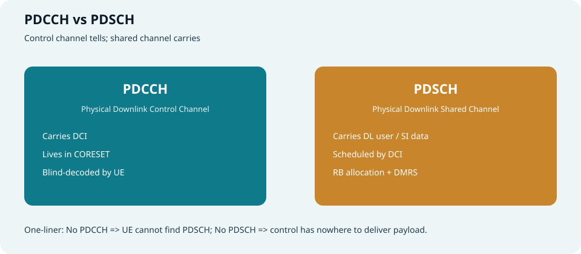
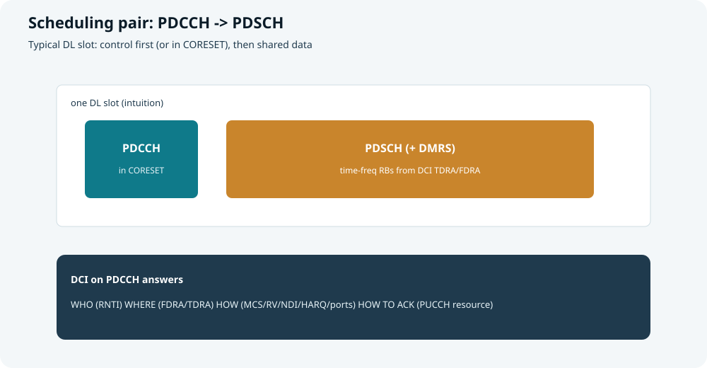
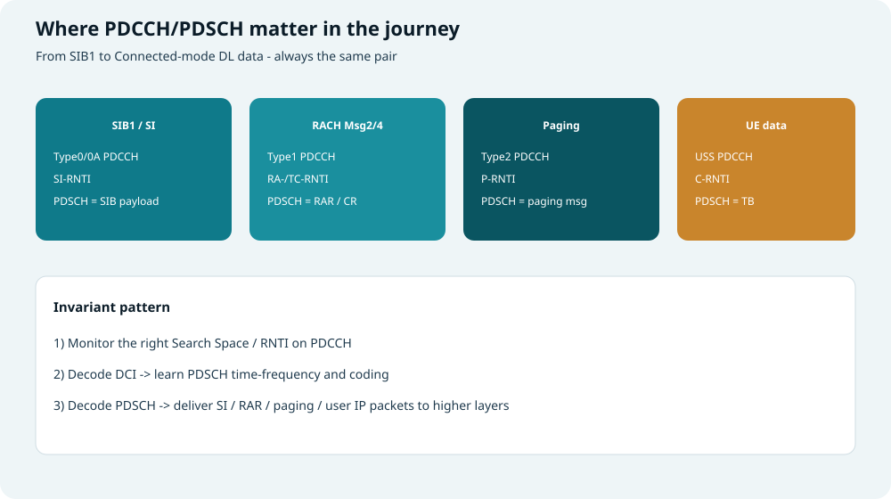
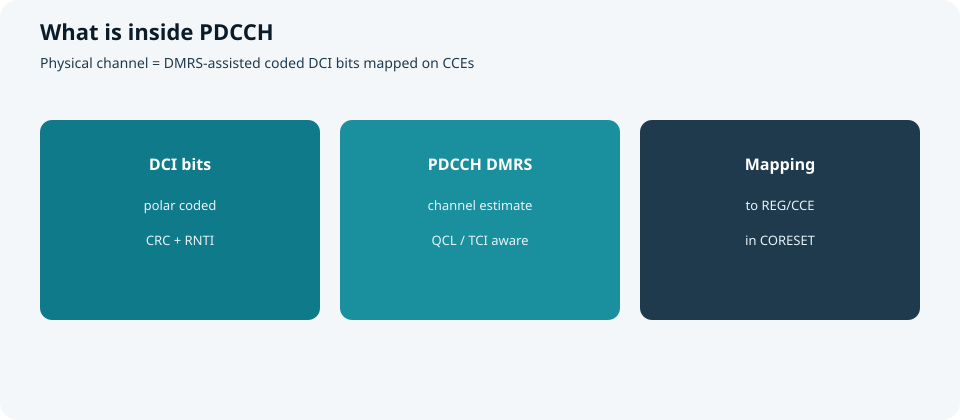
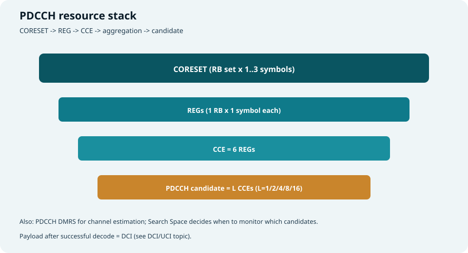
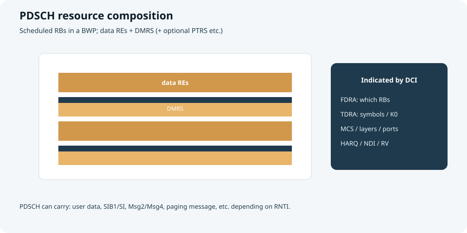
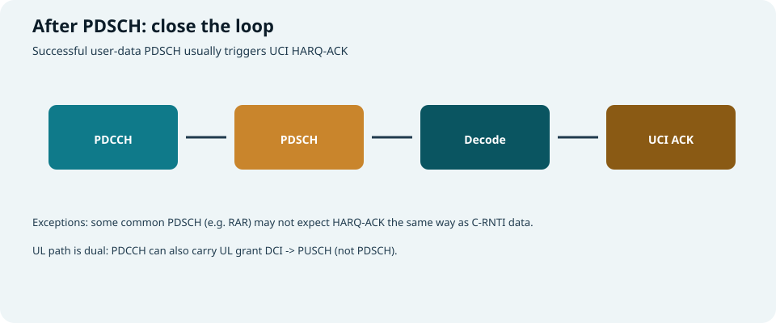

## 本篇要解决什么

5G NR 下行里，最常成对出现的两个物理信道是：

| 信道 | 全称 | 一句话 |
| --- | --- | --- |
| **PDCCH** | Physical Downlink Control Channel | 下行**控制**信道，承载 **DCI** |
| **PDSCH** | Physical Downlink Shared Channel | 下行**共享**信道，承载 **数据/系统消息等载荷** |

本篇把二者的 **功能、组成、资源占用** 讲清楚，并串到：

- **系统接入**：收 SIB1、收 RAR/Msg4、寻呼  
- **后续数据传输**：连接态下行调度与 HARQ 闭环  

对照：**TS 38.211**（物理信道）、**38.212**（编码）、**38.213**（过程）、**38.214**（共享信道过程）。  
强相关：[CORESET 与 Search Space](coreset-search-space.html)、[DCI 与 UCI](dci-uci.html)、[随机接入](random-access.html)、[5G SIBs](5g-sibs.html)。



*图：PDCCH 下指令；PDSCH 运载荷*

---

## 总关系：控制调度数据



*图：典型下行时隙里，PDCCH（CORESET）指出 PDSCH 的时频与传法*

不变式：

```text
监听 PDCCH（对的 Search Space + RNTI）
        ↓ 盲检成功
      得到 DCI
        ↓
按 FDRA/TDRA/MCS/... 解 PDSCH
        ↓
得到 TB / SI / RAR / Paging ...
        ↓（用户数据场景）
     回 UCI HARQ-ACK
```

> **没有可靠的 PDCCH，UE 找不到 PDSCH；没有 PDSCH，控制信道的“调度意图”无处落地。**

补充：同一套 PDCCH 也可承载 **UL grant（DCI 0_x）** 去调度 **PUSCH**——本篇聚焦 **PDCCH↔PDSCH** 下行对，上行只点到为止。

---

## 在整条接入与传输旅程中的位置



*图：SIB1 / RACH / Paging / UE 数据 —— 同一“PDCCH→PDSCH”模式*

| 阶段 | PDCCH 怎么用 | PDSCH 运什么 | 典型 RNTI |
| --- | --- | --- | --- |
| 读 **SIB1** | Type0-PDCCH（CORESET#0） | SIB1 | SI-RNTI |
| 读其它 **SI** | Type0A 等 | SI message | SI-RNTI |
| **RACH Msg2** | Type1-PDCCH | MAC RAR | **RA-RNTI** |
| **RACH Msg4** | Type1 / 后续 | 竞争解决 / RRC | TC-RNTI→C-RNTI |
| **寻呼** | Type2-PDCCH | Paging 消息 | P-RNTI |
| **连接态下行数据** | USS（及部分 CSS） | 用户 TB | C-RNTI / CS-RNTI… |

这正是本站主线的“物理落地”：

```text
MIB → CORESET#0 → PDCCH → PDSCH(SIB1)
RACH Msg1 → RA-RNTI → PDCCH → PDSCH(RAR)
Connected → C-RNTI → PDCCH → PDSCH(data) → UCI ACK
```

---

## PDCCH 详解

### 功能：下行控制平面的“传声筒”

PDCCH 的本质功能是：**把网络的调度/指示意图，以 DCI 形式可靠地送给 UE**。

| 功能类别 | 例子 |
| --- | --- |
| **调度下行** | Format 1_0 / 1_1 → 指示 PDSCH |
| **调度上行** | Format 0_0 / 0_1 → 指示 PUSCH |
| **公共过程** | SI / RAR / Paging 对应的紧凑 DCI |
| **组公共指示** | Format 2_x：时隙格式、抢占、TPC… |

UE 侧动作关键词：**盲检测**——不知道候选落点与聚合等级时，在 Search Space 规定的候选上逐个尝试，直到 CRC+RNTI 匹配。

### 组成：里面有什么



*图：DCI 比特 + PDCCH DMRS + 映射到 CCE*

| 组成部分 | 含义 | 作用 |
| --- | --- | --- |
| **DCI 信息比特** | 控制字段集合 | 告诉 UE “谁、在哪、怎么传、怎么回” |
| **CRC（经 RNTI 处理）** | 校验 + 寻址语义 | 区分发给谁/哪类用途 |
| **信道编码** | 典型 Polar | 抗噪，适配短控制块 |
| **加扰 / 调制 / 层映射** | 物理层处理链 | 变成可映射的符号 |
| **PDCCH DMRS** | 专用解调参考信号 | 估计信道，支撑相干解调 |
| **映射到 REG/CCE** | 落在 CORESET 资源上 | 真正占用空口时频 |

波束方面：CORESET 可关联 **TCI/QCL**，UE 用对应假设收 PDCCH（尤其 FR2）。

### 资源占用：从 CORESET 到 candidate



*图：CORESET → REG → CCE → 聚合等级 L → PDCCH candidate*

| 层级 | 定义直觉 | 资源含义 |
| --- | --- | --- |
| **CORESET** | 允许放 PDCCH 的时频集合 | 频域：BWP 内 RB 位图（常 6-RB 粒度）；时域：**1/2/3** 个符号 |
| **REG** | 1 RB × 1 符号 | 最小砖块 |
| **CCE** | 通常 **6 REG** | PDCCH 分配单位 |
| **聚合等级 L** | L = 1/2/4/8/16 | 一个 PDCCH 占 **L 个 CCE**（差信道常用更高 L） |
| **PDCCH candidate** | 某 AL 下从某起始 CCE 起的一组 CCE | UE 一次盲检对象 |
| **Search Space** | 绑定 CORESET + 监听时机 + 候选个数 | **何时**在该舞台上找 PDCCH |

> 资源口诀：**CORESET 划地皮，CCE 卖地皮，AL 决定买多大，Search Space 决定何时来逛。**  
> 细节见 [CORESET 与 Search Space](coreset-search-space.html)。

### 与 DCI 的边界

- **PDCCH** = 物理信道（怎么传、占哪些 RE）  
- **DCI** = 逻辑内容（字段语义）  

二者关系类似“信封 vs 信纸内容”。字段词汇见 [DCI 与 UCI](dci-uci.html)。

---

## PDSCH 详解

### 功能：下行共享载荷通道

PDSCH 承载“真正要交给上层的下行比特块”，按场景不同可以是：

| 载荷类型 | 场景 |
| --- | --- |
| **用户数据 TB** | 连接态业务 |
| **SIB1 / SI** | 系统消息 |
| **Msg2 RAR / Msg4** | 随机接入 |
| **Paging message** | 寻呼 |
| 其它 | 视 RNTI/过程（如部分广播类） |

同一套物理信道机制，靠 **谁调度（哪类 PDCCH/RNTI）** 与 **高层如何解** 区分用途。

### 组成：数据 + 参考信号



*图：调度到的 RB 上，数据 RE 与 DMRS 共存*

| 组成部分 | 含义 | 作用 |
| --- | --- | --- |
| **传输块 TB** | MAC/RLC 下来的载荷 | 用户面或公共消息内容 |
| **CRC / LDPC 等编码** | 共享信道编码链 | 可靠传输与 HARQ 软合并基础 |
| **加扰、调制、层映射、预编码** | 物理处理 | 适配阶数、层数、波束 |
| **PDSCH DMRS** | 解调参考 | 估计等效信道以解数据 |
| **可选 PTRS 等** | 相位跟踪等 | 高频/高阶调制辅助 |
| **速率匹配绕开占用** | 避开 CORESET、其它信号等 | 不与保留 RE 冲突 |

DMRS 配置（类型、额外位置、端口）常由 **DCI + RRC** 共同决定，并与天线端口/QCL 假设相关。

### 资源占用：由 DCI 动态划定

与 PDCCH“相对静态的 CORESET 池”不同，**每次 PDSCH 的时频占用通常由当次 DCI 指示**：

| 指示 | 管什么 |
| --- | --- |
| **FDRA** | 频域：哪些 RB / RBG（Type0/1 等分配类型） |
| **TDRA** | 时域：起始符号、长度、时隙偏移 **K0**（查表） |
| **BWP indicator** | 是否在目标 BWP 上收 |
| **MCS / 层数 / 天线端口** | 频谱效率与 MIMO |
| **HARQ process / NDI / RV** | 新传或重传、软合并 |

因此 PDSCH 的“资源画像”是：

```text
当前激活 BWP 内
  × DCI 给出的频域 RB 集合
  × DCI 给出的符号区间（可跨符号，甚至跨 slot 视配置）
  − 被 CORESET / SSB / 其它保留占用的 RE
  + 插入的 DMRS 图案
```

> 口诀：**PDSCH 的地皮是“临时候场券”，门票印在 PDCCH 的 DCI 上。**

### 传完之后



*图：用户数据 PDSCH 后常回 HARQ-ACK*

- **C-RNTI 用户数据**：通常按 K1 等在 PUCCH/PUSCH 回 **HARQ-ACK**（UCI）  
- **部分公共 PDSCH**（如 RAR）：不一定走同一套 ACK 模型  
细节见 [DCI 与 UCI](dci-uci.html)。

---

## 对照表：PDCCH vs PDSCH

| 维度 | PDCCH | PDSCH |
| --- | --- | --- |
| 角色 | 控制 / 调度 / 指示 | 共享载荷传输 |
| 典型内容 | DCI | TB（数据或 SI/RAR/Paging…） |
| 资源“家” | **CORESET**（半静态配置） | **DCI 动态指示的 RB/符号** |
| 基本单位 | REG / CCE / AL | RB / RE；编码以 TB 为中心 |
| UE 如何发现 | Search Space **盲检** | 先解出 DCI，再按指示收 |
| 参考信号 | PDCCH DMRS | PDSCH DMRS（+可选 PTRS） |
| 失败表现 | 漏检调度 → 丢 PDSCH 机会 | CRC 失败 → NACK/重传或丢 SI |

---

## 系统接入中的关键作用（逐段）

### 1) 打开系统消息大门

- MIB 给出 `pdcch-ConfigSIB1` → **CORESET#0 / SS#0**  
- UE 在 Type0-PDCCH 上解出 DCI → **PDSCH 上的 SIB1**  
- 没有这对信道，就停在“只听见 SSB”、无法驻留与后续 RACH 配置

### 2) 随机接入的下行腿

- Msg2：PDCCH（**RA-RNTI**）→ PDSCH（RAR：TA、grant、TC-RNTI）  
- Msg4：PDCCH → PDSCH（竞争解决 / RRC）  
- 详见 [随机接入](random-access.html)

### 3) 寻呼落地

- Type2-PDCCH（P-RNTI）指出寻呼时机上的 PDSCH  
- Idle/Inactive UE 靠它知道“有没有我”

### 4) 连接态持续输血

- USS 上 C-RNTI PDCCH 高频出现  
- 每次成功的 DL 调度 = 一次 PDCCH 命中 + 一次 PDSCH 解调 +（通常）一次 UCI 反馈  
- 吞吐、时延、覆盖都高度依赖这对信道的可靠性与配置（候选数、AL、CORESET 符号数、MCS 等）

---

## 工程直觉与排障抓手

| 现象 | 优先怀疑 |
| --- | --- |
| 永远收不到 SIB1 | CORESET#0 / SS#0 / Type0 监听是否错；PDCCH 没解到 |
| RACH 无 RAR | RA-RNTI 是否与 RO 一致；Type1 搜索空间；Msg2 PDCCH/PDSCH |
| 有 DCI 无数据 | TDRA/FDRA/BWP 解错；PDSCH DMRS/QCL 假设不对 |
| 吞吐差但控制还行 | PDSCH MCS/层数/干扰；或 ACK 反馈路径问题 |
| 控制也不稳 | CORESET 符号太少、AL 不够、波束/TCI、候选过少或 BD 预算 |

---

## 和本站专题怎么串

```text
CORESET / Search Space  →  PDCCH 在哪、何时找
        ↓
      DCI 字段         →  PDCCH 说了什么
        ↓
      PDSCH 资源/解码  →  本篇落地
        ↓
      UCI HARQ-ACK     →  闭环
```

| 专题 | 补哪一块 |
| --- | --- |
| [CORESET 与 Search Space](coreset-search-space.html) | PDCCH 的舞台与场次 |
| [DCI 与 UCI](dci-uci.html) | PDCCH 载荷与反馈 |
| 本篇 | **物理信道本身** + 与 PDSCH 成对关系 + 接入/数据中的角色 |
| [5G SIBs](5g-sibs.html) / [随机接入](random-access.html) | 公共 PDSCH 的两大用例 |

---

## 快速自测

1. 用一句话区分 PDCCH 与 PDSCH。  
2. REG、CCE、聚合等级、CORESET 如何叠成一次 PDCCH 传输？  
3. PDSCH 的时频资源主要由谁指示？FDRA/TDRA 各管什么？  
4. 为什么说“接入全程反复出现 PDCCH→PDSCH”？各举 SIB1、Msg2、寻呼、用户数据一例。  
5. PDCCH DMRS 与 PDSCH DMRS 分别服务什么？  
6. 用户数据 PDSCH 成功后，闭环通常还缺哪一环？

> 一句话：**PDCCH 是下行调度的嘴，PDSCH 是下行载荷的腿；接入靠它们递 SI 与 RAR，连接后靠它们持续送数。**

## 相关专题

- [CORESET 与 Search Space](coreset-search-space.html)
- [DCI 与 UCI](dci-uci.html)
- [随机接入](random-access.html)
- [5G SIBs](5g-sibs.html)
- [小区搜索](cell-search.html)
- [Antenna Port / QCL / Resource Grid](antenna-port-qcl-resource-grid.html)
