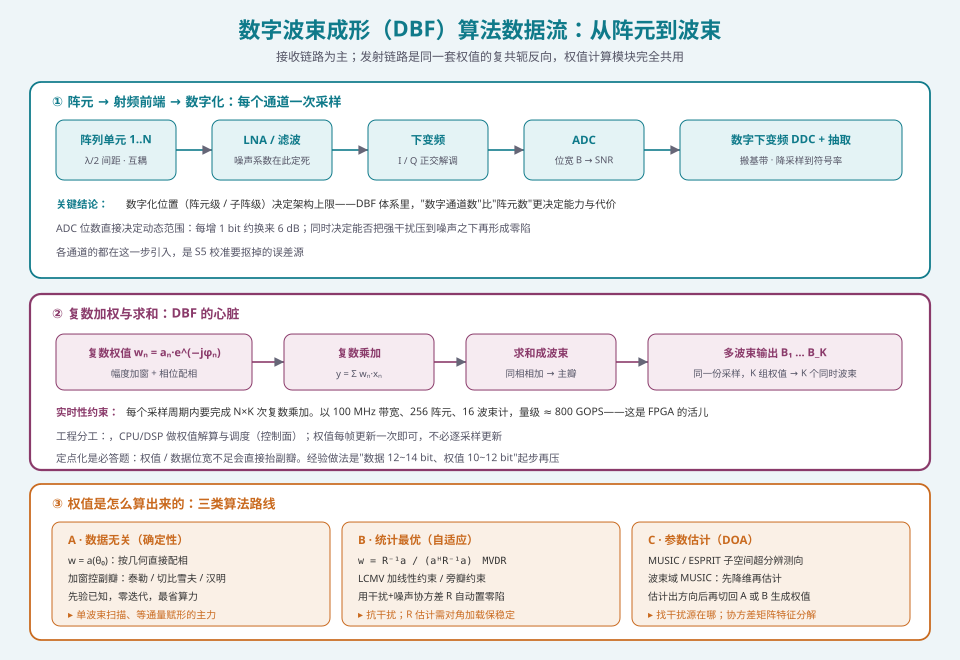
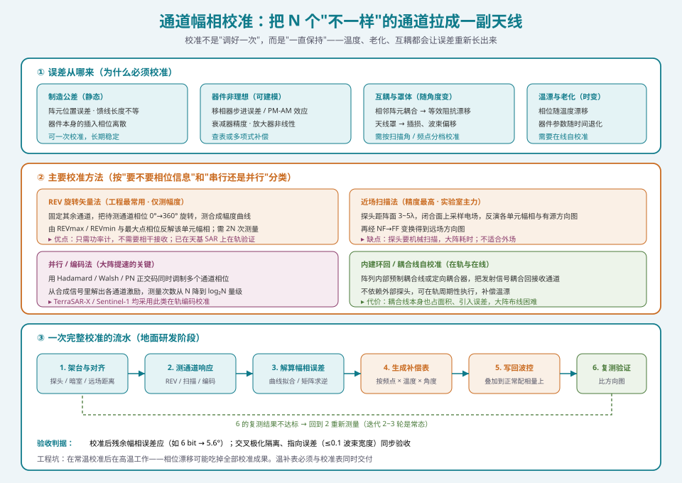
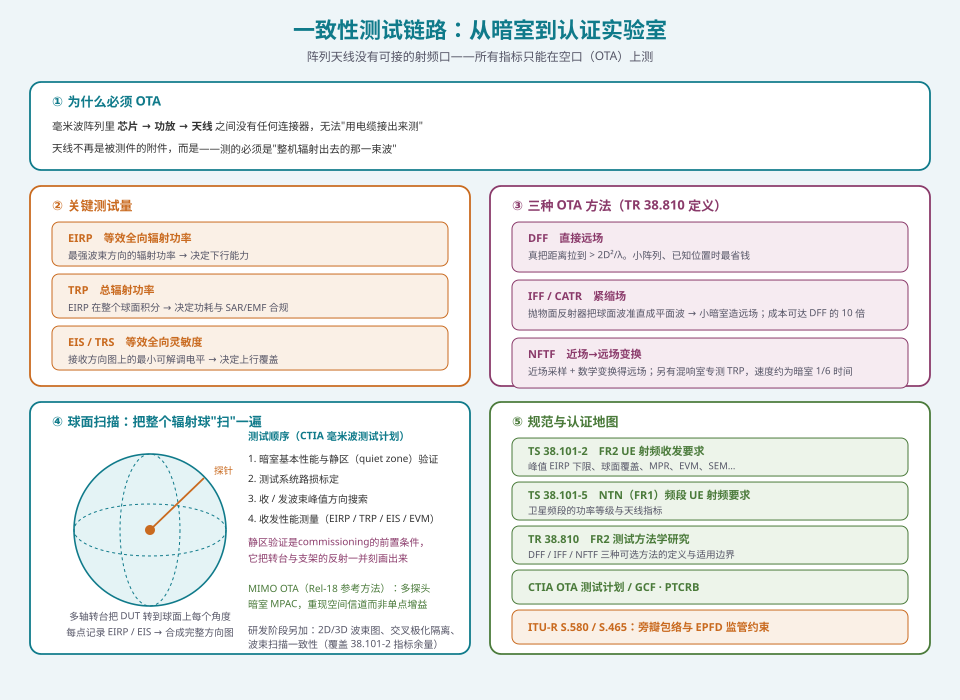

## 这篇要解决什么

上一站在 [卫星相控阵天线：从阵元到波束](satellite-phased-array.html) 里，我们把相控阵的**物理机制**讲清楚了：波程差 → 阵列因子 → λ/2 准则 → 扫描损耗 → 四种架构。

但那篇回答的是「**它是怎么工作的**」。这篇回答的是另一个问题：**如果你想真正把它做出来、并且把它做对，你需要按什么顺序学什么**。

这不是一份"知识点列表"。相控阵是一个**典型的跨层系统**——电磁、微波、模拟电路、数字信号处理、嵌入式、协议、计量测试，六个领域全部耦合在一起。按学科目录去学，学到一半就会发现"每个公式我都懂，但拿到一个阵列我依然不知道从哪下手"。

所以这篇按**能力递进**组织成六个阶段：

| 阶段 | 主题 | 你在这一段之后能做什么 | 软件工程师相关度 |
| --- | --- | --- | --- |
| **S1** | 数学与电磁地基 | 独立推出阵列因子，理解"相位等价于时延"的边界 | 高（数学直接可用） |
| **S2** | 阵列与波束基础 | 给定 N / d / 扫描角，预测增益、波束宽度、副瓣、栅瓣 | 高（可代码验证） |
| **S3** | 硬件与器件 | 读懂 T/R 组件手册，把器件指标折算成系统代价 | 中（必须懂，但不必会设计） |
| **S4** | **波束成形算法与软件**　★ | 写出权值算法，并把它跑进 FPGA 的时序预算 | **★ 主战场** |
| **S5** | 校准与实时实现 | 设计校准流程，把 N 个通道的幅相误差压到可用 | **★ 主战场** |
| **S6** | 测试与一致性 | 读懂 OTA 测试报告，判断一个阵列"能不能过认证" | 中高（测试脚本与数据分析） |


*图 1：六阶段学习体系总览。S3 是铺垫、S4/S5 是主战场、S6 是"能交付"的分界线*

> **一条原则**：纵向 S1 → S6 是主线，但 **S3 可以与 S1/S2 并行补**。你不需要等硬件全懂了再学算法；相反，先在 MATLAB/Python 里把 S1、S2、S4 跑通，再回头理解"为什么实际阵列不如仿真好看"，效率高得多。

---

## 阶段一：数学与电磁地基

**这一段解决什么**：让你在纸上（而不是在软件里）就能推出阵列因子。

### 1.1 你必须真正掌握的四块数学

**（1）复数与相量**
相控阵的整个语言都是复数。信号写成 \(s(t) = \mathrm{Re}\{A e^{j(\omega t + \varphi)}\}\)，阵列做的事就是在复数域里给每个通道乘一个 \(e^{j\varphi_n}\)。「配相」这个词的数学含义就是复数乘。

**（2）傅里叶变换与空间频率**
这是相控阵里最漂亮的一个映射关系：

\[
\text{阵列激励} \;\xrightarrow{\text{空间傅里叶变换}}\; \text{远场方向图}
\]

一维均匀线阵的阵列因子

\[
AF(u) = \sum_{n=0}^{N-1} w_n \, e^{\,j n \frac{2\pi d}{\lambda} u},
\qquad u = \sin\theta
\]

把 \(u = \sin\theta\) 看成"空间频率"，把 \(n d / \lambda\) 看成"空间采样位置"，它就是**一个标准的 DFT**。

这个映射一旦看透，后面的一切都变成直觉：

- **加权加窗**（泰勒窗、切比雪夫窗）就是设计一个频谱形状——窗函数在"空间频率域"的副瓣压制能力直接搬过来用
- **栅瓣**就是 **空间域的混叠（aliasing）**，\(d > \lambda/2\) 等价于采样率低于奈奎斯特率
- **非均匀 / 稀疏阵列**等价于非均匀采样，其方向图就是"非均匀 DFT"
- **波束扫描**就是给频谱加一个线性相位斜坡，等价于时域的频率搬移

> 如果你只想记住一个洞察，就记这个：**相控阵 = 空间域的采样与滤波**。学过数字信号处理的人，这一层几乎不用重新学，只需要换一套坐标。

**（3）远场条件**
什么时候可以把到达波当作平面波？判据是：

\[
R > \frac{2D^2}{\lambda}
\]

其中 \(D\) 是阵列最大孔径。这个式子后面会在两个地方反复出现：近场校准探头的距离选择、OTA 暗室为什么要用紧缩场。

**（4）互易定理**
同一天线，收发方向图相同。这让你只需要验证一套模型——发射端仿真出来的方向图，接收时可以直接用。

### 1.2 电磁地基：不必深到解麦克斯韦方程

软件工程师最常犯的错误是**要么完全跳过电磁，要么试图从头啃电磁场理论**。正确的位置在中间：你需要理解下面这些**结论性**的东西，以及它们的适用条件。

| 概念 | 你需要的深度 | 为什么必须懂 |
| --- | --- | --- |
| 阵元方向图 \(G_e(\theta)\) | 知道它存在、通常宽边最强 | 总方向图 = \(G_e \times AF\)，阵元决定了扫描到边缘时的额外衰减 |
| 极化 | 区分线极化 / 圆极化，知道交叉极化隔离是硬指标 | 交叉极化恶化直接触发 3GPP 与 ITU 的指标不合格 |
| 互耦 | 知道它使输入阻抗随扫描角变化 | 解释"仿真 ±60°、实测 ±45°"的根因 |
| 表面波 / 介质基板 | 知道微带阵在高频有表面波损耗 | 影响阵列效率 η 的取值 |
| 近场 vs 远场 | 会算 \(2D^2/\lambda\) | 测试与校准的架台距离由它决定 |

**不必**在这一阶段去推导波导模式、去算微带贴片的全波分析。那些是天线工程师的活。你要做的是**建立正确的物理图像**，以便在设计算法时知道自己的模型的适用边界在哪。

### 1.3 阶段一资源

**书**
- 《天线原理与设计》类教材的**前两章**——只要天线基础参数（方向图、增益、波束宽度、效率）与二元阵
- Balanis《Antenna Theory》第 6 章「Arrays: Linear, Planar, and Circular」——**阵列部分写得最清楚的一本**，阵列因子、栅瓣、加窗都在这一章
- 《数字信号处理》——如果你还没学过，先补"DFT / 窗函数 / 采样定理"这三节，别的可以后补

**工具**
- Python + NumPy（首选，便于做算法原型和批量仿真）
- MATLAB + Phased Array System Toolbox（业界通用，工具链完整）

**里程碑（自测）**
1. 不查书，从"波程差"出发推出 N 元均匀线阵的阵列因子。
2. 说明为什么「空间域混叠」与「时域混叠」是同一个数学现象。
3. 一个 32 元阵、20 GHz、间距 0.5λ，算出远场条件距离。

---

## 阶段二：阵列与波束基础

**这一段解决什么**：把公式变成**可以预测的系统行为**。

这一阶段的内容与 [卫星相控阵天线](satellite-phased-array.html) 高度重叠，那篇已经把阵列因子、λ/2 准则、扫描损耗讲透了。这里只补充**面向工程预测**的两件事，并给出代码级验证的方法。

### 2.1 从公式到"能报数"

工程上被问得最多的永远是这几个数。你应该能在头脑里（或一张草稿纸上）估出来：

| 指标 | 估算式 | 直觉 |
| --- | --- | --- |
| 阵列增益 | \(G \approx G_e + 10\log_{10}N + 10\log_{10}\eta\) | 每翻一倍阵元 +3 dB |
| 波束宽度 | \(\theta_{3\text{dB}} \approx 0.886\lambda / (L\cos\theta_0)\) | 孔径越大越窄 |
| 第一副瓣（等幅） | −13.2 dB | 加泰勒窗可压到 −25 ~ −30 dB |
| 扫描损耗 | \(10\log_{10}(\cos\theta_0)\) | 60° 时纯几何就是 −3 dB |
| 栅瓣临界间距 | \(d \le \lambda/(1+|\sin\theta_0|)\) | ±90° 全扫 → \(d \le \lambda/2\) |

### 2.2 用 20 行代码把 S1/S2 焊死在直觉里

**最好的验证方式是自己写一遍**。下面这段代码不是"作业"，而是**日后所有算法的地基**：

```python
import numpy as np

def array_factor(N, d_over_lambda, theta0_deg, theta_scan, weights=None):
    """N 元均匀线阵的方向图（线性幅度刻度）。"""
    n = np.arange(N)
    theta0 = np.deg2rad(theta0_deg)
    theta = np.deg2rad(theta_scan)
    # 配相：让主瓣指向 theta0
    phase = -2 * np.pi * d_over_lambda * np.sin(theta0) * n
    w = np.exp(1j * phase) if weights is None else weights * np.exp(1j * phase)
    # 方向向量 a(theta)
    a = np.exp(1j * 2 * np.pi * d_over_lambda * np.sin(theta) * n[:, None])
    return np.abs(w.conj() @ a) / N
```

改这几个参数，你能亲眼看到：

- `d_over_lambda = 0.5` → 全扫描无栅瓣；改成 `0.7` → 扫描超过约 45° 栅瓣进场
- `weights` 换成 `np.hamming(N)` → 副瓣从 −13.2 dB 掉到 −40 dB 量级，但主瓣展宽
- `theta0_deg = 60` → 主瓣高度下降，验证扫描损耗

**这一步不要偷懒。** 一个能在 30 秒内写出方向图函数的人，和一个每次都要问人的人，在后续 S4/S5 的效率差距是数量级的。

### 2.3 阶段二资源

**书**
- Balanis 第 6 章（继续）
- Mailloux《Phased Array Antenna Handbook》第 1、2 章——**这本书是相控阵的行业圣经**，第二版以后对数字与自适应阵列也加了不少篇幅。前两章把"阵列的线性理论"讲得极其干净
- Hansen《Phased Array Antennas》——加窗与低副瓣设计的权威参考

**工具**
- 继续用 Python / MATLAB，把方向图、加窗、扫描损耗做成一个可复用的小库
- 有条件的用 CST / HFSS 跑一次单元的 S 参数与方向图，理解仿真与理论模型的差在哪

**里程碑（自测）**
1. 写一个函数：输入 N、d、θ₀，输出归一化方向图、HPBW、第一副瓣电平、有无栅瓣。
2. 用切比雪夫窗把 16 元阵的第一副瓣压到 −30 dB，报出此时主瓣展宽了多少。
3. 解释：为什么"阵元越多增益越高"这个说法在**固定孔径**下是错的。

---

## 阶段三：硬件与器件（必要铺垫，可与 S1/S2 并行）

**这一段解决什么**：知道你的算法跑在什么硬件上，以及硬件会怎么"吃掉"你的理想权值。

> **给软件工程师的定位建议**：这一阶段你不需要会**设计** T/R 组件，但必须能**读懂**它的数据手册，并把每一项非理想因素折算成对系统指标的代价。这是"算法工程师"和"只会写仿真的人"之间最明显的分水岭。

### 3.1 一张 T/R 组件手册，你要读出什么

一个典型的 T/R 组件数据手册里，下面这几项你必须能对应到算法影响：

| 参数 | 典型值 | 对算法 / 系统的影响 |
| --- | --- | --- |
| 移相器位数 | 4 / 5 / 6 bit | 量化误差 → **量化副瓣**。6 bit = 5.6° 步进，量化副瓣约 −40 dB 量级 |
| 移相器插入损耗 | 1 ~ 3 dB（随状态变化） | 直接吃发射功率；状态相关的变化会引入幅度不平衡 |
| PM-AM 效应 | 幅度随相位状态波动 | 使得"只调相位"的假设失效，需要联合校准 |
| 衰减器位数 | 5 / 6 bit | 决定加窗的精度，同样存在量化副瓣 |
| 噪声系数 | 2 ~ 4 dB（含前端） | 决定 G/T，是接收灵敏度的天花板 |
| 饱和功率 P1dB | 视工艺（GaN 更高） | 决定 EIRP；同时决定"能不能同时做多波束" |
| 通道间幅相一致性 | ±0.5 dB / ±5°（出厂） | **这就是 S5 校准要消灭的东西** |

### 3.2 三个必须建立的数量级概念

**（1）量化副瓣的估算**

移相器只有 \(B\) bit 时，相位误差在 \([-2\pi/2^{B+1}, +2\pi/2^{B+1}]\) 内近似均匀分布，其引入的副瓣电平可用经典的随机误差理论估计：

\[
\text{SLL}_{\text{rms}} \approx \frac{\sigma_\varphi^2}{N} \cdot \frac{1}{\overline{|\text{平均激励}|^2}} \quad\Longrightarrow\quad \text{量级：}\ \text{SLL} \propto \frac{1}{N \cdot (2^{B})^2}
\]

工程结论（比公式更有用）：

- 阵元数**越多**，量化副瓣**越低**（误差互相平均掉，\(N\) 倍抑制）
- 位数**每加 1 bit**，量化副瓣约改善 **6 dB**
- 因此小阵（8/16 元）对移相器位数极敏感，大阵（256 元以上）用 5 bit 就够——**这直接决定了成本**

**（2）ADC 位宽与动态范围**

\[
\text{SNR}_{\text{ideal}} \approx 6.02\,B + 1.76 \ \text{(dB)}
\]

3 dB 的余量通常留给量化噪声之外的因素。这条式子决定了：

- 你要在多大的**带内干扰**下仍能把目标信号解出来
- 能否在数字域形成有效零陷（零陷深度最终受限于 ADC 的动态范围与量化噪声底部）

**（3）子阵划分与射频链压缩比**

混合波束成形里，射频链数 \(N_{\text{RF}}\) 与阵元数 \(N\) 的比值决定功耗与灵活度的平衡：

\[
\text{压缩比} = \frac{N}{N_{\text{RF}}} \quad(\text{典型 } 4{:}1 \sim 8{:}1)
\]

**代价**：子阵间距往往远大于 λ/2，产生**量化栅瓣**。抑制手段包括子阵级加窗、子阵间随机相位扰动、重叠子阵结构。这是"实验室仿真漂亮、装机后旁瓣超标"最常见的根因，也是软件侧容易被甩锅的地方——**要提前在场**。

### 3.3 阶段三资源

**书**
- Mailloux《Phased Array Antenna Handbook》第 3、4 章（馈电网络与移相器）
- 《微波固态电路》/ 《射频集成电路设计》的**功放、低噪放、混频器章节**——读结论，不必推小信号模型
- 器件厂商的应用笔记（ADI、Qorvo、Analog Devices、NXP 的相控阵芯片系列）——**这是最高效的学习材料**，比教科书贴近工程

**工具**
- 一次深入的**芯片选型练习**：给定指标（N、频段、EIRP、功耗），从厂商官网选出 T/R 芯片与移相器，写一份选型对比
- ADS / AWR 看一眼功分网络的插损与隔离度

**里程碑（自测）**
1. 给一个 6 bit 移相器的 64 元阵，估算量化副瓣电平，并说明把它换成 5 bit 会恶化多少。
2. 解释为什么"大阵对小位数的容忍度更高"。
3. 给定压缩比 8:1，说明子阵栅瓣可能出现在哪些角度，以及为什么子阵级加窗能缓解。

---

## 阶段四：波束成形算法与软件　★ 主战场

**这一段解决什么**：把"权值"从公式变成一个能跑的、实时的算法系统。

这是整个体系里**算法 / 软件工程师投入产出比最高**的一段。S1~S3 决定了你能不能看懂问题，S4 决定了**你能不能解决问题**。

### 4.1 权值计算的三种路线



*图 2：DBF 的数据流与三类权值算法。数据面在 FPGA，控制面在 CPU/DSP*

**路线 A · 数据无关（确定性）**

给定目标方向 θ₀，直接按几何配相：

\[
w_n = \frac{1}{N} a_n(\theta_0)^* ,
\qquad a_n(\theta_0) = e^{\,j \frac{2\pi d}{\lambda} n \sin\theta_0}
\]

加窗（幅度加权）用来控副瓣：泰勒窗（可控副瓣等电平）、切比雪夫窗（等副瓣最优）、汉明/汉宁窗（快速实现）。

- **优点**：零迭代、零算力、绝对稳定
- **用途**：单波束扫描、等通量赋形（**卫星载荷的主力**）、任何"我知道目标在哪"的场景
- **软件实现**：一张按角度 / 频点 / 温度寻址的权值查找表（LUT），加一个线性插值器

**路线 B · 统计最优（自适应）**

用接收数据的协方差矩阵 \(R = E[xx^H]\) 自适应求权，最经典的是 MVDR（Capon）波束形成：

\[
w_{\text{MVDR}} = \frac{R^{-1} a(\theta_0)}{a^H(\theta_0) R^{-1} a(\theta_0)}
\]

它的行为很直观：**在保持 θ₀ 方向增益为 1 的约束下，最小化总输出功率**——于是干扰方向的增益被自动压成零陷。加线性约束就是 LCMV：

\[
w_{\text{LCMV}} = R^{-1} C (C^H R^{-1} C)^{-1} f
\]

**工程上必须处理的三个坑**：

1. **对角加载（diagonal loading）**：直接用样本协方差矩阵求逆极不稳定。做法是 \(R \leftarrow R + \sigma^2 I\) 或 `R + delta*eye(N)*trace(R)/N`。加载量太小 → 不稳定、零陷漂移；太大 → 退化成常规波束形成
2. **样本数不足**：快拍数要显著大于 \(2N\) 量级，否则 R 的条件数爆炸。宽带场景还要考虑频率平滑（frequency smoothing）
3. **目标信号自零陷（signal cancellation）**：如果 θ₀ 方向信号很强且协方差矩阵里含它，MVDR 会把它自己当干扰压掉。解法是先做 DOA，把目标方向剔除再做 R

**路线 C · 参数估计（DOA）**

先估计来波方向，再切回 A 或 B 生成权值。**这是抗干扰与认知无线电的入口**。

- **MUSIC**：对 R 做特征分解，噪声子空间对应的特征向量与导向矢量正交，于是

\[
P_{\text{MUSIC}}(\theta) = \frac{1}{a^H(\theta) E_n E_n^H a(\theta)}
\]

  在真实方向处出现尖峰。特点是**超分辨**（可以分辨小于波束宽度的多源），但需要准确的源数（MDL / AIC 判源）与足够的快拍

- **ESPRIT**：利用旋转不变性，无需全谱搜索，计算量小一个量级，但需要特殊的子阵结构
- **波束域 MUSIC**：先用少量波束做降维，再做 MUSIC。这是**大规模阵列的工程解**——直接把 256×256 的协方差矩阵做特征分解是不可接受的
- **压缩感知 / 稀疏 DOA**：少快拍、相干源的场景下更稳健，代价是优化求解的复杂度

### 4.2 宽带与波束斜视：模拟阵列绕不过的坎

模拟移相器补偿的是**相位**，而相位与频率绑定：

\[
\Delta\varphi = \frac{2\pi d f \sin\theta_0}{c}
\]

同一组移相器状态，在 \(f\) 与 \(f + \Delta f\) 上对应的实际指向不同——这就是**波束斜视（beam squint）**。这是**纯模拟阵列的固有问题**（[卫星相控阵天线](satellite-phased-array.html) 第五节已述）。

三条解决路径，按代价排序：

| 方案 | 原理 | 代价 | 适用 |
| --- | --- | --- | --- |
| **真时延 TTD** | 用延迟线代替移相器，延迟与频率解耦 | 体积、插损、切换速度 | 宽带大阵 |
| **子阵级 TTD + 阵元级移相** | TTD 补粗延迟，移相器精调 | 折中，工程主流 | 宽带相控阵标准做法 |
| **数字域频率相关加权** | 每个频点一组权值（子带处理） | 算力 × 子带数 | 全数字阵列的天然优势 |

**软件侧要点**：如果做子带处理，权值不再是一个向量，而是一个**矩阵**（`[子带数][波束数][阵元数]`）。这是 FPGA 上 BRAM/URAM 资源规划的核心约束，要在算法设计阶段就想清楚。

### 4.3 从算法到 FPGA：定点化与映射

这是软件工程师最容易低估的一段。**从浮点仿真通过，到 FPGA 时序收敛、指标不退化，中间隔着一整段工程**。

**（1）定点化**

三步走，不要跳步：

1. **浮点参考模型**：Python / MATLAB 写出算法，产出参考方向图与误差指标
2. **逐级定点量化**：先量化权值，再量化数据，再量化中间累加——每次量化后与浮点参考对比，找出**哪个环节是误差主导**
3. **位宽压缩**：在满足指标的前提下逐位下压，直到再压一位就超标。经验起点：**数据 12~14 bit、权值 10~12 bit、累加器留 6~8 bit 保护位**

**必看的两个现象**：

- 权值位宽不足 → **副瓣抬高**（往往先在最深的零陷处暴露）
- 累加器保护位不足 → 强信号时**溢出截断**，出现突发性杂散

**（2）数据面与控制面的分工**

这是 DBF 系统最重要的一条架构原则：

| | 数据面 | 控制面 |
| --- | --- | --- |
| 干什么 | 复数乘加、求和、多波束 | 权值解算、调度、协方差估计、DOA |
| 跑在哪 | **FPGA**（流水线，逐采样） | **CPU / DSP**（帧级，不逐采样） |
| 算力量级 | 极高（100 GOPS ~ 1 TOPS） | 低几个数量级 |
| 更新频率 | 每个采样周期 | 每帧 / 每毫秒级 |

> **最常见的架构错误**：把权值解算放进了逐采样的数据通路。**权值不需要每个采样都重算**——它只需要在目标移动、干扰变化、温度变化时更新。想清楚这一点，硬件规模能降一个数量级。

**（3）FPGA 实现的技术栈**

- **Xilinx Zynq / Zynq UltraScale+ MPSoC**：ARM（控制面）+ FPGA（数据面）单芯片，是相控阵最典型的平台
- **Vivado HLS / Vitis HLS**：C++ 写算法 → 综合成 RTL。**对算法工程师最友好**，是快速原型的首选
- **传统 RTL（Verilog/VHDL）**：性能上限更高、资源更省，但开发慢。乘法器阵列、CORDIC（用于相位旋转与三角函数）、分布式算法（DA）是三个核心技巧
- **RFSoC**：把 ADC/DAC 也集成进来，是新一代数字阵列的主流形态

**（4）相位旋转的实现选择**

给每个通道乘 \(e^{j\varphi}\) 是固定模式，但实现方式差别很大：

- **CORDIC**：无乘法器，用移位加法做旋转。资源省，适合大量通道
- **复乘器**：直接四乘法，性能好，DSP48 消耗大
- **查表**：预存各角度的 \(\cos\varphi / \sin\varphi\)，精度受 LUT 深度限制
- **混合**：粗查表 + 细 CORDIC 校正

### 4.4 阶段四资源

**书 / 论文**
- Van Trees《Optimum Array Processing》——**阵列信号处理的理论圣经**（第四卷）。MVDR、MUSIC、CRB 都在这里，但偏理论，建议当工具书查
- 《自适应阵列处理》类专著——MVDR / LCMV / GSC 的工程化处理
- 3GPP / 卫星通信方向的波束管理论文，把算法和协议接起来

**开源与工具**
- Python：`numpy`、`scipy.signal`、自建方向图库；`pyroomacoustics` 的 DOA 模块可以拿来对拍
- Xilinx Vitis HLS / Vitis Libraries 中的 DSP 库——**直接看官方的 FFT / 复数乘加实现**，比自己从头写快得多
- 软件无线电平台（USRP / PlutoSDR）+ GNU Radio：**这是把算法第一次打到真实空口的最便宜路径**，强烈推荐至少做一次

**里程碑（自测）**
1. 实现 MVDR 与 LCMV，并做出下面这张对照表：对角加载量 vs 零陷深度 vs 主瓣损失的权衡曲线。
2. 用 MUSIC 在信噪比 10 dB、两个间隔 0.5 波束宽度的源下成功分辨，并画出随快拍数变化的分辨成功率。
3. 把常规波束形成写成 HLS C++，综合出 RTL，报出在目标器件上的 DSP48 / BRAM 占用与最大时钟频率。
4. 实现 TTD + 移相器的两级结构，给出在 10% 相对带宽下斜视残余指向误差。

---

## 阶段五：校准与实时实现　★ 主战场

**这一段解决什么**：让 N 个"各有各的脾气"的通道，像一副天线一样工作。

[卫星相控阵天线](satellite-phased-array.html) 里讲过阵列增益的表达式 \(G \approx G_e \cdot N \cdot \eta\)，其中 \(\eta\) 包含了"幅相量化误差"。**校准就是把这一项从 0.6 拉回 0.85 的工程手段**——它往往是整机性能提升里最便宜的那几个 dB。



*图 3：误差来源、四类校准方法、以及一次完整校准的六步流水*

### 5.1 误差从哪来：按"能不能一次性解决"分类

这个分类决定了你的校准架构：

| 类别 | 来源 | 时变？ | 处理方式 |
| --- | --- | --- | --- |
| **静态制造公差** | 阵元位置、馈线长度、器件插入相位离散 | 否 | 出厂一次校准，写入补偿表 |
| **器件非理想** | 移相器步进误差、PM-AM、衰减器精度 | 弱 | 建模 + 查表补偿 |
| **互耦 / 罩体** | 相邻阵元耦合、天线罩插损与相位 | 随扫描角变 | 按角度 / 频点分档校准 |
| **温漂与老化** | 相位随温度漂移、器件参数退化 | **是** | **必须在线自校准** |

> **工程上最容易翻车的一条**：在常温下做了漂亮的校准，装到高温环境里相位漂移把成果全部吃光。所以**温补表必须和校准表同时交付**，并且在系统启动流程里设计周期性自校准。

### 5.2 四类主流校准方法

**（1）REV 旋转矢量法——工程最常用，只需测幅度**

原理：固定其余通道，把**待测通道**的相位从 0° 逐步旋转到 360°，记录远场合成信号的幅度变化。

设待测通道贡献为 \(E_m\)，其余通道合成贡献为 \(E_r\)，则合成幅度随相位旋转呈正弦形变化：

\[
|E_{\text{total}}(\varphi)| = |E_r + E_m e^{j\varphi}|
\]

其最大值 \(REV_{\max} = |E_r| + |E_m|\)，最小值 \(REV_{\min} = |E_r| - |E_m|\)，于是：

\[
|E_m| = \frac{REV_{\max} - REV_{\min}}{2}, \qquad \varphi_m = \arg\!\left(\varphi \big|_{|E| = REV_{\max}}\right)
\]

遍历所有 N 个通道，即得全部幅相误差。测量次数 **2N**。

- **优点**：只需要功率计，不需要相干接收链路（源与待测通道无需同步）——**这是它在工程上胜出的核心原因**
- **已被在天基 SAR 上验证**（TerraSAR-X 系列）
- **局限**：在最大值 / 最小值附近幅度对相位不敏感，动态范围受限，解算精度受噪声影响。改进方法是用 0° / 90° / 180° 三个状态解方程，或用自相关函数法（ACF）提高抗噪性

**（2）近场扫描法——精度最高，实验室主力**

探头位于阵列前方 3~5λ，在一个闭合面上逐点采样电场，反演出各单元的幅相与有源方向图，再经近场→远场变换得到远场方向图。

- **优点**：精度最高，能同时拿到有源方向图与互耦信息
- **缺点**：探头要机械扫描，大阵耗时很长；不适合外场和在轨

**（3）并行 / 编码法——大阵提速的关键**

用**正交码**同时调制多个通道的相位（Hadamard、Walsh、PN 码），从合成信号里通过相关解出各通道激励。

- 测量次数从 \(N\) 量级降到 \(\log_2 N\) 量级
- **TerraSAR-X 用 PN 码、Sentinel-1 用 Walsh 码**做了在轨验证
- 还可以结合 FFT 频谱分析：让各通道用不同的基频步进切换，在合成信号的频谱里各通道落在不同谱线，一次读出全部通道

**（4）内建环回 / 耦合线自校准——在轨与在线的唯一解**

阵列内部预制定向耦合器或耦合线，把发射信号耦合回接收链路，形成闭环。

- **优点**：不依赖外部探头，可在轨周期性执行，专门对付温漂
- **缺点**：耦合线本身占面积、引入误差，大阵布线困难
- **典型应用**：卫星载荷的在轨校准、地面终端的开机自检

### 5.3 校准流程的六步（与算法侧的分工）

回到图 3 的流水：

1. **架台与对齐** → 探头 / 暗室 / 远场距离（由 \(2D^2/\lambda\) 决定）
2. **测通道响应** → REV / 近场扫描 / 编码法
3. **解算幅相误差** → 曲线拟合、矩阵求逆、自相关峰值搜索
4. **生成补偿表** → 按 **频点 × 温度 × 扫描角** 三维索引
5. **写回波控** → 补偿量叠加到正常配相量上
6. **复测验证** → 比方向图，不达标回到 2

**算法 / 软件工程师在第 3、4、6 步是主力**：

- 第 3 步是**信号处理问题**——曲线拟合的鲁棒性、噪声下的估计精度、异常通道的自动识别
- 第 4 步是**数据结构与存储问题**——三维表的规模可能很大，需要设计插值策略与压缩方案
- 第 6 步是**自动化测试问题**——把"测一遍 → 判成败 → 生成报告"做成流水线

### 5.4 验收判据

校准做完了，怎么算合格？

| 判据 | 典型要求 | 含义 |
| --- | --- | --- |
| 残余幅相误差 | **小于移相器步进** | 如 6 bit → 5.6°；再精细无意义 |
| 指向误差 | ≤ 0.1 波束宽度 | 决定了增益损失可忽略 |
| 交叉极化隔离 | 按系统要求（常 20~30 dB） | 影响极化复用与 ITU 合规 |
| 副瓣电平 | 达到设计值（含量化误差余量） | 直接对应干扰合规 |

### 5.5 阶段五资源

**资料**
- IEEE 相控阵校准相关的综述论文（"Impact Analysis and Calibration Methods of Excitation Errors for Phased Array Antennas" 这类）
- 天基 SAR 在轨校准的论文（TerraSAR-X / Sentinel-1）——**这是编码法最真实的案例**
- 星载相控阵校准方案相关的公开专利与会议论文

**工具**
- Python：自己写 REV 解算脚本（曲线拟合 + 参数提取）——**这是最值得亲手做一遍的练习**
- 矢量网络分析仪（VNA）的 S21 扫频测量与数据导出
- 近场扫描系统（研发阶段）或转台 + 探头（简化方案）

**里程碑（自测）**
1. 给定一组仿真的 REV 幅度曲线（含噪声），解出各通道幅相误差，并给出估计精度随 SNR 的变化。
2. 设计一个算法：自动识别阵列中失效（幅度骤降或相位异常）的通道。
3. 说明为什么"残余误差小于移相器步进"是合理的验收停止条件。
4. 设计一个温度补偿表的生成流程：几个温度点？插值策略？表有多大？

---

## 阶段六：测试与一致性

**这一段解决什么**：判断"这个阵列能不能过认证"，以及在没有射频口的情况下怎么测。



*图 4：从暗室方法到规范与认证地图*

### 6.1 为什么必须 OTA

毫米波阵列里，**芯片 → 功放 → 天线之间没有任何连接器**。你无法"用电缆接出来测"。所以：

> 天线不再是被测件的附件，**它就是被测件本身**。所有指标只能在空口（over-the-air）上测。

这与 [NTN 射频频段与共存](ntn-rf-bands-coexistence.html)、[5G NTN 非地面网络](5g-ntn.html) 里讨论的射频指标是同一个话语体系，只是测量方式完全变了。

### 6.2 三个关键测试量

| 量 | 全称 | 物理含义 | 决定什么 |
| --- | --- | --- | --- |
| **EIRP** | 等效全向辐射功率 | 最强波束方向的辐射功率 | 下行链路能力 |
| **TRP** | 总辐射功率 | EIRP 在整个球面的积分 | 功耗、SAR / EMF 合规 |
| **EIS / TRS** | 等效全向灵敏度 | 接收方向图上的最小可解调电平 | 上行覆盖能力 |

**注意 EIRP 与 TRP 的关系**：EIRP 描述"束有多强"，TRP 描述"总能量有多少"。一个波束极窄、增益极高的阵列，EIRP 可能很好，但 TRP 受总功率限制。**两个指标都要满足**，这是很多人第一次读测试报告时的困惑点。

### 6.3 三种 OTA 方法（TR 38.810 定义）

| 方法 | 全称 | 原理 | 代价 |
| --- | --- | --- | --- |
| **DFF** | 直接远场 | 真把距离拉到 \(> 2D^2/\lambda\) | 距离长；小阵列、位置已知时最省钱 |
| **IFF / CATR** | 紧缩场 | 抛物面反射器把球面波准直成平面波，小暗室造远场 | 精密反射器与对准 → 成本可达 DFF 的 10 倍 |
| **NFTF** | 近场→远场变换 | 近场采样 + 数学变换 | 算法复杂；适合大阵列 |

另有一类**混响室**：故意搅拌反射形成统计均匀场，专测 TRP 类"总能量"指标。优点是快——**TRP 测量时间可从暗室方案的约 6 分钟/信道压到约 1 分钟**，约 1/6。缺点是无法给出方向图。

### 6.4 测试流程（CTIA 毫米波测试计划）

```
① 暗室基本性能与静区（quiet zone）验证
      ↓
② 测试系统路损标定
      ↓
③ 收 / 发波束峰值方向搜索
      ↓
④ 收发性能测量（EIRP / TRP / EIS / EVM）
      ↓
⑤ 结果判定与报告
```

**静区验证是 commissioning 的前置条件**。它把暗室内的反射（包括来自转台与支架的反射）刻画出来——**不验证静区的测试结果没有可比性**。

**研发阶段额外要做的**（这些不在认证范围，但决定你能不能过认证）：

- 2D / 3D 波束方向图（看副瓣与零陷形状）
- 交叉极化隔离
- **波束扫描一致性**：所有扫描角上的增益、指向误差、副瓣——这是最容易出问题的地方
- 波束切换时间与切换瞬态

### 6.5 规范与认证地图

| 文件 | 内容 |
| --- | --- |
| **TS 38.101-2** | FR2 UE 射频收发要求：峰值 EIRP 下限（如 n257 为 40 dBm、n260 为 38 dBm）、球面覆盖、MPR、EVM、频谱发射模板 |
| **TS 38.101-5** | NTN（FR1）频段 UE 射频要求 |
| **TR 38.810** | FR2 测试方法学研究，定义 DFF / IFF / NFTF |
| **CTIA OTA 测试计划 / GCF / PTCRB** | 认证执行层 |
| **ITU-R S.580 / S.465** | 旁瓣包络参考模型与 EPFD 监管约束 |

> **一条容易被忽视的链条**：你在 S2 里学到的"副瓣电平"，在 S6 里会变成 **ITU-R 旁瓣包络的合规问题**。[卫星相控阵天线](satellite-phased-array.html) 里列的"误区四：栅瓣只是效率损失"讲的就是这件事——栅瓣指向确定可知，如果它落在保护区内，**卫星可能直接无法获批入网**。天线指标是会走到监管桌面的。

### 6.6 阶段六资源

**资料**
- 3GPP TS 38.101-2（射频要求）、TR 38.810（测试方法学）
- Keysight《How to Design and Test a Phased Array Antenna》——**入门 OTA 测试最好的免费材料**，覆盖从原理到工作流的全链路
- CTIA 毫米波测试计划公开部分
- Rohde & Schwarz / Keysight / Anritsu 的 OTA 测试白皮书

**工具**
- 熟悉一台微波暗室的静区验证报告（看懂就是巨大收获）
- Python：写测试数据的后处理脚本（球面数据插值、TRP 积分、方向图切片绘图）——**软件工程师在这段最有价值的工作**

**里程碑（自测）**
1. 解释为什么毫米波设备必须 OTA 测试，以及 DFF 和 CATR 各自的经济性边界。
2. 给定一份球面 EIRP 采样数据，写代码积分出 TRP 并画出 2D 方向图切片。
3. 说明"静区验证"为什么是测试结果可比性的前提。
4. 查 38.101-2，报出 n257 / n258 / n260 / n261 的峰值 EIRP 下限各是多少，并解释为什么 n260 更低。

---

## 学习节奏与优先级建议

六阶段不是线性执行的。给一个更现实的安排：

**第 1~2 个月（S1 + S2 并行）**
把数学与阵列基础打透。**核心动作是写出那个方向图函数**，然后不停改参数看现象。不要在这一阶段碰硬件手册，会让你陷入细节。

**第 2~4 个月（S3 略读 + S4 主攻）**
S3 用**芯片选型练习**的方式快速过一遍——拿着厂商数据手册反推系统指标，比读教科书快十倍。同时全力投入 S4：写 MVDR、写 MUSIC、上 HLS。

**第 4~6 个月（S5）**
校准是软件工程师的**差异化能力**。大部分人会写波束形成算法，但会设计校准流程的人少得多。REV 解算脚本一定要自己写一遍。

**第 6~7 个月（S6）**
这一阶段不需要你做实验，需要你**读懂报告**。找一份公开的 OTA 测试报告或白皮书，逐项指标搞清定义与来源。

> **最有价值的三个练习**（如果只做三件事）：
> 1. 写出方向图函数，并用它验证 S2 的每一条结论
> 2. 用 SDR（USRP / PlutoSDR）做一次真实的空口波束成形实验——**这是从"仿真"到"工程"的断崖式跳跃**
> 3. 写一个 REV 校准解算脚本，用仿真数据验证它能把误差压到移相器步进以内

---

## 常见误区（学习路径版）

**误区一：先把电磁学学精通，再学算法。**
反向。你的目标是**知道模型的边界**，不是成为天线设计专家。先跑通算法、看到现象，再回头补为什么现实不如仿真。

**误区二：只会仿真，不会定点化。**
浮点仿真通过 ≠ 能上硬件。**定点化和 HLS 综合是必须亲手做一遍的**，否则你在团队里的定位永远停在"算法原型"。

**误区三：把校准当成硬件的活。**
校准的解算、补偿表设计、自动化验证流水线，全是软件问题。这是软件工程师在这条链路上**最容易建立不可替代性**的位置。

**误区四：只关注主瓣，不管副瓣和零陷。**
副瓣决定干扰合规和抗干扰能力。**零陷深度往往比主瓣增益更能体现一个阵列的工程水准**，也是位宽不足时最先暴露的地方。

**误区五：忽略测试，以为"设计对了就一定能过"。**
副瓣、交叉极化、球面覆盖、波束扫描一致性——这些**恰恰是最常翻车的项**。设计阶段就要把测试判据写在需求上。

**误区六：只学"实时"的一侧，忽略"可维护"。**
相控阵是长期运行的系统。**在轨校准、自检、故障通道隔离、优雅降级**——这些"非功能需求"往往决定产品能不能活到设计寿命。

---

## 快速自测

1. 为什么说"相控阵 = 空间域的采样与滤波"？栅瓣对应数字信号处理里的哪个现象？
2. 一个 64 元均匀线阵、6 bit 移相器，量化副瓣大约在什么电平？为什么换成 256 元阵就能用 5 bit？
3. MVDR 权值公式里为什么需要对角加载？加载量太大和太小分别会发生什么？
4. MUSIC 能做超分辨的物理原因是什么？它需要哪些前提条件（源数、快拍数、相干源）？
5. 波束斜视的成因是什么？真时延（TTD）为什么能解决它？子阵级 TTD + 阵元级移相器的分工逻辑是什么？
6. 为什么"权值解算"不应该放在 FPGA 的逐采样数据通路上？
7. REV 校准法为什么只需要测幅度？它需要的测量次数是多少？
8. EIRP 与 TRP 分别描述什么？为什么一个阵列可能 EIRP 达标而 TRP 不达标？

<details>
<summary>参考要点</summary>

**1.** 均匀线阵的阵列因子 \(AF(u)=\sum_n w_n e^{jn(2\pi d/\lambda)u}\)（\(u=\sin\theta\)）本质上是对激励序列做离散傅里叶变换，\(u\) 是空间频率、\(n d/\lambda\) 是空间采样位置。因此加权加窗 = 空间域滤波，波束扫描 = 线性相位斜坡（频移），而栅瓣 = **空间域混叠（aliasing）**，\(d > \lambda/2\) 等价于采样率低于奈奎斯特率。

**2.** 6 bit 移相器的相位量化步进为 \(360°/64 = 5.6°\)，量化副瓣量级在 −40 dB 上下（并随阵元数增加进一步下降，因为随机误差按 \(1/\sqrt{N}\) 平均）。而误差抑制与阵元数成正比：阵元越多，同一量化误差被平均得越充分，所以 256 元阵用 5 bit 仍能满足同样的副瓣要求——这也是"大阵对小位数容忍度更高"的直接原因。

**3.** 样本协方差矩阵 \(\hat R\) 在快拍数不足或存在相干源时条件数极差，直接求逆会数值爆炸、零陷漂移。对角加载 \(R \leftarrow R + \delta I\) 提升条件数、保证可逆。\(\delta\) 太小 → 不稳定、零陷抖动；\(\delta\) 太大 → 求解退化为常规（数据无关）波束形成，失去自适应零陷能力。

**4.** MUSIC 把阵列协方差矩阵做特征分解，信号子空间与噪声子空间正交；导向矢量只在真实来波方向落在信号子空间，故在噪声子空间上的投影为零、谱出现尖峰。**前提**：需要准确知道源数（MDL/AIC 判源），快拍数足够（否则子空间估计不准），且**源之间不相干**——相干源会使协方差矩阵秩亏、子空间分裂，需要空间平滑等预处理。

**5.** 模拟移相器补偿的是**相位**，而相位延迟与频率绑定（\(\Delta\varphi = 2\pi f d\sin\theta/c\)），频率变化等效于时延变化，指向随之漂移。TTD 用真实的传输延迟线代替移相器，延迟量与频率解耦。两级结构：**子阵级 TTD 补偿大范围粗延迟**（TTD 器件体积/损耗大，数量少用得起），**阵元级移相器做窄范围精调**（便宜、密度高），从而在成本与宽带性能间取得平衡。

**6.** 因为权值只在目标移动、干扰变化、温度漂移等条件下才需要更新，**更新频率是"帧级"甚至"毫秒级"**，而数据通路的复数乘加是逐采样的（每秒上亿次）。把权值解算放进逐采样通路，会让硬件规模上升一个数量级而没有任何收益。正确架构是：**FPGA 数据面做固定权值的流水乘加，CPU/DSP 控制面算权值并周期性下发**。

**7.** REV 法旋转待测通道相位时，观察的是**合成信号的幅度**随相位的变化：\(|E_r + E_m e^{j\varphi}|\) 呈正弦形，其最大/最小值为 \(|E_r| \pm |E_m|\)，最大值出现的相位即待测通道的相对相位。整个过程只需测量功率（幅度），**不需要相干接收**，源与待测通道无需同步——这正是它工程上最受欢迎的原因。遍历 N 个通道需要 2N 次测量。

**8.** EIRP 描述**最强波束方向**上的等效辐射功率，反映"这一束有多强"；TRP 是 EIRP 在**整个球面的积分**，反映"总共辐射了多少能量"。一个阵列把功率高度集中在极窄波束里，EIRP 可以很高；但若 T/R 组件总功率有限或波束扫描角上的 EIRP 分布不均匀，球面积分得到的 TRP 可能不达标。而 TRP 直接关系功耗与 EMF/SAR 合规，因此两个指标必须同时满足。

</details>

---

## 与本站其它专题的连接

| 想了解 | 看哪篇 |
| --- | --- |
| 相控阵的物理机制（波程差 / 阵列因子 / 架构对比） | [卫星相控阵天线：从阵元到波束](satellite-phased-array.html) |
| 多波束与 MIMO 的基础概念 | [大规模 MIMO 与波束赋形](massive-mimo-beamforming.html) |
| 「天线端口」在协议里到底是什么 | [天线端口、QCL 与资源网格](antenna-port-qcl-resource-grid.html) |
| 下行波束管理与 CSI 测量 | [NR CSI-RS](nr-csi-rs.html) |
| 上行波束训练与 SRS 用途 | [NR SRS](nr-srs.html) |
| 卫星链路的时延 / 多普勒 / 补偿 | [5G NTN 非地面网络](5g-ntn.html) |
| NTN 射频指标与监管（EPFD、共存） | [NTN 射频频段与共存](ntn-rf-bands-coexistence.html) |
| 这套东西属于哪份 3GPP 规范 | [3GPP 规范地图](3gpp-spec-map.html) |

---

## 延伸阅读

- **Balanis, *Antenna Theory*** 第 6 章——阵列理论最清晰的教材章节，阵列因子 / 栅瓣 / 加窗一站式。（[图书信息](https://www.wiley.com/en-us/Antenna+Theory%3A+Analysis+and+Design%2C+4th+Edition-p-9781118642061)）
- **Mailloux, *Phased Array Antenna Handbook***——相控阵行业手册，从阵列理论到馈电网络与数字阵列。（[图书信息](https://www.artechhouse.com/)）
- **Van Trees, *Optimum Array Processing***——MVDR / LCMV / MUSIC / CRB 的理论源头，适合当工具书查阅。（[图书信息](https://www.wiley.com/en-us/Optimum+Array+Processing-p-9780471093909)）
- **3GPP TS 38.101-2**——FR2 UE 射频收发要求，含峰值 EIRP 下限与球面覆盖指标。（[官方页面](https://www.3gpp.org/dynareport/38101-2.htm)）
- **3GPP TR 38.810**——FR2 设备测试方法学研究，DFF / IFF / NFTF 的定义来源。（[官方页面](https://www.3gpp.org/dynareport/38810.htm)）
- **Keysight《How to Design and Test a Phased Array Antenna》**——从原理到 OTA 测试工作流的免费电子书，入门首选。（[下载页面](https://www.keysight.com/zz/en/assets/7123-1103/ebooks/How-to-Design-and-Test-a-Phased-Array-Antenna.pdf)）
- **ITU-R S.580 / S.465**——地球站天线方向图与旁瓣参考模型，副瓣指标的监管来源。（[ITU-R 建议书目录](https://www.itu.int/rec/R-REC-S/en)）
