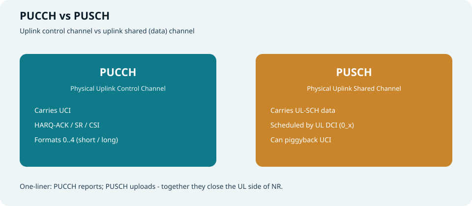
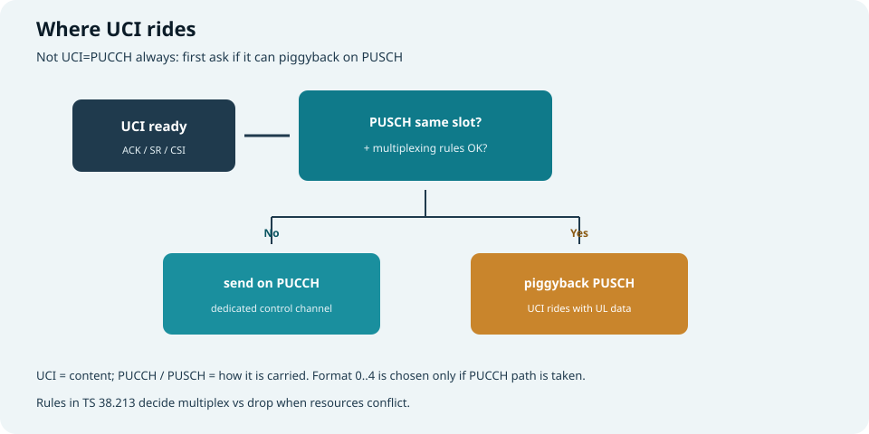
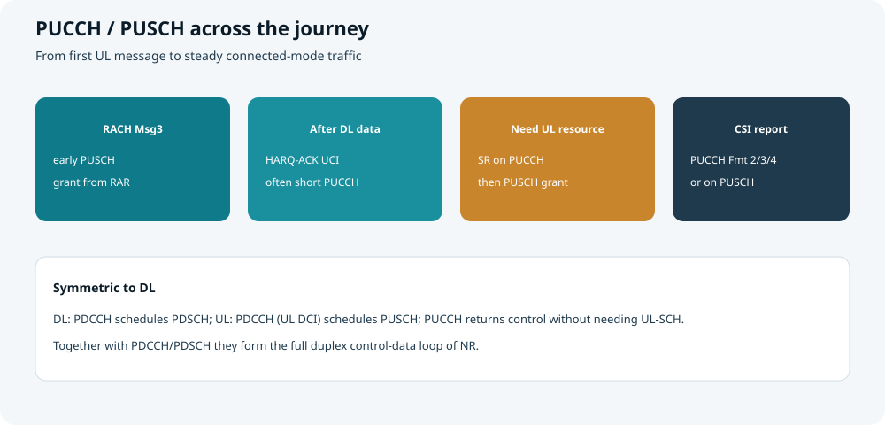
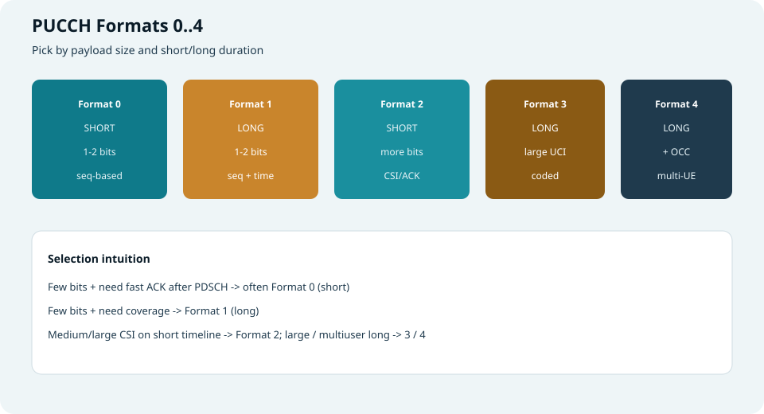
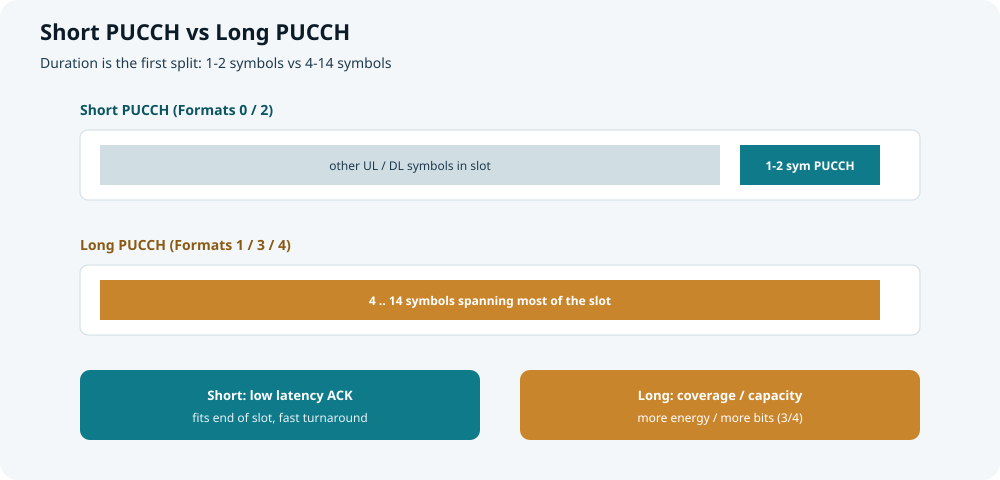
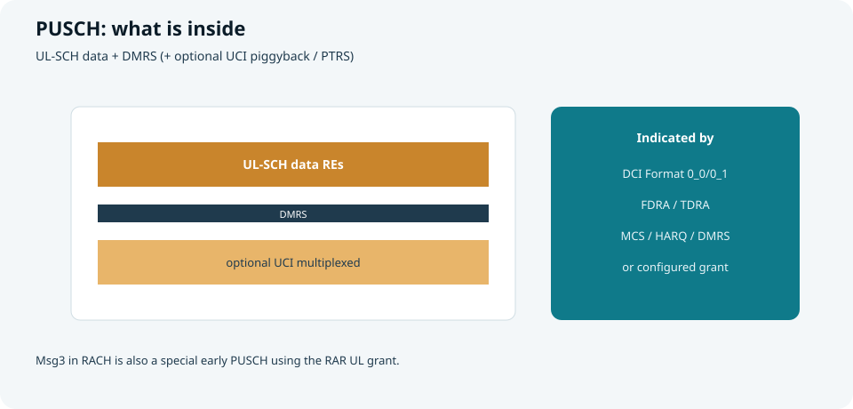

## 本篇要解决什么

下行有 [PDCCH 与 PDSCH](pdcch-pdsch.html)；上行对应的一对是：

| 信道 | 全称 | 一句话 |
| --- | --- | --- |
| **PUCCH** | Physical Uplink Control Channel | 上行**控制**信道，承载 **UCI** |
| **PUSCH** | Physical Uplink Shared Channel | 上行**共享**信道，承载 **UL-SCH 数据**（也可捎带 UCI） |

本篇讲清二者的功能、组成、资源，并**重点展开 short PUCCH vs long PUCCH**。  
对照：**TS 38.211 / 38.213 / 38.214**。  
相关：[DCI 与 UCI](dci-uci.html)、[PDCCH 与 PDSCH](pdcch-pdsch.html)、[随机接入](random-access.html)。



*图：PUCCH 上报控制信息；PUSCH 传上行数据（可复用 UCI）*

---

## 总关系：与下行成对记忆

```text
下行：PDCCH（DCI） ——调度——> PDSCH（数据）
上行：PDCCH 上的 UL DCI ——调度——> PUSCH（数据）
      PUCCH（UCI） <——反馈/请求——  UE（无需 UL-SCH 也能说话）
```

| 需求 | 通常走谁 |
| --- | --- |
| 只有 ACK/SR/CSI，没有上行业务数据 | **PUCCH** |
| 有上行业务 TB | **PUSCH**（由 Format 0_x DCI 或配置授权调度） |
| 同 slot 既有 PUSCH 又有 UCI | 常 **复用进 PUSCH**（piggyback），避免两路冲突 |



*图：有无同 slot PUSCH（且是否允许复用），决定 UCI 走 PUCCH 还是 piggyback*

### 详解：UCI 到底走 PUCCH 还是 piggyback？

一句话：

> **UCI 是“要发的内容”；PUCCH / PUSCH 是“承运方式”。**  
> 不是“UCI = 一定走 PUCCH”，而是先问：**这个时隙里有没有合格的 PUSCH 顺风车可以搭？**

#### 先分清三样东西

| 名称 | 是什么 |
| --- | --- |
| **UCI** | 上报内容：HARQ-ACK / SR / CSI |
| **PUCCH** | 专门发 UCI 的上行控制信道 |
| **PUSCH** | 主要发上行数据；必要时可**顺便带上** UCI |

#### 决策树怎么读

```text
UCI ready（ACK / SR / CSI 已准备好）
        ↓
同 slot 是否有 PUSCH？且 multiplexing rules 是否允许？
        ↓
   No  ─────────────────→  send on PUCCH（单独发）
   Yes ─────────────────→  piggyback PUSCH（搭载发）
```

| 图中节点 | 含义 |
| --- | --- |
| **UCI ready** | 已有控制信息要发（例如刚解完 PDSCH 要回 ACK，或到了 SR/CSI 时机），但还没定走哪条物理信道 |
| **PUSCH same slot? + rules** | 两个条件：① 本 slot 是否本来就要发 PUSCH；② 是否满足 38.213 的复用规则（不是“有 PUSCH 就一定能带”） |
| **send on PUCCH** | 无 PUSCH，或不允许复用 → 用配置好的 PUCCH 资源单独发 |
| **piggyback PUSCH** | 有 PUSCH 且允许 → UCI 打进 PUSCH 资源里与 UL-SCH 一起发 |

#### 为什么要这样设计

1. **省资源、减冲突**：同 slot 又发 PUSCH 又发 PUCCH，时频容易打架，也更耗功率；能合并就合并。  
2. **没数据时仍能说话**：只有 ACK/SR、没有上行业务时，往往**没有** PUSCH，必须靠 **PUCCH**。  
3. **长 PUCCH 更易重叠**：Long PUCCH 占很多符号，更容易与 PUSCH 撞车，规范用“复用进 PUSCH / 或丢弃某类 UCI”来裁决。

#### 两个典型例子

| 例子 | 同 slot 有无 PUSCH | 结果 |
| --- | --- | --- |
| **A. 只回 ACK，没有上行数据** | 无 | **只能走 PUCCH**（常见 short Format 0） |
| **B. 本 slot 已有 UL grant 发 PUSCH，同时又要回 ACK** | 有，且允许复用 | ACK **piggyback 进 PUSCH**，不一定再单独发 PUCCH |

#### 和 short / long PUCCH 的关系

- **本决策**只回答：走不走 PUCCH。  
- 若走 PUCCH，再选 **short（Format 0/2）还是 long（1/3/4）**——那是下一层（时延 vs 覆盖/比特），见下文。

> 口诀：**有合格的同 slot PUSCH → UCI 常搭便车；没有或不允许 → UCI 走专用 PUCCH。**

---

## 在接入与后续传输中的位置



*图：Msg3、ACK、SR、CSI —— PUCCH/PUSCH 贯穿始终*

| 阶段 | 上行信道 | 作用 |
| --- | --- | --- |
| **RACH Msg3** | **PUSCH**（RAR UL grant） | 第一次调度上行，送 RRC/身份相关消息 |
| 连接后下行数据 | **PUCCH**（或 PUSCH 捎带） | **HARQ-ACK**，闭环重传 |
| 有上行数据但无 grant | **PUCCH 上的 SR** | 向网络“要号” |
| 链路自适应 / 波束 | **PUCCH 或 PUSCH 上的 CSI** | 上报 CQI/PMI/RI… |
| 稳态业务 | **PUSCH** | 持续 UL-SCH；必要时捎带 UCI |

> 没有 PUCCH，网络很难及时拿到 ACK/SR/CSI；没有 PUSCH，上行用户面无法规模化传输。  
> Msg3 证明：**PUSCH 在“正式 Connected 调度”之前就已登场。**

---

## PUCCH 详解

### 功能

PUCCH 专门运送 **UCI（Uplink Control Information）**：

| UCI | 含义 | 对网络的价值 |
| --- | --- | --- |
| **HARQ-ACK** | 对 PDSCH 的 ACK/NACK | 决定重传 |
| **SR** | Scheduling Request | 触发 UL grant |
| **CSI** | 信道/波束报告 | MCS、MIMO、波束决策 |

资源通常来自 RRC 的 `PUCCH-Config`（资源集、格式、周期等），再由 DCI 中的 **PUCCH resource indicator** 等在集合内选具体资源。

### Format 总览（0～4）



*图：按载荷与 short/long 选型*

| Format | 时长类别 | 典型载荷直觉 | 波形/结构直觉 |
| --- | --- | --- | --- |
| **0** | **Short** | 1～2 bit（ACK/SR） | 序列类，无显式 DMRS 分离（靠序列检测） |
| **1** | **Long** | 1～2 bit | 序列 + 时域扩展；可有 DMRS 符号 |
| **2** | **Short** | 中等比特（ACK+CSI 等） | 编码后映射；带 DMRS |
| **3** | **Long** | 较大 UCI | 编码；可频域跳频；带 DMRS |
| **4** | **Long** | 较大 UCI + 多用户 | 在 Format 3 思路上加 **OCC** 码分复用 |

---

## 重点：Short PUCCH vs Long PUCCH

这是学 PUCCH 时最该先建立的坐标轴：**先看时长，再看载荷。**



*图：短 PUCCH 常贴在时隙尾部 1～2 符号；长 PUCCH 可占 4～14 符号*

### 定义与对应 Format

| | **Short PUCCH** | **Long PUCCH** |
| --- | --- | --- |
| **符号数** | 通常 **1 或 2** 个 OFDM 符号 | 通常 **4～14** 个符号 |
| **对应 Format** | **0、2** | **1、3、4** |
| **在 slot 中位置** | 常见于 **slot 末尾**（也可按配置放其它位置） | 可横跨 slot 内大段上行符号 |
| **设计重心** | **低时延**、快速反馈 | **覆盖、容量、多比特可靠性** |

### 为什么要短？

1. **ACK 时延**  
   PDSCH 收完后，希望尽快在同一或很近的时机回 HARQ-ACK。短 PUCCH 只占 1～2 符号，容易塞进 slot 尾部，支撑更小的 **K1** 反馈时序。
2. **与灵活 TDD / 自包含 slot 思想契合**  
   “前面下行、尾巴上行控制”的结构里，短 PUCCH 是自然选择。
3. **开销小**  
   对偶尔 1～2 bit 的 ACK/SR，不必占用大半个 slot。

**Format 0（短、少比特）**  
- 适合：ACK、SR、或极短组合  
- 检测偏“序列相关”，实现轻、时延友好  
- 覆盖与抗干扰相对不如长格式“砸时间换能量”

**Format 2（短、中等比特）**  
- 适合：需要在短时域里送更多 UCI（如部分 CSI + ACK）  
- 有 DMRS，走“编码 + 相干解调”路径  
- 仍受 1～2 符号限制：载荷上去后，覆盖/可靠性要靠功控、码率、资源块数折中

### 为什么要长？

1. **覆盖**  
   更多符号 = 更长发射时间 = 同等功率下可积累更多能量，小区边缘更友好。  
   **Format 1** 就是“只要 1～2 bit，但要传得远”时的长答案（相对 Format 0）。
2. **大载荷 CSI**  
   周期/半持续 CSI 往往比特不少，**Format 3/4** 用更长时域承载编码后的 UCI。
3. **频域跳频与多符号结构**  
   长 PUCCH 可在 slot 内做 **频域跳频**，换频率分集；时域上也可安排 DMRS 与 UCI 符号交错。
4. **多用户复用（Format 4）**  
   通过 **OCC（正交覆盖码）** 让多个 UE 共享相似时频资源，提高控制信道容量。

### 对照总表（选型直觉）

| 场景 | 更倾向 |
| --- | --- |
| 近点用户、要尽快 ACK | **Short：Format 0** |
| 远点用户、仍是 1～2 bit ACK/SR | **Long：Format 1** |
| 短时域内要报一定 CSI | **Short：Format 2** |
| 大 CSI / 多比特 UCI、要覆盖 | **Long：Format 3** |
| 控制资源紧张、多 UE 复用 | **Long：Format 4** |

### 其它差异维度（扩展）

| 维度 | Short | Long |
| --- | --- | --- |
| **时延** | 优 | 反馈机会可能更“重”、更占 slot |
| **覆盖** | 相对弱 | 相对强 |
| **载荷** | 0 很小；2 中等但仍受短时域限制 | 1 很小；3/4 可更大 |
| **DMRS** | 0 基本靠序列；2 有 DMRS | 1/3/4 有明确时域结构与 DMRS 安排 |
| **跳频** | 能力受 1～2 符号约束 | 更易做 intra-slot 跳频 |
| **与 PUSCH 冲突** | 同 slot 有 PUSCH 时，常优先考虑复用/丢弃规则（38.213） | 同理，长 PUCCH 更容易与 PUSCH 时域重叠，需规范复用决策 |

> 口诀：**短的拼时延，长的拼覆盖和比特；0/2 是短，1/3/4 是长。**

### 资源占用（PUCCH 侧）

| 要素 | 含义 |
| --- | --- |
| **起始符号 / 符号数** | 短=1～2；长=4～14（具体由资源配置） |
| **PRB** | 频域占用的 RB（Format 与载荷影响需要的 RB 数） |
| **初始循环移位 / OCC 等** | 码域分离（尤其 0/1/4） |
| **周期与 offset** | 周期 CSI/SR 资源 |
| **PUCCH resource set** | DCI 指示在集合中选哪条资源 |

功率控制：开环 + 闭环 TPC（可由 DCI 携带），目标是让 gNB 侧可靠解 UCI，又不过度抬干扰。

---

## PUSCH 详解

### 功能

PUSCH 是上行**共享数据**主通道：

| 功能 | 说明 |
| --- | --- |
| 传 **UL-SCH** | MAC TB：用户面、信令等 |
| **Msg3** | 随机接入中的第一次 PUSCH |
| **捎带 UCI** | 与 UL-SCH 复用时带上 ACK/CSI 等 |
| 配置授权（CG） | 无动态 DCI 时按预先配置发（URLLC/周期业务等） |

动态调度：听 **PDCCH 上 DCI Format 0_0 / 0_1** → 得 UL grant → 发 PUSCH。

### 组成



*图：数据 RE + DMRS；可选 UCI 复用*

| 组成部分 | 作用 |
| --- | --- |
| **UL-SCH 编码比特** | 真正的上行载荷 |
| **CRC / LDPC 等** | 可靠传输与 HARQ |
| **PUSCH DMRS** | 解调参考（端口/类型由 DCI+RRC） |
| **可选 PTRS** | 相位噪声跟踪（尤其高频） |
| **复用的 UCI** | 与数据共享 PUSCH 资源时的控制比特 |
| **加扰、调制、预编码** | 适配 MCS 与 MIMO |

### 资源占用

与 PDSCH 类似，**动态时由 UL DCI 指示**：

| 指示 | 管什么 |
| --- | --- |
| **FDRA** | 频域 RB |
| **TDRA** | 起始符号、长度、**K2**（PDCCH 与 PUSCH 时隙关系） |
| **MCS / NDI / RV / HARQ** | 编码与进程 |
| **DMRS / 天线端口** | 解调与层数 |
| **CSI request** 等 | 是否在本次 PUSCH 上报非周期 CSI |

资源画像：

```text
UL BWP 内
  x DCI/CG 给出的 RB
  x 符号区间（可避开 PUCCH / SRS 等按规则速率匹配）
  + DMRS 图案
  (+ 可选 UCI 打孔或复用)
```

---

## PUCCH vs PUSCH 对照

| 维度 | PUCCH | PUSCH |
| --- | --- | --- |
| 主载荷 | **UCI** | **UL-SCH**（可 +UCI） |
| 谁调度 | 半静态资源 + DCI 指示资源索引等 | **UL DCI** 或配置授权 |
| 时长形态 | **Short / Long** 两大类 Format | 由 TDRA 定符号数（灵活） |
| 有无“专用控制格式族” | Format **0～4** | 无 PUCCH 那种 short/long 命名，但是数据信道 |
| 接入早期 | SR/后续 ACK | **Msg3 就是 PUSCH** |
| 失败影响 | ACK 丢失→多余重传；SR 丢→接入/上行变慢 | 上行吞吐直接受损 |

---

## 与下行专题如何对称

| 下行 | 上行 |
| --- | --- |
| PDCCH | （仍由下行 PDCCH 下 UL grant） |
| PDSCH | **PUSCH** |
| DCI | UCI（部分对偶：调度 vs 反馈） |
| CORESET 里找控制 | PUCCH 资源集里发控制 |

学习顺序建议：

1. [DCI 与 UCI](dci-uci.html) 建立内容视角  
2. [PDCCH 与 PDSCH](pdcch-pdsch.html) 看下行物理落地  
3. **本篇** 看上行物理落地，并吃透 **short/long PUCCH**  
4. [随机接入](random-access.html) 回看 Msg3 = 早期 PUSCH

---

## 快速自测

1. PUCCH 与 PUSCH 各主要运什么？画出 UCI 走 PUCCH 还是 piggyback 的决策树。  
2. Short / Long PUCCH 的符号数范围？各对应哪些 Format？  
3. 为什么 Format 0 与 Format 1 都是少比特，却一个短一个长？  
4. Format 2 与 Format 3 如何体现“短时域中等载荷”vs“长时域大载荷”？  
5. Format 4 相对 3 多了什么能力？  
6. Msg3 用的是 PUCCH 还是 PUSCH？说明了什么？

> 一句话：**PUCCH 是上行的嘴（短的抢时延，长的抢覆盖与比特）；PUSCH 是上行的腿——从 Msg3 到稳态传数，都靠它。**

## 相关专题

- [PDCCH 与 PDSCH](pdcch-pdsch.html)
- [DCI 与 UCI](dci-uci.html)
- [随机接入](random-access.html)
- [CORESET 与 Search Space](coreset-search-space.html)
- [Antenna Port / QCL / Resource Grid](antenna-port-qcl-resource-grid.html)
