## 本篇要解决什么

前面专题把 UE 带到了「**能同步、能读系统消息、知道如何听 PDCCH**」。  
但 Idle/Inactive 的 UE 通常还没有：

- 可用的 **上行定时（Timing Advance）**
- 专属标识 **C-RNTI**
- 一次真正被网络认可的 **上行发送机会**

**随机接入（Random Access, RACH）** 就是补齐这些缺口，完成从“听得见网络”到“能被网络点名调度”的关键一跃。

对照：**TS 38.213**（过程）、**38.321**（MAC）、**38.331**（RRC 配置）、**38.211**（PRACH 信号）。  
强相关前置：[小区搜索](cell-search.html)、[5G SIBs](5g-sibs.html)、[CORESET 与 Search Space](coreset-search-space.html)、[DCI 与 UCI](dci-uci.html)。

---

## 总览：从开机到连接的接入全流程

先把 **RACH 嵌在整条接入链**里看清楚，后面再下钻 Msg1～Msg4、preamble format、RA-RNTI。

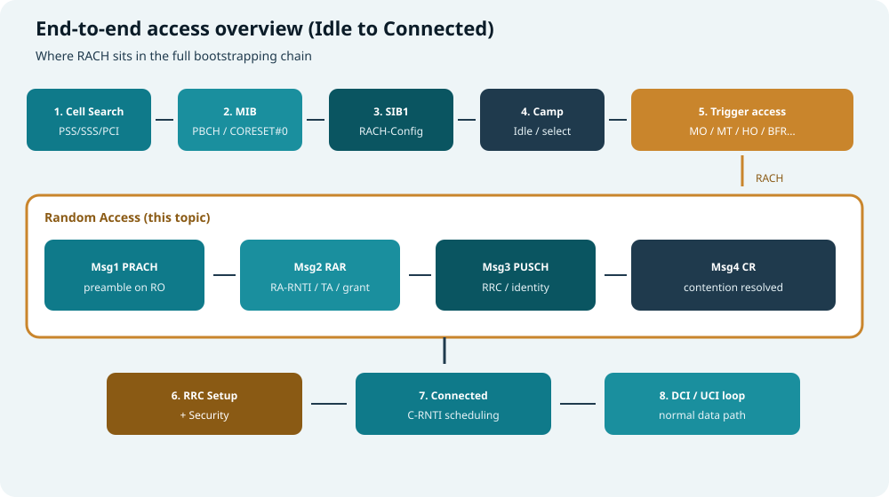

*图：小区搜索 → MIB/SIB1 → 驻留 → 触发 → 四步 RACH → RRC/安全 → Connected（DCI/UCI）*

| 阶段 | 做什么 | 本站相关专题 |
| --- | --- | --- |
| 1–2 | 同步 + 读 MIB，打开 CORESET#0 | [小区搜索](cell-search.html) |
| 3–4 | 读 SIB1（含 RACH 配置）并驻留 | [5G SIBs](5g-sibs.html) |
| 5–Msg4 | **随机接入**（本篇） | 下文 |
| 6–8 | RRC 建立/安全后进入调度闭环 | [DCI 与 UCI](dci-uci.html) |

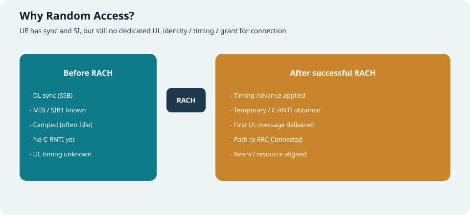

*图：RACH 之前有同步与 SI；之后才有 TA、标识与连接路径*

### 配置读入路径（进入 Msg1 之前）

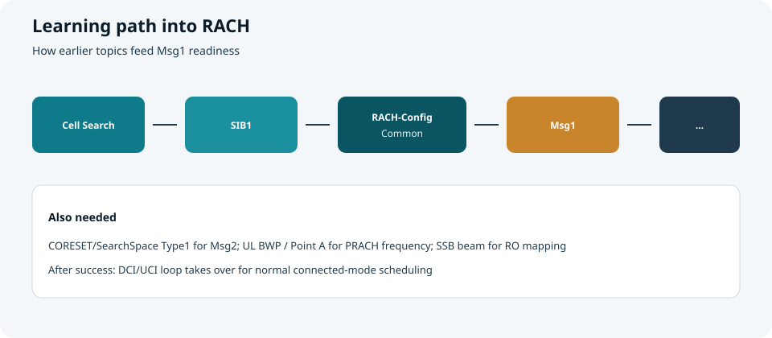

*图：Cell Search → SIB1 → RACH-ConfigCommon → Msg1…*

```text
Cell Search / PBCH(MIB)
        ↓
   CORESET#0 → SIB1
        ↓
 servingCellConfigCommon / initial UL BWP
        ↓
   RACH-ConfigCommon (+ optional Dedicated)
        ↓
 选 SSB 波束 → 选 RO / preamble → Msg1...
        ↓
 成功后进入 Connected 调度闭环（DCI/UCI）
```

---

## 何时发起随机接入

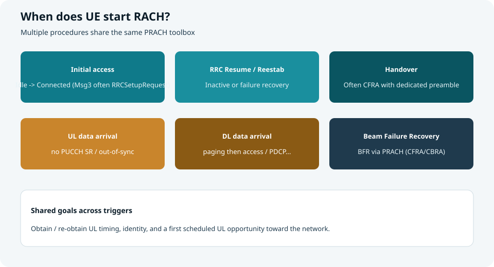

*图：多种过程共用同一套 PRACH 工具箱*

| 触发 | 典型目的 | 常见类型 |
| --- | --- | --- |
| **初始接入** | Idle → Connected（如注册、起呼） | 多 **CBRA** |
| **RRC Resume** | Inactive 恢复 | CBRA / 视配置 |
| **RRC Reestablishment** | 连接失败后重建 | CBRA |
| **切换（HO）** | 接入目标小区 | 常 **CFRA**（专用前导） |
| **上行数据到达** | 无 SR 资源 / 失步等 | CBRA |
| **下行数据到达** | 寻呼后接入等 | CBRA |
| **波束失败恢复（BFR）** | 换到新波束继续连接 | CFRA 优先，否则 CBRA |

> 场景不同，**Msg3/MsgA 里装的 RRC/MAC 内容**不同，但底层 PRACH → RAR →（竞争解决）骨架高度相似。

---

## CBRA 与 CFRA：先分清竞争

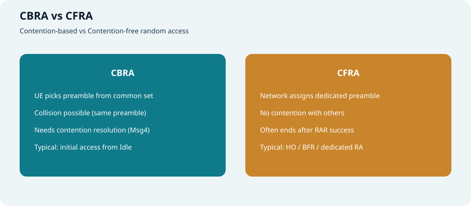

*图：公共前导可能撞车；专用前导避免竞争*

| | **CBRA**（Contention-Based） | **CFRA**（Contention-Free） |
| --- | --- | --- |
| 前导来源 | UE 从 **公共集合**随机选 | 网络 **指定**专用 preamble / RO |
| 冲突 | 可能多人同选同一 preamble | 基本无竞争 |
| 是否需要 Msg4 竞争解决 | **通常需要** | **通常不需要**（RAR 成功即可推进） |
| 典型场景 | 初始接入 | HO、BFR、网络触发的专用接入 |

本篇以 **四步 CBRA** 为主线讲透；CFRA 可理解为“砍掉竞争解决支路的专用版本”。

---

## 四步随机接入总览（重中之重）

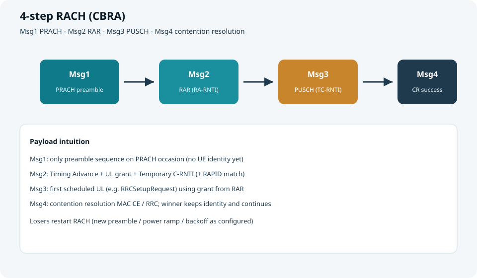

*图：Msg1 → Msg2 → Msg3 → Msg4*

| 消息 | 方向 | 信道 | 核心产物 |
| --- | --- | --- | --- |
| **Msg1** | UE → gNB | **PRACH** | 前导被检测到；隐含波束/RO 信息 |
| **Msg2** | gNB → UE | PDCCH(RA-RNTI) + PDSCH | **TA、UL grant、Temporary C-RNTI** |
| **Msg3** | UE → gNB | **PUSCH**（用 RAR grant） | 首个“有身份语义”的 UL 载荷 |
| **Msg4** | gNB → UE | PDCCH(TC-RNTI/C-RNTI) + PDSCH | **竞争解决**；胜出 UE 继续流程 |

下面按消息拆开。

---

## Msg1：PRACH 前导

### UE 在发什么？

Msg1 **不是** RRC 文本，而是一条 **前导序列（preamble）**：

- 由 **根序列 + 循环移位** 生成（规范定义 64 个 preamble 索引的常见池）
- 落在某个 **RACH Occasion（RO）** 的时频资源上
- 使用特定 **PRACH format**（决定序列长度、CP、占用符号/子帧结构等）

此时 UE **还没有 C-RNTI**；网络只能看到“某 RO 上出现了某 preamble”。

### Preamble Format：长序列 vs 短序列

NR 相对 LTE 的一大变化是：**PRACH 前导格式更多**，并用不同序列长度适配大小区 / 小区与 FR2。

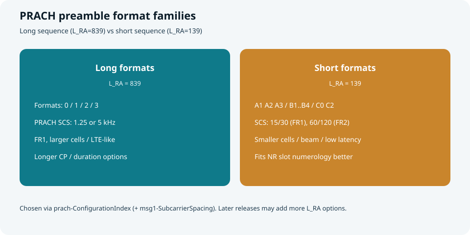

*图：L_RA=839 长格式 vs L_RA=139 短格式*

对照 **TS 38.211 §6.3.3**（数值以规范表为准；下表抓“选型直觉”）。

#### 长序列格式（\(L_{RA}=839\)）

- **PRACH SCS**：1.25 kHz 或 5 kHz  
- **主要用于 FR1**、较大覆盖  
- 与 LTE 前导“亲戚关系”更近

| Format | 序列长度 | 典型 SCS | 时长/结构直觉 | 适用直觉 |
| --- | --- | --- | --- | --- |
| **0** | 839 | 1.25 kHz | 约 1 ms 量级，经典“长前导” | 中大覆盖，最常见入门格式之一 |
| **1** | 839 | 1.25 kHz | 更长（更大 CP/占用） | 更大小区半径、更大定时不确定性 |
| **2** | 839 | 1.25 kHz | 重复更多 | 覆盖/检测进一步加强 |
| **3** | 839 | **5 kHz** | 相对 0/1/2 的 5 kHz 变体 | 仍要长序列，但 SCS 更高 |

> **CP / 保护间隔越“慷慨”**，越能容忍更大传播时延差（更大小区）与定时误差；代价是 **时域开销更大、RO 更“重”**。

#### 短序列格式（\(L_{RA}=139\)）

- **PRACH SCS**：FR1 常见 **15/30 kHz**；FR2 常见 **60/120 kHz**  
- 前导 OFDM 符号时长与数据 numerology 更对齐  
- 更适合 **小小区、室内、波束场景、低时延**

| Format | 序列长度 | 结构直觉 | 适用直觉 |
| --- | --- | --- | --- |
| **A1** | 139 | 较短占用 | 很小小区 / 低开销 |
| **A2** | 139 | 中等 | 一般小小区 |
| **A3** | 139 | 更长 | 稍大覆盖或更强检测 |
| **B1** | 139 | 与 A 系不同的符号/空隙组合 | 小小区，另一种时域拼法 |
| **B2** | 139 | 中等 | 同上扩展 |
| **B3** | 139 | 更长 | 同上扩展 |
| **B4** | 139 | 最长一档（B 系） | 需要更长短前导时 |
| **C0** | 139 | 紧凑型 | 强调短时延/紧凑 RO |
| **C2** | 139 | 相对 C0 更长 | 短格式里偏覆盖的一端 |

> A/B/C 的差别，本质是 **占用几个 PRACH 符号、如何拼 CP/间隔、一次 occasion 里怎么铺**——选错会直接导致 **覆盖不够** 或 **空口浪费**。

#### 扩展理解：为什么要这么多分档？

| 设计维度 | Format 在解决什么 |
| --- | --- |
| **小区半径** | 更大半径 → 更大最大往返时延 → 需要更长 CP / 更长前导 |
| **Numerology** | 短格式 SCS 与 slot 对齐，方便 FR2 与多波束 RO 密度 |
| **检测鲁棒性** | 重复/更长序列 → 更好检测，但更占资源 |
| **高速 / 多普勒** | 与 **restricted set**、\(N_{CS}\)（零相关区）配置联动（`zeroCorrelationZoneConfig`） |
| **与数据共存** | 短格式更易嵌进 NR slot 结构，减少“LTE 式长空洞” |

**和配置的关系：**

- `prach-ConfigurationIndex` → 查 38.211 表，得到 **用哪个 format、哪些帧/子帧/符号有 RO**  
- `msg1-SubcarrierSpacing` → 短格式场景下明确 Msg1 SCS（长格式 SCS 由 format 隐含 1.25/5 kHz）  
- `restrictedSetConfig` + `zeroCorrelationZoneConfig` → 影响可用循环移位集合（高速小区常用受限集）

> 实操口诀：**先看 FR1/FR2 与覆盖目标 → 长 839 还是短 139 → 再落到具体 format 与 ConfigurationIndex。**

### 选波束、选 RO、选 preamble

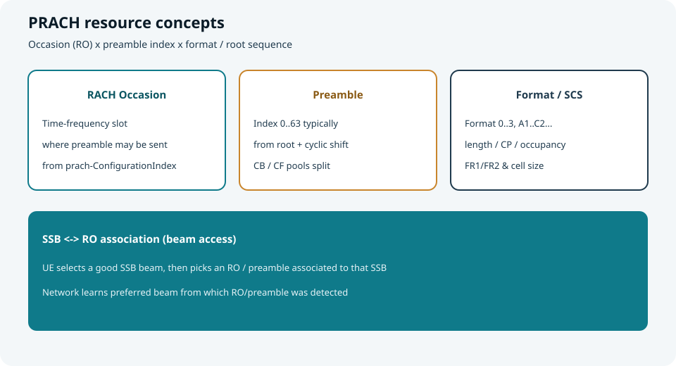

*图：RO × preamble × format；并与 SSB 波束关联*

**推荐读法（初始接入）：**

1. 在同步到的 SSB 中，选一个 **质量够好** 的波束（SS-RSRP 等）  
2. 根据 SIB1 中的 **SSB–RO 映射**，找到对应该 SSB 的 RACH 机会  
3. 在允许的 preamble 集合中随机选一个（CBRA）  
4. 按开环功率公式计算初始发射功率，在对应 RO 发送

> 工程直觉：UE 用“选哪个 SSB 关联的 RO/前导”告诉 gNB **更喜欢哪根波束**。

### 关键配置从哪里来？（SIB1 / initial UL BWP）

常见 IE 路径直觉（名称随版本略有差异）：

`SIB1 → servingCellConfigCommon → uplinkConfigCommon → initialUplinkBWP → rach-ConfigCommon`

| 配置项（直觉名） | 含义 | 作用 |
| --- | --- | --- |
| **prach-ConfigurationIndex** | PRACH 配置索引 | 查表得到 RO 的时域图案/格式相关 |
| **msg1-FrequencyStart** 等 | PRACH 频域起点 | 定 Msg1 落在哪段上行频谱 |
| **msg1-SubcarrierSpacing** | PRACH SCS | 与数据 SCS 可不同 |
| **restrictedSetConfig** | 高速受限集等 | 影响可用循环移位集合 |
| **totalNumberOfRA-Preambles** | 可用前导总数 | 划定池大小 |
| **ssb-perRACH-OccasionAndCB-PreamblesPerSSB** | SSB 与 RO、每 SSB 竞争前导数 | **波束接入映射核心** |
| **ra-ResponseWindow** | Msg2 监听窗 | 等多久 RAR |
| **preambleReceivedTargetPower** | 目标接收功率 | 开环功率基准 |
| **powerRampingStep** | 功率攀升步进 | 失败重试抬功率 |
| **preambleTransMax** | 最大前导发送次数 | 超过则上层失败 |
| **ra-ContentionResolutionTimer** | 竞争解决定时器 | Msg3 后等多久 Msg4 |
| **rsrp-ThresholdSSB** 等 | SSB 门限 | 选波束/是否换策略 |

CFRA / HO / BFR 还会有 **RACH-ConfigDedicated**（专用 preamble、专用 RO 等）。

### 开环功率（概念式）

```text
P_PRACH ≈ min( PCMAX,
               preambleReceivedTargetPower
               + PL_estimate
               + (preamble_attempt - 1) * powerRampingStep
               + 其它偏移 )
```

要点：

- **路损**常用下行 SSB/CSI-RS 估计  
- 每次失败重试可按步进 **抬功率**  
- 受 **PCMAX** 与小区参数约束

---

## Msg2：随机接入响应（RAR）

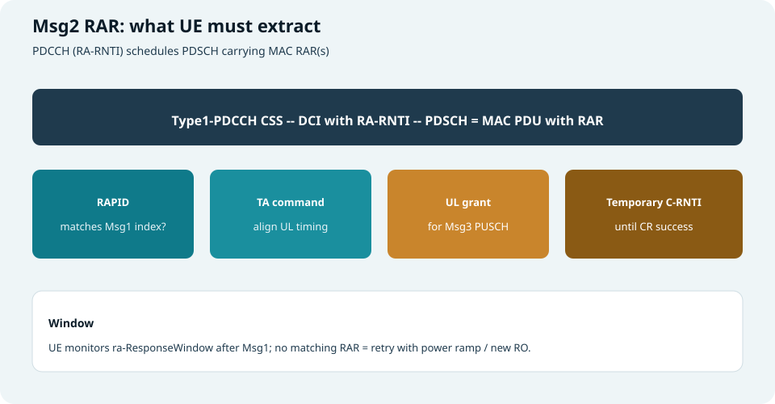

*图：RA-RNTI 调度的 PDSCH 里装 MAC RAR*

### UE 怎么找 Msg2？

1. Msg1 发送后，启动 **ra-ResponseWindow**  
2. 在 **Type1-PDCCH 公共搜索空间** 上，用 **RA-RNTI** 盲检 DCI  
3. 按 DCI 指示解 **PDSCH**，得到 MAC PDU（可含多条 RAR）  
4. 在 RAR 中找 **RAPID = 自己 Msg1 preamble index** 的条目

### RA-RNTI 计算公式（必懂）

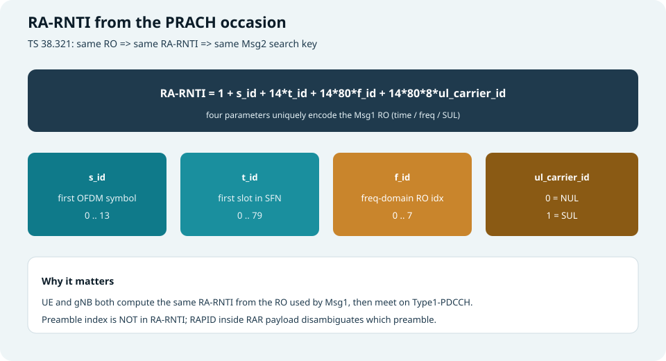

*图：由 RO 的符号/时隙/频域/载波类型算出监听 Msg2 的 RNTI*

UE 与 gNB **各自独立计算**同一个值（见 **TS 38.321 §5.1.3**）：

\[
\textbf{RA-RNTI} = 1 + s_{id} + 14\cdot t_{id} + 14\cdot 80\cdot f_{id} + 14\cdot 80\cdot 8\cdot ul\_carrier\_id
\]

| 参数 | 范围 | 含义 |
| --- | --- | --- |
| **\(s_{id}\)** | 0…13 | 该 PRACH occasion **第一个 OFDM 符号**索引 |
| **\(t_{id}\)** | 0…79 | 该 occasion **第一个 slot** 在系统帧内的索引 |
| **\(f_{id}\)** | 0…7 | 该 occasion 的 **频域索引**（同一时刻可有多个频域 RO） |
| **\(ul\_carrier\_id\)** | 0 或 1 | **0 = NUL**（普通上行载波），**1 = SUL** |

**展开理解：**

1. **RA-RNTI 编码的是“RO 地址”，不是 preamble 编号**  
   - 同一 RO、不同 preamble 的 UE → **同一个 RA-RNTI**  
   - 真正区分 preamble 靠 RAR 里的 **RAPID**
2. **系数 14 / 80 / 8 来自各维取值上界**  
   - 14 个符号索引、最多 80 个 slot/帧（高 SCS 下 slot 更密）、最多 8 个频域 RO 索引，再乘 SUL 维  
   - 这样不同 \((s,t,f,ul)\) 组合映射到不冲突的 RA-RNTI 数值空间
3. **和 Type1-PDCCH 的关系**  
   - UE 在 `ra-ResponseWindow` 内，用算出的 RA-RNTI 去解 DCI Format 1_0（CRC 加扰）  
   - 找不到匹配 DCI/PDSCH → 本次 Msg1 失败，进入重试
4. **和竞争的关系**  
   - 撞 RO（同 \(s,t,f,ul\)）的人听同一 Msg2“频道”  
   - 若再撞同一 preamble，就会走向 Msg3/Msg4 竞争解决

**数值例子（示意）：**

```text
s_id = 0, t_id = 1, f_id = 0, ul_carrier_id = 0
RA-RNTI = 1 + 0 + 14*1 + 14*80*0 + 14*80*8*0
        = 1 + 14
        = 15
```

再如频域第二个 RO（`f_id=1`，其余同上）：

```text
RA-RNTI = 1 + 0 + 14*1 + 14*80*1 = 15 + 1120 = 1135
```

> 排障时：日志里的 RO 时频位置 ↔ 手算 RA-RNTI ↔ 窗内盲检是否用对 RNTI，三者必须一致。

#### 两步接入的 MsgB-RNTI（对照）

2-step 监听 MsgB 时使用 **MsgB-RNTI**（同属 38.321 定义），形式与 RA-RNTI 类似，但在取值上与四步 RA-RNTI **错开一段偏移**（避免与四步 Msg2 监听混淆）。  
学习顺序建议：先把上面四步公式算熟，再查规范确认 MsgB 的精确偏移项。

### RAR 里有什么？（逐项）

| 字段 | 含义 | 作用 |
| --- | --- | --- |
| **RAPID** | Random Access Preamble ID | 确认“这是对哪个前导的响应” |
| **Timing Advance Command** | 定时提前量 | UE 调整上行发射时刻，对齐 gNB 接收窗 |
| **UL Grant** | 上行授权 | **Msg3 的时频/MCS 等**（紧凑 grant） |
| **Temporary C-RNTI** | 临时 C-RNTI | Msg3/Msg4 阶段的临时身份；竞争成功后可变为 C-RNTI |

若窗内 **没有** 匹配 RAPID 的 RAR：视为本次失败 → 退避/攀升功率/重选资源再发 Msg1（受 `preambleTransMax` 限制）。

### Backoff Indicator（BI）

MAC RAR 子头中可能携带 **BI**：指示 UE 在重试前随机退避一段时间，减轻拥塞。

---

## Msg3：第一次真正的“上行消息”

### 发什么？

UE 使用 RAR 中的 **UL grant**，在 **PUSCH** 上发送 Msg3。内容取决于触发原因，例如：

| 场景 | Msg3 常见载荷直觉 |
| --- | --- |
| 初始接入 | **RRCSetupRequest**（或相关 CCCH 消息） |
| Resume | **RRCResumeRequest** 等 |
| Reestablishment | **RRCReestablishmentRequest** 等 |
| 其它 | 可能含 C-RNTI MAC CE 等（已有标识时） |

此时 CRC/加扰侧使用 **Temporary C-RNTI**（过程细节见 MAC/PHY 规范）。

### 为什么 Msg3 关键？

- 它第一次把 **UE 身份相关信息**（或足够区分的内容）送到网络  
- 若两人撞了同一 preamble，可能都认为 RAR 是给自己的，于是 **都发 Msg3** → 需要 Msg4 裁决  
- Msg3 还可携带足够信息让网络建立/恢复上下文

Msg3 也可按 HARQ 重传（网络用 TC-RNTI 调度重传）。

---

## Msg4：竞争解决（Contention Resolution）

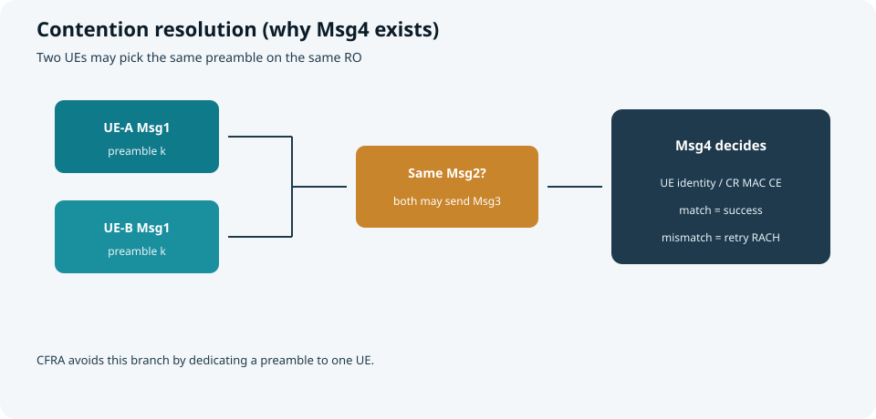

*图：同 preamble 冲突时，Msg4 决定谁留下*

### 冲突如何发生？

1. UE-A 与 UE-B 在同一 RO 选择 **同一 preamble k**  
2. gNB 可能只检测为一个前导，回一条 RAR（RAPID=k）  
3. A、B 都认为自己成功，都用同一 grant / TC-RNTI 语义发 Msg3  
4. 网络通常只能正确解码其中一侧（或按实现处理），在 Msg4 中回 **胜出方身份**

### UE 如何判断自己赢了？

在 **ra-ContentionResolutionTimer** 内监控 Msg4：

- 收到与自身 Msg3 中 UE 标识匹配的 **竞争解决成功**（如 Contention Resolution MAC CE / 对应 RRC）→ **成功**  
- 定时器超时或明确不匹配 → **失败**，回到 Msg1 重试

成功后：

- Temporary C-RNTI 可提升为 **C-RNTI**（视过程）  
- 继续后续 RRC（如 **RRCSetup / Security / RRCReconfiguration**）进入稳定连接

> CFRA 因 preamble 专用，通常 **不走这套竞争裁决**。

---

## 两步随机接入（MsgA / MsgB）

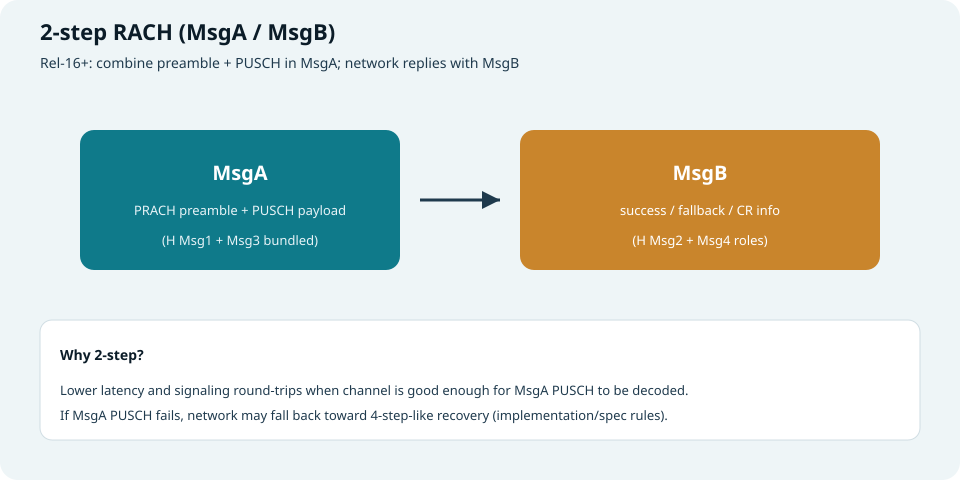

*图：MsgA ≈ Msg1+Msg3；MsgB ≈ Msg2+Msg4 角色合并*

Rel-16 引入 **2-step RACH**，目标是降时延、减信令往返：

| 消息 | 内容直觉 |
| --- | --- |
| **MsgA** | **PRACH 前导 + PUSCH 载荷**（把身份/请求提前发出） |
| **MsgB** | 成功响应 / 回退指示 / 竞争解决相关信息等 |

要点：

- 需要网络配置 **MsgA 的 PUSCH 资源** 与关联关系  
- 信道较好时收益大；MsgA PUSCH 解失败时，可能 **回退到类四步流程**  
- 监听可用 **MsgB-RNTI** 等（与 Type1 搜索空间配置相关）

学习建议：先把四步吃透，再把两步看成“把 Msg1/3 合并上行、把 Msg2/4 合并下行”的优化形态。

---

## 失败、重试与功率攀升

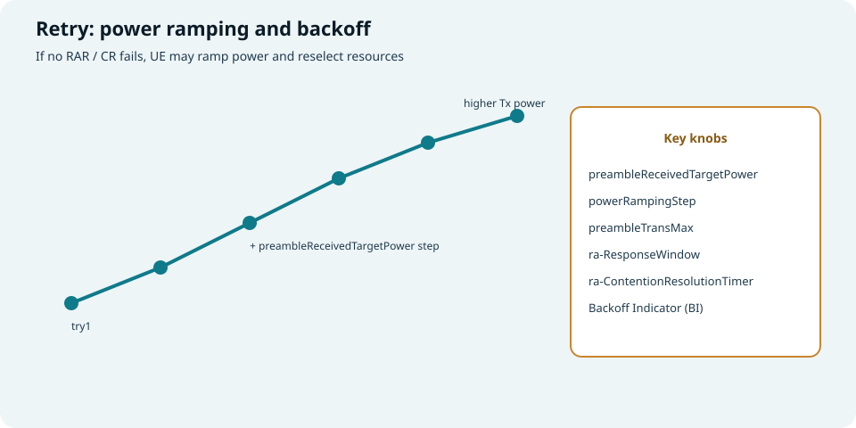

*图：多次尝试逐步抬高发射功率*

### 常见失败点

| 阶段 | 失败表现 | UE 典型动作 |
| --- | --- | --- |
| Msg1→Msg2 | 窗内无匹配 RAR | 退避、抬功率、换 preamble/RO/波束，重发 Msg1 |
| Msg3→Msg4 | 竞争解决失败/超时 | 视为竞争失败，重新发起 RACH |
| 次数用尽 | 达到 **preambleTransMax** | 向 RRC 报告失败（接入失败/切换失败等） |

### 必须记住的定时器/计数器

| 名称 | 管什么 |
| --- | --- |
| **ra-ResponseWindow** | Msg1 后等多久 Msg2 |
| **ra-ContentionResolutionTimer** | Msg3 后等多久 Msg4 |
| **preambleTransMax** | Msg1 最多发几次 |
| **BI** | 重试前随机等待，缓解拥堵 |
| **powerRampingStep** | 每次抬多少功率 |

---

## 与 PDCCH / DCI 的接口（串起来）

| RACH 步骤 | 控制面接口 |
| --- | --- |
| Msg2 | **Type1-PDCCH CSS**，CRC 用 **RA-RNTI**（见 [CORESET 与 Search Space](coreset-search-space.html)） |
| Msg3 重传 / Msg4 | 常用 **Temporary C-RNTI**（及后续 C-RNTI）调度 |
| 成功后 | 进入常规 **DCI/UCI** 闭环（见 [DCI 与 UCI](dci-uci.html)） |

RAR UL grant、Msg3 PUSCH 的具体比特字段在 **38.213 / 38.212 / 38.321** 中定义；学习时先抓住：**Msg2 给你 TA + 第一张 UL 门票**。

---

## 专用场景补充

### 切换中的 CFRA

- 源侧/目标侧在 HO 命令里下发 **dedicated RACH**（preamble、有时含 RO）  
- UE 在目标小区发专用 Msg1，快速获得 TA 与上行，缩短中断  
- 若专用资源失效/失败，可回退 CBRA

### 波束失败恢复（BFR）

- 连接态检测波束失败后，UE 对候选波束发起 PRACH  
- 优先用网络配置的 **BFR 专用资源（CFRA）**  
- 成功则恢复 PDCCH 波束假设，继续数据

### 大覆盖 / 高速

- PRACH **format**、受限集、根序列规划影响覆盖与抗多普勒能力  
- 小区规划与 `prach-ConfigurationIndex`、根序列逻辑索引强相关

---

## 一张“排障清单”（读日志时用）

按顺序问：

1. **SIB1 / rach-ConfigCommon 是否读全？** RO、前导池、窗长是否合理  
2. **SSB 选得对不对？** RSRP 是否过门限；SSB–RO 映射是否匹配  
3. **Msg1 功率是否过低？** 是否已攀升；是否触达 PCMAX 仍无 RAR  
4. **RA-RNTI / RAPID 是否匹配？** 窗内是否听到别人的 RAR  
5. **Msg3 是否发出 / 被重传？** grant 解析是否正确  
6. **Msg4 是否匹配 UE 标识？** 是否总在竞争中落败（拥堵）  
7. **是否其实该走 CFRA？** HO/BFR 专用资源是否过期

---

## 端到端故事（初始接入浓缩）

```text
1) 选强 SSB，映射到 RO，随机选 preamble k，按开环功率发 Msg1
2) 计算 RA-RNTI，在 ra-ResponseWindow 内听 Type1-PDCCH
3) 解 RAR：RAPID=k → 应用 TA，保存 TC-RNTI，拿 UL grant
4) 在 grant 上发 Msg3 = RRCSetupRequest（例）
5) 听 Msg4：竞争解决成功 → 得 C-RNTI 路径，收 RRCSetup
6) 回 RRCSetupComplete，进入后续安全与配置
```

两步版则把 1)+4) 合成 MsgA，把 2)+3)+5) 的角色更多地放进 MsgB。

---

## 快速自测

1. 画出从 Cell Search 到 Connected 的总流程，标出 RACH 卡在哪一段。  
2. CBRA 与 CFRA 的本质差别是什么？为何 CBRA 需要 Msg4？  
3. \(L_{RA}=839\) 与 \(139\) 分别典型用在什么场景？Format 0 与 A1 差在哪类问题上？  
4. RA-RNTI 公式里 \(s_{id}, t_{id}, f_{id}, ul\_carrier\_id\) 各代表什么？为什么 **不含** preamble index？  
5. 同一 RO 两用户不同 preamble，Msg2 监听的 RA-RNTI 是否相同？靠什么区分？  
6. `ra-ResponseWindow` 与 `ra-ContentionResolutionTimer` 各守哪一段？  
7. 2-step 相对 4-step 优化了什么？何时可能回退？

> 一句话：**随机接入用 PRACH 敲门，用 RAR 对时并发卡，用 Msg3 自报家门，用 Msg4 确认谁留下——这是 5G 接入的重中之重。**

## 延伸阅读（推荐学习站）

系统对照图示与配置例，强烈推荐 ShareTechnote 的 5G RACH 专页（与 38.211/38.321 表格、ConfigurationIndex 例结合看，收获最大）：

- [ShareTechnote — 5G RACH](https://www.sharetechnote.com/html/5G/5G_RACH.html)

建议阅读顺序：本页建立主线 → ShareTechnote 核对 preamble format / RO 表与例题 → 回规范抓精确比特与边界条件。

## 相关专题

- [小区搜索](cell-search.html)
- [5G SIBs](5g-sibs.html)
- [CORESET 与 Search Space](coreset-search-space.html)
- [DCI 与 UCI](dci-uci.html)
- [帧结构与 SS/PBCH Block](frame-structure-ssb.html)
- [SSB Cases](ssb-cases-positions.html)
