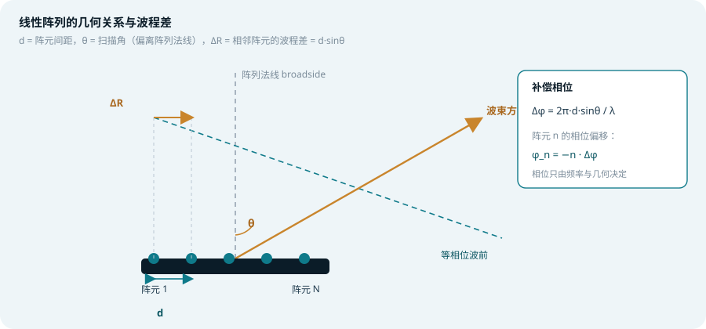
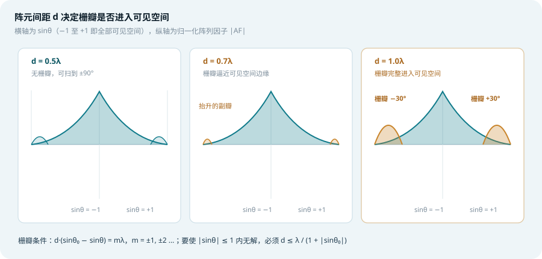
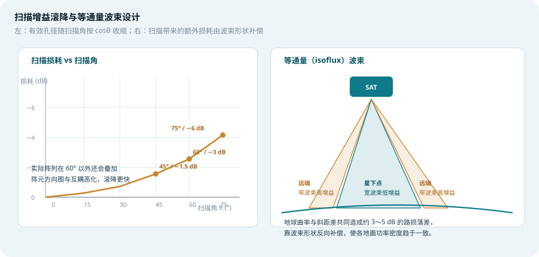
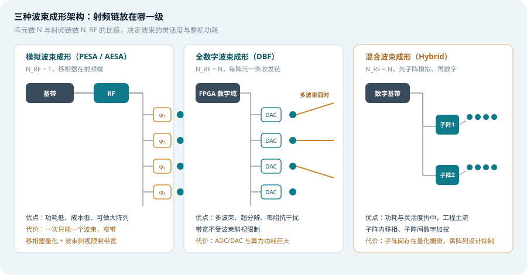
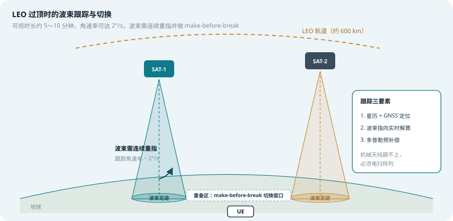

## 本篇要解决什么

前面在 [5G NTN 专题](5g-ntn.html) 里讲过，非地面网络把时延和多普勒放大到地面网络的千倍量级。但还有一块被跳过了：**这些信号究竟是怎么从天上打下来的**。

卫星通信的链路预算从来都是「增益换一切」。LEO 卫星距地 600 km，信号在自由空间里按距离平方衰减；要在有限的星上功率下把链路做通，唯一可行的办法是把能量**聚成一个很窄的波束**。而这颗波束还必须能**动**——LEO 过顶只有 5～10 分钟，卫星以约 7.5 km/s 相对地面飞过，波束指向必须连续重指，否则覆盖区会在几秒内滑出。

机械转动天线（俗称「锅」）做得到吗？理论上可以，但角速率跟不上、寿命受机械磨损限制、一颗星上无法同时生成多个波束。于是**相控阵（Phased Array）**成为唯一答案：用**电的方式**改变波束指向，没有机械运动部件，可以在微秒级完成波束重指，还能同时生成多个波束。

> **一条主线**：相控阵的核心机制只有一句话——**控制每个阵元发射相位的梯度，就能控制波束方向**。本篇其余内容，都是在回答「这个梯度具体怎么算」以及「它的物理限制在哪里」。

对照：**TS 38.101-5**（NTN 射频要求）、**TS 38.300 §16.14**（NTN 总体）。
相关：[5G NTN 非地面网络](5g-ntn.html)、[大规模 MIMO 与波束赋形](massive-mimo-beamforming.html)、[天线端口、QCL 与资源网格](antenna-port-qcl-resource-grid.html)、[NR SRS](nr-srs.html)。

---

## 一、先建立物理直觉：波程差

先忘掉所有公式，只看一个最简单的模型：**两个阵元，间距 d**。

假设我们要把波束指向与阵列法线成 θ 的方向。波从阵列射向远处时，**离目标更近的那个阵元，需要先把信号发出去**——因为在同一时刻，两个阵元的信号到达远场同一点时，靠前的阵元多走了 \(d\sin\theta\) 的距离。

距离差对应时间差：

\[
\Delta t = \frac{d\sin\theta}{c}
\]

对应相位差：

\[
\Delta\varphi = 2\pi f \cdot \Delta t = \frac{2\pi d \sin\theta}{\lambda}
\]

这就是相控阵的**全部秘密**。工程上不去算时间，只在每个阵元前放一个**移相器**，给第 n 个阵元施加相位：

\[
\varphi_n = -n \cdot \Delta\varphi = -n \cdot \frac{2\pi d \sin\theta}{\lambda}
\]

负号表示「越靠前的阵元落后越多」。当所有阵元的信号在远场**同相叠加**时，那个方向就成了主波束方向。

*图 1：线性阵列的几何关系。ΔR 为相邻阵元的波程差，Δφ 为补偿相位*

**关键洞察**：移相器只改变相位，不改变频率。这意味着**阵列本身是全通的**——同一套硬件，只要重新设置相位，就能在微秒内扫到任意方向。这正是相控阵相对机械天线的根本优势。

---

## 二、阵列因子：N 个阵元叠加出什么

单个阵元的方向图通常很宽（半波振子近似全向），但**阵列的总方向图**是两个东西的乘积：

\[
G_{\text{array}}(\theta) = G_{\text{element}}(\theta) \times |AF(\theta)|
\]

其中 **AF（Array Factor，阵列因子）** 才是决定波束形状的主角。对 N 个等间距、等幅馈电的线性阵列，设波束指向 θ₀，归一化阵列因子为：

\[
|AF(\theta)| = \left| \frac{\sin\left(\frac{N\psi}{2}\right)}{N \sin\left(\frac{\psi}{2}\right)} \right|,
\quad \psi = \frac{2\pi d}{\lambda}\left(\sin\theta - \sin\theta_0\right)
\]

这个式子长得像 sinc 函数，行为也像：

- **主瓣**出现在 ψ = 0，即 θ = θ₀
- **零点**出现在 Nψ/2 = kπ，k = ±1, ±2 …，共 N−1 个
- **副瓣**夹在零点之间，第一副瓣比主瓣低约 **−13.2 dB**（等幅馈电时）

### 2.1 波束宽度：阵列越大，波束越窄

主瓣的**半功率波束宽度（HPBW）**近似为：

\[
\theta_{3dB} \approx \frac{0.886\,\lambda}{N d \cos\theta_0} \quad (\text{弧度})
\]

注意分母里的 **N·d**——它就是阵列的**物理孔径长度 L**。所以：

\[
\theta_{3dB} \approx \frac{0.886\,\lambda}{L \cos\theta_0}
\]

物理直觉很直白：**孔径越大，波束越窄，增益越高**。一个 1 m 孔径的 Ka 波段（30 GHz，λ = 10 mm）阵列，正扫描时波束宽度约 0.5°，对应增益约 40 dBi 量级。

### 2.2 增益：阵列规模与效率

宽边方向（θ₀ = 0）的阵列增益近似为：

\[
G_{\text{array}} \approx G_{\text{element}} \times N \times \eta_{\text{array}}
\]

其中 η_array 是**阵列效率**，包含了馈电网络损耗、移相器插损、阵元互耦、幅相量化误差等一系列非理想因素。工程上典型取值在 **0.6～0.8** 之间，也就是「理论增益打七折」。

> **易混点**：N 个阵元带来 N 倍功率增益，但**不改变**总辐射功率（每个阵元功率不变）。阵列做的事是把能量**从不需要的方向搬到需要的方向**，而不是凭空放大。这是「增益」这个词最容易误解的地方。

---

## 三、阵元间距：λ/2 这条硬红线

整个相控阵设计里，**阵元间距 d 是唯一一个一旦定下就改不动的几何参数**。它由两个相互拉扯的约束决定。

### 3.1 上界：不能出现栅瓣

**栅瓣（Grating Lobe）**是相控阵最需要警惕的现象：它与主瓣**增益完全相同**，但指向别的方向。这意味着你的功率有一半打到了不该打的地方——对卫星来说，这既是效率损失，也常常是**干扰合规问题**。

栅瓣的成因来自阵列因子的周期性。ψ 每变化 2π，阵列因子就重复一次。当阵列因子在 θ₀ 处出现主瓣时，在满足下式的 θ 处也会出现同增益的栅瓣：

\[
\frac{2\pi d}{\lambda}\left(\sin\theta - \sin\theta_0\right) = \pm 2\pi m,
\quad m = 1, 2, 3\ldots
\]

化简：

\[
\sin\theta = \sin\theta_0 \pm \frac{m\lambda}{d}
\]

因为可见空间**必须**满足 \(|\sin\theta|\le 1\)，要让它无解，最坏情况发生在 θ₀ 与待考察方向反向时，即 \(|\sin\theta_0| + m\lambda/d > 1\)。对 m = 1 取最严条件：

\[
d \le \frac{\lambda}{1 + |\sin\theta_0|}
\]

**扫描到 ±90° 时要全程无栅瓣，就必须 d ≤ λ/2**。

| 阵元间距 | 无栅瓣的最大扫描角 | 说明 |
| --- | --- | --- |
| 0.4λ | 90°（全程） | 裕量充足，但孔径效率偏低 |
| **0.5λ** | **90°（临界）** | **业界标准取值** |
| 0.6λ | 约 56° | 低轨宽扫描场景开始吃力 |
| 0.7λ | 约 45° | 只能做有限扫描 |
| 1.0λ | **0°**（正扫即出现） | 栅瓣完整落在可见空间 |

*图 2：d 增大时栅瓣逐步进入可见空间。d = λ 时 ±30° 处已有与主瓣同增益的栅瓣*

### 3.2 下界：不能阵元互耦

那是不是 d 越小越好？不是。当天线间距小于约 **0.3λ** 时，相邻阵元之间会出现强烈的**互耦（mutual coupling）**：

- 阵元输入阻抗随扫描角剧烈变化，导致**有源驻波比恶化**
- 一部分能量被邻近阵元吸收而不是辐射出去，**阵列效率下降**
- 阵元方向图畸变，宽角扫描时增益滚降加剧

所以工程取值落在 **0.4λ ～ 0.5λ** 这个狭窄窗口里。这也是为什么卫星相控阵在高频段（Ka、Q/V）能做得很紧凑——λ 小，0.5λ 的物理尺寸就小，同样面积能塞进更多阵元。

### 3.3 需要注意的两个例外

上面推导都基于「等间距、等幅、均匀阵列」。有几个变体：

- **非均匀阵列 / 稀疏阵列**：人为打乱阵元间距，把栅瓣能量**打散成许多低电平副瓣**。代价是口径效率降低、设计复杂度上升
- **子阵式混合阵列**：子阵内部满足 λ/2，子阵之间间距远大于 λ/2，此时会出现**子阵栅瓣（量化栅瓣）**，需要用子阵级加窗或随机相位扰动抑制（见第五节）

---

## 四、扫描：为什么波束越偏，增益越低

这是相控阵最容易被忽略、却最影响系统设计的特性。

阵列的**有效孔径**是按入射/出射方向的投影计算的。当波束扫描到 θ₀ 时，从那个方向看过去的有效口径只有：

\[
A_{\text{eff}}(\theta_0) = A \cos\theta_0
\]

因此增益随扫描角的滚降为：

\[
\frac{G(\theta_0)}{G(0)} \approx \cos\theta_0
\quad\Longrightarrow\quad
L_{\text{scan}}(\text{dB}) = 10\log_{10}(\cos\theta_0)
\]

| 扫描角 θ₀ | cosθ₀ | 增益损失 |
| --- | --- | --- |
| 0° | 1.000 | 0 dB |
| 30° | 0.866 | −0.6 dB |
| 45° | 0.707 | −1.5 dB |
| 60° | 0.500 | **−3.0 dB** |
| 75° | 0.259 | −5.9 dB |

**注意这是纯几何模型的结论。** 实际阵列在 60° 以外还要叠加：

- 阵元自身方向图的偏离衰减（阵元通常设计成宽边最强）
- 互耦导致的阻抗失配与效率下降
- 高扫描角下的交叉极化恶化

所以真实滚降比 cosθ 陡得多。行业里一个务实的说法是：**商用阵列标称「±60° 扫描」，但真正保证性能的工作范围通常是 ±45°**。

*图 3：左为 cosθ 扫描损耗曲线；右为等通量波束的增益分配示意*

> **这直接决定了卫星星座的架构**：如果单副阵只能可靠覆盖 ±45°，那覆盖全球就需要相当多的卫星，或者采用**多面阵拼装**（一颗星上装 3～6 个阵面，分别朝不同方向）、或者把波束**下倾到地面再交给地面网络**。这是「相控阵性能」与「星座规模」之间真实的成本权衡。

---

## 五、四种架构：射频链放在哪一级

同样的阵列，**射频链（RF chain）的位置**决定了它的能力上限和功耗代价。这是相控阵选型的核心问题。

### 5.1 无源相控阵（PESA）

**单套收发机 + 功分网络 + 每阵元移相器。**

- 发射时：一路大功率信号被功分到所有阵元，各自移相后辐射
- 接收时：所有阵元信号移相后合路，送入单个接收机
- 优点：结构最简单、成本与功耗最低、适合做大孔径
- 缺点：**同一时刻只能形成一个波束**；移相器插损直接吃掉发射功率；接收端噪声系数被合路网络恶化

PESA 在早期雷达与地球站里常见，在现代 LEO 通信载荷中已基本被取代。

### 5.2 有源相控阵（AESA）

**每个阵元后面挂一个 T/R 组件（收发前端）**，内含小功率放大器、低噪放、移相器。

- 优点：**发射损耗极低**（放大发生在阵元近端，不用先经过长馈线）；单个 T/R 组件失效只损失 1/N 的增益（**优雅降级**）；接收噪声系数好
- 缺点：N 个 T/R 组件的成本、功耗、散热是主要瓶颈
- 能力：**多波束能力有限**——如果只有一个数字通道，多波束仍要靠模拟波束成形网络

AESA 是当前绝大多数通信卫星载荷的实际形态。

### 5.3 全数字波束成形（DBF）

**每个阵元配一整套 ADC/DAC 与数字收发链**，波束形成全部在数字域完成。

- 优点：**理论上可同时形成数量接近阵元数的波束**；可以做超分辨测向、自适应**零陷抗干扰**（把零陷对准干扰源）；波束加权系数可软件重配
- **没有波束斜视（beam squint）问题**：模拟移相器的相位与频率绑定，宽带信号下不同频点的指向会偏离，全数字用真时延或频域加权解决
- 缺点：ADC/DAC 数量与阵元数相同，**功耗与算力（FPGA/ASIC）开销呈数量级上升**。一个 1000 阵元的 Ka 阵列若做全数字，仅 ADC 功耗就可能达到数百瓦——对卫星是灾难性的

所以全数字通常只用在：小规模阵列、地面网关站（供电与散热不受限）、或者作为**子阵级**的数字处理。

### 5.4 混合波束成形（Hybrid）

**折中方案，也是 5G 毫米波与卫星载荷的工程主流。**

把阵列划分为若干**子阵**：

- **子阵内部**：用模拟移相器完成粗波束指向（N_sub 个阵元共享一个射频链）
- **子阵之间**：用数字加权完成细波束成形与多波束生成

设 N 个阵元、N_RF 个射频链，则：

\[
\text{射频链压缩比} = \frac{N}{N_{\text{RF}}}
\]

典型取值为 **4:1 到 8:1**。这个比值直接决定功耗与灵活度的平衡点。

> **混合阵列的代价**：子阵间距通常远大于 λ/2，会在子阵级产生**量化栅瓣**。抑制手段包括：子阵级加窗（如泰勒窗）、子阵之间引入随机相位扰动、采用**重叠子阵（overlapped subarray）**结构。这属于天线阵列设计的专业领域，也是「为什么实验室仿真很好、装机后旁瓣超标」的常见原因。

*图 4：PESA / DBF / 混合三种架构中射频链的位置对比*

### 5.5 一表对比

| 维度 | PESA（模拟） | AESA（模拟） | 混合 | 全数字 DBF |
| --- | --- | --- | --- | --- |
| 射频链数 | 1 | 1（N 个 T/R 组件） | N/R（R = 压缩比） | N |
| 同时波束数 | 1 | 少数 | 数个 | 接近 N |
| 功耗 | 极低 | 中 | 中高 | 极高 |
| 发射效率 | 低（移相器插损） | 高 | 高 | 高 |
| 抗干扰零陷 | 无 | 有限 | 有限 | **强** |
| 波束斜视 | 有 | 有 | 有（子阵内） | **无** |
| 典型场景 | 老式雷达 | 通信载荷 | 5G 毫米波 / 现代载荷 | 网关站 / 小阵列 |

---

## 六、落到 LEO：跟踪、切换与多普勒

现在把相控阵放回它最典型的场景——LEO 卫星通信。

### 6.1 跟踪需求有多苛刻

一颗 600 km 高度的 LEO 卫星，过顶时相对地面的角速率在**天顶附近约 1°/s，低仰角处可达 2°/s 以上**。整段可视时间约 **5～10 分钟**。

对比一下机械天线的能力：典型电动跟踪座的方位轴转速量级在 **3～10°/s**，看似够用，但：

- 过顶时方位角变化率接近无穷大（角度奇点），需要**方位-俯仰-斜轴**三轴结构规避
- 机械磨损在真空中是寿命杀手，卫星设计寿命 5～7 年，机械部件难以保证
- **一台天线只能看一颗星**，无法同时跟踪多颗做软切换

相控阵完全没有这些问题：波束重指靠**改相位**，微秒级完成；无活动部件；通过混合波束成形可**同时形成多个波束**。

### 6.2 波束切换：make-before-break

LEO 卫星过顶后必然要移交到下一颗。切换窗口里的关键要求是 **make-before-break**：新链路**先建立**，再断开旧链路，避免业务中断。

这对天线提出的要求是：

1. 阵列必须能**在切换窗口内同时指向两颗卫星**（两个波束）
2. 或者星上装载**多个阵面**，各自负责不同方向
3. UE 侧（如手持终端）如果只有一个阵面，就需要**双波束能力**或者快速波束切换

这也是为什么全数字 DBF 和混合架构在多波束场景下更受青睐——**PESA 根本做不了 make-before-break**，因为它只有一个波束。

### 6.3 多普勒与相位：一个容易被忽略的耦合

[5G NTN 专题](5g-ntn.html) 里讲过 LEO 的多普勒可达数十 kHz。在相控阵语境下，还有一个额外的细节：

**波束指向会随频率漂移。** 因为移相器补偿的是相位，而相位与频率绑定：

\[
\Delta\varphi = \frac{2\pi d \sin\theta}{\lambda} = \frac{2\pi d f \sin\theta}{c}
\]

同一组移相器设置，在 f 和 f + Δf 两个频点对应的实际指向不同。这称为**波束斜视（beam squint）**。当信号带宽相对载频不可忽略时（毫米波段尤其明显），宽带信号的边缘频点会明显偏离主波束方向。

解决方案：
- **真时延（TTD, True Time Delay）**：用延迟线代替移相器，相位延迟与频率解耦。代价是体积和损耗
- **子阵级 TTD + 阵元级移相器**：TTD 补偿粗延迟，移相器做精调。这是宽带相控阵的标准做法
- **数字域频率相关加权**：全数字阵列的天然优势

*图 5：LEO 过顶时波束连续重指，并在重叠区完成 make-before-break 切换*

---

## 七、工程指标：EIRP 与 G/T

天线设计最终要被折算成链路预算里的两个数字。

### 7.1 EIRP（等效全向辐射功率）

\[
\text{EIRP} = P_{\text{TX}} + G_{\text{TX}} - L_{\text{feed}} \quad (\text{dB 形式})
\]

对相控阵卫星：

- \(P_{\text{TX}}\)：所有 T/R 组件发射功率之和（注意是**总和**，不是单元功率）
- \(G_{\text{TX}}\)：阵列增益，正扫描时取宽边增益，扫描时减去 \(10\log_{10}\cos\theta_0\)
- \(L_{\text{feed}}\)：馈电与移相网络损耗（AESA 下此项很小）

EIRP 直接决定下行链路的解调门限裕量，是卫星载荷最核心的能力指标。

### 7.2 G/T（接收增益与噪声温度比）

\[
G/T = G_{\text{RX}} - 10\log_{10}(T_{\text{sys}}) \quad (\text{dB/K})
\]

接收侧有三个容易忽略的因素：

- **阵元数量不直接提升 G/T**：N 个阵元合路使增益提升约 \(10\log_{10}N\)，噪声温度也按噪声功率合路，理论上信噪比只提升 \(10\log_{10}\sqrt{N}\)……
- 实际上，**降低前端噪声（低噪放的第一级）**对 G/T 的贡献往往比增加阵元更大
- 卫星面对的**地球噪声温度约 290 K**，冷空仅约 4 K。所以波束指向地球与指向冷空的噪声温度差别巨大，**G/T 是随扫描角变化的量**，链路预算里不能取常数

### 7.3 等通量（isoflux）波束

这是卫星天线设计的一个经典课题。卫星到地面各点的**斜距随仰角变化**：

- 星下点（nadir）：距离最短，路径损耗最小
- 覆盖边缘（低仰角）：距离显著拉长，路径损耗大数 dB

如果波束各方向增益相同，则**覆盖区中央功率密度偏高、边缘偏低**——边缘用户链路质量差，而中央功率被浪费。

**等通量波束**的思路是反向设计天线方向图：让**星下点方向增益低、覆盖边缘方向增益高**，使到达地面各点的功率密度趋于一致。

实现手段：
- 阵列幅度加权（阵元之间用不同激励幅度，形成预加权的方向图形状）
- 波束展宽与形状优化（用优化算法直接求解阵元权值）

这也解释了为什么卫星天线方向图在实际测试中往往显得「不规则」——它不是标准的 sinc 形，而是**为了匹配地面路径损耗而特地塑形的**。

---

## 八、和 5G 协议栈的交界处

相控阵本身属于射频与天线领域，3GPP 不管；但它的能力会通过**UE 能力上报**和**波束管理流程**渗进协议。

| 交界点 | 协议侧体现 | 说明 |
| --- | --- | --- |
| 波束管理 | SSB / CSI-RS 波束扫描与测量上报 | 见 [NR CSI-RS](nr-csi-rs.html) 的波束管理小节 |
| 上行波束训练 | SRS 的 `beamManagement` 用途 | 见 [NR SRS](nr-srs.html) |
| 空间关系 | PUCCH/PUSCH 的 `spatialRelationInfo` | 指示 UE 用哪个波束发送 |
| 天线端口 | 逻辑端口 ≠ 物理阵元 | 见 [天线端口与 QCL](antenna-port-qcl-resource-grid.html) |
| NTN 专项 | 星历、GNSS 定位、多普勒预补偿 | 见 [5G NTN 专题](5g-ntn.html) |
| 终端能力 | 波束对应关系、天线面板数 | Rel-16/17 的 `beamCorrespondence` 等 |

**一个容易混淆的点**：5G 里说的「天线端口」是**逻辑概念**，一个端口可以映射到成百上千个物理阵元。UE 看到的是「端口 0 的信道」，看不到背后那副 256 阵元的相控阵。协议层与物理层的抽象边界就在这里。

---

## 九、常见误区清单

整理几个在讨论相控阵时最常出现、也最容易致命的误判。

**误区一：阵元越多增益越高，所以越多越好。**
阵元数确实带来增益，但要注意：d 必须 ≤ λ/2 才能无栅瓣，所以固定面积下阵元数有上限；同时射频链、功耗、散热、成本都随 N 线性增长。**真正决定增益的是孔径面积**，不是阵元数量。

**误区二：阵列增益提升了发射功率。**
不对。阵列总辐射功率等于各阵元功率之和。增益来自**方向性**——把能量集中到窄波束里。辐射出去的总能量没变，只是分配方式变了。

**误区三：标称 ±60° 扫描就意味着 60° 处性能可用。**
标称值通常是「波束可控范围」，不等于「性能保证范围」。60° 处纯几何损耗就有 3 dB，叠加阵元方向图和互耦损耗后，实际链路预算要按 4～6 dB 留裕量。

**误区四：栅瓣只是效率损失。**
栅瓣的方向**是确定可知的**。如果它指向地面站保护区或者邻星覆盖区，就是实打实的**干扰合规问题**，可能直接导致卫星无法获批入网。这是 ITU 与各国频谱监管的硬要求。

**误区五：模拟移相器就够用，数字的没必要。**
在窄带、单波束场景下这是对的。但一旦涉及多波束、make-before-break 切换、抗干扰零陷、宽带波束斜视补偿，模拟方案就不够了。**架构选择取决于任务，不取决于技术水平高低。**

**误区六：波束越窄越好。**
波束窄意味着增益高，但也意味着**覆盖区小、波束切换频繁、对指向精度要求苛刻**。卫星载荷设计里有个经典的权衡：波束窄到一定程度，指向误差带来的增益损失就会抵消掉增益收益。

---

## 十、快速自测

1. 阵元间距 d = 0.5λ，扫描角 30° 时，相邻阵元的补偿相位差是多少？（用度表示）
2. 一个 64 × 64 的平面阵，工作在 20 GHz，若阵元间距取 0.5λ，阵列边长约为多少？
3. 为什么 d ≤ λ/2 是 ±90° 全扫描无栅瓣的充要条件？请用「可见空间」的概念解释。
4. 混合波束成形为什么要做子阵划分？子阵划分带来了什么新问题？
5. 波束斜视（beam squint）的物理成因是什么？真时延（TTD）为什么能解决它？
6. 卫星做「等通量波束」的目的是什么？为什么不能简单地用均匀增益波束？

参考要点

**1.** \( \Delta\varphi = 2\pi \cdot 0.5\lambda \cdot \sin 30° / \lambda = 2\pi \times 0.25 = \pi/2 = 90° \)。

**2.** λ = 15 mm，0.5λ = 7.5 mm，64 个阵元间距共 63 个间隔，边长 ≈ 63 × 7.5 mm ≈ 472.5 mm（约 0.47 m）。这解释了为什么毫米波阵列能做到手持尺寸。

**3.** 可见空间是 sinθ ∈ [−1, +1]。栅瓣出现的条件是 sinθ = sinθ₀ ± mλ/d。要让 m = 1 的栅瓣落在可见空间之外，需要 |sinθ₀| + λ/d > 1 对所有 θ₀ ∈ [−90°, 90°] 成立，取最坏情况 |sinθ₀| = 1，得 d < λ/2（临界取等号）。这是充要条件，因为反向上只要违反，栅瓣必然进入可见空间。

**4.** 子阵划分的目的是**减少射频链数量**，把数字处理做在子阵级而不是阵元级，从而大幅降低 ADC/DAC 与算力功耗。代价是子阵之间的间距远大于 λ/2，会产生**量化栅瓣**，需要用子阵级加窗或随机相位扰动来抑制。

**5.** 模拟移相器补偿的是**相位**，而相位延迟与频率绑定（Δφ = 2πfd sinθ/c）。当频率变化 Δf 时，等效的相位延迟对应不同的**时延**，指向随之漂移。TTD 用真实的**传输延迟线**代替移相器，使延迟量与频率解耦，从而消除斜视。

**6.** 因为卫星到地面各点的斜距不同，路径损耗差可达数 dB，均匀增益波束会导致覆盖区中央与边缘的功率密度悬殊。等通量波束通过反向塑形（星下点低增益、边缘高增益），让地面接收功率密度趋于一致，从而改善覆盖边缘的链路质量。

---

## 十一、与本站其它专题的连接

| 想了解 | 看哪篇 |
| --- | --- |
| 卫星链路的大尺度效应（时延 / 多普勒 / 定时补偿） | [5G NTN 非地面网络](5g-ntn.html) |
| MIMO 与波束赋形的基础概念 | [大规模 MIMO 与波束赋形](massive-mimo-beamforming.html) |
| 「天线端口」在协议里到底是什么 | [天线端口、QCL 与资源网格](antenna-port-qcl-resource-grid.html) |
| 波束管理与 CSI 测量 | [NR CSI-RS](nr-csi-rs.html) |
| 上行波束训练与 SRS 用途 | [NR SRS](nr-srs.html) |
| 这套东西属于哪份 3GPP 规范 | [3GPP 规范地图](3gpp-spec-map.html) |

---

## 延伸阅读

- **TS 38.101-5**——NR 在 FR1 NTN 频段的射频要求，含 UE 侧天线与功率相关指标。（[官方页面](https://www.3gpp.org/dynareport/38101-5.htm)）
- **TS 38.300 §16.14**——NTN 总体架构与移动性框架，理解卫星侧约束的起点。（[官方页面](https://www.3gpp.org/dynareport/38300.htm)）
- **ITU-R S.580 / S.465**——地球站天线方向图与旁瓣参考模型，栅瓣与旁瓣指标的监管来源。（[ITU-R 建议书目录](https://www.itu.int/rec/R-REC-S/en)）
- **TS 38.214 §5.2**——波束管理与 CSI 上报，协议侧与天线能力的接口。（[官方页面](https://www.3gpp.org/dynareport/38214.htm)）
